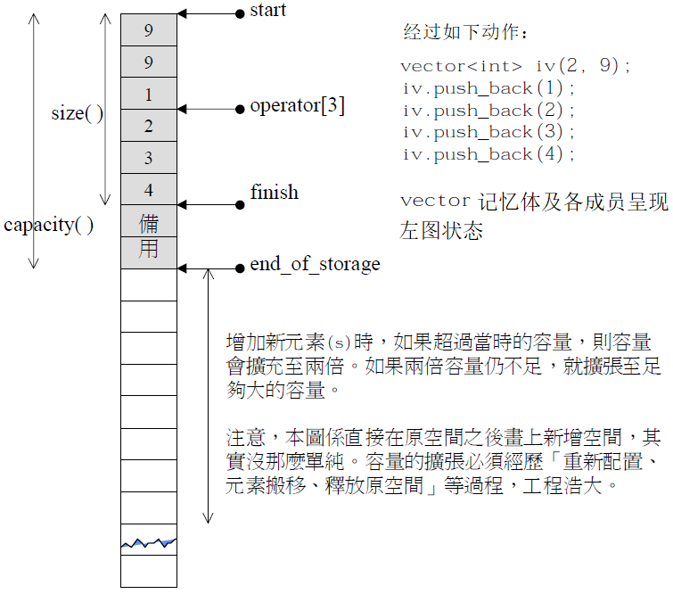
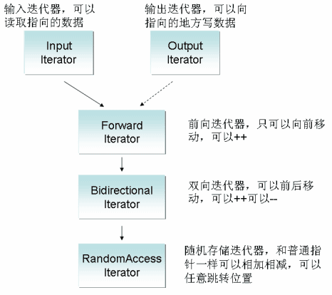
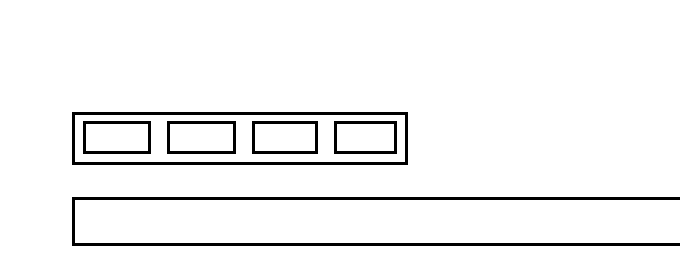

# vector

### 0. vector的介绍

vector是用数组实现的、可变长度的顺序容器，本质是一种类模板。

~~~cpp
template < 
	class T, // 元素类型
	class Alloc = allocator<T> > // 空间配置器类型

class vector; // 类模板声明
~~~

## 1. vector的接口

### 1.1 默认成员函数

| 接口声明                                                   | 解释                       |
| ---------------------------------------------------------- | -------------------------- |
| **`vector()`**                                             | **默认构造**               |
| `vecotr (size_type n, const_value_type& val=value_type())` | 填充构造，填充n个元素      |
| `vector(InputIter first, InputIter last)`                  | 范围构造，迭代器区间初始化 |
| **`vector(const vector& v)`**                              | **拷贝构造**               |
| **`vector& operator= (const vector& x)`**                  | **赋值重载**               |

### 1.2 容量操作

| 容量操作                                                     | 解释                           |
| ------------------------------------------------------------ | ------------------------------ |
| **`size_type size()`**                                       | **元素个数**                   |
| **`size_type capacity()`**                                   | **容量大小**                   |
| `size_type max_size()`                                       | 最大能存储的元素个数（无意义） |
| **`void reserve (size_type n);`**                            | **增加容量**                   |
| **`void resize (size_type n, value_type val = value_type());`** | **增减有效元素个数**           |

~~~cpp
v.reserve(100);   // 扩容到100
v.resize(100, 1); // 有效元素个数变为100,新增元素初始化为1
v.resize(10);     // 有效元素个数变为10
~~~


> 由图可知，vs下vector按1.5倍增容。

### 1.3 访问操作

| 接口声明                                         | 解释                   |
| ------------------------------------------------ | ---------------------- |
| **`reference operator[](size_type n)`**          | **返回下标位置的引用** |
| `const_reference operator[] (size_type n) const` |                        |
| `reference at(size_type n)`                      |                        |
| `const_reference at (size_type n) const`         |                        |

`[]`重载和`at`的区别是，`[]`越界会断言报错，`at`是抛异常。

| 迭代器接口      | 解释                             |
| --------------- | -------------------------------- |
| `begin`         | 起始位置的迭代器                 |
| `end`           | 末尾元素的下一个位置的迭代器     |
| `rbegin`        | 反向起始位置的迭代器             |
| `rend`          | 反向末尾元素的下一个位置的迭代器 |
| `cbegin`,`cend` | begin 和 end 的 const 版本       |

`[]`重载就已经能方便的访问 vector，但并不意味着放弃迭代器。大部分容器都支持迭代器访问，且迭代器使用简单规范统一。

STL 中容器的迭代器区间都是采用 $[first,last)$ 左闭右开的方式。

~~~cpp
//[]
for (size_t i = 0; i < v.size(); i++) {
    v1[i] += 1;
}

//iterator
vector<int>::iterator it = v.begin();
while (it != v.end()) {
    cout << *it << " ";
    it++;
}

for (auto e : v) {
    cout << e << " ";
}
~~~

### 1.4 修改操作

| 接口声明                                                     | 解释                   |
| ------------------------------------------------------------ | ---------------------- |
| **`void push_back (const value_type& val)`**                 | **尾插**               |
| **`void pop_back()`**                                        | **尾删**               |
| **`iterator insert (iterator pos, const value_type& val)`**  | **迭代器位置插入**     |
| `void insert (iterator pos, size_type n, const value_type& val);` | 迭代器位置插入         |
| `void insert (iterator pos, InputIter first, InputIter last)` | 迭代器位置插入一段区间 |
| **`iterator erase (iterator pos)`**                          | **迭代器位置删除**     |
| `iterator erase (iterator first, iterator last)`             | 删除一段迭代器区间     |
| `void assign (size_type n, const value_type& val)`           | 覆盖数据               |

~~~cpp
v.insert(ret, 30);
v.insert(ret, 2, 30);
v.insert(ret, v2.begin(), v2.end());
v1.erase(pos);
v1.erase(v1.begin(), v1.end());
~~~

```cpp
#include <algorithm>
// 查找接口
template <class InputIter, class T>
   InputIter find (InputIter first, InputIter last, const T& val);
```

&nbsp;

## 2. vector的模拟实现



### 2.1 类的定义

~~~cpp
template <class T, class Alloc = alloc>
class vector {
public:
    typedef T* iterator;
    // ...
private:
    iterator start;
    iterator finish;
    iterator end_of_storage;
}
~~~

这个结构和顺序表结构稍有不同，但本质是一样的。只是将容量和元素个数的变量用指向对应位置的迭代器代替。

~~~cpp
class Seqlist {
    T* _a;            /* start */
    size_t _size;     /* finish - start */
    size_t _capacity; /* end_of_storage - start */
}
~~~

### 2.2 默认成员函数

~~~cpp
//default constructor
vector()
    : _start(nullptr)
    , _finish(nullptr)
    , _end_of_storage(nullptr)
{}
//fill constructor
vector(size_t n, const T& val = T())
    : _start(new T[n])
    , _finish(_start + n)
	, _end_of_storage(_finish)
{
	memset(_start, val, sizeof(T) * n);
}
//copy constructor
vector(const vector<T>& v)
    : _start(new T[v.capacity()])
	, _finish(_start + v.size())
	, _end_of_storage(_start + v.capacity())
{
    memcpy(_start, v._start, sizeof(T) * v.size());
}
~~~

~~~cpp
//range constructor
template <class InputIterator>
vector(InputIterator first, InputIterator last) 
    : _start(nullptr)
	, _finish(nullptr)
	, _end_of_storage(nullptr)
{
	while (first != last) 
	{
		push_back(*first++);
    }
}
//copy constructor
vector(const vector<T>& v) 
    : _start(nullptr)
	, _finish(nullptr)
	, _end_of_storage(nullptr)
{
    vector<T> tmp(v.begin(), v.end());
    swap(tmp);
}
~~~

> 从范围构造可以看出类模板中的函数也可以是函数模板。

#### 迭代器的分类

函数模板的模板参数要传迭代器区间时，命名是有规定的，范围构造中的`InputIterator`就是一种指定的迭代器类型。因容器的结构各有不同，迭代器分为五种类型：

| 迭代器类型             | 名称            | 解释                                                 | 适用容器            |
| ---------------------- | --------------- | ---------------------------------------------------- | ------------------- |
| input/output_iterator  | 输入/输出迭代器 | 只读迭代器只能读取，只写迭代器可以写入该位置的值     | 无实际容器          |
| forward_iterator       | 向前迭代器      | 只能向前移动（++），允许在迭代器位置进行读写         | forward_list        |
| bidirectional_iterator | 双向迭代器      | 可以双向移动（++,--），允许在迭代器位置进行读写      | list, map, set      |
| random_access_iterator | 随机迭代器      | 支持指针运算，可移动（++,--）任意跳转（+,-）读写(\*) | deque,vector,string |

可以看出，下方的迭代器类型是上方的父类，也就是说**下方迭代器满足上方的所有要求**。



之所以划分出不同的迭代器类型，是为了限制传入的迭代器的类型，因为其必须满足指定的需求才能完成接下来的函数。 

例如范围构造的参数指明迭代器类型为`InputIterator`，意思是满足输入迭代器的要求的迭代器都可以作此参数。故此处我们可以传入任意的迭代器。

> 一般像底层是数组连续空间实现的容器，例如 vector, string 等的迭代器类型都是随机迭代器。像双向链表这样的非连续空间的容器的迭代器类型是双向迭代器。

- 通过复用构造函数的范围构造重载版本可以实现拷贝构造的现代写法。记得要初始化一下指针不然构造出来的随机值会影响之后的释放。

~~~cpp
//overload operator=
vector<T>& operator=(vector<T> v)  /* pass by value */
{
    swap(v);
    return *this;
}
//destructor
~vector() {
    delete[] _start;
    _start = _finish = _end_of_storage = nullptr;
}
~~~

- 赋值重载的现代写法都是这么写的，只要实现了拷贝构造就可以。

### 2.3 容量接口

~~~cpp
void resize(size_t n, const T& val = T()) {
    if (n > size()) {
        if (n > capacity()) {
            reserve(n);
        }
        while (_finish != _start + n) 
        {
            *_finish = val;
            _finish++;
        }
    }
    //_finish = _start + n; //迭代器的遍历以达到更新_finish位置的效果。
}
~~~

- 缺省值采用`T()`的形式，即用 T 类型的匿名对象作`val`的缺省值。`T()`是调用默认构造函数的初始化出的对象，得到的是 T 类型的空值。

> 模板泛型编程兴起时，C++ 为了让模板参数适用于所有类型，对内置类型也优化出了构造函数。

~~~cpp
void reserve(size_t n)
{
    if (n > capacity()) {
    	size_t oldSize = size();
        //增容
        T* tmp = new T[n];
        if (_start) {
            memcpy(tmp, _start, size() * sizeof(T));
            delete[] _start;
        }
        // 更新迭代器位置
        _start = tmp;
        _finish = _start + oldSize;
        _end_of_storage = _start + n;
    }
}
~~~

- **在`_start`更新前计算出有效元素个数`oldSize`**，用于更新增容后的`_finish`的地址，等到`_start`被修改后才计算就无法得到正确的结果。

#### memcpy 浅拷贝问题

~~~cpp
vector<string> v;
v.push_back("1111111");
v.push_back("1111111");
v.push_back("1111111");
v.push_back("1111111");
v.push_back("1111111"); //增容浅拷贝
~~~

> 假如用 vector数组存储 string 对象，四次尾插元素都没问题，当第五次尾插元素时出现了内存问题。

其实，第五次尾插出现问题，是因为第五次时正好数组已满需要增容。而模拟实现的`reserve`函数使用`memcpy`将原空间的内容按字节拷贝至新空间。

1. 若 vector存储的是内置类型的数据，则浅拷贝至新空间没有问题。
2. 若 vector存储的是自定义类型的数据，由于浅拷贝粗暴地复制变量后再释放原空间，使得新变量指向已释放的空间。



如图所示，将对象中的原变量浅拷贝一份，再释放原空间，导致拷贝来的新变量指向了已释放的空间。故应该改为深拷贝。深拷贝需要调用自定义类型的拷贝构造或者赋值重载。

> 模拟实现的 reserve 是从堆上直接用 new 开辟一块空间，顺带初始化该段空间，所以深拷贝调用赋值重载即可。库中的容器都是从内存池上开辟空间，则需要调用定位 new 初始化空间再调用拷贝构造去拷贝数据。 

~~~cpp
void reserve(size_t n) 
{
    if (n > capacity()) {
        size_t oldSize = size();
        T* tmp = new T[n];
        if (_start) {
            //memcpy(tmp, _start, size() * sizeof(T));
            for (int i = 0; i < size(); i++) {
                tmp[i] = _start[i];//_start指向的空间存任意类型都能完成深拷贝
            }
            delete[] _sta rt;
        }
        _start = tmp;
        _finish = _start + oldSize;
        _end_of_storage = _start + n;
    }
}
~~~


### 2.4 修改接口

~~~cpp
iterator insert(iterator pos, const T& val)
{
    assert(_start <= pos && pos <= _finish); //检查pos位置是否合法
    // 增容
    if (_finish == _end_of_storage) {
        size_t sz = pos - _start;
        reserve(capacity() == 0 ? 4 : capacity() * 2); //增容会导致迭代器失效，迭代器位置陈旧
        pos = _start + sz; //增容后更新pos
    }
    // 后移 [pos,_finish)
    iterator end = _finish;
    while (end != pos) {
        *end = *(end - 1);
        --end;
    }
    // 插入
    *pos = val;
    ++_finish;
    return pos; //返回迭代器最新位置
}
~~~

- 插入元素必然考虑增容，增容后`_start`指向新空间，但迭代器位置`pos`并没有改变仍然指向原空间的某个位置，也就是迭代器失效。所以要在**增容前计算`pos`相对`_start`的位置，待增容后更新`pos`使之指向对应的位置即可**。
- `insert`函数内迭代器失效的问题解决了，但函数外的`pos`实参并没有改变仍然指向陈旧的错误位置，故将更新的`pos`迭代器作返回值返回。

> ~~~cpp
> vector<int>::iterator pos = find(v.begin(), v.end(), 2);
> if (pos != v.end()) 
> {
>        pos = v.insert(pos, 20); // 更新 pos 实参
> }
> ~~~
>
> 只能采用返回值的形式，不可以通过传引用解决，因为可能会传入临时对象等。

```cpp
iterator erase(iterator pos)
{
    assert(_start <= pos && pos < _finish);
    /*iterator begin = pos;
    while (begin != _finish) {
        *begin = *(begin + 1); // 越界访问 -> begin=_finish-1时，begin+1 == _finish
        begin++;
    }*/
    iterator begin = pos + 1;
    while (begin != _finish)
    {
        *(begin - 1) = *begin;
        begin++;
    }
    _finish--;
    return pos; //返回迭代器最新位置
}
```

- 遍历循环的临界条件是下标`!=`尾元素的后一个位置（不可访问），则下标最终会遍历到尾元素，即访问范围已足够，因此不可在循环内使下标加值如：`*(begin+1)`。

~~~cpp
vector<int>::iterator pos = v1.begin();
while (pos != v1.end()) {
    //删除所有偶数
    if (*pos % 2 == 0) { 
        pos = v1.erase(pos);//删除后pos复位
    }
    else {
        ++pos;//不符合删除条件的才进位
    }
}
~~~


- `erase`同样有迭代器失效的问题，**删除后 pos 就已经指向了下一个元素，再直接`++pos`会跳过该元素**。须不符合删除条件时再 ++。
- `pos=erase(pos)`保证删除后 pos 的位置依然正确，避免有些少见的 STL 版本可能会缩容导致`pos`为野指针。

> 漏掉元素是 erase 删除元素出现的所有问题的根源。迭代器失效的问题只有在连续使用迭代器时才会出现。不光 vector会迭代器失效，只要能够使用迭代器访问的容器，都可能发生迭代器失效的问题。

&nbsp;

## 3. vector的OJ题

| 题目                                                         | 题解                                                         |
| ------------------------------------------------------------ | ------------------------------------------------------------ |
| [只出现一次的数字](https://leetcode.cn/problems/single-number/description/) | [【简洁明了】只出现一次的数字 I](https://leetcode.cn/problems/single-number/solutions/2148111/jian-ji-ming-liao-zhi-chu-xian-yi-ci-de-resn0/) |
| [杨辉三角](https://leetcode.cn/problems/pascals-triangle/description/) | [【简洁明了】cpp 杨辉三角](https://leetcode.cn/problems/pascals-triangle/solutions/2148504/jian-ji-ming-liao-cpp-yang-hui-san-jiao-r68z0/?orderBy=newest_to_oldest) |
| [删除有序数组中的重复项](https://leetcode.cn/problems/remove-duplicates-from-sorted-array/) | [【双指针 简单明了】数组去重](https://leetcode.cn/problems/remove-duplicates-from-sorted-array/solutions/2148460/shuang-zhi-zhen-jian-dan-ming-liao-shu-z-9p32/?orderBy=newest_to_oldest) |
| [只出现一次的数字 II](https://leetcode.cn/problems/single-number-ii/) | [【简单明了 注释】只出现一次的数字](https://leetcode.cn/problems/single-number-ii/solutions/2149532/jian-dan-ming-liao-zhu-shi-zhi-chu-xian-1iwno/) |
| [只出现一次的数字 III](https://leetcode.cn/problems/single-number-iii/) | [【详细解析】只出现一次的数字 系列 I II III](https://leetcode.cn/problems/single-number-iii/solutions/2152031/xiang-xi-jie-xi-zhi-chu-xian-yi-ci-de-sh-1vsp/) |
| [多数元素](https://leetcode.cn/problems/majority-element/description/) | [【哈希 排序 投票】三种解法 简洁明了](https://leetcode.cn/problems/majority-element/solutions/2148590/ha-xi-pai-xu-tou-piao-san-chong-jie-fa-j-qzoi/) |
| [连续子数组的最大和](https://leetcode.cn/problems/lian-xu-zi-shu-zu-de-zui-da-he-lcof/) | [【动归】连续子数组的最大和](https://leetcode.cn/problems/lian-xu-zi-shu-zu-de-zui-da-he-lcof/solutions/2148610/dong-gui-lian-xu-zi-shu-zu-de-zui-da-he-ovcf3/) |
| [电话号码的字母组合](https://leetcode-cn.com/problems/letter-combinations-of-a-phone-number/) | [【注释解析 回溯】电话号码字母组合](https://leetcode.cn/problems/letter-combinations-of-a-phone-number/solutions/2148604/zhu-shi-jie-xi-hui-su-dian-hua-hao-ma-zi-uokb/) |
