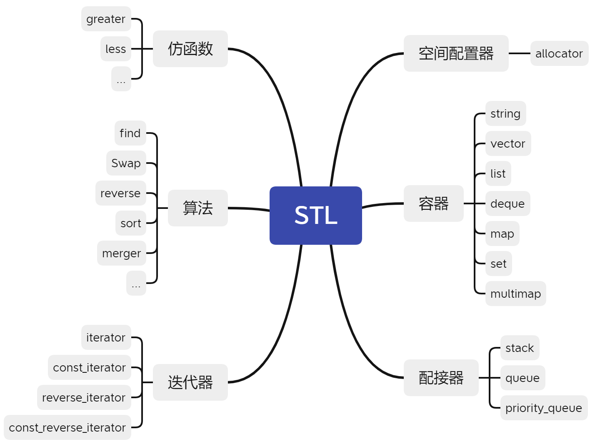
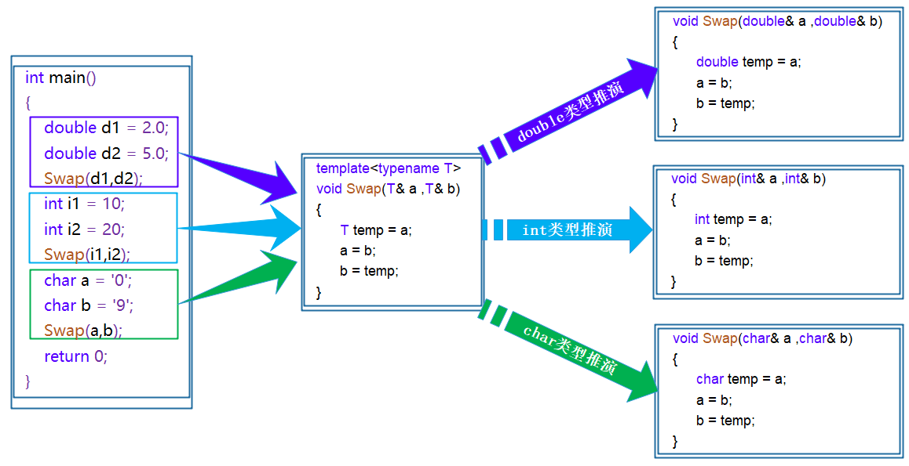
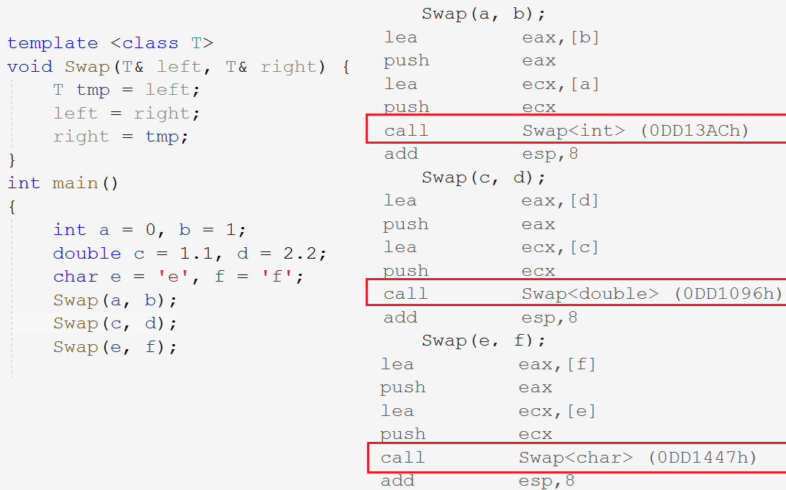
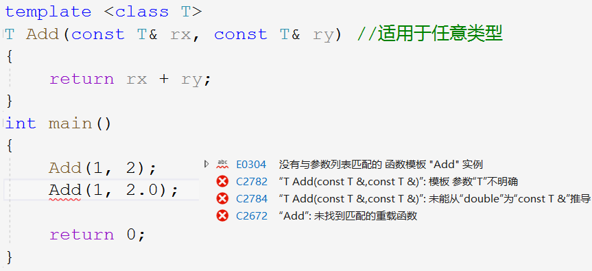
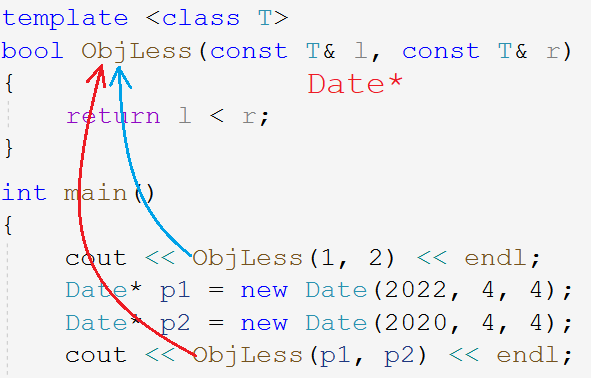
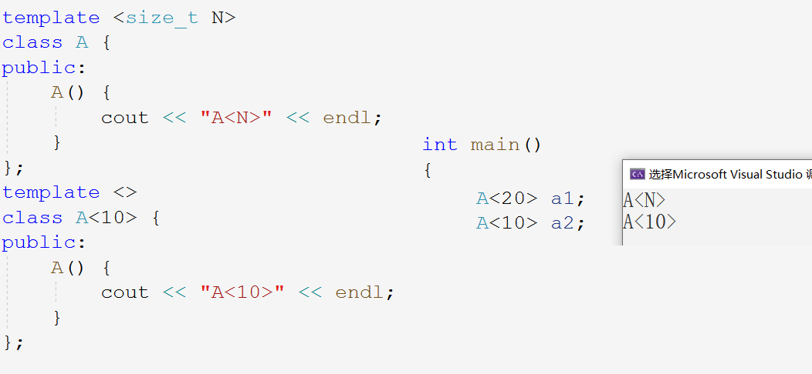
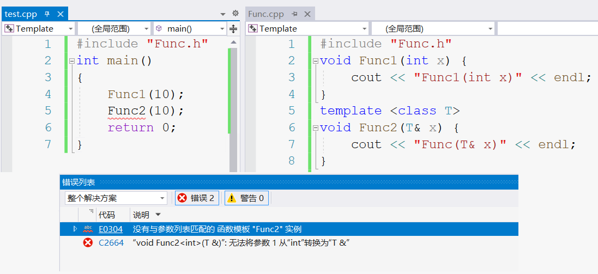
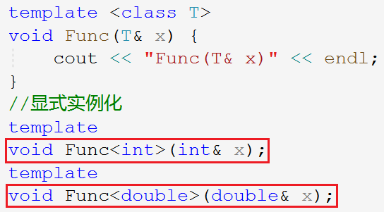

# 模板编程

### STL 简介

STL（standard template libaray）是 C++ 标准库的重要组成部分：标准模板库。STL 不仅是一个可复用的组件库，而且是一个包罗数据结构与算法的软件框架。

> 网上有句话说：“不懂 STL，不要说你会 C++ ”。STL 是 C++ 中的优秀作品，有了它的陪伴，许多底层的数据结构以及算法都不需要自己重新造轮子，站在前人的肩膀上，健步如飞的快速开发。

#### STL 的缺陷

1. STL库的更新太慢了。这个得严重吐槽，上一版靠谱是C++98，中间的C++03基本一些修订。C++11出来已经相隔了13年，STL才进一步更新。
2. STL现在都没有支持线程安全。并发环境下需要我们自己加锁。且锁的粒度是比较大的。
3. STL极度的追求效率，导致内部比较复杂。比如类型萃取，迭代器萃取。
4. STL的使用会有代码膨胀的问题，比如使用vector/vector/vector这样会生成多份代码，当然这是模板语法本身导致的。

## 1. 泛型编程

~~~cpp
void Swap(int& left, int& right) { // 交换两个整型变量
	int tmp = left;
	left = right;
	right = tmp;
}
void Swap(double& left, double& right) { // 交换两个浮点型变量
	double tmp = left;
	//...
}
void Swap(char*& left, char*& right) { // 交换两个指针变量
	char* tmp = left;
	//...
}
~~~

> 上述代码，模块功能相似，只是处理的数据类型不同，为每种类型都写出对应的代码，复用率可维护性低。

可以在函数中传入通用的数据类型，从而合并代码，泛型的出现就是专门解决这个问题的。泛型编程的定义就是：编写与类型无关的代码，是一种代码复用的手段。

C++泛型编程就体现在模板上，用模板来抽象类型。模板分为函数模板和类模板。

## 2. 函数模板
### 2.1 函数模板的格式

函数模板代表了一个函数家族，该函数模板与类型无关，类型在使用时被参数化，**根据实参类型产生函数的特定函数版本**。

~~~cpp
//1.
template <class T1, class T2, ..., class Tn>
返回类型 函数名 (参数列表) 
{}
//2.
template <typename T1, typename T2, ..., typename Tn>
返回类型 函数名 (参数列表) 
{}
~~~

> 如上两种方式都可以，typename 和 class 都是用来定义模板关键字的。

~~~cpp
// 交换两个变量
template <class T>
void Swap(T& left, T& right) {
	T tmp = left;
	left = right;
	right = tmp;
}
~~~

### 2.2 函数模板的原理

> 当不同数据类型调用该函数模板时，使用的是同一个函数吗？

函数模板本是个“蓝图”，是编译器产生特定具体类型函数的模具，它本身**是模板而不是函数**。

在编译阶段，编译器根据传入的实参类型，推演生成对应类型的函数以供调用。

> 参数类型不同，函数就不同。函数地址不同，可见**调用的不是同一个函数**。

### 2.3 函数模板的实例化

不同类型的参数使用该函数模板的过程，称为函数模板的实例化。模板参数实例化分为两种：隐式实例化和显式实例化。

- 隐式实例化：编译器根据实参**自动推演参数的实际类型**的模板实例化过程。

- 显式实例化：函数名后`<>`中**指定模板参数的类型**的实例化过程。

~~~cpp
template <class T>
T Add(const T& rx, const T& ry) {
	return rx + ry;
}
int main()
{
	int a = 10, b = 20;
	double c = 3.33, d = 4.44;
    //1. 隐式实例化
	Add(a, b);
	Add(c, d);
    //2. 显式实例化
	Add<int>(a, d);
	Add<double>(a, d);	
    
    Add(a, d); // Err:类型不一致
	Add((double)a, d); // 提前强转参数类型
    return 0;
}
~~~

如果类型不匹配，编译器会尝试进行隐式类型转换，如果无法转换成功编译器将会报错。

### 2.4 函数模板的匹配原则

~~~cpp
int Add(const int& rx, const int& ry) // 适用于int类型
{
	return rx + ry;
}

template <class T> 
T Add(const T& rx, const T& ry) // 通用类型模板
{
	return rx + ry;
}
~~~

当存在和函数模板同名同参数列表的函数时，编译器会**优先调用普通函数而非模板**。

> 调用普通函数也可以省去模板实例化的环节。

函数模板不允许自动类型转换，但普通函数传参时允许发生隐式类型转换。

## 3. 类模板

使用 typedef 类型重命名不能完全满足我们的需要。只是将一个固定的类型重命名，并不属于泛型编程。

### 3.1 类模板的格式

定义格式和函数模板类似：

~~~cpp
template <class T1, class T2,..., class Tn>
class 类模板名 {
	//...  
};
~~~

~~~cpp
template <class T>
class Stack 
{
public:
	Stack(int capacity = 4) : _top(0), _capacity(capacity) {
		_data = new T[capacity];
	}
	~Stack() {
		delete[] _data;
		_top = _capacity = 0;
	}
	void Push(T x) {}
    
private:
	T* _data;
	int _top;
	int _capacity;
};
~~~

### 3.2 类模板的实例化

类模板和函数模板的实例化有所不同，类模板实例化必须要显式实例化，在模板类名后跟`<类型>`。

同样，**类模板是模板而不是类，实例化后生成的类才是真正的类**。

~~~cpp
//Stack是类模板名，Stack<int>才是类型
Stack<int> st1;
Stack<double> st2;
~~~

成员函数声明定义分离，函数体定义在类外时，不仅要声明函数所属类域，还要声明模板类型。

~~~cpp
template <class T> // 声明模板类型
void Stack<T>::Push(T x) { // 声明所属类域
	_data[top++] = x;
	//...
}
~~~

&nbsp;

## 4. 非类型模板参数

模板的参数不一定是`<class T>`这样的虚拟类型参数，还有非类型的模板参数。

~~~cpp
template <class T> //类型参数
class A;
template <size_t I> //非类型参数
class A;
~~~

比如实现一个静态的栈结构，限定数组的大小可以宏定义的方式，也可以采用定义常变量的方式，当然也可以使用非类型模板参数：

~~~cpp
//#define N 100
template <class T, size_t N = 100>
class Stack {
    //...
private:
	T _a[N];
};
Stack<int> st1;
Stack<int, 200> st2;
~~~

C++并不推荐使用宏，因为宏的缺点很多。使用非类型模板参数可以灵活控制该常量的数值。

- 非类型模板参数的**类型只能是整型家族类型**，也就是`char`，`short`，`int`，`long`等。
- 非类型模板参数**只能是常量**，和宏一样都是在编译阶段被替换成对应的常量。
- 非类型模板参数**支持给缺省值**，和普通参数的缺省值一样只能从右到左给。

&nbsp;

## 5. 模板的特化

### 5.1 函数模板特化

通常情况下，使用模板可以实现一些与类型无关的代码，但对于一些特殊类型的可能不能得到想要的结果，比如：

当`T`被实例化为基本类型时，能够完成任务，但是当`T`被实例化为指针类型时，需求并不是比较指针的大小而是比较指针所指向的对象的大小。

此时该模板就不能起作用，需要重载出一个版本专门针对对象指针类型的比较函数，特化该函数的参数。

~~~cpp
template <class T>
bool ObjLess(T l, T r) {
	return l < r;
}
template <>
bool ObjLess<Date*>(Date* l, Date* r) { //针对对象指针类型
	return *l < *r;
}
~~~

函数模板特化是从原来的函数模板特化出一个类型专有的版本，相当于针对一个类型的特殊解法。

当函数模板特化不如直接重载一个版本，模板特化在函数处显得比较鸡肋。

> 模板特化主要是用于类模板特化。

### 5.2 类模板特化

类模板特化和函数模板特化差不多，都是针对某些特殊类型进行特殊处理，用在类处就是特化类的成员变量的类型。

#### 全特化

全特化是模板参数列表中所有模板参数都进行特化。

~~~cpp
template <class T1, class T2>
class Data {
public:
	Data() {
		cout << "Data<T1, T2>" << endl;
	}
private:
	T1 _a;
	T2 _c;
};
template <>
class Data<int, char> { // 特化处理int,char类型
public:
	Data() {
		cout << "Data<int, char>" << endl;
	}
private:
	int _a;
	char _c;
};
~~~

#### 偏特化

只限制部分参数为固定类型，其他仍是模板参数类型。

~~~cpp
template <class T1>
class Data<T1, char> //第二个模板参数为char
{
public:
	Data() {
		cout << "Data<T1, char>" << endl;
	}
private:
	T1 _a;
	char _c;
};
~~~

换言之，特化是对模板参数的进一步限制，如下代码所示，模板参数的指针和引用也算特化。

~~~cpp
template <class T1, class T2>
class Data<T1*, T2*> 
{
public:
	Data() {
		cout << "Data<T1*, T2*>" << endl;
	}
private:
	T1 _a;
	char _c;
};
template <class T1, class T2>
class Data<T1&, T2&>
{
public:
	Data() {
		cout << "Data<T1&, T2&>" << endl;
	}
private:
	T1 _a;
	char _c;
};
~~~

非类型模板参数也可以用来特化。

## 6. 模板分离编译

一般一个项目为方便维护，都是采用声明和定义分离的形式。`.h`文件放类的定义和函数的声明，`.cpp`文件放函数的具体声明。

当对模板进行声明和定义分离时，会出现找不当该函数的链接错误：

`test.cpp`中有`Func2()`的声明，所以编译的时候没有报错，待链接时查找`Func2`的符号表发现并没有`void Fun2(int x)`这样可调用的函数。

因为模板都是在编译时实例化出对应的版本，但编译时（还没到链接）当前文件并没有该函数的调用，就没有生成对应的函数，故链接时报出没有可匹配的函数实例的错误。

> `Test.cpp`中有函数调用但没有函数定义，等链接时到`Func.cpp`中查找函数，`Func.cpp`中有函数定义但没有调用，就没有生成对应的函数实例。

### 解决方法

声明和定义不要分离，都放到`.h`文件即可，编译时就能确定变量的地址。

其次，还有一种显式实例化的方法，在`Func.cpp`文件里显式实例化出对应需要的类型版本。但需要手动指定还是很麻烦的。

## 7. 模板总结

| 优点                                                         |
| ------------------------------------------------------------ |
| 模板复用代码，节省资源，更快的迭代开发，C++的标准模板库(STL)因此而产生 |
| 增强了代码的灵活性                                           |
| **缺点**                                                     |
| 模板会导致代码膨胀问题，也会导致编译时间变长                 |
| 出现模板编译错误时，错误信息非常凌乱，不易定位错误           |