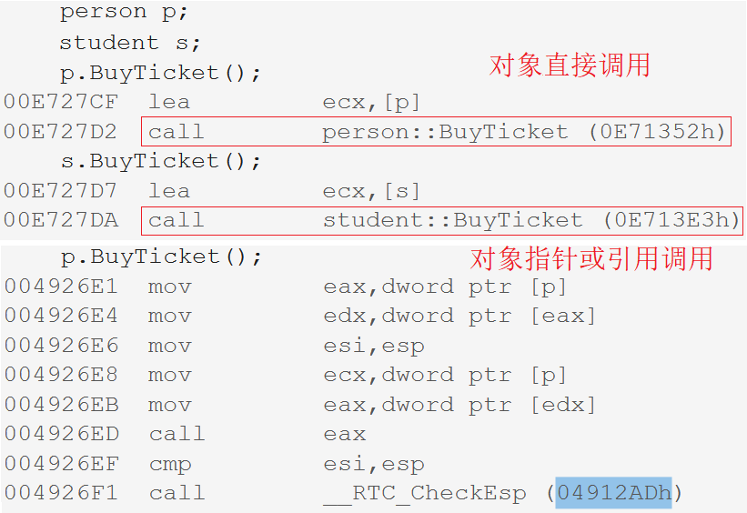

# 多态

## 1. 多态的概念

面向对象的三大特性：封装、继承、多态。多态即多种形态，具体的来说就是，**针对同一种行为，不同的对象执行其会产生不同的结果**。而之所以“不同的对象”会执行同一种行为，是因为这些对象具有继承关系。

- 静态多态：就是在编译时就已经确定的多态，编译器在编译时根据函数类型，推断出要调用那个函数。静态多态可以认为就是函数重载。
- 动态多态：父类对象的指针或引用去调用被重写的一个函数，能实现不同的结果。所谓动态是运行时确定的，根据调用对象的不同来确定调用那个函数。

> 本章主要讲解动态的多态。

多态首先是建立在继承的基础上的，具有继承关系的对象才会产生多态。多态是指不同的子类在继承父类后分别调用了父类同一个成员函数，表现出不同的结果。

比如学生类 Student 继承了人类 Person，他们都有一个行为叫买票，区别是学生半价而成人全价。

~~~cpp
class Person {
public:
	virtual void BuyTicket() { cout << "成人全价" << endl; }
};
class Student : public Person {
public:
	virtual void BuyTicket() { cout << "学生半价" << endl; }
};
~~~

> 上述代码中，父子类中的`buyTicket`函数被重写，构成了多态。接下来讲解构成多态的条件。

### 1.1 虚函数

#### 虚函数的定义

`virtual`修饰的且本身是类中的非静态的成员函数，被称为虚函数。

>
> 1. 必须是类中的成员函数，
> 2. 加`virtual`关键词修饰。
>

~~~cpp
class Person {
public:
	virtual void BuyTicket() { cout << "成人全价" << endl; }
};
class Student : public Person {
public:
	virtual void BuyTicket() { cout << "学生半价" << endl; }
};
~~~

> 上述代码中的两个类成员函数`BuyTicket`就都是虚函数。在虚继承中也用到`virtual`关键字，但虚函数和虚继承没有任何关系。

#### 重写的构成条件

函数分别为父子类中的成员函数，具有继承关系。

1. 函数本身必须是**虚函数**，
2. 函数的**返回类型，函数名，参数列表，必须完全相同**。

满足以上条件，则称子类重新定义父类中有相同名称和参数的虚函数，即子类的函数重写（覆盖）了父类的函数。

##### 重写条件的例外

1. 协变 —— 允许子类重写的虚函数返回值不同，但只能是自身类对象的指针或引用。

> 父类的虚函数返回父类对象指针，子类的返回子类指针，此时虽函数返回值不同，但也满足重写，这种情况被称为协变。

2. 析构函数的重写 —— 表面父子类析构函数名不同，不满足重写条件，但析构函数名会被编译器修改为 destructor，故实际上函数名是相同的。

~~~cpp
class A            {  public:  virtual ~A() { cout << "~A()" << endl; }  };
class B : public A {  public:  virtual ~B() { cout << "~B()" << endl; }  };
//operator new + constructor
A* pa = new A; 
A* pb = new B; //动态申请的对象，交予父类指针管理，则需要定义析构函数为虚函数，构成重写和多态
//operator delete + destructor
delete pa; // pa->destructor()
delete pb; // pb->destructor() - 父类的指针成功调用构成多态的析构函数
~~~

3. 子类重写虚函数允许省略`virtual` —— 若父子类中构成重写的虚函数，可以只写父类虚函数的`virtual`，省略子类的，其他条件不变。

~~~cpp
class Person {
public:
	virtual void BuyTicket() { cout << "成人全价" << endl; }
	virtual ~Person() { cout << "~Person()" << endl; }
};
class Student : public Person {
public:
	void BuyTicket() { cout << "学生半价" << endl; }
	~Student() { cout << "~Student()" << endl; }
};
~~~

虽然子类重写的虚函数没有加 virtual 修饰，但其会先从父类继承下所重写的虚函数的属性，再完成的重写，故它也是虚函数。（同样，访问限定权限也可以继承下来）

> 若已显式定义父类的析构为虚函数，此时子类析构只要显式定义，无论是否加 virtual 关键字，都会与基类的析构构成重写。

### 1.2 多态的构成条件

**在继承中构成多态需要两个条件**：

1. 必须通过**父类的指针或引用**调用函数，且该函数必须是虚函数，
2. 子类必须对父类中的该虚函数进行**重写**。

> 简记成，重写条件：一虚三同；多态条件：父类的指针，重写的函数。

~~~cpp
void Func(Person& p) {
	p.BuyTicket();
}
Person p;
Student s;
Func(p); // 父类对象调用
Func(s); // 子类对象调用
~~~

> 从上述代码可知，构成多态必须是**父类的指针或引用**去调用重写的虚函数。只有父类的指针或引用才能作为参数被父子类对象赋值。

#### 多态的效果

- **构成多态的话，调用的哪个虚函数取决于传入的对象的类型** —— 跟对象有关。
- **不构成多态的话，调用的就是形参`p`类型中的同名函数** —— 跟类型有关。

> 故当不构成多态时，只会调用父类中的同名函数。

### 1.3 重载重写隐藏对比

#### 重载

- 函数在同一作用域
- 函数名相同，参数列表不同

#### 重写

- 函数分别在父子类作用域
- 函数名、参数、返回值完全相同
- 函数必须是虚函数

#### 隐藏

- 函数分别在父子类作用域
- 不满足函数名、参数、返回值完全相同或虚函数

### 1.4 final & override

C++11中新出的两个关键字，与继承和多态有关。

#### final 修饰类

若想使得一个类无法被继承，C++98 中可以将构造函数变成私有的，再借助静态成员函数返回构造的对象。

~~~cpp
class A {
private:
	A(int a = 0) 
		:_a(a)
	{}
public:
	static A CreateObj(int a = 0) {
		A* a = new A(a);
		return a;
	}
protected:
	int _a;
};
A a; //Err
A* pa = A::CreatObj(1);
~~~

但这样是一种间接的限制手段，C++11直接提供一个关键字 **final 放在类名的后面，防止该类被继承**。

> final 表示最终的意思，也就是该类是继承关系中最后的类。

~~~cpp
class A final { //final 修饰
public:
	A(int a = 0)
		:_a(a)
	{}
protected:
	int _a;
};
class B : public A {}; //Err
~~~

#### final 修饰虚函数

**final 修饰虚函数，致使其无法被子类中的虚函数重写**。和 final 修饰的类无法被继承，有异曲同工之妙。

~~~cpp
class C {
protected:
	virtual void f() final { // final 修饰虚函数
		cout << "C::f()" << endl;
	}
};
class D : public C {
protected:
	virtual void f() { // Err - 无法构成重写
		cout << "D::f()" << endl;
	}
};
~~~

#### override

override 放在子类的虚函数的参数后面，用来辅助检查子类的虚函数是否重写了父类的虚函数，相当于对重写的断言。

~~~cpp
class C {
protected:
	virtual void f() {
		cout << "C::f()" << endl;
	}
};
class D : public C {
protected:
	virtual void f() override { // 检查是否完成重写
		cout << "D::f()" << endl;
	}
};
~~~

> 只要没有构成重写关系，就会报错。

&nbsp;

## 2. 抽象类

### 2.1 纯虚函数和抽象类

在**虚函数的声明后面加上`=0`，表示这个虚函数为纯虚函数**，也称作接口。纯虚函数可以实现不会报错，但一般只声明不实现，因为实现出来也无法调用。

**包含虚函数的类叫做抽象类**，或称接口类。抽象类不能实例化出对象，它的子类继承后，**只有重写了父类所有的纯虚函数，子类才能实例化出对象**。

这也是抽象类的设计模式，抽象类设计出来不是为了实例化出对象，它只是一个框架，为了被继承后用子类去重写其中的接口。

> 可以看出，一般只有一些高度抽象的、无具体定义的概念会被定义为抽象类，比如哲学、精神等概念。或者是提取众多事物中所共同的特性的概念，比如书、气体、人等概念。
>
> 通过这些抽象类可以具象化出一些对象，比如哲学之于马列主义、毛泽东思想， 或者书之于《Linux网络编程》、《C++prime》等，这些就可以是前者的子类。

~~~cpp
class Car { //抽象类
public:
	virtual void f() = 0; //纯虚函数
};
class BMW : public Car {  
public:
	virtual void f() {
		cout << "BMW" << endl;
	}
};
~~~

### 2.2 接口继承和实现继承

#### 实现继承

普通类的继承就体现了实现继承，子类继承了父类的成员函数，就可以使用父类的成员，继承的是父类成员函数的实现。

#### 接口继承

子类继承父类并重写其接口，以构成多态，就体现了接口继承。虚函数的继承是一种接口继承，继承的只是接口，而重写的是实现内容。

~~~cpp
class A {
public:
    virtual void func(int val = 1) { cout << "A->" << val << endl; }
    void test() { func(); } //A::this->func();
};
class B : public A {
public:
    void func(int val = 0) { cout << "B->" << val << endl; }
};
int main() {
    B* pb = new B;
    pb->test(); //B::this->test();
    return 0;
}
~~~

子类指针 pb 调用继承来的 test() 函数，本质是将子类指针传入 test() 成员函数参数中隐含的 this 指针。test() 函数中调用成员函数 func()，本质也是通过 this 指针调用，这 this 指针表面是父类的 this 指针，但传入的是子类指针 pb，构成了多态，因此调用到了子类中重写的虚函数 func() 。

其次，子类重写的 func() 虽然表面没加 virtual 修饰，但继承时就已将虚函数的属性从父类中继承下来。虚函数继承的是接口声明，重写的是实现内容。因此子类 func() 的参数 val 的缺省值为 1，故打印的是`B->1`。

&nbsp;

## 3. 多态的原理

> 类中只有一个整型成员和一个虚函数，类的大小却是8，难道虚函数占用类的空间？

### 3.1 虚函数表

#### 虚表指针

内部有虚函数成员的类，实例化后会有虚函数表指针 _vfptr 这一成员，简称虚表指针（virtual function pointer）。该指针存储在类的前四个字节的空间，它指向一块空间，被称为虚函数表，表中存储类里的虚函数的地址。

- 同类型实例化出的对象，其虚表指针的值和指向位置是完全相同的，因为都指向同一块空间。
- 虚表指针只是存储在类中作成员变量由编译器调用，不可以显式访问，故不讨论它是否具有成员变量的一些属性。

#### 虚表的底层原理

- 虚函数表实际上就是一块函数指针数组，以多态的方式调用虚函数时，编译器要通过虚表查找函数地址来调用。

- 父子类的虚表指针和虚表不相同，相当于是从父类中拷贝了一份。由于子类中重写了父类的虚函数，所以子类的虚表中**子类重写的虚函数直接覆盖了父类中被重写的虚函数的位置**。重写体现在语法上，而覆盖体现在原理层面上。
- 对象中存储的是虚表指针，指针指向虚表。虚表中存储的是虚函数的地址，而不是虚函数本身。虚函数和普通函数都存储在公共代码段，vs 下虚表存储在公共代码段。
- 虚表的最后放一个空指针，以标识虚表的存储边界。
- 子类的虚表生成过程：
  1. 先将父类的虚表内容拷贝一份至子类的虚表中，
  2. 如果子类重写了父类的虚函数，将子类的该虚函数地址覆盖至虚表中父类被重写的虚函数的位置，
  3. 子类新增的虚函数依次增加在虚表的尾部。

### 3.2 多态的实现原理

> - `Func(p)`中引用指向`p`对象，`p.BuyTicket()`会在`p`类对象的虚表中找到虚函数`Person::BuyTicket()`；
> - `Func(s)`中引用指向`s`对象，`s.BuyTicket()`会在`s`类对象的虚表中找到虚函数`Student::BuyTicket()`。

从上述过程可以看出，多态的构成条件可以解释为：

1. 必须是满足重写的虚函数：只有虚函数是放在虚表中，在**运行时才从对象的虚表指针成员中确定调用函数的地址**，而不是在编译阶段就确定的。虚表指针就存储在子类对象中，如此就可以确定子类重写的虚函数的地址，从而实现多态。
2. 必须是父类指针或引用：父类指针或引用能直接获得子类对象的虚表指针，**父子类对象进行赋值虚表指针不参与拷贝**，发生切片赋值的只是普通成员。

> 虚表指针不参与父子类的切片赋值，因为会导致父类对象中虚函数关系混乱。同类型的对象其虚表指针是完全相同的，故可以说虚表指针不参与赋值。

- 对象直接调用时，不构成多态，能直接调用虚函数。
- 对象的指针或引用调用时，构成多态，需要去虚表中查找虚函数的地址。

> 虚函数本就可以像普通成员函数一样调用，有了继承并重写后想构成多态才搞出虚表这样的机制以实现多态。C++中的虚函数的作用主要是实现多态的机制。
>
> 关于多态，简而言之就是用父类型别的指针指向其子类的实例，然后通过父类的指针调用实际子类的成员函数。这种技术可以让父类的指针有“多种形态”，这是一种泛型技术。所谓泛型技术，说白了就是试图使用不变的代码来实现可变的算法，要么是试图做到在编译时决议，要么试图做到运行时决议。

### 3.3 动态绑定与静态绑定

1. 静态绑定又称为前期绑定（早绑定），在程序编译期间确定了程序的行为，也称为静态多态，比如：函数重载。
2. 动态绑定又称后期绑定（晚绑定），是在程序运行期间，根据具体拿到的类型确定程序的具体行为，调用具体的函数，也称为动态多态。

&nbsp;

## 4. 不同继承关系的虚函数表

### 4.1 单继承的虚函数表

~~~cpp
class A {
public:
    virtual void vFunc1() { cout << "A::vFunc1()" << endl; }
    virtual void vFunc2() { cout << "A::vFunc2()" << endl; }
protected:
    int _a;
};
class B : public A {
public:
    virtual void vFunc1() { cout << "B::vFunc1()" << endl; } //重写父类的vFunc1
    virtual void vFunc3() { cout << "B::vFunc3()" << endl; }
    virtual void vFunc4() { cout << "B::vFunc4()" << endl; }
protected:
    int _b;
};
~~~

> 可以看到 vs 的监视窗口会隐藏子类本身具有的虚函数，因此只能换一种方式，通过程序打印出虚表。

| 名称           | 解释                                                       | 类型                                |
| -------------- | ---------------------------------------------------------- | ----------------------------------- |
| 虚函数的类型   | 类里实现的虚函数的类型                                     | **typedef void VF ();**             |
| 虚函数指针类型 | 虚函数指针指向虚函数，存储虚函数地址                       | **typedef void (*VF_PTR) ();**      |
| 虚表指针类型   | 虚表指针指向一堆虚函数指针的起始位置，存储虚函数指针的地址 | **typedef void (VF_TABLE_PTR) ();** |

> 如何获得虚表指针呢？

1. 虚表指针存储在类的最头上四个字节，故通过`(int*)&a`即可获得该四个字节。
2. 解引用虚表指针即可获得虚表的地址，也就是`*(int*)&a`
3. 虚表存放的是虚函数地址，也就是虚函数指针，需要将`*(int*)&a`强转成虚函数指针的指针类型`(VF_PTR*)*(int*)&a`，这就是虚表指针。
4. 解引用虚表指针，即可访问虚表中的存储的虚函数地址，通过函数地址可直接访问虚函数，无需解引用函数地址。

~~~cpp
typedef void(*VF_PTR)(); //虚函数指针

VF_PTR* vf_table_ptr = (VF_PTR*)*(int*)&a; //虚表指针

VF_PTR vf1_ptr = vf_table_ptr[0]; //vfun1指针
vf1_ptr();
VF_PTR vf2_ptr = vf_table_ptr[1]; //vfun2指针
vf2_ptr();
VF_PTR vf3_ptr = vf_table_ptr[2]; //vfun3指针
vf3_ptr();

typedef void(*VF_PTR)(); //虚函数指针
//打印虚表
void PrintVFTable(VF_PTR* table) 
{
	for (int i = 0; table[i] != nullptr; ++i) { //vs下虚表以0结尾
		printf("vf_table[%d][%p]->", i, table[i]);
		table[i]();
	}
}
PrintVFTable((VF_PTR*)*(int*)&a);
~~~

当然，如果想要程序在x86，x64平台都可以跑起来的话，可以修改成：

~~~cpp
PrintVFTable((VF_PTR*)*(void**)&b);
~~~

`void**`是二级地址类型，解引用后是`void*`一级地址类型。解引用后可根据平台大小自动改变长度。

### 4.2 多继承的虚函数表

~~~cpp
class A {
public:
    virtual void vFunc1() { cout << "A::vFunc1()" << endl; }
    virtual void vFunc2() { cout << "A::vFunc2()" << endl; }
    int _a;
};
class B {
public:
    virtual void vFunc1() { cout << "B::vFunc1()" << endl; }
    virtual void vFunc2() { cout << "B::vFunc2()" << endl; }
    int _b;
};
class C : public A, public B {
public:
    virtual void vFunc1() { cout << "C::vFunc1()" << endl; } //重写父类的vFunc1
    virtual void vFunc3() { cout << "C::vFunc3()" << endl; }
    int _c;
};
~~~

~~~cpp
//打印c对象中从A类继承下的虚表
PrintVFTable((VF_PTR*)*(void**)&c);
//打印c对象中从B类继承下的虚表
//	1.
PrintVFTable((VF_PTR*)*(void**)((char*)&c+sizeof(A))); //B
//	2.
B* pb = &c;
PrintVFTable((VF_PTR*)*(void**)pb);
~~~

从打印结果可以看出，多继承下子类独有的虚函数是放在第一个继承的父类的虚表中的。

### 4.3 菱形继承和虚拟继承

~~~cpp
class A {
public:
	virtual void vFunc1() { cout << "A::vFunc1()" << endl; }
	virtual void vFunc2() { cout << "A::vFunc2()" << endl; }
	int _a;
};
class B : public A {
public:
	virtual void vFunc1() { cout << "B::vFunc1()" << endl; } //重写虚基类的vFunc1
	virtual void vFunc2() { cout << "B::vFunc2()" << endl; }
	int _b;
};
class C : public A {
public:
	virtual void vFunc1() { cout << "C::vFunc1()" << endl; } //重写虚基类的vFunc1
	virtual void vFunc3() { cout << "C::vFunc3()" << endl; }
	int _c;
};
class D : public B, public C {
public:
	virtual void vFunc1() { cout << "C::vFunc1()" << endl; } //重写父类的vFunc1
	virtual void vFunc4() { cout << "C::vFunc3()" << endl; }
	int _d;
};
~~~

~~~cpp
class A {
public:
	virtual void vFunc1() { cout << "A::vFunc1()" << endl; }
	virtual void vFunc2() { cout << "A::vFunc2()" << endl; }
	int _a;
};
class B : public A {
public:
	virtual void vFunc1() { cout << "B::vFunc1()" << endl; } //重写虚基类的vFunc1
	virtual void vFunc2() { cout << "B::vFunc2()" << endl; }
	int _b;
};
class C : public A {
public:
	virtual void vFunc1() { cout << "C::vFunc1()" << endl; } //重写虚基类的vFunc1
	virtual void vFunc3() { cout << "C::vFunc3()" << endl; }
	int _c;
};
class D : virtual public B, virtual public C {
public:
	virtual void vFunc1() { cout << "C::vFunc1()" << endl; } //重写父类的vFunc1
	virtual void vFunc4() { cout << "C::vFunc3()" << endl; }
	int _d;
};
~~~

> 看菱形继承和虚拟继承下的虚表，从目前学习角度看意义不大，可以看以下两篇文章。

[C++ 虚函数表解析 (coolshell.cn)](https://coolshell.cn/articles/12165.html)

[C++ 对象内存布局 (coolshell.cn)](https://coolshell.cn/articles/12176.html)
