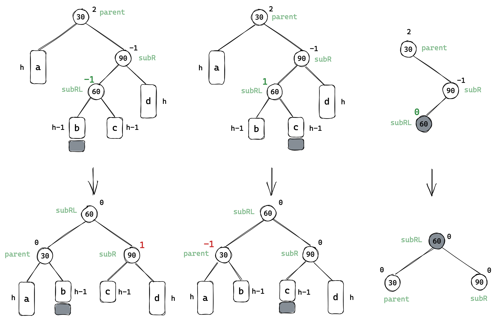
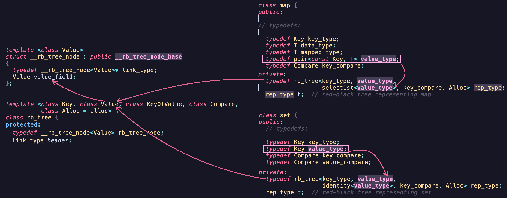
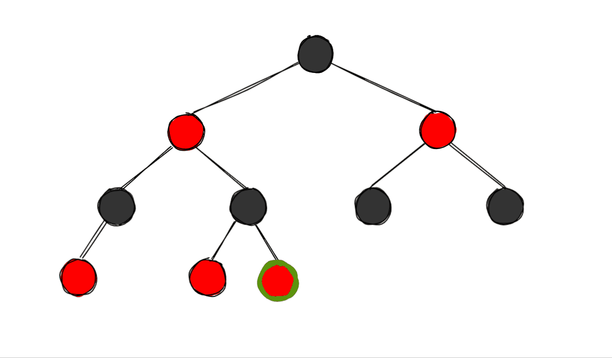

# map和set

# 1. 关联式容器

STL有六大组件，其中各种数据结构被称为容器。其中又分为序列式容器和关联式容器。

- 序列式容器有vector，list等底层为线性序列的数据结构，数据元素之间没有联系，只是用来存储数据。
- 关联式容器有map，set 等底层采用平衡搜索树这样的容器，存储的是`<key/value>`式的键值对，数据检索时比序列式容器效率要高。

## 1.1 键值对

用来表示具有一一对应关系的一种结构，该结构中一般只包含两个成员变量 key 和 value，key 代表键值，
value 表示与 key 对应的信息。

> 比如建立一个英汉互译的字典，字典中有单词和对应的翻译，单词与中文含义是——对应的关系。通过单词可找到对应的中文含义。

```cpp
template <class T1, class T2>
struct pair
{
  typedef T1 first_type;
  typedef T2 second_type;
  T1 first;
  T2 second;
  pair(): first(T1()), second(T2())
  {}
  pair(const T1& a, const T2& b): first(a), second(b)
  {}
}
```

&nbsp;

## 1.2 set

```cpp
template < class T,                        // type 元素数据类型
           class Compare = less<T>,        // compare 该数据类型的比较函数
           class Alloc = allocator<T>      // allocator_type 空间配置器
           > class set;
```

set 是按照一定次序存储元素的容器，所以set天然具有排序和去重的功能。set中的元素不能被修改，元素总是const，但是可以从容器中插入或删除它们。

### insert

```cpp
std::set<int> s;
s.insert(3);
s.insert(1);
s.insert(5);
s.insert(8);
s.insert(8);
s.insert(2);
s.insert(2);
std::set<int>::iterator it = s.begin();

while (it != s.end())
{
    std::cout << *it << " ";
    ++it;
}
// 1 2 3 5 8
```

set 底层采用的是平衡搜索树的结构，**自带去重和排序的机制**。

### erase

```cpp
     void erase (iterator position);
size_type erase (const value_type& val);
     void erase (iterator first, iterator last);
```

使用值删除时，返回值是删除元素的个数，可通过此判断是否删除成功。

```cpp
size_t ret = s.erase(30);
std::cout << "ret: " << ret << std::endl; // 使用值删除时，返回值是删除元素的个数

std::set<int>::iterator pos = s.find(30);

if (pos != s.end())
{
    s.erase(pos); // 删除不存在迭代器位置会报错
}
```

## 2.2 multiset

multiset 和 set 相比区别在于 multiset 没有去重机制，存储的元素可以重复。

```cpp
void TestMultiSet()
{
    std::multiset<int> s;

    s.insert(3);
    s.insert(1);
    s.insert(5);
    s.insert(8);
    s.insert(2);
    s.insert(5);
    s.insert(2);

    std::set<int>::iterator it = s.begin();

    while (it != s.end())
    {
        std::cout << *it << " ";
        ++it;
    }
}
// 1 2 2 3 5 5 8 8 
```

底层也是搜索二叉树，如果相同的话，可以插入左节点也可以是右节点。**对于多个重复值的节点，查找返回的是中序遍历的第一个遇到的节点**。

### erase

```cpp
std::set<int>::iterator pos = s.find(1);
while (pos != s.end() && *pos == 1)
{
    s.erase(pos);
    ++pos;
}
```

删除和迭代器遍历操作不可以放在一起，删除就改变了原有树的结构，再`++pos`就访问非法空间了。可以用下面更简单的方式。

```cpp
while (pos != s.end())
{
    s.erase(pos);
    std::cout << "找到了" << std::endl;
    pos = s.find(1);
}

int ret = 1;
while (ret)
{
    ret = s.erase(1);
    std::cout << "找到了" << std::endl;
}
```

**set 和 multiset 不支持修改已存在元素的值，因为会破坏搜索树结构**，返回值是`const`类型的，通过迭代器修改值也会直接报错。

```cpp
std::multiset<int>::iterator pos = s.find(2);
if (pos != s.end())
{
    *pos = 1; // Err
}
```

## 2.3 map

在map中，键值 key 通常用于排序和唯一地标识元素，键值 key 和值 value 的类型可能不同，key与value通过成员类型 value_type绑定在一起。

- map中的元素按照键值 key 进行排序。
- map支持下标访问符，可以找到与key对应的value。map通常被实现为平衡二叉搜索树（红黑树）。

### pair

理解 map 需要先熟悉一个概念 pair，pair 就是键值对是`key`和`value`的对应组合类型。实际上 pair 是被封装成一个结构体，被 map 使用的。

```cpp
template <class T1, class T2> struct pair;

typedef pair<const Key, Value> value_type;
```

T1 和 T2 两个模版参数分别对应 key 和 value。

### insert

```cpp
//1. 
pair<iterator, bool> insert (const value_type& val);
//2. 
iterator insert (iterator position, const value_type& val);
//3.
template <class InputIterator>
void insert (InputIterator first, InputIterator last);
```

| 类型          | 定义                                 | 解释                                   |
| ------------- | ------------------------------------ | -------------------------------------- |
| `value_type`  | `pair<const key_type,mapped_type>`   | 插入的元素类型，实际上是个`pair`键值对 |
| `key_type`    | `The first template parameter (Key)` | `pair`的第一个参数                     |
| `mapped_type` | `The second template parameter (T)`  | `pair`的第二个参数                     |

> 可见`key`值是不可修改的，因为要依次构建树。

```cpp
//1. 插入pair对象
dict.insert(kv1);
//2. 插入匿名对象
dict.insert(pair<string, string>("string", "字符串"));
//3. 使用函数间接调用构造
dict.insert(make_pair("arrary", "数组"));
```

> 上述三种都是调用第一种插入函数，`make_pair`的优势是简单方便。

插入返回的是迭代器和布尔值的键值对，布尔值返回是否插入成功，**如果插入成功迭代器返回的是插入位置，失败是已存在相同`key`值的元素位置**。

### erase

```cpp
     void erase (iterator position);
size_type erase (const key_type& k);
     void erase (iterator first, iterator last);
```

`erase`删除节点可以传迭代器，也可以传`key`进行遍历查找并删除。

### operator[]

```cpp
for (auto& kv : str) {
    countMap[str]++; // 统计次数
}
```

`[]`操作符就是用来通过`key`查找并返回对应的`value`。他的内部实现大概是：

```cpp
mapped_type& operator[] (const key_type& k)
{
    return (
              *(
                   (
                        this->insert( make_pair(k,mapped_type()) ) // 返回值是键值对
                   ).first // 获得键值对中的key 迭代器
               ) // 对迭代器解引用
           ).second; // 解引用迭代器访问value
    
    // 简单版本
    pair<iterator, bool> ret = insert(make_pair(k, mapped_type()));
    return ret.first->second;
}
```

> 一句话总结就是，从返回值中的迭代器获取元素对应的 value。

`[]`的功能包含：**插入、查找、修改**。调用`insert`函数，无则插入有则查找，返回类型是引用表示能够修改。

```cpp
map<string, string> dict;
dict.insert(make_pair("sort", "排序"));
dict.insert(make_pair("left", "左边"));
// 修改
dict["left"] = "剩余";       
// 插入 
dict["test"];                 
// 查找
cout << dict["sort"] << endl; 
// 插入+修改
dict["string"] = "字符串";     
```

## 2.4 multimap

`multimap`和`map`的区别是可存在重复数据。所以`multimap`没有`[]`操作符。

### count

`count`可以用来统计`key`的出现次数。

```cpp
cout << dict.count("left") << endl;
```

### 前K个高频单词

https://leetcode.cn/problems/top-k-frequent-words/

&nbsp;

# 2. 底层结构

## 2.1 AVL树

二叉搜索树的查找效率很高，但如果数据有序或者接近有序，搜索树就会退化成单支树，查找效率就会变成线性的。

解决上述问题的方法就是AVL树和红黑树：当向二叉搜索树中插入新结点后，**对树中的结点进行调整，保证每个结点的左右子树高度之差的绝对值不超过1**，降低了树的高度，从而减少平均搜索长度。

故AVL树又称为高度平衡二叉搜索树。

一棵AVL树要么是空树，要么是具有如下性质的二叉搜素树：

- 该树的左右子树都是AVL树，
- 左右子树的高度之差（简称平衡因子）的绝对值不超过1（-1/0/1）。


> AVL树不一定需要平衡因子，使用平衡因子是一种控制实现的方式。

这样的AVL树是高度平衡的，那么它的高度基本维持在 $log_2n$，搜索的时间复杂度也就维持在 $O(log_2n)$ 了。

### AVL树的插入


由于搜索二叉的特性，插入节点之后可能会违反AVL树的定义，如图所示，**新节点到根结点所在路径上的祖先节点的平衡因子都会发生改变**。

#### 更新平衡因子

- 如果插入在父节点的左边，父节点的平衡因子要减1；
- 如果插入在父节点的右边，父节点的平衡因子要加1；

1. 如果父节点的平衡因子更新后为0，说明所在树高度不变且已经平衡，不会影响到上层节点。
2. 如果父节点的平衡因子更新后为1/-1，说明所在树高度变化；
3. 如果父节点的平衡因子更新后为2/-2，说明子树已经不平衡，需要旋转处理。


```cpp
bool Insert(const pair<K, V>& kv)
{
    if (_root == nullptr) {
        _root = new Node(kv);
        return true;
    }

    Node* parent = nullptr;
    Node* curr = _root;

    while (curr) {
        if (curr->_kv.first < kv.first) {
            parent = curr;
            curr = curr->_right;
        }
        else if (curr->_kv.first > kv.first) {
            parent = curr;
            curr = curr->_left;
        }
        else {
            return false;
        }
    }

    curr = new Node(kv);
    if (parent->_kv.first < kv.first) { // 链接在右边
        parent->_right = curr;
        curr->_parent = parent;
    }
    else { // 链接在左边
        parent->_left = curr;
        curr->_parent = parent;
    }

    // 控制平衡
    // 1. 更新平衡因子
    // 2. 旋转处理异常平衡因子

    while (parent) { // 更新到根
        // 更新
        if (curr == parent->_left)
            parent->_bf--;
        else if (curr == parent->_right)
            parent->_bf++;

        // 检测
        if (parent->_bf == 0) { // 已经平衡，更新结束
            break;
        }
        else if (parent->_bf == 1 || parent->_bf == -1) // 向上更新
        {
            curr = parent;
            parent = parent->_parent;
        }
        else if (parent->_bf == 2 || parent->_bf == -2) // 平衡被打破，开始旋转
        {
            if (parent->_bf == -2 && curr->_bf == -1)
                RotateR(parent);
            else if (parent->_bf == 2 && curr->_bf == 1)
                RotateL(parent);
            else if (parent->_bf == -2 && curr->_bf == 1)
                RotateLR(parent);
            else if (parent->_bf == 2 && curr->_bf == -1)
                RotateRL(parent);
            break;
        }
        else { // 树构建出错
            assert(false);
        }
    }

    return true;
}
```

### AVL旋转处理

> 先看如图所示的树结构的抽象图，节点下方的矩形代表多种可能，分别是a，b，c子树，其高度都是h。


旋转的方式有四种，其**目的都是在在搜索树规则的条件下平衡二叉树**，平衡的结果就是树的整体高度减1，减少了遍历次数，提高了效率。

#### 右单旋


右子树新增一个节点，高度变成`h+1`，导致父节点的平衡因子变成`-1`，爷节点的平衡因子变成`-2`。此时爷节点 60 的平衡被破坏，就会引发右单旋。

**右单旋就是把平衡因子为`-2`的节点旋转至平衡因子为`-1`的节点的右子树上**。

此时存在有两种情况，平衡因子为`-1`的节点是否存在右子树：


1. 平衡因子为`-1`的节点不存在右子树，就直接把平衡因子为`-2`的节点直接链接到右子树上。


2. 平衡因子为`-1`的节点存在右子树，就把右子树链接到平衡因子为`-2`的节点的左边，再将平衡因子为`-2`的节点链接到右子树上。


```cpp
void RotateR(Node* parent)
{
    Node* subL = parent->_left;
    Node* subLR = subL->_right;

    // 右子树作父节点的左子树
    parent->_left = subLR;
    if (subLR)
        subLR->_parent = parent;

    Node* parentP = parent->_parent;

    // 父节点作当前节点的右子树
    subL->_right = parent;
    parent->_parent = subL;

    // 更新根节点或链接爷节点
    if (parent == _root)
    {
        _root = subL;
        _root->_parent = nullptr;
    }
    else
    {
        if (parentP->_left == parent)
            parentP->_left = subL;
        else
            parentP->_right = subL;
    }
    subL->_parent = parentP; // 维护三叉链

    // 更新平衡因子
    subL->_bf = 0;
    parent->_bf = 0;
}
```

#### 左单旋


左单旋就是节点插入在最右边的情况，和右单旋正好相反。同样也分是否存在左子树两种情况：


1. 平衡因子为`1`的节点没有左子树


2. 平衡因子为`2`的节点存在左子树


```cpp
// 左单旋
void RotateL(Node* parent)
{
    Node* subR = parent->_right;
    Node* subRL = subR->_left;

    // 先将左子树链接到父节点下
    parent->_left = subRL;
    if (subRL)
        subRL->_parent = parent;

    Node* parentP = parent->_parent; // 先保存父节点的父
    // 再将父节点链接到当前节点下
    subR->_left = parent;
    parent->_parent = subR;

    // 与所在树链接
    if (_root == parent)
    {
        _root = subR;
        _root->_parent = nullptr;
    }
    else
    {
        if (parentP->_left == parent)
            parentP->_left = subR;
        else
            parentP->_right = subR;

        subR->_parent = parentP; // 维护三叉链
    }

    // 更新平衡因子
    subR->_bf = parent->_bf = 0;
}
```

#### 左右双旋

左单旋右单旋分别是右边高左边旋和左边高右边旋转。双旋的情况并不是单纯的一边高，单纯单旋无法解决问题。

左右双旋的情况是新节点插入在左子树的右边，如下图所示，<u>对于`-2`这个轴点来说左边高，对于`1`来说是右边高</u>。


具体步骤是：

1. **先以平衡因子为`1`的节点为轴进行左单旋**；
2. **再以平衡因子为`-2`的节点为轴进行右单旋**。

	

```cpp
void RotateLR(Node* parent) {
    //...
    RotateL(parent->_left);
    RotateR(parent);
    //...
}
```


> 双旋就是由两个单旋组成，直接调用即可。

##### 平衡因子的更新


```cpp
void RotateLR(Node* parent)
{
    // 提前保存
    Node* subL = parent->_left;
    Node* subLR = subL->_right;
    int bf = subLR->_bf;  // 保存旋转前的左子树的右孩子的平衡因子

    RotateL(parent->_left);
    RotateR(parent);

    // subRL的平衡因子以区分情况
    if (bf == 1)         // 插入在右孩子的左边
    {
        parent->_bf = 1;
        subL->_bf = 0;
        subLR->_bf = 0;
    }
    else if (bf == -1)   // 插入在右孩子的右边
    {
        parent->_bf = 0;
        subL->_bf = -1;
        subLR->_bf = 0;
    }
    else if (bf == 0)    // 插入在中间
    {
        parent->_bf = 0;
        subL->_bf = 0;
        subLR->_bf = 0;
    }
    else {
        assert(false);
    }
}
```

> 更新平衡因子的问题放到下一个双旋中讲。

#### 右左双旋

右左双旋和左右双旋正好相反，<u>对于`-1`这个轴点来说左边高，对于`2`来说是右边高</u>。

1. 先以平衡因子为`-1`的节点为轴进行右单旋；
2. 再以平衡因子为`2`的节点为轴进行左单旋。


```cpp
void RotateRL(Node* parent) {
    //...
    RotateL(parent->_right);
    RotateR(parent);
    //...
}
```


##### 更新平衡因子

双旋后仍然要更新平衡因子，两个单旋中更新平衡因子并不适用于双旋的情况。

> 如下图所示，对这样的一棵树插入一个值为`14`的节点，触发右左双旋，旋转完成后节点的平衡因子出现错误。


右左双旋存在下图的三种的情况，前两种的平衡因子都需要特判并更新，三者的区别就是插入位置不同：



三种分别是**插入在左边，插入在右边，插入在中间，60的节点的平衡因子因此不同，分别为`-1, 1, 0`**。

因此可以按右子树的左孩子`subRL`的平衡因子来区分不同情况：

```cpp
// 右左双旋
void RotateRL(Node* parent)
{
    // 提前保存
    Node* subR = parent->_right;
    Node* subRL = subR->_left;
    int bf = subRL->_bf; // 保存旋转前的右子树的左孩子的平衡因子

    RotateR(parent->_right);
    RotateL(parent);

    // subRL的平衡因子以区分情况
    if (bf == 1)         // 插入在左孩子的左边
    {
        parent->_bf = -1;
        subR->_bf = 0;
        subRL->_bf = 0;
    }
    else if (bf == -1)   // 插入在左孩子的右边
    {
        parent->_bf = 0;
        subR->_bf = 1;
        subRL->_bf = 0;
    }
    else if (bf == 0)    // 插入在中间
    {
        parent->_bf = 0;
        subR->_bf = 0;
        subRL->_bf = 0;
    }
    else {
        assert(false);
    }
}
```

### AVL树的验证

```cpp
// 中序遍历
void Inorder()
{
    _Inorder(_root);
    cout << endl;
}
void _Inorder(Node* root)
{
    if (root == nullptr)
        return;
    if (root->_left) _Inorder(root->_left);
    cout << root->_kv.first << ":" << root->_kv.second << " ";
    if (root->_right) _Inorder(root->_right);
}

// 判断平衡
bool IsBalance()
{
    return _IsBalance(_root);
}
bool _IsBalance(Node* root)
{
    if (root == nullptr)
        return true;

    // 检查
    int leftHeight = Height(root->_left);
    int rightHeight = Height(root->_right);

    if (rightHeight - leftHeight != root->_bf)
    {
        cout << root->_kv.first << "现在是：" << root->_bf << endl;
        cout << root->_kv.first << "应该是：" << rightHeight - leftHeight << endl;
        return false;
    }

    // 判断高度差是否满足
    return abs(rightHeight - leftHeight) < 2 &&
        _IsBalance(root->_left) && _IsBalance(root->_right);
}

// 计算高度
int Height(Node* root)
{
    if (root == nullptr)
        return 0;

    int leftHeight = Height(root->_left);
    int rightHeight = Height(root->_right);

    return rightHeight > leftHeight ? rightHeight + 1 : leftHeight + 1;
}
```

> 至此，AVL树的学习就完成了，AVL树是为下面的红黑树作铺垫。
>
> 它的删除等其他操作我们不讲，包括之后的红黑树、B树也是这样。这些数据结构都是了解性的数据结构，理解即可。

### AVL树的性能

AVL是一棵严格平衡的搜索二叉树，可以保证查询效率高即 $log(N)$ 。但是对AVL树做一些结构修改的操作，性能却很低下。插入时要维护平衡，会出现多次旋转，更尤其是删除，可能要一直旋转到根。

因此，如果需要一种查询高效且有序的数据结构，而且不太常改变结构，可以考虑AVL树。

> AVL树在实际中不太常用，因为存在红黑树。

&nbsp;

## 2.2 红黑树

### 红黑树的定义

红黑树也是一种二叉搜索树，每个结点上都有一个颜色字段，可以是红或黑。 

通过对任何一条从根到叶的路径上各个结点着色方式的限制，**使之确保最长路径不超过最短路径的两倍，因而是接近平衡的**。 


#### 红黑树的性质

1. 每个结点只有两种颜色：红色和黑色。
2. 根节点是黑色的。
3. **红色节点的两个子结点都是黑色的**。（说明不能出现连续的红色节点）
4. **每条路径所含的黑色结点数量相等**。

> 5. 每个叶结点都是黑色的，此处的叶子结点指的是空结点。
>
> 对于红黑树，我们认为从根到空节点算一条路径，也就是整棵树有11条路径。

- 由加粗两条性质来看，最短路径肯定全是黑色节点，最长路径肯定是黑红相间的。

- **假设每条路径黑节点数量为$X$，则任意一条路径的长度满足 $X≤path\_length≤2X$**，即红黑树的高度满足 $X≤h≤2X$。
- 首先完全二叉树的高度和节点数量的关系是 $2^h-1=N$。推导到红黑树的节点个数满足：

$$
2^{X}-1≤N≤2^{2X}-1\\
=> \frac{1}{2}×log_2N≤X≤log_2N \quad => \quad log_4N≤X≤log_2N
$$

也就是说，红黑树的查找时间复杂度为 $log_2N≤O(N)≤2×log_2N$，显然AVL树的搜索效率 $log_2N$ 更高，红黑树只是接近平衡。

但由于CPU的速度足够快，二倍的差距并不明显，但AVL树存在更多的旋转维护树的结构更花时间，所以AVL树的应用没有红黑树多。

#### 红黑树的结构

```cpp
enum COLOR {
    RED,
    BLACK
};

template <class K, class V>
struct RBTNode {
    RBTNode* _left;
    RBTNode* _right;
    RBTNode* _parent;

    pair<K, V> _kv;
    enum COLOR _col;
};

template <class K, class V> 
class RBTree {
    typedef RBTNode<K, V> Node;
private:
    Node* _root;
};
```

### 红黑树的插入

红黑树也是搜索二叉树，插入的步骤都是一样的，不同的是维护插入后树的结构。由于红黑树的性质，每条路径的黑节点数量必须相同，**故新插入节点统一采用红色，对整个树的影响最小**。

```cpp
bool Insert(const pair<K, V> kv)
{
    if (_root == nullptr) {
        _root = new Node(kv);
		curr->_col = BLACK;
        return true;
    }

    Node* parent = nullptr;
    Node* curr = nullptr;

    while (curr) {
        if (curr->_kv.first < kv.first) {
            parent = curr;
            curr = curr->_right;
        }
        else if (curr->_kv.first > kv.first) {
            parent = curr;
            curr = curr->_left;
        }
        else {
            return false;
        }
    }

    curr = new Node(kv);
	curr->_col = RED;
    if (parent->_kv.first < kv.first) {
        parent->_right = curr;
        curr->_parent = parent;
    }
    else if (parent->_kv.first > kv.first) {
        parent->_left = curr;
        curr->_parent = parent;
    }

    // 控制平衡
    // ...
}
```

插入红节点后：

> 处理红黑树我们需要确认三个节点：插入新节点 $cur$、父节点 $p$、叔节点 $u$、爷节点 $g$。

- 如果其父节点是黑节点，则不影响树结构，不需要处理。
- 如果其父节点是红节点，则破坏了树中不能出现连续红节点的性质，需要进一步修改。

故修改树中节点的颜色须注意：


1. 把一个节点由红变黑，那么其兄弟节点必须全部变黑。
2. 把一个节点由黑变红，那么其子节点必须全部变黑。

这样所有路径的黑节点个数才不变。

| 情况                        | 解决方案           |
| --------------------------- | ------------------ |
| p为红，g为黑，u为红         | 变色+向上调整      |
| p为红，g为黑，u为黑或不存在 | 旋转+变色+向上调整 |

#### 情况一

**p为红，g为黑，u为红**。


1. 直接将父节点叔节点变黑和爷节点变红，这样就维护住了整个子树颜色。
2. 向上调整的时候`curr`直接调整到爷节点的位置。

如仍满足条件继续变色，并向上遍历。如果父节点为空或存在但为黑则停止循环。


```cpp
if (grandpa->_left == parent) // 父在左
{
    Node* uncle = grandpa->_right;

    /* 情况一：u存在且为红 */
    if (uncle && uncle->_col == RED) // 叔节点存在且为红
    {
        // 变色
        parent->_col = uncle->_col = BLACK;
        grandpa->_col = RED;

        // 向上调整
        curr = grandpa; // 越过父节点直接跳到爷节点
        parent = grandpa->_parent;
    }
    //...
}
else // 父在右
{
    Node* uncle = grandpa->_left;

    /* 情况一：u存在且为红 */
    if (uncle && uncle->_col == RED) // 叔节点存在且为红
    {
        // 变色
        parent->_col = uncle->_col = BLACK;
        grandpa->_col = RED;

        // 向上调整
        curr = grandpa; // 越过父节点直接跳到爷节点
        parent = grandpa->_parent;
    }
    //...
}
```

#### 情况二

**p为红，g为黑，u不存在或存在但为黑**。


##### 单旋情况

- 当前节点是父节点的左孩子，父节点是爷节点的左孩子，则进行右单旋；
- 当前节点是父节点的右孩子，父节点是爷节点的右孩子，则进行左单旋；
- 再将`curr`节点置黑，`g`置红。

> 下图过程仅作右单旋示例，左单旋同理。


##### 双旋情况

- 当前节点是父节点的右孩子，父节点是爷节点的左孩子，则进行左右双旋；
- 当前节点是父节点的左孩子，父节点是爷节点的右孩子，则进行右左双旋；
- 再将`curr`节点置黑，`g`置红。


```cpp
if (grandpa->_left == parent) { // 父在左
    Node* uncle = grandpa->_right;

    /* 情况一：u存在且为红 */
    if (uncle && uncle->_col == RED) { // 叔节点存在且为红
    	//...
    }
    /* 情况二：u不存在或存在但为黑 */
    else {
        if (parent->_left == curr) { // 本在左，父在左 -- 右单旋
            // 旋转
            RotateR(grandpa);
            // 变色
            parent->_col = BLACK;
            grandpa->_col = RED;
        }
        else { // 本在右，父在左 -- 左右双旋
            // 旋转
            RotateL(parent);
            RotateR(grandpa);
            // 变色
            curr->_col = BLACK;
            grandpa->_col = RED;
        }
        
        break;
    }
}
else { // 父在右
    Node* uncle = grandpa->_left;

    /* 情况一：u存在且为红 */
    if (uncle && uncle->_col == RED) { // 叔节点存在且为红
		//...
    }
    /* 情况二：u不存在或存在但为黑 */
    else {
        if (parent->_right == curr) { // 新在右，父在右 -- 左单旋
            // 旋转
            RotateL(grandpa);
            // 变色
            parent->_col = BLACK;
            grandpa->_col = RED;
        }
        else { // 新在左，父在右 -- 右左双旋
            // 旋转
            RotateR(parent);
            RotateL(grandpa);
            // 变色
            curr->_col = BLACK;
            grandpa->_col = RED;
        }
        
        break;
    }
}
```

#### 代码实现

##### 大致框架

```cpp
bool Insert(const pair<K, V>& kv)
{
    if (_root == nullptr) 

    while (curr) {
        if (curr->_kv.first < kv.first)
        else if (curr->_kv.first > kv.first)
        else
    }

    curr = new Node(kv);
    if (parent->_kv.first < kv.first)
    else

    // 控制平衡
    while (parent && parent->_col == RED) // 父节点存在且为红
    {
        if (grandpa->_left == parent) // 父在左
        {
            /* 情况一：u存在且为红 */
            if (uncle && uncle->_col == RED) // 叔节点存在且为红
            
            /* 情况二：u不存在或存在但为黑 */
            else {
                if (parent->_left == curr) // 本在左，父在左 -- 右单旋

                else // 本在右，父在左 -- 左右双旋
                
                break;
            }
        }
        else // 父在右
        {
            /* 情况一：u存在且为红 */
            if (uncle && uncle->_col == RED) // 叔节点存在且为红

            /* 情况二：u不存在或存在但为黑 */
            else {
                if (parent->_right == curr) // 新在右，父在右 -- 左单旋
             
                else // 新在左，父在右 -- 右左双旋
         
                break;
            } 
        }
    }
    //...
}
```

```cpp
bool Insert(const pair<K, V>& kv)
{
    if (_root == nullptr)
    {
        _root = new Node(kv);
        _root->_col = BLACK;
        return true;
    }

    Node* parent = nullptr;
    Node* curr = nullptr;

    while (curr)
    {
        if (curr->_kv.first < kv.first)
        {
            parent = curr;
            curr = curr->_right;
        }
        else if (curr->_kv.first > kv.first)
        {
            parent = curr;
            curr = curr->_left;
        }
        else {
            return false;
        }
    }

    curr = new Node(kv);
    curr->_col = RED;

    if (parent->_kv.first < kv.first)
    {
        parent->_right = curr;
        curr->_parent = parent;
    }
    else
    {
        parent->_left = curr;
        curr->_parent = parent;
    }

    // 控制平衡

    while (parent && parent->_col == RED) // 父节点存在且为红
    {
        Node* grandpa = parent->_parent; // 父为红则不可能为根，此时一定存在爷节点

        if (grandpa->_left == parent) // 父在左
        {
            Node* uncle = grandpa->_right;

            /* 情况一：u存在且为红 */
            if (uncle && uncle->_col == RED) // 叔节点存在且为红
            {
                // 变色
                parent->_col = uncle->_col = BLACK;
                grandpa->_col = RED;

                // 向上调整
                curr = grandpa; // 越过父节点直接跳到爷节点
                parent = grandpa->_parent;
            }

            /* 情况二：u不存在或存在但为黑 */
            else
            {
                if (parent->_left == curr) // 本在左，父在左 -- 右单旋
                {
                    // 旋转
                    RotateR(grandpa);
                    // 变色
                    parent->_col = BLACK;
                    grandpa->_col = RED;
                }
                else // 本在右，父在左 -- 左右双旋
                {
                    // 旋转
                    RotateL(parent);
                    RotateR(grandpa);
                    // 变色
                    curr->_col = BLACK;
                    grandpa->_col = RED;
                }

                break;
            }
        }
        else // 父在右
        {
            Node* uncle = grandpa->_left;

            /* 情况一：u存在且为红 */
            if (uncle && uncle->_col == RED) // 叔节点存在且为红
            {
                // 变色
                parent->_col = uncle->_col = BLACK;
                grandpa->_col = RED;

                // 向上调整
                curr = grandpa; // 越过父节点直接跳到爷节点
                parent = grandpa->_parent;
            }

            /* 情况二：u不存在或存在但为黑 */
            else
            {
                if (parent->_right == curr) // 新在右，父在右 -- 左单旋
                {
                    // 旋转
                    RotateL(grandpa);
                    // 变色
                    parent->_col = BLACK;
                    grandpa->_col = RED;
                }
                else // 新在左，父在右 -- 右左双旋
                {
                    // 旋转
                    RotateR(parent);
                    RotateL(grandpa);
                    // 变色
                    curr->_col = BLACK;
                    grandpa->_col = RED;
                }
                
                break;
            }
        }
    }

    _root->_col = BLACK; // 维护根节点颜色
    return true;

}
```

### 红黑树的验证

验证红黑树就是验证它的几个性质。

```cpp

bool IsBalance()
{
    if (_root && _root->_col == RED)
    {
        cout << "root point is not black" << endl;
        return false;
    }

    Node* curr = _root;
    int bench_mark = 0;

    while (curr)
    {
        if (curr->_col == BLACK) bench_mark++;
        curr = curr->_left;
    }

    int black_cnt = 0;
    return _IsBalance(_root, bench_mark, black_cnt);
}
bool _IsBalance(Node* root, int& bench_mark, int black_cnt)
{
    if (root == nullptr)
    {
        if (black_cnt != bench_mark) return false;
        return true;
    }

    if (root->_col == RED && root->_parent->_col == RED)
    {
        cout << root->_kv.first << ":" << root->_col << " ";
        cout << root->_parent->_kv.first << ":" << root->_parent->_col << endl;
        cout << "连续出现红色节点" << endl;
        return false;
    }

    if (root->_col == BLACK)
        black_cnt++;

    return _IsBalance(root->_left, bench_mark, black_cnt) &&
        _IsBalance(root->_right, bench_mark, black_cnt);
}
```

> 红黑树的删除不作讨论，可参考：《算法导论》或者《STL源码剖析》

https://www.cnblogs.com/fornever/archive/2011/12/02/2270692.html

https://blog.csdn.net/chenhuajie123/article/details/11951777

&nbsp;

# 3. map&set模拟实现

> map和set分别是kv和k结构的容器，如何复用同一棵红黑树呢？先看看源码。



### 设计思路

红黑树节点并不直接使用`pair`结构。

- 对于红黑树的第一个模版参数，`map`和`set`都传`key`。

- 对于红黑树的第二个模版参数，`map`就传`pair`结构，对于`set`仍然传`key`，虽然没用但是可以复用树的结构。

```cpp
template <class K, class V> 
class map
{ 
    public:
    bool insert(const pair<K, V>& kv) {
        return _t.Insert(kv);
    }
    private:
    RBTree<K, pair<K, V>> _t;
};
template <class K> 
class set
{
    public:
    bool insert(const K& key) {
        return _t.Insert(key);
    }
    private:
    RBTree<K, K, SetKeyOfK> _t;
};

// set RBTree<K, K>
// map RBTree<K, T>
template <class K, class T> class RBTree
{
    typedef RBTNode<T> Node;
};        
```

由于`map`传过来的是键值对`pair`，无法确定比较方式，也无法统一进行比较，所以为红黑树再添一个模版参数`KeyOfT`，用来传递自身结构中需要比较的那个值。

```cpp
template <class K, class V> 
class map
{
    struct MapKeyOfT {
        const operator()(const pair<K, V>& kv) {
            return kv.first;
        }
    };
    //...
    RBTree<K, pair<K, V>, MapKeyOfT> _t;
};
template <class K> 
class set
{
    struct SetKeyOfK {
        const operator()(const K& key) {
            return key;
        }
    };
	//...
    RBTree<K, K, SetKeyOfK> _t;
};

// set RBTree<K, K>
// map RBTree<K, T>
template <class K, class T, class KeyOfT> class RBTree
{
    typedef RBTNode<T> Node;
};     
```

然后将红黑树插入中的所有比较的地方将`kv.first`替换成`KeyOfT(data)`即可。

### RBTree

```cpp
template <class T>
struct RBTNode
{
    RBTNode<T>* _left;
    RBTNode<T>* _right;
    RBTNode<T>* _parent;
    //...
};

template <class K, class T, class KeyOfT>
class RBTree
{
    typedef RBTNode<T> Node;
    KeyOfT kot;
    //...
    bool Insert(const T& data)
    {
        //...
        if (kot(curr->_data) < kot(data))
		else if (kot(curr->_data) > kot(data))
		//...
	}
};

template <class T, class Ref, class Ptr>
struct RBTIterator
{
    typedef RBTNode<T> Node;
    typedef RBTIterator<T, Ref, Ptr> Self;
    Node* _node;

    RBTIterator(Node* node) : _node(node)
    {}

    Ref operator*() {
        return _node->_data;
    }
    Ptr operator->() {
        return &_node->_data;
    }

    Self& operator++()
    {
        /* 右子树不为空，访问右子树的最左节点 */
        if (_node->_right)
        {
            Node* min = _node->_right;
            while (min->_left) {
                min = min->_left;
            }
            _node = min;
        }
        /* 右子树为空，找到cur非其右孩子的父亲 */
        else
        {
            Node* curr = _node;
            Node* parent = curr->_parent;

            while (parent && curr == parent->_right)
            {
                curr = curr->_parent;
                parent = parent->_parent;
            }
            _node = parent;
        }
        return *this;
    }

    Self& operator--()
    {
        /* 左子树不为空，访问左子树的最右节点 */
        if (_node->_left)
        {
            Node* max = _node->_left;
            while (max->_right) {
                max = max->_right;
            }
            _node = max;
        }
        /* 左子树为空，找到cur非其左孩子的父节点 */
        else
        {
            Node* curr = _node;
            Node* parent = _node->_parent;

            while (parent && parent->_left == curr)
            {
                curr = curr->_parent;
                parent = parent->_parent;
            }
            _node = parent;
        }
        return *this;
    }

    bool operator==(const Self& it) {
        return _node == it._node;
    }
    bool operator!=(const Self& it) {
        return !operator==(it);
    }
};
```

### MySet

```cpp
#pragma once
#include <iostream>
#include "RBTree.hpp"

using namespace std;

namespace test {
    template <class K>
    class set {
    public:
        struct SetKeyOfK {
            const K& operator()(const K& key) {
                return key;
            }
        };

        bool insert(const K& key) {
            return _t.Insert(key);
        }

    private:
        RBTree<K, K, SetKeyOfK> _t;
    };
}
```

### MyMap

```cpp
#pragma once
#include <iostream>
#include "RBTree.hpp"

using namespace std;

namespace test {
    template <class K, class V>
    class map {
    public:
        struct MapKeyOfK {
            const K& operator()(const pair<K, V>& kv) {
                return kv.first;
            }
        };

        bool insert(const pair<K, V>& kv) {
            return _t.Insert(kv);
        }

    private:
        RBTree<K, pair<K, V>, MapKeyOfK> _t;
    };
}
```

### Iterator

#### begin&end

返回迭代器类型，很简单做一层封装即可。

```cpp
template <class T, class Ref, class Ptr>
struct RBTIterator
{
    typedef RBTNode<T> Node;
    Node* _node;
    RBTIterator(const Node* node) : _node(node)
    {}

    Ref operator*() {
        return _node->_data;
    }
    Ptr operator->() {
        return &_node->_data;
    }
    
    bool operator==(const Self& it) {
        return _node == it._node;
    }
    bool operator!=(const Self& it) {
        return !operator==(it);
    }
};

template <class K, class T, class KeyOfT>
class RBTree
{
    //...
    typedef RBTIterator<T, T&, T*> iterator;
    typedef RBTIterator<T, T&, T*> const_iterator;
    typedef RBTIterator<T, T&, T*> reverse_iterator;
    typedef RBTIterator<T, T&, T*> const_reverse_iterator;

    iterator begin()
    {
        Node* left = _root;
        while (left && left->_left) {
            left = left->_left;
        }

        return iterator(left);
    }
    iterator end() {
        return iterator(nullptr);
    }

    reverse_iterator rbegin()
    {
        Node* right = _root;
        while (right && right->_right) {
            right = right->_right;
        }
        return iterator(right);
    }
    reverse_iterator rend() {
        return iterator(nullptr);
    }

    const_iterator cbegin() {}
    const_iterator cend() {}
    const_reverse_iterator crbegin() {}
    const_reverse_iterator crend() {}
};
```

当然我们的实现比较粗暴，和库中实现的方式略有不同。库中是将根节点带个头节点，头节点的左孩子指向整个树的最左节点，右孩子指向整个树的最右节点；


#### ++&––

对于搜索树来说，向后遍历必然走的是中序遍历。一个迭代器向后`++`，那就是访问中序的下一个位置。

> 那下一个位置，具体是哪个位置呢？

- 如果当前节点的右子树不为空，下一个位置就是当前节点的**右子树的最左节点**。
- 如果当前节点的右子树为空，说明这个结点的父节点所在子树已遍历完了，下一个位置就是**沿路经向上遍历，找到某个节点，满足其左孩子是正遍历的所在结点。**

> 这个点用语言描述不清楚，看代码即可。

```cpp
template <class T, class Ref, class Ptr> 
struct RBTIterator
{
    //...
    Self& operator++()
    {
        if (_node->_right) // 访问右子树的最左节点
        {
            Node* min = _node->_right;

            while (min->_left) {
                min = min->_right;
            }
            _node = min;
        }
        else
        {
            Node* curr = _node;
            Node* parent = curr->_parent;

            while (parent && curr == parent->_right) // 找到cur非其右孩子的父亲
            {
                curr = curr->_parent;
                parent = parent->_parent;
            }
            _node = parent;
        }
        return *this;
    }
    Self& operator--()
    {
        /* 左子树不为空，访问左子树的最右节点 */
        if (_node->_left)
        {
            Node* max = _node->_left;

            while (max->_right) {
                max = max->_right;
            }
            _node = max;
        }
        /* 左子树为空，找到cur非其左孩子的父节点 */
        else
        {
            Node* curr = _node;
            Node* parent = _node->_parent;

            while (parent && parent->_left == curr)
            {
                curr = curr->_parent;
                parent = parent->_parent;
            }

            _node = parent;
        }

        return *this;
    }
};
```




### 拷贝构造析构

```cpp
RBTree<K, T, KeyOfT>& operator=(RBTree<K, T, KeyOfT> t) {
    swap(_root, t._root);
    return *this;
}

RBTree(const RBTree<K, T, KeyOfT>& t) {
    _root = Copy(t._root);
}
Node* Copy(Node* root, Node* parent = nullptr)
{
    if (root == nullptr)
        return nullptr;

    Node* new_node = new Node(root->_data);
    new_node->_col = root->_col;
    new_node->_parent = parent; // 链接父节点

    new_node->_left = Copy(root->_left, new_node);
    new_node->_right = Copy(root->_right, new_node);

    return new_node;
}

~RBTree() {
    Destroy(_root);
}
void Destroy(Node* root)
{
    if (root == nullptr)
        return;

    Destroy(root->_left);
    Destroy(root->_right);

    delete root;
}
```
