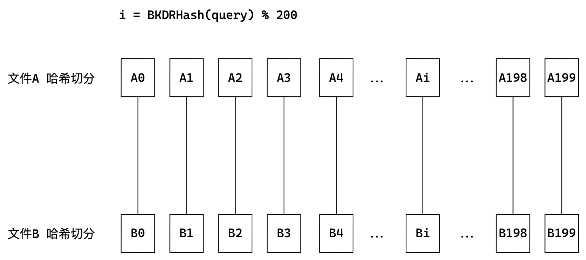

# 哈希

> 我们以搜索为主题，下面要学习的数据结构是哈希。哈希与我们刚刚讨论的AVL树、红黑树等搜索树的结构不同。

## 1. unordered系列容器

在C++98中，STL提供了底层为红黑树结构的一些关联式容器，但当树中的节点非常多时，查询效率也不理想。因此在C++11中，STL又提供了4个系列的关联式容器，`unordered_map, unordered_set` 以及`unordered_multimap/multiset`。

`map/set`和`unordered_map/unordered_set`功能类似，区别是底层结构不同。

- `unordered`意为无序的，存储遍历不按`key`排序，可以看出其底层是哈希表。
- `unordered`只有单向迭代器。

### 1.1 unordered_set

[unordered_set](https://cplusplus.com/reference/unordered_set/unordered_set/)

| 容器               | 功能      |
| ------------------ | --------- |
| set                | 排序+去重 |
| unordered_set      | 去重      |
| unordered_multiset | 不去重    |


#### 效率对比

```cpp
int n = 10000000;
vector<int> v;
srand((unsigned int)time(nullptr));
for (int i = 0; i < n; i++) {
    v.push_back(rand());
    v.push_back(i);
}

set<int> s;
unordered_set<int> us;

int begin1 = clock();
for (auto e : v) {
    s.insert(e);
}
int end1 = clock();

//
int begin2 = clock();
for (auto e : v) {
    us.insert(e);
}
int end2 = clock();

cout << "set insert: " << end1 - begin1 << endl;
cout << "unordered_set insert: " << end2 - begin2 << endl;
```

- 插入随机值的方式，当数据量很大时，unordered_set 比 set 快了接近10倍。
- 插入有序值的方式，当数据量很大时，unordered_set 比 set 慢2到3倍。
- unordered_set的查找效率极高，这得益于哈希的底层结构。
- unordered_set的删除效率也比set要快接近2倍。

可见不同场景下，set和unordered_set各有优势，set更适合有序重复度低的数据，unordered_set更适合随机重复度高的数据。**综合来看，unordered系列容器比map/set效率要更好些。**

### 1.2 unordered_map

[unordered_map](https://cplusplus.com/reference/unordered_map/unordered_map/)

> 容器的使用都是类似的，这里就不赘述了，关于unordered系列容器的部分和底层相关的接口，之后再作讨论。

#### OJ练习

[重复n次的元素](https://leetcode.cn/problems/n-repeated-element-in-size-2n-array/submissions/)

```cpp
class Solution {
public:
    int repeatedNTimes(vector<int>& nums) {
        unordered_map<int, int> hash;
        
        for (auto e : nums)
            hash[e]++;
        
        int size = hash.size();
        for (auto e : nums) {
            if (hash[e] > size / 2)
                return e;
        }
        return 0;
    }
};
```

[两个数组的交集 I](https://leetcode.cn/problems/intersection-of-two-arrays/)

```cpp
// 思路1：先用set对两个数组去重，再遍历一个set找重复出现的元素
class Solution {
public:
    vector<int> intersection(vector<int>& nums1, vector<int>& nums2) {
        vector<int> v;

        unordered_set<int> s1;
        for (auto e : nums1)
            s1.insert(e);
        
        unordered_set<int> s2;
        for (auto e : nums2)
            s2.insert(e);
        
        for (auto e : s1) {
            if (s2.find(e) != s2.end()) {
                v.push_back(e);
            }
        }

        return v;        
    }
};
// 思路2：先用两个set对数组去重，再双指针向后遍历，时间复杂度更小
class Solution {
public:
    vector<int> intersection(vector<int>& nums1, vector<int>& nums2) {
        vector<int> v;

        set<int> s1;
        for (auto e : nums1)
            s1.insert(e);
        set<int> s2;
        for (auto e : nums2)
            s2.insert(e);

        auto it1 = s1.begin(), it2 = s2.begin();
        while (it1 != s1.end() && it2 != s2.end()) {
            if (*it1 == *it2) {
                v.push_back(*it1);
                it1++;
                it2++;
            }
            else if (*it1 > *it2)
                it2++;
            else 
                it1++;
        }

        return v;
    }
};
```

[两个数组的交集 II](https://leetcode.cn/problems/intersection-of-two-arrays-ii/)

```cpp
class Solution {
public:
    vector<int> intersect(vector<int>& nums1, vector<int>& nums2) 
    {
        vector<int> v;
        sort(nums1.begin(), nums1.end());
        sort(nums2.begin(), nums2.end());

        int l = 0, r = 0;
        int n1 = nums1.size(), n2 = nums2.size();
        while (l < n1 && r < n2) 
        {
            if (nums1[l] < nums2[r])
                l++;
            else if (nums1[l] > nums2[r]) 
                r++;
            else {
                v.push_back(nums1[l]);
                l++, r++;
            }
        }

        return v;
    }
};
```

[存在重复元素](https://leetcode.cn/problems/contains-duplicate/)

```cpp
class Solution {
public:
    bool containsDuplicate(vector<int>& nums) {
        unordered_map<int, int> hash;
        
        for (auto e :nums) {
            hash[e]++;
        }

        for(auto e : hash) {
            if (e.second > 1) {
                return true;
            }
        }

        return false;
    }
};
```

[两句话中的不常见单词](https://leetcode.cn/problems/uncommon-words-from-two-sentences/)

```cpp
class Solution {
public:
    void HashForString(string& s, unordered_map<string, int>& hash) 
    {
        int begin = 0;
        while (begin < s.size()) 
        {
            int end = s.find(' ', begin);
            if (end == std::string::npos)  {
                hash[string(s, begin)]++;
                break;
            }
            hash[string(s, begin, end - begin)]++;
            begin = end + 1;
        }
    }
    vector<string> uncommonFromSentences(string s1, string s2) {
        vector<string> v;
        unordered_map<string, int> hash;

        HashForString(s1, hash);
        HashForString(s2, hash);

        for (auto e : hash) {
            if (e.second == 1)
                v.push_back(e.first);
        }

        return v;
    }
};
```


&nbsp;

## 2. 底层结构

### 2.1 哈希的定义

哈希也叫做散列，我们在数据结构中学过的记数排序就体现了哈希思想。

计数排序为统计每个数字出现的个数，<u>为每个元素都开辟了对应的一块空间</u>，用来记录其出现的个数，每遇到就加加一次。

**将一个元素和一个位置建立映射关系，这就是哈希的本质**。

[字符串中的第一个唯一字符](https://leetcode.cn/problems/first-unique-character-in-a-string/)

```cpp
int firstUniqChar(string s) {
    int count[26] = {0};
    for (auto e : s)
        count[e - 'a']++;

    for (int i = 0; i < s.size(); i++)
        if (count[s[i] - 'a'] == 1)
            return i;
    
    return -1;
}
```

> 类似于这样的一道题，使用相对映射的记数排序原理就可以解出来。但一般实际中数据的范围和大小都是随机的，那该怎么办呢？

#### 哈希函数

> 顺序表和平衡树中，元素 key 与元素的存储位置之间没有对应的关系。因此在查找一个元素时，必须经历多次比较 key。这样的时间复杂度还是不够理想。

最理想的搜索方法是：不经任何比较，一次运算直接得到要元素。<u>通过某种函数（hashFunc）使元素的存储位置与它的 key 值之间能够建立映射关系</u>，那么就可以通过该函数一次性找到该元素。

> 那这样的哈希函数（哈希方法）具体是怎样的呢？

插入元素时，根据待插入元素的key值，依靠此函数计算出该元素的存储位置并按此位置进行存放。这就是哈希方法，方法中使用的转换函数称为哈希函数。

例如，存在数据集合 $[1,7,6,4,5,9]$，将哈希函数设置为 $hash(key)=key\;\%\;capacity$，$capacity$ 为存储空间总的大小。


#### 哈希冲突

> 很明显，很可能存在不同的数值映射到相同的位置，比如$10\%10=0,\;20\%10=0$。这就会造成冲突。

对于两个数据元素的关键字 $k_i,\;k_j$，存在有 $Hash(k_i)= Hash(k_j)\;$。即<u>不同的key值通过相同哈希函数可能计算出相同的哈希地址，该种现象被称为哈希冲突或哈希碰撞</u>。

我们习惯把具有不同key值而具有相同哈希地址的数据元素称为”同义词"。

> 在上面的例题中，不存在哈希冲突是因为值太少且范围集中，直接开26个空间就能完全解决问题。

实际上我们不可能开出足够大的空间来建立绝对映射，也就是说哈希冲突的存在是必然的，冲突越多效率越低，所以<u>如何解决哈希冲突就成了提高哈希效率的问题的关键</u>。

> 如何解决哈希冲突呢？

解决哈希冲突的两种常见的方法是：闭散列和开散列。

### 2.2 哈希冲突的解决

#### 闭散列/开放定址法

闭散列，又称开放定址法。当发生哈希冲突时，如果哈希表未被填满，即哈希表还有空位，那可以把待插元素的key值也存放到冲突位置后的下一个空位置中。

> 如何寻找下一个空位呢？

##### 线性探测

- **线性探测即从冲突位置开始，依次向后遍历**，遇到的第一个空位，就是存放该元素的位置。
- 也就意味着，对于查找而言，发生哈希冲突并向后线性探测的时候，空位置就是线性探测的结束位置。

因此，线性探测也要注意一些问题：


- 如何表示位置的元素数据是否有效，是否存在是否为空或者被删除。解决方案是为每个位置数据增加状态标记。

```cpp
bool Insert(const pair<K, V>& kv)
{
    // 增容
    if (_table.size() == 0 || _n * 10 / _table.size() >= 7)
    // ... 

    // 探测
    size_t pos = kv.first % _table.size(); // 线性探测的起始位置
    size_t index = pos;
    size_t i = 0;

    while (_table[index]._status == EXIST)
    {
        i++;
        index = pos + i;        // 线性遍历
        index %= _table.size(); // 环形防止越界
    }
    
    // 插入
    _table[index]._kv = kv;
    _table[index]._status = EXIST;
    ++_n;

    return true;
}
```

显然，线性探测的方式会造成位置拥挤越来越严重，连续位置值冲突比较多。<u>插入数据需向后线性遍历的次数越来越多，易引发踩踏洪水效应</u>。

##### 二次探测

不同于线性探测是依次向后遍历，**二次探测是每次向后跳过`i`的二次方长度**，遇到的空位即元素的存放位置。可以一定程度上缓解拥堵的问题。

> 得到插入位置`pos`后，如果发生冲突，第一次向后跳过$1^2$个长度、第二次$2^2$个长度、$3^2$、$4^2$ …… 。直到遇到空位置。

```cpp
// 探测
size_t pos = kv.first % _table.size(); // 线性探测的起始位置
size_t index = pos;
size_t i = 0;

while (_table[index]._status == EXIST)
{
    i++;
    index = pos + i * i;    // 二次
    index %= _table.size(); // 环形防止越界
}
```

但经过演算，当哈希表快满的时候，二次探测可能总是“跳过”正确位置在“绕圈”。此时遍历的代价很大。

> 所以我们应该思考，哈希表在什么情况下应该扩容？如何扩容？

##### 闭散列扩容

我们引入载荷因子来解决这个问题，顾名思义，载荷因子是哈希表装载程度的标志因子，它的定义是：
$$
\alpha \; = \;表中元素个数\;/\;表的总长度
$$
理论上，$\alpha$ 越大，发生冲突的可能性也就越大，反之越小。实际上，哈希表的平均查找长度是一个关于载荷因子 $\alpha$ 的函数，不同处理冲突的方式有不同的函数。

> 对于闭散列方式哈希的效率，荷载因子是特别重要的因素，应严格限制在0.7-0.8以下。超过0.8，查表时的CPU缓存不命中率按照指数曲线上升。

- 当然**，负载因子越小，冲突的概率越低，效率越高，但空间浪费就多**。反之亦然。
- 哈希表的扩容不仅仅是`resize`一下那么简单，还要按规定维护原有数据的存放位置。

例如 $12\%10=2,12\%20=12$，扩容后还需要移动12到其他位置。如下图所示：


处理数据的搬迁很麻烦，更方便的办法是直接开辟出一个符合大小的哈希表，复用插入逻辑将原表的有效数据按规则插入到新表，再交换新旧表即可。

```cpp
bool Insert(const pair<K, V>& kv)
{
    // 增容
    if (_table.size() == 0 || _n * 10 / _table.size() > 7)
    {
        size_t newSize = _table.size() == 0 ? 10 : _table.size() * 2;

        HashTable<K, V> newHT;
        newHT._table.resize(newSize);

        for (auto e : _table) {
            if (e._status == EXIST) newHT.Insert(e._kv);
        }

        _table.swap(newHT._table);
    }
    // 探测+插入
    //...
}
```

#### 哈希函数

根据待插入元素的key值，依靠哈希函数计算出该元素的存储位置并按此位置进行存放。也就是说，哈希函数决定了如何存放该元素。

所以，哈希函数是需要我们自行设计的，前面开散列中的 $key\%capacity=pos$ 就是哈希函数。**但只有整数能进行取模运算，如果我们的key不是整数类型怎么办？这就需要我们为key的类型设计哈希函数**。

为key的类型设计哈希函数，就是将key变量和整型数据建立一种映射，使之代表key类型进行取模运算。

> 比如针对字符串，可以将字符串中每个字符的ASCII码值相加所得的值，作为key的哈希函数结果。但这样的方式比较粗糙，很明显存在大量的重复情况。

```cpp
/// BKDR Hash Function  
/// 本算法由于在Brian Kernighan与Dennis Ritchie的《The C Programming Language》一书被展示而得名
template<class T>
size_t BKDRHash(const T *str)
{
    register size_t hash = 0;
    while (size_t ch = (size_t)*str++)
    {
        hash = hash * 131 + ch;   // 也可以乘以31、131、1313、13131、131313..
    }  
    return hash;  
}  
```

 [各种字符串Hash函数](https://www.cnblogs.com/-clq/archive/2012/05/31/2528153.html)

可以把哈希函数设计成仿函数，对不同类型添加特化处理。

```cpp
template<class K>
struct Hash
{
    size_t operator()(const K& key)
    {
        return key;
    }
};
// 特化
template<>
struct Hash<string>
{
    //BKDR
    size_t operator()(const string& s)
    {
        size_t value = 0;
        for (auto ch : s) {
            value = value * 131 + ch;
        }
        return value;
    }
};
```

- 对于常用作key的类型，可以将其作为哈希仿函数的一个特化版本，这是从库实现的角度。

- 如果我们自定义类型作key，可以单独为其设计一个哈希函数，并在创建哈希表时作参数传进去。

```cpp
struct Date
{
    int _year;
    int _month;
    int _day;
};
struct HashDate
{
    size_t operator()(const Date& date) {
        return date._year + date._month + date._day;
    }
};
```

#### 开散列/拉链法/哈希桶

> 闭散列/开放定址法实现的不够“聪明”，是一种“强盗”逻辑。冲突的数据会相互影响，相邻位置容易发生拥挤，影响整体效率。
>
> 那如何优化呢？开散列。

开散列又称拉链法、链地址法、开链法、哈希桶。**具有相同地址的key值归于一个集合（桶），桶中元素通过链表链接起来，各链表的头结点存储在哈希表中**。从本质上解决了“踩踏”的问题。


```cpp
// 哈希表节点
template <class K, class V>
struct HashNode
{
    pair<K, V> _kv;
    HashNode<K, V>* _next;

    HashNode(const pair<K, V>& kv)
        : _kv(kv), _next = nullptr;
	{}
};
// 哈希函数
template <class K>    
struct Hash {
    size_t operator()(const K& key) {
        return key;
    }
};
template<>
struct Hash<string> {
    size_t operator()(const string& s) {
        size_t ret = 0;
        for (auto ch : s)
            ret = ret * 131 + ch;
        return ret;
    }
};
// 哈希表结构
template <class K, class V, class HashFunc = Hash<K>> 
class HashTable {
    typedef HashNode<K, V> Node;
    private:
    vector<Node*> _table;
    size_t _n;
};
```

##### 开散列增容

桶的个数也就是哈希表长度，是固定的。随着元素的插入，单个桶的元素不断增多，但<u>桶由链表实现，只能线性遍历，本质效率和线性探测一样</u>。如果单个桶中节点非常多，会影响哈希表的性能。

> 解决这个问题的方法就是，在适当的条件下对哈希表增容。让哈希表最好处于如下的最佳状态。

开散列的最佳情况是：每个哈希桶中刚好挂一个节点。因为此时如果再继续插入，必然会发生哈希冲突。因此，**当元素个数刚好等于桶的个数时，可以给哈希表增容**。


此时开散列的扩容不好像闭散列一样复用插入逻辑，最好是遍历原哈希表其下链表的节点放到新哈希表中，免得创建新节点和释放原节点。

```cpp
bool Insert(const pair<K, V>& kv)
{
    // 扩容
    if (_table.empty() || _n == _table.size())
    {
        size_t newSize = _table.empty() ? 10 : _table.size() * 2;

        vector<Node*> newTable;
        newTable.resize(newSize);

        for (auto& e : _table) // 遍历原哈希表
        {
            Node* curr = e;
            Node* next = curr;

            // 遍历
            while (curr != nullptr) // 当下链表不为空
            {
                next = curr->_next; // 记录下一个位置

                size_t pos = hf(curr->_kv.first) % newSize; // 找到插入位置
                // 头插
                curr->_next = newTable[pos];
                newTable[pos] = curr;

                curr = next; // 步进
            }

            e = nullptr; // 置空
        }
        _table.swap(newTable); // 置换
    }
    
    // 探测+插入
    //...
}												
```

&nbsp;

#### 闭开散列整体实现

##### 闭散列插入


```cpp
bool Insert(const pair<K, V>& kv) {
    HashNode<K, V>* ret = Find(kv.first);
    if (ret)
        return false;

    HashFunc hf;

    // 增容
    if (_table.size() == 0 || _n * 10 / _table.size() >= 7) {
        size_t newSize = _table.size() == 0 ? 10 : _table.size() * 2;

        HashTable<K, V> newHT;
        newHT._table.resize(newSize);

        for (auto e : _table) {
            if (e._status == EXIST)
                newHT.Insert(e._kv);
        }

        _table.swap(newHT._table);
    }

    // 探测
    size_t pos = hf(kv.first) % _table.size(); // 线性探测的起始位置
    size_t index = pos;
    size_t i = 0;

    while (_table[index]._status == EXIST) {
        i++;
#ifdef LINEAR_DETECT
        index = pos + i;
#else
        index = pos + i * i;
#endif
        index %= _table.size(); // 环形防止越界
    }

    // 插入
    _table[index]._kv = kv;
    _table[index]._status = EXIST;
    ++_n;

    return true;

}
```


##### 闭散列查找


```cpp
HashNode<K, V>* Find(const K& key) {
    if (_table.size() == 0)
        return nullptr;

    HashFunc hf;

    size_t pos = hf(key) % _table.size();
    size_t index = pos;
    size_t i = 0;

    while (_table[index]._status == EXIST) {
        if (_table[index]._kv.first == key) {            
            return &_table[index];
        }

        ++i;
#ifdef LINEAR_DETECT
            index = pos + i;
#else
            index = pos + i * i;
#endif
            index %= _table.size();
    }

    return nullptr;
}
```


##### 闭散列删除

```cpp
bool Erase(const K& key) {
    HashNode<K, V>* ret = Find(key);
    if (ret == nullptr)
        return false;
    else {
        ret->_status = EMPTY;
        --_n;
        return true;
    }
}
```

##### 开散列插入

```cpp
bool Insert(const pair<K, V>& kv) {
    if (Find(kv.first))
        return false;

    // 扩容
    if (_table.empty() || _n == _table.size()) {
        size_t newSize = _table.empty() ? 10 : _table.size() * 2;

        vector<Node*> newTable;
        newTable.resize(newSize);

        for (auto& e : _table) { // 遍历原哈希表
            Node* curr = e;
            Node* next = curr;

            // 遍历
            while (curr != nullptr) { // 当下链表不为空
                next = curr->_next; // 记录下一个位置

                size_t pos = hf(curr->_kv.first) % newSize; // 找到插入位置
                // 头插
                curr->_next = newTable[pos];
                newTable[pos] = curr;

                curr = next; // 步进
            }
            e = nullptr; // 置空
        }

        _table.swap(newTable); // 置换
    }

    // 位置
    size_t pos = hf(kv.first) % _table.size();
    // 头插
    Node* newNode = new Node(kv);

    newNode->_next = _table[pos];
    _table[pos] = newNode;

    ++_n;
    return true;
}
```

##### 开散列查找

```cpp
Node* Find(const K& key) {
    if (_table.empty())
        return nullptr;

    size_t pos = hf(key) % _table.size(); // 位置
    Node* curr = _table[pos];

    while (curr) {
        if (curr->_kv.first == key) {
            return curr;
        }
        curr = curr->_next;
    }

    return nullptr;
}
```

##### 开散列删除

```cpp
bool Erase(const K& key) {
    Node* ret = Find(key);
    if (!ret)
        return false;

    size_t pos = key % _table.size();

    Node* prev;
    Node* curr = _table[pos]; // 链表起始位置

    while (curr) {
        if (curr->_kv.first == key) {
            // 头删
            if (prev == nullptr) {
                _table[pos] = curr->_next;
            }
            else {
                prev->_next = curr->_next; // 链接
                delete ret; // 释放
                --_n;
            }
            return true;
        }

        prev = curr;
        curr = curr->_next;
    }

    return false;
}
```

> 闭散列在实际中并不实用，甚至可以说它只起到教学的目的。大多数情况使用的都是开散列。

&nbsp;

## 3. 封装实现

> 哈希表的实现比AVL树或者红黑树要简单不少，但是它的封装比较繁琐。

<u>模拟实现map/set或者unordered_map/unordered_set，对用作key的类型分别有什么要求？</u>

前面模拟实现map和set的时候，碍于整体难度是没有提供`key`类型的比较仿函数`Compare`的。现在我们知道，**实现map/set显然需要提供key类型的比较仿函数**。


如果我们相加的话也就像哈希表的哈希函数一样封装一个比较的仿函数即可。内部实现也就是：

```cpp
Compare com();
// ...
if (com(curr->key, key)) {
    curr = curr ->right;
}
else if (com(key, curr->key)) {
    curr = curr ->left;
}
else  {
    curr->kv = kv;
}
```


根据哈希表的原理，实现unordered系列容器，需要对key类型作出如下要求：

| 参数                 | 用途解释                                                 |
| -------------------- | -------------------------------------------------------- |
| `Hash=hash<Key>`     | **须能支持取模运算或支持映射到整数从而代之进行取模运算** |
| `Pred=equal_to<Key>` | **须能支持判断相等的运算或提供判断相等的仿函数**         |

&nbsp;

### 3.1 哈希表改造

哈希要支持unordered的map和set，就和红黑树一样，模版参数分别为`<class K, class T>`。

- set的话，两个模版参数都传`K`；
- map的话，第一个传`K`，第二个传`pair<K,V>`。

这样可以复用一个哈希结构，除此之外还要提供一个提取出`T`类型中用来比较的类型的仿函数`KeyOfT`。	

> 如提取出`T`类型也就是`pair<K,V>`中的`K`类型用来进行比较，该仿函数由调用方也就是unordered_map/set实现具体内容。

哈希只支持单向迭代器，所以只有`begin/end`，只有`++`。

而迭代器想要遍历哈希结构，最好的方式是加入指向哈希结构的指针。迭代器使用哈希表需要再前面加上哈希表的前置声明。其次使用哈希表内部成员需要将迭代器声明为哈希表的友元。

```cpp
namespace NS_Open_Hash
{
    template <class T>
    struct HashNode
    {
        T _data;
        HashNode<T>* _next;

        HashNode(const T& data)
            : _data(data), _next(nullptr)
        {}
    };

    template <class K>
    struct Hash
    {
        size_t operator()(const K& key) {
            return key;
        }

    };
    template<>
    struct Hash<string>
    {
        size_t operator()(const string& s)
        {
            size_t ret = 0;
            for (auto ch : s)
                ret = ret * 131 + ch;

            return ret;
        }
    };
    
    //前置声明
    template <class K, class T, class KeyOfT, class HashFunc>
    class HashTable;

    template <class K, class T, class Ref, class Ptr, class KeyOfT, class HashFunc>
    struct __HTIterator
    {
        typedef HashNode<T> Node;
        typedef HashTable<K, T, KeyOfT, HashFunc> HashTable;
        typedef __HTIterator<K, T, Ref, Ptr, KeyOfT, HashFunc> Self;

        Node* _node;
        HashTable* _pht; // 指向哈希表的对象指针

        __HTIterator(Node* node, HashTable* pht)
            : _node(node), _pht(pht)
        {}

        Ref operator*() {
            return _node->_data;
        }
        Ptr operator->() {
            return &_node->_data;
        }

        bool operator==(const Self& it) const {
            return _node == it._node;
        }
        bool operator!=(const Self& it) const {
            return !(_node == it._node);
        }

        Self& operator++() 
        {
            if (_node->_next) {
                _node = _node->_next;
            }
            else {
                KeyOfT kot;
                HashFunc hf;
                // 计算当前哈希桶位置
                size_t pos = hf(kot(_node->_data)) % _pht->_table.size();
                ++pos;

                // 找到下一个不为空的桶
                while (pos < _pht->_table.size() && !_pht->_table[pos]) {
                    ++pos;
                }

                if (pos < _pht->_table.size()) {
                    _node = _pht->_table[pos]; // 指向该桶的首位元素
                }
                else {
                    _node = nullptr; // 走完了
                }
            }
            return *this;
        }
    };

    template <class K, class T, class KeyOfT, class HashFunc>
    class HashTable
    {
        // 声明友元
        template <class K, class T, class Ref, class Ptr, class KeyOfT, class HashFunc>
        friend struct __HTIterator;
        
    public:
        typedef HashNode<T> Node;
        typedef __HTIterator<K, T, T&, T*, KeyOfT, HashFunc> iterator;

    private:
        HashFunc hf;
        KeyOfT kot;

    public:
        iterator begin() {
            for (auto& e : _table)
                if (e) return iterator(e, this);

            return end();
        }
        iterator end() {
            return iterator(nullptr, this);
        }

    public:
        iterator Find(const K& key)
        {
            if (_table.empty())
                return nullptr;

            size_t pos = hf(key) % _table.size(); // 位置
            Node* curr = _table[pos];

            while (curr)
            {
                if (kot(curr->_data) == key) {
                    return iterator(curr, this); // 构造迭代器返回
                }
                curr = curr->_next;
            }

            return end();
        }

     	pair<iterator, bool> Insert(const T& data)
        {
            iterator ret = Find(kot(data));
            if (ret != end())
                return make_pair(ret, false);

            // 扩容
            if (_table.empty() || _n == _table.size())
            {
                size_t newSize = _table.empty() ? 10 : _table.size() * 2;

                vector<Node*> newTable;
                newTable.resize(newSize);

                for (auto& e : _table) // 遍历原哈希表
                {
                    Node* curr = e;
                    Node* next = curr;

                    // 遍历
                    while (curr != nullptr) // 当下链表不为空
                    {
                        next = curr->_next; // 记录下一个位置

                        size_t pos = hf(kot(curr->_data)) % newSize; // 找到插入位置
                        // 头插
                        curr->_next = newTable[pos];
                        newTable[pos] = curr;

                        curr = next; // 步进
                    }

                    e = nullptr; // 置空
                }

                _table.swap(newTable); // 置换
            }

            // 位置
            size_t pos = hf(kot(data)) % _table.size();
            // 头插
            Node* newNode = new Node(data);

            newNode->_next = _table[pos];
            _table[pos] = newNode;

            ++_n;
            return make_pair(iterator(newNode, this), true);
        }

        bool Erase(const K& key)
        {
            Node* ret = Find(key);
            if (!ret)
                return false;

            size_t pos = key % _table.size();

            Node* prev = nullptr;
            Node* curr = _table[pos]; // 链表起始位置

            while (curr) {
                if (kot(curr->_data) == key) {
                    // 头删
                    if (prev == nullptr) {
                        _table[pos] = curr->_next;
                    }
                    else {
                        prev->_next = curr->_next; // 链接
                        delete ret; // 释放
                    }
                    --_n;
                    return true;
                }

                prev = curr;
                curr = curr->_next;
            }

            return false;
        }
        
        HashTable() = default;

        HashTable(const Self& ht)
        {
            _table.resize(ht._table.size());

            for (auto bucket : ht._table)
            {
                Node* curr = bucket;
                while (curr)
                {
                    Node* next = curr->_next;
                    Node* newNode = new Node(curr->_data);

                    int pos = hf(kot(curr->_data)) % _table.size();

                    newNode->_next = _table[pos];
                    _table[pos]->_next = newNode;

                    curr = next;
                }
            }
        }

        Self& operator=(Self copy)
        {
            swap(_n, copy._n);
            _table.swap(copy._table);

            return *this;
        }

        ~HashTable()
        {
            for (auto bucket : _table)
            {
                Node* curr = bucket;
                while (curr)
                {
                    Node* next = curr->_next;

                    delete curr;
                    curr = next;
                }

                bucket = nullptr;
            }
        }
        
    private:
        vector<Node*> _table;
        size_t _n;
    };
}
```

### 3.2 封装unordered容器

容器需要提供Key类型的哈希函数，并在此提供缺省参数。

哈希迭代器是哈希类模版中的类型，声明它需要加上`typename`告诉编译器等待类模版实例化后再实例化该类型。

#### unordered_set

```cpp
#pragma once
#include "Hash.hpp"
using namespace NS_Open_Hash;

namespace NS_Unordered_Set
{
    template <class K, class hash = Hash<K>>
    class unordered_set
    {
    public:
        struct SetKeyOfT {
            const K& operator()(const K& key) {
                return key;
            }
        };

    public:
        typedef typename HashTable<K, K, SetKeyOfT, hash>::iterator iterator;

        iterator begin() {
            return _ht.begin();
        }
        iterator end() {
            return _ht.end();
        }

        bool insert(const K& key) {
            return _ht.Insert(key);
        }

    private:
        HashTable<K, K, SetKeyOfT, hash> _ht;
    };
}
```

#### unordered_map

```cpp
#pragma once
#include "Hash.hpp"
using namespace NS_Open_Hash;

namespace NS_Unordered_Map
{
    template <class K, class V, class hash = Hash<K>>
    class unordered_map
    {
    public:
        struct MapKeyOfT {
            const K& operator()(const pair<K, V>& kv) {
                return kv.first;
            }
        };

    public:
        typedef typename HashTable<K, K, MapKeyOfT, hash>::iterator iterator;

        iterator begin() {
            return _ht.begin();
        }
        iterator end() {
            return _ht.end();
        }
        
        V& operator[](const K& key)
        {
            auto ret = _ht.Insert(make_pair(key, V()));
            return ret.first->second; // 返回迭代器指向的pair的第二个
        }

        bool insert(const pair<K, V>& kv) {
            return _ht.Insert(kv);
        }

    private:
        HashTable<K, pair<K, V>, MapKeyOfT, hash> _ht;
    };
}
```

&nbsp;

## 4. 哈希的应用

> map/set unodered_map/unordered_set 都是K或者KV的模型，解决问题的同时是存在一定的空间消耗的。在处理海量数据的情况下可以选择位图。

### 4.1 位图

面试题：有40亿个不重复的乱序无符号整数，如何快速判断一个无符号数是否在这40亿个无符号数中？

1. 遍历：时间复杂度为O(N)
2. 先排序再二分查找：O(N*logN)+O(logN)
3. 插入红黑树或哈希表并查找：O(N*logN)或O(N)

但40亿个整数约占16G的空间。普通内存根本存不下，所以本题最优解是使用位图。

#### 位图的定义

位图就是用一段空间的每一个比特位：

- 比特位的位置即下标映射到特定的元素；
- 比特位的值即0或1来表示某种二元状态。

这样就可以记录保存某个元素的某个状态，当然这个状态只能是二元的，如在或不在。适用场景如处理海量数据，且数据无重复的场景。通常是用来判断某个数据存不存在。

> 如下图中的这个位图，就可以记录一百个数在某个集合中是否存在的状态。


按照位图的定义，一个比特位利用下标就能映射代表一个整数，那么40亿个整数就是40亿个比特位就是0.5个G。

#### 位图的实现

```cpp
template <size_t N>
class bit_set
{
public:
	bit_set() {
        _bits.resize(N / 8 + 1); // 保证开辟字节数够要求
    }

    //将x对应位置置1
    void set(size_t x);
    //将x对应位置置0
    void reset(size_t x);
    //获取x对应位置的值
    bool test(size_t x);

private:
	vector<char> _bits;    
};
```

1. 直接整数除法计算开辟的字节数大小是不够的，整数除法余数会自动舍去，所以直接加1个字节一定满足要求。
2. 如何计算整数 x 的比特位置？**$x\;/\;8$ 得到 x 在第几个字节，$x\;\%\;8$ 得到 x 在该字节的第几个比特位**。
3. 将比特位`|`上`1`能将该位置1，将比特位`&`上`0`能将该位置0。（或是有1则1，与是有0则0）

```cpp
void set(size_t x) 
{
    int i = x / 8; // 字节位
    int j = x % 8; // 比特位
    
	_bit[i] |= (1 << j); // 比特位置1
}
//      j
// 1010 0010
// 0000 1000  |
// ---------------
// 1010 1010

void reset(size_t x) 
{
    int i = x / 8;
    int j = x % 8;
    
	_bit[i] &= ~(1 << j) // 比特位置0
}
//      j
// 1010 0010
// 1111 0111  &
// ---------------
// 1010 0010

bool test(size_t x)
{
    int i = x / 8;
    int j = x % 8;
    
    return _bit[i] & (1 << j); // 探测该比特位
}
//      j
// 1010 1010
// 0000 1000  &
// ---------------
// 0000 1000
```

#### 位图的优劣

可见，位图的查找时间复杂度只有 $O(1)$。

<u>位图的大小和需要记录的整数的个数没关系，而是和所要记录的所有整数中的最大值有关</u>。最大是整数的最大个数也就是整型的最大值，约42亿多个比特位。故位图的占存最大只有 $500MB$，

 当然位图也有局限性，位图只能处理整数，表示的状态只能是二元的。

#### 位图的应用

- 给定100亿个整数，设计算法找到只出现一次的整数？

100亿个整数，即400亿个字节，约占40G内存。

求只出现一次的整数，但位图只能表示2种状态。所以搞两个位图，<u>一个保存这些数的是否出现一次的状态，一个保存是否出现多次的状态</u>。

```cpp
template <size_t N>
class TwoBitSet
{
public:
    void Set(size_t x)
    {
        if(_bs1.test(x) == false && _bs2.test(x) == false) // 00 -> 10
        {
            _bs1.set(x);
        }
        else if (_bs1.test(x) == true && _bs2.test(x) === false) // 10 -> 01
        {
            _bs1.reset(x);
            _bs2.set(x);
        }
    }
    // 显然我们要的是10状态的数字
    void Result(vector<int>* v)
    {
        for (int i = 0; i < N; i++) {
            if (_bs1.test(i) == true && _bs2.test(i) == false) {
                v->push_back(i);
		}
    }
    
private:
    bitset<N> _bs1;
    bitset<N> _bs2;
};
```

- 给两个文件，分别有100亿个整数，我们只有1G内存，如何找到两个文件交集？

思路一：建立一个位图，将第一个文件中的整数set到位图中，再遍历第二个文件的整数test该位图，如果已经存在则属于交集，将该数输出后再在位图将其reset，防止重复。

```cpp
template <size_t N>
void handlequestion2(vector<int>& in1, vector<int>& in2, vector<int>* out)
{
    bitset<N> bs;
    
    for (auto e : in1) {
        bs.set(e);
    }
    
    for (auto e : in2) 
    {
        if (bs.test(e) == true) 
        {
            bs.reset(e); // 重置为0，防止重复test成功
            out->push_back(e);
        }
    }
}
```

思路二：两个文件分别set到两个位图，取两个位图相与后的结果，就是交集。

```cpp
template <size_t N>
void handlequestion2(vector<int>& in1, vector<int>& in2, vector<int>* out)
{
    bitset<N> bs1;
    bitset<N> bs2;

	for (auto e : in1)
        bs1.set(e);
    
    for (auto e : in2)
        bs2.set(e);
    
    for (int i = 0; i < N; i++) {
    	bs1[i] &= bs2[i];
    }
    
    for (int i = 0; i < N; i++)
    {
        if (bs1.test(i))
            out->push_back(i);
    }
}
```

- 位图应用变形：1个文件有100亿个int，1G内存，设计算法找到出现次数不超过2次的所有整数。

> 要记录出现2次的状态，必须有记录出现1次的状态。记录两次以上同理。

所以我们需要两个位图。位图一记录出现0次或1次，位图二记录出现2次及2次以上。也就是说，要求描述出现次数不超过 $x$ 次，就需要建立 $log_2x$ （向上取整）个位图。

```cpp
template <size_t N>
void handlequestion3(vector<int>& in, vector<int>* out)
{
    std::bitset<N> bs1;
    std::bitset<N> bs2;
    if(bs1.test(x) == false && bs2.test(x) == false) // 00 -> 01
    {
        bs1.set(x);
    }
    else if (bs1.test(x) == true && bs2.test(x) === false) // 01 -> 10
    {
        bs1.reset(x);
        bs2.set(x);
    }
    else if (bs1.test(x) == false && bs2.test(x) === true) // 10 -> 11
    {
        bs1.set(x);
    }
    // 显然我们要的是01或10状态的数字
    for (int i = 0; i < N; i++) 
    {
        if ((_bs1.test(i) && !_bs2.test(i)) ||
            (!_bs1.test(i) && _bs2.test(i))) {
            v->push_back(i);
        }
    }
}
```

### 4.2 布隆过滤器

> 位图只能处理整数，那其他类型如何处理呢？布隆过滤器。

#### 布隆过滤器的定义

布隆过滤器是由布隆提出的一种紧凑型、巧妙的概率型的数据结构，特点是高效地插入和查询，和位图一样只能记录二元状态。

> 不是整数如何处理？比如字符串。

类似位图，**布隆过滤器同样不存储元素本身，而是存储元素对应的映射**。字符串及其他类型的数据可以通过哈希函数转换成整数，通过该整数建立映射。


但字符串是无限的整数是有限的，经哈希函数转换为整数，不可能不发生冲突。也就是不同字符串映射到同一个位置。

**这样就会发生误判，将一个不存在的字符串误判为存在于布隆过滤器中**。也就是说，<u>判定为“在”的结果可能不准，但结果为“不在”一定准确</u>。

解决冲突的方式是：

1. **多副本映射，使用多个哈希函数，存储在不同的位置上，可以大大降低冲突的概率**。
2. 开辟更大的空间留给布隆过滤器映射，自然会减少冲突的概率。

> 因为字符串或其他类型是无限的，而我们只能开出有限个空间，所以布隆过滤器的误判是无法避免的。
>
> 因此我们尽量使用布隆过滤器去判断“不在”的结果，而不是“在”，如果要判断“在”，应在加一层保障。

- 布隆过滤器查询效率 $O(K)$，K是映射的副本个数，即使用哈希函数的个数，属于常数次效率很高。
- 一个字符串只映射到一定量的比特位，也可以节省大量的内存空间。

[布隆过滤器](https://zhuanlan.zhihu.com/p/43263751)

```cpp
struct BKDRHash {    
    size_t operator()(const string& s) {
        int val = 0;
        for (auto e : s) val = val * 131 + e;
        return val;
    }
};
struct APHash {
  	size_t operator()(const string& s) {
		register size_t hash = 0;
        size_t ch;
        for (long i = 0; ch = (size_t)*str++; ++i) {
            if (i & 1 == 0) 
                hash ^= ( (hash << 7) ^ ch ^ (hash >> 3) );
            else 
                hash ^= (~(hash << 11) ^ ch ^ (hash >> 5) );
        }
        return hash;
    }  
};
struct DJBHash {
  	size_t operator()(const string& s) {
        size_t hash = 5381;
        for (auto e : s) 
            hash += (hash << 5) + ch;
        return hash;
    }  
};

template <size_t N, class K = string, 
class HashFunc1 = BKDRHash, class HashFunc2 = APHash, class HashFunc3 = DJBHash>
class BloomFilter
{
    // ...
private:
    bitset<N> _bs;
};
```

##### 布隆过滤器的结构

> 如何控制布隆过滤器的长度？模版参数`N`指代需要映射的元素个数，但防止冲突一个元素需要多个比特位，那具体要开辟多大空间呢？

$$
k=\frac{m}{n}ln2
$$

> `k`为哈希函数个数，`m`为布隆过滤器长度，`n`为插入的元素个数。已知k为3则，m和n的关系为：

$$
m=4.3*n
$$

也就是说，如果要记录`n`个元素，最少开辟`4.3*n`的空间用来建立映射。

```cpp
template <size_t N, // 待映射的元素个数
size_t MUL = 4,     // 开辟空间需乘以的倍数 
class K = string, 
class HashFunc1 = BKDRHash, 
class HashFunc2 = APHash, 
class HashFunc3 = DJBHash>
class BloomFilter
{
    void set(const K& key);
    void test(const K& key);
private:
    bitset<N * MUL> _bs;
};
```

#### 布隆过滤器的实现

```cpp
void Set(const K& key)
{
    size_t len = MUL * N;
    size_t index1 = HashFunc1()(key) % len;
    size_t index2 = HashFunc2()(key) % len;
    size_t index3 = HashFunc3()(key) % len;
    // cout << index1 << endl << index2 << endl << index3 << endl << endl;

    _bs.set(index1);
    _bs.set(index2);
    _bs.set(index3);
}

bool Test(const K& key)
{
    size_t len = MUL * N;
    size_t index1 = HashFunc1()(key) % len;
    size_t index2 = HashFunc2()(key) % len;
    size_t index3 = HashFunc3()(key) % len;

    if (!_bs.test(index1)) return false;
    if (!_bs.test(index2)) return false;
    if (!_bs.test(index3)) return false;

    return true;
}
```

#### 布隆过滤器的优劣

##### 优点

1. 布隆过滤器不存储元素，因而**占存小，保密性高**。
2. 在能够**承受—定的误判**的场景，布隆过滤器有很大的空间优势。
3. **数据量很大时**，布隆过滤器可以表示全集，其他数据结构不能。

##### 缺点

1. 有误判率，不能准确判断元素是否在集合中。
2. 不能获取元素本身。
3. 一般不能从布隆过滤器中删除元素。如果采用计数方式删除，可能会存在计数回绕问题。

#### 布隆过滤器的应用

- 如何扩展布隆过滤器使得它支持删除元素的操作。

布隆过滤器本身不支持删除。因为在发生冲突的情况下将比特位置0，可能会导致误判不在。

利用多个位图，不同位图表示不同状态，每个元素占有多个比特位，存储引用计数。如果有元素发生冲突，就填充其他位图。

支持删除会导致耗费空间变多，布隆过滤器优势减弱。

&nbsp;

### 4.3 哈希切分

- 给两个文件，分别有100亿个query，我们只有1G内存，如何找到两个文件交集？

利用哈希，将文件A和文件B分别各切分成200个小文件，也就是各200个哈希桶，$A_1-A_{200},\;B_1-B_{200}$ 。

**从而确定相同的query一定在相同编号 $A_i\;,\;B_i$ 的桶中**，因为哈希函数相同一样的字符串转化得到的`index`一定相同，会进入相同的哈希桶。所以只要对比编号相同的哈希桶是否存在相同的元素即可。



> 如果$A_i$和$B_i$两个桶太大，超过内存限制，可以换一个哈希算法，再对这两个桶切分一次。

- 给一个超过100G大小的日志文件存着IP地址，我们只有1G内存，设计算法找到出现次数TopK的IP地址？

遍历文件读取IP，`i=BKDR(ip)%100`下标为多少IP就进入编号为多少的文件。通过哈希算法一定会将相同的IP进入同一个文件，所以统计该文件内各IP的次数就是该IP的出现次数。

&nbsp;

## 5. 扩展阅读

[一致性哈希](https://blog.csdn.net/a745233700/article/details/120814088)

[哈希与加密](https://www.cnblogs.com/leoo2sk/archive/2010/10/01/hash-and-encrypt.html)

