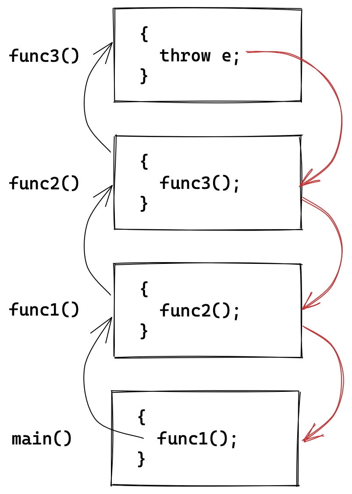
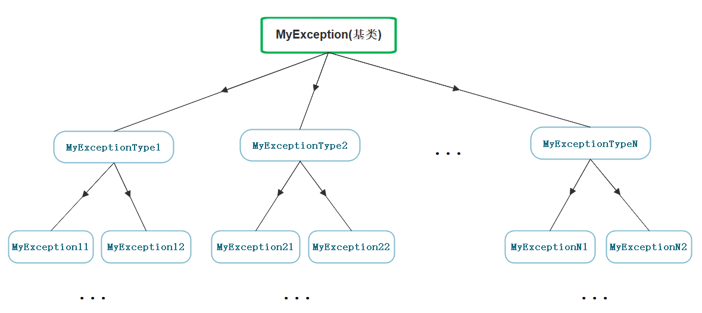

# 异常

传统的错误处理机制是`assert`断言终止程序和`errno`错误码。这两种方式都有很大的局限性：

| 错误处理机制 | 局限性                                   |
| ------------ | ---------------------------------------- |
| 断言         | 强制终止程序，用户难以接受               |
| 错误码       | 过返回值来传递错误码，占用函数返回值位置 |
|              | 无法直接表示错误信息，需要查询错误码表   |

> 实际中C语言基本都是使用返回错误码的方式处理错误，终止程序都是处理非常严重的错误。

异常是面向对象语言对程序错误的处理机制。对比错误码，显得更加灵活、方便和全面。面向对象语言都有异常机制，我们只讨论C++中的异常。

## 1. 异常的概念

异常是一种处理错误的方式，当一个函数发现自己无法处理的错误时就可以抛出异常，让函数的直接或间接的调用者处理这个错误。

> 异常机制可以帮助我们将异常检测和处理机制解耦，这样异常检测部分可以不必知道异常如何处理。

| 关键字  | 含义                                                         |
| ------- | ------------------------------------------------------------ |
| `throw` | 当程序出现问题时，就可以使用`throw`抛出一个异常。            |
| `catch` | 在需要处理问题的地方，使用`catch`用来捕获并处理异常。        |
| `try`   | `try`块中的代码标识将被激活的特定异常，它后面通常跟着一个或多个`catch`块。 |

使用示例：

```cpp
int Division(int a, int b) {
	if (b == 0)
		throw "Division by zero condition";
	else
		return a / b;
}
void Func() {
	int a, b;
	cin >> a >> b;
	cout << Division(a, b) << endl;
}
int main() {
	try {
		Func();
	}
	catch (const char* errmsg) {
		cerr << errmsg << endl;
	}
	catch (...) {
		cerr << "Unkown Exception" << endl;
	}
    return 0;
}    
```

&nbsp;

## 2. 异常的使用

> 异常的简单使用上面已经讲到，接下来我们讨论一下异常的抛出和捕获原则。

### 2.1 抛出和捕获规则

1. `throw`可以抛任意类型的变量，当然接收处须是对应类型才能够捕获，`catch(...)`可以捕获任意类型。
2. `throw`异常后，**程序会直接进入调用链上最近的匹配的`catch`子句**。
3. 异常处理后程序会正常执行`catch`之后的代码。如果异常没有被捕获就会终止程序。
4. `throw`异常后，会生成一个异常对象的临时拷贝，该临时对象会在`catch`作用域结束后销毁。
5. **捕获异常对象时不需要完全匹配其类型，可以用父类对象捕获子类对象**，原理是多态对象切片。

> 实际工程中也都是用自定义异常类，用父类对象捕获子类对象，这非常实用。

```cpp
try
{
    throw memory_exception; // 子类
}
catch (const exception& e)  // 父类
{
    //...
}
```

#### 函数调用链展开异常匹配原则

1. 首先检查`throw`语句是否在`try`内部，如果是再从`try`块的结束位置查找匹配的`catch`语句，如果不是则直接终止程序。
2. 如果当前函数栈没有匹配的`catch`块，则退出当前函数栈再在其调用栈查找匹配的`catch`块。如果到`main`函数栈桢依旧没有匹配的`catch`块，则直接终止程序。
3. 找到匹配的`catch`子句并处理以后，会继续沿着`catch`子句后面继续执行。



一般在大型项目中都是在最外层统一进行处理异常，但资源的释放需要在当前层完成，为防止异常跳过资源释放，可以在当前层捕获并释放再抛出，再在最外层重新捕获并处理。

```cpp
void Func()
{
    try {
        some();
    }
    catch (...) {
        delete resource; // 释放资源
      	throw; // 重新抛出
    }
}
int main()
{
    try {
        Func();
    }
    catch(...) {
        HandlerException(); // 处理异常
    }
}
```

> 资源较难手动释放的话，就需要使用智能指针处理，会在下一节进行讨论。

### 2.2 异常安全和规范

C++ 中经常会出现异常导致资源泄漏的问题。比如：

在`new`和`delete`中间抛出异常，可能导致内存泄漏。在`lock`和`unlock`中间抛出异常，可能导致死锁。在`fopen`和`fcolse`之间抛出异常，可能导致文件描述符泄漏等等。

#### 异常规范

针对异常，C++标准也有一定的规范，

- 如果函数不会抛异常可以在其声明后加上关键字`noexcept`。
- 在函数声明后加上`throw(...)`表明该函数可能抛出的异常类型。

```cpp
// 表示函数可能抛出的异常有指定类型
void Func() throw(int, char, string, vector); 

// 表示函数只可能会抛出std::bad_alloc一种异常
void New(size_t size) throw (std::bad_alloc); 

// 表示函数不会抛出异常
void Delete(size_t size, void* ptr) throw(); 
```

> 不过很遗憾，编译器并不对这两条声明作任何语法检查。导致很多人并不严格遵守此规范。

#### 异常安全

- 最好不要在构造函数、析构函数内抛出异常，以防对象初始化或资源释放不完全。
- 对于异常导致的资源泄漏、死锁等问题，通常使用锁守卫和智能指针来自动初始化和析构。

&nbsp;

## 3. 自定义异常体系

实际上项目中不可以随便抛任意类型的异常，这样会增加捕获和处理的难度。很多公司都会定义自己的异常类体系进行规范的异常管理。



实际工程中也都是自定义异常类体系，用父类对象捕获子类对象，这非常实用。

```cpp
class Exception                          /* 异常基类 */
{
public:
    Exception(const string& errmsg, int id)
        :_errmsg(errmsg), _id(id)
    {}
    virtual string What() const { // 多态
        return _errmsg;
    }
protected:
    string _errmsg;
    int _id;
    // list<StackInfo> _traceStack;
    // ...
};

class SqlException : public Exception    /* 数据持久化层 */
{
public:
    SqlException(const string& errmsg, int id, const string sql)
        : Exception(errmsg, id), _sql(sql)
    {}
    virtual string What() const { // 多态
        return "SqlException: " + _sql + " : " + _errmsg;
    }
private:
    string _sql;
};

class CacheException : public Exception  /* 缓存服务层 */
{
public:
    CacheException(const string& errmsg, int id)
        : Exception(errmsg, id)
    {}
    virtual string What() const { // 多态
        return "CacheException: " + _errmsg;
    }
};

class HttpException : public Exception   /* 网络服务层 */
{
public:
    HttpException(const string& errmsg, int id, const string& type)
        : Exception(errmsg, id), _type(type)
    {}
    virtual string What() const { // 多态
        return "HttpException: " + _type + " : " + _errmsg;
    }
private:
    string _type;
};
```

模拟网络服务体系：

```cpp
void SqlMgr()
{
    //...
    if (rand() % 7 == 0)
        throw SqlException("sql sytanx wrong!", 100, "some error sql");
    if (rand() % 8 == 0)
        throw SqlException("permission denied!", 101, "select * from secret");
    //...
    throw "Unkown Exception";
}

void CacheMgr()
{
    //...
    if (rand() % 5 == 0)
        throw CacheException("insufficient space!", 100);
    if (rand() % 6 == 0)
        throw CacheException("permission denied!", 101);
    //...
    SqlMgr();
}

void HttpMgr()
{
    //...
    if (rand() % 3 == 0)
        throw HttpException("resource is not exist!", 100, "post");
    if (rand() % 4 == 0)
        throw HttpException("permission denied!", 101, "post");
    //...
    CacheMgr();
}

void ServerStart()
{
    srand((unsigned int)time(nullptr));
    while (1)
    {
        this_thread::sleep_for(chrono::seconds(1));
        try {
            HttpMgr();
        }
        catch (const Exception& e) {
            cout << e.What() << endl;
        }
        catch (...) {
            cout << "Unkown Exception" << endl;
        }
    }
}

int main()
{
    ServerStart();

    return 0;
}
```

&nbsp;

## 4. 标准库的异常体系

C++标准库也提供了标准异常类`exception`。但实现的不是太好，遭到好多开发者吐槽都不愿使用。

[std::exception](https://cplusplus.com/reference/exception/exception/)继承体系结构图如下：


| 异常                  | 描述                                                         |
| --------------------- | ------------------------------------------------------------ |
| std::exception        | 该异常是所有标准 C++异常的父类。                             |
| std::bad_alloc        | 该异常可以通过 new 抛出。                                    |
| std::bad_cast         | 该异常可以通过 dynamic_cast 抛出。                           |
| std::bad_exception    | 这在处理 C++ 程序中无法预期的异常时非常有用。                |
| std::bad_typeid       | 该异常可以通过 typeid 抛出。                                 |
| std::logic_error      | 理论上可以通过读取代码来检测到的异常。                       |
| std::domain_error     | 当使用了一个无效的数学域时，会抛出该异常。                   |
| std::invalid_argument | 当使用了无效的参数时，会抛出该异常。                         |
| std::length_error     | 当创建了太长的 std::string 时，会抛出该异常。                |
| std::out_of_range     | 该异常可以通过方法抛出，例如 std::vector 和 std::\<bitset>::operator\[]()。 |
| std::runtime_error    | 理论上不可以通过读取代码来检测到的异常。                     |
| std::overflow_error   | 当发生数学上溢时，会抛出该异常。                             |
| std::range_error      | 当尝试存储超出范围的值时，会抛出该异常。                     |
| std::underflow_error  | 当发生数学下溢时，会抛出该异常。                             |

&nbsp;

## 5. 异常的优缺点

| 异常的优点                                                   |
| ------------------------------------------------------------ |
| 有了面向对象的加持，<u>相比错误码的方式可以清晰准确地展示出各种错误信息</u>，甚至是堆栈调用的信息。 |
| 一旦函数调用链很长，<u>错误码就需要层层返回和判断</u>，最外层很难拿到。 |
| 有些<u>函数不具备返回值或者返回位置被占用</u>，如构造函数和流插入重载，使用异常更方便处理。 |
| **异常的缺点**                                               |
| <u>异常可能导致执行流乱跳，管理不好就很混乱</u>，可能会加大调试的困难。 |
| <u>资源需要自行管理，异常容易导致异常安全问题</u>。就需要使用智能指针来管理资源。 |
| 随意抛异常，很难做好外层处理。所以异常最好规范使用。         |
| 标准库的异常体系定义得不好，导致开发没有规范的异常体系。     |
| 抛出异常拷贝对象存在性能开销。但现在基本可以忽略不计。       |

总体上异常是利大于弊、鼓励使用的。面向对象语言基本都使用异常机制处理程序错误。使用时注意避免其缺点即可。
