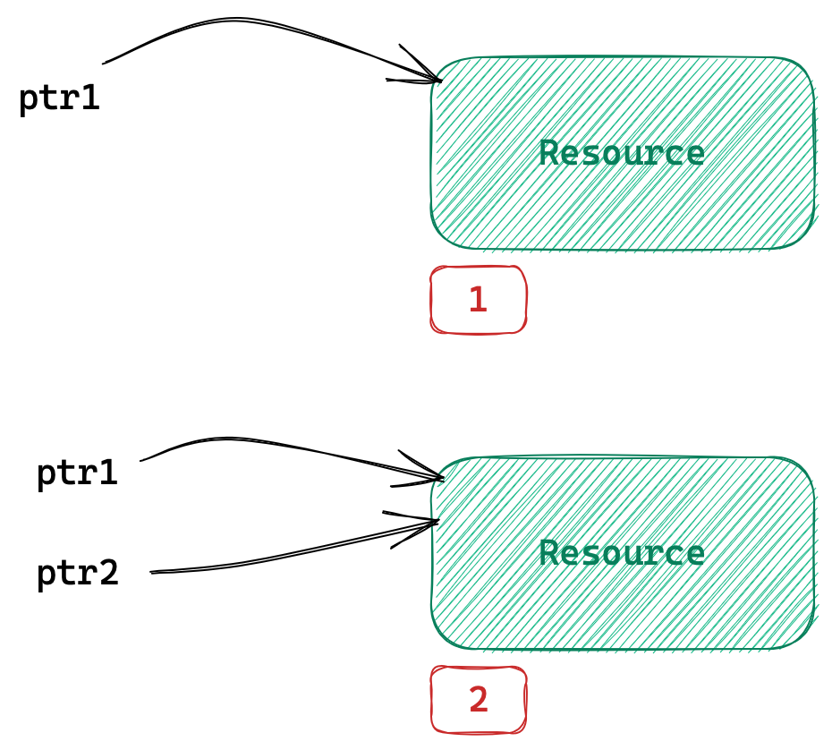

# 智能指针

### 为什么会出现智能指针？

上一节异常我们已经讨论过，异常处理不当导致的资源泄露等异常安全问题。

 ```cpp
 int div() {
 	int a = 0, b = 0;
 	cin >> a >> b;
 	if (b == 0)
 		throw invalid_argument("division by zero!");
 
 	return a / b;
 }
 void Func() {
     int* p1 = nullptr, *p2 = nullptr, *p3 = nullptr; 
     try {
 		int* p1 = new int;
 	    int* p2 = new int;
     	int* p3 = new int;
 		cout << div() << endl;
     }
     // 异常处理变得非常复杂
     catch (const exception& e) {
         if (p1) {
  			delete p1;           
         }
         else if (p2) {
             delete p1;
             delete p2;
         }
         else if (p3) {
             delete p1;
 			delete p2;
 			delete p3;
         }
 		throw e;
     }
 }
 
 int main()
 {
     try {
 		Func();
 	}
 	catch (const exception& e) {
 		cout << e.what() << endl;
 	}
     return 0;
 }
 ```

发生异常就会直接跳到异常捕获的位置，这样就会发生资源泄漏。虽然可以在释放处对异常捕获并再抛出，但<u>这样对资源的处理就会非常的麻烦，逻辑也要写的很复杂</u>。

因此大佬们便写出智能指针，帮助我们完成资源的管理任务。

## 1. 智能指针的使用和原理

智能指针需要解决三个问题：

1. 支持模拟`*`、`->`、`++`、`--`等指针运算；
2. 自动初始化自动销毁；
3. 解决指针拷贝问题。

### RAII

```cpp
template <class T>
class SmartPtr
{
public:
    SmartPtr(T* ptr) : _ptr(ptr)
    {}

    ~SmartPtr()
    {
        delete _ptr;
    }

private:
    T* _ptr;
};

void Func()
{
    try {
		SmartPtr<int> sp = new int;
    }
    catch(const exception& e) {
        cout << e.what() << endl;
    }
}
```

这样给`new`出来的资源“套了一个面向对象的壳”，就可以出作用域自动调用析构销毁资源。这和实现锁守卫的原理一样都是`RAII`。

`RAII`是一种利用对象生命周期来管理程序资源（如内存、文件句柄、网络连接、互斥量等等）初始化和销毁的简单思想。

**我们实际上把管理一份资源的责任托管给了一个对象**。对象构造时获取资源，对象析构时自动释放资源。此间对象控制对资源的访问，使之在对象的生命周期内始终保持有效。

#### 智能指针的实现难题

```cpp
int main()
{
    SmartPtr<int> sp1 = new int;

    SmartPtr<int> sp2(sp1); // 程序崩溃 ...
}
```

智能指针是用来管理资源的，如果要支持拷贝构造那必须是浅拷贝，因为二者须管理同一份资源。

**但如果二者双双析构又会导致析构两遍程序崩溃**。可见<u>如何多个对象管理同一份资源才是实现智能指针的难点</u>。

> 这牵扯到C++智能指针的发展历史了，让我们跟随智能指针的发展历程讨论如何实现智能指针吧。

### 1.1 auto_ptr

C++98标准库中第一个智能指针就是`auto_ptr`，而`auto_ptr`对智能指针的拷贝问题的处理方案是**管理权转移**。

```cpp
template <class T>
class auto_ptr
{
    public:
    auto_ptr(T* ptr) : _ptr(ptr)
    {}

    auto_ptr(auto_ptr& sp)
        : _ptr(sp._ptr) // 将资源的管理权移交到自己手上
	{
		sp._ptr = nullptr; // 将原指针置空
	}

    T& operator*()
    {
        return *_ptr;
    }
    T& operator->()
    {
        return _ptr;
    }

    auto_ptr& operator++()
    {
        ++_ptr;
    }
    auto_ptr& operator--()
    {
        --_ptr;
    }

    ~auto_ptr()
    {
        if (_ptr)
        {
            cout << "delete :" << _ptr << endl;
            delete _ptr;
        }
    }

    private:
    T* _ptr;
};

void test_auto_ptr()
{
    auto_ptr<int> p1(new int);
    auto_ptr<int> p2(p1); // 管理权转移

    cout << *p2 << endl;
    cout << *p1 << endl; // 程序崩溃
}
```

将原指针置空，并将资源的管理权移交到自己手上，析构的时候再去判断一下是否需要析构即可。**这样虽然实现拷贝的功能，但原智能指针`sp1`已经被悬空成了野指针**。

> 标准库中的`auto_ptr`就是这样实现的，所以库中的`auto_ptr`是个失败的半成品。

[std::auto_ptr](https://cplusplus.com/reference/memory/auto_ptr/)

### 1.2 unique_ptr

后期C++11才更新了智能指针，可见C++标准更新之慢。C++标准委员会的部分成员为了为将来的官方标准“探路”，站出来成立了`Boost`库作为标准库的后备，它也成为了“准”标准库。

当时Boost库设计出了三个智能指针`scoped_ptr`、`shared_ptr`、`weak_ptr`。

C++11更新后将Boost库中智能指针取其精华放到标准库中。而`std::unique_ptr`就是将Boost库的`scoped_ptr`改名而来的。

> 那`unique_ptr`是如何实现多个对象共同管理资源的呢？

`unique_ptr`的实现原理简单粗暴，禁止拷贝构造。

```cpp
template <class T> 
class unique_ptr
{
    public:
    unique_ptr(T* ptr) : _ptr(ptr)
    {}

    unique_ptr(const unique_ptr<T>& sp) = delete; // 直接禁止拷贝构造

    T& operator*()
    {
        return *_ptr;
    }
    T& operator->()
    {
        return _ptr;
    }

    unique_ptr& operator++()
    {
        ++_ptr;
    }
    unique_ptr& operator--()
    {
        --_ptr;
    }

    ~unique_ptr()
    {
        cout << "delete :" << _ptr << endl;
        delete _ptr;
    }

    private:
    T* _ptr;
};

void test_unique_ptr()
{
    std::unique_ptr<int> up1(new int);
    std::unique_ptr<int> up2(up1); // 编译报错
}
```

标准库中的`unique_ptr`就是这样实现的，直接将拷贝构造禁掉。

[std::unique_ptr](https://cplusplus.com/reference/memory/unique_ptr/)

> 那需要拷贝怎么办？再看下一个智能指针`shared_ptr`。

### 1.3 shared_ptr

那我们如何实现一个智能指针可以拷贝，也可以准确析构资源呢？

**使用引用计数，为管理的资源配对一个变量用来计数**。只有当最后一个对象析构时再去释放资源，其他对象析构的时候只需引用计数减1即可。

注意是<u>为被管理的资源配一个引用计数，而不是给对象</u>。

> 不能用静态成员变量，静态成员变量归所有对象共有，创建新对象又会将其置为1。



```cpp
template<class T> 
class shared_ptr
{
    public:
    shared_ptr(T* ptr)
        : _ptr(new int(0))
		, _pUseCount(new int(1)) // 为资源配一个引用计数
	{}

    shared_ptr(const shared_ptr<T>& sp)
        : _ptr(sp._ptr)
            , _pUseCount(sp._pUseCount)
	{
		(*_pUseCount)++;
	}

    shared_ptr<T>& operator=(const shared_ptr<T>& sp)
    {
        if (_ptr != sp._ptr)
        {
            shared_ptr<T> tmp(sp);

            swap(_ptr, tmp._ptr);
            swap(_pUseCount, tmp._pUseCount);
        }
        return *this;
    }
    
    T* operator->()
    {
        return _ptr;
    }
    T& operator*()
    {
        return *_ptr;
    }

    ~shared_ptr()
    {
        if (--(*_pUseCount) == 0) // 最后一个管理对象
        {
            cout << "delete" << _ptr << endl;
            delete _ptr;
            delete _pUseCount;
        }
    }

    private:
    T* _ptr;
    int* _pUseCount; // 引用计数
};
```

在构造函数首次接受资源的托管时，开辟一个堆变量作引用计数，就实现资源和引用计数配套了。

#### 线程安全

除此之外，多线程场景下我们无法保证对引用计数操作的安全。维护资源修改的线程安全是外部调用逻辑的任务，智能指针的实现需要考虑的是引用计数的线程安全。

```cpp
template<class T>
class shared_ptr
{
    public:
    shared_ptr(T* ptr)
        : _ptr(new int(0))
		, _pUseCount(new atomic<int>(1)) // 为资源配一个引用计数
	{}

    void AddRef()
    {
        (*_pUseCount)++;
    }
    shared_ptr(const shared_ptr<T>& sp)
        : _ptr(sp._ptr)
		, _pUseCount(sp._pUseCount)
	{
		AddRef();
	}

    shared_ptr<T>& operator=(const shared_ptr<T>& sp)
    {
        if (_ptr != sp._ptr)
        {
            shared_ptr<T> tmp(sp);

            swap(_ptr, tmp._ptr);
            swap(_pUseCount, tmp._pUseCount);
        }
        return *this;
    }

    T* operator->()
    {
        return _ptr;
    }
    T& operator*()
    {
        return *_ptr;
    }
    int use_count()
    {
        return *_pUseCount;
    }
    T* get() const 
    {
        return _ptr;
    }
    
    void Release()
    {
        if (--(*_pUseCount) == 0) // 最后一个管理对象
        {
            delete _ptr;
            delete _pUseCount;
        }
    }
    ~shared_ptr()
    {
        Release();
    }

    private:
    T* _ptr;
    atomic<int>* _pUseCount; // 引用计数
};
```

可以使用标准库中的原子操作类封装引用计数，也可以在`AddRef`和`Release`处加锁。

> `shared_ptr`是线程安全的吗？

是的，`shared_ptr`是线程安全的。引用计数的加减是有加锁保护的。但不保证资源的线程安全性。

#### 循环引用

普通场景下不会产生循环引用的问题，但在某些的特殊场景，如双向链表节点的前后指针。


```cpp
// 双向链表
struct ListNode
{
    int _val = 0;
    shared_ptr<ListNode> _prev = nullptr;
    shared_ptr<ListNode> _next = nullptr;
};

void test()
{
    shared_ptr<ListNode> n1 = new ListNode;
	shared_ptr<ListNode> n2 = new ListNode;
	n1->_next = n2;
	n2->_prev = n1;
}
```

- `n2->prev`和`n1`一起管理第一块资源，释放第一块资源不仅需要`n1`析构还需要`n2->prev`析构。
- `n1->next`和`n2`一起管理第二块资源，释放第二块资源不仅需要`n2`析构还需要`n1->next`析构。

> 出作用域后`n1`、`n2`相继析构，两个资源分别由`n2->prev`和`n1->next`管理。


`n2->prev`和`n1->next`分别属于第二块资源和第一块资源。现在就出现了循环引用的问题：

- **释放第一块资源需要先析构`n2->prev`，也就是需要先释放第二块资源**；

- **释放第二块资源需要先析构`n1->next`，也就是需要先释放第一块资源；**

只要满足你指向我、我指向你的情况，就会出现循环引用。释放你需要先释放我，释放我需要先你。最后二者“互掐脖子”，就悄无声息的内存泄漏了。

> 这个问题怎么解决呢？那就要引出`weak_ptr`了。

### 1.4 weak_ptr

`weak_ptr`不是常规意义的智能指针，他没有接受原生指针的构造函数，并不符合`RAII`思想。**它的意义就在于辅助`shared_ptr`解决重复引用问题**。


`weak_ptr`可以访问资源，**但不因指向资源而改变其引用计数，也就是不参与资源的释放工作**。

```cpp

    template <class T>
    class weak_ptr
    {
    public:
        weak_ptr() : _ptr(nullptr)
        {}
        weak_ptr(const weak_ptr<T>& wp)
            : _ptr(wp._ptr)
        {}

        weak_ptr(const shared_ptr<T>& sp)
            : _ptr(sp.get())
        {}

        ~weak_ptr()
        {}

        weak_ptr<T>& operator=(const shared_ptr<T>& sp)
        {
            _ptr = sp.get();
            return *this;
        }
        weak_ptr<T>& operator=(const weak_ptr<T>& wp)
        {
            _ptr = wp._ptr;
            return *this;
        }

        T* operator->()
        {
            return _ptr;
        }
        T& operator*()
        {
            return *_ptr;
        }

    private:
        T* _ptr;
    };
```

```cpp
struct ListNode
{
    int _val = 0;
    weak_ptr<ListNode> _prev = nullptr;
    weak_ptr<ListNode> _next = nullptr;
};

void test_weak_ptr()
{
    shared_ptr<ListNode> n1(new ListNode);
    shared_ptr<ListNode> n2(new ListNode);

    n1->_next = n2;
    n2->_prev = n1;
}
```

类内的指针不参与资源管理所以使用`weak_ptr`，资源管理交给调用方的`shared_ptr`。

### 定制删除器

```cpp
class A
{
    int _a;
};   

void test_delete()
{
    A* p = new A[10];
    delete p; // Err?? 是否报错
}
```

上述代码正常运行，因为`new`和`delete`底层分别是`malloc`和`free`。因为没有显式实现析构，编译器就不会在所开空间的头上使用四字节存储数组的长度，所以直接`delete`不会报错。

如果实现了析构，编译器就会存储数组长度并调用析构长度次，`delete`就会只析构一次。所以一定要匹配使用。

```cpp
class A {
public:
    ~A() {
        cout << "~A()" << endl;
    }
private:
    int _a;
};

void test_delete() {
    A* p = new A[10];
    delete[] p;
}
```

因此，前面实现的智能指针接收一个对象可以，但如果接收一个数组，调用析构的时候一定出错。

```cpp
unique_ptr<A> up1 = new A;
// 析构报错
unique_ptr<A>    up2 = new A[10];              
unique_ptr<A>    up3 = malloc(sizeof(A) * 10); 
unique_ptr<FILE> up4 = fopen("test.txt", "w"); 
```

> 标准库中`shared_ptr`的删除器是通过构造函数传递的，较为复杂。我们模拟实现`unique_ptr`的删除器即可。

```cpp
template <class T> 
struct default_delete
{
    void operator()(const T* ptr)
    {
        cout << "default_delete: " << ptr << endl;
        delete ptr;
    }
};
template <class T, class D = default_delete<T>> class unique_ptr
{
public:
    unique_ptr(T* ptr)
        : _ptr(ptr)
	{}

    unique_ptr(const unique_ptr<T>&) = delete;
    unique_ptr<T>& operator=(const unique_ptr<T>&) = delete;

    ~unique_ptr()
    {
        D()(_ptr);
    }

    T& operator*()
    {
        return *_ptr;
    }
    T* operator->()
    {
        return _ptr;
    }
    T* get() const
    {
        return _ptr;
    }

private:
    T* _ptr;
};
```

在类模版参数处提供一个定制删除器的仿函数，如何释放资源由删除器管理。析构函数调用该仿函数即可。

```cpp
template <class T>
struct delete_array
{
    void operator()(const T* ptr)
    {
        cout << "delete_array: " << ptr << endl;
        delete[] ptr;
    }
};

struct delete_file
{
    void operator()(FILE* ptr)
    {
        cout << "delete_file: " << ptr << endl;
        fclose(ptr);
    }
};

struct A
{
    ~A()
    {
        cout << "~A()" << endl;
    }

    int _a;
};
void test_deleter()
{
    unique_ptr<A>                      up1(new A);
    unique_ptr<A,    delete_array<A>>  up2(new A[2]);
    unique_ptr<FILE, delete_file>      up3(new FILE);
}
```

&nbsp;

### 对比总结

| 智能指针     | 实现方案                                       |
| ------------ | ---------------------------------------------- |
| `auto_ptr`   | 管理权转移，导致被拷贝对象悬空                 |
| `unique_ptr` | 直接禁止拷贝赋值                               |
| `shared_ptr` | 为资源添加引用计数以支持拷贝，但会出现循环引用 |
| `weak_ptr`   | 不修改引用计数，用于解决循环引用               |
