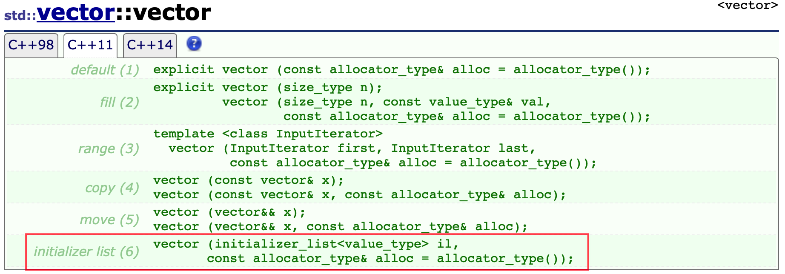
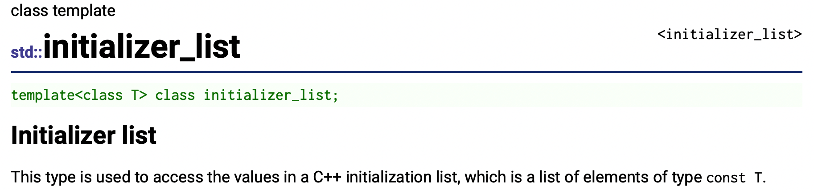
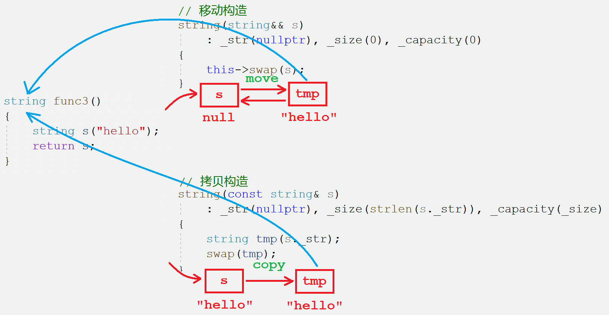
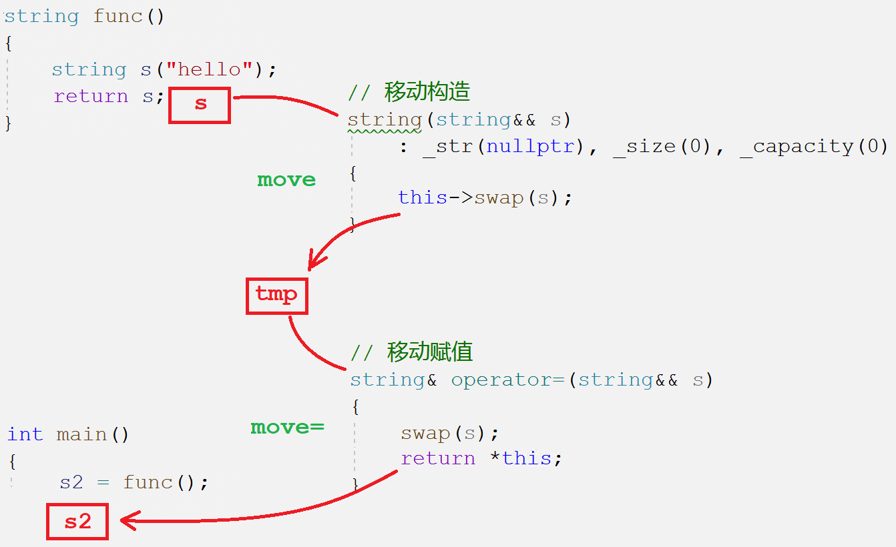
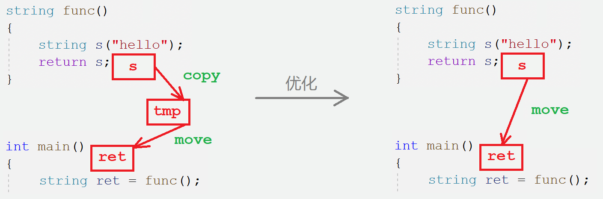
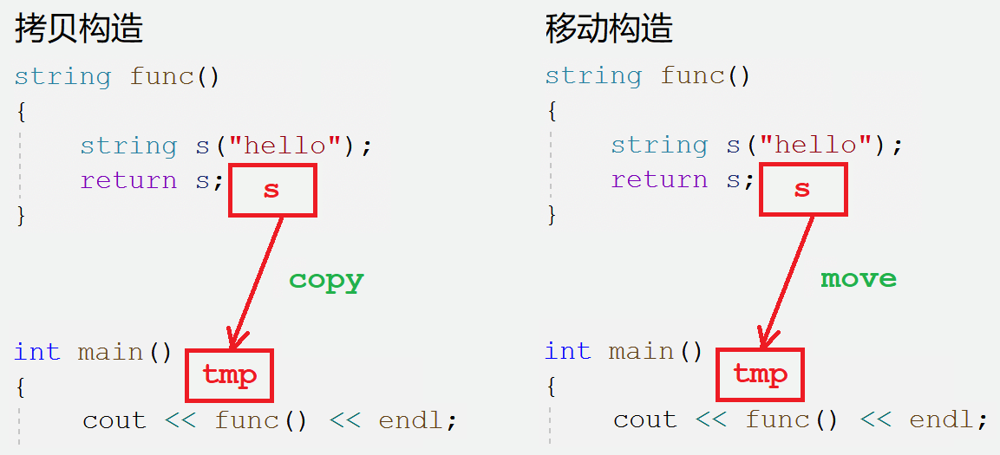
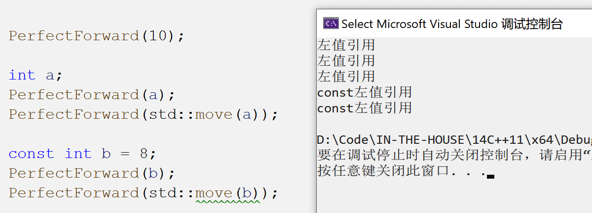
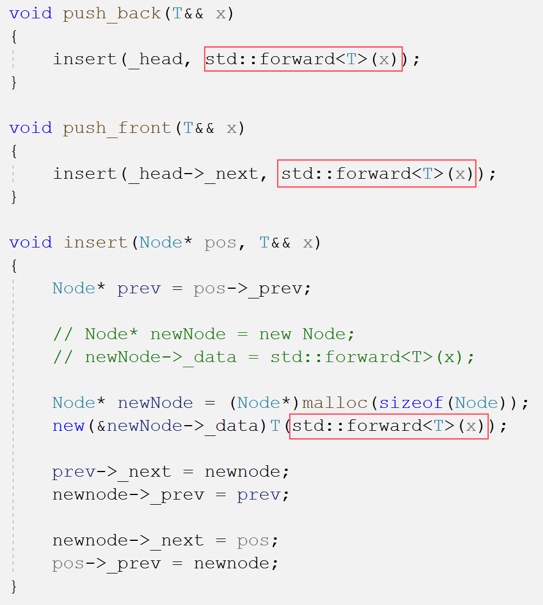

# C++11语法

## 0. C++11简介

2003年C++标准委员会曾经提交了一份技术勘误表(简称TC1)，由于TC1主要是对C++98标准中的漏洞进行修复，语言的核心部分则没有改动，因此人们习惯性的把两个标准合并称为C++98/03标准。

从C++0x到c++11，C++标准10年磨一佥第二个真正意义上的标准珊珊来迟。相比于C++98/03，C++11则带来了数量可观的变化，其中包含了约140个新特性，以及对C++03标准中约600个缺陷的修正，这使得C++11更像是从C++98/03中孕育出的一种新语言。

相比较而言，C++11能更好地用于系统开发和库开发、语法更加泛华和简单化、更加稳定和安全，不仅功能更强大，而且能提升程序员的开发效率。

[cpp11](https://en.cppreference.com/w/cpp/11)

&nbsp;

## 1. 列表初始化

C语言允许使用花括号`{}`对数组元素进行统一的列表初始化。

C++11扩大了用`{}`列表（初始化列表）的使用范围，可用于所有的内置类型和用户自定义的类型。赋值符`=`也可以省略。

```cpp
Point p = { 1 , 2 };              // C++98
Point pp{ 1 , 2 };                // C++11
Point parr[]{ {1, 2}, {3, 4} };   // C++11

int a = 1;                        // C++98
int b1 = { 2 };                   // C++11
int b2{ 2 };                      // C++11
int b3({ 2 });                    // C++11

int* ptr1 = new int[5];           // C++98
int* ptr2 = new int[5] {1, 2, 3}; // C++11

int arr[10] = { 1, 2, 3, 4 };     // C++98
vector<int> v = { 1,2, 3,4 };     // C++11

A a2 = 2;               // 单参数隐式类型转换 C++98
Point pp{ 1 , 2 };      // 多参数隐式类型转换 C++11
```

> C++11对容器也可以使用列表初始化，这到底是如何做到的呢？

```cpp
vector<int> v1 = { 1,2,3,4,5,6 };
```



如图所示，C++11 中一般容器可以使用`initializer_list`初始化列表初始化。初始化列表`initializer_list`是C++11原生支持的一种容器。



```cpp
auto il = { 10, 20, 30 };  // the type of il is an initializer_list
```

如上述代码，把`{}`内容赋值给一个对象，这个对象就是 initializer_list 类型。可以认为，它的底层实现就是用内存数组存储列表中的内容。

```cpp
initializer_list<int> il = { 1,2,3,4,5,6 }; // 创建对象

vector<int> v1 = { 1,2,3,4,5,6 }; // 初始化vector
v1 = { 1,2,3,4,5,6 };             // vector赋值

pair<string, string> kv = { "left", "左边" };
map<string, string> dict = {
    {"sort", "排序"},
    {"insert", "插入"},
    {"map", "地图"},
    kv,
    make_pair("list", "列表")
};
```

> 如何为自定义类型实现列表初始化呢？以 list 为例：

```cpp
// list constructor
list(initializer_list<T> il) : _head(new Node)
{
    _head->_prev = _head;
    _head->_next = _head;

    list<T> tmp(il.begin(), il.end());
    std::swap(_head, tmp._head);
}
```

&nbsp;

## 2. 变量类型推导

### 2.1 auto

> 在C++98中auto是一个存储类型的说明符，表示变量是局部存储类型，但局部域中定义的局部变量本身就是自动存储类型，故C++98中的auto没有价值。

C++11中在定义变量时，将auto实现于自动类型推导，让编译器自动推导变量的类型，使用auto更加便捷省时。


```cpp
auto i = 0;
```

### 2.2 decltype

关键字`decltype`使用表达式的类型声明一个新的变量。

```cpp
// 获取变量类型名
cout << typeid(x).name() << endl; 

// 使用变量的类型创建新变量
decltype(x) i = 1; 
decltype(x * y) i = 1; 

int(*pfunc1)(int) = &func; // 类型过于复杂，使用decltype获取类型
decltype(func) pfunc2;
```

&nbsp;

## 3. 右值引用和移动语义

> 右值引用和移动语义可以说是C++11中最重要的更新，在根本上减少了拷贝，提升了C++的效率。

### 3.1 左值引用和右值引用

#### 左值右值

- 左值是一个表示数据的表达式，如变量名或解引用后的指针。一般指表达式结束后依然存在的持久对象。
- 右值也是一个表示数据的表达式，如字面常量、表达式返回值、函数调用的传值返回值。一般指表达式结束就不再存在的临时对象。

| 左值特点                               | 右值特点                   |
| -------------------------------------- | -------------------------- |
| 左值可以取地址也可以赋值               | 右值不可被取地址不可赋值。 |
| 左值可以出现在赋值符的左边也可以是右边 | 右值只能出现在赋值符的右边 |

`const`修饰的具有常属性的变量也是变量，故也是左值。

> 肤浅的理解，左值就是变量，右值就是常量。

##### 右值的分类

1. 将亡值：指生命周期即将结束的值，一般是跟右值相关的表达式，这样表达式通常是将要被移动的对象。
2. 纯右值：按值返回的临时对象、运算表达式产生的临时对象、字面常量和lambda表达式等。

##### 表达式的概念

表达式是由运算符和运算对象构成的计算式。表达式是可求值的求值可得到结果，表达式结果必属于左值、将亡值或纯右值三者之一。

“左值”和“右值”是表达式结果的一种属性。通常用“左值”来指代左值表达式，用“右值”指代右值表达式。

```cpp
// 左值
int a = 1; 
int* p = &a;
const int b = 1;
// 左值引用
int& ra = a; 
int& rp = *p;
const int& rb = b;

// 右值
10 = a; //Err
10;
x + y;
plus(x + y);
```

综上所述，**可以取地址的对象就是左值，反之不可以取地址的对象就是右值**。

#### 左值右值引用

C++98中的引用就是左值引用。**左值引用就是给左值取别名，右值引用就是给右值取别名**。左值引用用`&`表示，右值引用使用`&&`表示。

```cpp
// 左值引用
int& ra = a; 
int& rp = *p;
const int& rb = b;

// 右值引用
int&& rr1 = 10;
int&& rr2 = x + y;
int&& rr3 = fmax(x, y);
```

##### 交叉引用

> 左值引用能否引用右值？右值引用能否引用左值？

```cpp
// 左值引用引用右值
const int& r1 = 10;
const int& r2 = x + y;
const int& r3 = fmin(x, y);
// 右值引用引用左值
int*&& rr1 = std::move(p);
int&& rr2 = std::move(*p);
int&& rr3 = std::move(a);
```

- 左值引用不能直接引用右值，但可以加`const`变成常引用即可。
- 右值引用不能直接引用左值，但可以引用`std::move`之后的左值。

`std::move()`该函数名字具有迷惑性，它并不直接搬移资源，而是将一个左值强制转化为右值引用，然后实现移动语义。

需要注意的是，**给右值取别名后，该右值会被当作变量存储在内存中，且可以取地址**。

### 3.2 移动构造和移动赋值

#### 移动构造

> 考虑右值引用之前我们先看看左值引用的场景，左值引用的应用场景是做参数和做返回值。

| 应用场景         | 评价                       |
| ---------------- | -------------------------- |
| 左值引用作参数   | 减少拷贝，基本解决问题     |
| 左值引用作返回值 | 只能解决部分场景的拷贝问题 |

```cpp
string func3() // 返回值不能使用左值引用
{
    string s("hello");
    return s;
}
```

如上示例函数，返回类型为对象的传值返回的函数，在返回时必定会发生拷贝。

> 那如何解决函数调用传值返回必须拷贝的问题呢？移动构造。

```cpp
// 移动构造
string(string&& s) // 右值引用传参
    : _str(nullptr)
    , _size(0), _capacity(0)
{
	this->swap(s); // 转移资源
}
```

**移动构造就是将将亡值对象的资源直接转移给当前待构造对象**，避免发生拷贝。

```cpp
string func3()
{
	string s("hello"); 
    return s; // s是将亡值，转移其资源给临时返回对象
}
```

既然值返回函数必须要拷贝构造出一个临时对象用来返回，且被拷贝对象是栈变量即将销毁，**编译器会将被拷贝对象视为将亡值，会自动调用移动构造来构造返回的临时对象**。



#### 移动赋值

 ```cpp
 // 移动赋值
 string& operator=(string&& s)
 {
     swap(s);
     return *this;
 }
 
 // 使用场景
 s2 = move(s1);
 s2 = func();
 ```



当然C++11中各种STL容器也新增了移动构造和移动赋值。

### 3.3 两种构造效率对比

> 既然C++98中的 const 引用左值和右值都可以，为什么C++11还要提出复杂的右值引用呢？用下列代码验证

```cpp
string func() {
    string s("hello");
    return s;
}

int main() {
    string ret = func();
	//...
```

#### 拷贝构造的场景


在只有拷贝构造的情况，原本是需经过两次拷贝构造，一是`s`拷贝构造`tmp`，二是`tmp`拷贝构造`ret`。经过编译器优化后只有一次拷贝构造，直接用`s`拷贝构造`ret`。

#### 移动构造的场景



在有拷贝构造+移动构造的情况，原本是需一次拷贝构造一次移动构造。经编译器优化后只有一次移动构造，直接用`s`移动构造`ret`。

在优化后的场景中，编译器会直接将`s`识别成右值将亡值，采用移动构造构造`ret`。

两种场景的区别就是：

| 场景区别                           | 优化区别                     |
| ---------------------------------- | ---------------------------- |
| 如何构造对象，拷贝构造还是移动构造 | 是否优化，即是否构造临时对象 |

##### 无法优化的场景

当然也存在无法优化的场景，就是一定要构造出一个临时对象，比如不用对象接收返回值。



`s`构造临时对象，临时对象作为`func`函数调用表达式的返回值，没有优化的空间。当然这和我们对比拷贝构造和移动构造的效率没关系。

### 3.4 万能引用和完美转发

#### 万能引用

```cpp
template <class T>
void PerfectForward(T&& t) /* 万能引用 */
{}
```

`&&`如果放在具体类型的后面就代表右值引用，放在模版类型后面代表万能引用。**万能引用既能接收左值也能接收右值**。

```cpp
// 测试完美转发
void Func(int& x)        { cout << "左值引用"      << endl; }
void Func(const int& x)  { cout << "const左值引用" << endl; }
void Func(int&& x)       { cout << "右值引用"      << endl; }
void Func(const int&& x) { cout << "const右值引用" << endl; }

template <class T>
void PerfectForward(T&& t) {
    Func(t);
}

int main() {
    PerfectForward(10);

    int a;
    PerfectForward(a);
    PerfectForward(std::move(a));

    const int b = 8;
    PerfectForward(b);
    PerfectForward(std::move(b));
}
```

#### 完美转发



如图所示，**右值在传参的时候会变成函数形参开辟栈空间，从而退化成左值**，丢失了右值属性。如果要维持属性就要在传参的时候使用完美转发`std::forward()`。

```cpp
template <class T>
void PerfectForward(T&& t)
{
    Func(std::forward<T>(t)); /* 完美转发 */
}
```

> 库或者自行实现的各种容器的右值插入也要支持完美转发。



&nbsp;

## 4. 默认成员函数

### 4.1 默认成员函数控制

拷贝构造也是一种特殊的构造函数，如果只实现拷贝构造没有实现普通构造，编译器是不会生成默认构造的，这样就没法创建对象。

- 在默认函数定义或者声明后加上`=default`，可以显式指示编译器生成该函数的默认版本。
- 相反，加上`=delete`可以避免生成该函数的默认版本。


```cpp
class A
{
public:
    A() = default;
    A(const A& a);
    A operator=(const A& a) = delete;
private:
    // ...
};
```

C++98没有这样的关键字，那就必须将构造函数至声明不实现并私有化，能防止类外使用和类外实现。

### 4.2 新增默认成员函数

C++98有六个默认成员函数：构造函数、拷贝构造、拷贝赋值、析构函数以及常和非常的取地址操作符重载。C++11新增两个默认成员函数：移动构造、移动赋值。

#### 移动构造的特性

- 如果没有实现移动构造，且没有实现析构函数、拷贝构造、拷贝赋值，那编译器会自动生成一个默认的移动构造。
- 默认生产的移动构造，对于内置类型的成员会逐字节拷贝，对于自定义类型成员如果内部有移动构造就调用移动构造，没有就调用拷贝构造。

#### 移动赋值的特性

- 如果没有实现移动赋值，且没有实现析构函数、拷贝构造、拷贝赋值，那编译器会自动生成一个默认的移动赋值。
- 默认生产的移动赋值，对于内置类型的成员会逐字节拷贝，对于自定义类型成员如果内部有移动赋值就调用移动赋值，没有就调用拷贝赋值。

> 显然默认的移动构造和移动赋值的生成规则和成员处理规则完全一致。

```cpp
//test
class Person {
public:
    Person(const char* name = "", int age = 18) : _name(name), _age(age)
    {}
    // #define kbgz 1
    // #define kbfz 1
    // #define xg 1
#ifdef kbgz
    Person(const Person& p) : _name(p._name), _age(p._age)
    {}
#endif
#ifdef kbfz
    Person operator=(const Person& p) {
        if (this == &p) {
            Person tmp(p);
            return tmp;
        }
        return *this;
    }
#endif
#ifdef xg
    ~Person() {}
#endif
private:
    test::string _name;
    int _age;
};
int main()
{
    Person p1("hello", 18);
    Person p2 = std::move(p1);
    p1 = std::move(p2);
```

&nbsp;

## 5. lambda表达式

#### 可调用对象

`lambda`表达式是一种可调用对象，就是像函数指针一样可以调用的一种对象，C++中的可调用对象有函数指针、仿函数、`lambda`表达式以及包装器。

| 出现时期 | 语法                 |
| -------- | -------------------- |
| C        | 函数指针             |
| C++98    | 仿函数               |
| C++11    | lambda表达式、包装器 |

不必担心，这些可调用对象的出现都是为了简化函数指针的使用成本，都是简单易用的。

### lambda的语法

```cpp
// lambda示例
[capture_list] (param_list) -> ret_type 
{
    func_body;
};
```

`lambda`表达式可称为匿名函数，一方面因为内部就是函数，一方面因为它没有名字。

虽然本身语法不带名字，但可以赋值给一个`auto`变量，相当于取个名字。它的使用和函数一样。

`lambda`表达式之间不能相互赋值，即使看起来类型相同。

```cpp
//lambda - 两数相加
auto add = []() -> int {
    return a +b; 
};

// 取名
auto add2 = add;
decltype(add) add3 = add;
// 调用
cout << add(1, 2) << endl;
```

| 语法组成         | 解释                                                         | 是否省略       |
| ---------------- | ------------------------------------------------------------ | -------------- |
| `[captrue_list]` | 捕获列表，捕捉当前作用域中的变量。分为传值捕捉和引用捕捉。   | 不可省略       |
| `(param_list)`   | 参数列表，形参默认具有`const`属性，可加`mutable`去除常属性。 | 无参可省略     |
| `-> ret_type`    | 指明返回类型                                                 | 可省略自动推导 |
| `{...}`          | 函数体内容                                                   | 不可省略       |

```cpp
[] {
	cout << "lambda" << endl;   
}

auto swap1 = [](int x, int y) {  // 形参默认具有const属性，编译报错
    int tmp = a;
    a = b;
    b = tmp;
};

auto swap2 = [](int x, int y) mutable {  // mutable去除const常属性，但不影响传值调用
    int tmp = a;
    a = b;
    b = tmp;
};

auto swap3 = [](int& x, int& y) { // 引用传参
    int tmp = x;
    x = y;
    y = tmp;
};
```

#### 捕获列表

`[captrue_list]`  捕获列表，用来捕捉当前作用域前和全局的变量。`[]`不可省略。

- 分为传值捕捉和引用捕捉，引用捕捉`[&a, &b]`。
- `[&]`表示全引用捕捉，引用捕捉所有能捕捉到的变量。`[=]`表示全传值捕捉，传值捕捉所有能捕捉到的变量。
- `[&a, =]`表示混合捕捉，引用捕捉`a`变量，其他变量传值捕捉。但不可重复捕捉。

```cpp
auto swap1 = [a, b] () {   // 传值捕捉
    int tmp = a;
    a = b;
    b = tmp;
};
auto swap2 = [&a, &b] () { // 引用捕捉
    int tmp = a;
    a = b;
    b = tmp;
};
auto swap3 = [=] () { // 全传值捕捉
    int tmp = a;
    a = b;
    b = tmp;
};
auto swap4 = [&] () { // 全引用捕捉
    int tmp = a;
    a = b;
    b = tmp;
};

// 混合捕捉
[&a, &b, =](){}; // 引用捕捉a和b变量，其他变量传值捕捉
[=, a](){}; // 重复传值捕捉a，编译报错
```

`lambda`表达式的用处体现在简单易用的方面。

> lambda表达式的是怎样的？

```cpp
auto lamdba = []() {};
cout << typeid(lamdba).name() << endl; // class `int __cdecl main(void)'::`2'::<lambda_1>
```

通过上述代码可以看出，VS2019的实现是使用其链接时的函数名字，VS2013的实现是使用哈希随机值。

可以得到结论，lambda表达式类似于范围for都是语法糖，最后都会被编译器处理，它的底层实现各个编译器大同小异。

&nbsp;

## 6. 模版的可变参数 

> C++11支持模版的可变参数，相比类模版和函数模版的固定数量的参数，这是一个巨大的改进。然而由于可变模版参数比较抽象，也比较晦涩难懂，所以我们只探讨其中基础的使用部分即可。

```cpp
template <class ...Args>
void ShowList(Args... args) // 可变模版参数
{}
```

`Args`前面有`...`表明其是一个可变模版参数，我们把这样的参数称为“参数包”，它里面包含了 $[0,N]$ 个模版参数。

```cpp
// 展示参数包个数
cout << sizeof...(Args) << endl;
cout << sizeof...(args) << endl;

// 递归打印参数及其类型
void ShowList() // 递归终止函数
{}

template <class Now_Type, class ...TypeSet>
void ShowList(Now_Type now_arg, TypeSet... args)
{
    cout << typeid(now_arg).name() << ":" << now_arg << endl;
    ShowList(args...); // 参数包向下传递

    cout << endl;
}

void test_variadic_templates()
{
    ShowList(1, "A", 1.1);
}

// 另一种打印方法
template <class T>
int ShowArgs(T arg)
{
    cout << typeid(arg).name() << ":" << arg << endl;
    return 0;
}

template <class ...TypeSet>
void ShowList(TypeSet... args)
{
    int arr[] = { ShowArgs(args)... }; // 利用列表初始化过程
}
void test_variadic_templates()
{
    ShowList(1, "A", 1.1);
}
```

> 可变模版参数的语法可以说是非常的古怪，事实上我们基本不会使用，不必过多深究，只要在看到能够认出即可。

&nbsp;

## 7. 包装器

包装器用来包装具有相同特征和用途的多个可调用对象，便于以统一的形式调用它们。

### 7.1 function包装器

function包装器也叫做适配器，C++中的function本质是一个类模版。定义如下：

```cpp
template <class RetType, class... ArgsType> /* 声明返回类型和参数类型 */
	class function<Ret(Args...)>; 
```

使用示例：

```cpp
// 普通函数
int f(int a, int b) {
    return a + b;
}	
// 操作符重载
struct Functor {
    int operator()(int x, int y) {
        return x + y;
    }
};
// 非静态成员函数
struct Plus {
    int plus(int a, int b) {
        return a + b;
    }
};
// 静态成员函数
struct Sub {
    static int sub(int a, int b) {
        return a + b;
    }
};

int main()
{
    std::function<int(int, int)>          f1 = f;
    std::function<int(int, int)>          f2 = Functor();
    std::function<int(Plus&, int, int)>   f3 = &Plus::plus;
    std::function<int(int, int)>          f4 = Sub::sub;
}
```

场景示例：

[逆波兰表达式求值](https://leetcode.cn/problems/evaluate-reverse-polish-notation/)

```cpp
// 使用包装器，包装所有操作函数
class Solution {
public:
    int evalRPN(vector<string>& tokens) 
    {
        static map<string, function<int (int, int)>> opFuncMap;
        opFuncMap = {
            { "+", [](int op1, int op2){ return op1 + op2; } },
            { "-", [](int op1, int op2){ return op1 - op2; } },
            { "*", [](int op1, int op2){ return op1 * op2; } },
            { "/", [](int op1, int op2){ return op1 / op2; } }
        };
        stack<int> s;

        for (auto& op : tokens) 
        {
            if (opFuncMap.find(op) != opFuncMap.end()) // 操作符
            {
                int op2 = s.top();
                s.pop();
                int op1 = s.top();
                s.pop();
                s.push(opFuncMap[op](op1, op2));
            }
            else // 操作数
            {
                s.push(stoi(op));
            }
        }
        return s.top(); // 最终结果
    }
};
```

### 7.2 bind

bind 函数也是一个函数包装器，本质是一个函数模版。生成一个新的可调用对象，来调整一个可调用对象的参数列表。

```cpp
// without return 
template <class Func, class... Args>
    bind(Func&& fn, Args&&... args);

// with return type
template <class Ret, class Fn, class... Args>
    bind(Func&& fn, Args&&... args);
```

使用示例：

```cpp
// 通过bind调整参数顺序
function<int(int, int)> f1 = bind(Sub, placeholders::_1, placeholders::_2);
function<int(int, int)> f2 = bind(Sub, placeholders::_2, placeholders::_1);

cout << f1(2, 1) << endl;
cout << f2(1, 2) << endl;

// 通过bind调整参数个数
function<int(Sub&, int, int)> f3 = &Sub::sub;
cout << f3(Sub(), 2, 1) << endl;
function<int(int, int)> f4 = bind(&Sub::sub, Sub(), placeholders::_1, placeholders::_2);
cout << f4(2, 1) << endl;
```

&nbsp;

## 8. 线程库

C++11提供了跨平台的具有面向对象特性的线程库，线程相关的系统知识在此不作赘述，直接讨论线程库的使用。

### thread类

| 构造函数                                       | 解释                                 |
| ---------------------------------------------- | ------------------------------------ |
| **thread () noexcept**                         | 创建空的thread对象，不执行任何操作   |
| **explicit thread (Fn&& fn, Args&&... args);** | 万能引用参数，传入调用对象和参数列表 |
| **thread (const thread&) = delete;**           | 线程对象不可拷贝                     |
| **thread (thread&& x) noexcept;**              | 移动构造                             |
| **其他成员函数**                               |                                      |
| **void join ()**                               | 等待线程                             |
| **void detach ()**                             | 分离线程                             |

多线程冲突代码示例：

```cpp
void Routine(int& x, int n)
{
    while (n--)
        ++x;
}

void test_thread()
{
    int x = 0;

    thread t1(Routine, std::ref(x), 10000);
    thread t2(Routine, std::ref(x), 10000);

    t1.join();
    t2.join();

    cout << x << endl; // 可能发生线程冲突
}
```

关于当前线程的一些操作被放到`this_thread`类中：

| this_thread 成员函数                                         | 解释                 |
| ------------------------------------------------------------ | -------------------- |
| **thread::id get_id () noexcept**                            | 返回当前线程的线程ID |
| **void sleep_for (const chrono::duration<Rep,Period>& rel_time)** | 设置当前线程休眠时间 |

```cpp
atomic<int> x = 0;

vector<thread> thds; // 线程池
thds.resize(N);

for (auto& td : thds) { // 初始化线程池
    td = thread([&x, M]() { 
            int i = 0;
            while (i++ < M)
            {
                cout << this_thread::get_id() << "->" << x << endl; // get_id()
                this_thread::sleep_for(std::chrono::seconds(1));      // sleep_for()
                this_thread::sleep_for(std::chrono::milliseconds(1)); // sleep_for()
                x++;
            }
    	}
	);
}

for (auto& td : thds) {
    td.join();
}
```

### mutex类

C++没有提供其他类型的锁，`mutex`类封装系统中的互斥锁，具体接口如下：

| 成员函数                          | 解释       |
| --------------------------------- | ---------- |
| **mutex() noexcept**              | 创建互斥锁 |
| **mutex (const mutex&) = delete** | 禁止拷贝锁 |
| **void lock()**                   | 加锁       |
| **void unlock()**                 | 解锁       |

```cpp
void Routine(mutex& mtx, int& x, int n)
{
    mtx.lock();   // lock
    while (n--)
        ++x;
    mtx.unlock(); // unlock
}
void test_thread()
{
    mutex mtx; // construct mutex
	int x = 0;
 
    thread t1(Routine, std::ref(mtx), std::ref(x), 10000);
    thread t2(Routine, std::ref(mtx), std::ref(x), 10000);
    t1.join();
    t2.join();
    
    cout << x << endl;
}
```

> 此处有一个小注意点，这里锁最好放循环外边。放里面的话，一条语句太短会导致频繁竞争锁切换线程上下文。如果非要放里面可以采用自旋锁而非互斥锁。

### atomic类

一条语句`++x`使用互斥锁加锁解锁保护就显得小题大做，也可以直接使用原子操作。原子操作实际上是让CPU执行指定的语句的时候不被中断，来保证其线程安全性。

[Linux原子操作系统调用](https://blog.csdn.net/weixin_53318672/article/details/121921628)

C++中使用`atomic`类封装系统原子操作的系统调用的，具体定义如下：

```cpp
template <class T> struct atomic;

T fetch_add (T val, memory_order sync = memory_order_seq_cst) volatile noexcept; // 加
T fetch_sub (T val, memory_order sync = memory_order_seq_cst) volatile noexcept; // 减
T fetch_and (T val, memory_order sync = memory_order_seq_cst) volatile noexcept; // 与
T fetch_or  (T val, memory_order sync = memory_order_seq_cst) volatile noexcept; // 或
T fetch_xor (T val, memory_order sync = memory_order_seq_cst) volatile noexcept; // 异或
T operator++() volatile noexcept; // ++
T operator--() volatile noexcept; // --
```

> 模版参数`T`几乎支持所有的整型家族类型。

使用示例：

```cpp
void Routine(atomic<int>& x, int n)
{
    while (n--)
        x.fetch_add(1);
}

void test_thread()
{
    atomic<int> x = 0;

    thread t1(Routine, std::ref(x), 100000);
    thread t2(Routine, std::ref(x), 100000);
    t1.join();
    t2.join();

    cout << x << endl;
}
```

虽然加锁可以解决问题，但加锁有一个缺陷：一个线程竞争锁后其他线程必须处于阻塞式等待状态，消耗太大，而且加锁解锁比较麻烦，且误操作容易造成死锁。因此C++11中引入原子操作。使得线程间数据的同步变得非常高效。

[无锁算法CAS](https://blog.csdn.net/qq_31960623/article/details/115573337)

### 锁守卫

```cpp
void ThreadFunc(vector<int>& v, int n, int base, mutex& mtx)
{
    int i = 0;
    while (i++ < n)
    {
        mtx.lock();
        v.push_back(base + i); // 开空间抛异常，造成死锁
        mtx.unlock();
    }
}

void test_lock()
{
    vector<int> v;
    mutex mtx;

    thread t1(ThreadFunc, std::ref(v), 100, 1000, std::ref(mtx));
    thread t2(ThreadFunc, std::ref(v), 100, 2000, std::ref(mtx));
    t1.join();
    t2.join();
```

类似于上述<u>对STL容器加锁的操作是有异常风险的，STL容器不保证线程安全</u>，不捕获异常会跳过释放锁的步骤，造成死锁。

```cpp
try {
    int i = 0;
    while (i++ < n) {
        mtx.lock();
        v.push_back(base + i);  
        mtx.unlock();
    }
} catch (const exception& e) {
    cout << e.what() << endl;
    mtx.unlock(); /* 捕获异常并解锁 */
}
```

当然可以像上述代码一样，捕获异常并解锁。但如果有多个资源需要释放呢？还需要加各种判断，显然是不够好的方法。<u>因此对异常时资源的处理问题，需要交给“智能指针智能锁”等方式解决</u>。

#### RAII

RAII (Resource Acquisition Is Initialization) ，即“资源获取就是初始化”，是 C++ 语言的一种管理资源、避免泄漏的惯用法。

**本质是将资源封装成类对象，利用面向对象的思路，自动调用初始化和析构函数。以达到获取资源自动进行初始化，出作用域自动释放资源的效果**。

上述代码中的`mutex`互斥锁就可以利用 RAII 封装成“智能锁”，我们称之为锁守卫：

```cpp
// LockGuard
template <class Lock>
class LockGuard
{
public:
    LockGuard(Lock& lock)
        : _lock(lock)
    {
        _lock.lock();
    }
    ~LockGuard()
    {
        _lock.unlock();
    }

private:
    Lock& _lock;
};
void ThreadFunc(vector<int>& v, int n, int base, mutex& mtx)
{
    try {
        int i = 0;
        while (i++ < n) {
            LockGuard<mutex> lock(mtx); // 此处自动竞争锁
            v.push_back(base + i);
        } // 此处自动释放锁
    }
    catch (const exception& e)
    {
        cout << e.what() << endl;
    }
}
```

C++98中也有两种锁守卫，lock_guard 和 unique_lock 都能够自动加锁和解锁。除此以外 unique_lock 还提供中途加锁解锁的功能。

[std::lock_guard](https://cplusplus.com/reference/mutex/lock_guard/)

[std::unique_lock](https://cplusplus.com/reference/mutex/unique_lock/)

| lock_guard 成员函数                           | 解释       |
| --------------------------------------------- | ---------- |
| **explicit lock_guard (mutex_type& m)**       | 构造函数   |
| **lock_guard (const lock_guard&) = delete**   | 不支持拷贝 |
| **unique_lock 成员函数**                      |            |
| **explicit unique_lock (mutex_type& m)**      | 构造函数   |
| **unique_lock (const unique_lock&) = delete** | 不支持拷贝 |
| **void lock()**                               | 加锁       |
| **void unlock()**                             | 解锁       |

### condition_variable类

条件变量是利用线程间共享的全局变量进行同步的一种机制，主要包括两个动作：等待条件变量而挂起，条件变量成立而运行。

C++中也实现了对应的条件变量：

| 成员函数                                                    | 解释             |
| ----------------------------------------------------------- | ---------------- |
| **condition_variable()**                                    | 构造条件变量     |
| **condition_variable (const condition_variable&) = delete** | 禁止拷贝条件变量 |
| **void wait (unique_lock\<mutex>& lck, Predicate pred)**    | 指定条件下等待   |
| **void notify_one() noexcept**                              | 唤醒单个线程     |
| **void notify_all() noexcept**                              | 唤醒多个线程     |

```cpp
// wait的实现
template <class Predicate>  
void wait (unique_lock<mutex>& lck, Predicate pred)
{
    while (!pred()) /* pred()为假，进入等待 */
        wait(lck);
}
```

模版参数`pred`是个可调用对象，其返回值代表线程是否进入临界区的条件。条件为真停止等待，条件为假进入等待。

```cpp
// 两个线程交替打印奇偶数
void test_condition_variable()
{
    int n = 100;
    int i = 0;
    mutex mtx;
    condition_variable cv;
    bool flag = false;

    /// |------------------------------------------------|
    /// | flag  | getFlag() |  pred() | !pred() |  wait  |
    /// |-------|-----------|---------|---------|--------|
    /// |   1   |     1     |    1    |    0    |   0    |
    /// |   0   |     0     |    0    |    1    |   1    |
    /// |------------------------------------------------|

    thread t1([&, n]() {
        unique_lock<mutex> lck(mtx);
        while (i < n)
        {
            cv.wait(lck, [&flag]() {return !flag;});// flag false -> !pred() false 进

            cout << this_thread::get_id() << " i: " << i << endl;
            i++;
			// 通知
            flag = true;
            cv.notify_one();
        }
        });
    
    thread t2([&, n]() {
        unique_lock<mutex> lck(mtx);
        while (i < n)
        {
            cv.wait(lck, [&flag]() {return flag;}); // flag true -> !pred() false 进

            cout << this_thread::get_id() << " i: " << i << endl;
            i++;
			// 通知
            flag = false;
            cv.notify_one();
        }
        });
    t1.join();
    t2.join();
}
```
