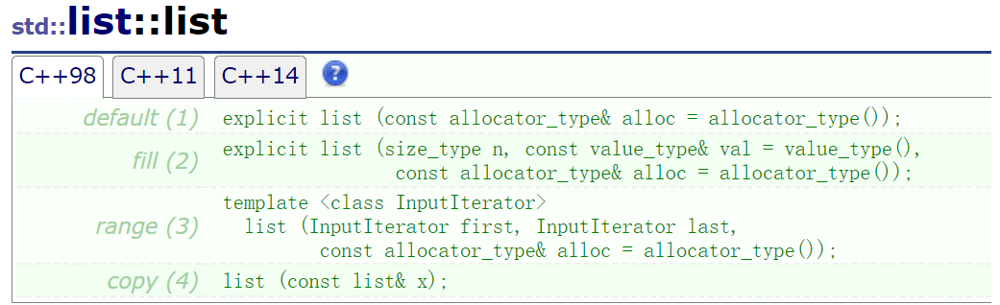
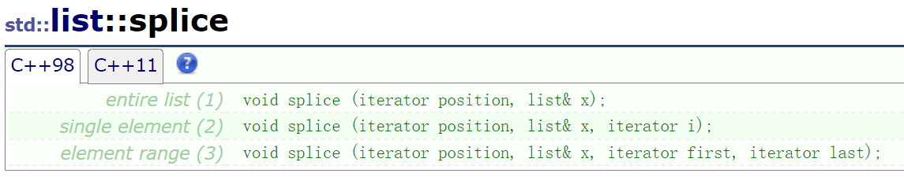
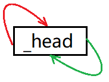
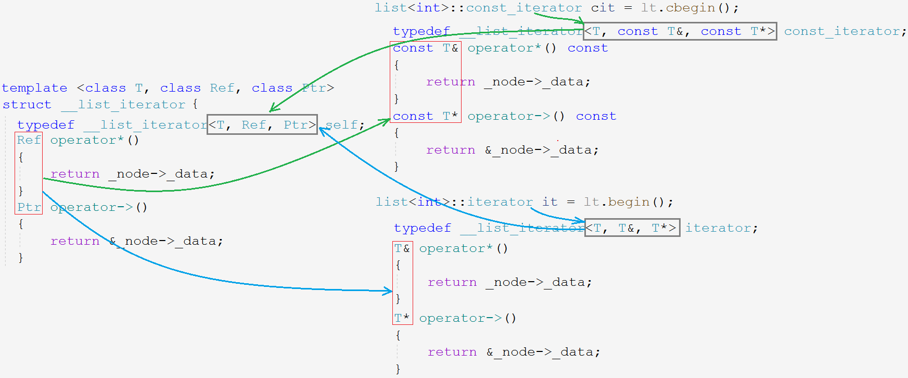
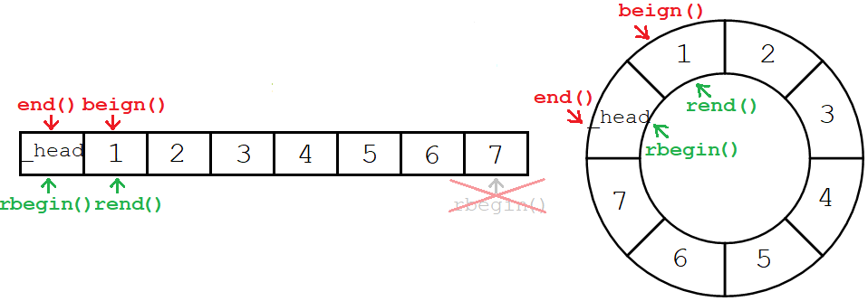
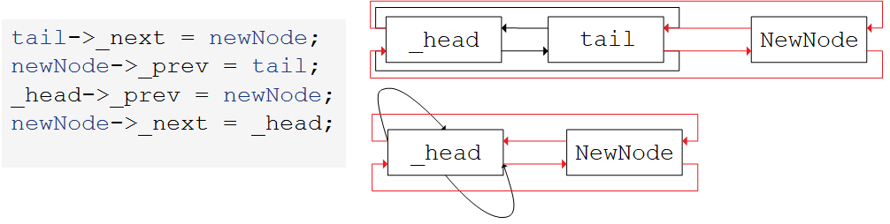

# List

[list (cplusplus.com)](http://www.cplusplus.com/reference/list/list/)

### list 的介绍

> list 是能够在序列内任意位置执行常数次插入删除操作的顺序容器，并且它具有双向迭代器。
>
> list 容器的实现类似于双向链表，双向链表可以将每个元素存储内存中不同且不相关的地址处。整个链表的顺序由它的节点与其前后节点的链接关联决定。
>
> list 容器和 forward_list 容器很像：他们主要区别在于 forward_list 对象是单向链表，所以它只能向前迭代，以换取稍微小点的体积以及更高的效效率。
>
> 和其他基础地标准顺序容器（数组，vector，deque）相比，通常，list 容器使用已获取的迭代器在任意位置插入、提取以及移动元素方面表现的更优。因此算法库中大量使用 list 容器，如排序算法。
>
> list 容器和 forward_list 容器和其他顺序容器相比，其主要的短板在于缺少通过下标对元素的随机访问。举个例子，为访问 list 容器中的第六个元素，可以从开头或结尾处进行迭代遍历，这样会消耗正比于元素间距离的时间。而且还需要花费一些额外的空间来保存元素之间的连接关系（这可能是影响链表体积大小的一个重要因素）。

~~~cpp
template < 
	class T, //模板参数T
	class Alloc = allocator<T> //空间配置器
         > 
class list; //类模板
~~~

由声明可知，list 同样是个类模板。实际上，list 是一个**双向带头循环的链表**。

## 1. list 的使用

### 1.1 默认成员函数

1. 默认构造，即空构造，构造出一个空的对象。
2. 填充构造，使用 n 个指定类型的变量 val 填充对象。
3. 范围构造，使用任意类型对象的迭代器区间 $[first,last)$，将区间中的元素按相应的顺序构造对象。
4. 拷贝构造，构造对象并将指定 list 对象的元素拷贝至其中。

### 1.2 逆置 reverse

逆置整个链表。

~~~cpp
lt.reverse();
~~~

### 1.3 排序 sort

list 不支持随机访问，所以 list 不支持算法库中的 sort 函数。list 单独内置一个 sort 接口，使用的是归并排序，但实际上该排序的效率并不高。当需要经常对数据进行排序的时候，不要选择链表来存储。

~~~cpp
lt.sort();
~~~

### 1.4 去重 unique

去重接口可以去掉链表中的重复元素，但**前提是需先将链表排成有序状态**。

~~~cpp
lt.sort();
lt.unique();
~~~

### 1.5 删除 remove

删除链表中所有指定值的元素，不是指定下标位置的元素。

~~~cpp
lt.remove(1);
~~~

### 1.6 接合 splice

接合函数能将一个链表中的一个或多个节点，转移到另一个链表中的指定迭代器位置。

可转移整个链表，可转移链表内的一个元素，转移一个迭代器区间。

~~~cpp
lt.splice(pos, list); // 转移整个迭代器 
lt.splice(pos, list, i); // 转移链表的单个节点
lt.splice(pos, list, first, last); // 转移链表的一段区间
~~~

`splice`的功能是**转移不是拷贝**，所以原链表中的该节点将不复存在。

&nbsp;

> list 实际中用的并不多，因为 list 不支持随机访问，包括OJ中也更多用的是 vector。list 的重点在于模拟实现。

## 2. list 的模拟实现

### 2.1 list 类的定义

~~~cpp
// listnode类
template <class T>
struct __list_node { 
    ListNode(T& data = T())
    	: _data(x)
        , _prev(nullptr)
        , _next(nullptr)
    {}
    __list_node<T>* _prev;
    __list_node<T>* _next;
    T _data;
};
// list类
template <class T>
class list { 
public:
    typedef __list_node<T> Node;
    list()
    	: _head(new Node)
    {
        _head->_prev = _head;
        _head->_next = _head;
    }
private:
    Node* _head;
}
~~~

- __list_node 是链表节点的类，他用于用于构造链表的节点。
- list 是链表类，他的成员变量是 \_\_list_node 节点类型的节点指针，用于构造链表的头节点，以便链接之后的存储节点。
- 一般用来被别的类使用的类都用`struct`定义，因为 struct 定义的类成员默认都是公有的。

### 2.2 默认成员

#### 构造函数

| 构造函数                                                     | 接口说明                                   |
| ------------------------------------------------------------ | ------------------------------------------ |
| **list ()**                                                  | 默认构造，构造出空的 list 容器             |
| **list (size_type n, const value_type& val = value_type())** | 填充构造，构造出指定的 n 个 val 节点的链表 |
| **list (const list& lt)**                                    | 拷贝构造，深拷贝构造出值与 lt 相同的链表   |
| **list (InputIterator first, InputIterator last)**           | 用一段迭代器区间深拷贝构造出相同的链表     |

~~~cpp
/* default constructor */
list(T x = T())
	:_head(new Node(x))
{
    _head->_prev = _head;
    _head->_next = _head;
}
~~~

> 这样就构造出了带头的空链表。

~~~cpp
/* copy constructor */
//传统写法
list(const list<T>& lt)
	:_head(new Node)
{
    _head->_prev = _head;
    _head->_next = _head;
    for (auto e : lt) {
        push_back(e);
    }
}
//现代写法
list(const list<T>& lt)
	: _head(new Node)
{
    _head->_prev = _head;
    _head->_next = _head; //处理随机值
    list<T> tmp(lt.begin(),lt.end());
    std::swap(_head, tmp._head);
}
/* deconstructor */
~list() 
{
    clear();
    delete _head;
    _head = nullptr;
}
/* fill constructor */
list(size_t n, const T& val = T());
	:_head(new Node)
{
    _head->_prev = _head;
    _head->_next = _head;
    while (n) {
        push_back(val);
        n--;
    }
}
/* range constructor */
template <class InputIterator>
list(InputIterator first, InputIterator last)
	:_head(new Node)
{
    _head->_prev = _head;
    _head->_next = _head;
    while (first != last) {
        push_back(*first);
        ++first;
    }
}
~~~

当节点的值为内置类型时，范围构造和填充构造会产生冲突。如下代码所示：

~~~cpp
list<int> lt(3,5); 
list(size_t n, T& val = T());    ->  list(size_t n, int val);
list(InIter first, InIter last); ->  list(int first, int last);
~~~

当用链表构造3个值为5的节点，`3,5`默认都是整型，模板实例化后显然迭代器范围构造的重载版本更符合要求，就意外走入了范围构造。内置类型不会存在这样的问题。

只有当传入整型或无符号整型时会出现这样的问题，可以单独重载一个`(size_t n, int val)`的版本。

~~~cpp
//list<int> lt(3, 5);
list(int n, const int val = int()) {
    //...
}
list(size_t n, const T& val = T()) {
    //...
}
template <class InputIterator>
list(InputIterator first, InputIterator last) {
    //...
}
~~~

#### 赋值重载

~~~cpp
//传统写法
list& operator=(const list<T>& lt)
{
    if (this != &lt) {
        clear();
        for (auto e : lt) {
            push_back(e);
        }
    }
    return *this;
}
//现代写法
list& operator=(list lt)
{
    std::swap(_head, lt._head);
    return *this;
}
~~~

### 2.3 迭代器

迭代器模拟指针的机制，意图能够像指针一样便捷操作容器数据，一般需要实现类似指针的解引用、加减常数、相互比较这些运算。比如下例代码所需要的功能：

~~~cpp
while (it != lt.end()) 
{
    cout << *it << endl;
    it++;
}
~~~

string, vector 等顺序容器的物理结构是一块连续的空间，这使得该容器可直接通过指针运算实现迭代器的功能。但 list 的底层实现并不是连续空间，而是通过节点内存储的前后节点的地址进行链接操作，故 list 容器想要实现上述操作就需要自行重载这些运算符。

#### 正向迭代器

~~~cpp
template <class T> /* class Ref, class Ptr */
struct _list_iterator 
{
    typedef __list__node<T> Node;
    typedef __list_iterator<T> self;
    _list_iterator(Node* x)
    	: _node(x)
    {}
    //操作符重载
    T&    operator* ();
    self& operator++();
    self  operator--();
    bool  operator!=(const self& it);
    //节点指针作成员
    Node* _node;
};
~~~

迭代器的加加减减，解引用等等操作都是在访问迭代器所指位置上的节点，所以迭代器的成员变量和链表相同都是节点指针。由于名称过长也可以采用如下方式类型重命名。

~~~cpp
typedef __list__node<T> Node;
typedef __list_iterator<T> self;
~~~

> list 容器的迭代器是双向迭代器，所以不支持随机访问，也就没有重载`+,+=,-,-=`这些操作符。

##### 默认成员函数

~~~cpp
_list_iterator(Node* x)
	: _node(x);
{}
~~~

构造函数很简单，用传入的节点地址初始化迭代器中成员变量这个节点指针，相当于迭代器中的节点指针指向了链表中的该节点。调用了 \__list_node 的拷贝构造，

迭代器的拷贝构造、赋值重载都只需要浅拷贝，两个迭代器可以完全一样。析构函数无需释放任何资源，节点交由链表进行管理。所以这些默认函数编译器默认生成的就可以。

##### 自增自减操作符

~~~cpp
//++it
self& operator++() {
    _node = _node->_next;
    return *this;
}
//it++
self operator++(int) {
    self tmp(_node);
    _node = _node->_next;
    return tmp;
}
//--it	
self& operator--() {
    _node = _node->_prev;
    return *this;
}
//it--
self operator--(int) {
    self tmp(_node);
    _node = _node->_prev;
    return tmp;
}
~~~

`++`和`--`操作符重载分别是将节点指针指向当前节点的后一个或前一个节点。就实现了自增自减运算。

> 返回当前对象或返回临时对象的处理方式，都是老生常谈不再过多赘述。

##### 解引用箭头操作符

~~~cpp
template <class T, class Ref, class Ptr>
struct __list_iterator {
    //*it
    Ref operator*()
    {
        return _node->_data;
    }
    //->
    Ptr operator->()
    {
        return &_node->_data;
    }
};
class list
{
public:
    typedef __list_iterator<T, T&, T*> iterator;
    typedef __list_iterator<T, const T&, const T*> const_iterator; //传入常量类型
    //...
}
~~~

 一般通过迭代器访问或修改节点的值都是通过上述的两个解引用`*`、箭头`->`操作符重载实现的。

~~~cpp
list<Date> lt;
lt.push_back(Date(2022, 3, 27));
lt.push_back(Date(2022, 3, 28));
lt.push_back(Date(2022, 3, 29));
//
list<Date>::iterator it = lt.begin();
while (it != lt1.end()) {
    //1.
    cout << (*it)._year << "/" << (*it)._month << "/" << (*it)._day << endl;
	//2.
    cout <<  it->_year  << "/" <<  it->_month  << "/" <<  it->_day  << endl;
    ++it;
}
~~~

- it 是迭代器对象，通过解引用访问到链表节点的`_data`数据，也就是 Date 对象。直接对象`.`得 _year 等变量。
- it 是迭代器对象，通过箭头`->`访问到`_data`的指针，即 Date* 对象指针。本应再箭头`->`一次才能访问到 _year 等变量，但`it->->_year`可读性太差，编译器直接省略成一个箭头。

~~~cpp
void func(const list<int>& it)
{
    list<int>::iterator it = lt.begin(); //Err - 常对象无法调用普通迭代器，只能调用常量迭代器
    list<int>::const_iterator it = lt.cbegin();
}
~~~

当 const 修饰的常对象调用迭代器时，就要将迭代器类模板初始化为常量迭代器。常量对象只能调用常量迭代器，所以给迭代器类加了`Ref`和`Ptr`两个模板参数，对应返回值的引用类型和指针类型，在外部初始化迭代器类模板时传入对应的类型。

> 不可以在迭代器类中重载一个常对象调用的版本，因为是外部调用的 list 对象是常对象而非迭代器。

##### 比较运算操作符

~~~cpp
//it!=it
bool operator!=(const self it) const
{
    return _node != it._node;
}
~~~

迭代器的比较运算，就是比较迭代器位置上的节点指针的值是否相等。

> Node* 原生指针和一个迭代器对象，他们都是地址占用空间大小相同，也都指向链表的节点，但他们的运算符操作的意义和结果是不同的。

#### 反向迭代器

反向迭代器是个迭代器同样是个类模板，因为它能够适配所有的容器类型，所以它被单独实现在一个文件中。

~~~cpp
template <class Iterator, class Ref, class Ptr>
struct reverse_iterator
{
    //...
    private:
    Iterator _it;
};
~~~

反向迭代器的类成员变量为当前传入容器的正向迭代器，是对正向迭代器的一种封装，这是一种适配器模式。所以反向迭代适配所有容器。

~~~~cpp
//constructor
reverse_iterator(Iterator it)
    :_it(it) //利用正向迭代器构造出反向迭代器
{}
//++it
typedef reverse_iterator self;
self& operator++()
{
    --_it; //反向迭代器++，就是正向迭代器--
    return *this;
}
//--it
self& operator--()
{
    ++_it; //反向迭代器--，就是正向迭代器++
    return *this;
}
//it1 != it2
bool operator!=(const self& it)
{
    return _it != it._it; //反向迭代器是否相等，就是正向迭代器是否相等
}
~~~~

基本的操作符重载以及构造函数都是调用传入的正向迭代器的实现的，这样才能适配所有容器。

~~~cpp
Ref operator*() 
{
    //return *_it;
    Iterator tmp = _it;
    return *--tmp; //前一个位置的迭代器
}
Ptr operator->()
{
    Iterator tmp = _it;
    return &*--tmp;
}
~~~

- STL 中反向迭代器关于解引用`*`和箭头`->`的实现却不是访问当前位置的迭代器，而是**返回当前位置的前一个位置的迭代器**。
-  STL 中所有容器的正反向迭代器的`begin()`,`end()`和`rbegin()`,`rend()`所指向的位置正好对应相反。目的是设计出对称形式，因此解引用时返回的是上一个位置的数据。

#### 迭代器接口

迭代器位置的接口函数放在`list`类体中，不要和上述`__list_iterator`类的实现混淆。

~~~cpp
class list {
public:
    typedef __list_iterator<T, T&, T*> iterator;
    typedef __list_iterator<T, const T&, const T*> const_iterator;
    iterator begin() {
        return iterator(_head->_next);
    }
    iterator end() {
        return iterator(_head);
    }
    const_iterator begin() const {
        return const_iterator(_head->_next);
    }
    const_iterator end() const {
        return const_iterator(_head);
    }
};
~~~

- 值得注意的是返回迭代器位置不是直接返回节点指针`_head`，而是返回迭代器对象`iterator(_head)`。
- `iterator(_head)`是调用构造函数传入节点指针构造出迭代器对象，返回迭代器对象才能够支持迭代器的各种操作。

> `begin()`和`end()`位置分别指向有效元素部分第一个节点和 \_head 位置，_head 正好是最后一个有效元素的下一个位置，满足有闭右开的条件$[\;begin(),end()\;)$。

~~~cpp
typedef test::reverse_iterator<iterator, T&, T*> reverse_iterator;
typedef test::reverse_iterator<const_iterator, const T&, const T*> const_reverse_iterator;
//反向迭代器位置
reverse_iterator rbegin() {
    return reverse_iterator(end());
}
reverse_iterator rend() {
    return reverse_iterator(begin());
}
const_reverse_iterator rbegin() const {
    return const_reverse_iterator(end());
}
const_reverse_iterator rend() const {
    return const_reverse_iterator(begin());
}
~~~

### 2.4 增删查改接口

#### 插入删除

~~~cpp
iterator insert(iterator pos, const T& x)
{
    Node* newNode = new Node(x);
    Node* prev = pos._node->_prev;
    Node* cur = pos._node;
    // prev - newNode - cur
    prev->_next = newNode;
    newNode->_prev = prev;
    cur ->_prev = newNode;
    newNode->_next =  cur;
    return iterator(newNode); //返回迭代器
}
iterator erase(iterator pos)
{
    assert(pos != end()); //断言位置合法
    Node* prev = pos._node->_prev;
    Node* next = pos._node->_next;
    delete pos._node;
    // prev - pos - after
    prev->_next = next;
    next->_prev = prev;
    return iterator(next);
}
~~~

list 的插入操作迭代器不会失效，因为迭代器 pos 的值不会改变，始终指向原来的节点。

> vector 的插入操作一般需要后移元素，导致当前所指位置变成新元素位置，还可能会引发扩容，导致迭代器指向已释放的空间，两种情况都会使迭代器失效。

list 的删除操作迭代器一定失效，因为节点已经被释放了，应修正为 pos 下一个位置。

> vector 的删除操作迭代也会失效，也需要接受返回值。Windows 下的 vs 中使用陈旧的迭代器会强制报错，而Linux下不会。

#### 接口复用

~~~cpp
void push_back(const T& x)  {
    insert(end(), x);
}
void push_front(const T& x) {
    insert(begin(), x);
}
void pop_back()	 {
    erase(--end());
}
void pop_front() {
    erase(begin());
}
~~~

需要迅速实现简洁的 list 时，可以先写出尾插接口，也可以写出插入删除其他直接复用。

~~~cpp
void push_back(const T& data)
{
    Node* newNode = new Node(x);
    Node* tail = _head->_prev;
    //修改链接关系
    //tail - newNode - head
    tail->_next = newNode;
    newNode->_prev = tail;
    _head->_prev = newNode;
    newNode->_next = _head;
}
~~~

- 开辟新节点、找到链表尾节点并修改链接关系。
- 上述代码不管链表是否为空都适用，这是双向带头循环链表结构的优势。

#### 其他接口

~~~cpp
void clear() {
    //1.
    iterator it = begin();
    while (it != end()) {
        iterator del = it++; //del复制迭代器位置，顺便++迭代器
        delete del._node;
    }
    _head->_prev = _head; // 修正链接关系
    _head->_next = _head;
    //2.
    iterator it = begin();
	while (it != end()) {
		erase(it++);
    }
}
size_t size() const {
    assert(!empty());
    size_t n = 0;
    for (auto e : *this){
        n++;
    }
    return n;
}
bool empty() const {
    return _head->_next == _head;
}
T& front() {
    return *begin();
}
const T& front() const {
    return *begin();;
}
T* back() {
    return *end();
}
const T* back() const {
    return *end();
}
void swap(list<T>& lt) {
    std::swap(_head, lt._head);
}
~~~

## 3. list和vector对比

| 容器       | vector                                      | list                                     |
| ---------- | ------------------------------------------- | ---------------------------------------- |
| 底层结构   | 连续的物理空间，也就是数组                  | 带头双向循环链表，空间不连续             |
| 随机访问   | 支持随机访问                                | 不支持随机访问                           |
| 插入删除   | 非尾部的插入删除都要移动数据，效率低 $O(n)$ | 任意位置的插入删除，效率高               |
| 空间利用率 | 增容代价大，倍数扩容存在一定的空间浪费      | 按需申请空间，不存在浪费                 |
| 迭代器     | 原生指针支持随机访问                        | 构造迭代器类，模拟指针行为，支持双向访问 |
| 适用场景   | 需要高效存储，随机访问，不关心增删效率      | 频繁使用插入删除，不关心随机访问         |

> vector 与 list 两种容器各有优劣，实际上 vector 用的更多些。因为 vector 支持随机访问这是最大的优点，其次，空间浪费也不是太严重的缺陷。
