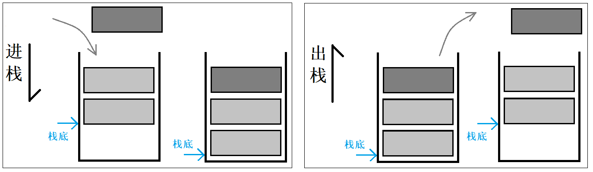
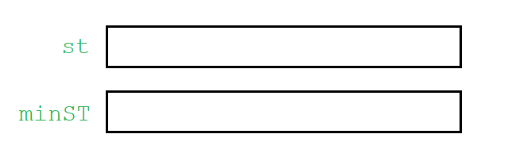
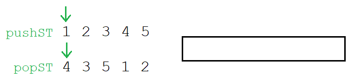
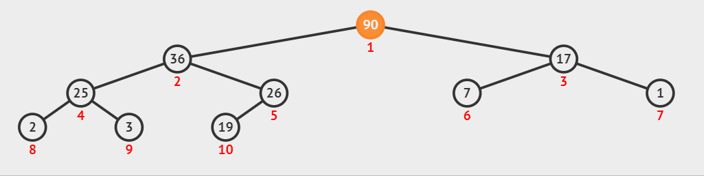

# Stack&Queue

## 1. 栈和队列的介绍

### 1.1 stack 的介绍

栈是一种特殊的线性表，栈只允许在其固定的一端进行插入和删除元素的操作。进行数据插入删除操作的一端被称为**栈顶**，另一端被称为栈底。栈中的数据元素遵循**后进先出**的原则。

压栈：栈的插入操作被称为压栈，也可以叫做进栈、入栈。出栈：栈的插入操作被称为出栈，或称弹栈。

后进先出，先进后出，即 $LIFO$ 原则（Last In First Out）。

### 1.2 queue 的介绍

队列同样是一种特殊的线性表，和栈相反，队列只允许在其一端进行插入而在另一端进行删除元素的操作。进行数据插入操作的一端被称为**队尾**，进行删除操作的另一端被称为**队头**。队列中的数据元素遵循**先进先出**的原则。

入队列即在队尾插入数据，出队列则是在队头删除数据。先进先出，后进后出，即`FIFO`原则（First In First Out）。

&nbsp;

> 栈和队列的使用都非常简单。

## 2. 栈和队列的使用

### 2.1 stack 的使用

上文是数据结构时期对栈的介绍，现在栈作为 STL 的容器重新出现，此时栈和队列已不再是容器而是容器适配器。

~~~cpp
template <class T, class Container = deque<T> > class stack;
~~~

1. stack 是一种容器适配器，专门用在具有后进先出操作的使用环境中。其只能从容器的一端进行元素的插入、删除、提取操作。

2. stack 作为一个容器适配器，其的特征就是使用方面非常简单，只有如下几个的接口：

  - `empty`：判空操作，`back`：获取尾部元素操作，`push_back`：尾部插入元素操作，`pop_back`：尾部删除元素操作。

  stack 的底层容器可以是任何标准容器或者一些其他特定的容器类，这些容器类应该支持如上的操作。默认情况下，如果没有为 stack 指定特定的底层容器，默认情况下使用 deque。

~~~cpp
void test_stack() {
	stack<int> s;
	s.push(1);
	s.push(2);
	s.push(3);
	while (!s.empty()) {
		cout << s.top() << " ";
		s.pop();
	}
	cout << endl;
}
~~~

### 2.2 queue 的使用

~~~cpp
void TestQueue()
{
	std::queue<int> q;
	q.push(1);
	q.push(2);
	q.push(3);
	q.push(4);
	while (!q.empty()) {
		cout << q.front() << " ";
		q.pop();
	}
	cout << endl;
}
~~~

## 3. 栈和队列的 OJ

### 3.1 最小栈

[最小栈 (leetcode.com)](https://leetcode-cn.com/problems/min-stack/)

~~~cpp
class MinStack {
public:
    void push(int val) {
        st.push(val);
        if (minST.empty() || val <= minST.top()) {
            minST.push(val);
        }
    }
    void pop() {
        if (st.top() == minST.top()) {
            minST.pop();
        }
        st.pop();
    }
    int top() {
        return st.top();
    }
    int getMin() {
        return minST.top();
    }
private:
    stack<int> st;
    stack<int> minST;
};
~~~

准备两个栈，一个用来正常入栈出栈，一个用来存储最小值。

1. 当入栈元素大于当前最小值时，只入到普通栈，不入最小栈。
2. 当入栈元素小于等于当前最小值时，将其入到普通栈，也入到最小栈中。

出栈时，判断栈顶元素是否和最小值相等，相等则把最小栈中的元素也弹出。

### 3.2 栈的出入序列匹配

[栈的出入序列匹配 (newcode.com)](https://www.nowcoder.com/practice/d77d11405cc7470d82554cb292585106)

一个入栈序列对应多种出栈序列，只能拿一个栈用来模拟，如果能匹配出当前的出栈序列，则两者是匹配的。

~~~cpp
class Solution {
public:
    bool IsPopOrder(vector<int> pushV, vector<int> popV) {
        int popi = 0;//出数组指针
        for (auto& e : pushV) {
            st.push(e); //入栈数组只管向栈中入元素
            //出栈数组和模拟栈进行比较
            while (!st.empty() && st.top() == popV[popi]) {
                st.pop();
                ++popi;
            }
        }
        return st.empty();//出栈数组遍历结束或栈为空
    }
private:
    stack<int> st;//模拟栈
};
~~~

定义一个模拟栈，定义两个指针指向出入数组的起始位置，向后遍历。

入栈数组只管向栈中入元素，只有出栈数组和模拟栈进行比较：当栈顶元素和出栈指针所指元素相等时，将栈顶元素出栈并 ++ 出栈指针。

**成功示例图示**

**不成功示例**

待入栈数组遍历结束后，若出栈数组遍历结束或栈为空，说明匹配成功，若栈中仍有元素或出栈数组未遍历结束，说明匹配不成功。

### 3.3 逆波兰表达式求值

[逆波兰表达式求值 (leetcode.com)](https://leetcode-cn.com/problems/evaluate-reverse-polish-notation/)

中缀表达式转后缀表达式的目的是，将操作符按照运算顺序从左到右依次排好，方便计算机进行运算。

**中缀转后缀**

遍历中缀字符串：

- 遇到操作数，直接输出。
-  遇到操作符，如果是空栈，直接入栈；如果栈非空，将其与栈顶比较优先级：
  - 优先级比栈顶元素高，则入栈，比栈顶低或相等，栈顶出栈并输出。

遍历结束后，将栈中元素全部输出。

**后缀运算**

遍历后缀表达式：

- 遇到操作数，直接入栈。
- 遇到操作符，连续取两个栈顶元素（先出为右，后出为左）作操作数与其运算，运算结果入栈。

遍历结束后，栈顶即结果。

~~~cpp
class Solution {
public:
    int evalRPN(vector<string>& tokens) {
    	stack<int> st;
        for (auto& s : tokens) {
            if (s == "+" || s == "-" || s == "*" || s == "/") {
                string optor(s); //得操作符
                int op2 = st.top(); //先出为右操作数
                st.pop();
                int op1 = st.top(); //后出为左操作数
                st.pop();
                switch(s[0]) {
                case '+':
                    st.push(op1 + op2);//将运算结果入栈
                    break;
                case '-':
                    st.push(op1 - op2);
                    break;                   
                case '*':
                    st.push(op1 * op2);
                    break;
                case '/':
                    st.push(op1 / op2);
                    break;
                }
            }
            else {
                st.push(stoi(s)); // 操作数入栈，待遍历得操作符与之运算
            }
        }
        return st.top();//返回栈顶元素
    }
};
~~~

### 3.4 用栈实现队列

[用栈实现队列 (leetcode.com)](https://leetcode-cn.com/problems/implement-queue-using-stacks/)

使用两个栈，一个用来入，一个用来出。

只要出栈为空，就将入栈中的数据全部导入出栈。只有当出栈为空时，才会导入，以免打乱顺序。保证了出栈和取数据时有元素。

~~~cpp
class MyQueue {
public:
    void push(int x) {
        _pushST.push(x);
    }
    
    int pop() {
        int tmp = peek(); //返回队头数据的同时进行了转移判断
        _popST.pop();
        return tmp;
    }
    
 	int peek() {
		if (_popST.empty()) { // 只需要在取数据处判断是否需要转移数据
			while (!_pushST.empty()) {
				_popST.push(_pushST.top());
				_pushST.pop();
			}
		}
		return _popST.top();
	} 
    
    bool empty() {
        return _popST.empty() && _pushST.empty();
    }
private:
    stack<int> _pushST;
    stack<int> _popST;
};
~~~

入栈`pushST`和出栈`popST`互不影响，分别完成入队的出队的任务。只要`popST`为空，就将`pushST`中元素移入即可。

### 3.5 用队列实现栈

[用队列实现栈 (leetcode.com)](https://leetcode-cn.com/problems/implement-stack-using-queues/)

用队列实现栈，需要考虑栈是先进后出的结构，都是顺序容器插入操作一致，删除操作需要将队列中的前`n-1`个元素移入另一个队列，只留最后一个元素。

~~~cpp
class MyStack {
public:
    void push(int x) {
        q1.push(x);
    }
    int pop() {
        int tmp = top();
        q1.pop();
        swap(q1, q2);//pop之后交换，把q2变成q1，相当于栈出了栈顶
        return tmp;
    }
    int top() {
        while(q1.size() > 1) {
            q2.push(q1.front());
            q1.pop();
        }
        int tmp = q1.front();
        return tmp;
    }
    bool empty() {
        return q1.empty() && q2.empty();
    }
private:
    queue<int> q1;
    queue<int> q2;
};
~~~

&nbsp;

## 4. 栈和队列模拟实现

### 4.1 stack 模拟实现

适配器是一种设计模式（设计模式是一套被反复使用的、多数人知晓的、经过分类编目的、代码设计经验的总结），该种模式是将一个类的接口转换成客户希望的另外一个接口。

数据结构时期，栈可以用数组实现，也可以用链表实现，都是从零开始。C++ 中栈被实现成容器的适配器，可直接调用所适配的容器的接口，类似于这样：

~~~cpp
template <class T> class stack {
    void push(const T& x) {
        _v.push_back(x);
    }
    //...
private:
    vector<T> _v;
}
~~~

> 直接将容器 vector 作成员变量，所有接口都调用 vector 的接口即可。

~~~cpp
template <class T, class Container = deque<T>>
class stack {
public:
    void push(int x) {
        _con.push_back(x);
    }
    void pop() {
        _con.pop_back();
    }
    bool empty() const {
        return _con.empty();
    }
    bool size() const {
        return _con.size();
    }
    T& top() const { 
        return _con.back();
    }
private:
    Container _con;
};
~~~

STL 源码中采用了更便捷的方式，将容器类型作为类模板参数传入，就支持自定义所适配的类型，并采用缺省参数的形式，指定默认容器为 deque。

### 4.2 queue 模拟实现

~~~cpp
template <class T, class Container = deque<T>>
class queue {
public:
    void push(int x) {
        _con.push_back(x);
    }
    void pop() {
        _con.pop_front();
    }
    bool empty() const {
        return _con.empty();
    }
    bool size() const {
        return _con.size();
    }
    T& front() const {
        return _con.front();
    }
private:
    Container _con;
};
~~~

queue  的实现和 stack 类似，同样也是容器适配器，只需要按照 queue 的特性，将适配容器的接口换一下即可。

### 4.3 deque

#### deque 的介绍

因为容器 vector 和 list 在随机访问和插入删除的方面各有不足又各有优势，为均衡一下二者的特性，C++ 设计者设计了一种容器叫做双端队列 deque。

双端队列 deque 是一种双端的“连续”空间的数据结构。双端的含义是可以在头尾两端进行插入和删除操作，且时间复杂度为O(1)。

| vector的缺点                                 | deque                                      |
| -------------------------------------------- | ------------------------------------------ |
| 扩容消耗高，空间浪费，非尾部插入删除效率低   | 扩容消耗低，空间浪费不严重，头插头删效率高 |
| **vector的优点**                             | **deque**                                  |
| 支持随机访问，连续空间缓存命中率高           | 支持伪随机访问，连续空间缓存命中率较高     |
| **list的缺点**                               | **deque**                                  |
| 按需申请释放，不支持随机访问                 | 申请次数少，支持伪随机访问                 |
| **list的优点**                               | **deque**                                  |
| 任意位置的插入删除效率高，按需申请不存在浪费 | 头尾插入删除效率高，空间浪费不严重         |

> 与 vector 比较，头插效率高，不需要移动元素；扩容消耗低，空间浪费不严重。与 list 比较，空间利用率比较高，申请次数少，支持随机访问。

两大容器的优点，deque 基本都可匹敌，两大容器的缺点，deque 基本都可避免。栈和队列不需要中间的修改，只需要头尾的插入删除，所以 stack 和 queue 使用 deque 作为默认适配容器。

#### deque 的原理

deque 的底层实现并不是真正连续的空间，而是由一段段连续的小空间拼接而成的，实际 deque 类似于一个动态的二维数组，其底层结构如下图所示：

deque 底层实际上是分段连续的，使用迭代器维护其“整体连续”以及随机访问的假象。

> deque 使用颇具局限性，仅作了解。

&nbsp;

## 5. 优先级队列 priority_queue

### 5.1 介绍和使用

优先级队列 priority_queue 同样是个容器适配器，不同于之前的 stack 和 queue 只是简单对所适配的容器进行封装，它有三个模板参数：

~~~cpp
template <class T, /* 数据类型 */
	      class Container = vector<T>, /* 适配容器 */
		  class Compare = less<typename Container::value_type> > /* 仿函数 */
	class priority_queue;
~~~

priority_queue 要求适配的底层容器必须具有随机访问迭代器，支持`empty()`,`size()`,`front()`,`push_back()`,`pop_back()`几种接口，故一般默认使用 vector 作其底层容器。

priority_queue 也就是堆 heap，能够实现堆的各种算法。一般容器适配器都不支持遍历，因为要维护容器本身的特性。

~~~cpp
priority_queue<int> pq;
pq.push(1);
pq.push(2);
pq.push(3);
while (!pq.empty()) {
    cout << pq.top() << " ";
    pq.pop();
}
~~~

~~~cpp
class Compare = less<typename Container::value_type>
~~~

priority_queue 默认是数值大的元素的优先级高，也就是默认为大堆。若想要排成小堆，需要指定 priority_queue 的仿函数参数，传入`greator<T>`是排小堆，默认的`less<T>`是排大堆。

[Top-K (leetcode.com)](https://leetcode-cn.com/problems/kth-largest-element-in-an-array/)

~~~cpp
class Solution {
public:
    int findKthLargest(vector<int>& nums, int k) {
        vector<int>::iterator pos = nums.begin() + k;
        //建大堆会选出整个数组的最大值，减小堆才能选出第k大的数
        priority_queue<int, vector<int>, greater<int>> pq(nums.begin(), pos);//k个数的小堆
        while (pos != nums.end()) {
            if (*pos > pq.top()) {
                pq.pop();
                pq.push(*pos);
            }
            ++pos;
        }
        return pq.top();
    }
};
class Solution {
public:
    int findKthLargest(vector<int>& nums, int k) {
        sort(nums.begin(), nums.end(), greater<int>());
        return nums[k-1];
    }
};
~~~

### 5.2 模拟实现

#### 基本接口

~~~cpp
template <class T, class Container = vector<T>>
class priority_queue {
public:
    priority_queue() 
    {}
    void push(const T& x) {
        _con.push_back(x);
        adjust_up(_con.size() - 1); //向上调整
    }
    void pop() {
        swap(_con[0], _con[size() - 1]);
        _con.pop_back();
        adjust_down(0); //向下调整
    }
    bool empty() const {
        return _con.empty();
    }
    int size() const {
        return _con.size();
    }
    T& top() const {
        return _con.front();
    }
private:
    Container _con;
};
~~~

以上是 priority_queue 的基本框架。

#### 向上向下调整算法

~~~cpp
void adjust_up(int child) 
{
    while (child > 0) {
        int parent = (child - 1) / 2;
        if (_con[child] > _con[parent]) {
            swap(_con[child], _con[parent]);
            child = parent;
            parent = (child - 1) / 2;
        }
        else {
            break;
        }
    }
}
void adjust_down(int parent) {
    int child = parent * 2 + 1;
    while (child < _con.size()) {
        if (child + 1 < _con.size() && _con[child + 1] > _con[child]) {
            child = child + 1;
        }
        if (_con[child] > _con[parent]) {
            swap(_con[child], _con[parent]);
            parent = child;
        }
        else {
            break;
        }
    }
}
~~~

堆插入也就是数组的尾插，等于在二叉树上加一个叶结点。此时堆的性质可能被破坏，不过只会影响该结点到根结点所在路径上的所有结点，故需要顺势向上调整：一直交换结点数值直到满足堆的性质即可。

删除需要将尾元素换到堆顶，必然会改变堆的性质，不过只是根结点不满足性质，其左右子树还是保持不变。所以只需要将堆顶元素逐步向下调整：将根结点与其较大（小）的子结点进行交换，只要满足父结点比其二者子结点中任意一个大或小的条件，就让其与子结点进行交换，直到交换到叶结点或不满足条件为止。

#### 仿函数

确定堆为大堆还是小堆，在于向上调整算法和向下调整算法中的父子节点的比较关系：

~~~cpp
if (_con[child] > _con[parent]) {
    //...
}
if (child + 1 < _con.size() && _con[child + 1] > _con[child]) {
	//...
}
~~~

但是这样的大小关系操作符不方便让用户在调用函数时修改，可以通过宏定义，函数指针的方式但都比较复杂，还有一种简单的方式就是仿函数。

仿函数又名函数对象，顾名思义，模仿函数的调用方式。其实仿函数就是定义的类实例化的对象，通过类重载操作符`()`的方式实现具体的功能。

~~~cpp
template <class T>
struct Less {
    bool operator()(const T& left, const T& right) const {
        return left < right;
    }
};
template <class T>
struct Greater {
    bool operator()(const T& left, const T& right) const {
        return left > right;
    }
};
//使用方式
Less less;
bool ret = less(1, 2);
Greater greater;
bool ret = greater(1, 2);
~~~

~~~cpp
greater(1, 2);
greater.opeartor()(1, 2);
~~~

通过类重载函数调用操作符`()`，因此可以像函数一样使用它，将其应用到向上向下调整算法中的逻辑判断处，就可以通过传入的模板参数不同来调用不同的仿函数以完成对应的逻辑。

~~~cpp
template <class T, class Container = vector<T>, class Compare = Less<T>> /* 仿函数类型 Compare */
class priority_queue {
private:
    void adjust_up(int child) {
        //if (_con[child] > _con[parent])
        if (Compare()(_con[parent], _con[child])) {
            //...
        }
    }
    void adjust_down(int parent) {
        //if (child + 1 < _con.size() && _con[child + 1] > _con[child]) 
        if (child + 1 < _con.size() && Compare()(_con[child], _con[child + 1])) {
            //...
        }
        //if (_con[child] > _con[parent]) 
        if (Compare()(_con[parent], _con[child])) {
            //...
        }
    }
~~~

仿函数相当于更高级的泛型，普通的模板参数只是增添了类型的普适性，而使用仿函数不仅能够改变执行逻辑，仿函数内部的实现完全由用户自定，拥有极大的自定义空间。

这里的实现比较功能的仿函数类似于C语言库函数`qsort`参数中的函数指针，传入一个用于比较的函数。由于支持泛型，仿函数要比函数指针的方式更优秀。

#### 基本框架

~~~cpp
template <class T> struct Less;
template <class T> struct Greater;
template <class T, class Container = vector<T>, class Compare = Less<T>>
class priority_queue {
private:
    void adjust_up(int child);
    void adjust_down(int parent);
public:
    priority_queue() 
    {}
    template <class InputIterator>
	priority_queue(InputIterator first, InputIterator last)
        :_con(first, last)
	{
    	if (_con.size() < 2) {
        	return;
		}
    	//建堆
        for (int i = (_con.size() - 1 - 1) / 2; i >= 0; i--) {
        	adjust_down(i);
		}
	}
    void push(const T& x);
    void pop();
    bool empty() const;
    int size() const;
    T& top();
private:
    Container _con;
};
~~~

