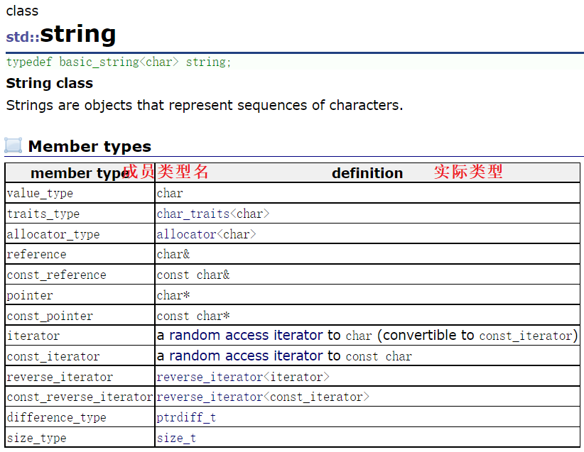
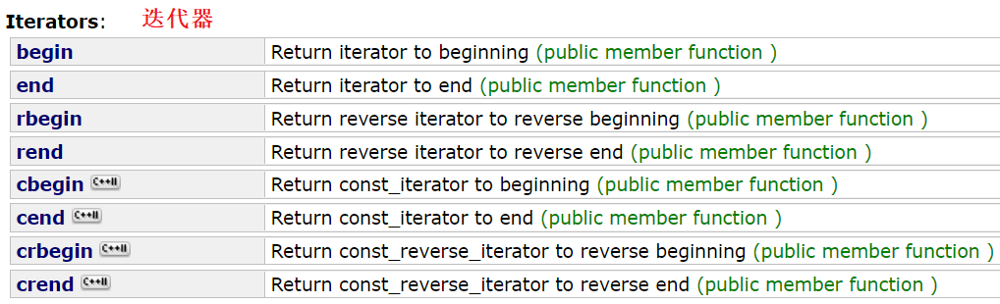

#  String类

## 1. 标准库中的 String 类

### 1.2 C语言中的字符串

C语言中，字符串以`'\0'`结尾的一些字符的集合。为操作方便，同时提供了一些关于 str 库函数，但这些库函数和字符串是分离的，并不符合面向对象的思想。且封装的不够好，容易越界访问。

### 1.3 String 类的定义

String 是 C++ 中管理字符数组的一个类，是 STL中的一个容器，是以 char 作为模板参数的模板类实例，把字符串的内存管理交由 string 而不是由编程者负责，大大减轻了 C 语言风格的字符串的麻烦。

~~~cpp
template <class T>
class basic_string {
private:
	T* str;
	//...
};

typedef basic_string<char> string;

//...
~~~

可以看到官网上对`String`类有这样的介绍，可以看出`String`其实是对一个类模板的重命名，且这个类模板是被实例化成`char`类型的字符串类。

1. `String`是表示字符串的字符串类。
2. 该类的接口与常规容器接口基本相同，同时添加了一些专门用于操作 String 的常规接口。
3. `String`在底层上实际上是`basic_String`的别名。

> 在使用 String 类时，必须包含`#include<String>`头文件，以及展开命名空间。

### 1.4 String 类的接口

> String 类有120多个接口函数，光构造函数就有7个，学习 String 类并不需要搞清楚所有接口，只需要掌握常见的就行，遇到不明白的查文档即可。

#### String 类的特殊成员函数

##### 构造函数

如图所示，`String`类有七种构造函数，但只须掌握默认构造，含参构造，拷贝构造，其他了解即可。

|构造函数|说明|
|---|---|
|**`string()`**|**构造空的 string 类对象**。|
|**`string(const char* s)`**|**用 C-string 来构造函数**。|
|**`string(const string& s)`**|**拷贝构造函数**。|
|`string(size_t n,char c)`|构造 n 个字符 c 的类对象。|

~~~cpp
string s1;//默认构造函数
string s2("hello");//构造函数
string s3(s2);//拷贝构造
~~~

##### 析构函数

> 析构函数自动调用，无需在意。

##### 赋值重载

|赋值重载|说明|
|---|---|
|**`string& operator= (const string& str)`**|**使用 string 对象赋值**。|
|**`string& operator= (const char* s)`**|**使用 C-string 赋值**。|
|`string& operator= (char c)`|用字符赋值。|

~~~cpp
string s7 = "s7";//赋值重载
string s8 = s7;//赋值重载
~~~

#### String 类的容量操作

##### 容量接口

|一般接口|说明|
|---|---|
|**`size`**|**返回 string 对象有效字符长度，不包含`'\0'`**。|
|`length`|返回 string 对象有效字符长度，不包含`'\0'`。|
|`max_size`|字符串最长的大小。|
|`capacity`|返回对象所占空间总大小。|
|**`empty`**|**判断字符串是否为空**。|
|**`clear`**|**清空有效字符，不包含`'\0'`**。|

> length 的存在是历史遗留问题，string 在 STL 之前就已经存在，当时用的就是 length 命名，但之后为保持容器命名规范性，故新增了 size 接口。

~~~cpp
cout << s.size() << endl; //返回有效字符长度
cout << s.length() << endl;

cout << s.max_size() << endl; //最大长度

cout << s.capacity() << endl; //所占空间

cout << s1.empty() << endl; //判空

s.clear(); //清空
~~~

##### 增容机制

> 上述代码不停地向对象`s`内添加元素，同时检测容量大小是否发生变化，并打印出变化后的容量大小。注意，容量大小是指可存储数据的空间大小，实际占存大小应加上`\0`。

1. 最初是16个字节，增容一次之后变成32个字节，为2倍增长。之后就是 48、71、106 ……，为1.5左右的增速。

2. 起始分配的16个字节，是在栈上开辟的空间`_Buf`。之后再增容就全部拷贝到堆上`_Ptr`再增容。

> 标准未规定增容的实现细节，所以各个版本STL可能会有所不同。这样的增容方式是 vs 环境下的，Linux 下是每次按2倍增容。

##### 修改容量

| 容量接口      | 说明                                                         |
| ------------- | ------------------------------------------------------------ |
| **`reserve`** | **改变 string 对象的容量，考虑到内存对齐，开辟指定大小左右的空间**。 |
| **`resize`**  | **将有效字符个数改成 n，多出的空间用字符 c 填充，未指定 c 则初始化为空字符。** |
|               | 1. n < _size：指定大小比原长度小，则删去多余的内容；         |
|               | 2. _size <= n <= _capacity：指定大小比容量小，则只扩大字符串的长度 _size； |
|               | 3. n > _capacity：指定大小比容量大，则先扩充容量，再扩大字符串的长度 _size 。 |

~~~cpp
s.reserve(100); // 为字符串对象提前开辟好100左右字节的容量，以免之后的增容
s.reserve(10); // 由于已开辟的空间大于指定的空间，故本次修改无效

s.resize(100); // 修改有效字符个数为100个
s.resize(100, 'x'); // 修改有效字符个数为100个，新内容初始化为'x'
s.resize(10); // 修改有效字符个数为100个，删除了多余的内容
~~~

`reserve`是修改空间容量大小、`resize`是修改有效字符个数。但`resize`修改字符个数的同时也有可能顺带地修改空间容量大小。所以`reserve`只能单纯地修改容量大小，`resize`相当于修改容量加上初始化内容。

`reserve`修改容量大小，已开辟好的空间只能增容不能通过该函数销毁，故当空间大于指定的空间时，增容无效。

#### String 类的访问操作

|访问接口|说明|
|---|---|
|**`operator[]`**|**支持用下标访问 string 字符串**。|
|范围`for`|C++11支持更简洁的范围 for 新遍历形式。|

##### 下标访问

| `[]`重载形式                                     | 说明                                            |
| ------------------------------------------------ | ----------------------------------------------- |
| **`char& operator[] (size_t pos);`**             | 不带 const 的重载，支持修改 string 对象。         |
| **`const char& operator[] (size_t pos) const;`** | 带 const 的重载，保护对象不被修改，能够减少拷贝。 |

当产生常对象时，就会用带`const`的版本。

> `at`也是早期的接口，作用和`operator[]`一样，存在是为了向前兼容。但`operator[]`发生越界访问会直接 assert 报错，`at`越界会抛出异常。

##### 迭代器

| 访问接口            | 说明                                                         |
| ------------------- | ------------------------------------------------------------ |
| **`begin`,`end`**   | **begin 返回起始位置的迭代器，end 返回尾字符的下一个位置的迭代器**。 |
| **`rbegin`,`rend`** | **rbegin 返回反向起始位置的迭代器，end 返回反向尾字符的下一个位置的迭代器**。 |
| `cbegin`,`cend`     | cbegin 返回起始位置的常量迭代器，cend 返回尾字符的下一个位置的常量迭代器。（C++11） |

访问 string 对象除了下标访问还有使用迭代器的方式，迭代器是为 STL 容器专门打造的一种机制，专门用来迭代  STL 容器。访问容器中的元素，需要通过“迭代器”进行。迭代器是一个变量，可以指向容器中的某个元素，通过迭代器就可以操作它指向的元素。所以，迭代器可以想象成指针一样的东西。

~~~cpp
string::iterator it = s.begin();
while (it != s.end()) {
    cout << *it << " ";
    it++;
}
cout << endl;
~~~

`begin()`接口返回对象元素的起始下标，`end()`接口返回尾元素的下一个位置，也就是`\0`的下标。利用迭代器遍历 string 对象，也就是遍历字符串数组。

- `iterator`是迭代器的类型名，但迭代器类型前必须指明类域，因为它是在类里定义的。
- 迭代器按照定义方式分成以下四种：正向迭代器、常量正向迭代器、反向迭代器、常量反向迭代器。

~~~cpp
//正向迭代器
string::iterator it = s.begin();
while (it != s.end()) {
    *it += 1;
    it++;
}
//反向迭代器
string::reverse_iterator rit = s.rbegin();
while (rit != s.rend()) {
    *rit -= 1;
    rit++;
}
//常量正向迭代器
string::const_iterator cit = s.cbegin();
while (cit != s.cend()) {
    cout << *cit << " ";
    cit++;
}
cout << endl;
//常量反向迭代器
string::const_reverse_iterator  crit = s.crbegin();
while (crit != s.crend()) {
    cout << *crit << " ";
    crit++;
}
cout << endl;
~~~

常量迭代器不支持对容器进行修改，一般用于常对象，或者常对象作形参以防止函数内修改对象。

begin 和 rbegin 一个是正向的起始位置、一个是反向的起始位置，end 和 rend 同理。值得注意的是，begin/rbegin 都指向的是有效元素，而 end/rend 指向有效尾元素的下一个位置。

**`it!=it.end()`是标准的写法**，虽然 string 类支持`it<it.end()`是因为 string 对象元素地址是连续的。对于一些非线性的容器其元素地址不连续，故不支持这样的写法。

- 无论是正向和反向迭代器，循环内对迭代器的进步条件都是`++`操作。

- **迭代器相当于一种统一的遍历方式**，所以很有必要学习。对于`string`类使用`[]`最好，掌握迭代器的遍历方式即可。

因为重载下标访问操作符`[]`已经非常的方便，对`string`容器使用迭代器进行遍历，显得过于麻烦。但并不意味着迭代器就可有可无，因为对于其他非线性的容器如树、图等，就不支持使用`[]`访问遍历，但迭代器能够访问所有的容器。

从`begin`接口的多种重载形式可以看出，begin 接口的放回类型为迭代器类型，返回对应的迭代器的初始位置。

##### 范围 for

范围 for 循环被称为语法糖，简单方便，自动判断元素类型和数组范围大小。循环内修改数组元素需要传引用。

~~~cpp
for (auto& e : s) {
    e -= 1;
    cout << e << " ";
}
cout << endl;
~~~

在实际编译时，范围 for 会被替换成迭代器。所以说，能用迭代器的容器就一定能用范围 for。

#### String 类的修改操作

##### 增加元素

| 修改接口         | 说明                               |
| ---------------- | ---------------------------------- |
| **`operator+=`** | **在 string 字符串后追加字符串**。 |
| `push_back`      | 在字符串后追加字符 c。             |
| `append`         | 在字符串后追加字符串。             |

~~~cpp
string s1("hehe");
string s2("haha");

s1.push_back('c'); // 尾插字符

s1.append("ddd"); // 尾插字符串
s1.append(s2);

s1 += "sss"; //+= 字符串
s1 += s2; // += 对象
~~~

`operator+=`可以操作字符串、字符和 string 对象，而`push_back`和`append`相对较为局限，所以直接用`operator+=`即可。

##### 插入删除

| 修改接口 | 说明                                          |
| -------- | --------------------------------------------- |
| `insert` | 可在指定位置插入多个字符、字符串、string 对象 |
| `erase`  | 删除指定位置的指定长度的字符串                |

把 string 对象看作顺序表，一般字符串的操作符`+=`重载相当于尾插已经够用。其他插入删除一般不建议使用，因为用处不多且效率低。

~~~cpp
s.insert(0, 5, 'c');//指定位置插入n个字符
s.insert(s.begin(), 'c');//指定位置插入字符
s.insert(0, s);//指定位置插入对象
s.insert(0, "insert");//指定位置插入字符串

s.erase(0,	1);//删除下标位置起之后指定长度的字符串
s.erase(s.begin());//删除指定迭代器位置的字符
s.erase(s.begin(), s.end());//删除指定迭代器区间的字符
~~~

> `insert`,`erase`使用不多，仅作了解即可。

##### 对象交换

| 修改接口   | 说明                                                     |
| ---------- | -------------------------------------------------------- |
| **`swap`** | **string类的成员函数，交换两个 string 对象的成员变量**。 |

C++算法库和 String 库中都有`swap`函数，都可以实现 string 对象的交换。

~~~cpp
//算法库中的swap
template <class T> void swap(T& a, T& b) {
    T c(a);
    a = b;
    b = c;
}
//string库中的swap(大致如此)
void swap(string& s) {
    _str = s._str;
    _size = s._size;
    _capacity = s._capacity;
}
~~~

> string 库中的`swap`只能交换 string 对象，算法库的`swap`能交换任意类型的变量。但生成模板、调用对象的构造函数拷贝构造及析构等函数会降低程序的效率，而 string 库中的`swap`只交换几个变量而已。

显然，string 库中的`swap`比算法库中的`swap`效率更高。

> 这个是 string 类中的成员函数 swap，所以只能这样调用。但 string 类中还有另一个重载的全局函数`swap`。

#### String 类的查找操作

| 其他接口          | 说明                                                         |
| ----------------- | ------------------------------------------------------------ |
| **`c_str`**       | **将 string 对象以C格式字符串的形式返回**。                  |
| **`find`+`npos`** | **从字符串 pos 位置开始向后找字符 c，并返回该字符在字符串中的位置**。 |
| **`rfind`**       | **从字符串 pos 位置开始向前找字符 c，并返回该字符在字符串中的位置**。 |
| **`substr`**      | **在 str 中从 pos 位置开始，截取 n 个字符，然后将其返回**。  |

~~~cpp
cout << s << endl; // 利用重载string对象的流提取运算符打印
cout << s.c_str() << endl; // 打印string对象对应形式的字符串

string file("test.txt");
FILE* ptr = fopen(file.c_str(), "w"); // 适配C语言的语法
~~~

`find`查找函数支持查找字符、查找字符串和查找 string 对象的多种重载形式，以及支持规定查找的起始或结束位置。

> 返回位置就是返回下标，面向对象的思想使得C++封装管理的更好，不再直接返回地址而是下标，防止出现野指针。

返回值的类型为`size_t`，代表从0开始的下标，意味着可以返回更大的值。但如果没找到只能返回`npos`，它是 string 类里的静态变量不会被改变，表示无穷大的数是一个string对象不可能达到的大小。

> `npos`的值是无符号整型的最大值：42亿9千4百多万，折合成下标理论上对象就会占存4G多，所以不会存在这么大的对象。

将在原字符串中下标为`pos`作为起始位置，`len`作为长度的子字符串拷贝为新的字符串，并返回。

~~~cpp
string file("test.txt");
FILE* ptr = fopen(file.c_str(), "w");
//找出文件后缀
size_t pos = file.find('.');
if (pos != string::npos) {
    //后缀
    //1.
    string suffix = file.substr(pos, file.size() - pos);//下标，长度
    //2.
    string suffix = file.substr(pos, string::npos);//下标，最值
    //3.
    string suffix = file.substr(pos);//下标
    cout << suffix << endl;
}
~~~

倘若文件有多个后缀名，而只想取得最后一个后缀，则可以使用反向查找：

~~~cpp
size_t pos = file.rfind('.');
if (pos != string::npos) {
    //后缀
    string suffix = file.substr(pos, file.size() - pos);
    cout << suffix << endl;
}
~~~

~~~cpp
//解析url地址
//http://www.cplusplus.com/reference/string/string/find/	
string url("http://www.cplusplus.com/reference/string/string/find/");
string protocol;
string Domain;
string path;

int pos1 = url.find(':', 0);
if (pos1 != string::npos) {
    protocol = url.substr(0, pos1 - 0);//http : 0~pos1
}
int pos2 = url.find('/', pos1 + 3);
if (pos2 != string::npos) {
    Domain = url.substr(pos1 + 3, pos2 - (pos1 + 3)); //www.cplusplus.com : pos1~pos2
}
path = url.substr(pos2, url.size() - pos2);///reference/string/string/find/ : pos2~npos
~~~

#### String 类的其他函数

以下所有函数都是全局函数，并没有实现在 string 类里。

| 其他接口               | 解释                                                         |
| ---------------------- | ------------------------------------------------------------ |
| `getline`              | 读取以字符串的形式输入的一行，不会因为空格而结束。           |
| 关系操作符重载         | 重载`>=`,`>`,`<=`,`<`,`!=`,`==`的几种关系运算符，故可直接比较 string 对象或者字符串。 |
| `swap`                 | 全局函数，交换两个 string 对象的成员变量，和成员函数的重载版本仅调用方式不同。 |
| 字符串其他类型转换函数 | `stoi`,`stol`,`stof`,`stod`等字符串转整型、长整型、浮点型的函数，`to_string`其他类型字符串（C++11） |

~~~cpp
cin getline (cin, s1);

s1 < s2;
s1 < "hello";

s1.swap(s2);
swap(s1, s2);

long l = stol("1111111");
string s1 = to_string(1.111);
~~~

> 本文只能介绍 string 类，而只有加以大量的练习才能真正掌握。

### 1.5 string 类的OJ题

#### 反转字符串

[反转字符串II (leetcode-cn.com)](https://leetcode-cn.com/problems/reverse-string-ii/)

~~~cpp
class Solution {
public:
    void Swap(char& rx, char& ry) {
        char tmp = rx;
        rx = ry;
        ry = tmp;
    }
    void Reverse(string& s, int begin, int end) {
        while (begin < end) {
            Swap(s[begin], s[end]);
            begin++;
            end--;
        }
    }
    string reverseStr(string s, int k) {
        int times = s.size() / (2 * k);
        int begin = 0, end = k - 1;
        //逆置
        while (times > 0) {
            Reverse(s, begin, end);
            begin += 2 * k, end += 2 * k;
            times--;
        }
        times = s.size() / (2 * k);
        int restChars = s.size() - times * 2 * k;
        // k <= 剩余字符 < 2k
        if (restChars >= k) {
            Reverse(s, times * 2 * k, times * 2 * k + k - 1);
        }
        // 剩余字符 < k
        if (restChars < k && restChars > 0) {
            Reverse(s, times * 2 * k, s.size() - 1);
        }
        return s;
    }
};
~~~

[反转字符串III (leetcode-cn.com)](https://leetcode-cn.com/problems/reverse-words-in-a-string-iii/)

~~~cpp
class Solution {
public:
    void Swap(char& rx, char& ry) {
        char tmp = rx;
        rx = ry;
        ry = tmp;
    }
    void Reverse(string& s, int begin, int end) {
        while (begin < end) {
            Swap(s[begin], s[end]);
            begin++;
            end--;
        }
    }
    string reverseWords(string s) {
        size_t begin = 0, end = 0;
        while (begin < s.size()) {
            end = s.find(' ', begin);//结束位置
            if (end == string::npos) {
                end = s.size();
            }
            Reverse(s, begin, end - 1);//逆置子串
            begin = end + 1;//进位
        }
        return s;
    }
};
~~~

[仅反转字母 (leetcode-cn.com)](https://leetcode-cn.com/problems/reverse-only-letters/submissions/)

~~~cpp
class Solution {
public:
    // 判断字母
    bool IsLetter(char& c) {
        if (('a' <= c && c <='z') || ('A' <= c && c <='Z')) {
            return true;
        }
        return false;
    }
    // 交换字符
    void SwapLetters(char& rx, char& ry) {
        char tmp = rx;
        rx = ry;
        ry = tmp;
    }
    //左右指针，左向右走，右向左走。遇到字符交换
    string reverseOnlyLetters(string s) {
        int begin = 0;
        int end = s.size() - 1;
        while (begin < end) {
            // 左走
            while (begin < end && !IsLetter(s[begin])) {
                    begin++;
            }
            //右走
            while (begin < end && !IsLetter(s[end])) {
                    end--;
            }
            //找到字母后交换
            SwapLetters(s[begin], s[end]);
            //进位
            begin++;
            end--;
        }
        return s;
    }
};
~~~

#### 字符串最后一个单词的长度

[字符串最后一个单词的长度 (nowcoder.com)](https://www.nowcoder.com/practice/8c949ea5f36f422594b306a2300315da)

~~~cpp
int main()
{
    string s = "";
    getline(cin, s);
    int pos = s.rfind(' ');
    cout << (s.size() - pos - 1) << endl;
    return 0;
}
~~~

#### 字符串中的第一个唯一字符

[字符串中的第一个唯一字符 (leetcode-cn.com)](https://leetcode-cn.com/problems/first-unique-character-in-a-string/)、[(nowcoder.com)](https://www.nowcoder.com/practice/e896d0f82f1246a3aa7b232ce38029d4)

~~~cpp
class Solution {
public:
    //统计所有字符出现的个数，依次放入数组中，返回数组最前的且个数为1的字符
    int firstUniqChar(string s) {
        int timesArray[26] = { 0 };
        for (int i = 0; i < s.size(); i++) {
            timesArray[s[i] - 'a'] += 1;//数组中字母对应位置+1
        }
        //
        for (int i = 0; i < s.size(); i++) {
            if (timesArray[s[i] - 'a'] == 1) {
                return i;
            }
        }
        return -1;
    }
};
~~~

#### 验证回文串

[验证回文串 (leetcode-cn.com)](https://leetcode-cn.com/problems/valid-palindrome/)

~~~cpp
class Solution {
public:
    //判断是否为字母或数字
    bool IsLegalChar(char c) {
        if ((c >= 'A' && c <= 'Z') || (c >= 'a' && c <= 'z')) {//字母
            return true;
        }
        else if ('0' <= c && c <= '9') {//数字
            return true;
        }
        return false;
    }
    bool isPalindrome(string s) {
        //前后指针相对方向遍历
        int begin = 0, end = s.size() - 1;
        while (begin < end) {
            //忽略其他字符
            while (begin < end && !IsLegalChar(s[begin])) 
                begin++;
            while (begin < end && !IsLegalChar(s[end]))
                end--;
            //是否（大小写）相等
            if (tolower(s[begin]) != tolower(s[end])) 
                return false;
            //进步
            begin++;
            end--;
        }
        return true;
    }
};
~~~

下标最好采用`int`类型，以免减到0时就循环成最大值了。 

#### 字符串运算

[字符串相加 (leetcode-cn.com)](https://leetcode-cn.com/problems/add-strings/)

~~~cpp
class Solution {
public:
    //从低位向高位加，取两个字符串对应位置的值，放入两个整型中，再相加作结果字符串的一位
    //同时考虑进位
    string addStrings(string num1, string num2) {
        int end1 = num1.size() - 1, end2 = num2.size() - 1;
        int next = 0; //进位值0或1
        string retStr;
        while (end1 >= 0 || end2 >= 0) { //定义循环，所有位结束才结束
            //取对应位上的数值
            int val1 = 0, int val2 = 0;
            if (end1 >= 0) 
                val1 = num1[end1] - '0';
            if (end2 >= 0) 
                val2 = num2[end2] - '0';
            
            int ret = val1 + val2 + next;
            //判断进位
            if (ret > 9) {
                next = 1; //进位值置1，以便下一位+1
                ret %= 10;
            }
            else {
                next = 0; //进位值置0，下一位不进位
            }
            end1--;
            end2--;
            retStr += ret + '0';
        }
        //判断首位是否进位
        if (next == 1) 
            retStr += '1';
        //逆置字符串
        reverse(retStr.begin(), retStr.end());
        return retStr;
    }
};
~~~

~~~cpp
class Solution {
public:
    string addStrings(string num1, string num2) {
        string ret;
        int end1 = num1.size() - 1, end2 = num2.size() - 1;
        int carry = 0;
        while (end1 >= 0 || end2 >= 0 || carry) {
            int sum = 0;
            if (end1 >= 0) {
                sum += num1[end1] - '0';
                end1--;
            }
            if (end2 >= 0) {
                sum += num2[end2] - '0';
                end2--;              
            }
            sum += carry; // 进位
            if (sum > 9) {
                carry = 1;
            }
            else {
                carry = 0;
            }
            ret += to_string(sum % 10);
        }
        reverse(ret.begin(), ret.end()); //逆置
        return ret;
    }
};
~~~

短串指针走完时，不可直接将长串剩余的部分直接拷下来，因为可能会存在进位。只能接着运算，短串走完后所在位都当作零来处理。

[字符串相乘 (leetcode-cn.com)](https://leetcode-cn.com/problems/multiply-strings/)

~~~cpp
、class Solution {
public:
    string multiply(string num1, string num2) {
        if (num1 == "0" || num2 == "0") {
            return "0";
        }
        int m = num1.size(), n = num2.size();
        auto ansArr = vector<int>(m + n);
        for (int i = m - 1; i >= 0; i--) {
            int x = num1.at(i) - '0';
            for (int j = n - 1; j >= 0; j--) {
                int y = num2.at(j) - '0';
                ansArr[i + j + 1] += x * y;
            }
        }
        for (int i = m + n - 1; i > 0; i--) {
            ansArr[i - 1] += ansArr[i] / 10;
            ansArr[i] %= 10;
        }
        int index = ansArr[0] == 0 ? 1 : 0;
        string ans;
        while (index < m + n) {
            ans.push_back(ansArr[index]);
            index++;
        }
        for (auto &c: ans) {
            c += '0';
        }
        return ans;
    }
};
~~~

&nbsp;
