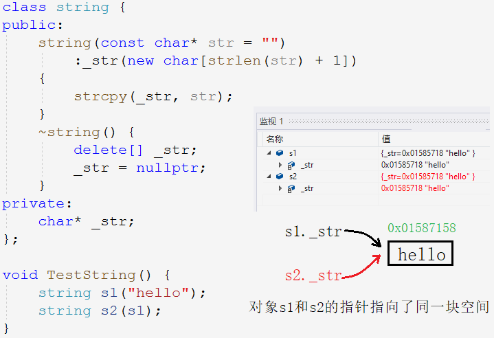
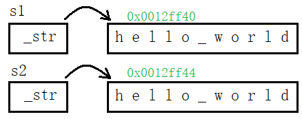
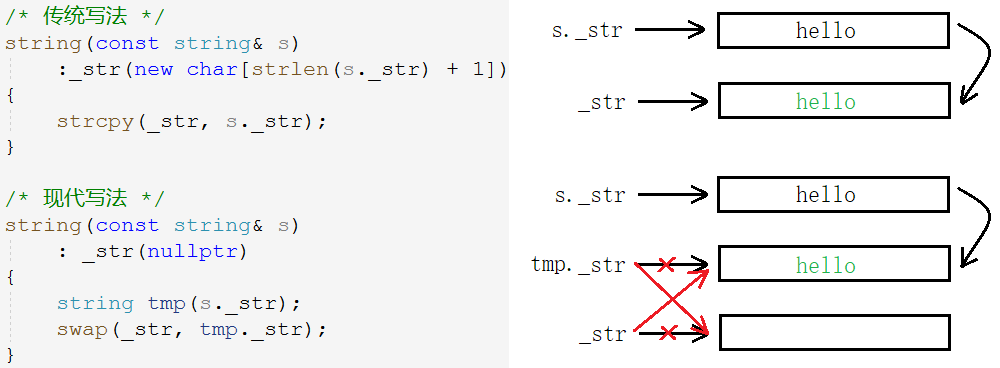
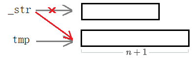
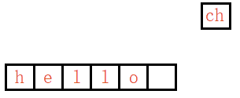

面试时常考察 String 的细节问题，但由于时间关系，一般要求实现四大默认成员函数构造函数、拷贝构造函数、赋值重载以及析构函数。因为这四大成员函数涉及动态内存管理、深浅拷贝、异常处理等等 C++ 类和对象的基本功，是 string 类实现的重中之重。

## String类续

`string`类针对四大默认成员函数的实现方法分为两种：传统写法和现代写法。区别在于：

1. 传统写法的 string 类，可读性高，
2. 现代写法的 string 类，代码简洁，实现巧妙，代码维护性高。

> 传统或现代写法只是默认成员函数实现的方式不同，重点在于字符串的构造和拷贝相关注意点。故先实现一个“简洁”的 string 类，只有字符串成员`_str`，之后下面讲解增删查改时再把`_size`,`_cpaacity`完善到类里。

### 2.1 String 类的传统写法

#### 类的定义

~~~cpp
namespace test //定义string类所在命名空间
{
    //string类
	class string { 
	public:
		string(const char* str);
		string(const string& s);
        ~string();
	private:
		char* _str;
	};
	void TestString() //测试函数
    {
		string s1("hello");
		string s2(s1);
	}
}
~~~

首先定义与库中相同名称的变量，都要先定义出一个命名空间。`string`类的类体和测试函数都放在该命名空间中。

#### 构造析构

~~~cpp
string(const char* str = "")
    :_str(new char[strlen(str) + 1]) //在堆上开辟和str一样大小的空间
{
    strcpy(_str, str);
}
~string() {
    delete[] _str;
    _str = nullptr;
}
~~~

- 构造函数初始化`_str`时，不可直接时用`str`初始化`_str`，以致`_str`存储在栈上无法实现增容等一系列操作。**须动态开辟一个和`str`一样大的空间，再将`str`的内容拷贝到`_str`中。**
- 构造函**数参数一般采用全缺省的形式**，因为`string s;`只构造对象不初始化时其值默认为空值`""`。

- 与`new[]`搭配，使用`delete[]`释放空间。

#### 拷贝构造

实现 string 类的时候，编写拷贝构造函数会涉及“深浅拷贝”的问题。

##### 深浅拷贝

1. 浅拷贝：也称位拷贝，即将对象的值按比特位依次完全地拷贝过来，浅拷贝会带来数据安全方面的隐患；
2. 深拷贝：给每个对象分配独立的资源空间，二者仅空间的内容相同，避免修改一个影响另一个。

> 没有显式定义拷贝构造函数，那么编译器将自动生成一个默认的拷贝构造函数，该构造函数完成对象之间的位拷贝。

使用默认的拷贝构造，**使得`s1`和`s2`两个对象的指针变量指向了同一块空间**。从结果上看貌似没什么问题，但当程序结束自动调用析构函数时，就会导致对一块空间重复释放引起程序崩溃。

实际上两个对象应该有各自独立的字符串，**拷贝构造应实现二者内容相同，即实现深拷贝而非浅拷贝**。深拷贝给每个对象独立分配资源，保证多个对象之间不会因共享资源导致多次释放。

~~~cpp
//拷贝构造
string(const string& s) 
    :_str(new char[strlen(s._str) + 1])
{
    strcpy(_str, s._str);
}
~~~

#### 赋值重载

~~~cpp
string& operator=(const string& s) {
    if (this != &s) { // 避免自赋值
        char* tmp = new char[strlen(s._str) + 1]; // 先开辟空间再释放原空间
        strcpy(tmp, s._str);
        delete[] _str; //释放后再赋值，避免空间不够或浪费
        _str = tmp;
    }
    return *this;
}
~~~

1. 两个对象的`_str`变量不能直接进行拷贝，因为目标空间大小可能不够需要扩容，空间太大也会浪费空间。所以最好**先释放原空间再按照原字符串大小开辟新空间**。
2. **须避免自赋值**，因为释放`_str`也就释放了原字符串`s._str`，然后会导致将乱码拷贝给`_str`中。
3. 不要将`new`开辟的空间直接赋值给`_str`，因为`new`可能开辟失败抛异常并结束程序，此时已将`_str`释放掉。最好**开辟空间先赋值临时变量，再将临时变量赋值给`_str`**。

### 2.2 String 类的现代写法

> 现代写法是 string 的另一种实现写法，实现的更加巧妙而已，当然面试中使用现代写法无疑是加分项。

二者的构造和析构函数都是一样的，现代写法更多是复用构造函数和拷贝构造，将任务交予完成他们完成。

#### 拷贝构造

~~~cpp
string(const string& s)
    : _str(nullptr)
{
    string tmp(s._str); //利用构造函数构造出临时对象
    swap(_str, tmp._str);
}
~~~

1. 必须将字符串`_str`初始化为空，不然等到出作用域，调用`tmp`的析构函数时释放`tmp._str`也就是随机值地址会出错。

#### 赋值重载

~~~cpp
string& operator=(const string& s)
{
    if (this != &s) {
        string tmp(s); //利用拷贝构造构造出临时对象
        swap(_str, tmp._str);
    }
    return *this;
}
// 更精炼版
string& operator=(string s)
{
    swap(_str, s._str);
    return *this;
}
~~~

1. `_str`和`tmp._str`的交换，达到了一石二鸟的效果：
   - 利用临时对象将`s`的数据交换到了操作对象中，相当于进行了赋值。
   - 和拷贝构造不同的是，`_str`指向的原有数据，经交换后在析构函数内被`tmp._str`顺带释放，就无需手动释放了。

2. 更精炼版利用传值调用产生临时拷贝的特点，直接使用`s`当作临时对象，免去构造临时对象`tmp`，同时也能达到顺带释放的效果。
   - 但由于传值拷贝的特点，无法判断自赋值的情况，不过并不影响程序运行。

### 2.3 String 类的模拟实现

> 面试时由于时间关系，只会要求实现简洁的 string 类，因此将完整版 string 实现放在此处，也就是加上了`_size`和`_capacity`而已。

~~~cpp
/* 传统写法 */
//构造函数
string(const char* str)
    : _size(strlen(str))
        , _capacity(_size)
    {
        _str = new char[_capacity + 1];
        strcpy(_str, str);
    }
//拷贝构造
string(const string& s)
    : _size(s._size)
        , _capacity(s._capacity)
    {
        _str = new char[_capacity + 1];
        strcpy(_str, s._str);
    }
//赋值重载
string& operator=(const string& s)
{
    if (this != &s) { 
        char* tmp = new char[s._capacity + 1];
        strcpy(tmp, s._str);
        delete[] _str;
        _str = tmp;
        _size = s._size;
        _capacity = s._capacity;
    }
    return *this;
}
//析构函数
~string()
{
    delete[] _str;
    _str = nullptr;
    _size = 0;
    _capacity = 0;
}
/* 现代写法 */
//swap 交换两个对象的成员变量
void swap(string& s)
{
    std::swap(_str, s._str);
    std::swap(_size, s._size);
    std::swap(_capacity, s._capacity);
}
//拷贝构造
string(const string& s)
    : _str(nullptr)
{
    string tmp(s._str);
    swap(tmp);
}
//赋值重载
string& operator=(string s)
{
    swap(s);
    return *this;
}
~~~

> 默认成员函数实现完毕，接下来就是实现 string 类的增删查改的细节。

#### 访问接口

##### c_str

~~~cpp
const char* c_str() const {
    return _str;
}
~~~

##### operator[]

~~~cpp
char& operator {
    assert(pos < _size);
    return _str[pos];
}
const char& operator const {
    assert(pos < _size);
    return _str[pos];
}
~~~

和标准库中的一样，重载出常函数和非常函数两种版本。常函数的`const`修饰的是隐含形参`this`指针，这样使得常对象就自动调用常函数版本。

##### iterator
~~~cpp
//类型重定义
typedef char* iterator;
typedef const char* const_iterator;
typedef char* reverse_iterator;
typedef const char* const_reverse_iterator;
//正向迭代器
iterator begin() {
    return _str;
}
iterator end() {
    return _str + _size;
}
//正向常量迭代器
const_iterator cbegin() const {
    return _str;
}
const_iterator cend() const {
    return _str + _size;
}
~~~

##### for-loop

范围 for 循环的使用方式固定，只要遍历的容器支持迭代器，那就支持范围 for。因为范围 for 是根据迭代器的推导来的。

~~~cpp
for (auto e : s1) {
    cout << e << " ";
}
// 替换成：
auto it = s1.begin();
while (it != s1.end()) {
    cout << *it << " ";
    it++;
}
~~~

> 当迭代器的接口名称不是`begin()`或`end()`时，范围 for 就无法成迭代器遍历。

#### 容量接口

##### size & capacity
~~~cpp
size_t size() const {
    return _size;
}
size_t capacity() const {
    return _capacity;
}
~~~
`size`和`capacity`接口返回的是不可修改的常量，故直接实现`const`版本即可，常对象和普通对象都可以调用。

##### reverse

当指定大小`n`大于`_capacity`时，当前对象增容。

~~~cpp
void reserve(size_t n)
{
    if (n > _capacity)
    {
        char* tmp = new char[n + 1];//为'\0'开辟空间
        strcpy(tmp, _str);
        delete[] _str;
        _str = tmp; 
        _capacity = n;
    }
}
~~~

- 先开辟`n+1`个字节的空间，将原空间内容拷贝至新空间，再释放原空间并使`_str`指向新空间。

  - `_str`和`tmp`指向同一块空间并不会析构两次，重复释放同一块空间，因为它们不是对象不会调用析构函数。

  - 这里没有必要交换两个指针，`tmp`不是对象并不能调用析构自动释放原空间，所以要手动释放。

##### resize

`resize`是直接操作`_size`进行扩容，将有效字符个数改成 n，多出的空间用字符 c 填充，未指定 c 则初始化为空字符。故分为三种情况：

1. n < \_size：指定大小比原长度小，则删去多余的内容；
2. \_size <= n <= _capacity：指定大小比容量小，则只扩大字符串的长度 _size；
3. n > _capacity：指定大小比容量大，则先扩充容量，再扩大字符串的长度 _size 。

~~~cpp
//1.
void resize(size_t n, char ch = '\0') {
    if (n < _size) {
        _size = n;
        _str[_size] = '\0';
    }
    else /* n >= _size */ {
        if (n > _capacity) {
            reserve(n);
        }
        memset(_str + _size, ch, n - _size); 
        _size = n;
        _str[_size] = '\0';
    }
}
//2.
void resize(size_t n, char ch = '\0') {
    if (n > _size) {
        if (n > _capacity) {
            reserve(n);
        }
        memset(_str + _size, '\0', n - _size);
    }
    _size = n;
    _str[_size] = '\0';
}
~~~

第一种写法逻辑清晰、可读性高，第二种更简洁。

#### 修改接口

##### push_back
~~~cpp
void push_back(char ch)
{
    if (_size == _capacity) {
        //普通增容
        reserve(_capacity == 0 ? 4 : _capacity * 2);
    }
    _str[_size++] = ch;
    _str[_size] = '\0';
}
~~~
插入一个字符按一般2倍增容对待即可，增容要注意`_capacity=0`的情况。插入后不能忘记补齐`\0`。

##### append
~~~cpp
void append(char* str)
{
    size_t len = strlen(str);
    if (_size + len > _capacity) {
        //按字符串长度增容
        reserve(_size + len);
    }
	//1.
    for (size_t i = 0; i < len; i++) {
    	_str[_size++] = str[i];
    }
    _str[_size] = '\0';
	//2.
    strcpy(_str + _size, str);
}
~~~
- 插入字符串按字符串长度增容即可，之后插入动作可调用库函数`strcpy`也可自行用 for 循环实现。
- 插入后记得修改字符串长度`_size`。

##### operator+=
~~~cpp
void operator+=(char ch) {
    push_back(ch);
}
void operator+=(char* str) {
    append(str);
}
void operator+=(string& s) {
    append(s._str);
}
~~~
三种形式的重载版本直接复用对应的增容函数即可。

##### insert
~~~cpp
string& insert(size_t pos, char ch) {
    assert(pos <= _size); //== 时尾插
    if (_size == _capacity) {
        reserve(_capacity == 0 ? 4 : _capacity * 2);
    }
    //后移一位 [pos,_size] 
    size_t end = _size + 1;
    while (end > pos) {
        _str[end] = _str[end - 1];
        end--;
    }
    _size++;
    _str[pos] = ch; //插入元素 pos
    return *this;
}
string& insert(size_t pos, const char* str) {
    assert(pos < _size);
    size_t len = strlen(str);
    if (_size + len >= _capacity) {
        reserve(_size + len);
    }
    //后移len位 [pos,_size] 
    size_t end = _size + 1;
    while (end > pos)
    {
        _str[end - 1 + len] = _str[end - 1];
        end--;
    }
    _size += len;
    //插入字符串 pos
    strncpy(_str + pos, str, len);
    return *this;
}
string& insert(size_t pos, const string& s) {
    assert(pos < _size);
    insert(pos, s._str);
    return *this;
}
~~~
- 插入前须先将元素后移，`end`从后向前遍历，始终在所移元素的后一个位置，利用`str[i]=str[i-1]`将元素后移。

~~~cpp
size_t end = _size;
while (end >= pos) //Err::i>=pos，防无符号死循环
{
    _str[end + 1] = _str[end];
    end--;
}
~~~

上述代码，不注意`size_t`无符号数死循环的危险。在头插须移动首元素时，`end`会等于`0`并执行`--`操作，无符号数从0减到-1会变成非常大的数`2^32-1`使得判断条件失效进入死循环。

> 规避上述错误的方式除了使`end`指向尾元素的下一个位置，还有将下标转为地址进行比较的方法。但不能将类型转为 int 因为二者进行比较仍会发生整型提升，且使用无符号数是为了能存储更大的数，只要正确规避这些特性就可以写出优秀的代码，不能因噎废食。

##### erase

~~~cpp
string& erase(size_t pos, size_t len)
{
    assert(pos < _size);
    if (len == npos || pos + len >= _size)
    {
        _str[pos] = '\0';
        _size = pos;
    }
    else //向前移动len位 [pos, pos + len]
    {
        strcpy(_str + pos, _str + pos + len);
        _size -= len;
    }
    return *this;
}
~~~

#### 查找接口
##### find
~~~cpp
size_t find (char ch, size_t pos) const {
    assert(pos < _size);
    for (size_t i = pos; i < _size; i++) {
        if (_str[i] == ch) {
            return i;
        }
    }
    return npos;
}
size_t find (const char* str, size_t pos) const {
    assert(pos < _size);
    size_t sp = 0; //遍历str
    size_t s1 = pos, s2 = 0; //s1总指针s2活动指针
    while (s1 < _size) {
        if (_str[s2] == str[sp]) {
            s2++;
            sp++;
        }
        else {
            s1++;//不相等s1进位
            s2 = s1;//s2归位
            sp = 0;//s2归位
        }
        if (str[sp] == '\0') { //str遍历结束
            return s2 - strlen(str);
        }
    }
    return npos;
}
size_t find (const string& s, size_t pos) const {
    assert(pos < _size);
    return find(s._str, pos);
}
~~~
##### rfind

~~~cpp
size_t rfind(char ch, size_t pos) const {
    assert(pos < _size);
    for (size_t i = _size; i > pos; i--) {
        if (_str[i - 1] == ch) { //使用i-1位置进行判断，防无符号死循环
            return i - 1;
        }
    }
    return npos;
}
size_t rfind(const char* str, size_t pos) const {
    assert(pos < _size);
    size_t len = strlen(str);
    size_t sp = len - 1;
    size_t endNext1 = _size, end2 = _size - 1; //end1总指针end2活动指针
    /*endNext1放在end1的下一个位置，防止出现-1死循环的情况*/
    while (endNext1 > 0) {
        if (_str[end2] == str[sp]) {
            end2--;
            sp--;
        }
        else {
            endNext1--;//end1--到最后还没找到，导致end1从0减到-1，出现死循环 
            end2 = endNext1 - 1;
            sp = len - 1;
        }
        if (sp == npos) {
            return end2 + 1;
        }
    }
    return npos;
}
size_t rfind(const string& s, size_t pos) const {
    assert(pos < _size);
    return rfind(s._str, pos);
}
~~~

`rfind`仍要注意无符号数死循环的情况，只要将`end`指向尾元素的下一个位置即可。

##### substr

~~~cpp
string substr(size_t pos, size_t len) const {
    assert(pos < _size);
    if (len == npos) {
        len = _size;
    }
    string ret;
    for (size_t i = 0; i < len; i++) {
        ret += _str[pos + i];
    }
    return ret;
}
~~~

#### 其他接口
##### operator relation
~~~cpp
bool operator==(const char* str) const {
    if (strcmp(_str, str) == 0) {
        return true;
    }
    return false;
}
bool operator==(const string& s) const {
    return _str == s._str;
}
bool operator!=(const char* str) const {
    return !(_str == str);
}
bool operator!=(const string& s) const {
    return _str != s._str;
}
bool operator< (const char* str) const {
    if (strcmp(_str, str) < 0) {
        return true;
    }
    return false;
}
bool operator< (const string& s) const {
    return _str < s._str;
}
bool operator<=(const char* str) const {
    return _str < str || _str == str;
}
bool operator<=(const string& s) const {
    return _str <= s._str;
}
bool operator> (const char* str) const {
    return !(_str <= str);
}
bool operator> (const string& s) const {
    return _str > s._str;
}
bool operator>=(const char* str) const {
    return !(_str < str);
}
bool operator>=(const string& s) const {
    return _str >= s._str;
}
~~~
只要实现出`operator==`和`operator<`，其他逻辑复用这两个。

##### iostream
~~~cpp
istream& operator>>(istream&  in, string& s)
{
    s.clear();
    char ch = in.get();
    while (ch != '\0' && ch != '\n') 
    {
        s += ch;
        ch = in.get();
    }
    return in;
}
ostream& operator<<(ostream& out, string& s)
{
    for (auto ch : s)
    {
        cout << ch;
    }
    return out;
}
~~~

流插入`>>`流提取`<<`操作符的重载不是必须是友元函数，只要不需要访问私有变量就不需要重载成友元。其他如比较操作符的重载同理。

[STL中String类的问题 csdn.net](https://blog.csdn.net/haoel/article/details/1491219)

[C++面试中string类的一种正确写法 CoolShell](https://coolshell.cn/articles/10478.html)

[C++的std::string的“读时也拷贝”技术  CoolShell](https://coolshell.cn/articles/1443.html)

[C++ STL string的 Copy-On-Write 技术 CoolShell](https://coolshell.cn/articles/12199.html#特性)