## Vector 

### 0. vector 的介绍

> Vectors are sequence containers representing arrays that can change in size.

vector 是用数组实现的、可变长度的顺序容器。

~~~cpp
template < 
class T, //元素类型
class Alloc = allocator<T> //空间配置器类型
	     >
class vector; //类模板的声明
~~~

从 vector 的声明可以看出，vector 其实就是一种类模板。

vector 的大小可以动态变化，它的大小会被容器自动处理。vector 的内部是用动态开辟的数组实现的，所以在插入元素时可能需要增容，也就是重新开辟一块空间并拷贝原空间的内容，而深拷贝消耗比较大。

和顺序表类似，vector 存在容量的概念，不会每次插入新元素都增容，而是按照一定规律来进行增容。因此，vector 与单纯的数组相比会占用更多的内存，能够换来更好的管理方式。

> 学习 string 的时候花了很长时间，但 vector 和 string 类似，所以完全可以将两者类比学习。vector 是适用于任意类型，string 是专门针对字符串设计的类，相当于 vector 的特殊化。虽然两者都是依托数组实现的，但仍不能相互替代。

### 1. vector 的使用

#### 1.1 vector 的默认成员函数

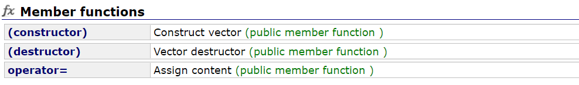

| 接口声明                                                  | 解释                                                         |
| --------------------------------------------------------- | ------------------------------------------------------------ |
| **`vector()`**                                            | **默认构造（无参构造）**                                     |
| `vecotr(size_type n, const_value_type& val=value_type())` | 填充构造，构造对象含有 n 个指定的元素 val                    |
| `vector(InputIterator first, InputIterator last)`         | 范围构造，以迭代器的方式取某个对象的部分 $[first,last)$ 构造对象 |
| **`vector(const vector& v)`**                             | **拷贝构造**                                                 |

利用迭代器区间进行构造对象时，可以使用任意类型变量的迭代器，因为这里的参数是迭代器模板，支持任意的迭代器。

~~~cpp
template <class InputIterator> //迭代器模板
vector (InputIterator first, InputIterator last);
~~~

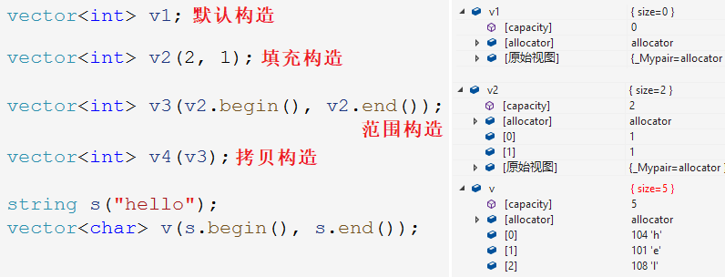

> 析构函数通常不用手动调用。赋值重载的使用也很简单。

#### 1.2 vector 的容量操作

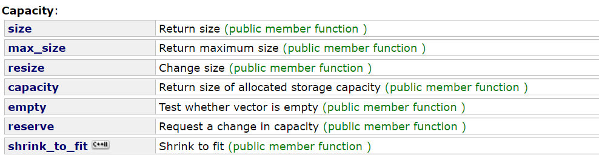

| 接口声明                                                     | 解释                                           |
| ------------------------------------------------------------ | ---------------------------------------------- |
| **`size_type size()`**                                       | **返回对象的有效元素个数**                     |
| **`size_type capacity()`**                                   | **返回对象的容量大小**                         |
| `size_type max_size()`                                       | 返回 vector 对象最大能存储的元素个数（无意义） |
| **`void reserve (size_type n);`**                            | **增加容量大小，不影响有效个数**               |
| **`void resize (size_type n, value_type val = value_type());`** | **增加/减小有效元素个数，可指定初始值**        |

~~~cpp
vector v;
v.size();
v.capacity();

v1.reserve(100); //扩容到100
v1.resize(100,1); //有效元素个数变为100,新增元素初始化为1
v1.resize(10); //有效元素个数变为10
~~~

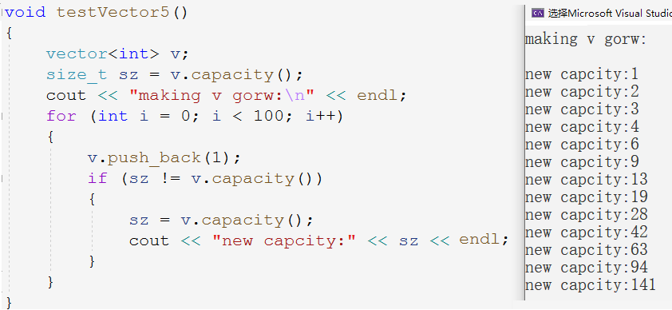

由图可知，Windows 下 vector 增容按1.5倍增。

#### 1.3 vector 的访问操作

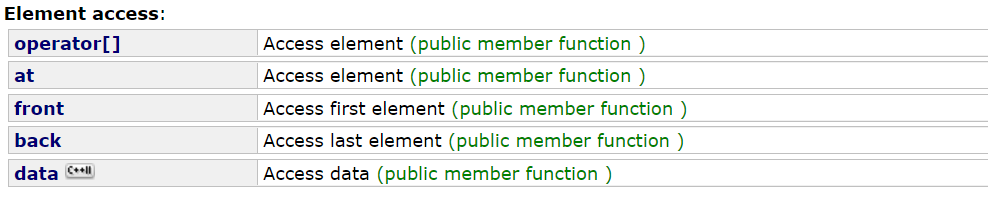

| 接口声明                                | 解释                                           |
| --------------------------------------- | ---------------------------------------------- |
| **`reference operator[](size_type n)`** | **重载操作符`[]`，返回对应下标位置元素的引用** |
| `reference at(size_type n);`            | 返回对象中指定下标位置的引用。                 |

`[]`重载和`at`的区别是`[]`越界会断言报错，`at`是抛异常。

#### 1.4 vector 的迭代器操作

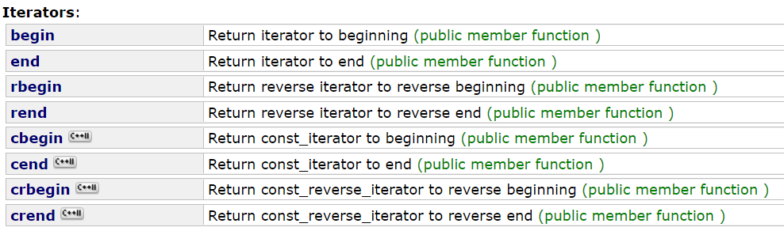

有`[]`的重载我们就已经能方便快捷的访问操作 vector 的元素，但并不意味着就要放弃使用迭代器。因为容器的定义要保证规范性和统一性，大部分容器都支持迭代器访问，且迭代器使用简单统一。

STL 标准库中的任意容器针对迭代器操作的区间都是采用 $[first,last)$ 左开右闭的方式。

~~~cpp
/* vector三种遍历方式 */
//[]
for (size_t i = 0; i < v1.size(); i++) {
    v1[i] += 1;
    cout << v1[i] << " ";
}
cout << endl;
//iterator
vector<int>::iterator it = v1.begin();
while (it != v1.end()) {
    cout << *it << " ";
    it++;
}
cout << endl;
//for-loop
for (auto e : v1) {
    cout << e << " ";
}
cout << endl;
~~~

#### 1.5 vector 的修改操作

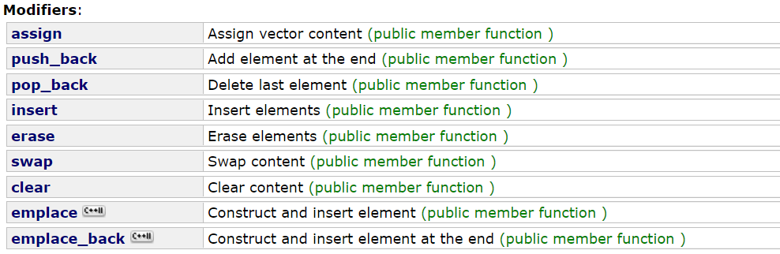

| 接口声明        | 解释                                                         |
| --------------- | ------------------------------------------------------------ |
| **`push_back`** | **尾插一个元素**                                             |
| **`pop_back`**  | **尾删一个元素**                                             |
| `assign`        | 类似构造函数中的范围构造和填充构造，使用利用迭代器取对象的部分或指定个元素来填充对象。覆盖性的分配内容。 |
| `insert`        | 指定迭代器位置插入一个值，指定迭代器位置插入多个值，指定迭代器位置插入迭代器区间 |
| `erase`         | 删除指定迭代器位置的值，删除指定迭代器区间的值               |

~~~cpp
/* assign */
template <class InputIterator>                             
void assign (InputIterator first, InputIterator last);                     // range (1)	
void assign (size_type n, const value_type& val);                          // fill (2)	
/* insert */
iterator insert (iterator position, const value_type& val);                // single element (1)
void insert (iterator position, size_type n, const value_type& val);       // fill (2)	
template <class InputIterator>
void insert (iterator position, InputIterator first, InputIterator last);  // range (3)	
/* erase */
iterator erase (iterator position);
iterator erase (iterator first, iterator last);
~~~

~~~cpp
v.insert(ret, 30);
v.insert(ret, 2, 30);
v.insert(ret, v2.begin(), v2.end());
v1.erase(pos);
v1.erase(v1.begin(), v1.end());
~~~

#### 1.6 vector 的其他操作

##### 查找接口 find

vector 库中没有像 string 库一样提供成员函数`find`接口。因为 vector 作为数组本身的查找需求比较简单，直接使用算法库中的`find`即可，而 string 对象需要实现正向反向查找字符或子串，才单独实现在类中。

~~~cpp
#include <algorithm>
template <class InputIterator, class T>
    InputIterator find (InputIterator first, InputIterator last, const T& val) {
    while (first != last) {
        if (*first == val) {
            return first;
        }
        ++first;
    }
    return last;
}
~~~

遍历对象寻找是否有和 val 相等的迭代器位置元素，有则返回迭代器位置，无则返回最后一个迭代器位置`end()`。

### 2 vector 的 OJ题

#### 2.1 只出现一次的数字 I
[只出现一次的数字 (leetcode.com)](https://leetcode-cn.com/problems/single-number/)

~~~cpp
class Solution {
public:
    int singleNumber(vector<int>& nums) {
        int ret = 0;
        for (auto& e : nums) {
            ret ^= e;
        }
        return ret;
    }
};
~~~

1. 根据异或原理：对应二进制位相同为0相异为1，故任何数与0异或都是该数本身，也就是数组元素和`ret`异或都是该元素本身。

2. 又因为两个相同的数异或得0，所以遍历数组元素和0异或可以将出现两次的数消去。


#### 2.2 杨辉三角
[杨辉三角 (leetcode.com)](https://leetcode-cn.com/problems/pascals-triangle/)

~~~cpp
class Solution {
public:
    vector<vector<int>> generate(int numRows) {
        vector<vector<int>> vv;
        vv.resize(numRows);
        for (size_t i = 0; i < numRows; ++i) 
        {
            //开空间
            vv[i].resize(i + 1); 
            //填值
            vv[i][0] = vv[i][vv[i].size() - 1] = 1; 
        }
        //运算
        for (size_t i = 2; i < numRows; ++i) 
        {
            for (size_t j = 1; j < i; ++j) 
            {
                vv[i][j] = vv[i - 1][j - 1] + vv[i - 1][j];
            }
        }
        return vv;
    }
};
~~~

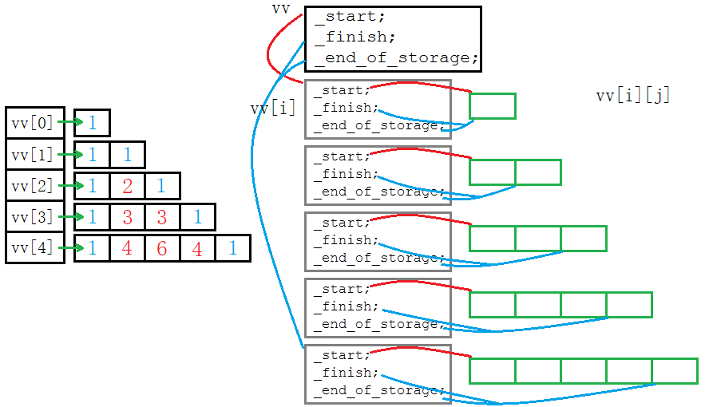

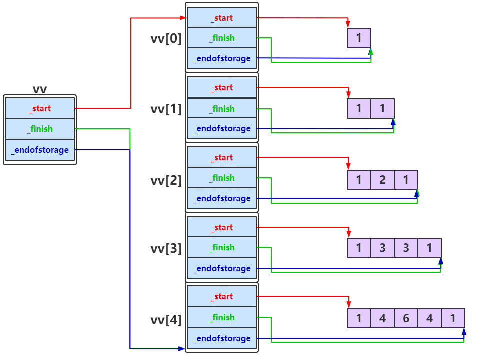

#### 2.3 删除有序数组中的重复项

[删除有序数组中的重复项 (leetcode.com)](https://leetcode-cn.com/problems/remove-duplicates-from-sorted-array/)

##### 前后指针解法

~~~cpp
class Solution {
public:
    int removeDuplicates(vector<int>& nums) {
        int begin = 0, end = 1; 
        int dst = 1; 
        while (end < nums.size()) //end向后遍历
        {
            if (nums[end] != nums[begin]) //找到不同的元素
            {
                begin = end; //左指针移动到该位置，之前的元素都被抛弃
                nums[dst] = nums[begin]; //将该元素移动到dst位置
                dst++; //dst进位
            }
            ++end; //end进位
        }
        return dst;
    }
};
~~~

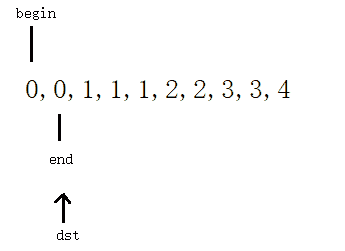

右指针向后遍历找与左指针不同的元素，找到之后左指针移动到该位置，再将元素放到dst指针处，相当于原地覆盖形成新数组，最后返回dst即可，数组的长度就是dst。

只找不同的元素，剩余的元素都是被抛弃的元素，不需理会，之后被dst覆盖即可。

##### 双指针解法

~~~cpp
class Solution {
public:
    int removeDuplicates(vector<int>& nums) {
        vector<int>::iterator dst = nums.begin();
        vector<int>::iterator src = ++nums.begin();
        while (src < nums.end()) 
        {
            if (*src == *dst) 
            {
                nums.erase(src);
            }
            else 
            {
                dst++;
                src = dst + 1;
            }
        }
        return nums.size();
    }
};
~~~

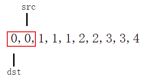

dst和src同时向后遍历，src 指针始终在dst的后一个，

1. 当src和dst相同时，说明有重复项，就将src位置元素删除（src之后的元素前移一位）。
2. 当src和dst不同时，dst进位，src始终指向dst的后一位。

相同删除，不同进位。

#### 2.4 只出现一次的数字 II

[只出现一次的数字 II (leetcode.com)](https://leetcode-cn.com/problems/single-number-ii/)

##### 确定二进制位

为了方便叙述，我们称「只出现了一次的元素」为「答案」。

由于数组中的元素都在 int（即 32 位整数）范围内，因此我们可以依次计算答案的每一个二进制位是 0 还是 1。

具体地，考虑答案的第 i 个二进制位（i 从 0 开始编号），它可能为 0 或 1。对于数组中非答案的元素，每一个元素都出现了 3 次，对应着第 i 个二进制位的 3 个 0 或 3 个 1，无论是哪一种情况，它们的和都是  3 的倍数（即和为 0 或 3）。因此：

答案的第 i 个二进制位就是数组中所有元素的第 i 个二进制位之和除以 3 的余数。

这样一来，对于数组中的每一个元素 x，我们使用位运算 (x >> i) & 1 得到 x 的第 i 个二进制位，并将它们相加再对 3 取余，得到的结果一定为 0 或 1，即为答案的第 i 个二进制位。

~~~cpp
class Solution {
public:
    int singleNumber(vector<int>& nums) {
        int ans = 0;
        //
        for (int j = 0; j < 32; ++j) 
        {
            int total = 0; // 用于计算所有元素当前位值之和
            for (auto num : nums)
            {
                total += ((num >> j) & 1); //第i个元素的第j位的值
            }
            //将total%3左移到当前位与ans或等
            ans |= (total % 3) << j;
        }
        return ans;
    }
};
~~~

数组先排序，如果nums[i]==nums[i+1]，说明有相等，直接跳3个，判断第四个，同样的判断 直到出现nums[i]!=nums[i+1]，return nums[i]；

临界条件是最后一个是只出现一个的数字，所以加上判定条件i==n-1，说明已经遍历到最后一个元素 这时候可以直接return

```cpp
class Solution {
public:
    int singleNumber(vector<int>& nums) {
        //排序
        sort(nums.begin(), nums.end());
        //三个一组从0开始遍历
        for (int i = 0; i < nums.size(); i += 3) {
            //只要当前元素不等于下一个元素，则当前元素必是答案
            //还有一种特殊情况：最后一个元素为答案
            if (i == nums.size() - 1 || nums[i] != nums[i + 1]) {
                return nums[i];
            }
        }
        return 0;
    }
};
```

数组先排序，排好序的数组在遍历的时候会出现这样的情况：

1. xxx 1
2. 1 xxx
3. xxx 1 yyy

多个三个为一组的，一个一个为一组的。如果nums[i]==nums[i+1]，说明有相等，直接跳3个。不管哪种只需3个为一组遍历，当下标位置的值和下一个位置不等时，则下标为答案，因为是三个为一组遍历的。另外，当i为最后一个元素时，说明当前元素为答案，因为三个一组遍历，多出一个来。

#### 2.5 只出现一次的数字 III

[只出现一次的数字 III (leetcode.com)](https://leetcode-cn.com/problems/single-number-iii/)

~~~cpp
class Solution {
public:
    vector<int> singleNumber(vector<int>& nums) {
        vector<int> retV;//创建返回值数组
        sort(nums.begin(), nums.end());//先排序数组
        //对排好序的数组遍历
        for (int i = 0; i < nums.size(); i += 2) {//两个为一组遍历
            //组内第一个不等于第二个，则第一个必是答案中的一员
            if (i == nums.size() - 1 || nums[i] != nums[i + 1]) {
                retV.push_back(nums[i]);//将答案插入数组
                if (i != nums.size() - 1) {
                    //危险操作，当前为答案，故向前一位，
                    //以便下次进入循环时，从该元素的下一个元素开始遍历
                    i -= 1;
                }
            }
            if (retV.size() == 2) {//找齐答案后立即返回
                return retV;
            }
        }
        return retV;
    }
};
~~~


#### 2.6 数组中次数过半的数字

[数组中出现次数超过一半的数字 (newcode.com)](https://www.nowcoder.com/practice/e8a1b01a2df14cb2b228b30ee6a92163)

~~~cpp
class Solution {
public:
    int MoreThanHalfNum_Solution(vector<int> numbers) {
        sort(numbers.begin(), numbers.end());
        int begin = 0, end = 0;
        int retArr[2] = { 0 };
        //前后遍历寻找当前元素的最后一个位置
        while (end < numbers.size()) {
            while (end < numbers.size()) {
                if (numbers[end] != numbers[begin]) {
                    break;
                }
                end++;//向后遍历
            }
            if ((end - begin) > retArr[0]) {
                retArr[0] = end - begin;//存入数组
                retArr[1] = numbers[begin];
            }
            //把begin变成下一个元素的起始位置，继续向后遍历
            begin = end;
        }
        return retArr[1];
    }
};
~~~

排序数组，排序后的数组.begin指针指向0，end同样，end向后遍历直到不相同的元素，计算个数，将个数和值放入二元数组中，遍历直到个数更大的元素出现。

#### 2.7 电话号码的字母组合

[电话号码的字母组合 (leetcode.com)](https://leetcode-cn.com/problems/letter-combinations-of-a-phone-number/)

~~~cpp
class Solution {
    //先将数字对应字符串存入数组，建立映射（直接定义成成员变量即可）
    string arr[10] = { "", "", "abc", "def", "ghi", "jkl", "mno", "pqrs", "tuv", "wxyz" };
public:
    //digists数字字符串的长度就是递归的深度，每个数字所对应的字符串str的长度代表递归的广度，i标志着当前层数即递归深度
    /* combinStr是一种字母组合，retSV返回字符组合数组 */
    void _letterCombinations(string& digits, size_t i, string combinStr, vector<string>& retSV) 
    {
        if (i == digits.size()) //i等于数字字符串长度时，表示当前递归结束
        { 
            retSV.push_back(combinStr); //此时一种字母组合已经形成，将其插入返回数组中
            return;
        }
        string str = arr[digits[i] - '0']; //取出当前数字（当前层）对应的字符串 "abc","def","jkl" 等
       	/* 循环控制宽度，递归控制深度 */
        for (size_t j = 0; j < str.size(); ++j) //j用于遍历所在层字符串的字符
        {
            //i控制递归遍历的深度，也就是层数
            _letterCombinations(digits, i + 1, combinStr + str[j], retSV);
            //combinStr+str[j] 将当前层遍历到的单个字母插入字符串，i+1 将递归深度+1进入下一层，即访问下一个数字映射的字符串
            //combinStr不可使用+=，回溯到同一层时，combStr传值调用，combStr不可被改变，因为combStr还要和其他字母组合
            //i也不可以使用++,因为递归之后要回溯到上一层，有循环存在，还要在进行下一路的递归，此时必须保证i还是这一层的i
            //插一个字母进入下一层，直到最后一层结束再向上回溯，conbinStr也就插入了不同层字母，得到多个数字所映射的字母组合
        }
    }
    vector<string> letterCombinations(string digits) {
        string combinStr;//组合字符串
        vector<string> retSV;//收集字符组合的返回值数组
        if (digits.empty()) {
            return retSV;
        }
        _letterCombinations(digits, 0, combinStr, retSV); //调用递归子函数
        return retSV;
    }
};
~~~

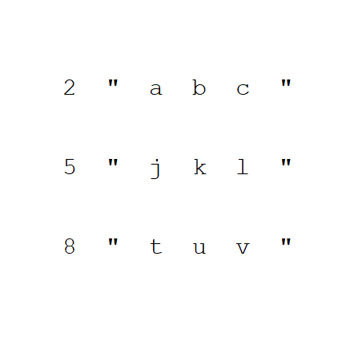

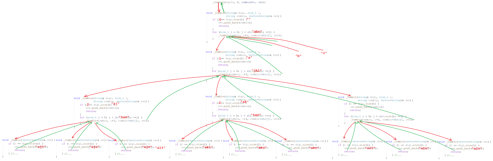

#### 2.8 连续子数组的最大和

[连续子数组的最大和 (newcode.com)](https://www.nowcoder.com/practice/459bd355da1549fa8a49e350bf3df484)

输入一个长度为 n 的整型数组 array，求其所有子数组的和的最大值。

~~~cpp
class Solution 
{
public:
    int FindGreatestSumOfSubArray(vector<int> array) {
        //记录到下标i为止的最大连续子数组和
        vector<int> dp(array.size(), 0);
        dp[0] = array[0];
        int maxsum = dp[0];
        for (int i = 1; i < array.size(); i++) {
            //状态转移：连续子数组和最大值
            dp[i] = max(dp[i - 1] + array[i], array[i]);
            //维护最大值
            maxsum = max (maxsum, dp[i]);
        }
        return maxsum;
    }
};
~~~


&nbsp;

### 3. vector 的模拟实现


#### 3.1 类的定义

~~~cpp
template <class T, class Alloc = alloc>
    class vector {
        public:
        typedef T* iterator;
        // ...
		private:
        iterator start;
        iterator finish;
        iterator end_of_storage;
    }
~~~

这个结构和我们之前实现的顺序表结构形式稍有不同，但本质是一样的。只是将表示容量和元素个数的变量用指向对应位置的迭代器代替。

~~~cpp
class Seqlist {
    T* _a;            /* start */
    size_t _size;     /* finish - start */
    size_t _capacity; /* end_of_storage - start */
}
~~~

> `<class Alloc=alloc>`是空间配置器（内存池）相关的东西，学习 vector 阶段不必过多了解。

#### 3.2 默认成员函数

~~~cpp
//default constructor
vector()
    : _start(nullptr)
    , _finish(nullptr)
    , _end_of_storage(nullptr)
{}
//fill constructor
vector(size_t n, const T& val = T())
    : _start(new T[n])
    , _finish(_start + n)
	, _end_of_storage(_finish)
{
	memset(_start, val, sizeof(T) * n);
}
//copy constructor
vector(const vector<T>& v)
    : _start(new T[v.capacity()])
	, _finish(_start + v.size())
	, _end_of_storage(_start + v.capacity())
{
    memcpy(_start, v._start, sizeof(T) * v.size());
}
~~~

- 默认构造、填充构造、拷贝构造三种构造函数的默认传统写法。都很类似地开空间再拷贝数据。

~~~cpp
//range constructor
template <class InputIterator>
vector(InputIterator first, InputIterator last) 
    : _start(nullptr)
	, _finish(nullptr)
	, _end_of_storage(nullptr)
{
	while (first != last) 
	{
		push_back(*first++);
    }
}
//copy constructor
vector(const vector<T>& v) 
    : _start(nullptr)
	, _finish(nullptr)
	, _end_of_storage(nullptr)
{
    vector<T> tmp(v.begin(), v.end());
    swap(tmp);
}
~~~

> 从范围构造可以看出类模板中的函数也可以是函数模板。

##### 迭代器的分类

函数模板的模板参数要传迭代器区间时，命名是有规定的，范围构造中的`InputIterator`就是一种指定的迭代器类型。因容器的结构各有不同，迭代器分为五种类型：

| 迭代器类型              | 名称            | 解释                                                 | 适用容器            |
| ----------------------- | --------------- | ---------------------------------------------------- | ------------------- |
| input / output_iterator | 输入/输出迭代器 | 只读迭代器只能读取，只写迭代器可以写入该位置的值     | 无实际容器          |
| forward_iterator        | 向前迭代器      | 只能向前移动（++），允许在迭代器位置进行读写         | forward_list        |
| bidirectional_iterator  | 双向迭代器      | 可以双向移动（++,--），允许在迭代器位置进行读写      | list, map, set      |
| random_access_iterator  | 随机迭代器      | 支持指针运算，可移动（++,--）任意跳转（+,-）读写(\*) | deque,vector,string |

可以看出，下方的迭代器类型是上方的父类，也就是说**下方迭代器满足上方的所有要求**。

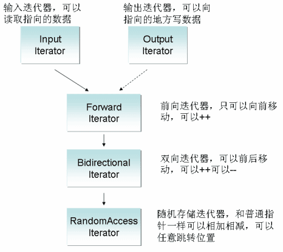

之所以划分出不同的迭代器类型，是为了限制传入的迭代器的类型，因为其必须满足指定的需求才能完成接下来的函数。 

例如范围构造的参数指明迭代器类型为`InputIterator`，意思是满足输入迭代器的要求的迭代器都可以作此参数。故此处我们可以传入任意的迭代器。

> 一般像底层是数组连续空间实现的容器，例如 vector, string 等的迭代器类型都是随机迭代器。像双向链表这样的非连续空间的容器的迭代器类型是双向迭代器。

- 通过复用构造函数的范围构造重载版本可以实现拷贝构造的现代写法。记得要初始化一下指针不然构造出来的随机值会影响之后的释放。

~~~cpp
//overload operator=
vector<T>& operator=(vector<T> v)  /* pass by value */
{
    swap(v);
    return *this;
}
//destructor
~vector() {
    delete[] _start;
    _start = _finish = _end_of_storage = nullptr;
}
~~~

- 赋值重载的现代写法都是这么写的，只要实现了拷贝构造就可以。

#### 3.2 访问接口

~~~cpp
//overload operator []
T& operator[] (size_t pos) {
    return *(_start + pos);
}
const T& operator[](size_t pos) const {
    return *(_start + pos);
}
//iterator
typedef T* iterator;
typedef const T* const_iterator;
iterator begin() {
    return _start;
}
iterator end() {
    return _finish;
}
const_iterator begin() const {
    return _start;
}
const_iterator end() const {
    return _finish;
}
~~~

> 反向迭代器的设计较为复杂，要单独设计类去封装，该类封装正向迭代器，然后重载其operator++，学到 list 会能更好的理解迭代器。

#### 3.3 容量接口

~~~cpp
void resize(size_t n, const T& val = T()) {
    if (n > size()) {
        if (n > capacity()) {
            reserve(n);
        }
        while (_finish != _start + n) 
        {
            *_finish = val;
            _finish++;
        }
    }
    //_finish = _start + n; //迭代器的遍历以达到更新_finish位置的效果。
}
~~~

- 缺省值采用`T()`的形式，即用 T 类型的匿名对象作`val`的缺省值。`T()`是调用默认构造函数的初始化出的对象，得到的是 T 类型的空值。

> 模板泛型编程兴起时，C++ 为了让模板参数适用于所有类型，对内置类型也优化出了构造函数。

~~~cpp
void reserve(size_t n)
{
    if (n > capacity()) {
    	size_t oldSize = size();
        //增容
        T* tmp = new T[n];
        if (_start) {
            memcpy(tmp, _start, size() * sizeof(T));
            delete[] _start;
        }
        // 更新迭代器位置
        _start = tmp;
        _finish = _start + oldSize;
        _end_of_storage = _start + n;
    }
}
~~~

- **在`_start`更新前计算出有效元素个数`oldSize`**，用于更新增容后的`_finish`的地址，等到`_start`被修改后才计算就无法得到正确的结果。

##### memcpy 浅拷贝问题

~~~cpp
vector<string> v;
v.push_back("1111111");
v.push_back("1111111");
v.push_back("1111111");
v.push_back("1111111");
v.push_back("1111111"); //增容浅拷贝
~~~

> 假如用 vector 数组存储 string 对象，四次尾插元素都没问题，当第五次尾插元素时出现了内存问题。

其实，第五次尾插出现问题，是因为第五次时正好数组已满需要增容。而模拟实现的`reserve`函数使用`memcpy`将原空间的内容按字节拷贝至新空间。

1. 若 vector 存储的是内置类型的数据，则浅拷贝至新空间没有问题。
2. 若 vector 存储的是自定义类型的数据，由于浅拷贝粗暴地复制变量后再释放原空间，使得新变量指向已释放的空间。

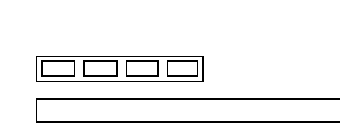

如图所示，将对象中的原变量浅拷贝一份，再释放原空间，导致拷贝来的新变量指向了已释放的空间。故应该改为深拷贝。深拷贝需要调用自定义类型的拷贝构造或者赋值重载。

> 模拟实现的 reserve 是从堆上直接用 new 开辟一块空间，顺带初始化该段空间，所以深拷贝调用赋值重载即可。库中的容器都是从内存池上开辟空间，则需要调用定位 new 初始化空间再调用拷贝构造去拷贝数据。 

~~~cpp
void reserve(size_t n) 
{
    if (n > capacity()) {
        size_t oldSize = size();
        T* tmp = new T[n];
        if (_start) {
            //memcpy(tmp, _start, size() * sizeof(T));
            for (int i = 0; i < size(); i++) {
                tmp[i] = _start[i];//_start指向的空间存任意类型都能完成深拷贝
            }
            delete[] _sta rt;
        }
        _start = tmp;
        _finish = _start + oldSize;
        _end_of_storage = _start + n;
    }
}
~~~

~~~cpp
size_t size() const {
    return _finish - _start;
}
size_t capacity() const {
    return _end_of_storage - _start;
}
bool empty() const {
    return _start == _finish;
}
~~~


#### 3.4 修改接口

~~~cpp
void swap(vector<T> v) {
    std::swap(start, x.start);
    std::swap(finish, x.finish);
    std::swap(end_of_storage, x.end_of_storage);
}
void assign(size_t n, const T& val) {
    resize(n);
    memset(_start, val, sizeof(T) * n); //出其他值Error
}
void clear() {
    _finish = _start;
}
void push_back(const T& x) {
    if (_finish == _end_of_storage) {
        //增容
        reserve(capacity() == 0 ? 4 : capacity() * 2);
    }
    *_finish = x;
    ++_finish;
}
void pop_back() {
    assert(_finish > _start);
    --_finish;
}
~~~

> 上述接口没什么难度。

~~~cpp
iterator insert(iterator pos, const T& val)
{
    assert(_start <= pos && pos <= _finish); //检查pos位置是否合法
    // 增容
    if (_finish == _end_of_storage) {
        size_t sz = pos - _start;
        reserve(capacity() == 0 ? 4 : capacity() * 2); //增容会导致迭代器失效，迭代器位置陈旧
        pos = _start + sz; //增容后更新pos
    }
    // 后移 [pos,_finish)
    iterator end = _finish;
    while (end != pos) {
        *end = *(end - 1);
        --end;
    }
    // 插入
    *pos = val;
    ++_finish;
    return pos; //返回迭代器最新位置
}
~~~

- 插入元素必然考虑增容，增容后`_start`指向新空间，但迭代器位置`pos`并没有改变仍然指向原空间的某个位置，也就是迭代器失效。所以要在**增容前计算`pos`相对`_start`的位置，待增容后更新`pos`使之指向对应的位置即可**。
- `insert`函数内迭代器失效的问题解决了，但函数外的`pos`实参并没有改变仍然指向陈旧的错误位置，故将更新的`pos`迭代器作返回值返回。

> ~~~cpp
> vector<int>::iterator pos = find(v.begin(), v.end(), 2);
> if (pos != v.end()) 
> {
>        pos = v.insert(pos, 20); // 更新 pos 实参
> }
> ~~~
>
> 只能采用返回值的形式，不可以通过传引用解决，因为可能会传入临时对象等。

```cpp
iterator erase(iterator pos)
{
    assert(_start <= pos && pos < _finish);
    /*iterator begin = pos;
    while (begin != _finish) {
        *begin = *(begin + 1); // 越界访问 -> begin=_finish-1时，begin+1 == _finish
        begin++;
    }*/
    iterator begin = pos + 1;
    while (begin != _finish)
    {
        *(begin - 1) = *begin;
        begin++;
    }
    _finish--;
    return pos; //返回迭代器最新位置
}
```

- 遍历循环的临界条件是下标`!=`尾元素的后一个位置（不可访问），则下标最终会遍历到尾元素，即访问范围已足够，因此不可在循环内使下标加值如：`*(begin+1)`。

~~~cpp
vector<int>::iterator pos = v1.begin();
while (pos != v1.end()) {
    //删除所有偶数
    if (*pos % 2 == 0) { 
        pos = v1.erase(pos);//删除后pos复位
    }
    else {
        ++pos;//不符合删除条件的才进位
    }
}
~~~

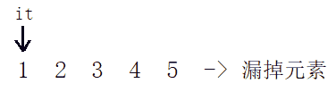

- `erase`同样有迭代器失效的问题，**删除后 pos 就已经指向了下一个元素，再直接`++pos`会跳过该元素**。须不符合删除条件时再 ++。
- `pos=erase(pos)`保证删除后 pos 的位置依然正确，避免有些少见的 STL 版本可能会缩容导致`pos`为野指针。

> 漏掉元素是 erase 删除元素出现的所有问题的根源。迭代器失效的问题只有在连续使用迭代器时才会出现。不光 vector 会迭代器失效，只要能够使用迭代器访问的容器，都可能发生迭代器失效的问题。

#### 3.5 其他接口

~~~cpp
bool operator==(vector<T> v) {
    if (&x != this) {
        for (size_t i = 0; i < size(); i++) {
            if ((*this)[i] != v[i]) {
                return false;
            }
        }
    }
    return true;
}
bool operator!=(vector<T> v) {
    return !(*this == v);
}
bool operator< (vector<T> v) {
    for (size_t i = 0; i < size(); i++) {
        if ((*this)[i] >= v[i]) {
            return false;
        }
    }
    return true;
}
bool operator<=(vector<T> v) {
    return *this < v || *this == v;
}
bool operator> (vector<T> v) {
    return !(*this <= v);
}
bool operator>=(vector<T> v) {
    return !(*this < v);
}
~~~

> 复用`==`,`<`逻辑即可完成对象的所有比较运算符的重载。

