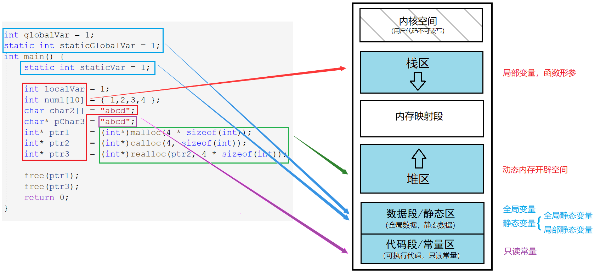
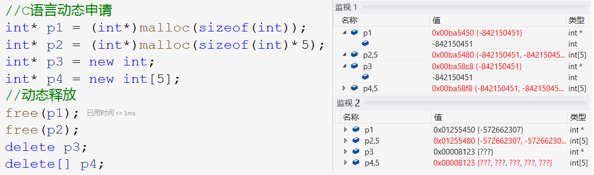
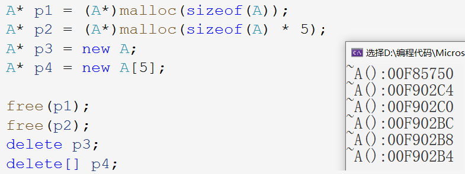

## C/C++ 内存管理

> 程序启动后会将内存空间划分成这样的几块区域，便于更好的管理。

### 1. C/C++ 内存分布

1. 栈区：调用函数时，函数栈帧、函数形参、局部变量都会在栈区上创建。
2. 堆区（`heap`）：运行时按需开辟的空间，从堆低向上开辟空间，堆顶向下释放空间。在程序结束后也被操作系统会自动回收。
3. 数据段（静态区）：系统层面上被称为数据段，语言层面上叫作静态区。存放全局变量，静态数据。
4. 代码段（常量区）：系统层面上被称为代码段，语言层面上叫作常量区。存放可执行代码、指令一类的和只读常量，这些东西一般不会被修改。

值得注意的是，字符串数组`char2`的内容`"abcd"`也是存储在栈上的，是从常量区拷贝过来的。

&nbsp;

### 2. 动态内存管理

#### 2.1 C语言动态内存管理

##### malloc/calloc/realloc free

~~~c
void* malloc ( size_t size );
~~~

- `malloc`返回通用类型的指针，将其强制转换为所需类型，并用该类型的指针维护该内存空间。
- 开辟成功返回空间起始地址，开辟失败则返回`NULL`。 

~~~c
void* calloc ( size_t num, size_t size );
~~~

`calloc`函数在堆区上申请`num`个`size`大小的空间，返回起始地址并将内容初始化为0。

~~~c
void* realloc ( void* memblock, size_t size );
~~~

`realloc`函数为已开辟的空间重新开辟大小。

- 当原空间后有足够大小时，就紧接原空间开辟剩余空间，并返回整个空间的起始地址。反之，就在堆区寻找新空间，再将原空间的内容移动到新空间，返回新空间的地址且释放原空间。
- 当剩余空间不够无法开辟时，增容失败，返回`NULL`。

~~~c
void free ( void* memblock );
~~~

- `free`函数释放指针指向的动态开辟的空间，但不对指针造成任何影响。

- 使用结束`free`释放内存以防内存泄漏，将指针置空避免成为野指针。

> 防止增容失败将原空间指针置空，故不可直接使用原指针接受返回值。判断非空后再赋给原指针。

#### 2.2 C++ 动态内存管理

C语言的动态内存管理不够方便在细节上还需要优化，所以C++进行了一些改动。

~~~cpp
// C语言动态申请
int* p1 = (int*)malloc(sizeof(int));
int* p2 = (int*)malloc(sizeof(int) * 5);
// 动态释放
free(p1);
free(p2);

// C++动态申请
int* p3 = new int;
int* p4 = new int[5];
// 动态释放
delete p3;
delete[] p4;
~~~

使用关键字`new`开辟空间，不需要强制类型转换，new 后面跟的类型就是空间地址解引用后对应的类型。new 和 delete 操作连续空间使更加方便。

~~~cpp
//初始化空间
int* p1 = new int(5); 
char* p2 = new char('a');
A* p3 = new A;
~~~

new 类型后面可以使用`()`进行初始化，按照类型的大小用相同的值初始化每块空间。

> ~~~cpp
> int* p = new int[5]{ 1,2,3,4,5 };
> ~~~
>
> C++11支持用`{}`初始化连续空间。

##### new/delete 操作内置类型

> 如图所示，监视1对应开辟空间，监视2对应着销毁空间的时候。可见，此时 malloc free 和 new delete 没有区别。

malloc/free 和 new/delete 对内置类型没有本质区别，只有语法上的区别。

##### new/delete 操作自定义类型

- 对于自定义类型，new 不仅会开出对应的空间，还会调用该类型对应的构造函数进行初始化。

> 自定义类型自动调用构造函数，比粗暴初始化的 calloc 更加人性化。由于 new 定义对象时没有传参，所以必须要类有默认构造函数。 

- 对于自定义类型，delete 先自动调用析构函数，再释放空间。

##### 注意

malloc/free 和 new/delete 最好匹配使用，不要随意搭配，否则可能会出错。

~~~cpp
//1.
int* p = (int*)malloc(sizeof(int));
free(p);
//2.
int* p = new int;
delete p;
//3.
int* p = new int[5];
delete[] p;
~~~

C++之所以发明 new/delete 语法，原因有二：

1. 操作自定义类型时，可以自动调用构造和析构函数以初始化和清理资源。
2. 开辟或释放空间时，能够以抛异常的形式提示错误，符合面向对象的错误处理机制。

&nbsp;

### 3. new/delete 重载函数

> new/delete 和 malloc/free 二者对于内置类型只有用法上的区别，对于自定义类型，会自动调用自定义类型的构造函数和析构函数。这是二者最大的区别，也是发明 new/delete 的目的。

- new：先开辟空间，再调用构造函数
- delete：先调用析构函数，再释放空间

~~~cpp
class Stack {
public:
	Stack(int capacity = 4)
		: _capacity(capacity)
		, _top(0) 
    {
		_a = new int[_capacity]; //不需要判空
	}
	~Stack() {
		delete[] _a;
		_capacity = _top = 0;
	}
private:
	int* _a;
	int _top;
	int _capacity;
};
//动态开辟，主动控制生命周期
Stack* pst = new Stack(8); //开辟空间，调用构造函数
delete pst;                //调用析构函数，释放空间
~~~

#### 3.1 new/ delete 重载函数实现

new/delete是进行动态开辟和释放的操作符，operator new/operator delete 是系统提供的全局函数。

new/delete的底层是分别调用operator new/operator delete 来实现的，而 operator new/operator delete 又是分别调用C语言的 malloc/free 实现的。

~~~cpp
void *__CRTDECL operator new(size_t size) _THROW1(_STD bad_alloc)
{       // try to allocate size bytes
    void *p;
    while ((p = malloc(size)) == 0)
        if (_callnewh(size) == 0)
        {       // report no memory
            static const std::bad_alloc nomem;
            _RAISE(nomem);
        }

    return (p);
}
void operator delete(void *pUserData)
{
        _CrtMemBlockHeader * pHead;
        RTCCALLBACK(_RTC_Free_hook, (pUserData, 0));
        if (pUserData == NULL)
            return;
        _mlock(_HEAP_LOCK);  /* block other threads */
        __TRY
            /* get a pointer to memory block header */
            pHead = pHdr(pUserData);
             /* verify block type */
            _ASSERTE(_BLOCK_TYPE_IS_VALID(pHead->nBlockUse));
            _free_dbg( pUserData, pHead->nBlockUse );
        __FINALLY
            _munlock(_HEAP_LOCK);  /* release other threads */
        __END_TRY_FINALLY
        return;
}
~~~

如图所示，调用 operator new 函数只能开辟空间和抛出异常，而 new 对象时会调用 operator new 函数，并调用构造函数。

operator new/operator delete 就是对 malloc/free 的封装，operator new 可以说是符合面向对象特征的 malloc，多了抛异常的处理机制，更符合面向对象对程序异常的处理机制。operator delete 同理。

> operator new/operator delete 并不是提供给用户使用的函数，是提供给 new 和 delete 使用的。

#### 3.2 new/delete 类专属重载*

> operator new/operator delete 的类专属重载多用于解决项目中需要频繁的申请小块内存的问题，先向系统申请一块内存池，之后开辟空间就向内存池开辟空间，以免不必要的消耗。

operator new 一般有两种形式，一是全局重载的 operator new，二是针对某个类专属定制的重载 operator new。

~~~cpp
void* operator new (size_t size);
void* A::operator new (size_t size);
~~~

一般 operator new 就是用来分配内存的，系统默认的全局重载也是用 malloc 实现向堆上申请内存，并返回地址。

~~~cpp
class ListNode {
public:
    friend class List;
	void* operator new(size_t size) {
		void* p = nullptr;
		p = allocator<ListNode>().allocate(1); //STL中内存池--空间配置器
		cout << "memory pool allocate" << endl;
		return p;
	}
	void operator delete(void* p) {
		allocator<ListNode>().deallocate((ListNode*)p, 1);
		cout << "memory pool deallocate" << endl;
	}
private:
	ListNode* _prev;
	ListNode* _next;
	int _val;
};
class List {
    public:
    List() {
        _head = new ListNode;
        _head->_prev = _head;
        _head->_next = _head;
    }
    ~List() {
        ListNode* cur = _head->_next;
        while (cur != _head) {
            ListNode* next = cur->_next;
            delete cur;
            cur = next;
        }
        delete _head;
        _head = nullptr;
    }
    private:
    ListNode* _head;
};
~~~

new 不能被重载，其行为总是一致的。它先调用 operator new 分配内存，然后调用构造函数初始化那段空间。要实现不同的内存分配行为，应该重载函数 operator new，而不是重载操作符 new。

使用 new/delete 操作对象时，系统会优先调用类专属的重载 operator new/delete，没有的话才会调用全局的。

> 不管是全局还是类专属的 operator new 都是用来实现内存空间的开辟的。除此以外，operator new[]、operator delete、operator delete[] 也是可以重载的。

#### 3.3 new/delete 实现原理

> new/delete 的执行过程上面也已经探究过，实现原理也分为操作内置类型和自定义类型两种。

##### 内置类型

对于内置类型，new/delete 分别调用 operator new/operator delete 函数去开辟或释放空间。和 malloc/free 基本类似，不同点上面已经讲解过，这里就不在赘述。

##### 自定义类型

| 操作单个对象     | 实现原理                                                     |
| ---------------- | ------------------------------------------------------------ |
| new              | 调用 operator new 申请空间，调用构造函数构造对象             |
| delete           | 调用析构函数清理资源，调用 operator delete 释放空间          |
| **操作多个对象** | **实现原理**                                                 |
| new[N]           | 调用 operator new[] ，由该函数调用 operator new 申请N块空间，再调用N次构造函数构造对象 |
| delete[]         | 调用N次析构函数清理资源，再调用 operator delete[]，由该函数调用 operator delete 释放空间 |

&nbsp;

### 4. 定位 new 表达式*

#### 4.1 使用方式

~~~cpp
//1.
new(place_address) type;
//2.
new(place_address) type(initailizer_list);
~~~

定位 new 表达式是**为已分配给对象的空间调用该类型的构造函数**初始化该段空间。

~~~cpp
Test* pt = (Test*)malloc(sizeof(Test));
//已开辟好的空间，调用构造函数
new(pt) Test; 
new(pt) Test(1);
~~~

如上述代码所示：`pt`是一开辟好的空间，使用定位 new 表达式初始化`pt`，会调用对象的构造函数初始化这段空间。

~~~cpp
//1.
A* a = new A;
//2.
A* a = (A*)operator new(sizeof(A));
new(a) A;
~~~

可以说第一种和第二种方式是等价的，所以 new 开辟对象空间相当于调用 operator new 函数开辟空间再使用定位 new 表达式。

#### 4.2 使用场景

> 使用定位new表达式初始化一段已开辟好的空间，不如直接使用操作符 new 来的方便。

定位 new 表达式实际上一般配合内存池使用。内存池分配的内存没有被初始化，如果分配给自定义类型的对象，需要使用定位 new 表达式进行显式调用构造函数。

构造函数不可以显式调用，所以要使用 定位 new 表达式，但析构函数可以直接调用。

~~~cpp
// new
A* a2 = (A*)operator new(sizeof(A));
new(a2) A;
// delete
a2->~A();
operator delete(a2);
~~~

&nbsp;

### 5. 常见面试题

#### 5.1 malloc/free 和 new/delete 的区别

malloc/free 和 new/delete 的相同点是都是从堆上主动申请空间和释放空间，不同点是：

| 用法上的区别                                                 |
| ------------------------------------------------------------ |
| malloc 申请空间需要计算大小并强转类型，new 只需要在后面跟上对象类型 |
| malloc 申请空间失败时会返回NULL，因此需判空，new 失败时会抛异常 |
| **底层上的区别**                                             |
| malloc/free 是函数，new/delete 是操作符                      |
| malloc/free 申请/释放空间不存在初始化，new/delete 可以初始化和销毁空间 |

#### 5.2 内存泄漏

##### 内存泄漏的定义

内存泄漏指的是因为疏忽或错误造成程序未能释放并不可再使用的内存空间。内存泄漏不是指内存物理层面的消失，而是给程序分配内存后，因错误失去了对该段内存的控制，造成了内存的浪费。

内存泄漏可以在程序结束后返还给系统，但长期运行的程序出现内存泄漏的影响很大，如操作系统、服务器后台等，出现内存泄漏会导致程序变慢，最终卡死。

##### 内存泄漏的分类

- 堆内存泄漏

堆内存指的是程序执行中通过动态开辟的函数从堆中分配的一块内存，用完后必须通过调用相应的 free 或者 delete 释放掉。假设程序的设计错误导致这部分内存没有被释放，那么以后这部分空间在结束运行前将无法再被使用，也就是堆内存泄漏。

- 系统资源泄漏

指程序使用系统分配的资源，比如套接字、文件描述符、管道等没有使用对应的函数释放掉，导致系统资源的浪费，严重可导致系统效能减少，系统执行不稳定。

##### 如何避免内存泄漏

1. 良好的设计规范，良好的编码规范。
2. 采用 RAII 思想或者智能指针来管理资源。
3. 公司内部规范使用内部实现的私有内存管理库。这套库自带内存泄漏检测的功能选项。
4. 出问题了使用内存泄漏工具检测。
