## 基础语法

C语言是结构化的语言，不适合大型程序开发时。Bjarne等人顺应面向对象思想在C语言的基础上发明了一种新的语言，名为C++。C++以C语言为基础，最初叫做C with class新增了类的概念，后逐步更新迭代，变得更加丰富完善。

历代版本中最重要的是C++98和C++11两个版本，C++98是C++标准的第一个版本，以模板的方式重写C++标准库，引入了STL，C++11为其增加了许多实用的特性，如正则表达式、基于范围的for循环、auto关键字、新容器、列表初始化和标准线程库等等。

C++在C的32个关键字的基础上新增了31个关键字，故C++兼容C绝大多数的特性。也暗含着C++的基础语法也是为了弥补C语言的某些缺陷。

&nbsp;

### 1. 命名空间

命名空间的出现即是为了解决C语言中经常出现的命名冲突的问题，定义的全局变量、函数有可能与C/C++库文件以及项目中团队成员写的文件中的变量发生命名冲突的问题。

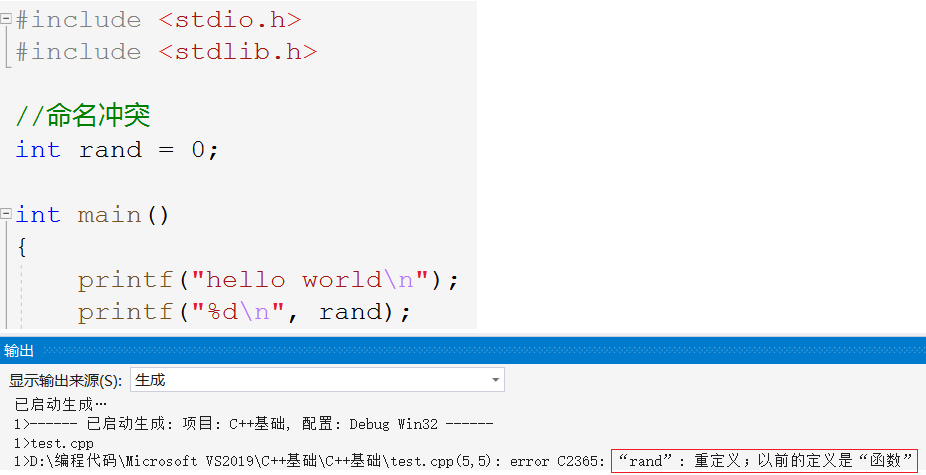

> 如图所示，定义的全局变量`rand`和库中的rand发生冲突。C语言没有办法解决这样的问题，C++就此提出新的语法命名空间。

#### 1.1 命名空间的定义

命名空间，即定义一个域来定义变量、函数或类型，使用这些变量时需在其名称前面加上特定的标识，对标识符的名称进行本地化处理以避免命名冲突或名字污染。

~~~cpp
namespace test {
    //1.
	int rand = 0;
    //2. 
    int Add(int a, int b) {
        return a+b;
    }
    //3.
    struct Node {
        int data;
        struct Node* next;
    };
}
~~~

1. 这样的一个“域”，只是给变量加上了一层锁，并不会影响变量的属性仍然是全局变量。
2. 命名空间中只能定义变量或函数并进行初始化，不可以进行其他操作。

##### 命名空间的嵌套

~~~cpp
namespace N1 {
	int a = 0;
	int b = 0;
	int Add(int a, int b) {
		return a + b;
	}
	namespace N2 {
		int c = 0;
		int d = 0;
		int Sub(int c, int d) {
			return c - d;
		}
	}
}
~~~

此外，当命名空间重名时，两个同名的命名空间会被合并为一个工作空间。

#### 1.2 命名空间的使用

在命名空间中定义变量，相当于将变量封锁起来，只能使用特定的方式进行访问。使用命名空间中的变量有如下三种方式。

##### 名称加域作用限定符`::`

~~~cpp
namespace test 
{
	int rand = 0;
}
int main() 
{
    printf("%d", test::rand);
}
~~~

在变量名前加上空间名和`::`，即告诉编译器使用该命名空间中的变量。当然，域作用限定符并不是C++新增的C语言中同样可以使用。例如，编译器在查找变量时，先到局部域中找再到全局域中找。

~~~cpp
int a = 0;
int main()
{
	int a = 1;
	printf("%d\n", ::a);
	return 0;
}
~~~

> `::`前不写空间的名称，就表示使用全局范围的变量。

##### 引入整个命名空间

~~~cpp
using namespace test;

int main()
{
    rand = 1;
    Add(1, 2);
    struct Node n1;
    return 0;
}
~~~

这种写法将该命名空间中的所有变量或者函数都展开，好处是非常方便但坏处是使整个命名空间失效，可能造成命名冲突。相当于取消隔离，所以要慎用。

##### 引入命名空间中的成员

~~~cpp
using test::rand;
using test::Add;
using test::Node;
~~~

指定引入单独的空间成员，只展开常用的成员，相对来说更加安全可靠。

第一种命名空间名称加域作用限定符的方式隔离效果最好但使用繁琐，第二种将整个命名空间打开最简单方便但隔离效果最差，容易导致命名冲突。

&nbsp;

### 2. 输入输出

~~~cpp
#include <iostream>  //C++标准输入输出流文件
using namespace std;
int main()
{
    //1.
	cout << "hello world" << endl;
	//2.
    std::cout << "hello world" << std::endl;
    //3.
    using std::cout;
	using std::endl;
	cout << "hello world" << endl;
    return 0;
}
~~~

C++库的实现都放在一个叫`std`的命名空间中，所以在上方引入了该命名空间。一般在学习时直接展开整个标准命名空间即可。

- `cout`其实是一个全局变量在C++中称为对象，为标准输出即控制台。`cin`是C++的标准输入即键盘。

- `<<`流插入运算符，`>>`流提取运算符。

> `cout<<"hello"`即将字符串插入或称输出到标准输出中。`cout<<endl`即将换行符输出到标准输出中。`cout`相当于`printf`，`cin`相当于`scanf`。

`cout`,`cin`可以自动识别类型，不需要格式控制符，也可以根据变量的值自动控制小数点位数。

~~~cpp
int i = 0;
double d = 1.11;

cin >> i >> d;
cout << i << " " << d << endl;
~~~

C和C++的方式都可以选用，哪个方便选哪个。如果想实现控制域宽或小数位数，最好使用`prinf`和`scanf`。cin 和 scanf 都存在缓冲区遗留回车字符`\n`的问题。

### 3. 缺省参数

缺省就是默认的意思，就像备胎一样，如果有就用给的，如果没有就用默认值。

#### 3.1 缺省参数的定义

缺省参数就是在声明或者定义函数的时候为函数的参数指定一个默认值。在调用该函数时，若无传入实参则使用该参数的缺省值，否则则使用传入值。

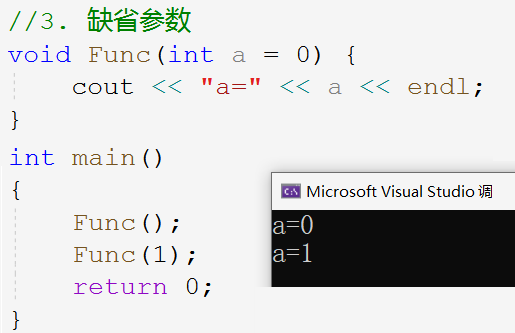

> `Fun(1)`调用函数显式传参1，则a=0，`Func(0)`调用函数不传参，使用缺省值0。

~~~cpp
void Func(int a = 10, int b = 20, int c = 30) {
	cout << "a=" << a << endl;
	cout << "b=" << b << endl;
	cout << "c=" << c << endl << endl;
}
int main()
{
	Func(); // 不传参
	Func(1); // 传 a=1
	Func(1, 2); // 传 a=1,b=2
	Func(1, 2, 3); // 传 a=1,b=2,c=3
    //错误写法
    Func(,2,);
    Func(,,3);
    Func(1,,3);
	return 0;
}
~~~

如上述代码所示，调用带有缺省参数的函数的传参也必须连续地按照从左向右的顺序传参。可以不传但不可以跳过，不可以指定某个参数传参。

#### 3.2 缺省参数的分类

- 全缺省参数，即函数的所有参数均采用缺省值的形式；

- 半缺省参数，即函数只有部分参数采用缺省值的形式。

~~~cpp
//1.全缺省参数
void Func(int a = 10, int b = 20, int c = 30) {
	cout << "a=" << a << endl;
	cout << "b=" << b << endl;
	cout << "c=" << c << endl << endl;
}
//2.半缺省参数
void Func(int a, int b, int c = 30) {
	cout << "a=" << a << endl;
	cout << "b=" << b << endl;
	cout << "c=" << c << endl << endl;
}
~~~

##### 注意

1. 若采用半缺省参数的形式，与调用时传参的顺序相反，参数列表必须从右往左缺省且必须连续。所以通常将需要缺省的参数放在右边，如下所示：

~~~cpp
//1. 
void Func(int a = 10, int b = 20, int c = 30) {}
//2.
void Func(int a, int b = 20, int c = 30) {}
//3. 
void Func(int a, int b, int c = 30) {}
//错误形式
void Func(int a = 10, int b, int c = 30) {}
void Func(int a = 10, int b, int c) {}
~~~

2. 缺省参数不可在函数声明和定义中同时出现，一般放在声明中便于观察。

> 缺省参数应用，例如栈的初始化时，给定缺省参数`capacity`以初始化栈的大小，当确定栈的大小时，可以直接给其赋值。

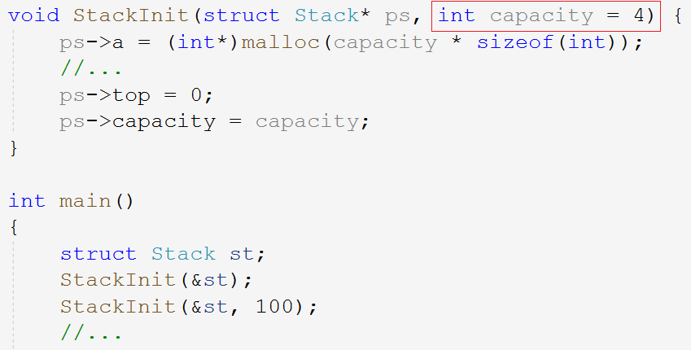

&nbsp;

### 4. 函数重载

重载的意思是具有多重含义，那么函数重载即是一个函数具有多种功能，也就是对同一个函数名的不同的“解释”。

#### 4.1 函数重载的定义

为适应需求，C++创造出了一种新语法叫函数重载，函数重载是函数的一种特殊情况。规定允许在同一个作用域中出现几个功能类似的同名函数，一般用于适应不同类型的数据。这些同名函数的参数列表必须不同，即**参数个数，参数顺序，参数类型三者有一个不同即可**。

> 注意，返回类型不同不算重载。因为仅靠返回类型无法在调用时区分重载的函数。

~~~cpp
//1.
int Add(int a, int b) {
	return a + b;
}
//2.
int Add(int a, int b, int c) {
	return a + b + c;
}
//3.
float Add(int a, float b) {
	return a + b;
}
//4.
float Add(float a, int b) {
	return a + b;
}
~~~

第一个和第二个参数个数不同，第一个和第三个参数类型不同，第三个和第四个参数顺序不同。讨论参数个数顺序类型都仅看类型，与形参名称无关。

~~~cpp
//1.
void f(int a) {
	cout << "f(int a)" << endl;
}
void f(int a = 0) {
	cout << "f(int a = 0)" << endl;
}
//2.
void f() {
	cout << "f()" << endl;
}
void f(int a = 0) {
	cout << "f(int a = 0)" << endl;
}
~~~

第一组函数不可构成重载，参数与缺省值无关。第二组函数参数个数不同构成重载，但调用时存在歧义。

#### 4.2 名字修饰

为什么C++支持函数重载而C语言不支持呢？原因是C++编译链接时对于函数的查找更加严格，具体如下。

C/C++的源文件都是需要进行预处理，编译，汇编，链接，最后生成可执行程序的。和C的源文件一样，都是源文件先单独编译生成目标文件合到一起链接成可执行程序。

函数的声明和定义分离会使编译器在编译源文件时暂时找不到函数的地址，那么其查找函数的规则则会在链接时体现。所以将函数的声明和实现放到两个文件中，更方便观察C++和C对于函数名字修饰规则的不同。

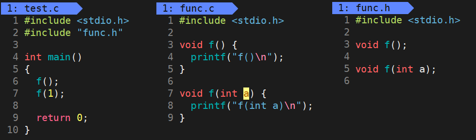

> 写出函数重载的示例，并将声明和定义分离，再写出测试程序。使用C语言和C++的编译结果如下图所示。使用C编译显示函数重定义，而使用C++编译便可以成功运行。说明C语言确实不支持函数重载。

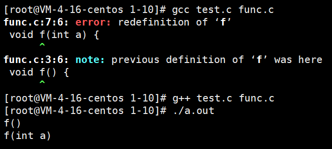

在深究为什么C不支持而C++支持函数重载前，先回顾一下编译链接C/C++程序的流程。

| 步骤     | 作用                                     | 生成文件  |
| -------- | ---------------------------------------- | --------- |
| 1 预处理 | 头文件展开，宏替换，预处理指令，删除注释 | `*.i`文件 |
| 2 编译   | 各种语法分析，符号汇总，生成汇编代码     | `*.s`文件 |
| 3 汇编   | 将汇编代码转化成机器指令                 | `*.0`文件 |
| 4 链接   | 合并段表，符号表的合并和重定位           | `a.out`   |

整个编译阶段完成后，`test.o`中只有函数名没有函数的具体地址。之后的链接过程中，能够在`func.o`中找到函数真正的地址，并合并到符号表中。

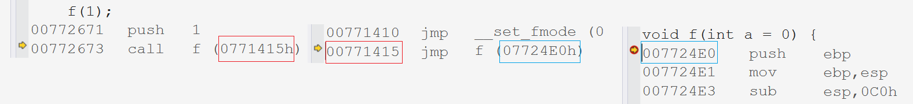

- 使用C语言编译`func.c`时，两个同名函数的符号表存在冲突，所以编译失败，都到不了链接的步骤。其次链接的时候也会存在歧义，因为C语言单纯使用函数名查找函数地址。

- C++为支持函数重载便引入了函数名修饰规则，且不同环境下规则也不尽相同。可见C++的函数查找规则更严格，重载函数便不具二义性了。所以C++不是直接用函数名来查找函数地址的，为更好的展示对比规则，使用如下代码到Linux环境下查看。

~~~cpp
int Add(int a, int b) {
	return a + b;
}
void func(int a, double b, int* p) {
	;
}
int main()
{
	Add(1, 2);
	func(1, 2, 0);
	return 0;
}
~~~

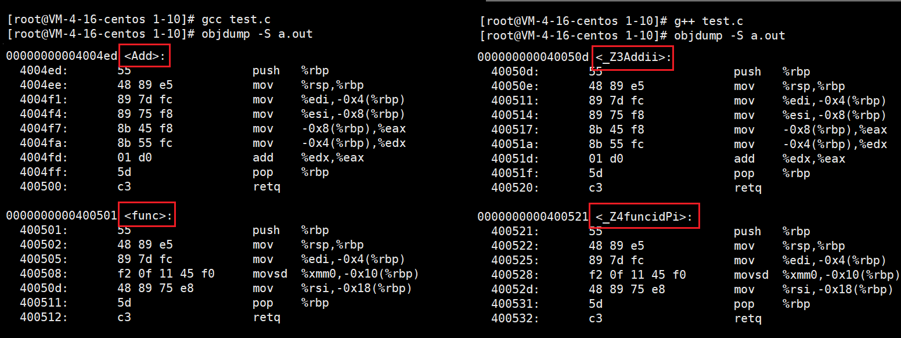

如图右所示，`_Z`表示函数的前缀，数字`3`,`4`表示函数名字符长度，`Add`,`func`表示函数名，`i`,`d`,`Pi`取参数类型首字母以表示参数。由此也可以观察出函数重载的要求。

#### 4.3 extern "C"

当我们使用C语言程序去调用C++所写的库或者使用C++程序去调用C所写的库时，必须要在C++文件中引入`extern "C"`，这样才能让C++程序按照C的方式调用函数。

可以将`.lib`库文件和头文件放入工程文件的位置，也可以记下文件位置以待在调用工程中配置相关设置。下面仅介绍 vs 环境下的配置方法，其他平台大同小异。

由于工程中没有库文件，所以要在工程的属性设置中的链接设置中填写库文件的位置和文件名。如下图所示：

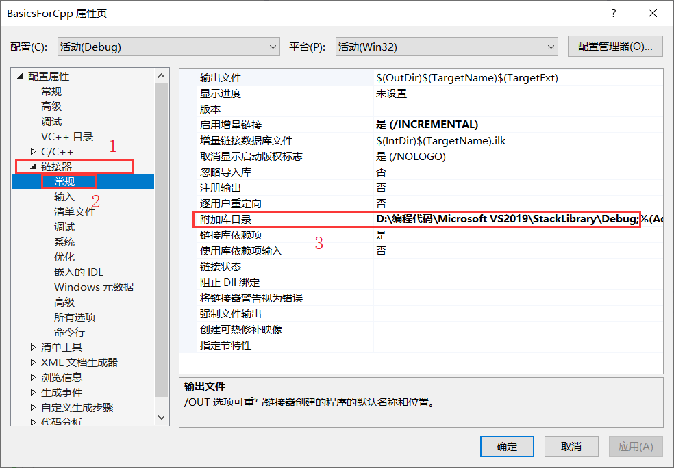

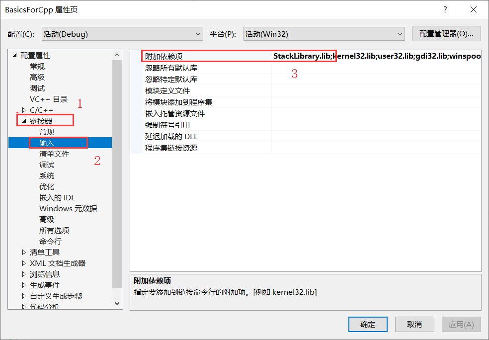

经过上述步骤，工程便可以找到库文件了，下面解决调用问题，调用报错找不到找不到函数地址，这是因为C/C++的函数名修饰规则不同导致的。所以要在C++文件中使用`extern"C"`。`extern "C"`命令就是为了让该文件使用C语言的名字修饰规则，以免C程序调用时找不到函数。

##### C++程序调用C的库

C++的工程去调用C语言所写的库，只需要在工程包头文件时加上这样的语句即可。

~~~cpp
extern "C"
{
#include "../../StackLibrary/StackLibrary/Stack.h"
}
~~~

##### C程序调用C++的库

C程序调用C++的库相对来说要繁琐一点，因为头文件须在C和C++的文件都展开。必须在C++工程中将头文件加上条件编译指令，免得C语言调用的时候遇到`extern"C"`。基本方法如下：

这里有两种方式，一种是利用`#ifdef __cplusplus`给头文件加上`extern"C"{}`的代码，现在C++的工程中编译一下生成可以让C语言程序可以调用的`.lib`文件。

~~~c
#define FRISTSOLUTION 1
//第一种方案
#ifdef FRISTSOLUTION 
	#ifdef __cplusplus 
	extern "C" {
	#endif
		void StackInit(ST* ps);
		void StackPush(ST* ps, STDataType data);
		void StackPop(ST* ps);
		STDataType StackTop(ST* ps);
		int StackSize(ST* ps);
		bool StackEmpty(ST* ps);
		void StackDestroy(ST* ps);
	#ifdef __cplusplus 
	}
	#endif
//第二种方案
#else 
	#ifdef __cplusplus
		#define EXTERN_C extern "C"
	#else 
		#define EXTERN_C
	#endif
	EXTERN_C void StackInit(ST* ps);
	EXTERN_C void StackPush(ST* ps, STDataType data);
	EXTERN_C void StackPop(ST* ps);
	EXTERN_C STDataType StackTop(ST* ps);
	EXTERN_C int StackSize(ST* ps);
	EXTERN_C bool StackEmpty(ST* ps);
	EXTERN_C void StackDestroy(ST* ps);
#endif
~~~

&nbsp;

### 5. 引用

> 引用是C++中一个重要的语法，在后期应用非常广泛。相较于指针，它更加方便也更好理解。

#### 5.1 引用的定义

引用是给已存在的变量取一个别名，并不是定义一个新的变量。语法层面上，引用变量没有开辟空间，它和它所引用的变量共同使用一块空间。

取别名就相当于取外号，相当于给一块空间取了两个名字而已。 ^d141c3

~~~cpp
//类型& + 引用变量名 = 引用实体
int a = 0;
int& b = a;
~~~

> `b`是`a`的引用，相当于给`a`取了一个新名字叫`b`，b 和 a 指向同一块空间，改变 b 就相当于改变 a 。

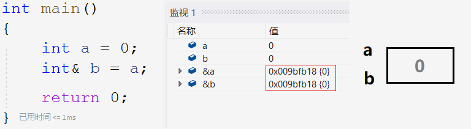

#### 5.2 引用的特性

- 定义引用时必须要初始化；
- 一个变量可以有多个引用；
- 引用初始化后不可改变引用实体。

~~~cpp
//1.
int a = 10;
int& b;//Err
//2.
int& b = a;
int& c = b;
int& d = c;
//3.
int e = 1;
int& f = a;
f = e;//把e赋值给f所引用的变量a
~~~

定义引用时必然要初始化，不然别名就没有意义了。一个变量可以取多个别名，但一个别名被使用后便不可以指代其他变量，只能是赋值操作。引用也是有一定的局限性，更多是和指针配合起来使用。

#### 5.3 常引用

常变量是具有常属性的变量，那么常引用就是具有常属性的引用。常引用会涉及到权限的问题，如：

~~~cpp
//权限放大
const int a = 0;
int& ra = a;//Err
//权限缩小
int b = 0;
const int rb = b;
//权限相同
const int c = 0;
const int& rc = c;
~~~

引用`const`修饰的常变量时，如果引用不加`const`，那么就造成了权限扩大显然时不允许的。权限不允许扩大但是可以不变和缩小，在用引用做参数时，可以加`const`修饰防止实参被修改。

~~~cpp
double d = 1.11;
int i = d;

double d = 1.11;
const int& i = d;
~~~

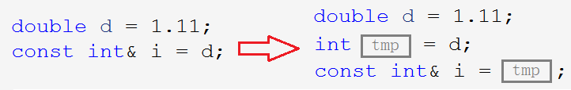

将浮点型变量`d`赋值给整型变量`i`时会发生隐式类型转换，中间会创建一个临时变量，所以这样不同类型的变量赋值本质是将`d`的数据截断放入临时变量中再将临时变量赋值给`i`。类似于不同整型数据进行比较会发生整型提升，其实就是将各自产生的临时变量进行整型提升再进行比较，这也是二者的值不会发生改变的原因。创建临时变量的方式不仅存在于类型转换，还有整型提升，传参返回等。

这样的临时变量是个右值具有常属性，所以只有常引用才能引用这样的临时变量。也就使得`const Type&`的引用类型可以引用任意类型的变量。

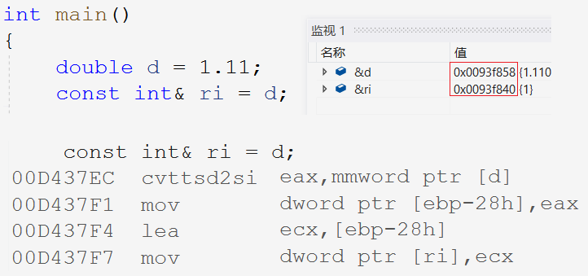

从监视窗口可以看到，`d`和`ri`并没有指向同一块空间，`ri`应该指向的是类型转换所产生的临时变量那块空间。从汇编代码看更清晰，赋值所产生的临时变量的地址为`ebp-28h`，同时`ri`也指向此处。

#### 5.4 引用的应用

上述举例中的引用只是在学习引用的特性，并没有什么实用意义。实际使用时通常有两种用法，作参数和返回值。

##### 作函数参数

~~~cpp
void Swap(int x, int y) {     //传值
    int tmp = x;
    x = y;
    y = tmp;
}
void Swap(int* px, int* py) { //传址
	int tmp = *px;
	*px = *py;
	*py = tmp;
}
void Swap(int& rx, int& ry) { //传引用
	int tmp = rx;
	rx = ry;
	ry = tmp;
}
int main() {
	int x = 0, y = 1;
	Swap(&x, &y);
	cout << x << " " << y << endl;
	Swap(x, y);
	cout << x << " " << y << endl;
	return 0;
}
~~~

第一种传值调用显然是不行的，传址调用和传引用的区别在于前者通过地址访问到实参`x`,`y`，后者通过引用实参避免了实参的临时拷贝。三者参数列表分别为整型、指针类型和引用类型，构成了函数重载，但调用时仍会有歧义。

**Example 1**

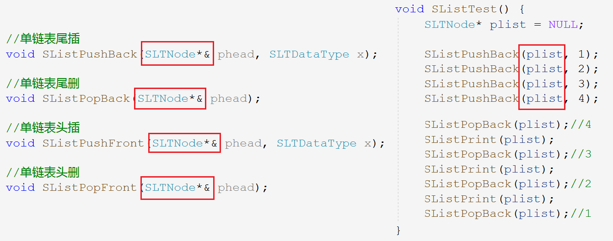

如图所示，单链表中因可能修改头指针`plist`而使用二级指针传参的方法可以选择一级指针的引用替代。`phead`就是`plist`的引用，改变`phead`就是改变`plist`。

**Example 2**

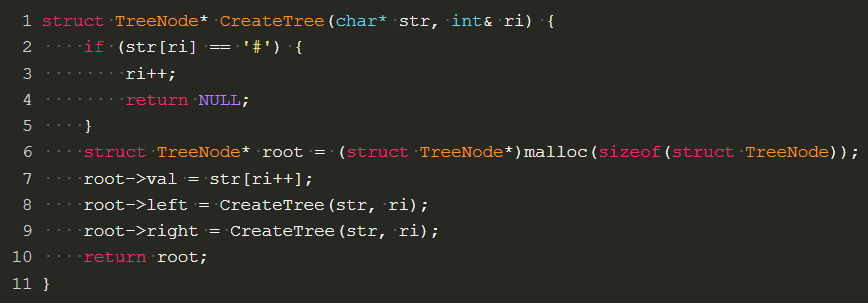

在练习使用前序序列字符串建立二叉树的代码中，就可以在递归的过程中将结点个数改成引用变量，显然比指针更方便。

##### 作返回类型

> 引用作返回类型也是比较难理解的点。先看下面的例子：

~~~cpp
int& Add(int a, int b) {
	int c = a + b;
	return c;
}
int main()
{
	int ret = Add(1, 2);
	Add(10, 20);
	cout << ret << endl;
	return 0;
}
~~~

`Add`函数栈帧销毁后，函数返回了`c`的引用，再执行`ret=Add(1,2)`相当于取`c`的值赋值给`ret`，而`c`的内存空间已返还给操作系统，就造成了非法访问。

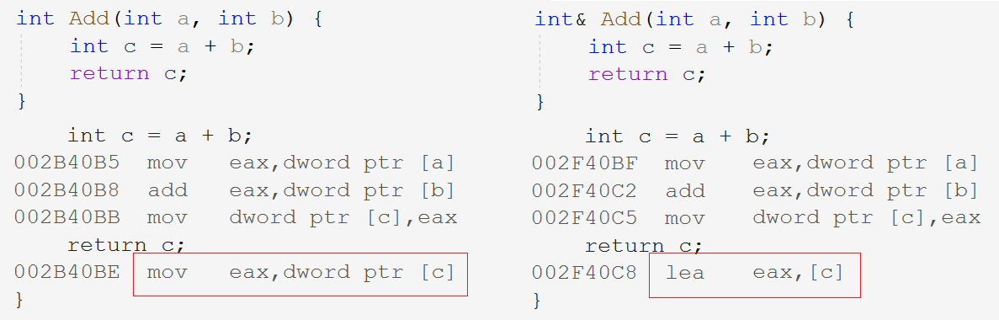

~~~assembly
mov eax, dword ptr [c]
; 将变量c的值放入寄存器eax中
lea eax, [c]
; 将变量c的地址放入寄存器eax中
~~~

返回值和返回引用的区别就是一个用临时变量存储了`c`的值返回的是拷贝对象，一个用引用访问了原来`c`的内存空间读取`c`的值返回的是返回值对象本身。之所以将地址放到寄存器中带回，是因为引用的底层实现是指针，一会要通过地址访问`c`的内存空间。

~~~cpp
int& Add(int a, int b) {
	int c = a + b;
	return c;
}
int main() {
	int& ret = Add(1, 2);
	cout << ret << endl;
	Add(10, 20);
	cout << ret << endl;
	return 0;
}
~~~

两次打印`ret`一次是3一次是30。从这个例子可以看出，引用将`c`的地址带了回来`ret`也初始化为了`c`的引用，Add栈帧销毁又创建，每次的`c`变量都在同一块空间`ret`也引用了这块空间，所以下次调用Add函数时这块空间的值被修改成了30。

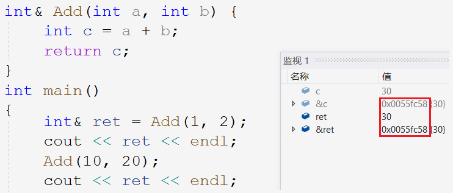

引用作返回值可能会造成非法访问，所以不要返回局部变量的引用。引用作返回值自有其的应用场景，在后续的学习中会遇到。

~~~cpp
int& At(int i) {
	static int a[N];
	return a[i];
}
int main() {
	for (int i = 0; i < N; i++) {
		cout << "a[" << i << "]=" << (At(i) = i) << endl;
	}
	return 0;
}
~~~

#### 5.5 传值传引用效率对比

~~~cpp
#include <time.h>
struct A { int a[10000]; };
void TestFunc1(A a) {}
void TestFunc2(A& a) {}
void TestTransferRefAndValue() {	
	A a;
	size_t begin1 = clock();
    for (size_t i = 0; i < 1000000; i++)    
        TestFunc1(a);
	size_t end1 = clock();
	size_t begin2 = clock();
	for (size_t i = 0; i < 1000000; i++)
		TestFunc2(a);
	size_t end2 = clock();
	cout << "TestFunc1(A a):" << end1 - begin1 << endl;
	cout << "TestFunc2(A& a):" << end2 - begin2 << endl;
}
int main() {
	TestTransferRefAndValue();
	return 0;
}
~~~

传引用和传指针差不多，每次调用都访问的是同一块空间，而传值每次调用都会开辟一样大的空间，所以传引用的效率比传值高很多，数据越大对性能的提升越大。引用可以作输出型参数或输出型返回值，就是达到形参改变外面的实参的目的。

#### 5.6 引用和指针的区别

引用和指针在语法层面上是完全不同的两种语法，但从汇编代码可以看出引用的底层也是用指针实现的，发明引用就是为了解决多级指针造成的理解困扰。当然底层原理仅作了解，日常开发时谨记语法即可。

| 引用和指针的不同点                                           |
| ------------------------------------------------------------ |
| 引用是一个变量的别名故没有开辟空间，指针是一个变量存储变量的地址 |
| 引用在定义时必须初始化，指针没有要求                         |
| 引用定义后就无法改变引用实体，指针可以任意改变指向对象       |
| 没有空引用，只有空指针                                       |
| `sizeof(Type&)`表示引用对象的类型大小，`sizeof(Type*)`表示当前平台地址大小 |
| 引用自增自减改变引用实体的大小，指针自增自减表示地址位置的前后移动 |
| 有多级指针，无多级引用 指针需要显式解引用，引用编译器处理 引用相对指针更加安全 |

&nbsp;

### 6. 内联函数

函数压栈需要进行一系列的操作，所以像一些小的被频繁调用的如`Swap`,`Add`等仅有几行的函数，放在调用层不符合高内聚低耦合的要求，独立出去又浪费性能。解决这种问题除了使用C语言的语法宏以外，C++还有新语法叫内联函数。

#### 6.1 内联函数的定义

用`inline`修饰的函数就叫内联函数，编译时编译器会自动将其在调用处展开，不会产生函数压栈的一系列开销，提升了程序的效率。

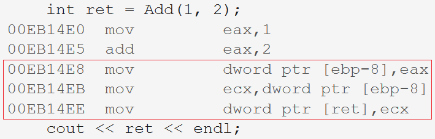

> 内联函数只在release模式下起作用，若想在Debug模式下查看需要配置项目属性。

#### 6.2 内联函数的特性

1. 内联函数是一种以空间换时间，省去调用函数开销，故一般十行以上或有递归迭代的函数不宜使用内联函数。
2. 内联函数仅是对编译器的一种建议，编译器自动优化，如果不符上述要求，编译器会放弃优化。
3. 内联函数不建议声明和定义分离，内联函数不会调用就没有函数地址分离会导致链接失败。

> 以空间换时间是因为每个调用的地方都展开导致指令变多程序变大，每次加载到内存占用就越大，但省去了调用函数的时间。

宏的优点是可以增强代码的复用性，提高性能，缺点是无法调试，可维护性差，没有类型检查。C++出台内联函数就是推荐使用内联函数。

&nbsp;

> 以下语法是C++11中的语法，了解即可。

### 7. auto 关键字

> C语言中也有 auto 关键字，它修饰的变量随着函数栈帧的销毁而销毁，但是不加修饰的变量仍然如此，所以可以说C语言中的auto是个没用的关键字，忽略即可切莫与C++中的 auto 混淆。

#### 7.1 auto 的定义

使用`auto`定义变量时，变量的类型是由编译器根据其初始化的内容确定的，因此 auto 修饰的变量必须初始化。`auto`并非是一种类型的声明，而是一种类型的“占位符”，编译器会在编译时将`auto`替换成实际的类型。

~~~cpp
int a = 10;
auto b = a;
auto c = 10;
auto d = 'A';
auto f = 11.11;
auto e = "aaaa";
~~~

 auto 的意义在于，当变量前的类型很长时可以使用 auto 简写更省事和搭配C++11的范围for使用。

#### 7.2 auto 的使用

##### auto 声明指针和引用

~~~cpp
int a = 10;
//定义指针
auto pa = &a;
auto* pa = &a;
//定义引用
auto& ra = a;
~~~

使用`auto`定义指针可以再`auto`后面加`*`也可以不加，通过初始化的内容都能确定指针的类型。但引用必须要加`&`，不然无法确定。

##### auto 一行定义多个变量

~~~cpp
auto a = 1, b = 2;
auto c = 3, d = 4.0;//Err
~~~

`auto`连着定义多个变量时，变量的类型必须相同，因为编译器只对第一个变量的类型进行推导，以推得的类型定义之后的变量。

##### auto 不能推导的情况

此外，auto 不能作为函数形参类型，即使给了缺省值也不行，auto 也不可用来声明数组。

~~~cpp
int Add(auto a);//Err
auto arr[] = { 10,20 };//Err
~~~

auto 在实际中最常见的优势用法就是跟以后会讲到的 C++11 提供的新式 for 循环，还有 lambda 表达式等进行配合使用。

&nbsp;

### 8. 基于范围的 for 循环

#### 8.1 范围 for 的语法

对于一个有范围的集合仍需说明它的范围，这无疑是多余的，因此C++11引入范围`for`循环。如下列代码所示，`:`前是循环变量，后面是循环范围。注意，范围 for 和普通循环类似，也可以使用`continue`和`break`。

~~~cpp
//C
for (int i = 0; i < sz; i++) {
    cout << arr[i] << endl;
}
//C++
for (auto e : arr) {
    cout << e << endl;
}
~~~

范围 for 循环返回的对象是数组元素值的拷贝，所以若要写入数组元素的话，需要使用引用。

~~~cpp
for (int i = 0; i < sz; i++) {
    arr[i] *= 2;
} 
for (auto& e : arr) {
    e *= 2;
}
~~~

#### 8.2 范围 for 的使用条件

1.  范围for的范围必须确定。

~~~cpp
void TestFor(int arr[]) {
	for (auto e : arr) {
		cout << e << endl;
	}
}
~~~

数组传参本质就是指针，所以不知道数组的具体范围，因此是错误的。

2. 迭代的对象要实现++和==的操作。

&nbsp;

### 9. 指针空值 nullptr

传统C语言中对于`NULL`的定义可以在`stddef.h`中找到，如下图所示：

可以发现`NULL`是个宏，且在C++文件中是被当成整型数字0来处理的，可能在某些情况下会导致隐患，所以C++推荐我们使用`nullptr`，它是C++11作为关键字引入的。
