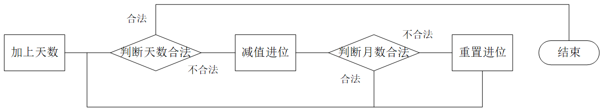
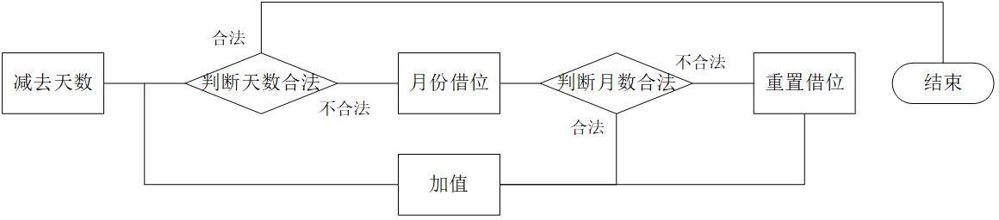

# 类和对象<上>

### 面向对象

直到七十年代面向过程编程在开发大型程序时表现出不足，计算机界提出了面向对象思想（Object Oriented Programming），**面向对象三大特性是封装、继承和多态**。

面向过程和面向对象只是计算机编程中两种侧重点不同的思想，面向过程算是一种最为实际的思考方式，其中重要的是模块化的思想，面向过程更注重过程或者说动作的步骤。

面向对象也是含有面向过程的，面向对象主要是把事物给对象化，把事物看作为对象和对象之间的关系，更符合人对事物的认知方式。

面向对象是一个广泛而深刻的思想，不可能一时半会就理解透彻，需要在学习和工作中慢慢体会。

> C++不是纯面向对象语言，它支持面向对象，又兼容C也支持面向过程。

&nbsp;

## 1. 类的定义

~~~cpp
struct Student 
{
	//成员变量
	char _name[20];
	int _age;
	int _id;
    
	//成员方法
	void Init(const char* name, int age, int id) 
    {
		strcpy(_name, name);
		_age = age;
		_id = id;
	}
    
	void Print() 
    {
		cout << _name << " " << _age << " " << _id << endl;
	}
};

int main()
{
    Student s1, s2;
    s1.Init("yyo", 19, 1);
    s1.Print();
    s2.Init("yyx", 18, 2);
    s2.Print();
}
~~~

C语言的结构体中只能定义变量，就相当于是个多个变量的集合，操作成员变量的方式也比较繁琐且容易出现错误。

C++ 中定义类有两个关键字分别是`struct`和`class`，结构体在C++中也升级成了类。

类名可以直接作类型使用，类中不仅可以定义变量，还可以定义函数。类中的变量和函数都叫类的成员。

&nbsp;

## 2. 类的封装

面向对象讲究“封装”二字，封装体现在两方面，一是将数据和方法都放到类中封装起来，二是给成员增加访问权限的限制。

### 2.1 访问限定修饰符

C++共有三个访问限定符，分别为**公有`public`，保护`protect`，私有`private`**。

- `public`修饰的成员可以在类外直接访问，`private`和`protect`修饰的成员在类外不能直接访问。
- `class`类中成员默认访问权限为`private`，`struct`类中默认为`public`。
- 从访问限定符出现的位置到下一个访问限定符出现的位置之间都是该访问限定符的作用域。

> 和 public 相比，private 和 protect 是类似的，它二者具体区别会在之后的继承中谈到。

封装的意义就在于**规范成员的访问权限，更好的管理类的成员**，一般是将成员的访问权限标清楚。

~~~cpp
class Student 
{
private:
	//成员变量
	char _name[20];
	int _age;
	int _id;
    
public:
	//成员方法
	void Init(const char* name, int age, int id) 
    {
		strcpy(_name, name);
		_age = age;
		_id = id;
	}
	void Print() 
    {
		cout << _name << " " << _age << " " << _id << endl;
	}
};
~~~

注意，访问限定修饰符只在编译阶段起作用，之后不会对变量和函数造成任何影响。

### 2.2 类的封装

面向对象三大特性是封装、继承和多态。

类和对象的学习阶段，只强调类和对象的封装机制。**将数据和操作数据的方法放到类中有机结合，对外隐藏对象的属性和实现细节，仅公开交互的接口**。

封装的本质是一种管理机制。对比C语言版的数据结构实现可以看到，将结构成员全部暴露出来是危险的且容易出错。

一般不允许轻易的在函数外操作和改变结构，这便是封装的好处。面向过程只有针对函数的封装，而面向对象编程提出了更加全面的封装机制，使得代码更加安全且易于操作。

~~~cpp
class Stack {
public:
	void Init();
	void Push(STDataType x);
	void Pop();
	STDataType Top();
	int Size();
	bool Empty();
	void Destroy();
private:
	STDataType* _a;
	int _top;
	int _capacity;
};
~~~

&nbsp;

## 3. 类的使用

### 3.1 类的作用域

类定义了一个新的作用域，类中所有成员都在类的作用域中。

1. 若直接在类内定义函数体，编译器默认将**类内定义的函数当作内联函数处理**，在满足内联函数的要求的情况下。
2. 在类外定义成员函数时，需要使用域作用限定符`::`指明该成员归属的类域。如图所示：

一般情况下，更多是采用像数据结构时期那样，声明和定义分离的方式。

### 3.2 类的实例化

用类创建对象的过程，就称为类的实例化。

1. 类只是一个“模型”，限定了类的性质，但并没有为其分配空间。 
2. 由类可以实例化得多个对象，对象在内存中占据实际的空间，用于存储类成员变量。

> 类和对象的关系，就与类型和变量的关系一样，可以理解为图纸和房子的关系。

&nbsp;

## 4. 类对象的存储

> 既然类中既有成员变量又有成员函数，那么一个类的对象中包含了什么？类对象如何存储？

~~~cpp
class Stack {
public:
	void Init();
	void Push(int x);
	// ...
private:
	int* _a;
	int _top;
	int _capacity;
};
Stack st;
cout << sizeof(Stack) << endl;
cout << sizeof(st) << endl;
~~~

如果类成员函数也存放在对象中，实例化多个对象时，各个对象的成员变量相互独立，但成员函数是相同的，相同的代码存储多份浪费空间。因此，**C++对象中仅存储类变量，成员函数存放在公共代码段**。

类的大小就是该类中成员变量之和，要求内存对齐，和结构体一样。注意，空类的大小为1个字节，用来标识这个对象的存在。

> 空类的大小若为0，相当于内存中没有为该类所创对象分配空间，等价于对象不存在，所以是不可能的。

&nbsp;

> 接下来都使用栈和日期类来理解类和对象中的知识。

## 5. this 指针

~~~cpp
class Date {
public:
	void Init(int year, int month, int day) {
		//year = year;//Err
		//1.
        _year = year;
        //2.
        Date::month = month;
        //3.
		this->day = day;
	}
private:
	int _year;
	int month;
	int day;
};
~~~

如果成员变量和形参重名的话，在`Init`函数中赋值就会优先使用形参导致成员变量没有被初始化，这种问题有三种解决方案：

1. 在成员变量名前加`_`，以区分成员和形参。
2. 使用域访问修饰符`::`，指定前面的变量是成员变量。
3. 使用 this 指针。

### 5.1 this 指针的定义

> `d1._year;`的意义是告诉编译器到`d1`这个对象中查找变量`_year`的地址。但函数并不存放在类对象中，那`d1.Print();`的意义是什么？

如图所示，`d1`,`d2`两个对象调用存储在公共代码区的`Print`函数，函数体中并没有区分不同对象，如何做到区分不同对象的调用呢？

C++中通过引入 this 指针解决该问题，C++编译器给每个非静态的成员函数增加了一个隐藏的参数叫 this 指针。this 指针指向当前调用对象，函数体中所有对成员变量的操作都通过该指针访问，但这些操作由编译器自动完成，不需要主动传递。

如图所示，在传参时隐藏地传入了对象的指针，形参列表中也对应隐藏增加了对象指针，函数体中的成员变量前也隐藏了 this 指针。

### 5.2 this 指针的特性

`this`是C++的一个关键字，代表当前对象的指针。this 指针是成员函数第一个隐含的指针形参，一般由寄存器传递不需要主动传参。

1. 调用成员函数时，不可以显式传入 this 指针，成员函数参数列表也不可显示声明 this 指针。
2. 但成员函数中可以显式使用 this 指针。
3. this 的类型为`classType* const`，加`const`是为了防止 this 指针被改变。

4. this 指针本质上是成员函数的形参，函数被调用时对象地址传入该指针，所以 this 指针是形参存储在函数栈帧中，对象中不存储this指针。

**Example** 1和2哪个会出现问题，出什么问题？

~~~cpp
class A {
public:
	void Printa() {
		cout <<  _a << endl;
	}
	void Show() {
		cout << "Show()" << endl;
	}
private:
	int _a;
};
int main()
{
	A* a = nullptr;
	//1.
	a->Show();
	//2.
	a->Printa();
	return 0;
}
~~~

- 函数没有存储在对象中，所以调用函数并不会访问空指针`a`，仅是空指针作参数传入成员函数而已。二者没有程序语法错误，所以编译一定通过。
- 调用`Show()`函数没有访问对象中的内容，不存在访问空指针的问题。调用`Print()`函数需到`a`指针所指对象中访问成员`_a`，所以访问空指针程序崩溃。

---

# 类和对象<中>

### 默认成员函数

一个对象都要要对其进行初始化，释放空间，拷贝复制等等操作，像栈结构不初始化直接压栈就会报错。由于这些操作经常使用或是必不可少，在设计之初就被放到类中作为默认生成的成员函数使用，解决了C语言的一些不足之处。

C++在设计类的默认成员函数的机制较为复杂，一个类有6个默认的成员函数，分别为构造函数、析构函数、拷贝构造函数、赋值运算符重载以及取地址操作符的重载。他们都是特殊的成员函数，这些特殊函数不能被当作常规函数调用。

默认的意思是我们不写编译器也会自动生成一份在类里，如果我们写了编译器就不生成了。自动生成默认函数有的时候功能不够全面，还是得自己写。

## 1. 构造函数

### 1.2 构造函数的定义

构造函数和析构函数分别是完成初始化和清理资源的工作。构造函数就相当于数据结构时期我们写的初始化`Init`函数。

构造函数是一个特殊的函数，名字与类名相同，创建类对象时被编译器自动调用用于初始化每个成员变量，并且在对象的生命周期中只调用一次。

### 2.2 构造函数的特性

构造函数虽然叫构造函数，但构造函数的工作并不是开辟空间创建对象，而初始化对象中的成员变量。

- 函数名和类名相同，且无返回类型。
- 对象实例化时由编译器自动调用其对应的构造函数。
- 构造函数支持函数重载。

~~~cpp
//调用无参的构造函数
Date d1;
Date d2(); //Err - 函数声明
//调用带参的构造函数
Date d2(2020,1,18);
~~~

注意，调用构造函数只能在对象实例化的时候，且调用无参的构造函数不能带括号，否则会当成函数声明。

- 若类中没有显式定义构造函数，程序默认创建的构造函数是无参无返回类型的。一旦显式定义了编译器则不会生成。

- 无参的构造函数、全缺省的构造函数和默认生成的构造函数都可以是默认构造函数（不传参也可以调用的构造函数），且防止冲突默认构造函数只能有一个。

#### 默认构造函数初始化规则

从上图可以看出，默认生成的构造函数对内置类型的成员变量不进行有效初始化。其实，编译器**默认生成的构造函数仅对自定义类型进行初始化**，初始化的方式是在创建该自定义类型的成员变量后调用它的构造函数。倘若该自定义类型的类也是默认生成的构造函数，那结果自然也没有被有效初始化。

- 默认生成的构造函数对内置类型的成员变量不作处理，对自定义类型成员会调用它们的构造函数来初始化自定义类型成员变量。

一个类中最好要一个默认构造函数，因为当该类对象被当作其他类的成员时，系统只会调用默认的构造函数。

> 目前还只是了解掌握基本的用法，对构造函数在之后还会再谈。

&nbsp;

## 2. 析构函数

析构函数同样是个特殊的函数，负责清理和销毁一些类中的资源。

### 2.1 析构函数的定义

与构造函数的功能相反，析构函数负责销毁和清理资源。但析构函数不是完成对象的销毁，对象是`main`函数栈帧中的局部变量，所以是随 main 函数栈帧创建和销毁的。析构函数会在对象销毁时自动调用，主要清理的是对象中创建的一些成员变量比如动态开辟的空间等。

### 2.2 析构函数的特性

- 析构函数的名字是`~`加类名，同样是无参无返回类型，故不支持重载。
- 一个类中有且仅有一个析构函数，同样若未显式定义，编译器自动生成默认的析构函数。
- 对象生命周期结束时，系统自动调用析构函数完成清理工作。
- 多个对象调用析构函数的顺序和创建对象的顺序是相反的，因为哪个对象先压栈哪个对象就后销毁。

调用对象后自动调用析构函数，这样的机制可以避免忘记释放空间以免内存泄漏的问题。不一定所有类都需要析构函数，但对于有些类如栈就很方便。

#### 默认析构函数清理规则

和默认生成的构造函数类似，默认生成的析构函数同样对内置类型的成员变量不作处理，只在对象销毁时**对自定义类型的成员会调用它们的析构函数**来清理该自定义类型的成员变量。

倘若该自定义类型成员同样只有系统默认生成的的析构函数，那么结果就相当于该自定义类型成员也没有被销毁。

> 不释放内置类型的成员也是有一定道理的，防止释放一些文件指针等等可能导致程序崩溃。

&nbsp;

## 3. 拷贝构造函数

除了初始化和销毁工作以外，最常见的就是将一个对象赋值、传参等就必须要拷贝对象。而类这种复杂类型直接赋值是不起作用的，拷贝对象的操作要由拷贝构造函数实现，每次复制对象都要调用拷贝构造函数。

### 3.1 拷贝构造函数的定义

> 根据需求我们也可以猜测出C++中的拷贝构造函数的设计。

拷贝构造函数也是特殊的成员函数，负责对象的拷贝赋值工作，这个操作只能发生在对象实例化的时候，**拷贝构造的本质就是用同类型的对象初始化新对象**，所以也算是一种不同形式的构造函数满足重载的要求，也可叫复制构造函数。

拷贝构造函数仅有一个参数，就是同类型的对象的引用，在用同类型的对象初始化新对象时由编译器自动调用。拷贝构造函数也是构造函数，所以拷贝也是构造的一个重载。

### 3.2 拷贝构造函数的特性

- 拷贝构造函数是构造函数的一个重载形式。
- 拷贝构造函数只有一个参数，且**必须是同类型的对象的引用**，否则会引发无穷递归。

因为传值调用就要复制一份对象的临时拷贝，而要想拷贝对象就必须要调用拷贝构造函数，而调用拷贝构造函数又要传值调用，这样就会在调用参数列表中“逻辑死循环”出不来了。

设计拷贝构造函数时就已经修改了系统默认生成的拷贝构造函数，所以在此过程不可以再发生拷贝操作。而传引用不会涉及到拷贝操作所以没问题。

> 另外，有趣的是设计者规定拷贝构造函数的参数必须是同类型的引用，如果设计成指针，系统就当作没有显式定义拷贝构造函数了。

- 一般拷贝构造另一个对象时，都不希望原对象发生改变，所以形参引用用`const`修饰。
- 只显式定义拷贝构造函数，系统不会生成默认的构造函数，只定义构造函数，系统会默认生成拷贝构造。

#### 默认拷贝构造拷贝规则

- 若未显式定义拷贝构造，和构造函数类似，默认生成的拷贝构造函数对成员的拷贝分两种：

1. 对于内置类型的成员变量，默认生成的拷贝构造是把该成员的存储内容按字节序的顺序逐字节拷贝至新对象中的。这样的拷贝被称为浅拷贝或称值拷贝。类似于`memcopy`函数。
2. 对于自定义类型的成员，默认生成的拷贝构造函数是调用该自定义类型成员的拷贝构造函数进行拷贝的。

> 默认生成的拷贝函数也不是万能的，比如栈这个结构。用`st1`初始化`st2`时，会导致二者的成员`_a`指向相同的一块空间。

&nbsp;

## 4. 运算符重载

运算符重载是C++的一大利器，使得对象也可以用加减乘除等各种运算符来进行相加相减比较大小等有意义的运算。默认情况下C++不支持自定义类型像内置类型变量一样使用运算符的，这里的规则需要开发者通过运算符重载函数来定义。

### 4.1 运算符重载的定义

运算符重载增强了代码的可读性也更方便，但为此我们必须要为类对象编写运算符重载函数以实现这样操作。运算符重载是具有特殊函数名的函数，也具有返回类型、函数名和参数列表。重载函数实现后由编译器自动识别和调用。

1. 函数名是关键字`operator`加需要重载的运算符符号，如`operator+`，`operator=`等。
2. 返回类型和参数都要根据运算符的规则和含义的实际情况来定。

~~~cpp
bool operator>(const Date& d1, const Date& d2) {
	if (d1._year > d2._year) {
		return true;
	}
	else if (d1._year == d2._year && d1._month > d2._month) {
		return true;
	}
	else if (d1._year == d2._year && d1._month == d2._month && d1._day > d2._day) {
		return true;
	}
	return false;
}
d1 > d2;
operator>(d1, d2);
~~~

> 两个日期类进行比较大小，传参采用对象的常引用形式，避免调用拷贝构造函数和改变实参，返回类型为布尔值，同样都是符合实际的。编译器把`operator>(d1,d2)`转换成`d1>d2`，大大提高了代码的可读性。
>

### 4.2 运算符重载的特性

- **只能重载已有的运算符**，不能通过连接其他符号来定义新的运算，如`operator@`。
- 重载操作符函数只能作用于自定义类型对象，且**最多有两个参数，自定义类型最好采用常引用传参**。
- 重载内置类型的操作符，建议不改变该操作符本身含义。
- 共有5个运算符不可被重载，分别是：`.*`，域访问操作符`::`，`sizeof`，三目运算符`?:`，结构成员访问符`.`。

运算符重载不像构造函数是固定在类中的特殊的成员函数，运算符重载适用于所有自定义类型对象，并不单独局限于某个类。但由于类中的成员变量是私有的，运算符重载想使其作用于某个类时，解决方法有三：

1. 修改成员变量的访问权限变成公有，但破坏了类的封装性，是最不可取的。使用友元函数，但性质与修改访问权限类似，同样不可取的。
1. 使用Getter Setter方法提供成员变量的接口，保留封装性但较为麻烦。
1. 将运算符重载函数放到类中变成成员函数，但需要注意修改一些细节。**作为类成员的重载函数，形参列表默认隐藏 this 指针，所以必须去掉一个引用参数**。

~~~cpp
class Date {
public:
	Date(int year = 0, int month = 1, int day = 1);
	bool operator>(const Date& d);
private:
	int _year;
	int _month;
	int _day;
};
//bool Date::operator>(Date* this, const Date& d) {...}
bool Date::operator>(const Date& d) {
	// ...
}
d1 > d2;
d1.operator>(d2); //成员函数只能这样调用
~~~

### 4.3 赋值运算符重载

赋值运算符重载实现的是两个自定义类型的对象的赋值，和拷贝构造函数不同拷贝构造是用一个已存在的对象去初始化一个对象，赋值运算符重载是两个已存在的对象进行赋值操作。和两个整形数据的赋值意义相同，所以定义时也是参考内置类型的赋值操作来的。

1. 参数列表 —— 两个对象进行赋值操作，由于放在类中作成员函数，参数列表仅显式定义一个对象的引用。
2. 返回类型 —— 赋值表达式的返回值也是操作数的值，返回对象的引用即可。

~~~cpp
// i = j = k = 1;
Date& Date::operator=(const Date& d) {
	if (this != &d) { //优化自己给自己赋值
		_year = d._year;
		_month = d._month;
		_day = d._day;
	}
	return *this;
}
~~~

不传参对象的引用或者不返回对象的引用都会调用拷贝构造函数，为使减少拷贝和避免修改原对象，最好使用常引用。

#### 默认赋值重载赋值规则

类中如果没有显式的定义赋值重载函数，编译器会在类中默认生成一个赋值重载函数的成员函数。默认赋值重载对于内置类型的成员采用浅拷贝的方式拷贝，对于自定义类型的成员会调用它内部的赋值重载函数进行赋值。

> 所以写不写赋值重载仍然要视情况而定。

~~~cpp
Date d5 = d1;
// 用已存在的对象初始化新对象，则是拷贝构造而非赋值重载
~~~

&nbsp;

> 掌握以上四种C++中默认的函数，就可以实现完整的日期类了。

## 5. 日期类的实现

### 5.1 日期类的定义

~~~cpp
class Date {
public:
	Date(int year = 0, int month = 1, int day = 1);
	Date(const Date& d);
	~Date();
    void Print();
	int GetMonthDay();

    bool operator>(const Date& d);
	bool operator<(const Date& d);
	bool operator>=(const Date& d);
	bool operator<=(const Date& d);
	bool operator==(const Date& d);
	bool operator!=(const Date& d);

	Date& operator=(const Date& d);

	Date& operator+=(int day);
	Date operator+(int day);
	Date& operator-=(int day);
	int operator-(const Date& d);
	Date operator-(int day);

	Date& operator++();
	Date operator++(int);
	Date& operator--();
	Date operator--(int);
private:
	int _year;
	int _month;
	int _day;
};
~~~

日期类很简单，一样的函数一样的变量再封装起来，把之前练习的代码放到一起。接下来就是函数接口的具体实现细节了。

### 5.2 日期类的接口实现

~~~cpp
//构造函数
Date(int year = 0, int month = 1, int day = 1);
//打印
void Print();
//拷贝构造
Date(const Date& d);
//析构函数
~Date();
//获取当月天数
int GetMonthDay();
// >运算符重载
bool operator>(const Date& d);
// >=运算符重载
bool operator>=(const Date& d);
// <运算符重载
bool operator<(const Date& d);
// <=运算符重载
bool operator<=(const Date& d);
// ==运算符重载
bool operator==(const Date& d);
// !=运算符重载
bool operator!=(const Date& d);
// =运算符重载
Date& operator=(const Date& d);
//日期+天数=日期
Date& operator+=(int day);
//日期+天数=日期
Date operator+(int day);
//日期-天数=日期
Date& operator-=(int day);
//日期-日期=天数  
int operator-(const Date& d);
//日期-天数=日期
Date operator-(int day);
//前置++
Date& operator++();
//后置++
Date operator++(int);
//前置--
Date& operator--();
//后置--
Date operator--(int);
~~~

从上述函数声明的列表也可以看出，构造函数、析构函数等都是相对简单的，实现类的重点同样也是难点是定义各种运算符的重载。

#### 日期类的构造函数

日期类的构造函数之前实现过，但仍需注意一些细节，比如过滤掉一些不合法的日期。要想实现这个功能就要定好每年每月的最大合法天数，可以将其存储在数组`MonthDayArray`，并封装在函数`GetMonthDay`中以便在判断的时候调用。

~~~cpp
//获取合法天数的最大值
int Date::GetMonthDay() {
	static int MonthDayArray[13] = { 0, 31 ,28, 31, 30, 31, 30, 31, 31, 30, 31, 30, 31 };
	int day = MonthDayArray[_month];
	//判断闰年
	if (_month == 2 && ((_year % 4 == 0 && _year % 100 != 0) || (_year % 400 == 0))) {
		day += 1;
	}
	return day;
}
//构造函数
Date::Date(int year, int month, int day) {
	_year = year;
	_month = month;
	_day = day;
	//判断日期是否合法
	if (month > 12 || day > GetMonthDay()) {
		cout << "请检查日期是否合法：";
		Print();
	}
}
~~~

数组`MonthDayArray`的定义也有讲究，定义13个数组元素，第一个元素就放0，这样让数组下标和月份对应起来，使用更加方便。确定每月的天数还要看年份是否是闰年，所以还要判断是否是闰年，因为闰年的二月都要多一天。这些封装在函数`GetMonthDay`中，调用时返回当月具体天数，放在构造函数中判断是否日期是否合法。

由于两个函数都是定义在类中的，默认将类对象的指针作函数参数，调用时更加方便。

> 析构函数、打印函数和拷贝构造函数都很简单和之前一样，这里就不写了。接下来就是实现的重点运算符重载。

#### 比较运算符的重载

~~~cpp
//运算符重载 >
bool Date::operator>(const Date& d) {
	if (_year > d._year) {
		return true;
	}
	else if (_year == d._year && _month > d._month) {
		return true;
	}
	else if (_year == d._year && _month == d._month && _day > d._day) {
		return true;
	}
	return false;
}
//运算符重载 >=
bool Date::operator>=(const Date & d) {
	return (*this > d) || (*this == d);
}
//运算符重载 <
bool Date::operator<(const Date& d) {
	return !(*this >= d);
}
//运算符重载 <=
bool Date::operator<=(const Date& d) {
	return !(*this > d);
}
//运算符重载 ==
bool Date::operator==(const Date& d) {
	return (_year == d._year) && (_month == d._month) && (_day == d._day);
}
//运算符重载 !=
bool Date::operator!=(const Date& d) {
	return !(*this == d);
}
~~~

比较运算符的重载不难实现，注意代码的逻辑即可。主要实现`>`和`==`的重载，其他的都调用这两个函数就行。这样的实现方法基本适用所有的类。

#### 加法运算符的重载

加法实现的意义在于实现日期+天数=日期的运算，可以先在稿纸上演算一下探寻一下规律。

可以看出加法的规律是，先将天数加到天数位上，然后判断天数是否合法。

1. 如果不合法则要减去当月的最大合法天数值，相当于进到下一月，即**先减值再进位**。
2. 若天数合法，则进位运算结束。
3. 在天数进位的同时，月数如果等于13则赋值为1，再年份加1，可将剩余天数同步到明年。

先减值再进位的原因是，减值所减的是当月的最大合法天数，若先进位的话，修改了月份则会减成下个月的天数。

~~~cpp
//运算符重载 +=
//日期 + 天数 = 日期 
Date& Date::operator+=(int day) {
	_day += day;
	//检查天数是否合法
	while (_day > GetMonthDay()) {
		_day -= GetMonthDay();//天数减合法最大值 --- 先减值，再进位
		_month++;//月份进位
		//检查月数是否合法
        if (_month == 13) { 
			_month = 1;
			_year += 1;//年份进位
		}
	}
	return *this;
}
~~~

这样的实现方法会改变对象的值，不如直接将其实现为`+=`，并返回对象的引用还可以避免调用拷贝构造。

实现`+`重载再去复用`+=`即可。

~~~cpp
//运算符重载 +
Date Date::operator+(int day) {//临时变量会销毁，不可传引用
	Date ret(*this);
	ret += day; // ret.operator+=(day);
	return ret;
}
~~~

创建临时变量并用`*this`初始化，再使用临时变量进行`+=`运算，返回临时变量即可。注意临时变量随栈帧销毁，不可返回它的引用。

#### 减法运算符的重载

~~~cpp
//运算符重载 -=
//日期 - 天数 = 日期
Date& Date::operator-=(int day) {
    //防止天数是负数
	if (_day < 0) {
		return *this += -day;
	}
	_day -= day;
	//检查天数是否合法
	while (_day <= 0) {
		_month--;//月份借位
		//检查月份是否合法
		if (_month == 0) {
			_month = 12;
			_year--;//年份借位
		}
		_day += GetMonthDay();//天数加上合法最大值 --- 先借位，再加值
	}
	return *this;
}
~~~

实现减法逻辑和加法类似，先将天数减到天数位上，再检查天数是否合法：

1. 如果天数不合法，向月份借位，再加上上月的最大合法天数，即**先借位再加值**。并检查月份是否合法，月份若为0则置为12年份再借位。
2. 如果天数合法，则停止借位。

先借位再加值是因为加值相当于去掉上个月的过的天数，所以应加上的是上月的天数。

值得注意的是，修正月数的操作必须放在加值的前面，因为当月数借位到0时，必须要修正才能正常加值。

~~~cpp
//运算符重载 -
//日期 - 天数 = 日期
Date Date::operator-(int day) {
	Date ret(*this);
	ret -= day;
	return ret;
}
//日期 - 日期 = 天数  
int Date::operator-(const Date& d) {
	int flag = 1;
	Date max = *this;
	Date min = d;
	if (max < min) {
		max = d;
		min = *this;
		flag = -1;
	}
	int gap = 0;
	while ((min + gap) != max) {
		gap++;
	}
	return gap * flag;
}
~~~

日期-日期=天数的计算可以稍微转化一下变成日期+天数=日期，让小的日期加上一个逐次增加的值所得结果和大的日期相等，那么这个值就是二者所差的天数。

> 加的时候，日期不合法是因为天数已经超出了当月的最大合法天数，既然超出了，就将多余的部分留下，把当月最大合法天数减去以增加月数。减的时候同理，日期不合法是因为天数已经低于了0，回到了上一个月，那就补全上一个月的最大合法数值用此去加上这个负数，这个负数就相当于此月没有过完的剩余的天数。

#### 自增自减的重载

C++为区分前置和后置，规定后置自增自减的重载函数参数要显式传一个`int`参数占位，可以和前置构成重载。

~~~cpp
//前置++
Date& Date::operator++() {
	return *this += 1;
}
//后置++
Date Date::operator++(int) {
	return (*this += 1) - 1;
}
//前置--
Date& Date::operator--() {
	return *this -= 1;
}
//后置--
Date Date::operator--(int) {
	return (*this -= 1) + 1;
}
// 实现方式2
Date ret = *this;
*this + 1;
return ret;
~~~

实现对象的前置后置的自增和自减，要满足前置先运算再使用和后置先使用再运算的特性。也用上面实现好的重载复用即可。或者也可以直接利用临时变量保存`*this`，改变`*this`之后返回临时变量即可。

~~~cpp
++d2;
d2.operator();
d1++;
d1.operator(0);
~~~

可以看出，对于类对象来说，前置`++`比后置`++`快不少，只调用了一次析构函数，而后置++ 调用了两次拷贝构造和三次析构。

&nbsp;

## 6. const 类

被`const`修饰的类即为 const 类，const 类调用成员函数时出错，因为参数`this`指针从`const Date*`到`Date*`涉及权限放大的问题。如图所示：

### 6.1 const 类的成员函数

想要避免这样的问题，就必须修改成员函数的形参`this`，但 this 指针不能被显式作参数自然不可被修改。为解决这样的问题，C++规定在函数声明后面加上 const ，就相当于给形参 this 指针添加 const 修饰。

~~~cpp
//运算符重载 !=
//声明
bool Date::operator!=(const Date& d) const;
//定义
bool Date::operator!=(const Date& d) const {
	return !(*this == d);
}
~~~

像上述代码这样，由 const 修饰的类成员函数称之为 const 成员函数，const 修饰类成员函数，实际修饰函数的隐含形参 this 指针，这样该函数就不可修改对象的成员变量。

### 6.2 取地址操作符重载

还有两个类的默认成员函数，取地址操作符重载和 const 取地址操作符重载，这两个默认成员函数一般不用定义，编译器默认生成的就够用了。

~~~cpp
Date* operator&() {
    return this;
    //return NULL; //不允许获取对象的地址
}
const Date* operator&() const {
    return this;
}
~~~

当不允许获取对象的地址时，就可以将取地址重载成空即可。1
