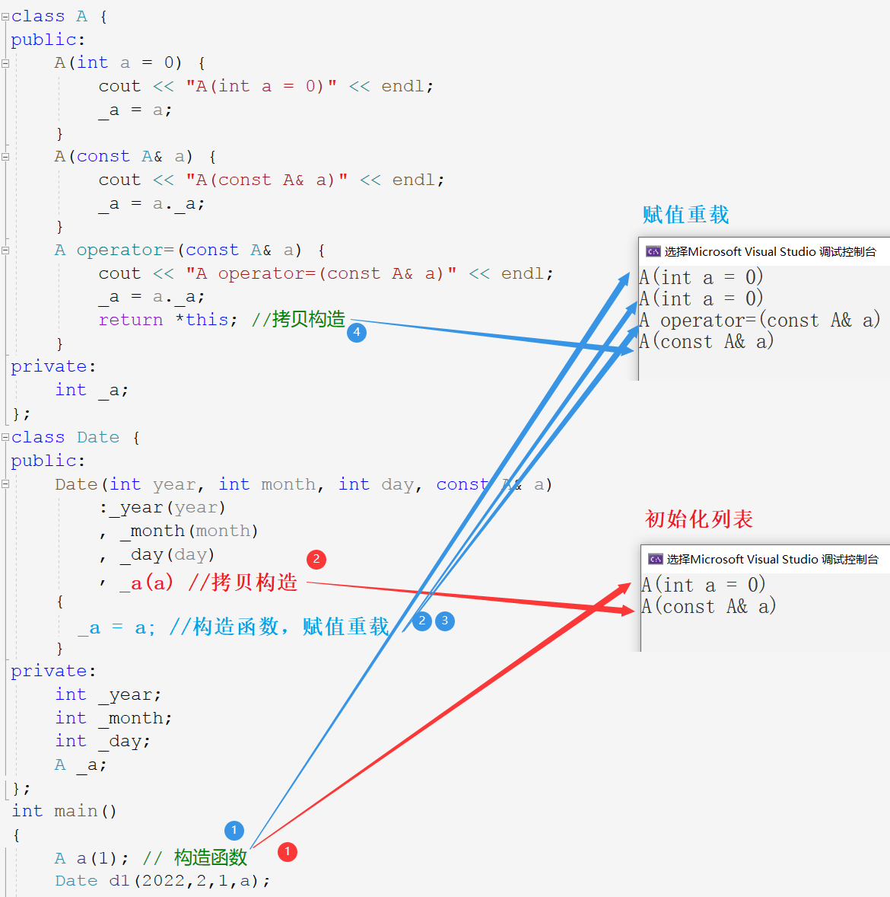
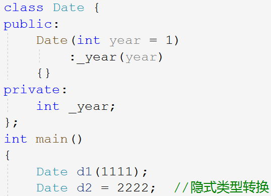
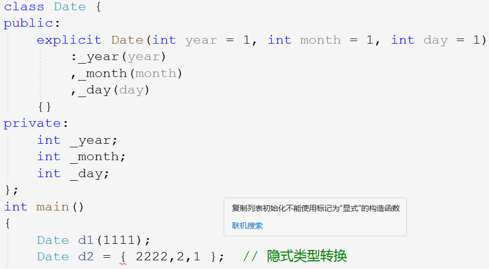
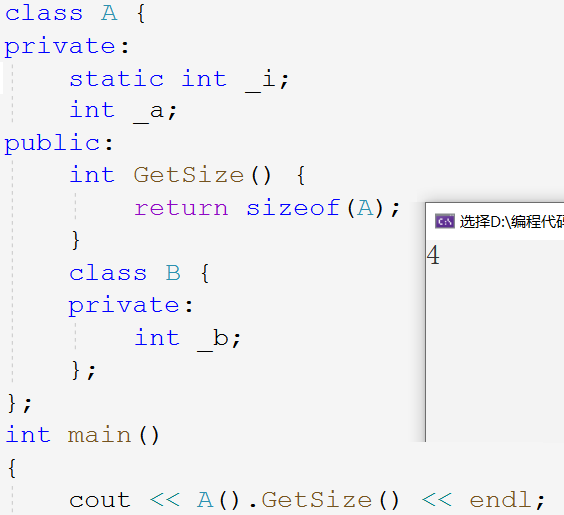

## 类和对象续

### 1. 构造函数续

~~~cpp
class Date {
public:
	Date(int year, int month, int day) {
		_year = year;
		_month = month;
		_day = day;
	}
private:
	int _year;
	int _month;
	int _day;
};
~~~

经过前面的学习，我们知道创建对象时，编译器通过调用构造函数来给成员变量赋值。通过调试可以发现，进入构造函数体内时，成员变量已经创建好并存储了随机值，且赋值可以多次但初始化只有一次，所以**构造函数体内的语句是赋值而不是初始化**。

#### 1.1 初始化列表

**类中只能声明成员变量，并不是定义变量**。但有些变量只能在定义时初始化，而不能赋值，比如常变量和引用等。这些就要用到下面的语法：初始化列表。

~~~cpp
class Date {
public:
	Date(int year = 1, int month = 1, int day = 1)
		: _year(year)
		, _month(month)
		, _day(day)
	{}
private:
	int _year; // 声明变量
	int _month;
	int _day;
};
~~~

- 语法结构是：在构造函数的参数列表后函数体前，以冒号起始，逗号间隔，用类似对象调用构造函数的方式。

- 成员变量的定义发生在对象实例化时，倘若想要在定义时就初始化成员变量，就必须要采用初始化列表的方式。C++设计**初始化列表就是为了在定义时初始化成员变量**。

##### 初始化列表的特性

1. 初始化列表只能用在构造函数中（拷贝构造也是构造函数的一种重载形式）。
2. 变量只能初始化一次，故每个成员变量只能在初始化列表出现一次。
3. 三种成员变量必须放在初始化列表进行初始化：
   - 引用成员变量
   - const 常变量成员
   - 无默认构造函数的自定义类型成员。

> 引用和常变量必须初始化，这是语法规定。而自变量类型无默认构造函数的话，就无法以无参的形式创建对象。

~~~cpp
class Date {
public:
	Date(int year = 1, int month = 1, int day = 1, int i = 1)
		: _ref(i)
		, _j(0)
        , _a(10);
	{
		_year = year;
		_month = month;
		_day = day;
	}
private:
	int _year;
	int _month;
	int _day;
	int& _ref;//引用必须初始化
	const int _j;//const修饰的变量必须初始化
	A _a; // 自定义类型必须要有默认构造函数
};
~~~

> 语法设计的很好，初始化列表中的`_a(10)`，就可以理解为调用 _a 的构造函数。

4. 尽量使用初始化列表初始化成员变量，自定义类型成员会先使用初始化列表初始化。

> 可见初始化列表的效率比赋值重载要高很多，成员变量得先定义出来才能进行赋值，赋值重载要先调用构造函数再调用赋值重载，且赋值重载中又因返回值要调用拷贝构造。

步骤要比用初始化列表多，初始化列表仅调用拷贝构造即可，所以自定义类型最好用初始化列表初始化。

5. 成员变量在**类中的声明次序就是其在初始化列表中的初始化顺序**，初始化顺序与初始化列表顺序无关。

~~~cpp
class A {
public:
	A()
		:_a1(1)
		, _a2(_a1)
	{}
	void Print() {
		cout << _a1 << " " << _a2 << endl;
	}
private:
	int _a2;
	int _a1;
};
int main()
{
	A().Print(); // 1 2078469811
	return 0;
}
~~~

> 类中声明成员变量的次序是先 _a2_ 后 _a1_，所以初始化时也是这个顺序，就导致 _a2_ 被初始化为随机值。实际开发中，最好按照相同的顺序初始化。

#### 1.2 关键字 explicit

C++中支持上述两种实例化对象的方式，第二种相当于用整型变量初始化类对象。

~~~cpp
int i = 1.11; //产生临时变量
Date d = 2022;
~~~

> 浮点数赋值整型，类型不同会产生临时变量，该临时变量具有常性，将临时变量赋值给整型变量。

其中发生的隐式类型转换和将浮点数赋值给整型变量类似。实际上产生了一个类类型的临时变量`tmp(2022)`，再用该临时变量初始化`d`。

~~~cpp
Date d =2022;
--------------
Date d; //创建对象
Date tmp(2022); // 用值初始化临时变量
d = tmp; //将临时变量赋值给对象d
~~~

这一过程和调用构造函数初始化没区别，因为编译器会自主优化。如果不想发生这样的隐式类型转换，可以用`explicit`修饰构造函数：

&nbsp;

### 2. 静态成员

#### 2.1 静态成员的定义

用 _static_ 修饰的成员变量叫静态成员变量，用 _static_ 修饰的成员函数叫静态成员函数。静态变量存储在静态区，其生命周期被扩大到整个程序的开始到结束。

~~~cpp
//计算创建了多少个类对象
class A {
public:
	A(int a = 0) {
		_sCount++;
	}
	A(const A& a) {
		_sCount++;
	}
	static int GetCount() { 
		return _sCount;
	}
private:
	static int _sCount; //声明
};
int A::_sCount = 0; //定义
int main()
{
	A a1;
	//...
	cout << A::GetCount() << endl;
	return 0;
}
~~~

#### 2.2 静态成员的特性

- 静态成员变量必须在类外定义，定义时不能用 _static_ 修饰。
- 静态成员变量为所有类对象共享，不属于某个对象。静态成员存储在静态区，故计算类的大小时不算静态成员。
- 静态成员可用类名加域作用符`::`访问，也可以使用对象名加访问符`.`访问。
- 静态成员函数没有隐含的 _this_ 指针，不能访问任何非静态成员。
- 非静态成员函数可以调用静态成员函数，但静态成员函数只能调用静态成员函数不能调用非静态成员函数。

##### [Example JZ64 求1+2+3+...+n](https://www.nowcoder.com/practice/7a0da8fc483247ff8800059e12d7caf1)

~~~cpp
class Sum {
public:
    Sum() {
        _i++;
        _ret += _i;
    }
    static int GetRet() {
        return _ret;
    }
private:
    static int _ret; //静态变量属于所有对象
    static int _i;
};
int Sum::_ret; //定义变量
int Sum::_i;
class Solution {
public:
    int Sum_Solution(int n) {
        Sum sum[n]; //创建n个对象的数组
        return Sum::GetRet(); //访问成员变量Ret
    }
};
~~~

&nbsp;

### 3. 成员初始化新方法

最初 C++ 设计构造函数时，默认不初始化内置类型的成员，但开发者对此颇有微词。故 C++11 以打补丁的方式，新增了一种初始化成员变量的方式。

C++11 支持非静态成员在声明时进行初始化赋值，但值得注意的是，这里不是初始化，而是**给声明的成员变量予以缺省值**。

~~~cpp
class B {
public:
	B(int b1 = 0, int b2 = 0)
		:_b1(b1)
		, _b2(b2)
	{}
private:
	int _b1;
	int _b2;
};
class A {
private:
	int _a = 1; // 声明变量缺省值
	B _b = { 20,10 };
    int _arr[] = { 1,2 };
	int* _p = (int*)malloc(4);
};
~~~

如果采用初始化列表初始化，那就不会使用缺省值。声明缺省值相当于在定义的时候初始化，也就相当于在初始化列表中初始化。

静态变量不可以声明缺省值，因为静态变量不在类中定义，不走构造函数。

&nbsp;

### 4. 友元

友元是一种突破封装的机制，有时提供了便利，但会增加耦合度，破坏封装，所以友元不宜多用。友元分为：友元函数和友元类。

#### 4.1 友元函数的定义

> 当我们实现时期类的流插入提取的重载时，发现将其实现在类中会导致不能将输入输出流对象放到第一个参数的位置。只能将其实现在类外并作为日期类的友元函数。

友元函数是定义在类外的普通的全局函数，但作为类的友元就可以和类的成员函数一样，访问类的私有成员。声明的方式是在类体中声明函数并用 friend 修饰。

~~~cpp
class Date {
public:
	// ...
    //流插入<<
	friend ostream& operator<<(ostream& out, const Date& d);
	// 流提取>>
	friend istream& operator>>(istream& in, Date& d);
private:
	int _year;
	int _month;
	int _day;
};
ostream& operator<<(ostream& out, const Date& d) {
	out << d._year << "-" << d._month << "-" << d._day << endl;
	return out;
}
istream& operator>>(istream& in, Date& d) {
	in >> d._year >> d._month >> d._day;
	return in;
}
~~~

####  4.2 友元函数的特性

- 友元函数可以访问类的私有和保护成员，但其本身不是类的成员函数。
- 友元函数不是成员函数，所以不能用 _const_ 修饰。
- 友元函数可以声明在类的任意地方，不受访问限定符的限制。
- 一个函数可以是多个类的友元，调用方式和普通函数一致。

#### 4.3 友元类

友元类的所有成员函数都是另一个类的友元函数，都可以访问另一个类的成员变量。比如下方例子：日期类是时间类的友元类，故日期类中所有函数都可以访问时间类的成员变量。

~~~cpp
class Time {
public:
	friend class Date; //声明日期类是时间类的友元类
	Time(int hour = 0, int minute = 0, int second = 0)
		: _hour(hour)
		, _minute(minute)
		, _second(second)
	{}
private:
	int _hour;
	int _minute;
	int _second;
};
class Date {
public:
	Date(int year = 1,int month = 1,int day = 1)
		:_year(year)
		,_month(month)
		,_day(day)
	{
		_t._hour = _t._minute = _t._second = 0;
	}
private:
	int _year;
	int _month;
	int _day;
	Time _t;
};
~~~

> 友元类只能声明在另一个类中，相当于另一个类拿着小本本记下友元类是自己的好朋友，这样“好朋友”就可以随便访问自己的成员啦。友元类和“被友元类”的关系容易搞混，记住上面的比喻就可以了。

- **友元关系是单项的**，友元类可以访问另一个类，但另一个类不可以访问友元类。
- 友元关系不具有传递性，即 A 是 B 的友元，B 是 C 的友元，但 A 不是 C 的友元。

&nbsp;

### 5. 内部类

> C++ 开发时并不喜欢使用内部类。当然视情况和个人喜好而定。

#### 5.1 内部类的定义

将一个类定义在另一个类的内部，这个定义在内部的类就叫内部类。

- 内部类只是**作用域被限定在外部的类中**，并不代表内部类属于外部的类，故不能通过外部类的对象去调用内部类。
- **内部类是外部类的友元类**，故内部类可以访问外部类的成员变量，但外部类不是内部类的友元。

内部类只有两点，一是类域被限制在外部类中，二是内部类是外部类的友元类。

》可以想象成外部类把内部类放在心里，所以内部类随意访问外部类。

#### 5.2 内部类的特性

1. 内部类可以定义在外部类的任意地方，不受访问限定符的限制。
2. 内部类可以直接访问外部类的静态和枚举成员，不需要通过外部类访问。
3. 计算外部类的大小和内部类无任何关系，因为内部类并不属于外部类。

> 静态变量不属于任何对象，内部类也不属于外部的类，故 A 类的大小为4。

