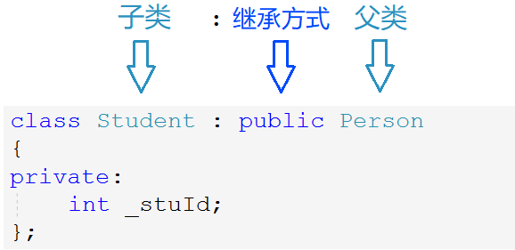
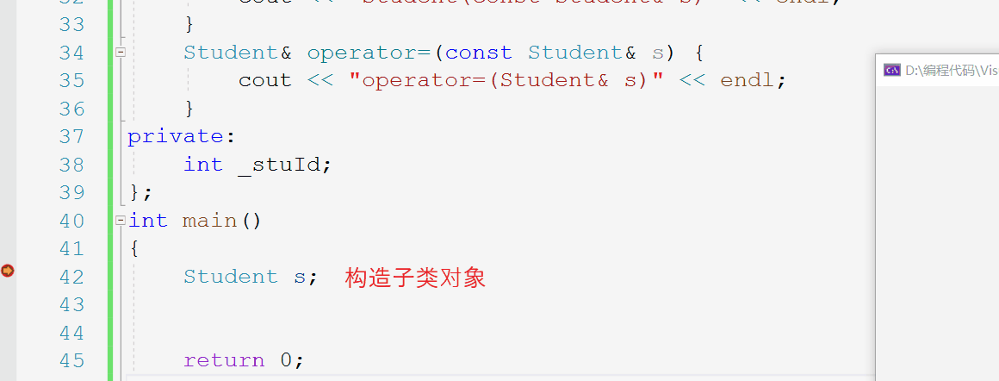
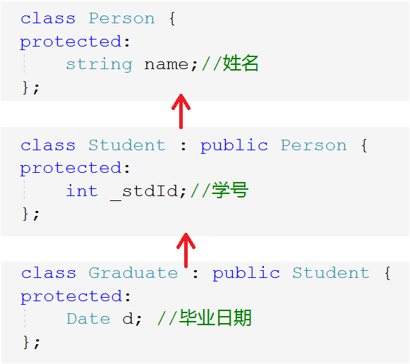
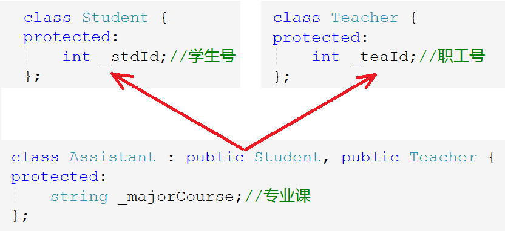
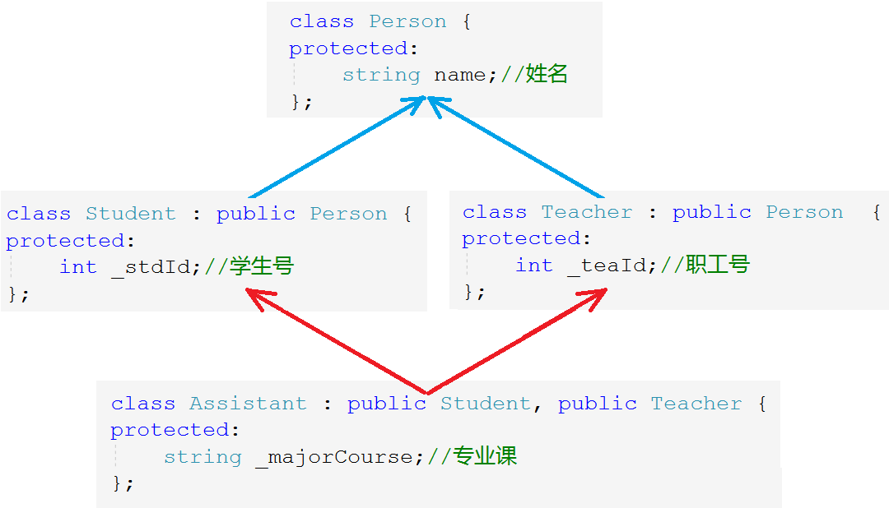
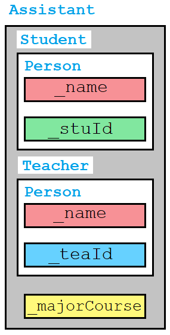
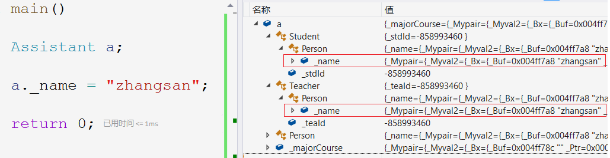
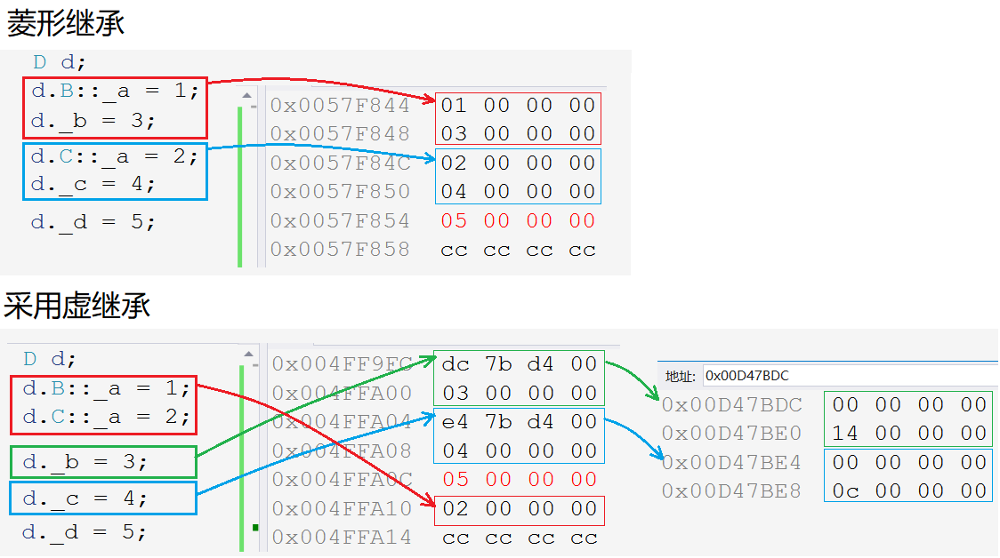
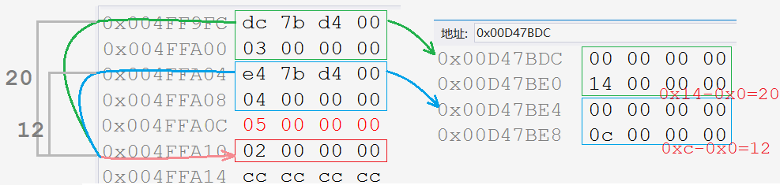

## 继承

> 面向对象的三大特性：封装、继承、多态。继承在实际中用的也不是太多，但必须能熟练使用。

### 1. 继承的概念

继承机制是面向对象思想中复用代码的一种手段，它能够**在原有类的特性的基础上进行扩展**。由此产生新的类，称为派生类，原有类称作基类。继承体现了面向对象设计的层次结构，体现了由简单到复杂的认知过程，不同于面向过程只有函数复用，**继承是类在设计层面上的复用**。

#### 1.1 继承的定义

对于具有一定联系的一类群体，将其抽象成一类对象后，这些对象必然会具有重复的属性。

比如学校中有学生老师两种群体，他们都是属于人这个大类，他们都有名字、年龄、住址等等共有的属性，但不同的是学生有学号，教师有职工号等不同的属性。

因此就可以将教师和学生所共有的属性，全部放到人这个类中，只将二者独有的属性放入各自的类中，可以避免代码冗余的问题，也更能体现出类的层次设计。

~~~cpp
class Son : public Father; //中间用:间隔
~~~

原有的类被称为基类或父类，继承父类的类叫做派生类或称子类。**继承后父类的成员变量和成员函数都变成了子类的一部分，使得子类可以使用父类的成员**，这便是继承的意义。

#### 1.2 继承关系和访问限定

由上图可以看出，子类和父类中间用`:`间隔，并声明继承关系，继承关系和访问限定符一样有三种：`public`，`protected`，`private`。

因为成员变量的访问权限有三种，而类的继承关系也有三种，故组合起来会有九种情况，因此会影响到子类中的成员变量的访问权限，具体如表所示：

| 父类成员\继承方式   | public 继承         | protect 继承      | private 继承      |
| ------------------- | ------------------- | ----------------- | ----------------- |
| 父类 public 成员    | 子类 public 成员    | 子类 protect 成员 | 子类 private 成员 |
| 父类 protected 成员 | 子类 protected 成员 | 子类 protect 成员 | 子类 private 成员 |
| 父类 private 成员   | 子类不可见成员      | 子类不可见成员    | 子类不可见成员    |

- 父类该成员的**访问权限和继承方式中二者最低的权限**，就是子类中该成员的访问权限。（类比访问权限，防止权限放大）
- 任何继承方式下，私有成员在子类中都属于**存在但不可访问**的成员。若想在子类中访问，则需修改变量在父类中的访问权限为保护。
- 若不显式地指定继承方式，`class`类默认的继承方式为私有继承，`struct`类默认为公有继承，不提倡这种方式。

> 实际中很少使用除公有继承以外的继承，也不提倡使用其他继承方式，可维护性不强。
>
> 继承关系和父类的成员的访问权限只会决定子类从父类继承得的成员的访问权限。不会影响到其他成员，不要混淆。

&nbsp;

### 2. 父子对象赋值转换

语法规定，**公有继承下**，子类对象可以赋值给父类的对象，但明显子类的成员要比父类的成员多，故在赋值时会发生变化，这个变化被形象的称为“切割”或“切片”。

- **子类对象可以赋值给父类对象、父类对象的指针或引用**。子类赋值给父类，是把子类中从父类继承下来的成员变量赋值给父类，或是父类指针指向该部分，或者父类引用该部分。

子类赋值父类的转换，不是被动发生的隐式类型转换，而是编译器语法所支持的行为。

> 指针的类型决定指针解引用访问的大小，而父类指针解引用就只能访问子类里继承下来的成员。子父类之间的赋值转换，都是把子类中继承下的成员“切割”出来，这个过程就叫做“切片”。

- **父类对象不可以赋值给子类对象。**父类赋值给子类，会造成越界访问非法空间。所以编译器不允许这种行为。

~~~cpp
Student s;
Person p;
//子类赋值给父类，发生赋值兼容
p = s;
Person& rp = s;
Person* pp = &s;
//父类赋值给子类
s = p;//Err
s = (Student)p; //Err
Student* ps = (Student*)&p; //可以但是会越界访问
Student& rs = (Student&)p;
ps->_stuId  = 1;//Err
~~~

子类赋值父类的赋值转换，只能发生在公有继承的情况下，因为其他继承方式会影响到成员变量的访问权限，可能会造成权限放大。

&nbsp;

### 3. 继承的作用域

定义出一个类就划分出一个作用域，故父子类都有独立的作用域，子类继承父类后可能就会发生重名现象。**当父子类出现同名成员时，会发生隐藏现象，即子类成员会屏蔽从父类继承来的同名成员**，这种情况叫隐藏或重定义。

- 成员函数和成员变量一样只需名称相同即可构成隐藏。隐藏后，可以通过类名`::`的方式访问继承来的同名成员。
- 实际上在使用继承时，不要定义重名变量。

#### 3.1 成员变量隐藏

~~~cpp
class Person {
protected:
	string _name = "人名";
	int _num = 111; //身份证号
};
class Student : public Person {
public:
	void Print() {
		cout << "人名->" << _name  << endl;
		cout << "身份证号->" << Person::_num << endl; //访问父类同名成员，必须加域名限定
		cout << "学号->" << _num << endl;
	}
protected:
	int _num = 999; //学号
};
~~~

#### 3.2 成员函数隐藏

~~~cpp
class A {
public:
	void Func() {
		cout << "A::Func()" << endl;
	}
};
class B : public A {
public:
	void Func(int i) {
		A::Func(); //必须加上类名限定
		cout << "Func(int i)->" << i << endl;
	}
};
b.A::Func(); //必须加上类名限定
b.Func(1);
~~~

- 父类和子类的同名成员函数构成隐藏，但不会构成函数重载，因为从定义上说继承得的函数仍然属于父类作用域。
- 调用子类中和父类重名函数时，必须显式加上类名限定。

虽说继承来的成员是子类的一部分，但编译器优先查找子类，找到后便不会再查找，故使用父类成员时要加上类域和访问限定符。

继承得的函数可通过子类直接调用，但并**不代表它就是子类的函数，因此不会构成重载**，因为该函数并没有在子类中。继承只是一种关系链，告诉编译器两个类具有特殊的继承关系。

#### 总结

- 成员变量构成隐藏时，直接调用其会导**致访问不明确，所以编译不通过**。
- 成员函数构成隐藏时，**默认访问子类中的成员函数**，若想访问父类中的必须加父类域名限定。

&nbsp;

### 4. 子类的默认成员函数

> 一般类里有6个默认成员函数，也就是不主动编写，编译器会默认生成的构造函数、析构函数、拷贝构造、赋值重载以及取地址重载。在子类中，默认的成员函数会有哪些变化呢？

- 构造子类对象时，子类构造函数先会调用父类的构造函数初始化父类那部分成员，再对子类成员初始化。
  - 如果父类没有默认的构造函数，则必须在子类构造函数**初始化列表中显式调用。**

- 拷贝构造子类对象时，拷贝构造同样需要调用父类的拷贝构造初始化父类那部分成员，再拷贝构造子类成员。
  - 显式调用父类拷贝构造时，**直接传子类对象过去，自动切片**即可。

- 使用子类对象赋值时，赋值重载同样要显式调用父类的赋值重载，再对子类成员赋值。
  - 显式调用父类赋值重载时，**需指定父类域**，也直接传子类对象，自动切片。

~~~cpp
class Student : public Person {
public:
    Student(const char* name = "Peter", int stuId = 1)
        : Person(name);   //显式调用父类构造函数
        , _stuId(stuId);
    {}
    Student(const Student& s) 
        : Person(s) //显式调用父类拷贝构造
        , _stuId(s._stuId)
	{}
    Student& operator=(Student s) {
        cout << "operator=(Student s)" << endl;
        if (this != &s) {
            Person::operator=(s); //显式调用父类赋值重载
            _stuId = s._stuId;
        }
        return *this;
    }
~~~

- 子类的析构函数会在析构完子类后，自动调用父类的析构函数，故**不允许在子类析构中显式调用父类的析构函数**。

~~~cpp
~Student() {
    //Person::~Person();//Err - 不允许主动调用父类析构
    cout << "~Student()" << endl;
}
~~~

子类对象初始化时，会先调用父类的构造函数，再调用子类的构造函数。析构反之，会先析构子类再析构父类，以满足栈的后进先出的特性。

> 析构函数的名称会被统一处理成`destructor`，故父子类的析构会构成隐藏。所以子类调用父类的析构同样要加类域限定，但子类析构不允许主动调用父类析构，因为析构要满足栈帧后进先出的特性，故无法主动调用，只能由编译器自动调用。

#### 总结

只有析构需要特殊注意不可主动调用，其他**默认成员函数都可以显式调用对应的父类的默认成员函数**即可，传参时直接传子类对象利用自动切片完成效果。

&nbsp;

### 5. 继承和友元

**友元关系无法继承**，也就是说父类中的友元，无法访问子类的成员。

~~~cpp
class Person {
	friend void Display(const Person& p, const Student& s);
protected:
	string _name;
};
class Student : public Person {
private:
	int _stuId;
};
void Display(const Person& p, const Student& s) {
	cout << "Person::_name" << p._name << endl;
	cout << "Student::_stuId" << s._stuId << endl; //无法访问子类成员
}
~~~

&nbsp;

### 6. 继承和静态成员

继承同样会把父类中的静态成员继承下来，且操作的是同一个变量。也就是说，不会因为是静态成员就不继承，也不会影响其静态的特性。

~~~cpp
class A {
public:
	A() {
		_si += 1;
	}
protected:
	static int _si;
};
int A::_si = 0;
class B : public A {
public:
	B() {
		_si += 1;
	}
};
class C : public A {
public:
	C() {
		_si += 1;
	}
};
cout << _si << endl; //5
~~~

&nbsp;

### 7. 菱形继承和虚拟继承

#### 7.1 单继承和多继承

单继承：一个子类只有一个直接父类，这样的继承关系为单继承。

多继承：一个子类有两个及以上的直接父类，这样的继承关系为多继承。

#### 7.2 菱形继承

菱形继承是当继承关系呈现出一种菱形的状态，是多继承的一种特殊情况。

菱形继承会产生的问题是：数据冗余和二义性。

1. 从两个父类中都继承了相同的成员 _name，造成了数据冗余。
2. 二义性是指，直接访问父类继承的成员时不确定是哪个父类，比如 _name 不确定是 Student 类还是 Teacher 类中的。

> 数据冗余和二义性都指的是最顶层的“爷类”中的成员，直接父类中的成员并不会产生问题。

#### 7.3 菱形虚拟继承

实际开发中一般不会使用到多继承，一定要避免的是菱形继承。对于其二义性的问题，只需要再访问变量时加上父类域限定即可。而对于数据冗余的问题，C++花了很大力气解决，解决方法就是虚拟继承。

~~~cpp
class Assistant : public Student, public Teacher {
protected:
	string _majorCourse;//专业课
};
Assistant a;
a._name = "zhangsan"; //Err - _name的访问不明确	
a.Student::_name = "张同学";
a.Teacher::_name = "张老师";
~~~

当然，我们可以通过上述代码的方式指定 _name 的值，此举解决了二义性的问题。但事实上 Assistant 类中应该只有一个 _name，此时应使用虚拟继承。

数据冗余和二义性的根源在于中间的两个父类都继承了它们的父类，他们的父类就叫做虚基类。因此**在这两个父类的位置使用虚继承**。

~~~cpp
class Student : virtual public Person {
public:
	int _stdId;//学生号
};
class Teacher : virtual public Person  {
public:
	int _teaId;//职工号
};
~~~

通过内存窗口可探究虚拟继承和未采用虚拟继承的区别：

- 普通菱形继承：先存入从父类`B`中继承的成员，再存入父类`C`中继承的成员，最后是子类`D`单独的成员。可见，数据`_a`确实存有两份。
- 采用虚拟继承后，父类`B`和父类`C`中继承来的“冗余”成员`_a`被单独放在最后位置，父类`B`和`C`中独有的成员仍然按照继承顺序存在对象的前面。不同的是继承的成员上方分别还存有对应的内存指针。
  - 检查两个指针所指向的位置，发现存的值都是`0`，但其下分别还有一个4字节的空间，存有一定大小的值。而两**个值相减就是当前指针位置距公共成员`_a`的偏移量**。以此来定位继承得来的公共成员`_a`。

菱形继承关系中最上层的类叫做虚基类，而内存位置中映射相对距离的表叫做虚基表。表中的相对距离是使用虚继承的那两个父类所划分的内存空间距离公共成员的距离。

> C++作为“第一个吃螃蟹的人”，支持面向对象的早期语言，走了一些弯路，踩了一些坑，语法设计比较复杂。
>
> 多种的继承方式和多继承就是典型的例子。有了多继承就会有菱形继承，所以说多继承是C++的缺陷之一，之后的面向对象语言如Java直接抛弃了多继承。除此之外，C++还有一个缺陷是没有垃圾回收机制。

### 8. 继承和组合

- 继承是面向对象的特征之一，是一种语法机制。形象化解释类继承的关系，就是每个派生类对象都是一个基类对象（**is-a**），比如学生是一种人，宝马是一款车等。
- 组合的定义是在新类里面创建原有类的对象，重复利用已有类的功能。在B类中创建了A类对象，就称B组合了A，比如头上有眼睛，车上有轮胎（**has-a**）。

~~~cpp
//继承
class B : public A {
    ;
};
//组合
class B {
    A _a;
};
~~~

继承和组合都是一种复用的方式，完全符合“是一个”的关系，就用继承，完全符合“有一个”的关系，就用组合，当两种都有时，优先选用组合的方式。

> 不要轻易的使用继承，不能单纯为了复用代码而继承。过多的使用继承会破坏代码的可维护性和封装性，修改父类时，会影响到继承它的子类，从而增加程序的维护难度和成本。

#### 具体解释

使用继承复用时，父类的内部细节对子类是可见的，故称继承为一种白盒复用。而对象组合要求被组合的对象具有健全的接口，因为对象的内部细节是不可见的，这种复用风格被称为黑箱复用。

- 子类通过继承揭示了父类的实现细节，所以继承在一定程度上破坏了封装性 。子类的实现与父类有着紧密的依赖关系，以至于修改一方的实现可能会导致另一方发生变化，这种较强的依赖关系限制了灵活性。
- 对象组合是通过创建其他对象进行复用的。组合因为对象只能通过接口访问，所以并不破坏封装性，更进一步，因为对象的实现是基于接口写的，所以实现上存在较弱的依赖关系。

对象类之间依赖关系要弱，对象组合比继承更满足高内聚、低耦合的设计要求。故优先采用组合而不是继承。
