## 函数

#### 0.0 函数的定义

函数在程序中又被叫做子程序，他作为一个大型程序的部分代码，有一或多个语句项组成。函数负责完成某项**特定任务**，提供了对过程的**封装**和对细节的隐藏，这样的代码通常会被集成为软件库。

特点：

1. 具备相对的独立性
2. 一般有输入值和返回值
3. 功能单一且灵活

> 函数的分类有：库函数和自定义函数。

### 1 库函数

#### 1.1 库函数的定义

库函数，顾名思义，放在库里供他人使用的函数。如打印输出这样的基础功能，他不是业务性的代码，在开发过程中使用率高且可移植性强，故C语言的基础库里提供了这样的一系列基础功能的代码。

一般库函数有：

> - IO函数（input&output）—— printf	scanf	getchar	putchar …   
> - 字符串操作函数 —— strlen	strcmp	strcat	strcpy …
> - 字符操作函数 —— tolower	toupper …
> - 内存操作函数 —— memcpy	menset	memmove	memcmp …
> - 时间/日期操作函数 —— time …
> - 数学函数 —— sqrt	abs	fabs	pow …
> - 其他库函数

#### 1.2 介绍

为了掌握库函数的使用方法，我们可以参照权威网站 [cplusplus](www.cplusplus.com) 的解析为样本，一般在不同的平台上也是大同小异。一般都是按照这样的顺序对函数进行解析。

> 1. 函数的基本信息
> 2. 功能描述
> 3. 函数参数
> 4. 返回值
> 5. 例子
> 6. 拓展

##### Example 1 strcpy

~~~C
char* strcpy (char* destination, const char* source);
~~~

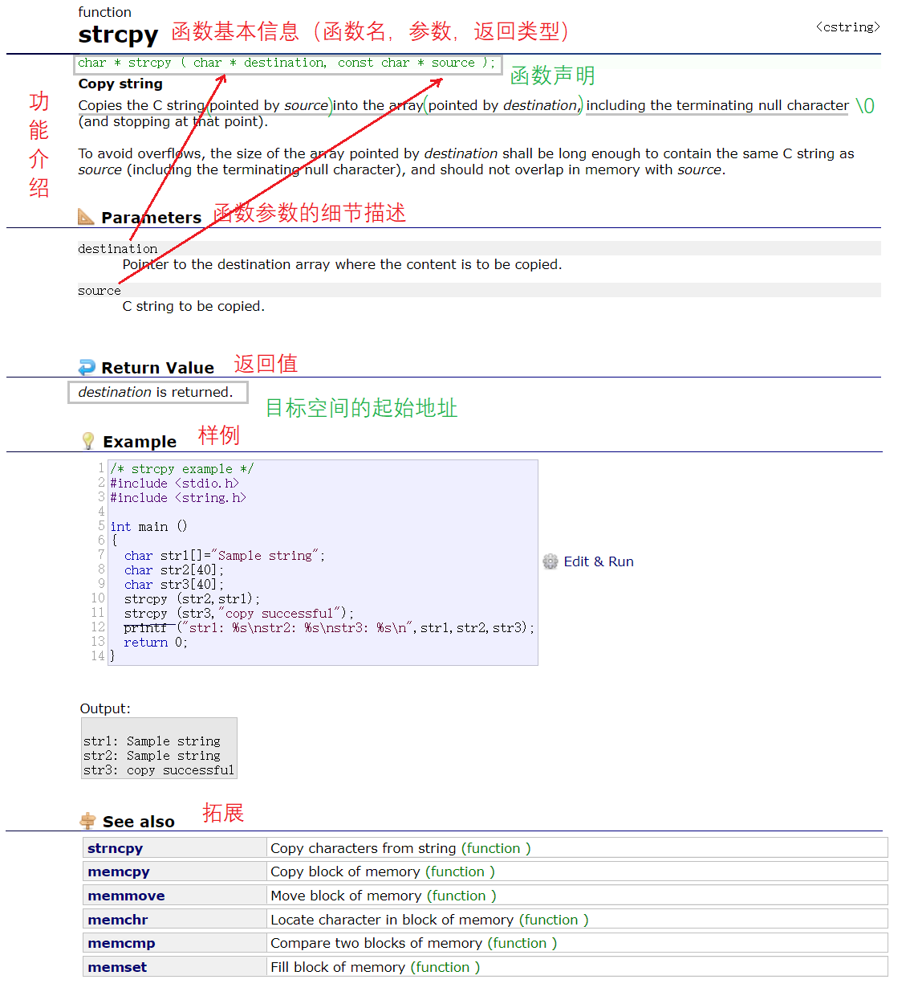

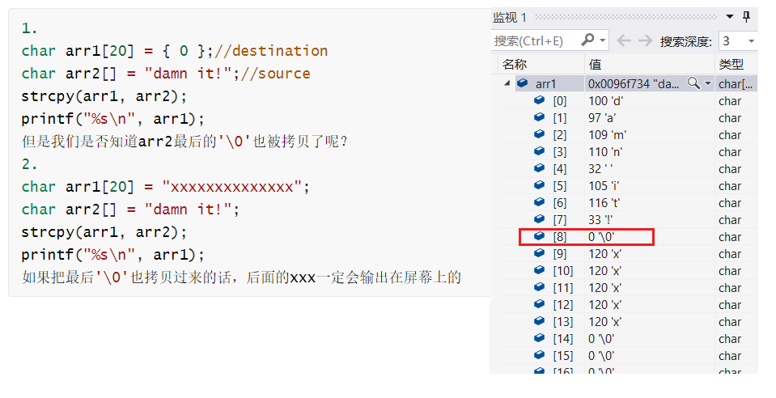

~~~C
//当然这里 strcpy 函数的返回值是目标空间的首地址，故接收时也可以使用函数的返回值。
char arr1[20] = { 0 };
char arr2[] = "damn it!";
//1.    
char* ret = strcpy(arr1, arr2);
printf("%s\n", ret);
//2.
printf("%s\n",strcpy(arr1, arr2));
~~~

##### Example 2 memset

~~~C
void* (void* ptr, int value, size_t num);
~~~

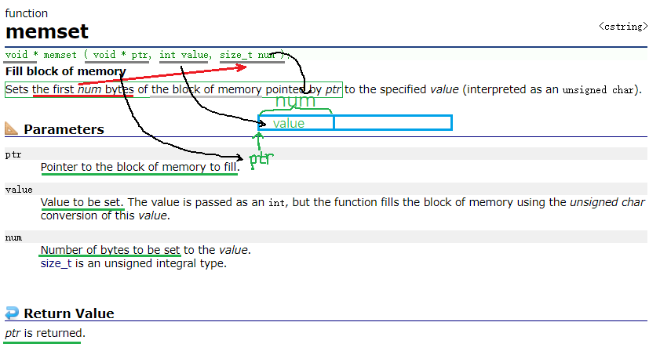

~~~C
char arr[20] = "damn it!";
memset(arr, 'x', 2);
//1.
printf("%s\n", arr);
//2.
printf("%s\n", (char*)memset(arr, 'x', 2));
~~~

- memset函数是以字节为单位，去修改我们的地址中的内容。

~~~C
int arr[30] = { 0 };
memset(arr, 1, 5 * sizeof(int));
~~~

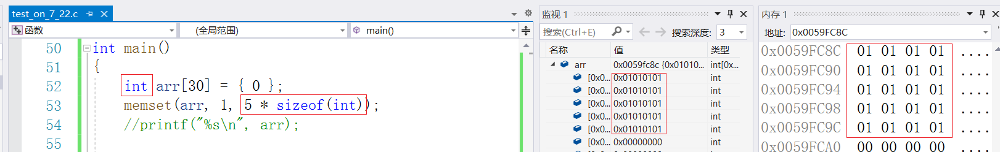

这样的话只能把整型变量中每一个字节都变成1，而若想用此法置零则是可行的。

> 就按照这样的方式去读网站上对函数的解析内容。注意：每次使用库函数都要引用`#include`头文件。

&nbsp;

### 2 自定义函数

#### 2.1 自定义函数的定义

库函数虽好，但不可贪杯哦。库函数虽多，但是毕竟不能实现所有功能，所以还是需要自定义函数来满足我们的各种各样的需求。自定义函数和库函数一样，有函数名、返回类型和函数参数，但不同的是这些都由我们自己来设计。

##### 函数的形式

~~~C
ret_type fun_name(para1,...)
{
    statment;//语句项
}
ret_type//返回类型
fun_name//函数名
para//参数
~~~

有了这样的形式模板，我们就可以照葫芦画瓢了。

##### Example 1 找最大值

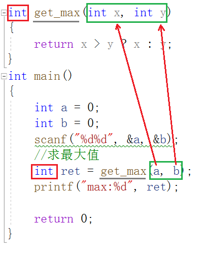

如图所示，写函数，函数名、参数、返回类型都要对应。

##### Example 2	两数交换

先看在程序设计中如何进行两数交换，用酱油、醋和空瓶举例。

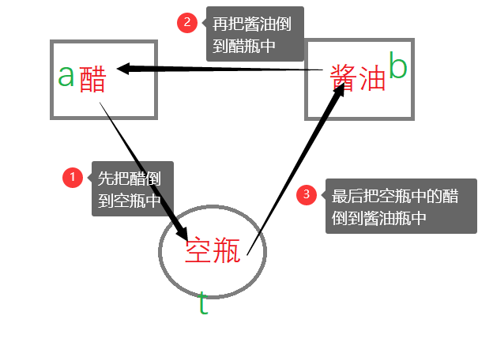

1. 先把a赋值给t，那么现在t里面存有a的值
2. 现在再把b赋值给a，这样a还在t里不会被覆盖
3. 最后把t（里的a）赋值给b，这样就完成了a和b的互换。

~~~C
void Swap1(int x, int y) {
	int t = 0;
	t = x;
	x = y;
	y = t;
}
void Swap2(int* px, int* py) {
	int t = 0;
	t = *px;
	*px = *py;
	*py = t;
}
int main() {
	int a = 10;
	int b = 20;
    Swap1(a,b);
	printf("Swap1：a=%d,b=%d\n", a, b);
	Swap2(&a, &b);
	printf("Swap2：a=%d,b=%d\n", a, b);
	return 0;
}
~~~

> Swap1和Swap2那个函数能够实现这样的功能呢？

Swap1仅仅是把a和b传值给x和y，此时去修改x和y是影响不到a和b的。

Swap2是把a，b的地址传给指针变量px和py，这样的话，在函数内去将px和py解引用再修改，就可以指向a，b的内容了。简而言之，**通过指针指向实参的地址使得形参与实参同时发生变化**。

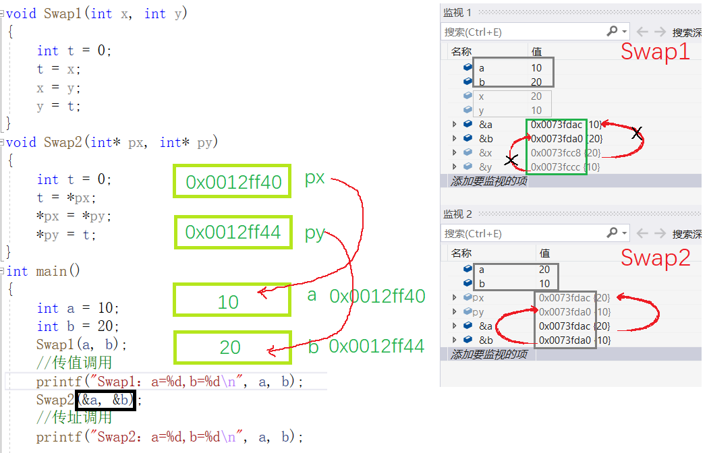

由图可知，px和py内部存储的是变量a和b的地址，这样对px和py解引用就可以修改a和b的值。由右图的监视可看出，Swap1函数x和y确实发生了交换，但并没有影响到a和b，Swap2函数的px、py和&a、&b是一个意思。

#### 2.2 函数的参数

函数参数分为实际参数和形式参数两种：

1. 实际参数又叫实参，实参可以是<u>任意有确定值的形式</u>，以便在进行函数调用时，将其传给形参。
2. 形式参数又叫形参，只有当函数调用时，他们才被分配确定值以及内存单元，调前不存在，调后销毁，所以形参只是<u>形式上存在</u>。

#### 2.3 函数的调用

1. 传值调用

形参实例化之后相当于实参的一份**临时拷贝**，并且形参和实参占用不同的内存单元，本质上是两个不同的变量，形参的修改不影响实参。

2. 传址调用

将外部**变量的地址**传给函数参数，这样的调用可使函数内外建立真正的联系，即形参实参建立联系。

#### 2.4 练习

##### Example 1 判断素数

~~~C
#include <math.h>
int is_prime(int n)
{
	//试除法
	int j = 0;
	for (j = 2; j <= sqrt(n); j++)
	{
		if (n % j == 0)
			return 0;	
	}
	return 1;
}
~~~

> 函数的功能要单一且灵活，判断素数就是判断素数，打印的操作留给其他函数，这样的话，写出来的代码才能够很好的互相配合。

##### Example 2 判断闰年

~~~C
//是闰年返回1，不是闰年返回0
int is_leap_year(int y)
{
	return (((y % 4 == 0) && (y % 100 != 0)) || (y % 400 == 0));
}
~~~

> 不可以将两个或者的条件分开成if..else..的形式，这样的话1200,1600,2000这样可整除400，也可整除100的数据就在第一轮判断就淘汰了，进入不了第二个条件的判断。

##### Example 3 二分查找

~~~C
int binary_search(char arr[], int k, int sz)
{
	int left = 0;
	int right = sz - 1;	
	while (left <= right)
    {
		int mid = (left+right)/2;
		if (arr[mid] > k)
        {
			right = mid - 1;
		}
		else if (arr[mid] < k)
        {
			left = mid + 1;
  		}
		else
			return mid;
	}
	return -1;
}
~~~

而在主程序中是这样的：

~~~C
int main()
{
	char arr[20] = { 1,2,3,4,5,6,7,8,9,10 };
	int key = 7;
    int sz = sizeof(arr) / sizeof(arr[0]);//计算数组元素个数
	
    //TDD - 测试驱动开发
	int ret = binary_search(arr, key, sz);
	
	
    if (ret == -1) //找不到返回-1
    {
        printf("找不到\n");
    }
	else //找到返回下标0~9
    {
        printf("找到了，下标为%d", ret);
    }
    return 0;
}
~~~

> 在主程序编写代码时，把binary_search函数当成库函数一样写，并将函数的实现逻辑实现规定好，最后再去写函数实现。这样的方法叫TDD(test drive develop)—测试驱动开发。
>

##### Example 4 自增num

~~~C
int Add(int num)
{
	num++;
}
int main()
{
	int num = 0;
	num = Add(num);
	return 0;
}
~~~

讲到这里基本内容就讲完了，下面开始进一步的深入。

#### 2.5 嵌套调用

函数不可以嵌套定义，函数与函数是平等的，是并列关系，不可以在任意函数（包括主函数）中定义其他函数。但函数是可以互相调用的。

~~~C
void fun1()
{
    printf("hehe\n");
}
void fun2()
{
    fun1();
}
int main()
{
    fun2();
    return 0;
}
~~~

> 如代码所示，main函数调用fun2函数，fun2函数又调用fun1函数，最终在屏幕上打印hehe。

#### 2.6 链式访问

链式访问（chain access），顾名思义，把一个函数的<u>返回值</u>作为另一个函数的<u>参数</u>。像是用链子把函数首尾相连拴起来。如：

~~~C
int main()
{
    printf("%d\n",strlen("abcde")); //把strlen的返回值作为printf的参数   
    return 0;
}
~~~

~~~C
int main()
{
	char arr1[20] = "xxxxxxx";
	char arr2[20] = "abcde";
	//strcpy(arr1,arr2);
	printf("%s\n", strcpy(arr1, arr2));//strcpy函数的返回值是目标空间首元素地址
	return 0;
}
~~~

**Example**

如果觉得掌握了的话，可以看看这个经典例子。

~~~C
printf("%d", printf("%d", printf("%d", 43)));
~~~

> 想要知道该语句输出什么？必然要先了解 printf 函数的返回值是什么，通过MSDN或者[cplusplus.com](www.cplusplus.com)网站去查找。

printf 函数的返回值是打印字符的个数，如果发生错误，则返回负值。（ps:scanf的返回值是输出字符的个数）

> 首先可以看出第三个printf打印了43；然后第二个printf打印了第三个printf的返回值为2；最后第一个printf打印第二个printf的返回值1；所以屏幕上打印了4321。

#### 2.7 函数声明

代码是从前往后执行的，如果函数定义在后面的话，调用时便会发出警告：函数未定义，若想消除警告，我们便需要在前面声明一下。

~~~C
void test();
int main()
{
	test();
}
void test()
{}        
~~~

声明就是把函数定义在加个` ; `，目的是告诉编译器函数的返回类型、函数名、参数这些具体信息。函数的声明一般出现在函数使用之前，函数的声明一般放在头文件中。 

在工作的时候，一般是把函数的声明、定义和使用放在三个不同的文件内，方便所有人协作。如：

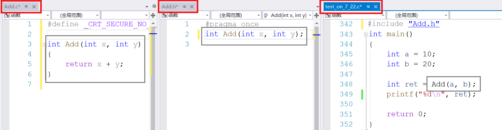

> 链接：两个.c的源文件编译之后，会分别生成.obj的目标文件，然后再链接起来，最后生成.exe的可执行文件。
>

##### 头文件引用

> `#include`的预编译指令是在预编译阶段将头文件内的所有内容拷贝到源文件内。

头文件中的内容若被重复包含则会造成效率降低。那么，怎么解决这件事呢？

1. 头文件中包含语句`#pragma once`使得头文件中不会重复包含其他头文件；
2. 添加这样的代码，将语句包含起来。

 ~~~C
 #ifndef __ADD_H__// if not define 
 #define __ADD_H__//define
 //Add函数声明
 extern int Add(int x, int y);
 #endif//end if
 ~~~

早期都是用第二种方法的，这两种方法是完全等价的。

#### 2.8 函数递归

函数递归的定义是程序自身调用自身的编程技巧叫递归。

##### 特点

1. 大型复杂问题层层转化为小规模的问题
2. 少量程序描述出多次运算

递归的思维方法在于：大事化小。

##### Example  1

接收一个无符号整型值，按照顺序打印其每一位。如输入：1234，输出：1 2 3 4 .

> 创建一个函数叫print，若print(1234)，则剥离一位变成print(123)+4，再剥离一位成print(12)+3+4,再来一位就是print(1)+2+3+4，最后只有一位了，那就全部用`printf` 函数打印。如：

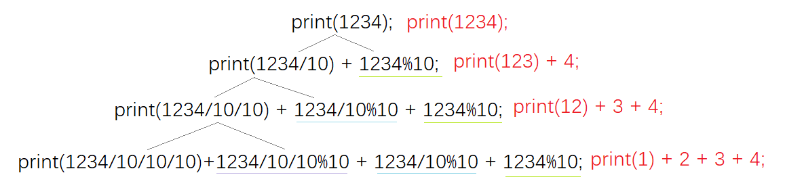

> 我们发现只要将数字1234模10就可以得到4，除10便可以得到123，如此模10除10循环往复，可以将1 2 3 4全部剥离出来。

~~~c
//函数递归
void print(size_t n)
{
	if (n > 9)//只有1位便不再往下进行
	{
		print(n / 10);
	}
	printf("%d ", n%10);
}
~~~

具体流程可参考下面这张图。

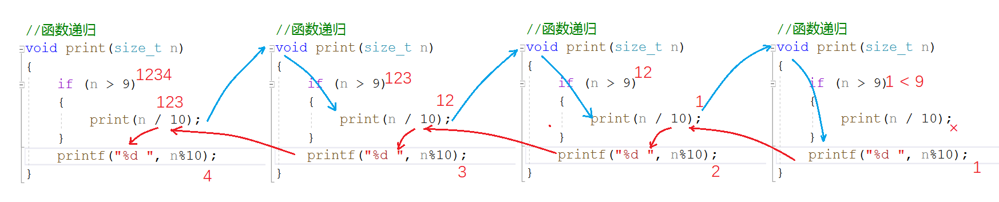

红线部分即在返回的时候，n是本次函数n，而不是前一次调用的n。

> 递归递归，就是递推加回归。

现在有两个问题

1. `if(n > 9)`这个条件没有行不行？没有会怎么样？

> 自然是不行的，我们在上面的推导中发现，最后1<9条件不成立，就结束了递归，否则会永远递归下去，造成死循环且耗干了栈区。

1. 或者是我们不论代码的正确性，将`print(n / 10)`改成`print(n)`会怎么样？

> 改成`print(n)`的话每次递归都是相同的值，递归也会无止境的延续下去。

这样便引出了我们递归的两个重要的必要条件：

##### 必要条件

1. 必须<u>存在限制条件</u>，满足条件时，递归不再继续
2. 每次递归调用后必须<u>越来越接近</u>限制条件

##### 函数栈帧

在第一个问题中，如果我们要去试验的话，编译器会报出这样的错误：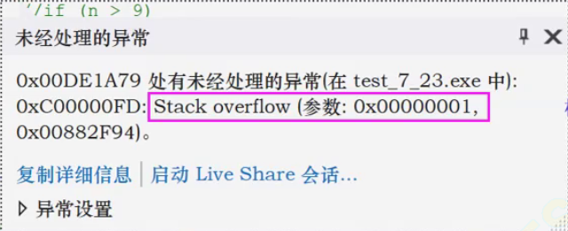

名叫Stackoverflow（栈溢出）。

首先我们看看内存的划分：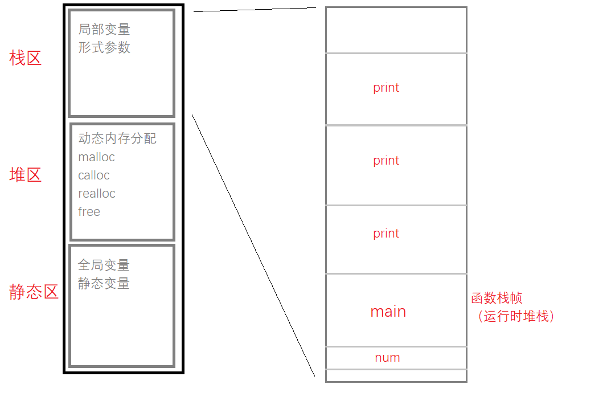

内存粗略的划分为栈区，堆区，静态区。

> 1. 栈区主要存放：局部变量，形参（形参和局部变量差不多）
> 2. 动态内存分配：`malloc calloc`等函数开辟空间
> 3. 静态区主要存放：全局变量，static修饰的静态变量

若是把栈区放大细看的话，如图所示，有为main函数开辟的空间和print函数开辟的空间，为函数开辟的空间叫函数栈帧也可以叫运行时堆栈。

> - 程序开始执行时开辟空间，程序结束时销毁空间
> - 函数每调用一次就在栈上开辟一次空间，递归返回时，空间会被回收

###### Example 2

不创建临时变量，实现`Strlen`函数

~~~c
int my_strlen1(char* pa)
{
    int count = 0;
	while (*pa++ != '\0')
	{//pa++;
		count++;
	}
	return count;
}
~~~

~~~c
//my_strlen求字符串长度
int my_strlen(char* pa)
{
	if (*pa == 0){
		return 0;
	}
	return 1+my_strlen(pa + 1);//直接返回长度	
}
~~~

具体的思考方式就是只要第一个字符不是0，那我们就在外面+1并且跳到下一个字符，直到找到‘\0’，那么我们返回0。

> 字符指针+1，向后跳一个字节，整型指针+1，向后跳四个字节，指针+1都是向后跳一个元素的地址，指针类型不同向后跳的字节也不同。

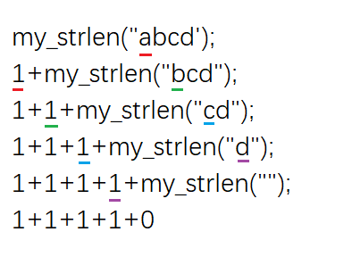

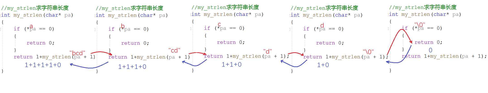

##### 函数迭代

###### 递归、迭代的区别

- 递归是重复调用函数自身实现循环。迭代是函数内某段代码实现循环，循环代码中变量既参与运算同时也保存结果，当前保存的结果作为下一次循环计算的初始值。
- 递归循环中，遇到满足终止条件的情况时逐层返回来结束。迭代则使用计数器结束循环。

>   当然很多情况都是多种循环混合采用，这要根据具体需求。

###### Example 3 求n阶乘

~~~c
int fac(int n)
{
	if (n <= 1)
		return 1;
	else
		return n * fac(n - 1);
}
~~~

###### Example 4 斐波那契数

~~~c
int fib(int n)
{
	if (n <= 2)
		return 1;
	else
		return fib(n - 1) + fib(n - 2);
}
~~~

但是这个方法效率是非常低的，当数字特别大时，层层拆分下来，时间效率是$O(2^n)$。根据公式可知，第三个斐波那契数可由前两个得到，我们利用这个规律：

~~~c
int fib(int n)
{
	int a = 1;
	int b = 1;
	int c = 1;
	while (n >= 3)
	{
		c = a + b;
		a = b;
		b = c;
		n--;
	}
	return c;
}
~~~

上一个c变成了b，上一个b变成了a。如此循环往复。利用迭代的方式，计算一个数只需要计算n-2次，这样的话时间复杂度就是$O(n)$。效率大大提高。

> 有这两题我们可以发现，什么时候用递归简单呢？

1. 有公式有模板的时候
2. 递归简单，非递归复杂的时候

当递归有明显问题的时候，就不要用递归了。

