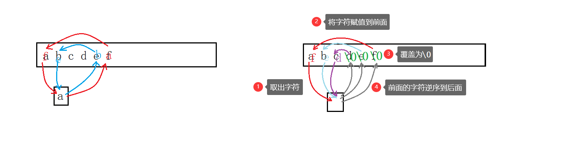
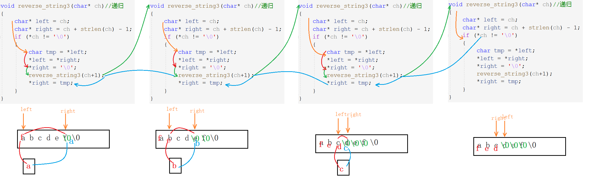
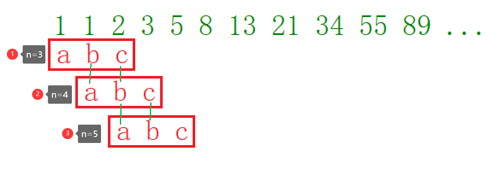
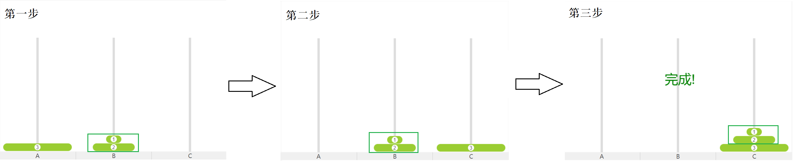
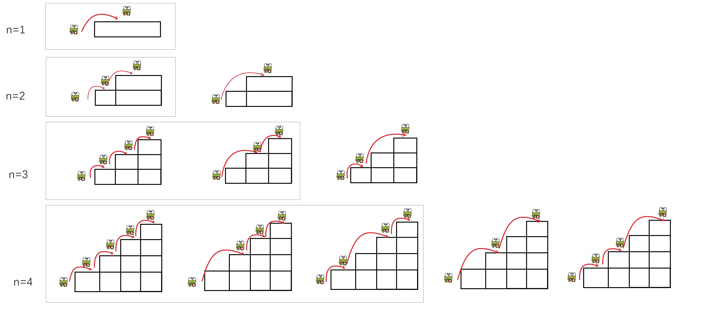

## 函数递归

#### 函数递归的定义和优缺点

程序调用自身的行为就是递归。可以直接或间接的调用，本质是把复杂的问题转化为一个规模小的问题。递归一般只需少量的代码就可描绘出多次重复计算。其主要思考方式在于**大事化小**。

**优点**是为具有某些特征的编程问题提供了最简单的策略，**缺点**是层层调用，算法的复杂度可能过高，以致于快速耗干了计算机的内存资源，不方便阅读和维护等。

#### 递归的使用场景及必要条件

**使用场景**

1. 能够要求转化为新的问题，且二者解决方法相同，所处理的对象存在规律变化。
2. 非递归比较麻烦，而递归很简单。
3. 有模板或是公式可以直接套用，不会出现明显问题。

**必要条件**

- 明确存在限制条件
- 每次递归越来越逼近条件

#### 递归的细节说明

- 每级递归都有自己的变量，可能名称相同，但是其值不同。

  > 递归调用时，系统自动保留当前函数的参数变量。每次调用系统都会为函数开辟相应的空间。

- 每次调用都要返回值，递归执行结束后，控制权传回到上一级函数。

  > 调用结束后，系统释放本次调用所开辟的空间，程序返回到上一次的调用点，同时获得初进该级调用的参数。
  >
  > 每级递归必须逐级返回，不可跳跃或间断。

- 函数中递归语句之前的代码，按被调函数的顺序执行，递归之后的代码，与被调函数相反的顺序执行。

#### 递归的习题讲解

##### 1打印整数每一位

用递归的方式，实现打印一个整数的每一位的功能。

###### 输入输出示例

> 输入：1234
>
> 输出：1 2 3 4

###### 解题思路

> `print(1234)`
> $=$ `print(123)`+4
> $=$ `print(12)`+3+4
> $=$ `print(1)`+2+3+4
> $=$ `printf(1)`+2+3+4

 这便是前面使用场景中所写的，将题目要求问题转化为新的问题，且变量有规律的变化

###### 代码逻辑

> `n`是不是个位数，递推调用`n / 10`
>
> `n`是个位数，回归打印`n % 10`

~~~c
void Print(int n) 
{
	if (n > 9)
	{
		Print(n / 10);
	}
	printf("%d ", n%10);
}
int main()
{
	int num = 0;
	scanf("%d", &num);
	Print(num);	
	return 0;
}
~~~

##### 2递归和非递归求n阶乘

用递归和非递归的方法，分别实现求n的阶乘的功能（不考虑溢出）。

###### 输入输出示例

> 输入：5
>
> 输出：120

###### 解题思路

> $n*n-1*n-2*n-3*…*1$

###### 代码逻辑

> $fac(n) = n * fac(n-1) , n>0$
>
> $fac(n) = 1 , n=0$

~~~c
int fac(int n)//非递归
{
	int ret = 1;
	for (int i = 1; i <= n; i++)
	{
		ret *= i;
	}
	return ret;
}
int fac(int n)//递归
{
	if (n > 0)
		return n * fac2(n - 1);
	else
		return 1;
}
int main()
{
	int n = 0;
	scanf("%d", &n);	
	printf("%d\n", fac(n));
	return 0;
}
~~~

##### 3`strlen`函数模拟

###### 输入输出示例

> 输入：abcdef
>
> 输出：6

###### 解题思路

> `strlen(abcdef\0)
> 1+strlen(bcdef\0)
> 1+1+strlen(cdef\0)
> 1+1+1+strlen(def\0)
> 1+1+1+1+strlen(ef\0)
> 1+1+1+1+1+strlen(f\0)
> 1+1+1+1+1+1+strlen(\0)`

###### 代码逻辑

> $若 *ch≠0 , strlen(arr) = 1 + strlen(arr+1)$
> $若*ch=0 , strlen(arr) = 0$

~~~c
int my_strlen(char* ch)
{
	if (*ch != '\0')
	{
		return 1 + my_strlen(ch + 1);
	}
	return 0;
}
int main()
{
	char ch[20] = { 0 };
	scanf("%s", &ch);
	printf("%d", my_strlen(ch));
	return 0;
}
~~~

##### 4逆序字符串

不开辟额外空间的情况下，不使用字符串库函数，递归实现字符串反向排列，而不是倒序打印。

###### 输入输出示例

> 输入：abcdef
>
> 输出：fedcba

###### 解题思路

> `abcdef`
>
> 递推：（先把后面赋值给前面，后面用覆盖\0）
>
>  $ \Rightarrow$ `f b c d e \0`
>
>  $\Rightarrow$ `f e c \0\0`
>
>  $\Rightarrow$ `f e d \0\0\0`
>
> 回归：（把前面转移出去的字符对应赋值给\0）
>
>  $ \Rightarrow$ `f e d c \0\0`
>
>  $\Rightarrow$ `f e d c b \0` 
>
>  $\Rightarrow$ `f e d c b a`

###### 代码逻辑

> `reverse("abcdef\0")
> 交换a和f+reverse("f bcde\0\0")
> 交换a和f+交换b和e+reverse("fe cd\0\0\0")
> 交换a和f+交换b和e+交换c和d+reverse("fed \0\0\0\0")`

> - 交换两个字符
>   1. 将在前的字符先放到一边存着
>   2. 把在后的字符赋值到前面的位置
>   3. 再把后面的位置对应覆盖为`\0`
> - 原在前字符替换`\0`
>   1. 把事先存好的在前的字符对应替换到`\0`的位置上

~~~C
void reserve_string1(char* ch)//指针
{
	char* left = ch;
	char* right = ch + strlen(ch) - 1;
	while (left < right)
	{
		char tmp = *left;//不能交换地址，只能交换内容
		*left = *right;
		*right = tmp;
		left++;
		right--;
	}
}
void reserve_string2(char* ch)//数组
{
	int left = 0;
	int right = strlen(ch) - 1;
	while (left < right)
	{
		char tmp = ch[right];
		ch[right] = ch[left];
		ch[left] = tmp;
		left++;
		right--;
	}
}

void reverse_string3(char* ch)//递归
{
	char* left = ch;
	char* right = ch + strlen(ch) - 1;

	if (*ch != '\0')
	{
		char tmp = *left;//提取
		*left = *right;//赋值
		*right = '\0';//赋\0

		reverse_string3(ch+1);//ch+1,而不是ch++

		*right = tmp;//赋值
	}
}
int main()
{
	char ch[20] = "abcdef";
	//char* ch = "abcdef";//err - 常量字符串不可修改
	reverse_string3(ch);
	printf("%s\n", ch);

	return 0;
}
~~~

##### 5递归实现数字各位之和

写一个递归函数`DigitSum()`，输入一个非负整数，返回组成它的数字之和

###### 输入输出示例

> 输入：1234
>
> 输出：10

###### 解题思路

> 1234
> `DigitSum(123)`+4
> `DigitSum(12)`+3+4
> `DigitSum(1)`+2+3+4
>
> 1+2+3+4

> 1234%10=4
> 1234/10=123
>
> 123%10=3
> 123/10=12
>
> 12%10=2
> 12/10=1
>
> 1%10=1
> 1/10=0
>
> 一个数模10得到尾数，除10得到尾数前面的数字
>
> 通过不断的除10模10，就可以把每一位数字放到末尾，从而得到每一位数字

###### 代码逻辑

> 若n不为个位数，先%10得到尾数，再/10
>
> 一定要有递归的出口，即当n为个位数时，函数返回n

~~~c

int DigitSum(int n)
{
	if (n > 9)
		return DigitSum(n / 10) + n % 10;
	else
		return n;//递归的出口
}
int main()
{
	int n = 0;
	scanf("%d", &n);
	printf("%d\n", DigitSum(n));

	return 0;
}
~~~

##### 6求n的k次幂

输入两个整数分别代表底数和次幂，递归实现n的k次幂的功能。

###### 输入输出示例

> 输入：2   3
>
> 输出：8

###### 解题思路

> 当`k>0`时，函数返回`n*power(n,k-1)`
>
> 当`k=0`时，函数返回1，这是程序的出口，是程序递归到最后必须要计算的值

###### 代码逻辑

> $n^k = n * n^{k-1} ,k > 0$
> $n^k = 1 , k = 0$

~~~c
double power(int n,int k)
{
	if (k > 0)
		return n * power(n, k - 1);
	else if (k == 0)
		return 1.0;//递归的出口k=0
	else
		return 1.0 / power(n, -k);
}
int main()
{
	int n = 0;
	int k = 0;
	scanf("%d%d", &n, &k);
	printf("%lf\n", power(n, k));
    return 0;
}
~~~

##### 7递归求斐波那契数列

递归和非递归分别实现求第n个斐波那契数

###### 输入输出示例

> 输入：5
>
> 输出：5

###### 解题思路

> $1\quad 1\quad 2\quad 3\quad 5\quad 8\quad 13\quad 21\quad 34\quad 55\quad 89\quad ...$

###### 代码逻辑

> 递归：
>
> $Fib(n) = Fib(n-1) + Fib(n-2) , n>2$
> $Fib(1) = Fib(2) = 1$
>
> 非递归：
>
> 上一次的b换成这一次的a
>
> 上一次的c换成这一次的b
>
> 如此循环，就可以从前往后一个一个求。

~~~c
int Fib(int n)
{
	if (n > 2)
		return Fib(n - 1) + Fib(n - 2);
	else
		return 1;
}
~~~

> 但是这个方法效率是非常低的，当数字特别大时，层层拆分下来，时间效率是$O(2^n)$。
>
> 根据公式可知，第三个斐波那契数可由前两个得到，我们利用这个规律

~~~C
int Fib(int n)
{
	if (n <= 2)
		return 1;
	int a = 1;
	int b = 1;
	int c = 1;//n=3时不用运算
	while (n >= 3)//从头开始移动n-2次，n=3时不用
	{
        c = a + b;
		a = b;//b赋值给a
		b = c;//c赋值给b		
		n--;
	}
	return c;
}

int main()
{
	int n = 0;
	scanf("%d", &n);
	printf("%d",Fib(n));
    
	return 0;
}
~~~

#### 经典问题

##### 汉诺塔问题

汉诺塔，小时候游戏机上经常看别人玩的，自己玩到三四局就玩不下去了的那款游戏。当然如果你觉得非常简单，小时候能玩的行云流水，那你有本事到我面前说，礼貌谢谢（狗头保命）。

###### 游戏规则

有三根柱子，分别为A、B、C ，A柱上从上到下依次排列着由小到大的圆盘，我们需要把圆盘从A柱按照同样的摆放顺序放到C柱上，期间我们可以借助B柱。

- 每次只能挪动一个且是最上面的圆盘
- 按照从上到下依次是由小到大的顺序摆放。

###### 解题思路

假设由N个盘子，只需要考虑第$N$个盘子和其上$N-1$个盘子的整体。显然思路就是，第$N$个是要放在$C$柱上的，

1. 首先将$N-1$个整体是先放在$B$柱上；
2. 其次将第$N$个放在$C$柱上；
3. 最后将$N-1$个整体放到$C$柱上。

即：第$N$个$A\rightarrow B$，$N-1$个整体$A\rightarrow B\rightarrow C$ 。然后再考虑$N-1$个中把第$N-1$个当作最后一个，其上$N-2$个当作整体，到最后只剩一个直接放到$C$柱上。这便是递归的整体思路。

~~~c
void move(int n, int x, int z)
{
	printf("%d盘：%c->%c\n", n, x, z);
}
void hannoi(int n, char x, char y, char z)
{
	if (n == 1)
		move(n, x, z);
	else
	{
		hannoi(n - 1, x, z, y);
		move(n, x, z);
		hannoi(n - 1, y, x, z);
	}
}
int main()
{
	int input = 0;
	do 
	{
		printf("输入盘数开始测试（0. 退出测试）\n");
		scanf("%d", &input);
		switch (input)
		{
		case 0:
			break;
		default:
			hannoi(input, 'A', 'B', 'C');
			break;
		}
	} while (input);
	return 0;
}
~~~

##### 青蛙跳台阶

###### 游戏规则

​	**初阶版本**

​		青蛙一次可以跳一级台阶，也可以跳两级台阶。求该青蛙跳n级台阶共有多少种跳法？

​	**进阶版本**

​		青蛙一次可以跳一级台阶，也可以跳两级台阶，……，也可以跳n级台阶，求该青蛙跳上n级台阶的跳法种数。

###### 解题思路

我们反向思考，当青蛙跳到最高阶$N$阶时，他是怎么跳到第$N$阶的呢？

有两种情况，

- 从第$N-1$阶，跳到第$N$阶，最后一次跳一阶。
- 从第$N-2$阶，跳到第$N$阶，最后一次跳两阶。

> 图中用灰框框出的部分，是最后一次跳一阶的，其余的是最后一次跳两阶的。

很显然，除了这两种情况，别无他法。所以计算青蛙

跳到$N$阶的方法数 $=$ 跳$N-1$阶的方法数  $+$  跳$N-2$ 阶的方法数。

> 同样，图中用灰框框出的部分，也代表的是跳$N-1$阶的方法数，其余的是跳$N-2$ 阶的方法数。

这其实就是斐波那契数列。

~~~c
int fib(int n)
{
	if (n > 1)
		return fib(n - 1) + fib(n - 2);
	else
		return 1;
}
~~~
