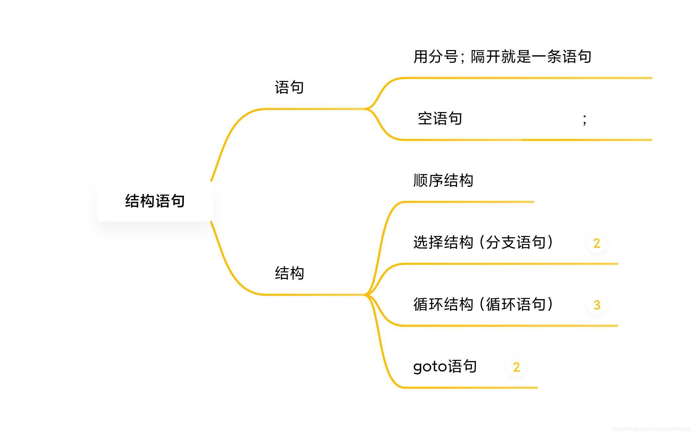
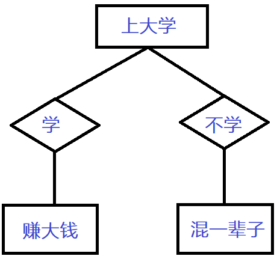
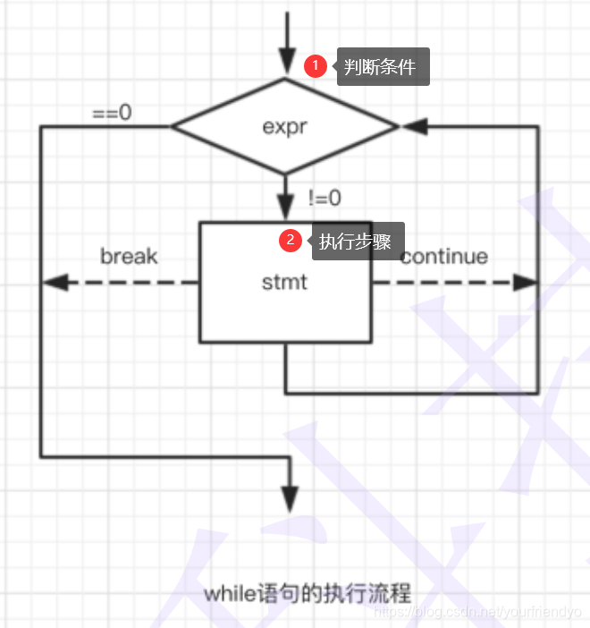
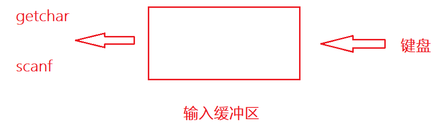
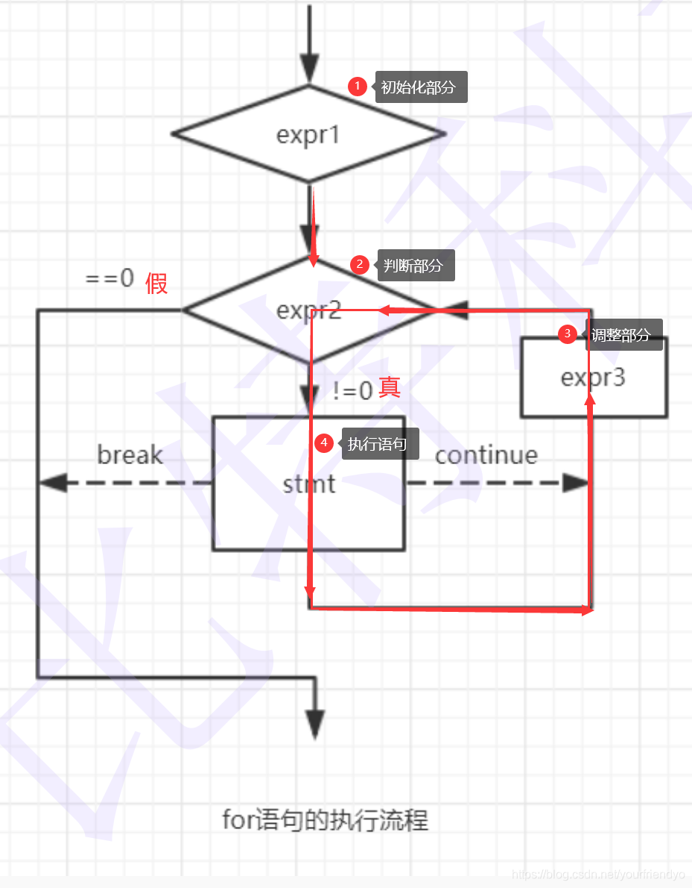
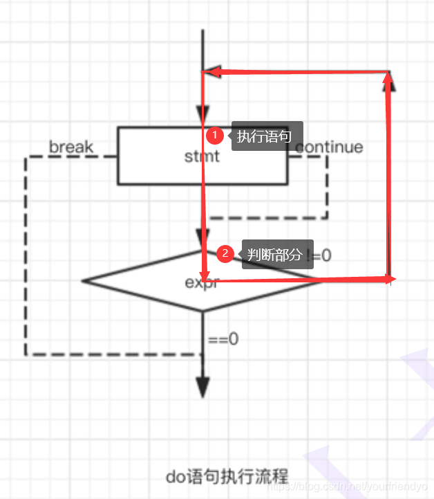

## 分支循环结构

> 结束了初识C语言，现在我们再从头细细的学起。首先映入眼帘的是三大结构，分别是顺序结构，选择结构，循环结构。生活中的事情大大小小基本上都可以通过这三种结构描述。

C语言是一门结构化的编程语言。顺序结构不必多言，选择结构有`if`语句，`switch`语句，循环结构有`while`循环，`for`循环以及`do...while`循环语句，还会介绍到`goto`语句。



#### 0.0 语句

以分号`;`结尾的，用分号`;`隔开的就是一条语句。例如`printf("hehe\n"); `，这便是一条语句。甚至还有只有一个分号`;`的语句称为空语句。

~~~C
printf("hehe\n");
1+2;
;//空语句
~~~

### 1 选择结构

选择结构对应分支语句或称选择语句。比如这么一个简单的例子就可以用分支语句描述。



#### 1.1 if 语句

##### 语法结构

if语句的语法分为单分支和多分支两种逻辑结构。

```C
//1.单分支
if (表达式)
{
    语句;
}
else 
{
    语句;
}

//2. 多分支
if (表达式) 
{
    语句;
}
else if (表达式) 
{
    语句;
}
else if (表达式) 
{
    语句; 
}
...
else 
{
    语句;
}
```

条件表达式若为真，就进入语句，反正为假，则不执行。

##### 示例

~~~C
int main()
{
    int age = 20;
    //多分支
    if (age < 18)
        printf("青少年\n");
    else if (age >= 18 && age < 30)
        printf("青年\n");
    else if (age >= 30 && age < 50)
        printf("壮年\n");
    else if (age >= 50 && age < 80)
        printf("老年\n");
    else
        printf("快没了\n");
    
    return 0;
}
~~~

当然如果想一个if语句**控制多条语句则需要使用代码块**。即用一个大括号将所以语句括在一起。这样还有一个明显的好处就是可以提高代码的可读性，一般实际工作中都会采用这种形式。如：

~~~C
int main()
{
    int age = 10;
    if (age >= 18)
    {
        printf("成年了\n");
        printf("可以谈恋爱了\n");
    }

    return 0;
}
~~~

##### 问题

下面是关于if语句的一些常见的问题及一些特例。

1. 条件表达式错误

```C
//18 <= age < 30 
int main()
{
    int age = 50;
    if (18 <= age < 30)
        printf("青年\n");

    return 0;
}
```

初学者很容易写出这样的代码，问题就出现在判断条件上，编程语言里18 <= age < 30的意义是一个表达式。

> 先看左边的18 <= age 无论其是真是假，真则为1，假则为0。1或0都是要小于30的，故整个表达式为真，所以无论怎样都会执行if语句。

2. 悬空`else`

悬空`else`是一个经典的问题。

```c
//悬空else
int main()
{
    int a = 0;
    int b = 2;
    if (a == 1)
        if (b == 2)
            printf("hehe\n");
    else
        printf("haha\n");//else与其上最近的一个if匹配
    return 0;
}
```

> 该代码的else部分虽然是和第一个if对齐，但是else总是与其上最近的一个if搭配，不受代码对齐的影响。所以该else和上一个if都是嵌套在第一个if语句里的。
>

故修改后应为下图，显著的提示了代码的可读性。

~~~C
int main()
{
    int a = 0;
    int b = 2;
    if (a == 1)
    {
        if (b == 2)
            printf("hehe\n");
        else
            printf("haha\n");//else与其上最近的一个if匹配
    }
    return 0;
}
~~~

3. 判断表达式误写成赋值表达式

> 还有就是错把比较相等的表达式写出赋值表达式。这也是一个初学者经常犯的，不起眼的却又很难找且编译器不报错的错误。

~~~c
int main()
{
    int a = 0;    
    if (a = 5)
        printf("hehe\n");
    return 0;
}
~~~

在上面的代码中，错把a==5写成了a=5。但是逻辑上又没有什么问题，a=5是赋值表达式，其值为5为真，所以判断条件失效，无论如何都执行if语句。

~~~C 
//建议改成
int main()
{
    int a = 0;
    if (5 == a)
        printf("hehe\n");

    return 0;
}
~~~

把`a == 5`改成`5 == a`，这样一来如果再写成赋值表达式，就出现了语法错误常量是不可赋值的，编译器就会报警。

4. 函数返回后在函数内写代码

~~~c
if (condition)
return x;
return y;
~~~

> 该代码的含义为如果条件成立，则返回x，否则返回y。

~~~c
void test()
{
    if (1)
    {
        printf("hehe\n");
        return 0;
    }
    //函数返回值后，后面的代码不执行
    printf("haha\n");
}

int main()
{
   test();
   
   return 0;
}
~~~

从上面的代码可以看出，函数返回值后，下面的代码将不再执行。所以函数不可能又返回x又返回y。

**练习**

1. 输出0到100之间的奇数。

~~~C
int main()
{
    int i = 0;
    while (i <= 100)
    {
        if (i % 2 == 0)
            printf("%d ", i);
        i++;
    }
    for (i = 0; i < 100; i++)
    {
        if (i % 2 == 1)
        {
            printf("%d ", i);
        }
    }
    return 0;
}
~~~

#### 1.2 switch 语句

##### 语法结构

~~~c
switch (整型表达式)
{
    语句项;
}
~~~

之所以会存在switch语句，是因为在某些情况下使用if...else语句会显得过于繁琐。

~~~c
int main()
{
    int day = 0;
    scanf("%d", &day);
    switch (day)//整型表达式
    {
    case 1://整型常量表达式
    {
        printf("星期一\n");
        printf("美好的一天，从上班开始5555~");
        break;
    }
    case 2:
        printf("星期二\n");
        break;
    case 3:
        printf("星期三\n");
        break;
    case 4:
        printf("星期四\n");
        break;
    case 5:
        printf("星期五\n");
        break;
    case 6:
        printf("星期六\n");
        break;
    case 7:
        printf("星期日\n");
        break;
    }
    return 0;
}
~~~

##### 注意

- 首先switch后面的表达式必须是**整型表达式**，即其后变量必须为整型。
- 其中case语句项里也必须是**整型常量表达式**，既是整型也是常量缺一不可。
- 从上述代码中我们也可以看出，case语句项若想控制多条语句，仍需使用代码块。

- 上述代码的逻辑里，必须在每种情况下都要有break跳出去，不然的话代码就会一直向下走。

> case是代码入口，break是代码出口。

但是若有时我们不需要分的如此清楚，比如1到5我们定为工作日，6到7我们定为休息日。那么我们的代码就可以这么改。

~~~c
int main()
{
    int day = 0;
    scanf("%d", &day);
    switch (day)
    {
    case 1:
    case 2:
    case 3:
    case 4:
    case 5:
        printf("工作日\n");
        break;
    case 6:
    case 7:
        printf("休息日\n");
        break;
    default:
        printf("输入数据有误，请重新输入\n");
        break;
    }

    return 0;
}
~~~

但从上述代码中我们还可以得到以下信息。

- 虽然多个case对应一种结果，但是最**后仍需加上break**;
- default子句：适配所有不符合case情况的情况。即当所有的case标签都不满足时，便会来到default的情况。

> default子句末尾最好也加上break；这样后续如果再加入其他情况时，不至于代码错误。

- 另外，所以**case语句不存在顺序问题**，即无论顺序怎么排，都无所谓。

> 总结：
>
> `if`语句里的`break`&`continue`都是为了控制外面的循环等语句。`switch`语句里是`break`结束`switch`语句，代码不往下走，`switch`语句里没有`continue`。

### 2 循环结构

#### 2.1 while 循环

~~~C
//while语法结构
while(表达式)
{
    循环语句;
}
~~~

`while`语句的执行流程如下：



条件为真，则进入循环反之则退出循环。这并不难理解。

##### break&continue

但是图中`break`，和`continue`是什么意思呢？`break`是否和在`switch`里是一个用法呢？

~~~c
int main()
{
    int i = 0;
    while (i <= 10)
    {
        if (i == 6)
            break;
        printf("%d ", i);
        i++;
    }
    return 0;
}
~~~

如上述代码，当i=6时，break后则终止了循环，所以输出结果为0 1 2 3 4 5 。

~~~c
int main()
{ 
    int i = 0;

    while (i <= 10)
    {
        if (i == 6)
            continue;

        printf("%d ", i);
        i++;
    }

    return 0;
}
~~~

> 但是当把`break`换成`continue`则会发生什么呢？细心想一想就会发现，该程序陷入了死循环中。

先是输出了0 1 2 3 4 5 ，但当i=6时，`continue`跳出了本次循环，直接进入下一次循环，但此时i并没有得到`i++`，所以还一直处于i=6的状态，故一直在`continue`，一直死循环。

~~~c
int main()
{
    int i = 0;
    while (i <= 10)
    {
        i++;
        if (i == 6)
            continue;
 
        printf("%d ", i);//1 2 3 4 5 7 8 9 10 11
    }

    return 0;
}
~~~

> 把`i++`，放到了前面这样的话，我们的i便有了`++`的机会。

总结：

- 循环中只要遇到`break`，就**停止后期所有循环，直接终止循环**。所以`while`中的`break`是用于永久终止循环的。

- `continue`用于终止本次循环，也就是本次循环中`continue`<u>后边的代码不会再执行</u>，结束本次循环直接跳转到while语句的判断部分，进行下一次循环的入口判断。

##### 特例

先看下面代码是什么意思。

~~~c
int main()
{
    int ch = 0;
    while ((ch = getchar()) != EOF)
        putchar(ch);
    return 0;
}
~~~

这里我们先简单的介绍两个函数`getchar`和`putchar`。

> 通俗的说，`getchar`就是<u>从键盘获取字符</u>，`getchar`就是<u>把字符打印到屏幕</u>。`EOF`即end of file是个文件结束标志。判断条件中的ch = `getchar` ，同样返回的也是字符的ACSII码值。这也是为什么，ch用的是整型`int`定义的原因。
>



由图可知，`getchar`和`scanf`两个常见的输入函数，虽然我们都说是从键盘上读取字符，但其实是先从键盘再到输入缓冲区。输入缓冲区是一块特殊的内存空间。`getchar`和`scanf`是从输入缓冲区里读取的字符。

> - 二者读取的方式有所不同，`scanf`读取到空格就停下不读了，`getchar`一次只读取一个字符。
>
> - 但又有相同之处，如果输入缓冲区没东西，那么就等待我们从键盘上输入。如果输入缓冲区有东西，就直接读取。

应用到实例就是这样的一个输入密码的程序。

~~~c
int main()
{
    int ch = 0;
    char password[20] = { 0 };
    printf("请输入密码>:");
    scanf("%s", password);
    printf("请确认密码(Y/N):>");

    //清理\n
    //getchar();//只能清理一个字符
    while ((ch = getchar()) != '\n')
    {
        ;
    }
    ch = getchar();

    if (ch == 'Y')
        printf("确认成功\n");
    else
        printf("确认失败\n");

    return 0;
}
~~~

第二个特例就是这样的一个程序

~~~c
//只打印数字字符
int main()
{
    int ch = 0;
    while ((ch = getchar()) != EOF)
    {
        if (ch < '0' || ch > '9')//排除数字字符以外的所有字符
            continue;
        putchar(ch);
    }
 
    return 0;
}
~~~

该程序的特点就是排除数字字符以外的所有字符。

#### 2.2 for 循环

> 既然已经有了while循环，那我们为什么还要学for循环呢？

for循环才是我们日后使用最多的循环语句。先看其语法结构。

```c
for (表达式1, 表达式2, 表达式3)
    循环语句;
```

1. 表达式1为**初始化部分**，用于初始化循环变量。
2. 表达式2为**条件判断部分**，用于判断什么时候终止循环。
3. 表达式3为调整部分，用于**循环条件的调整**。



循环最重要的三个部分被集中在一起，与while循环形成了鲜明的对比。

```c
int i = 1;//初始化部分
//...
while (i <= 10)//判断部分
{
    //...
    printf("%d ", i);

    //...
    i++;//调整部分
}
```

当我们的while循环体写的够多够大时，其弊病就显现出来了，三个部分分离，不好找，修改时容易引起错误。

```c
int main()
{
	int i = 0;

	for (i = 1; i <= 10; i++)
	{
		printf("%d ", i);
	}

	return 0;
}
```

这是一个for循环的例子，很清晰，很简单。

##### break&continue

```c
int main()
{
	int i = 0;
	for (i = 1; i <= 10; i++)
	{
		if (i == 5)
			break;
		printf("%d ",i);//1 2 3 4 
	}

	return 0;
}
```

这是for循环里·`break`的作用，显而易见，和其他循环甚至和分支语句里的作用都一样。是直接终止循环，或者说是跳出语句。

```c
int main()
{
	int i = 0;

	for (i = 1; i <= 10; i++)
	{
		if (i == 5)
			continue;
		printf("%d ", i);//1 2 3 4 6 7 8 9 10 
	}

	return 0;
}
```

> 而如果将这里的break改成continue会怎么样呢？显然跳过了i=5的情况，直接跳到了for循环的调整部分，调整循环变量，不容易造成死循环。

提示：`continue`跳过循环体下面的代码（只有*for循环的调整部分在循环体上面所以不受影响*，其他循环都不行）

##### 建议

1. 不可在for循环体内修改循环变量，防止for循环失去控制。

例如还是这条小白经常忽略的语病，判断表达式写出赋值表达式。

```c
int main()
{
	int i = 0;
	for (i = 1; i <= 10; i++)
	{
		if (i = 5)//循环体内修改循环变量
			printf("%d ",i);
	}

	return 0;
}
```

这还是相当于在循环体内改变了循环变量，这便造成了5555...的死循环。

~~~c
int main()
{
	int i = 0;
	for (i = 1; i <= 10; i++)
	{	
		printf("%d ", i);
		i++;
	}

	return 0;
}
~~~

> 尽量不要这样，可以在循环调整部分修改为`i+=2`。不然的话，代码写多了，就把下面的`i++`给忘了。

2. 建议for语句的循环控制变量的取值采用"左闭右开"写法。

~~~c
int main()
{
	int i = 0;
	int arr[20] = { 0 };//0~9
	
	for (i = 0; i < 10; i++)//左闭右开
	{
		scanf("%d", &arr[i]);
	}

	for (i = 0; i < 10; i++)//左闭右开
	{
		printf("%d ", arr[i]);
	}

	return 0;
}
~~~

例如这样很经典的用for循环遍历数组元素来赋值和输出的用法。这里循环变量`i`就拥有了更多的意义，比如`i`从0开始，表示数组<u>下标从0开始</u>，`i<10`表示`i`<u>循环10次</u>。也不是说必须要左开右闭，根据事实情况来看，目的就是**使循环变量拥有更多的意义**。

##### 变种

1. 省略

考试也容易考，但是一般真正写代码时不会这样。

```c
 int i=0;
 for (;;)
 {
     printf("%d ", i);
 }
```

若把三个循环部分都省了，可不可行？初始化，判断，调整部分都可省略。

- 初始化部分省略，则在创建变量时就已经初始化。
- 判断部分省略，意味着判断条件恒为真。
- 调整部分省略，那就不调整呗。

~~~c
int i=0;
int j=0;	
for ( ; i < 10; i++)
{
    for ( ; j < 10; j++)
    {
        printf("hehe\n");
    }
}
~~~

答案是屏幕上打印了10个hehe。

> 其实在第一遍外循环结束之后，内循环就不再循环了，因为内循环初始化条件的缺失，之后的`j`始终等于10，故一直不进内循环，所以只有`i=1`时循环一遍。
>

2. 多循环变量的情况

~~~c
int main()
{
	int x = 0;
	int y = 0;
	for (x = 0, y = 0; x < 5 && y < 7; x++, y++)
	{
		printf("hehe\n");
	}

	return 0;
}
~~~

> 该种情况也是可以的，该怎么循环和单循环变量一样。现在我们来看一下一道笔试题，既然出出来考我们，那么一定有坑，还请各位细细思量一下，小提示：和我前面介绍的是一种的经典语病。

请问下面代码循环几遍？

~~~c
int main()
{
	int i = 0;
	int k = 0;
	for (i = 0, k = 0; k = 0; i++, k++)
	{
		k++;
	}

	return 0;
}
~~~

当然是一遍都不循环啦。判断条件写成赋值表达式，k=0恒为假。

#### 2.3 do..while 循环

先看它的语法结构。

~~~c
do
{
	循环语句;
}while(表达式)
~~~

他的特点显而易见，是<u>先执行再判断</u>。

> 所以就算条件不满足，也至少执行一次，使用的场景有限，所以不是经常使用。



##### break&continue

再来看它的break和continue的用法。

~~~c
int main()
{
	int i = 1;
	do
	{
		if (i == 5)
			break;
		printf("hehe\n");
		i++;
	} while (i < 10);
    
	return 0;
}
~~~

和其他循环并无二致。

~~~c
int main()
{
	int i = 1;
	do
	{
		if (i == 5)
			continue;
		printf("hehe\n");
		i++;

	} while (i < 10);
	return 0;
}
//死循环
~~~

这里也是和while循环一样，因跳过了`i++`这样的进步条件。所以造成了死循环。

> 循环语句里break都是提前终止循环。continue都是跳过其后部分的代码，重新开始下一次的循环。
>

##### 练习题

1. 计算n的阶乘。

~~~c
//封装阶乘函数
int factorial()
{
    int n = 0;
    int i = 1;
    int pro = 1;
    scanf("%d", &n);

    for (i = 1; i <= n; i++)
    {
        pro *= i;
    }
    return pro;
}
~~~

2. 计算1!+2!+3!.......+10!

~~~c
//封装阶乘求和函数 
int sum_on_factorial()
{
    int i = 0;
    int n = 0;
    int pro = 1;
    int sum = 0;
    for (n = 1; n <= 10; n++)
    {
        pro = 1;
        for (i = 1; i <= n; i++)
        {
            pro *= i;
        }
        sum += pro;
    }
    return sum;
}
~~~

这样还有点复杂，还可以优化。

~~~c
//修改后
int sum_on_factorial2()
{
    int n = 0;
    int pro = 1;
    int sum = 0;
    for (n = 1; n <= 10; n++)
    {
        //这里的pro就不用初始化了
        pro *= n;
        sum += pro;
    }
    return sum;
}
~~~

3. 在一个有序数组中查找具体的某个数字n。

> 编写`int binsearch(int x, int v, int n);`功能︰在v[0]<=v[1]<=v[2]<=....<=v[n-1]的数组中查找x.

~~~c
//封装有序数组查找元素函数
void findkey()
{
    int arr[10] = { 1,2,3,4,5,6,7,8,9,10 };
    int key = 7;
    //求数组长度
    int sz = sizeof(arr) / sizeof(arr[0]);

    //遍历数组
    int i = 0;
    for (i = 0; i < sz; i++)
    {
        if (arr[i] == key)
        {
            printf("找到了，下标是%d\n", i);
            break;
        }
    }
    if (i == sz)
    {
        printf("找不到\n");
    }

}
~~~

上面是最基本的遍历数组的方法。当然还有更好的方法：**二分查找**。数组越大，效率越高。

```c
//封装有序数组查找元素函数
void findkey()
{
    int arr[10] = { 1,2,3,4,5,6,7,8,9,10 };
    int key = 7;
    //求数组长度
    int sz = sizeof(arr) / sizeof(arr[0]);

    //二分查找
    int left = 0;
    int right = sz - 1;

    while (left <= right)
    {
        int mid = (left + right) / 2;

        if (arr[mid] > key)
        {
            right = mid - 1;
        }
        else if (arr[mid] < key)
        {
            left = mid + 1;
        }
        else
        {
            printf("找到了，下标为%d\n", mid);
            break;
        }
    }
    if (left > right)
        printf("没找到\n");
}
```

4. 编写代码，演示多个字符从两端移动，向中间汇聚。

```c
//演示一行代码从两端移动，向中间汇聚
#include <string.h>
#include <windows.h>
#include <stdlib.h>
int string_move()
{
    char arr1[] = "happy birthday to you!!!";
    char arr2[] = "########################";

    int len = strlen(arr1);
    int left = 0;
    int right = len - 1;

    while (left <= right)
    {
        arr2[left] = arr1[left];
        arr2[right] = arr1[right];
        printf("%s\n", arr2);

        Sleep(500);//1000ms
        system("cls");

        left++;
        right--;
    }
    printf("%s\n", arr2);

    return 0;
}
```

代码运行过程不好用语言描述，感兴趣的朋友们可以自己试试。

5. 编写代码实现，模拟用户登录情景

> 并且只能登录三次。(只允许输入三次密码，如果密码正确则提示登录成，如果三次均输入错误，则退出程序。

~~~c
//模拟用户登录情景
#include <string.h>
int followsignup()
{
    int i = 0;
    char password[20] = { 0 };
    //假设密码为abcdef
    for (i = 0; i < 3; i++)
    {
        printf("请输入密码:>\n");
        scanf("%s", password);

        if (strcmp(password, "abcdef") == 0)
            //字符串比较函数
        {
            printf("密码正确\n");
            break;
        }
        else
        {
            printf("密码输入错误，请重新输入\n");
        }
    }
    if (i == 3)
    {
        printf("三次输入错误，退出系统\n");
    }
    else
    {
        printf("登录成功\n");
    }

    return 0;
}
~~~

#### 2.4 `goto`语句

C语言中提供了可以随意滥用的`goto`语句和标记跳转的标号。如：

```c
int main()
{
again:
    
    //...
    goto again;

   return 0;
}
```

当然，这里的`again`只是一个标记名字而已，像函数名一样随便取，a也好b也罢，只是为了更有意义罢了。

> 从理论上`goto`语句是没有必要的，一般来说用`goto`语句的地方也可以用循环代替。
>
> 其常见用法就是使程序在各种深层嵌套的代码中一次性跳出来，`break`一般只能跳出一次的循环。

##### 实例

下面是使用`goto`语句的一个很有趣的例子︰关机程序。

```c
//关机程序
#include <windows.h>
int Shutdown()
{
    char input[20] = { 0 };
    system("shutdown -s -t 60");
    printf("你的电脑将于60s内关机，若输入我是猪，则取消关机\n");
again:
    scanf("%s", input);
    if (strcmp(input, "我是猪") == 0)
    {
        system("shutdown -a");
    }
    else
    {
        goto again;
    }

    return 0;
}
```

> 这里我就不过多介绍了，各位亲自去了解下还是很有趣的，笔者当时是笑着学完的。
