## 指针进阶

> 我们在初阶时就已经接触过指针，了解了指针的相关内容，有：
>
> - 指针定义：指针变量，用于存放地址。地址唯一对应一块内存空间。
> - 指针大小：固定32位平台下占4个字节，64位8个字节。
> - 指针类型：类型决定指针±整数的步长及指针解引用时访问的大小。
> - 指针运算：指针解引用，指针±整数，指针-指针，指针关系运算。

本章节在此基础上，对C语言阶段指针进行更深层次的研究。

##### 字符指针

字符指针，存入字符的地址，类型为`char *` 

###### 字符指针的作用

1. 指向单个字符变量

~~~c
char ch = 'w';
const char* pch = &ch;
~~~

> 这种很容易理解，就是指针解引用访问字符变量。

2. 指向字符串首字符

~~~c
char* pc = "hello";
printf("%s\n", pc);
~~~

> 这种是把字符串`"hello"`放进指针嘛？
>
> 其实不然，类似于数组名，该指针存的是**常量字符串`"hello"`的首字符的地址**。通过对指针解引用访问首字符地址，从而找到整个字符串。

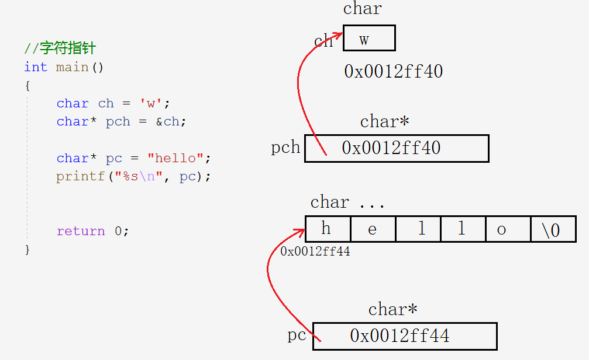

~~~c
char* pc = "hello";
printf("%c\n", *(pc + 1));//e
printf("%s\n", pc);//hello
printf("%s\n", pc + 1);//ello
~~~

> 字符串本质上还是在空间上连续存放，所以指针±整数同样有访问的效果。由此也可以看出`%s`的用法，把地址给`%s`会将其后的内容看作字符串并打印直到`\0` 。（所以我猜测%s的s是string的意思）

###### 字符指针的特点

**例题**

~~~c
char str1[] = "hello bit";
char str2[] = "hello bit";

char* str3 = "hello bit";
char* str4 = "hello bit";

if (str1 == str2)
    printf("str1 = str2\n");//1
else
    printf("str1 != str2\n");//2

if (str3 == str4)
    printf("str3 = str4\n");//3
else
    printf("str3 != str4\n");//4
~~~

`str1(3)==str2(4)`，比较的是二者其实位置地址是否相同。（地址才是真正判断二者是否相同的要素）

> 答案是2和3。因为1和2是用字符串初始化数组，3和4是指针指向常量字符串。
>
> - str1和str2是普通的数组，是在内存上开辟了两块空间不过存放了一样的数据。
> - str3和str4指向常量字符串，存放在内存的常量区，是不可被修改且具有唯一性即常量区只存放一个。所以str3和str4指向的都是同一个字符串。

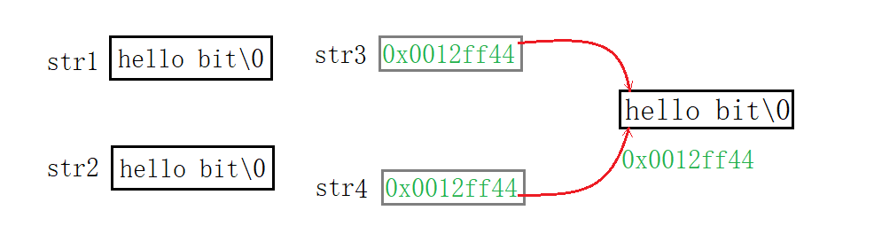

常量区的存储特点：存放在常量区的数据不可被修改，正因为不可修改所以存一份就够了。后期如果需要，使用的是同一数据。（数据还是同一个数据，只是用不同的指针维护）

**总结**

1. 常量字符串不可被修改，存放在内存的常量区。
2. 具有唯一性即常量区只存放一个。

##### 指针数组

###### 指针数组的定义

~~~c
int arr[10];//整型数组
char ch[5];//字符数组
float f[20];//浮点型数组
~~~

> 可见，元素类型也就是数组的“类型”。

~~~c
char* pch[5];
int* parr[10];
float* pf[20];
~~~

指针数组就是存放指针的数组。

~~~c
int arr[10];
int* arr[10];
~~~

整型数组的数组名`arr`，即首元素地址，是一级指针。

指针数组的数组名`parr`，也是首元素地址，不过其首元素为`int*`类型变量，所以`parr`就是二级指针。

###### 指针数组的使用

~~~c
int arr1[] = { 1,2,3,4,5 };
int arr2[] = { 2,3,4,5,6 };
int arr3[] = { 3,4,5,6,7 };

int* parr[] = { arr1,arr2,arr3 };

for (int i = 0; i < 3; i++) {
    for (int j = 0; j < 5; j++) {
        //1.
        printf("%d ", parr[i][j]);
        //2.
        printf("%d ", *(*(parr + i) + j));
    }
    printf("\n");
}
//答案
1 2 3 4 5
2 3 4 5 6
3 4 5 6 7
ps:
parr[i] <==> *(parr+i) 
*(parr[i]+j) <==> *(*(parr+i)+j) <==> (*parr+i)[j] <==> parr[i][j]
~~~

> 通过指针数组访问整型数组的每个元素。`parr[i][j]`和`*(*(parr+i)+j)`本质上是等价的。

~~~c
const char* pch[] = { "abcde", "bcdef", "cdefg" };
for (int i = 0; i < 3; i++) {
    //1.
    printf("%s", pch[i]);
    //2.
    printf("%s", *(pch + i));
    for (int j = 0; j < 5; j++) {
        //3.
        printf("%c", pch[i][j]);
        //4.
        printf("%c", *(*(pch + i) + j));
    }
    printf("\n");
}
~~~

> 打印字符串使用`%s`更简单，若要使用`%c`，就是得到每个字符串的起始地址，分别向后访问。

从这里也可以看出数组和指针的关系，我愿称之为`*`和`[]`的爱恨情仇！

&nbsp;

#### 数组指针

> 由前面的例子，不难得出，数组指针是指向数组的指针，是指针而非数组。

##### 数组指针的定义

~~~c
char ch = 'w';
char* pch = &ch;//字符地址存放在字符指针中

int a = 10;
int* pint = &a;//整型地址存放在整型指针中

float f = 0.0;
float* pf = &f;//浮点型地址存放在浮点型指针中
~~~

> 什么变量的地址存放在什么指针中。指针指向变量的类型，决定了指针的类型。顾名思义，数组指针指向的是数组。

递推可得，**数组的地址存放在数组指针中**。且数组指针的类型为数组的类型再加个`*` 。

> 下面那种定义方法是对的呢？

~~~c
int arr[10] = { 0 };
//1.
int* pa = arr;
//2.
&arr;//整个数组的地址
int* parr = &arr;
//3.
int* parr[10] = &arr;
//4.
int(*parr)[10] = &arr;
~~~

>
> 1. 取出的是首元素的地址，而非整个数组的地址
> 2. 整型指针应存放整型变量的地址，数组的地址无法存入整型指针中。
> 3. `[]`的优先级比`*`高，故`parr`先与`[]`结合成数组名，所以`parr`是个指针数组。

数组指针的类型由数组类型决定，先找出数组的类型`int[10]`（去掉名就是类型）。且不能让`[]`先与`parr`结合，所以用`()`先将`parr`和`*`结合，即成`int(*parr)[10]`。

> C语言规定`[]`必须再最后面，所以不可写成`int[10](*parr)`。

~~~c
int* parr[10];//指针数组
int(*parr)[10];//数组指针
~~~

我们前面强调过，**去掉名字就是类型**。所以`int[10]`是整型数组的类型，`int*[10]`是指针数组的类型，`int(*)[10]`是数组指针的类型。

###### &数组名和数组名

> 之前介绍过不止一遍，所以这次只说重点。

指针类型决定了指针±整数的步长。

~~~c
//首元素地址+1
printf("%p\n", arr);//0073FCA4
printf("%p\n", arr + 1);//0073FCA8
//整个数组地址+1
printf("%p\n", &arr);//0073FCA4
printf("%p\n", &arr + 1);//0073FCCC
~~~

1. 首元素地址就是整型指针+1，自然只能向后访问4shou个字节
2. 整个数组地址+1，即`int(*)[10]`型指针+1，向后访问了$int×10$即40个字节。

> `sizeof(arr)`也代表整个数组，现在去理解为什么`sizeof`里数组名代表的是整个数组呢？数组这种结构保存了数组的大小，`sizeof`求所占空间的长度，那自然要严谨一些了。

##### 数组指针的使用

> 遍历数组，使用数组或是指针作形参接收就行了。且所谓的用数组接收仅是理解层面，本质上都是指针。

~~~c
void Print1(int arr[], int sz) {
	for (int i = 0; i < sz; i++) {
		//printf("%d ", arr[i]); 
		printf("%d ", *(arr + i));
		
	}
}
void Print2(int* arr, int sz) {
	for (int i = 0; i < sz; i++) {
		printf("%d ", arr[i]);
		//printf("%d ", *(arr + i));
	}
}
int main() {
	int arr[10] = { 1,2,3,4,5,6,7,8,9,10 };
	int sz = sizeof(arr) / sizeof(arr[0]);
	Print1(arr, sz);
	Print2(arr, sz);
	return 0;
}
~~~

###### 反面用例

> 数组作实参，用数组或指针接收即可。数组指针使用对了很好用，但如果随便用可能会很别扭。下面先介绍强行使用数组指针的用法。

~~~c
//错误示范
void Print3(int(*pa)[10], int sz) {
	for (int i = 0; i < sz; i++) {
		//printf("%d ", pa[i]);
		printf("%d ", *(pa + i));
	}
}
~~~

> 将整个数组地址传过去，则用数组指针接收，然后呢，直接对`pa`解引用吗？

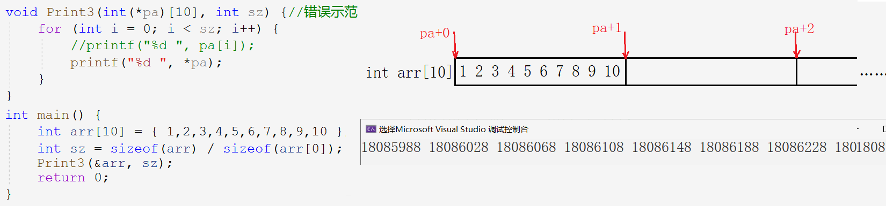

结果显然是错误的，从结果中也可以看出打印的是十进制下的地址，+1跳过40个字节。

> 这里笔者在学习的时候产生了个疑问，传过去数组的地址，为什么解一层引用后还是地址呢？
>
> `&arr`解引用`*`后相当于找到首元素的地址，可以理解为`&`和`*`相互抵消只剩下`arr`不就是首元素的地址嘛~

~~~c
void Print4(int(*pa)[10], int sz) {
	for (int i = 0; i < sz; i++) {
		printf("%d ", *(*(pa)+j));
	}
}
~~~

> 倘若我们把一维数组看作是二维数组第一行。由于二维数组在内存中是连续存放的，我们只打印二维数组的第一行，便可以避免上面的错误。

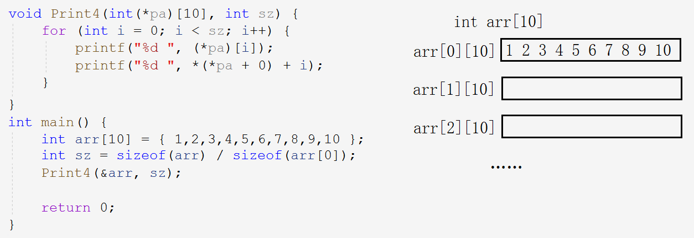

`*(pa)`相当于数组指针所指向数组的数组名。数组指针指向整个数组，将其看作二维数组并解引用得到一行的首元素，从而遍历访问。

###### 正面用例

> 从上面的例子也可以看出，**用数组指针访问二维数组**时，效果便不错。

~~~c
//二维数组传参,用二维数组接收
void Print1(int arr[3][5], int r, int c) {
	for (int i = 0; i < r; i++) {
		for (int j = 0; j < c; j++) {
			//printf("%d ", arr[i][j]);
			printf("%d ", *(*(arr + i) + j));
		}
		printf("\n");
	}
}
~~~

> 上面的例子，是正常二维数组传参，二维数组接收的情况。下面我们用数组指针接收。

~~~c
//二维数组传参,用数组指针接收
void Print2(int(*pa)[5], int r, int c) {
	for (int i = 0; i < r; i++) {
		for (int j = 0; j < c; j++) {
            //1.
            printf("%d ", pa[i][j]);
            //2.
			printf("%d ", *(*(pa + i) + j));
		}
		printf("\n");
	}
}
int main()
{
	int arr[3][5] = { 1,2,3,4,5, 2,3,4,5,6, 3,4,5,6,7 };
	Print2(arr, 3, 5);//二维数组首元素是首行
    
	return 0;
}
~~~

- 把二维数组想象成**一个拥有三个元素的一维数组**（每个元素也为一维数组），即一维数组的一维数组。
- 由于其每个元素是有5个元素的一维数组，数组指针定义为`int(*p)[5]`，指向首行这个“一维数组”。（传参传的是数组名）
- 第一层循环用于“跳行”，即每次跳过5个元素。第二层循环遍历每行“一维数组”。

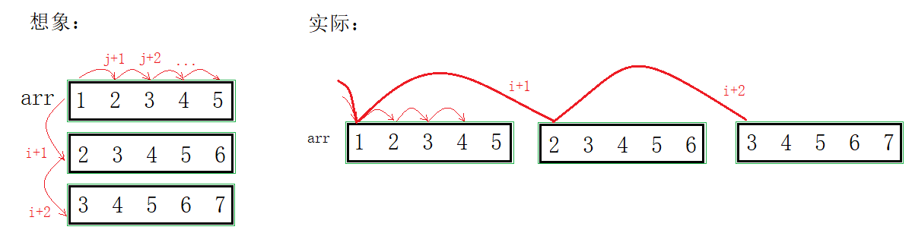

> 1. 用二维数组和数组指针接收的都是首行地址。
> 2. 数组指针的类型`int(*)[5]`，和二维数组首元素地址的类型相同。

故可得，二维数组首元素地址和数组指针是等价的，即**数组指针**`pa`**就是数组名**。

二维数组首元素为其首行，相当于一个一维数组，该一维数组的地址类型为`int(*)[5]`。且实参为二维数组名，降级为指向首行的指针，所以它是数组指针，类型为`int(*)[5]`。

> 数组指针指向二维数组，才是使用数组指针的正确示范。

###### Example

> 下列示例分别是什么？

~~~c
//1.
int arr[5];
//2.
int *pa1[5];
//3.
int (*pa2)[10];
//4.
int (*pa3[10])[5];
~~~

1. 整型数组
2. 存放整型指针的数组

> `*`靠左靠右无所谓，`pa1`先和`[]`结合为数组，剩下`int*`为数组元素类型。

3. 指向整型数组的指针

> `(*pa2)`，`*`先和`pa2`结合为指针，剩下`int[10]`，指向的是元素个数为10的整型数组。

4. 存放数组指针的数组

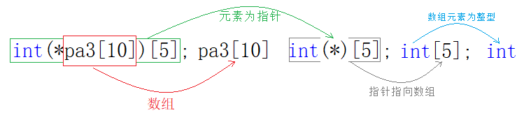

> `pa3`先和`[10]`结合为数组，剩下`int(*)[5]`是指向数组的指针为数组的元素。所以是个元素个数为10的数组指针数组。
>
> 逆向思考，有整型数组`arr[5]`和指向该数组的类型为`int(*)[5]`的数组指针，还有数组指针数组`pa3[10]`用于存放该数组指针。

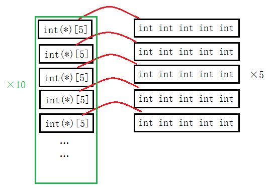

###### 类型辨别方法

1. 名称先和`[]`结合则为数组，只去掉数组名就是数组类型，去掉`[n]`和数组名便是其元素的类型。
2. 名称先和`*`结合则为指针，只去掉指针名就是指针类型，去掉`*`和指针名便是指向的变量的类型。

&nbsp;

#### 数组传参和指针传参

> 实践之中不免会碰到数组和指针作函数参数而如何设计形参的问题。

##### 一维数组传参

> 一维数组传参，下列接收方式是否可行呢？

~~~c
//1.
void test(int arr[]) 
{}
//2.
void test(int arr[10]) 
{}
//3.
void test(int* arr) 
{}
int main()
{	
	int arr[10] = { 0 };
	test(arr);
	return 0;
}
~~~

1. 数组传参数组接收，可行但其实都会降级优化成指针，编译器不会真正创建一个数组。

2. 由于形参数组形同虚设，所以数组大小无意义，任意大小或无。（有歧义）

3. 数组传参本质就是首元素地址，首元素类型为`int`，所以指针的类型为`int*`。

> 所以可以看出`[]`和`*()`是等价的。我愿称之为`*`和`[]`的爱恨情仇！（‐＾▽＾‐）

~~~c
//1.
void test2(int* arr[2])
{}
//2.
void test2(int** arr) 
{}
int main()
{	
	int* arr2[10] = { 0 };
	test2(arr2);
	return 0;
}
~~~

指针数组，每个元素类型为`int*`，故用二级指针接收数组名。

> 一维数组传参，数组和指针接收。

##### 二维数组传参

~~~c
//1.
void test(int arr[3][5]) 
{}
//2.
void test(int arr[][])
{}
//3.
void test(int arr[][5])
{}
int main() {
	int arr[3][5] = { 0 };
	test(arr);
}
~~~

- 二维数组传参用二维数组接收，**行可省略，但列不可以**。

~~~c
//4.
void test(int* arr)
{}
//5.
void test(int* arr[5])
{}
//6.
void test(int(*arr)[5])
{}
//7.
void test(int** arr)
{}
int main() {
	int arr[3][5] = { 0 };
	test(arr);
}
~~~

4. 整型指针接收的应该是整型变量的地址，而二维数组数组名为首行的数组地址。
5. 指针数组和二维数组无关。
6. 二维数组传参用首行数组大小的数组指针接收。
7. 二级指针和二维数组无关。

- 二维数组数组名`arr`为首行“一维数组”的地址，数组的地址用数组指针接收。

> `int(*)[5]`型数组指针指向元素个数为5的一维数组。指针+1访问到下一行，每次跳一行。再解一层引用访问一行里每个元素。

##### 一级指针传参

> 反向思考，若函数形参为指针，传参时实参可以如何设计呢？

~~~c
void test(int* ptr, int sz)
{}
void test(int arr[],int sz)
{}
int main()
{
    //1.
    int a = 10;
    test(&a);
    //2.
	int arr[10] = { 0 };
	test(arr);
	return 0;
}
~~~

- 一级指针传参，形参用指针和数组都行，但不提倡用一维数组。
- 若形参为指针，实参也可以是指针（地址），也可以是数组。

##### 二级指针传参

> 当二级指针作参数时，形参如何设计呢？

~~~c
void test(int** pp) {
	printf("%d\n", **pp);
}
void test(int* arr[]) {//用法不好
	printf("%d\n", *arr[0]);
}
int main() {
	int a = 10;
	int* p = &a;
	int** pp = &p;
	test(pp);
	return 0;
}
~~~

- 当二级指针作函数参数时，形参可以是二级指针和指针数组。

> 当形参为二级指针，实参可以传什么呢？

~~~c
void test(int** pp) {
	printf("%d\n", **pp);
}
int main() {
	int a = 10;
	int* p = &a;
	int** pp = &p;
	int* arr[10] = { &a };
    //1.
	test(&p);
    //2.
	test(pp);
    //3.
	test(arr);
	return 0;	
}
~~~

- 当形参为二级指针时，实参可以是：二级指针（一级指针地址），指针数组首元素的地址。

&nbsp;

#### 函数指针

##### 函数指针的定义

> 整型指针存放整型的地址；数组指针存放数组的地址；那么类比可得，函数指针存放函数的地址。

显然，函数指针指向函数，存放函数的地址。搞懂函数指针，先了解函数的地址。

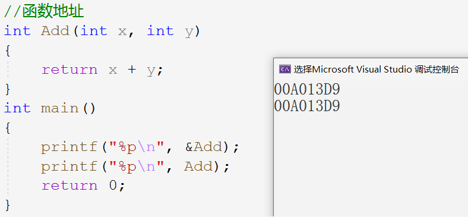

**&函数名或函数名代表函数地址**，与&数组名和数组名略有不同，&函数名和函数名完全一致。

> 函数的地址必然要放到函数指针里，函数指针的类型该如何写呢？（以Add函数为例）

~~~c
//整型指针
int* pa = &a;
//字符指针 
char* pc = &ch;
//数组指针
int(*pa)[10] = &arr;
//函数指针 - 存放函数地址
int(*pf)(int, int) = &Add;
~~~

###### 函数指针的类型

~~~c
int Add(int x, int y);
//1.
int(*pf)(int, int) = &Add;
//2.
int *pf(int, int) = &Add;
~~~

> 倘若，去掉括号`int* pf(int, int)`，`pf`就变成函数名，返回类型是`int*`。所以指针必须带括号。

前文已交代，指针，去掉指针名和`*`就是指针所指向的变量类型。

- 整型指针，去掉`*`和指针名，即为整型变量类型`int`。字符指针，为字符类型`char`。数组指针，去掉后为数组类型`int[10]`。
- 函数指针，去掉`*`和指针名，即为函数的类型`int(int,int)`。

**总结**

- 去掉指针名`pf`，即为指针类型`int(*)(int, int)`
- 去掉指针名`pf`和`*`，即为指针所指向的函数类型为`int(int, int)`

##### 函数指针的使用

> 计算机硬件程序经常通过调用地址的方式来调用函数，因此需要使用函数指针调用函数。

~~~c
int Add(int x, int y)
{
	return x + y;
}
int main()
{
    //1.
    int(*pf)(int, int) = &Add;//函数指针指向Add函数
    //2.
    int(*pf)(int, int) = Add;
	
    //1.
	int ret = (*pf)(2, 3);
	//2.
    int ret = pf(2, 3);
	
    printf("%d\n", ret);
	return 0;
}
~~~

> 前面已经交代，&函数名和函数名都是函数的地址，完全等价。所以两种初始化函数指针的方式都可以。

既然函数名`Add`可以直接赋值给函数指针`pf`，说明二者等价。函数指针名`pf`不解引用也可以使用，`*`在此处形同虚设，甚至于不写或写多个都并无大碍，仅为理解。

> 既然函数名也是函数地址，所以对其解引用也是可以的。我们甚至可以这样写，但仅限娱乐，没有必要。

~~~c
Add(2, 3);//1
(*Add)(2, 3);//2
(*&Add)(2, 3);//3
~~~

###### Example

> 解释下列代码

~~~c
//1.
(*(void(*)())0)();
//2.
void (*signal(int, void(*)(int)))(int);
~~~

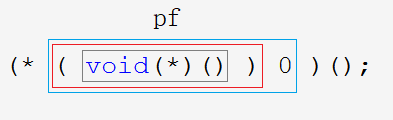

1. `void(*)()`是函数指针类型，放在`( )0`中，也就是把0强制转换成地址，该地址处存放一个函数其类型为`void(*)(void)`。

2. 这样`(void(*)())0`就变成了指针，指向该地址的函数，且对其解引用访问此函数。

3. `(*(void(*)())0)`也相当于`(*pf)`，通过函数指针解引用代替函数名，函数名后面带上`();`，相当于`(*pf)();`也就是一次不传参的**函数调用**。

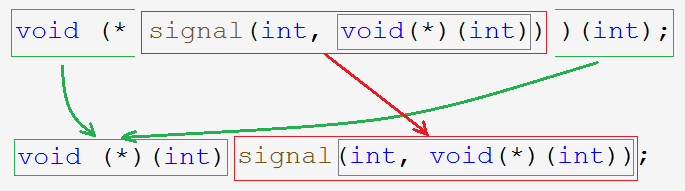

1. `signal`先和`()`结合，说明`signal`为函数名，其后`(int, void(*)(int))`，为其参数列表。
2. 去掉函数名称和参数列表，剩下的`void(*)(int)`就是返回类型，所以是一次**函数声明**。

~~~c
void (* signal(int, void(*)(int)) ) (int);

typedef void(* pf_t)(int);//typedef简化代码
pf_t signal(int, pf_t);
~~~

&nbsp;

#### 函数指针数组

~~~c
//整型数组 - 存放整型变量
int arr[10];
//字符数组 - 存放字符变量
char ch[5];
//指针数组 - 存放指针变量
int* arr[10];
//函数指针数组 - 存放函数指针
int(*pfar[10])(int, int);
~~~

> 指针数组存放指针变量，函数指针数组存放函数指针，故元素类型为函数指针类型。

##### 函数指针数组的定义

~~~c
int Add(int x, int y) {//int(*)(int,int)
	return x + y;
}
int Sub(int x, int y) {//int(*)(int,int)
	return x - y;
}
int Mul(int x, int y) {//int(*)(int,int)
	return x * y;
}
int Div(int x, int y) {//int(*)(int,int)
	return x / y;
}
int main() {
	//函数指针数组 - pfArr
	int(*pfArr[4])(int, int) = { Add,Sub,Mul,Div };
	return 0;
}
~~~

> 类型相同的函数，存放在同一个函数指针数组中。一般功能相似的函数，其类型也相同。

##### 函数指针数组的使用

> 利用函数指针数组实现计算器，以简化调用过程。

###### 转移表

~~~c
//计算器实现1.0
void menu() {
	printf("**********************************\n");
	printf("*****  1.Add  ******  2.Sub  *****\n");
	printf("*****  3.Mul  ******  4.Div  *****\n");
	printf("************  0.exit  ************\n");
	printf("**********************************\n");
}
int main() {
	int (*pfArr[10]) (int, int) = { 0,Add,Sub,Mul,Div };//数组下标和选项序号匹配
	int input = 0;
	int a = 0;
	int b = 0;
	do {
		menu();
		printf("请选择:>");
		scanf("%d", &input);
		if (0 <= input && input <= 4) {
			if (input == 0) {
				printf("退出游戏\n");
				break;
			}
			else {
				printf("请输入操作数\n");
				scanf("%d %d", &a, &b);
				printf("ret == %d\n", pfArr[input](a, b));
				break;
			}
		}
		else {
			printf("输入错误\n");
			break;
		}
	} while (input);
	return 0;
}
~~~

> 函数指针数组实现不同选择情况下，通过函数地址“跳转”到不同的函数的功能。

这样的函数指针数组成为**转移表**。（跳转功能）

###### 回调函数

> 若不想舍弃switch语句，还可以这样简化代码3.0，代价为创建全局变量。若不想创建全局变量，可以使用2.0

~~~c
/******
* 计算器实现
* 2.0
******/
void Calc(int (*pf)(int,int)) {
	int a = 0;
	int b = 0;
	printf("请输入操作数:>");
	scanf("%d %d", &a, &b);
	printf("%d\n", pf(a, b));
}
int main() {
	int input = 0;
	do {
		menu();
		printf("请选择:>");
		scanf("%d", &input);
		switch (input) {
		case 0:
			printf("退出成功\n");
			break;
		case 1:
			Calc(Add);
			break;
		case 2:
			Calc(Sub);
			break;
		case 3:
			Calc(Mul);
			break;
		case 4:
			Calc(Div);
			break;
		default:
			printf("请重新选择\n");
			break;
		}
	} while (input);
	return 0;
}

/******
* 计算器实现
* 3.0
******/
int (*pfArr[10])(int, int) = { 0,Add,Sub,Mul,Div };
int input = 0;

void Call() {
	int a = 0;
  int b = 0;
	printf("请输入操作数:>");
	scanf("%d %d", &a, &b);
	printf("%d\n", pfArr[input](a, b));
}
int main() {
	do {
		menu();
		printf("请选择:>");
		scanf("%d", &input);
		switch (input) {
		case 0:
			printf("退出成功\n");
			break;
		case 1:
		case 2:
		case 3:
		case 4:
			Call();
			break;
		default:
			printf("请重新选择\n");
			break;
		}
	} while (input);
	return 0;
}
~~~

如下图所示，被通过函数指针调用的函数叫做**回调函数**，回调函数即使第三方调用调用函数的参数也在其中被调用。

> 若想在调用函数中随条件变化而调用不同的函数，就必须使用回调函数的方法：调用函数中使用函数指针，指向不同函数。回调函数在大型工程中显得非常方便。

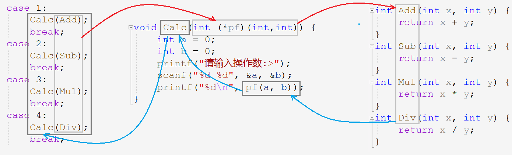

&nbsp;

#### 指向函数指针数组的指针

~~~c
int arr[10];
int(*parr)[10] = &arr;//整型数组指针
char(*pch)[10] = &ch;//字符数组指针
//指向整型数组指针的指针
int(*(*pparr))[10] = &parr;
//指向字符数组指针的指针
char(*(*ppch))[10] = &pch;

//函数1.
int Add(int x, int y) {
	return x + y;
}
//函数指针2.
int (*pf)(int, int) = Add;
//函数指针数组3.
int (*pfArr[10])(int, int) = { Add };
//指向函数指针数组的指针4.
int(*(*ppfArr)[10])(int, int) = &pfArr;
~~~

> 前面已经交代，指针去掉`*`号和指针名，就是指向的变量类型；去掉指针名就是指针的类型。
>
> 反过来，定义数组指针，需要得到指针所指向的数组的类型。1.先写出指针名，在其前面加`*`；2.写出数组的类型`int()[10]`

定义指向函数指针数组的指针，依次写出如下内容：

1. 函数 —— 得到函数类型：`int(int, int)`
2. 函数指针 —— 得到函数指针类型：`int(*)(int, int)`
3. 函数指针数组 —— 得到函数指针数组的类型：`int(*[10])(int, int)`
4. 指向函数指针数组的指针

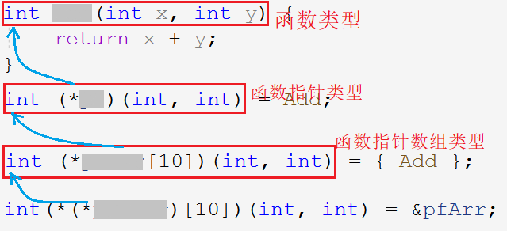

从后往前看，指向函数指针数组的指针去掉`*`和指针名就是函数指针数组的类型，函数指针数组去掉`*`和指针名就是函数指针类型，函数指针去掉`*`和指针名就是函数类型。

> 在研究下去就没有必要了，指针放在数组里，数组被指针所指向 ……
