## 指针进阶续

> 续前文《C语言进阶：指针进阶》

#### 回调函数

##### 回调函数定义

回调函数：通过函数指针调用的函数，或者说使用函数指针调用函数这样的机制被称为回调函数。回调函数不由实现方直接调用，而是作为特殊条件下的响应。

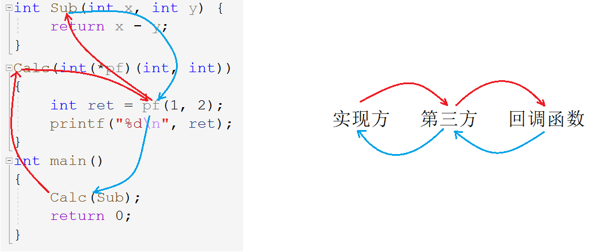

> 概念无关紧要，理解并熟练运用这种方法才更为重要。

##### 快速排序 `qsort`

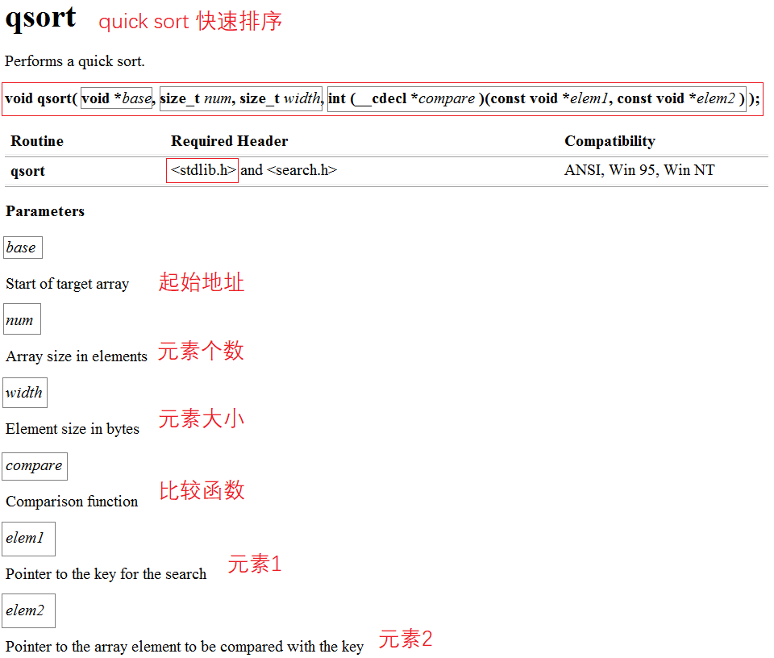

###### `qsort`函数逻辑

~~~c
void qsort(void* base, size_t num, size_t width, int (*cmp)(const void* e1, const void* e2));
~~~

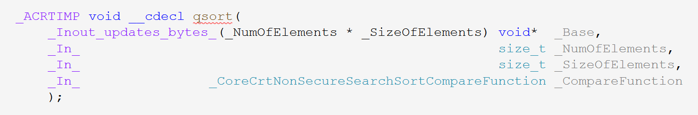

> `qsort`无返回值，有四个参数。分别为`base`：起始地址，`num`：元素个数，`width`：元素大小以及`compare`：比较函数。可与冒泡排序作对比。 

~~~c
//冒泡排序
void Bubble_sort(int arr[], int sz) {
	for (int i = 0; i < sz - 1; i++) { 
		for (int j = 0; j < sz - 1 - i; j++) { 
			//比较函数
			if (arr[j] > arr[j + 1]) {
				int tmp = arr[j];
				arr[j] = arr[j + 1];
				arr[j + 1] = tmp;
			}
        }
    }
}
~~~

> 与冒泡排序作对比发现，冒泡排序仅需起始地址和元素个数即可，暗含了其他信息。由于过度具体化，冒泡排序只能排序整型数组，且比较函数过于简单无需单独列出。

因为`qsort`排序可适用于多种类型如浮点型，字符型，自定义类型的数据，故无法规定具体类型，所以需要多个参数去描述元素的基本信息。

`qsort`之所以能够适应多种数据，是因为参数`void* base`再搭配上`num`和`width`就描述出任意一种类型。

> 为什么将参数`base`的类型定义为`void*`呢？如下述代码所示。

~~~c
char* p1 = &a;
//从int*到char*类型不兼容
char* p2 = &f;
//从float*到char*类型不兼容
void* p1 = &a;
void* p2 = &f;
~~~

> 确定类型的地址之间直接赋值会提示类型不兼容，强制转化也可能会导致精度丢失。

故使用无（具体）类型`void*`，又称通用类型，即**可以接收任意类型的指针，但是无法进行指针运算**（解引用，$±$整数等）。

~~~c
p1++;   *p1;   p1 - p2;   p1 > p2;//表达式必须是指向完整对象类型的指针
~~~

1. `base`：用于存入数据的起始地址。类型定义为`void*`，可接受任意类型的指针。

2. `num`：待排序的元素个数。

3. `width`：元素宽度，所占字节大小。

> 明确了排序的起始位置，元素个数和元素大小，貌似已经够了。但是并无法排序所有类型，因此必须自定义一个抽象的比较函数指定元素的比较方式。

4. `cmp`：比较函数，用于指定元素的比较方式。

   - `elem1`小于`elem2`，返回值小于0
   - `elem1`大于`elem2`，返回值大于0
   - `elem1`等于`elem2`，返回值为0
5. `elem1`，`elem2`：进行比较的两个元素的地址作参数。

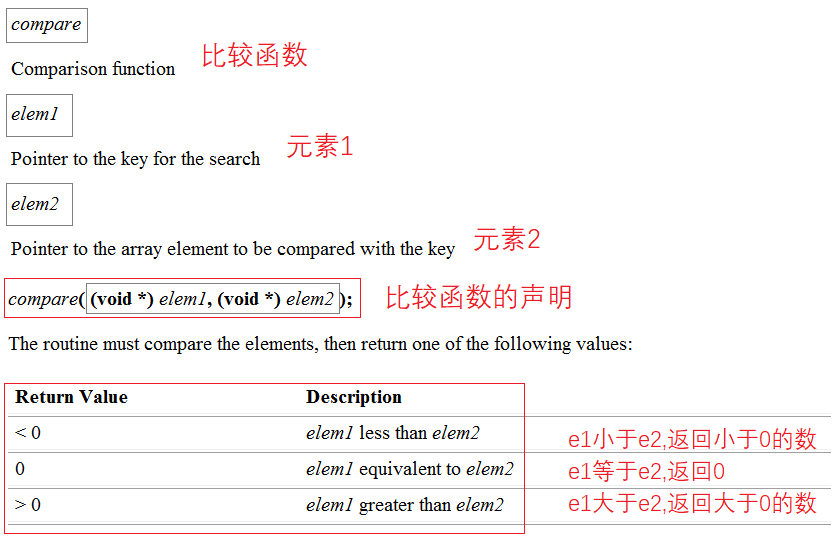

`qsort`可以说是一个半库函数半自定义函数。自定义在于其函数最后一个参数为比较函数，该函数内部实现自由，但返回值必须按照规定返回相应的数值。

###### 小结

需要`qsort`函数排序各种类型的数据，

- 故`base`起始地址不可为固定的指针类型，只能用`void*`。
- 既然是通用类型还要明确比较元素的个数和大小。
- 最后，排序最核心的比较大小，为适应不同的类型元素必须自定义专门的比较函数。

###### `qsort`实现冒泡排序

~~~c
//比较函数：整型
#include <stdlib.h>
int int_cmp(const void* e1, const void* e2) {
	return *(int*)e1 - *(int*)e2;
}
int main() {
	int arr[10] = { 9,8,7,6,5,4,3,2,1,0 };
	int sz = sizeof(arr) / sizeof(arr[0]);
	qsort(arr, sz, sizeof(arr[0]), int_cmp);
	return 0;
}
~~~

比较函数`int_com`不需要传参，作为回调函数由`qsort`直接调用。比较函数的传参过程由`qsort`内部实现。

###### `qsort`实现结构体排序

~~~c
#include <stdlib.h>
struct stu {
	char* name;
	short age;
	float score;
};
//按照成绩排序
int score_cmp(const void* e1, const void* e2) {
	//1.升序
    return ((struct stu*)e1)->score - ((struct stu*)e2)->score;
	//2.降序
    return ((struct stu*)e2)->score - ((struct stu*)e1)->score;
}
//按照名字排序
int name_cmp(const void* e1,const void* e2) {
	return strcmp(((struct stu*)e1)->name, ((struct stu*)e2)->name);
}
int main() {
	struct stu s[3] = { 
        { "张三", 22, 99.5f },{ "李四", 21, 66.4f },{ "王五", 18, 80.1f } 
    };
	int sz = sizeof(s) / sizeof(s[0]);
	//1.
    qsort(s, sz, sizeof(s[0]), name_cmp);
	//2.
    qsort(s, sz, sizeof(s[0]), score_cmp);
	return 0;
}
~~~

由此可得，提取出一个比较函数，具体交换的方式由`qsort`内部实现。

###### 模拟实现`qsort`

> 用`qsort`的函数逻辑，实现冒泡排序。

~~~c
//打印函数
void print_arr(int arr[],int sz) {
	for (int i = 0; i < sz; i++) {
		printf("%d ", arr[i]);
	}
}
//交换函数
void Swap(char* buf1, char* buf2, size_t width) {
	for (size_t i = 0; i < width; i++) {//宽度次
		char tmp = *buf1;
		*buf1 = *buf2;
		*buf2 = tmp;
		buf1++;
		buf2++;
	}
}
//比较函数
int cmp(const void* e1, const void* e2) {
	return *(int*)e1 - *(int*)e2;
}
//排序函数
void my_bubble_sort(void* base, size_t num, size_t width, int(*cmp)(const void* e1, const void* e2)) {
	for (size_t i = 0; i < num - 1; i++) {
		for (size_t j = 0; j < num - 1 - i; j++) {
			if (cmp((char*)base + j * width, (char*)base + (j + 1) * width) > 0) {//以字节为单位
				Swap((char*)base + j * width, (char*)base + (j + 1) * width, width);
			}
		}
	}
}
int main() {
	int arr[10] = { 9,8,7,6,5,4,3,2,1,0 };
	int sz = sizeof(arr) / sizeof(arr[0]);
	my_bubble_sort(arr, sz, sizeof(arr[0]), cmp);
	print_arr(arr, sz);

	return 0;
}
~~~

地址统一强转为`char*`，以最小字节单位一个字节进行比较和交换，使代码更具有普适性。

如果需要排序结构体则只需要在前文代码中主函数里替换`my_qsort`且把比较函数替换`Name_cmp`即可。

~~~c
//1.
my_qsort(s, sz, sizeof(s[0]), name_cmp);
//2.
my_qsort(s, sz, sizeof(s[0]), score_cmp);
~~~

&nbsp;

#### 指针和数组笔试题解析

##### 数组辨析题

> 注意点。数组名代表整个数组：
>
> 1. `sizeof(数组名)`
> 2. `&数组名`
>
> 除此以外，数组名都是代表首元素地址。

###### 一维数组

~~~c
int a[] = { 1,2,3,4 };
printf("%d\n", sizeof(a));//16
printf("%d\n", sizeof(a + 0));//4/8
printf("%d\n", sizeof(*a));//4
printf("%d\n", sizeof(a + 1));//4/8
printf("%d\n", sizeof(a[1]));//4
printf("%d\n", sizeof(&a));//4/8
printf("%d\n", sizeof(*&a));//16
printf("%d\n", sizeof(&a + 1));//4/8
printf("%d\n", sizeof(&a[0]));//4/8
printf("%d\n", sizeof(&a[0] + 1));//4/8
~~~

1. 只有数组名单独放在`sizeof`内部才是整个数组。

   `a+0`放在`sizeof`内部表示首元素地址+0。

2. 只要是地址，不管是什么类型的地址大小都是4/8

   基本类型指针，数组指针，函数指针大小都是4/8个字节，故`sizeof(&a)=sizeof(int(*)[4])=4`。`sizeof()`求指针所占字节而不是解引用访问权限大小。

3. `*`和`&`在一起会抵消。

   `sizeof(*&a)`，&a为整个数组的地址类型`int(*)[4]`，解引用后`int[4]`大小为16。

###### 字符数组

~~~c
char arr[] = { 'a','b','c','d','e','f' };
printf("%d\n", sizeof(arr));//6
printf("%d\n", sizeof(arr + 0));//4/8
printf("%d\n", sizeof(*arr));//1
printf("%d\n", sizeof(arr[1]));//1
printf("%d\n", sizeof(&arr));//4/8
printf("%d\n", sizeof(&arr + 1));//4/8
printf("%d\n", sizeof(&arr[0] + 1));//4/8

printf("%d\n", strlen(arr));//随机值x
printf("%d\n", strlen(arr + 0));//随机值x
printf("%d\n", strlen(*arr));//报错
printf("%d\n", strlen(arr[1]));//报错
printf("%d\n", strlen(&arr));//随机值x
printf("%d\n", strlen(&arr + 1));//随机值x-6
printf("%d\n", strlen(&arr[0] + 1));//随机值x-1
~~~

1. `sizeof(*arr)`，`*arr`对首元素地址解引用，计算首元素所占空间大小。

   `strlen(*arr)`，`*arr`依然是首元素，`strlen`把a也就是97当成地址，访问到非法内存所以报错。

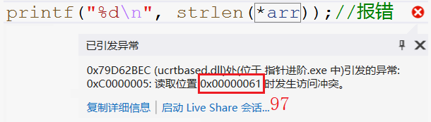

2.`strlen(&arr)`虽然是整个数组的地址，但依然是从首元素开始的，所以`strlen`依然从第一个元素开始找。

​	`strlen(&arr+1)`，先计算`&arr+1`然后再传参过去，也就是跳过了整个数组去找。

**`sizeof`和`strlen`的区别**

- `sizeof` — 操作符 — 以字节为单位，求变量或类型所创建变量的所占空间的大小

> `sizoef`不是函数，计算类型是必须带上类型说明符`()`。`sizoef`内容不参与运算，在编译期间便转化完成。

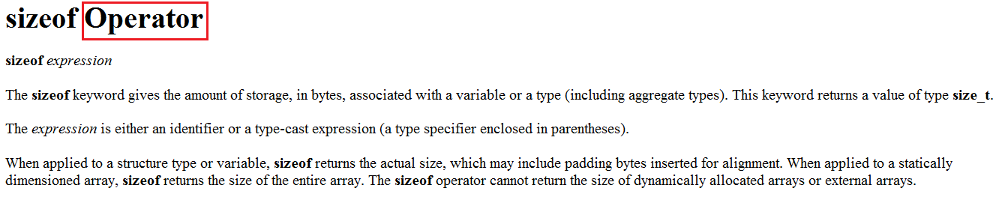

- `strlen` — 库函数 — 求字符串长度即字符个数，遇`\0`停止。

> 库函数，计算字符串长度没有遇到`\0`就会一直持续下去。返回类型`size_t`，参数`char* str` ，接收的内容都会认为是`char*`类型的地址。

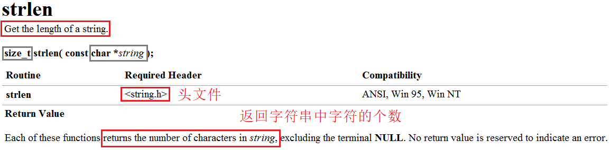

一个求变量所占空间，一个求字符串大小，二者本身是没有关系的，但总有人把二者绑在一起“混淆视听”。

###### 字符串数组

首先明确二者的区别：

~~~c
//1.字符初始化数组
char arr[] = { 'a','b','c','d','e','f' };//[a] [b] [c] [d] [e] [f]
//2.字符串初始化数组
char arr[] = "abcdef";//[a] [b] [c] [d] [e] [f] [\0]
~~~

> 字符初始化数组，存了什么元素数组里就是什么元素。而字符串初始化数组，除了字符串中可见的字符外，还有字符串末尾隐含的`\0`。`\0`存在于字符串的末尾，是自带的，虽不算字符串内容，但是字符串中的字符。

~~~c
char arr[] = "abcdef";
printf("%d\n", sizeof(arr));//7
printf("%d\n", sizeof(arr + 0));//4/8
printf("%d\n", sizeof(*arr));//1
printf("%d\n", sizeof(arr[1]));//1
printf("%d\n", sizeof(&arr));//4/8
printf("%d\n", sizeof(&arr + 1));//4/8
printf("%d\n", sizeof(&arr[0] + 1));//4/8

printf("%d\n", strlen(arr));//6
printf("%d\n", strlen(arr + 0));//6
printf("%d\n", strlen(*arr));//报错
printf("%d\n", strlen(arr[1]));//报错
printf("%d\n", strlen(&arr));//6
printf("%d\n", strlen(&arr + 1));//随机值
printf("%d\n", strlen(&arr[0] + 1));//5
~~~

1. `sizeof`计算变量的长度，变量可以是数组，数组元素以及指针。数组就是整个数组的大小，数组元素则是数组元素的大小，指针大小都为4/8。
2. `strlen`把传过来的参数都当作地址，是地址就从该地址处向后遍历找`\0`，不是地址当作地址非法访问就报错。

###### 常量字符串

~~~c
char* p = "abcdef";
~~~

> `"abcdef"`是常量字符串，用一个字符指针`p`指向该字符串，实质是`p`存入了首字符`a`的地址。由于字符串在内存中连续存放，依此特性便可以遍历访问整个字符串。

~~~c
char* p = "abcdef";
printf("%d\n", sizeof(p));//4/8
printf("%d\n", sizeof(p + 1));//4/8
printf("%d\n", sizeof(*p));//1
printf("%d\n", sizeof(p[0]));//1
printf("%d\n", sizeof(&p));//4/8
printf("%d\n", sizeof(&p + 1));//4/8
printf("%d\n", sizeof(&p[0] + 1));//4/8

printf("%d\n", strlen(p));//6
printf("%d\n", strlen(p + 1));//5
printf("%d\n", strlen(*p));//报错
printf("%d\n", strlen(p[0]));//报错
printf("%d\n", strlen(&p));//随机值
printf("%d\n", strlen(&p + 1));//随机值
printf("%d\n", strlen(&p[0] + 1));//5
~~~

1. `p`,`p+1`,`&p`,`&p+1`,`&p[0]+1`都是地址对于地址`sizeof`都求得4/8，`*p`,`p[0]`是数组元素，`sizeof`计算元素大小。

2. `p`,`p+1`,`&p`,`&p+1`,`&p[0]+1`都是地址对于地址`strlen`都向后遍历访问找`\0`，`*p`,`p[0]`是数组元素其对于ASCII值当作地址会访问到非法内存。

   `p`,`p+1`,`&p[0]+1`都是字符串字符的地址，`&p`,`&p+1`都是指针变量`p`或其之后的地址。

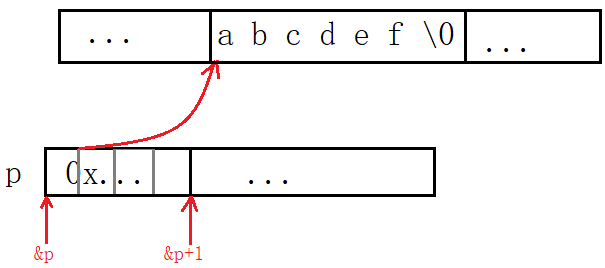

###### 二维数组

访问数组元素的方式是`数组名+[j]`。若将二维数组的每一行可以看成一个一维数组，则`a[0],a[1],a[2]`可以看成“每行“的数组名，和一维数组的数组名具有同样的效果。

> 1. 数组名单独放在`sizeof()`内部代表整个数组
> 2. `&`数组名同样代表整个数组（每行的数组名同样适用）

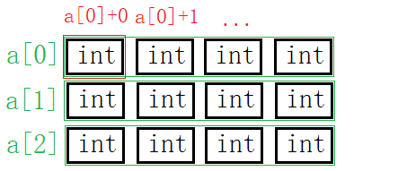

~~~c
int a[3][4] = { 0 };
printf("%d\n", sizeof(a));//12X4=48
printf("%d\n", sizeof(a[0][0]));//4
printf("%d\n", sizeof(a[0]));//16
printf("%d\n", sizeof(a[0] + 1));//4/8
printf("%d\n", sizeof(*(a[0] + 1)));//4
printf("%d\n", sizeof(a + 1));//4/8 - 第二行地址不代表第二行数组名
printf("%d\n", sizeof(*(a + 1)));//16
printf("%d\n", sizeof(&a[0] + 1));//4/8 - 第二行地址不代表第二行数组名
printf("%d\n", sizeof(*(&a[0] + 1)));//16 - 第二行数组地址解引用为数组名
printf("%d\n", sizeof(*a));//16
printf("%d\n", sizeof(a[3]));//16
~~~

- 对于二维数组来说，`sizeof(a[0])`求首行的整个数组大小。若是`sizeof(a[0]+1)`代表首行数组名没有单独放在`sizeof()`内部，故`a[0]`退化成了首元素地址。
- `sizeof(a+1)`代表第二行的地址仅为地址，但并不能第二行该“一维数组”的数组名，不可与`sizeof(a[1])`混淆。`&a[1]`等价于`a+1`。
- `sizeof(*(a+1))`，对第二行的地址解引用，相当于`sizeof(int[4])`。
- `*(&a[0]+1)`第二行数组地址解引用为数组名。**数组地址解引用代表整个数组，相当于数组名。切莫将数组地址和数组名混淆。**（`*&arr=arr`）

**总结**

搞清楚二维数组数组名的意义，必须搞清楚如下变量的含义。

~~~c
a[0]//首行数组名
a[0] + 1//首元素地址+1为第二个元素地址
&a[0] + 1//首行地址+1为第二行数组地址（a+1）
a//二维数组名
a + 1//首行地址+1为第二行数组地址
&a + 1//数组地址+1为第二个数组地址
*(a + 1) <=> *(&a[0] + 1)//第二行数组地址解引用为数组名
~~~

1. `a`是二维数组名，`a[0]`是首行数组名。
2. 参与运算后`a`退化为首行地址，`a[0]`退化为首元素地址。
3. `&a+1`跳过一个二维数组，`&a[0]+1`跳过一个一维数组。

&nbsp;

##### 指针笔试题

###### Example 1

~~~c
int main()
{
	int a[5] = { 1, 2, 3, 4, 5 };
	int* ptr = (int*)(&a + 1);
	printf("%d,%d", *(a + 1), *(ptr - 1));
	return 0;
}
//程序的结果是什么？
~~~

指针运算要考虑指针类型，`&a+1`跳过了`int[4]`的长度，得到这个位置的地址后指针转化成`int*`型，此时再+1就只能跳过一个`int`。

本题考察指针类型决定指针±整数的长度。

###### Example 2

~~~c
//由于还没学习结构体，这里告知结构体的大小是20个字节
struct Test
{
	int Num;
	char* pcName;
	short sDate;
	char cha[2];
	short sBa[4];
}*p;
//假设p 的值为0x100000。 如下表表达式的值分别为多少？
int main()
{
    p = 0x10000000;
	printf("%p\n",  (struct Test*)p + 0x1);
	printf("%p\n", (unsigned long)p + 0x1);
	printf("%p\n", (unsigned int*)p + 0x1);
	return 0;
}
~~~

p本是`struct Test*`的指针，后分别强制转换成`unsigned long`和`unsigned int*`类型分别+1跳过多少字节。`struct Test*`的指针+1跳过一个`struct Test`字节长度。`unsigned long`为整数类型+1即整数+1，不属于指针运算。

###### Example 3

~~~c
int main()
{
	int a[4] = { 1, 2, 3, 4 };
	int* ptr1 = (int*)(&a + 1);
	int* ptr2 = (int*)((int)a + 1);
	printf("%x,%x", ptr1[-1], *ptr2);
	return 0;
}
~~~

`ptr1`和`ptr2`都是把不同的意义的变量强转成`int*`类型的地址。先进行一系列的操作后再读取该地址处的后4个字节。

> `&a`类型为`int(*)[4]`故+1跳过1个数组；`a`首先为首元素地址强转为`int`型整数再+1执行整数加法，由于内存以字节为单位，一个字节一个地址，故+1相当于下一个字节的地址。最后都强制转换为`int*`的指针，都向后访问4个字节。

由于系统为小端存储方案，也就按小端的方式读取数据。以%x的形式打印故不需要我们再去转换成十进制，答案分别为2000000，4。

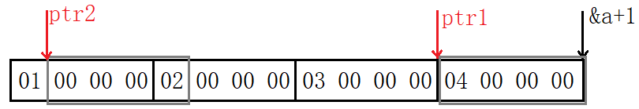

###### Example 4

~~~c
#include <stdio.h>
int main()
{
	int a[3][2] = { (0, 1), (2, 3), (4, 5) };
	int* p;
	p = a[0];
	printf("%d", p[0]);
	return 0;
}
~~~

这题相对来说很简单，需注意到`()`内部为逗号表达式，所以数组元素分别为1,3,5,0,0,0 。

###### Example 5

 ~~~c
 int main()
 {
 	int a[5][5];
 	int(*p)[4];
 	p = a;
 	printf("%p,%d\n", &p[4][2] - &a[4][2], &p[4][2] - &a[4][2]);
 	return 0;
 }	
 ~~~

本题一眼就可以看到二维数组`a[5][5]`，本应用`int(*)[5]`的数组指针接收，为什么用4个元素的数组指针接收呢？

其实可以看出，数组在内存中都是连续存放的，对于这“一排“的数据，怎么看是我们的事，把它当成3列的4列的5列甚至是10列的都可以。所以数组指针大小仅仅决定一次访问几个元素，或是说决定了所指数组的列数。

>  本质上列数的改变并不会影响该二维数组，仅仅影响的是编译器如何看待该数组。

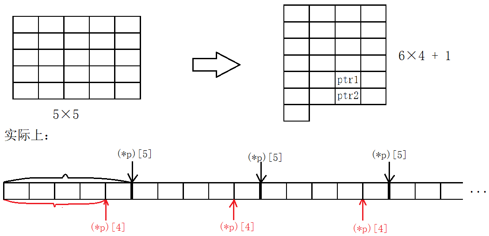

可以看出指针ptr1-ptr2为-4，故%d打印为-4，若以%p打印，因内存中存储的是-4的补码，再以无符号数的十六进制形式打印：

~~~
10000000 00000000 00000000 00000100
11111111 11111111 11111111 11111011
11111111 11111111 11111111 11111100
FF FF FF FC
~~~

###### Example 6

~~~c
int main()
{
	int aa[2][5] = { 1, 2, 3, 4, 5, 6, 7, 8, 9, 10 };
	int* ptr1 = (int*)(&aa + 1);
	int* ptr2 = (int*)(*(aa + 1));
	printf("%d,%d", *(ptr1 - 1), *(ptr2 - 1));
	return 0;
}
~~~

&aa取出数组地址并+1跳过整个数组，aa相当于首行地址+1为第二行地址并解引用得第二行数组名，**数组地址解引用得数组名**。

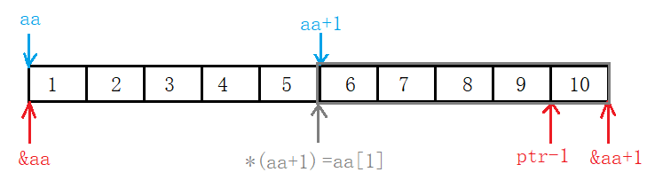

> aa+1得到第二行数组的数组地址，再解引用即对数组地址解引用，得到整个数组也就是数组名，`*(&arr)=arr` 。

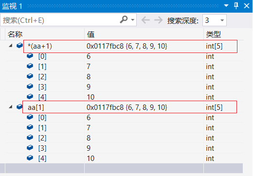

###### Example 7

~~~c
#include <stdio.h>
int main()
{
	char* a[] = { "work","at","alibaba" };
	char** pa = a;
	pa++;
	printf("%s\n", *pa);
	return 0;
}
~~~

指针数组a分别存入`"work"`,`"at"`,`"alibaba"`三个字符串的首字符地址。又将指针数组名即首元素地址存入二级指针变量中。指针++访问第二个元素a的地，随后%s打印整个字符串。

###### Example 8

~~~c
int main()
{
	char* c[] = { "ENTER","NEW","POINT","FIRST" };
	char** cp[] = { c + 3,c + 2,c + 1,c };
	char*** cpp = cp;
    //1.
	printf("%s\n", **++cpp);
	//2.
    printf("%s\n", *-- * ++cpp + 3);
	//3.
    printf("%s\n", *cpp[-2] + 3);
	//4.
    printf("%s\n", cpp[-1][-1] + 1);
	return 0;
}
~~~

> 首先字符指针数组`c`存有字符串首地址，其次指针数组`cp`存有”与指针c相关“的二级指针，最后三级指针`cpp`指向二级指针`cp`。

本题是最有难度的一题，需要注意到的是指针`++--`属于自增自减，会影响到本值。

1. `cpp`+1指向了数组`cp`的第二个元素，并解引用得到`c+2`。再解引用得到`"POINT"`的首地址。

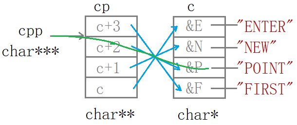

2. `cpp`+1指向数组`cp`的第三个元素并解引用得到`c+1`，`(c+1)--`后将数组`cp`的第三个元素修改为`c`，解引用访问数组`c`的首元素即`"ENTER"`的首地址再+3，打印出`ER`。

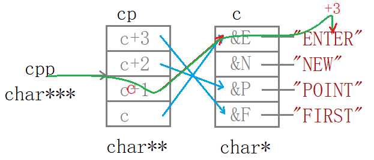

3. `cp[-2]=*(cp-2)`即`cpp`前移2个元素指向并访问了`c+3`，并解引用得数组`c`的第4个元素也就得到了`"FIRST"`的首地址+3，访问到`ST`并打印。

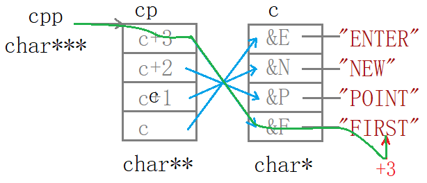

> `cpp-1`不是`cpp--`，虽然效果一样，但是对`cpp`的意义不同。`(cpp-2)`并没有改变`cpp`，所以`cpp`仍指向`cp`的第三个元素。

4. `cpp[-1][-1]`就相当于`*(*(cpp-1)-1)`即`cpp`-1解引用访问到了`c+2`-1再解引用访问到了数组`c`的第二个元素再+1，打印出`EW`。

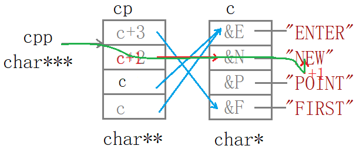

研究清楚之后再回头看代码其实非常简单，首先了解`cpp`和`cp`和`c`的关系：都是指针并从左向右一次指向，再看有关的操作。

~~~c
**++cpp;
*--*++cpp+3;
*cpp[-2]+3;
cpp[-1][-1]+1;
~~~

这四行代码其实本质上完全相同，都是1.`cpp`±整数并解引用；2.`cp`元素±整数并解引用；3.`c`元素±整数并解引用。如图所示：

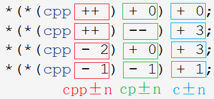

