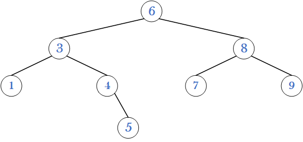

# 二叉搜索树

> 二叉树在数据结构初阶阶段已经讲过，本节作用在于承上启下，复习二叉树的知识，并为之后的 map 和 set 打下基础。

普通二叉树的意义不大，用来存储数据不如顺序表，只有当其叠加上一些性质时，才能发挥其作用。比如堆和二叉搜索树。

## 1. 二叉搜索树的概念

二叉搜索树又称二叉排序树，它可以是一颗空树，或者是一个满足如下性质的二叉树：

- 若它的左子树不为空，则**左子树上所有节点的值都小于根节点**；
- 若它的右子树不为空，则**右子树上所有节点的值都大于根节点**；
- 且它的左右子树，也满足上述性质。



> 这样的一棵树就是二叉搜索树，转化成代码就是这样的结构：

~~~cpp
/* 二叉搜索树节点 */
template <class K>
struct BSTreeNode {
    BSTreeNode(const K& key)
        : _left(nullptr)
	    , _right(nullptr)
    	, _key(key)
    {}
    BSTreeNode<K>* _left;
    BSTreeNode<K>* _right;
    K _key;
};
/* 二叉搜索树 */
template <class K>
class BSTree {
public:
    typedef BSTreeNode<K> node;
    BSTree()
        :_root(nullptr)
    {}
private:
	node* _root;
};
~~~

&nbsp;

## 2. 二叉搜索树的操作

### 2.1 二叉搜索树的查找

若根节点不为空：

- 如果根节点的值等于查找的值 $key$，返回 $true$，
- 如果根节点的值小于查找的值 $key$，到其右子树中查找，
- 如果根节点的值大于查找的值 $key$，到其左子树中查找，

直到走到空树还没找到，则返回 $false$。


~~~cpp
bool Find(const K& key) 
{
    Node* cur = _root;
    while (cur) {
        if (cur->_key < key) {
            cur = cur->_right;
        }
        else if (cur->_key > key) {
            cur = cur->_left;
        }
        else {
            return true;
        }
    }
    return false;
}
~~~

二叉搜索树的查找非常的迅速，时间复杂度高度次 $O(logN)$，当然这是在二叉树相对平衡的情况下，最差是$O(N)$。

> 查找 1000 个节点需 10 次，查找 10 万个节点需要 20 次，查找 10 亿个节点只需要 30 次。在全中国 14 亿人口中查找，也只需要31次。

#### 递归法查找

~~~cpp

Node* _FindR(Node* root, const K& key)
{
    if (root == nullptr) {
        return nullptr;
    }

    if (root->_key > key) {
        return _FindR(root->_left, key);
    }
    else if (root->_key < key) {
        return _FindR(root->_right, key);
    }
    else {
        return root;
    }

}
Node* FindR(const K& key) {
    return _FindR(_root, key);
}
~~~

### 2.2 二叉搜索树的插入

二叉搜索树的插入也很简单，共分两种情况：

1. 树为空，则直接插入，
2. 树不为空，则按性质查找到插入位置，再插入新节点。


两个指针，一个指向当前节点`cur`，在`cur`进行比较并向下移动的同时，父指针`parent`始终指向`cur`的父节点。当`cur`走到空的时候，就创建新节点并链接到父节点的指针上。

1. 插入的值比当前节点的值小，则插入到左子树中，
2. 反之，比当前节点的值大，则插入到右子树中。

~~~cpp
bool Insert(const K& key) 
{
    if (_root == nullptr) { //1. 空树的情况
        _root = new Node(key);
        return true;
    }
    //2. 树非空
    Node* parent = nullptr; //父指针
    Node* cur = _root; //当前节点指针
    while (cur) {
        if (cur->_key < key) {
            parent = cur;
            cur = cur->_right; 
        }
        else if (cur->_key > key) {
            parent = cur;
            cur = cur->_left;
        }
        else {
            return false; //树中已有相同元素，不允许数据冗余，返回false
        }
    }
    if (parent->_key < key) {
        parent->_right = new Node(key); //链接到父节点的指针上
    }
    else {
        parent->_left = new Node(key);
    }
    return true;
}
~~~

可见，二叉搜索树的每次插入都是把节点放在叶节点的位置上。

#### 递归法插入

~~~cpp
//递归插入
bool _InsertR(Node*& root, const K& key) //Node*& root
{
    if (root == nullptr) {
        root = new Node(key);
        return true;
    }

    if (root->_key > key) {
        return _InsertR(root->_left, key);
    }
    else if (root->_key < key) {
        return _InsertR(root->_right, key);
    }
    else {
        return false;
    }
}
bool InsertR(const K& key) {
    return _InsertR(_root, key);
}
~~~

使用传入**节点指针的引用**作参数，使得`root`不仅是当前节点的指针，还是其父节点的`_left`,`_right`指针，这样修改`root`也就修改了父节点的左右孩子。


#### 中序遍历

二叉搜索树的中序遍历结果，就是树中元素排成升序的结果。

~~~cpp
void Inorder() {
    _Inorder(_root);
}
void _Inorder(Node* root) 
{
    if (root == nullptr) {
        return;
    }
    _Inorder(root->_left);
    cout << root->_key << " ";
    _Inorder(root->_right);
}
~~~

一般成员函数在类外调用时，无法直接传入成员变量作参数。故可以将主体逻辑包装成子函数，再由成员函数去调用即可。

~~~cpp
void TestBSTree() 
{
    BSTree<int> t;
    int a[] = { 7,1,3,6,4,8,7,9,3,2,5 }; //排序数组
    for (auto e : a) {
        t.Insert(e); //插入二叉搜索树
    }
    t.Inorder(); //中序遍历
}
~~~

如上代码，相当于利用二叉搜索树排序数组，而二叉搜索树结构天然具有排序加去重的功能。

### 2.3 二叉搜索树的删除

二叉搜索树的难点在于删除，因为节点的位置不确定，可能在头也可能在尾，删除节点需要维护剩余节点的链接关系。

> 如果删除的节点是叶节点如 $2$ 节点、或者是单个叶节点的父节点如 $8$ 节点，那么很容易，释放之后修改父节点的链接关系即可。 
>
> 但如果删除的是 $5$ 节点、$7$ 节点，那就相对麻烦了。暴力的重构其下的子节点肯定是下下策，但可以将子树中满足条件的节点替换上来。

首先删除节点需要先查找元素，如果不存在，则返回 $false$，如果存在，则分以下几种情况：

| 简单删除               | 删除方式                                                     |
| ---------------------- | ------------------------------------------------------------ |
| 删除的节点有单个子节点 | 该节点左为空，则让父节点指向右子树，右为空，则让父节点指向左子树 |
| 删除的节点无子节点     | 归类到上一类处理                                             |


| 替换删除                 | 删除方式                                                     |
| ------------------------ | ------------------------------------------------------------ |
| 删除的节点左右子节点都有 | 将其左子树中的最大/右节点，或右子树中的最小/左节点，替换被删节点 |


~~~cpp
bool Erase(const K& key) {
    Node* parent = nullptr;
    Node* cur = _root;
    while (cur) {
        if (cur->_key < key) {
            parent = cur;
            cur = cur->_right;
        }
        else if (cur->_key > key) {
            parent = cur;
            cur = cur->_left;
        }
        else { // cur->_key == key
            /* 无或只有单个子节点 */
            if (!cur->_left) { //左为空
                if (parent == nullptr) { //父节点为空头节点特判
                    _root = _root->_right;
                }
                else if (parent->_left == cur) { //我是父节点的左
                    parent->_left = cur->_right;  //父节点的左指向的我的右
                }
                else { // parent->_right == cur //我是父节点的右
                    parent->_right = cur->_right; //父节点的左指向的我的右
                }
                delete cur;
            }
            else if (!cur->_right) { //右为空
                if (parent == nullptr) { //父节点为空头节点特判
                    _root = _root->_left;
                }
                else if (parent->_left == cur) { //我是父节点的左
                    parent->_left = cur->_left;   //父节点的左指向的我的左
                }
                else { // parent->_right == cur //我是父节点的右
                    parent->_right = cur->_left;  //父节点的右指向的我的左
                }
                delete cur;
            }
            /* 两个子节点都存在 */
            else { // cur->_left && cur->_right
                Node* minParent = cur;
                Node* min = cur->_right;//在右子树中找最小值
                while (min->_left) { //_left不为空，将min留在最小值节点处
                    minParent = min;
                    min = min->_left;
                }
                cur->_key = min->_key; //覆盖
                if (minParent->_left == min) {
                    minParent->_left = min->_right;
                }
                else { // minParent->_right == min
                    minParent->_right = min->_right;
                }
                delete min; //释放
            }
            return true;
        }
    }
    return false;
}
~~~

#### 递归法删除

~~~cpp
bool _EraseR(Node*& root, const K& key) {
    if (root == nullptr)
        return false;
    
    if (root->_key > key) {
        return _EraseR(root->_left, key);
    }
    else if (root->_key < key) {
        return _EraseR(root->_right, key);
    }
    else { //root->_key == key 
        Node* del = root;
        /* 只有单个子节点 */
        if (!root->_left) {
            root = root->_right; //引用直接链接上非空子节点
        }
        else if (!root->_right) {
            root = root->_left;
        }
        /* 存在两个子节点 */
        else {
            Node* min = root->_right;
            while (min->_left) {
                min = min->_left;
            }
            swap(min->_key, root->_key);
            return _EraseR(min, key); //两个子节点的情况直接返回删除min的结果，不会再到下面释放根节点
        }
        delete del; 
        return true;
    }
}
bool EraseR(const K& key) {
    cout << key << endl;
    return _EraseR(_root, key);
}
~~~

和插入相同，要修改当前节点就要传节点指针的引用。

&nbsp;

## 3. 二叉搜索树的应用

 搜索树有两种搜索模型，一种是`key`搜索模型，一种是`key/value`搜索模型。此外，二叉搜索树插入重复值失败，所以自带去重功能。

### key搜索模型

key搜索模型只能**用来判断数据存在不在**，也就是查找返回真假。

> 应用场景也有很多是，如存储学生学号，存储车牌号判断是否放行、检查作文中单词拼写是否正确。

### key/value搜索模型

很多时候我们需要通过一个值`key`查找另外一个值`value`，两个值是强相关对应关系。 

> 应用场景比如：简单中英互译，饭卡和身份绑定等

```cpp
template <class K, class V>
struct BSTNode {
    BSTNode<K, V>* _left;
    BSTNode<K, V>* _right;
    K _key;
    V _value;
    BSTNode(const K& key, const K& value)
        : _left(nullptr), _right(nullptr), _key(key), _value(value)
        {}
};
template <class K, class V>
class BSTree {
    typedef BSTNode<K, V> Node;
    public:
    BSTree() : _root(nullptr)
    {}
    bool Insert(const K& key, const V& value) {
        if (_root == nullptr) {
            _root = new Node(key, value);
            return true;
        }
        Node* parent = nullptr;
        Node* curr = _root;
        while (curr) {
            if (curr->_key < key) {
                parent = curr;
                curr = curr->_right;
            }
            else if (curr->_key > key) {
                parent = curr;
                curr = curr->_left;
            }
            else {
                return false;
            }
        }
        if (parent->_key < key) {
            parent->_right = new Node(key, value);
        }
        else {
            parent->_left = new Node(key, value);
        }
        return true;
    }
    Node* Find(const K& key) {
        Node* curr = _root;
        while (curr) {
            if (curr->_key < key) {
                curr = curr->_right;
            }
            else if (curr->_key > key) {
                curr = curr->_left;
            }
            else {
                return curr;
            }
        }
        return nullptr;
    }
    bool Erase(const K& key) {
        Node* parent = nullptr;
        Node* curr = _root;

        while (curr) {
            if (curr->_key < key) {
                parent = curr;
                curr = curr->_right;
            }
            else if (curr->_key > key) {
                parent = curr;
                curr = curr->_left;
            }
            else {
                // 简单删除
                if (curr->_left == nullptr){ /* 左子树为空 */
                    // 删除头节点特殊情况
                    if (curr == _root) {
                        _root = _root->_right;
                    }
                    else {
                        if (parent->_left == curr) {
                            parent->_left = curr->_right;
                        }
                        else {
                            parent->_right = curr->_right;
                        }
                    }
                    delete curr;
                }
                else if (curr->_right == nullptr) { /* 左子树存在，右子树为空 */
                    // 删除头节点特殊情况
                    if (curr == _root) {
                        _root = _root->_left;
                    }
                    else {
                        if (parent->_left == curr)
                            parent->_left = curr->_left;
                        else
                            parent->_right = curr->_left;
                    }
                    delete curr;
                }
                // 替换法删除
                else { /* 左右子树都存在 */
                    Node* maxParent = curr;
                    Node* max = curr->_left;
                    // 拿到整棵树的左子树的最右节点
                    while (max->_right) {
                        maxParent = max;
                        max = max->_right;
                    }
                    // 覆盖到目标位置
                    curr->_key = max->_key;
                    curr->_value = max->_value;
                    // 维护链接关系
                    if (maxParent->_right == max)
                        maxParent->_right = max->_left;
                    else // 特殊情况左子树的最右节点正好就是左节点
                        maxParent->_left = max->_left;
                    delete max;
                }
                return true;
            }
        }
        return false;
    }
    void Inorder(Node* root) {
        _InOrder(root);
    }

    private:
    void _InOrder(Node* root) {
        if (root == nullptr) {
            return;
        }
        _InOrder(root->_left);
        std::cout << root->_key << ":" << root->_value << " ";
        _InOrder(root->_right);
    }
    private:
    Node* _root;
};

void TestBSTree() {
    // 字典
    BSTree<std::string, std::string> dist;
    dist.Insert("sort", "排序");
    dist.Insert("left", "左");
    dist.Insert("right", "右");
    dist.Insert("map", "地图，映射");
    //...

    std::string str;
    while (std::cin >> str)
    {
        BSTNode<std::string, std::string>* ret = dist.Find(str);
        if (ret) {
            std::cout << "对应解释为：" << ret->_value << std::endl;
        }
        else {
            std::cout << str << " 无对应解释" << std::endl;
        }
    }
}
// 查找出现的次数
void TestBSTree2() {
    std::string arr[] = { "苹果", "西瓜", "苹果", "西瓜", "苹果", "西瓜" , "苹果", "西瓜" };
    BSTree<std::string, int> countTree;
    for (auto& str : arr) {
        BSTNode<std::string, int>* ret = countTree.Find(str);
        if (ret) {
            std::cout << ret->_key << ":" << ret->_value << std::endl;
            ret->_value++;
        }
        else {
            countTree.Insert(str, 1);
        }
    }
    countTree.InOrder();
}
```

> STL中的set就是key模型，map就是key/value模型。

&nbsp;

## 4. 二叉搜索树的性能分析

**二叉搜索树最大的问题是会退化**，当顺序插入的时候就会退化成一个链表。


搜索二叉树的的增删查改都得先搜索，搜索的效率代表了所有操作的性能。**对于搜索二叉树来说，最多搜索高度次，所以高度越低，性能越好**。

> 所以一般不会使用单纯的搜索二叉树，而是使用升级版的AVL树和红黑树。

&nbsp;

## 5. 二叉树进阶面试题

### 二叉树创建字符串

https://leetcode.cn/problems/construct-string-from-binary-tree/

```cpp
void _tree2str(TreeNode*& root, string& str)
{
    if (root == nullptr) 
        return;

    str += to_string(root->val);
    if (root->left || root->right) {
        str+= '(';
        _tree2str(root->left, str);
        str += ')';
    }
    if (root->right) {
        str+= '(';
        _tree2str(root->right, str);
        str += ')';
    }
}
string tree2str(TreeNode* root) {
    string str;
    _tree2str(root, str);
    return str;
}
string tree2str(TreeNode* root) {
    string str;
    if (root == nullptr) 
        return str;

    str += to_string(root->val);

    if (root->left || root->right)  // 右边为真还得加()
    {
        str += '(' + tree2str(root->left) + ')';  // 左子树
    }
    if (root->right) // 右边为空则不加()
    {
        str += '(' + tree2str(root->right) + ')';  // 右子树
    }
    return str;
}
```

### 二叉树的分层遍历

https://leetcode.cn/problems/binary-tree-level-order-traversal/

```cpp
vector<vector<int>> levelOrder(TreeNode* root) {
    vector<vector<int>> vv;
    vector<int> v;

    queue<TreeNode*> q;
    int levelSize = 1; // 层节点个数

    if (root == nullptr) 
        return vv;

    q.push(root);
    while (!q.empty())  {
        while(levelSize--) {
            TreeNode* front = q.front();

            v.push_back(front->val); // 出队头数据，循环出一层
            q.pop();

            if (front->left) {
                q.push(front->left);
                // levelSize++; // ERR 出了循环才能修改levelSize
            }
            if (front->right) {
                q.push(front->right);
                // levelSize++;
            }
        }
        levelSize = q.size(); // 更新levelSize为下一层节点数

        vv.push_back(v);
        v.clear(); // 清空临时vector
    }
    return vv;
}
```

https://leetcode.cn/problems/binary-tree-level-order-traversal-ii/

```cpp
vector<vector<int>> levelOrderBottom(TreeNode* root) {
    vector<vector<int>> vv;

    if (root == nullptr)
        return vv;

    queue<TreeNode*> q;
    q.push(root);
    int levelSize = 1;

    while (!q.empty())
    {
        vector<int> v;
        while (levelSize--)
        {
            TreeNode* front = q.front();
            v.push_back(front->val);
            q.pop();

            if (front->left) q.push(front->left);
            if (front->right) q.push(front->right);
        }
        levelSize = q.size();
        vv.push_back(v);
    }

    reverse(vv.begin(), vv.end());
    return vv;
}
```

### 最近公共祖先

https://leetcode.cn/problems/lowest-common-ancestor-of-a-binary-tree/

```cpp
// 两个节点分别到根的路径的交点就是最近公共祖先
// 最近公共祖先的两个节点必然一个在左树一个在右树，在往上就都在一个子树中
// 三叉链 -- 链表相交
// 搜索二叉树 -- 都比我小就在左树，都比我大就在右树，一大一小我就是
// 普通二叉树 -- 查找
bool Find(TreeNode* root, TreeNode* x) 
{
    if (root == nullptr)
        return false;
    if (root == x)
        return true;

    return Find(root->left, x) || Find(root->right, x);
}
TreeNode* lowestCommonAncestor(TreeNode* root, TreeNode* p, TreeNode* q) {
    if (root == nullptr)
        return nullptr;

    if (root == q || root == p) 
        return root;

    bool pInLeft, pInRight, qInLeft, qInRight;
    pInLeft = Find(root->left, p);
    pInRight = !pInLeft;

    qInLeft = Find(root->left, q);
    qInRight = !qInLeft;    

    if ((pInLeft && qInRight) || (pInRight && qInLeft)) // 分两边
        return root;
    else if (pInLeft && qInLeft) // 都在左
        return lowestCommonAncestor(root->left, p, q);
    else if (pInRight && qInRight) // 都在右
        return lowestCommonAncestor(root->right, p, q);
    else 
        return nullptr;   
}
```


```cpp
bool FindPath(TreeNode* root, TreeNode* x, stack<TreeNode*>& path)
{
    if (root == nullptr)
        return false;

    path.push(root);
    if (root == x)
        return true;
    if (FindPath(root->left, x, path) || FindPath(root->right, x, path))
        return true;
    else {
        path.pop();
        return false;
    }
}
TreeNode* lowestCommonAncestor(TreeNode* root, TreeNode* p, TreeNode* q) {
    stack<TreeNode*> pPath, qPath;

    FindPath(root, p, pPath);
    FindPath(root, q, qPath);

    stack<TreeNode*> longPath, shortPath;
    longPath = pPath;
    shortPath = qPath;
    int cnt = longPath.size() - shortPath.size();
    if (cnt < 0) {
        longPath = qPath;
        shortPath = pPath;
        cnt = -1 * cnt;
    }

    while (cnt--) {
        longPath.pop();
    }

    while (!longPath.empty()) {
        if (longPath.top() == shortPath.top()) {
            return longPath.top();
        }
        else {
            longPath.pop();
            shortPath.pop();
        }
    }
    return nullptr;
}
```

### 转换成排序双向链表

 https://www.nowcoder.com/practice/947f6eb80d944a84850b0538bf0ec3a5

```cpp
class Solution {
public:
    void InOrder(TreeNode* curr, TreeNode*& prev) 
    {
        if (curr == nullptr) 
            return;
        
        InOrder(curr->left, prev);
        // 4 6 8 10 12 14 16
        curr->left = prev;
        if (prev) {
            prev->right = curr;
        }
        prev = curr; 
        InOrder(curr->right, prev);
    }
    TreeNode* Convert(TreeNode* pRootOfTree) {
        if (pRootOfTree == nullptr) 
            return nullptr;
        TreeNode* prev = nullptr;
        InOrder(pRootOfTree, prev);
        TreeNode* head = pRootOfTree;
        while(head->left) {
            head = head->left;
        }
        return head;
    }
};
```


### 前序中序遍历构造二叉树

https://leetcode.cn/problems/construct-binary-tree-from-preorder-and-inorder-traversal/

```cpp
class Solution {
public:
    // 前序确定根，中序划分左右子树
    // 前序的每一个节点都可以认为是根。以前序为主线，不断划分左右子树
    TreeNode* _buildTree(vector<int>& preorder, vector<int>& inorder,
        int& prei, int inbegin, int inend) 
    {
        if (inbegin >= inend) { // 区间不存在
            return nullptr;
        }
        TreeNode* root = new TreeNode(preorder[prei]); // 获得根

        int rooti = inbegin;
        while (rooti < inend) { // 遍历中序找根，确定左右子树区间
            if (inorder[rooti] == preorder[prei]) {
                break;
            }
            ++rooti;
        } // [inbegin, rooti), rooti, [rooti+1, inend)

        ++prei; // 构建下一个子树 
        // 递归构建并链接
        root->left = _buildTree(preorder, inorder, prei, inbegin, rooti);
        root->right =  _buildTree(preorder, inorder, prei, rooti + 1, inend);
        return root;
    }
    TreeNode* buildTree(vector<int>& preorder, vector<int>& inorder) 
    {
        int prei = 0;
        return _buildTree(preorder, inorder, prei, 0, inorder.size());//左闭右开
    }
};
```

### 中序后序遍历构造二叉树

https://leetcode.cn/problems/construct-binary-tree-from-inorder-and-postorder-traversal/

```cpp
// 后序确定根，中序划分左右子树
TreeNode* _buildTree(vector<int>& inorder, vector<int>& postorder,
                     int& posti, int inbegin, int inend) {
    if (inbegin >= inend) {
        return nullptr;
    }

    TreeNode* root = new TreeNode(postorder[posti]);
    int rooti = inbegin;

    while (rooti < inend) {
        if (inorder[rooti] == root->val)
            break;
        ++rooti;
    } // [inbegin, rooti) rooti [rooti+1, inend)

    --posti;
    root->right = _buildTree(inorder, postorder, posti, rooti+1, inend);
    root->left = _buildTree(inorder, postorder, posti, inbegin, rooti);

    return root;
}

TreeNode* buildTree(vector<int>& inorder, vector<int>& postorder) {
    int posti = postorder.size() - 1;
    return _buildTree(inorder, postorder, posti, 0, inorder.size());
}
```

### 迭代实现前序遍历

https://leetcode.cn/problems/binary-tree-preorder-traversal/

```cpp
vector<int> preorderTraversal(TreeNode* root) 
{
    vector<int> v;
    stack<TreeNode*> st; 
    TreeNode* curr = root;

    while (curr || !st.empty()) 
    {
        //循环每次迭代都是才开始访问树
        while (curr) // 左路节点入栈
        {
            st.push(curr);
            v.push_back(curr->val); // 先序遍历
            curr = curr->left;
        }

        TreeNode* top = st.top(); // 左路遇空后出栈
        st.pop();

        curr = top->right; // 访问右路节点，再次进入循环继续遍历左路
    }
    return v;
}s
```

### 迭代实现中序遍历 

https://leetcode.cn/problems/binary-tree-inorder-traversal/

```cpp
vector<int> inorderTraversal(TreeNode* root) {
    vector<int> v;
    stack<TreeNode*> st;
    TreeNode* cur = root;

    while (cur || !st.empty()) 
    {
        while (cur)
        {
            st.push(cur);
            cur = cur->left;
        }

        TreeNode* top = st.top();
        st.pop();
        v.push_back(top->val); // 中序遍历
        cur = top->right;
    }
    return v;
}
```

### 迭代实现后序遍历 

https://leetcode.cn/problems/binary-tree-postorder-traversal/

```cpp
vector<int> postorderTraversal(TreeNode* root) {
    vector<int> v;
    stack<TreeNode*> st; 
    TreeNode* curr = root;
    TreeNode* prev = nullptr;

    while (curr || !st.empty()) 
    {
        //循环每次迭代都是才开始访问树
        while (curr) // 左路节点入栈
        {
            st.push(curr);
            curr = curr->left;
        } // 左路遇空

        TreeNode* top = st.top(); 

        if (top->right == nullptr || top->right == prev) 
        {
            v.push_back(top->val); // 后序遍历
            prev = top; // 记录
            st.pop();
        }
        else 
        {
            curr = top->right; // 访问右路节点，再次进入循环继续遍历左路
        }
    }
    return v;
}
```