#### 前言

##### 		Example 1	修复照片

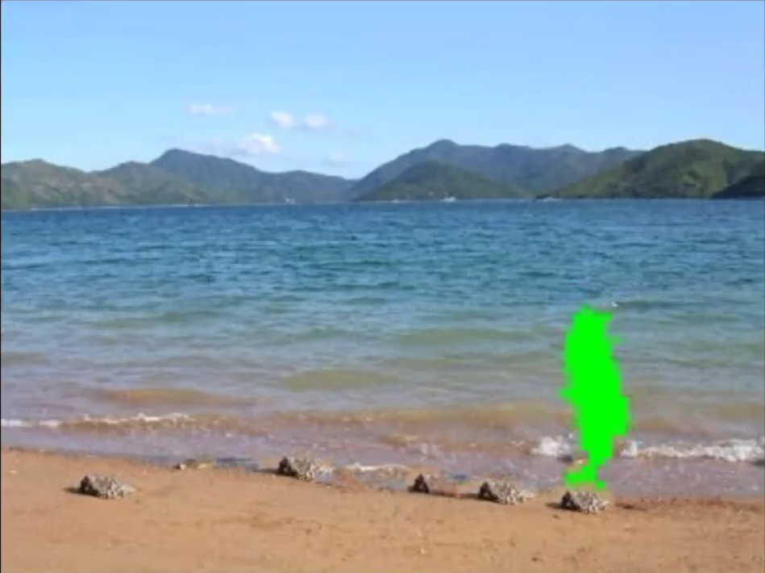

原理：拿周边相近的部分来补充。关键技术：

1. 数据结构	分成小块，`“搜索”`统计特性相同的小块
2. 信号处理    小块的边界处理

##### Example 2    水的模拟

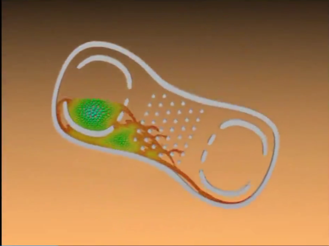

原理：

- 用很多的小球代替液体，每个小球都遵循牛顿力学体系，用单个粒子的物理运动来模拟水的非线性运动。
- 粒子多，效果好，运算量大；粒子少，效果差，运算量小。

那么如何在性能和效率上达到平衡呢？**时间、空间复杂度**

> 外围红色小球用小直径，内围蓝色小球用大直径。

##### 		Example 3	人工智能

AlphaGo & 区块链

原理： 区（结点）+链表+hash+分布式

#### 启示

1. 从生活和实际需求产生——观察
2. 抽象出模型——数学模型——才能解决它
3. 程序模拟——与其他方法的比较

> 实际问题—模型—模型的性质—解决方案—评估—提出新的问题—实际应用

- 抽象——逻辑工具、逻辑能力
- 还原——具体实施、编程能力

如何增强实践能力？

1. 自己多动手编程实现已有算法
2. 编程实现自己的算法，可以考虑作业题

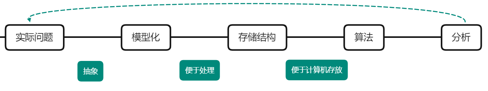

>  计算机思维：是一个解决问题的流程，包括一系列的特征和处理方式、方法和流程。
>

* 理工科思维 —— 数据、量化、逻辑性
* 计算机思维 —— 更强调逻辑性

#### 例题

##### Example 1

100桶酒，其中一桶被混毒，有若干志愿者试验，试到毒便死。求以最短的时间内找到毒酒所在那桶，问至少要多少名志愿者？给出你的方案。

解：由题意得，共有100桶酒，七位志愿者，可列下表以直观展现过程。

   1. 首先将100桶酒利用二进制进行编号，则需要七位数（$100<2^7=128$）。如第1桶为0000001，第100桶为1100100。

   2. 列出如下表格

      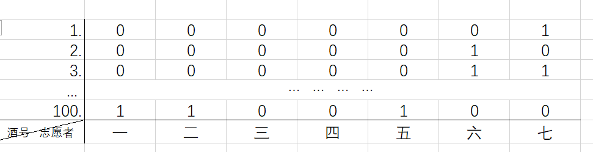

   3. 采用这样的方法：

         个志愿者都试自己所在列的位数为1的酒，例如一号志愿者要喝掉第100号酒。

   4. 假如，6号志愿者出现反应，便排除了第六列位数为0的酒，再根据其他志愿者的反应，就可以确定到底是哪一桶酒。

>  本质上是“计算”。

##### Example 2

求n个数的最大值、次最大值。

~~~C
//1.遍历 - 最朴素的方法
int main()
{
	int arr[10] = { 22,334,552,1,4,6,78,23,55,98 };
	int i = 0;
	int temp = 0;
	int max1 = arr[0];
	int max2 = arr[1];
	for (i = 1; i < 10; i++)
	{
		if (arr[i] > max1)
		{
			temp = max1;
			max1 = arr[i];
			arr[i] = temp;
		}
	}
	printf("%d\n", max1);
	for (i = 2; i < 10; i++)
	{
		if (arr[i] > max2)
		{
			temp = max2;
			max2 = arr[i];
			arr[i] = temp;
		}
	}
	printf("%d\n", max2); 
	return 0;
}
~~~

> 遍历方法共需进行$n-1+n-2=2n-3$次比较。

###### 变题

有n个足球队比赛，问至少多少次比赛才能找到冠军和亚军。

解：实际中通常采用锦标赛方法。（淘汰制）设有8个数分别为5，7，3，6，8，9，4，2。两两为一组进行比较，大的胜出，小的淘汰。

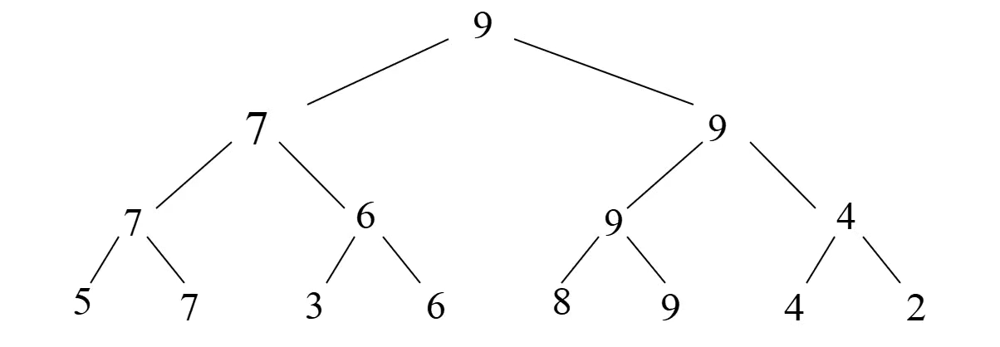

> 毋庸置疑的是，无论怎么分组，显然最大值永远不会被淘汰。故最大值为9。共进行了$8/2+4/2+2/2=7$次比较。
>

1. 故变题寻找**冠军**的比较次数为$n/2+n/2^2+…+n/2^k=n-1$

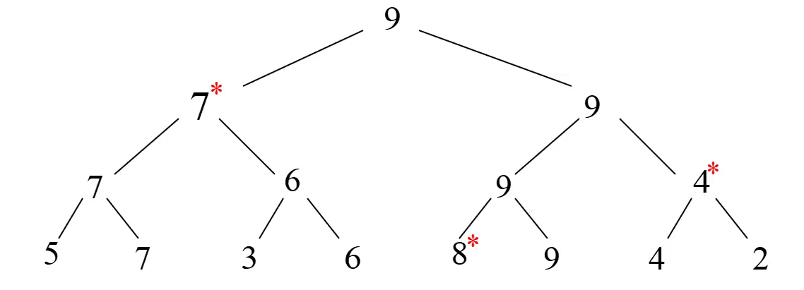

> 次最大值肯定是被最大值给比下去了，不然它就是最大值了。所以顺着这个思路，把所有和最大值进行过直接比较的数字跳出来，重新进行比较。
>
> 就是如图所示带*的数字，个数记为k，稍加思索则得出$k=log_2{n}$

2. 故变题寻找**亚军**的比较次数为$log_2{n}-1$

> 锦标赛方法共需$n-1+log_2{n}-1=n+log_2{n}-2$次比较。

##### Example 3

判断表达式中括号是否匹配

$Z=((a+b)+c)*2+(3-5)/7-((6+2)/8+a)$。

~~~C
void match(char* ch)
{
	int count = 0;
	int i = 0; 
	while (ch[i]!= ';') 
	{
		if(ch[i] == '(')
			count++;
		else if (ch[i] ==')')
			count--; 
		i++;
	}
	if (count != 0)
		printf("%s\n","no match");
	else 
		printf("%s\n","match");
}
~~~

当然，上述代码是由左向右数括号数是否相等来判断括号是否匹配，很容易就可以举出反例 $f=)a+b($  ，所有该方法是不成熟的。

##### Example 4

交叉路口交通管理系统

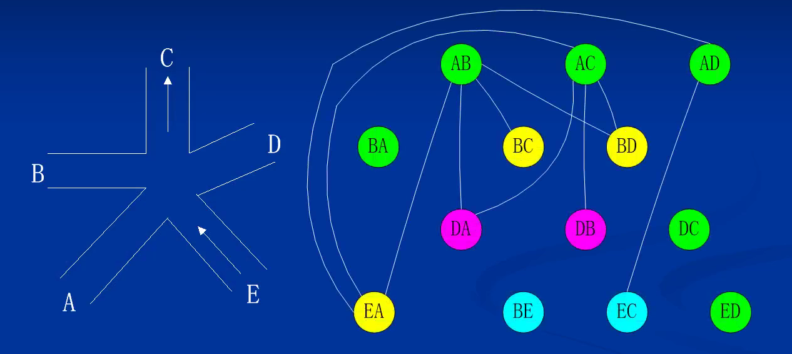

1. 把可以走通的道路设为顶点
2. 如果两个顶点有冲突，用顶点之间的连线表示

###### 变题 

着色算法

> - 在状态图中，相邻（有连线）的顶点不能是同一种状态。
> - 故对于顶点的不同状态，我们用不同的颜色去表示。
> - 由于四色定理，多余5叉的路口不能用少于4种颜色来表示。

在状态图中至少需要多少种颜色来表示？

##### Example 5

如何快速走出迷宫？

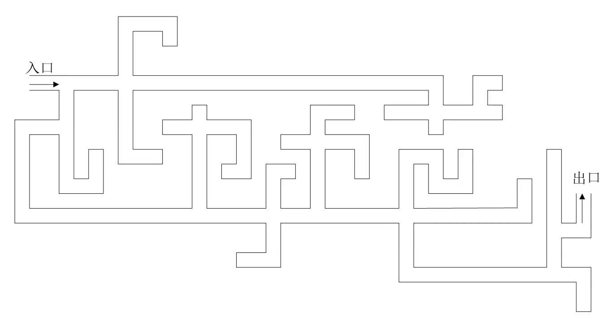

以上问题现阶段并不作要求，目的是向大家介绍下数据结构的研究问题。现在我们是否能回答出刚开始时问大家的问题呢？数据结构是什么？

数据结构是研究的是非数值计算的程序设计方法。

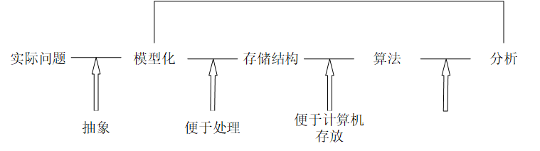

#### 总结

1. 计算机里为什么要采用二进制？

   二进制将**计算转化为逻辑判断**。  

2. 数据结构的学习的目的？

   培养**计算机思维** —— 培养如何用计算机解决实际的问题，学会思考问题的方法以及如何将此问题转化为计算机可解的问题。

3. 数据结构提升本科生的能力？

1. 具有批判性和系统性推理的能力

2. 具有形成概念和解决问题的能力

3. 具有判断什么意味着彻底理解某种东西的能力

- 具有独立思考的能力

- 具有辨别重要与琐碎，持久与短暂的东西的能力

4. 下面对于数据结构的学习的几个问题看看你是否能回答上来？
   1. 课程的目标是什么？（解决什么问题）

   2. 解决问题的方法是什么？（是系统的方法还是一门技术）

   3. 有什么实际应用？（如何应用这些理论和方法解决其他的问题，见前面的例子）

   对于这三个问题必须能清晰的回答出来，才可以说你的数据结构课程的理解到位。而不是课程考了多少分。

5. 那如何学习数据结构呢？
    1. 多动脑 —— 深入理解问题的本质，抽象出模型

    2. 多动笔 —— 纸上推演，深刻领会

    3. 多动手 —— 上机编程实践

数据结构不是单纯的一门技术（如果是的话，可能早过时了）。它作为一门系统的方法论，像哲学一样，一步步的带我们领悟计算机思维，把现实问题抽象为计算机问题，寻求最高效率的求解，这是一件有难度且也有魅力的事情。

&nbsp;

#### 基本概念

1. **数据**（data）—— 能输入到计算机并能被计算机程序处理的符号的总称
   - 非常广泛的概念，一般我们讨论的都是数据，一般分为数值型数据和非数值型数据两种。
2. **数据元素**（data element）—— 数据的基本单位（例如整型数，字符串，结构等），通常作为一个整体考虑，由若干个数据项组成
   - **数据项**是数据的最小单位，不可再分。
3. **数据对象**（data object）—— 性质相同的数据元素的集合，是数据的子集
   - 是一个集合，比如说班上的所有学生。

> 他们之间的大小关系是：数据 > 数据对象 > 数据元素 > 数据项 

4. **数据结构**（data structure）—— 是相互之间存在一种或多种特定关系的数据元素的集合
   - 数据结构分成两块，一是数据，二是结构，所谓结构即相互关系。

> 数据结构是一门描述计算机处理对象和它们之间的关系以及相应的处理方法的学科。（数据对象、数据关系、基本操作）
>

**结构 **—— 数据元素之间不是孤立存在的，他们之间的相互关系称为结构。

故**数据结构**是个二元组 `Data_Structure=(D,S)`，其中，D是数据元素的有限集，S代表D上元素之间关系（结构）的有限集。可以说数据结构 = 数据 + 结构。

在计算机科学中，复数可取如下定义。复数是一种数据结构，即 Complex=(C,R)，其中：C是含有两个实数的集合 ${c1,c2}$ 。`R={P}`，
其中有序偶$<c1,c2>$表示c1是复数的实部，c2是复数的虚部，而P是定义在集合C上的一种关系`{<c1,c2>}`，比如`c1±c2i`。

##### 逻辑结构

二元组这样对数据结构的定义仅是从操作对象角度出发的一种数学描述，也就是从操作对象抽象出的数学模型。结构定义中的关系也就是数据的**逻辑结构**。他的特点是：

 1. 描述数据之间的逻辑关系
 2. 与数据存储无关，独立于计算机
 3. 是从具体问题中抽象而来的数学模型

数据结构大体上分为：

  1. 线性结构：有且仅有一个开始结点和终端结点，所有结点最多有一个直接前趋和一个直接后继。如：线性表，栈，队列，串
  2. 非线性结构：一个结点可能有多个直接前趋、直接后继。如：树，图

也可分为四种基本逻辑结构：

 1. 集合：同属于一个集合
 2. 线性结构：一对一
 3. 树形结构：一对多
 4. 图状结构：多对多

##### 存储结构

**物理结构**又称**存储结构**是数据结构在计算机中的表示或叫映像。

- 我们可以用由若干个位(bit)组合而成的位串表示一个数据元素，通常称这个位串为**元素**或**结点**。
- 当数据元素由若干数据项组成时，位串中对应于各个数据项的子位串称为**数据域**。
- 所以元素（或结点）即位串可看成数据元素在计算机中的**映像**。

结构在计算机中有两种不同的表示方法：

 1. 顺序映像——顺序存储结构
 2. 非顺序映像——链式存储结构

四种基本的存储结构：

 1. 顺序存储结构：用一组连续的存储单元，依次存储元素，逻辑关系依托存储位置表示。
 2. 链式存储结构：用任意的存储单元，依靠指针表示元素之间的逻辑关系。
 3. 索引存储结构（*）
 4. 散列存储结构（*）

如图所示：

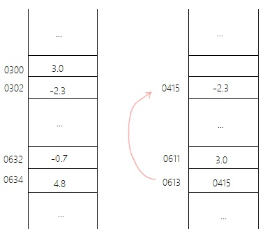

现有两个复数$z_1=3.0-2.3i,z_2=-0.7+4.8i$，左图用顺序存储结构的特点是，像一维数组一样，依次存储元素。右图是链式存储结构，以指针的形式在3.0的后面存储指针指向-2.3的存储位置0415。

##### 二者之间的关系

- 存储结构是逻辑关系与元素本身的映像。
- 数据的逻辑结构和物理结构是密切相关的两个方面。
- 逻辑结构是数据结构的抽象，存储结构是数据结构的实现，二者综合建立起数据元素之间的关系。
- 算法的设计取决于逻辑结构，而算法的实现依赖于存储结构。

##### 数据类型

类型的概念使其规定了在程序执行期间的变量或表达式的取值范围以及其上的操作。故数据类型是一个值的集合和定义在该值集上一组操作的总称。

> 所以说数据结构的作用是1.约束取值范围 2.约束操作。

按“值”的不同特性，数据类型一般可分为两类：一类是非结构的原子类型。一类是结构类型。

1. 原子类型，顾名思义，寓意该类型的值不可再分。如C语言的基本类型（整型、实型、字符型等）
2. 结构类型，结构类型的值是由若干成分按某种结构的组成，故可以分解。其成分也可以是结构的也可以是非结构的，换言之，结构类型可以嵌套定义。

> 结构类型可看成是数据结构和定义在其上的操作所组成的二元组。即 `Structure_type=(S,O)`

###### 抽象数据类型

抽象数据类型 ADT（Abstract Data Type）是指一个数学模型以及定义在其上的一组操作。它的定义取决于数据的逻辑结构，而与存储结构无关。

抽象数据类型和数据类型实质上是一个概念，因为他们的定义都是取决于其数学特性，对于用户来说是相同的。因此抽象的意义，就在于其具有更丰富的数学抽象特性。

一个含抽象数据类型的软件模块通常应含定义、表示和实现3个部分，目前我们只谈定义。

> 抽象数据类型可用三元组Data_Structure_Operation $=(D,S,P)$ 表示，分别是数据对象，数据关系，基本操作。甚至可以直接称为数据结构和其上操作的二元组。

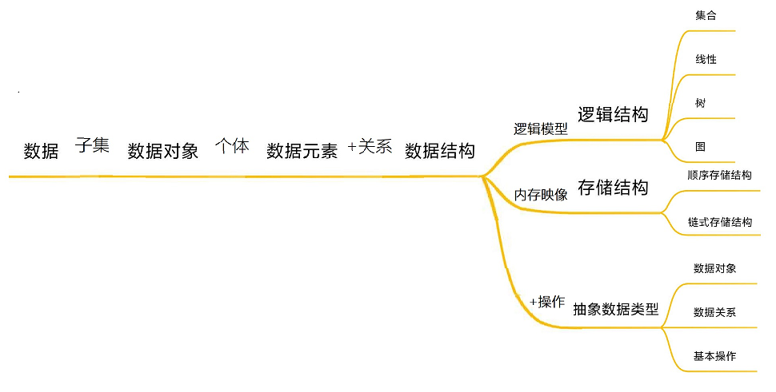

~~~c++
ADT 抽象数据类型名{
    数据对象:<数据对象的定义>
    数据关系:<数据关系的定义>
    基本操作:<基本操作的定义>
}ADT 抽象数据类型名
~~~

其中，数据对象和数据关系的定义用伪代码描述，基本操作的定义格式为

~~~c++
基本操作名(参数表)
    初始条件:<初始条件的描述>
    操作结果:<操作结果描述>
~~~

- 基本操作参数有两种，赋值参数和引用参数。

> 赋值参数：只为操作提供输入值
>
> 引用参数：以&打头，除可提供输入值外，还返回操作结果。

- 初始条件：操作执行前数据结构和参数应满足的条件

> 若不满足，则操作失败，返回相应错误信息。

- 操作结果：操作正常完成之后，数据结构的变化状况和应返回的结果

#### 算法分析

##### 算法定义

算法是对特定问题求解步骤的一种描述，它是指令的有限序列。

- 有穷性——执行步骤有穷，步骤执行时间有穷。

- 确定性——每一条指令含义明确，算法只有唯一的执行路径

- 可行性——所有操作都能通过有限次基本运算实现

- 输入——输入可以有也可以没有，但输出至少要有一个

##### 设计要求

- 正确性
- 可读性
- 健壮性

> 当输入数据非法时，也能做出适当的反应进行处理，而不是产生莫名其妙的结果。
>
> 处理错误的方法应是返回一个表示错误性质的值，而不是打印错误信息且中止程序的执行。

- 效率与低存储量需求

> 执行时间短且空间占用少。目前由于计算机飞速发展，实际中更注重时间复杂度。

##### 效率度量

> 算法执行时间依托算法所编制程序在计算机上运行的时间来体现。像牛客网的刷题训练就是采用计算机内部计时的方法，但老师也说过没什么用，因为这种度量的方法很大程度上受制于计算机本身的硬软条件。这表明使用绝对时间衡量算法的效率是不合适的。因此，人们常常采用事前估算的方法。

一特定算法的“工作量大小”，我们认为依赖于问题的规模（通常用整数n表示）。算法中基本操作被重复执行的次数是问题规模n的某个函数$f(n)$，算法的时间度量记为
$$
T(n)=O(f(n))
$$
它表示二者增长率相同，称为算法的**渐进时间复杂度**，简称**时间复杂度**。一般，最深层循环内的语句的原操作执行次数即频度，就是$T(n)$。

~~~c
//1.
for(i=0;i<100;i++){
    x++;}
//2.
for(i=0;i<n;i++){
    x++;}
//3.
for(i=0;i<n;i++)
    for(j=0;j<n;j++){
        x++;}
~~~

这三段程序的时间复杂度分别为$O(1),O(n),O(n^2)$ ，分别称为常数阶，线性阶，平方阶。另外常见的时间复杂度还有对数阶$O(log                n)$，指数阶$O(2^n)$，阶乘阶$n!$ 等。

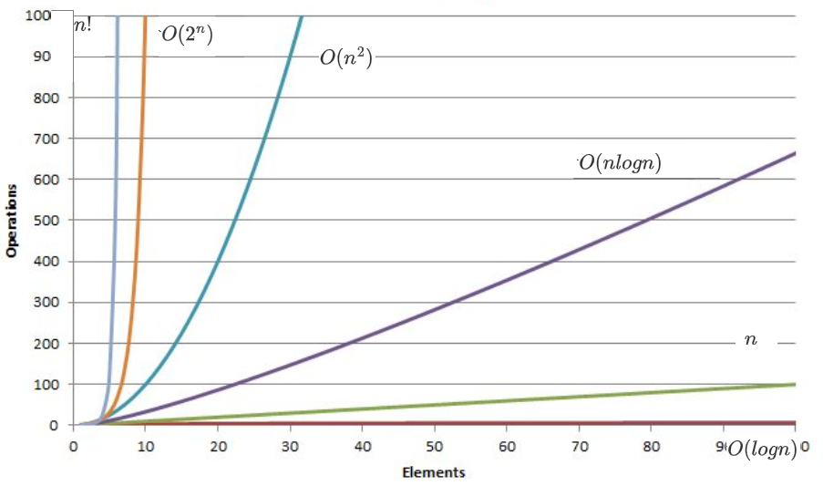

由图我们可以看出，我们尽量多选用多项式阶$O(n^k)$的算法，而不是指数阶$O(k^n)$的算法。

##### 例题

> 为兼具准确性和实用性，我们通常使用大O渐进表示法来表示算法时间复杂度。

###### Example 1

~~~c
for(int i=0;i<n;i++){
    for(int j=0;j<n;j++){
        count++;
    }
}
for(int k=0;k<2*n;k++){
    count2++;
}
int M=10;
while(M--){
    count3++;
}
~~~

该算法总共执行准确次数为$n^2+2×n+10$，但是我们只需要最高阶来表示，即$T(n)=O(n^2)$ 。因为当n趋向于无穷时，只有$n^2$对时间复杂度的影响最大，其他基本可以忽略。

###### Example 2

~~~C
int BinarySearch(int *arr,int size,int key){
    int left=0;
    int right=n;
    while(left<=right){
        int mid=left+((right-left)>>1);
        if(arr[mid]<key){
            left=mid+1;
        }
        else if(arr[mid]>key){
            end=mid-1;
        }
        else
            return mid;   
    }
    return -1;
}
~~~

该算法分最好最坏两种情况：

1. 最好的情况，找第一次就找到，此时$T(n)=O(1)$
2. 最坏的情况，找到最后才找到，此时$T(n)=O(logn)$

如何推出来的呢？折纸法

> 有这么一张纸把它想成数组，纸长即数组长为n，折一次除个2，折一次除个2...，到最后（最后才找到）找到了，假设找了$x$次，则有$2^x=n$，故$x=logn$

毛主席说过，战术上轻视敌人，战略上重视敌人。所以我们论最坏的情况为算法的时间复杂度，为$O(logn)$ 。
