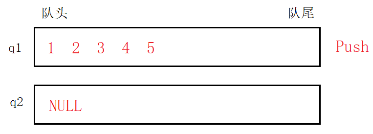

# 栈和队列

> 栈和队列是两种数据结构，栈和队列这两种结构也是线性表。特殊在于它们的操作受到一些限制。

## 1. 栈

### 1.1 栈的定义

栈是一种特殊的线性表，栈只允许在其固定的一端进行插入和删除。进行插入删除的一端被称为**栈顶**，另一端被称为栈底。栈中的数据元素遵循**后进先出**的原则。

> 后进先出，先进后出，即`LIFO`原则（Last In First Out）。

压栈：栈的插入操作被称为压栈，也可以叫做进栈、入栈。

出栈：栈的插入操作被称为出栈，或称弹栈。

> 数据出入都在栈顶，类似于子弹上膛和发射。元素像子弹一样一个个被压入弹夹，再一个个地打出去，这个过程便是压栈和出栈，弹夹便是栈。

#### 栈的结构定义

和线性表类似，栈结构可以使用数组栈和链式栈实现。相对来说，数组栈比链式栈的结构优势更大一点。

> 数组进行尾插尾删的效率高，其次缓存命中率高。缺点是动态增容有一定的内存消耗。

~~~c
typedef int STDataType;
typedef struct Stack 
{
	STDataType* a; // 为栈开辟的空间
	int top;       // 指向栈顶的下标
	int capacity;  // 开辟空间的大小
}ST;
~~~

### 1.2 栈的实现

~~~c
//初始化栈
void StackInit(ST* ps);
//入栈
void StackPush(ST* ps, STDataType data);
//出栈
void StackPop(ST* ps);
//获取栈顶元素
STDataType StackTop(ST* ps);
//获取栈元素个数
int StackSize(ST* ps);
//检测空栈
bool StackEmpty(ST* ps);
//销毁栈
void StackDestroy(ST* ps);
~~~

#### 初始化销毁

~~~c
void StackInit(ST* ps) {
	ps->a = NULL;
	ps->capacity = ps->top = 0;
}
void StackDestroy(ST* ps) {
	assert(ps);
	free(ps->a);
    ps->a = NULL;
	ps->capacity = ps->top = 0;
}
~~~

`top`可以初始化为0，也可以为-1。

- 若为0，则`top`总是即将插入元素的下标，或者说是栈顶的后一块空间，其值代表栈元素个数。
- 若置为-1，则代表当前栈顶位置下标，其值加1代表元素个数。

#### 压入弹出

~~~c
void StackPush(ST* ps, STDataType data) {
	assert(ps);
	//检测容量
	if (ps->capacity == ps->top) {
		int newCapacity = ps->capacity == 0 ? 4 : ps->capacity * 2;
		STDataType* ptr = realloc(ps->a, sizeof(STDataType) * newCapacity);
		if (ptr == NULL) {
			perror("StackPush::realloc");
			exit(-1);
		}
		ps->a = ptr;
        ps->capacity = newCapacity;
	}
	ps->a[ps->top] = data;
	ps->top++;
}
void StackPop(ST* ps) {
	assert(ps);
	assert(!StackEmpty(ps));
	ps->top--;
}
~~~

入栈一定记得最后把`newCapacity`再赋值给`capacity`，还有扩容时的大小应是数组元素的大小而不是结构体的大小。

删除数据前需要保证栈的非空状态。

#### 获取栈顶

~~~c
STDataType StackTop(ST* ps) {
	assert(ps);
	assert(!StackEmpty(ps));
	return ps->a[ps->top - 1];
}
void test() {
    while (!StackEmpty(&stack)) {
    printf("%d ", StackTop(&stack));
    StackPop(&stack);
	}
}
~~~

`top-1`为当前栈顶的下标。同样要保证栈非空。加上该测试函数，可以实现循环打印栈元素的功能。

#### 其他接口

~~~c
//获取栈元素个数
int StackSize(ST* ps) {
	assert(ps);
	return ps->top;
}
//检测空栈
bool StackEmpty(ST* ps) {
	assert(ps);
	return !ps->top;
}
~~~

`!top`的值正好可以表示栈的有无元素的状态。当然这样`top`必须初始化为0。

&nbsp;

## 2. 队列

### 2.1 队列的定义

队列同样是一种特殊的线性表，**和栈相反，队列只允许在一端进行插入且在另一端进行删除**。

数据插入的一端被称为**队尾**，删除的另一端被称为**队头**。

队列中的数据元素遵循**先进先出**的原则。先进先出，后进后出，即`FIFO`原则。

#### 队列的结构定义

~~~c
typedef int QDataType;

typedef struct QueueNode 
{
	QDataType data;
	struct QueueNode* next;
} QueueNode;

typedef struct Queue 
{
	struct QueueNode* head;
	struct QueueNode* tail;
} Queue;
~~~

- 队列的底层结构我们采用链表，方便头删元素。
- 队列用两个指针分别标识队头和队尾，方便访问队头和队尾元素。

> 结构的定义是很灵活的，不将头尾指针封装成`Queue`结构体也是可以的。那么接口定义就要改成：
>
> ~~~c
> void QueueInit(QueueNode** pphead, QueueNode** pptail);
> ~~~
>
> 显然，封装成结构体不失为一种良好的代码风格。

### 2.2 队列的实现

~~~c
//队列初始化
void QueueInit(Queue* pq);
//队列销毁
void QueueDestroy(Queue* pq);
//队列入队
void QueuePush(Queue* pq, QDataType x);
//队列出队
void QueuePop(Queue* pq);
//获取队头数据
QDataType QueueFront(Queue* pq);
//获取队尾数据
QDataType QueueBack(Queue* pq);
//获取队列元素个数
int QueueSize(Queue* pq);
//检测队列是否为空
bool QueueEmpty(Queue* pq);
~~~

#### 初始化销毁

~~~c
void QueueInit(Queue* pq) {
    assert(pq);
    pq->head = NULL;
	pq->tail = NULL;
}
void QueueDestroy(Queue* pq) {
    assert(pq);
	QueueNode* cur = pq->head;
	while (cur) {
		QueueNode* next = cur->next;
		free(cur);
		cur = next;
	}
}
~~~

初始化和销毁并没有传二级指针，因为传递结构体的地址，而两个指针是封装在结构体里的。创建队列在函数外，所以传其地址就行，同时加上断言以防空指针。

#### 入队出队

~~~c
void QueuePush(Queue* pq, QDataType x) {//Enqueue
	assert(pq);
	QueueNode* newNode = (QueueNode*)malloc(sizeof(QueueNode));
	if (newNode == NULL) {
		perror("Queue::malloc");
		exit(-1);
	}
	newNode->data = x;
	newNode->next = NULL;
	//队列为空
	if (pq->head == NULL) {
		pq->head = pq->tail = newNode;
	}
	else {
		pq->tail->next = newNode;
		pq->tail = newNode;
	}
}
void QueuePop(Queue* pq) {//Dequeue
	assert(pq);
	assert(!QueueEmpty(pq));
	QueueNode* next = pq->head->next;
	free(pq->head);
	pq->head = next;
	//链表为空时尾指针置空
	if (pq->head == NULL) {
		pq->tail = NULL;
	}
}
~~~

在`tail`所指的队尾后再新建并链上一个结点，再将`tail`指针指向新结点，这便是入队的原理。出队只能在队头删除结点，也就是将`head`指针指向下一个结点并将前一个释放掉即可。

> `head->next`对头指针解引用，就一定要保证`head`有`next`，也就是保证链表非空。

#### 获取头尾

~~~c
QDataType QueueFront(Queue* pq) {
	assert(pq);
    assert(!QueueEmpty(pq));
	return pq->head->data;
}
QDataType QueueBack(Queue* pq) {
	assert(pq);
    assert(!QueueEmpty(pq));
	return pq->tail->data;
}
~~~

与出栈的实现类似，获取队列元素`tail->data`，对指针解引用访问其所指空间，必然要检查指针是否有效，也就是判断链表是否为空。

~~~c
void test() {
    //...
    while (!QueueEmpty(&q)) {
    	printf("%d ", QueueFront(&q));
    	QueuePop(&q);
	}
} 
~~~

> 配合上述函数可以模拟实现循环出队。

#### 其他接口

~~~c
//获取队列元素个数
int QueueSize(Queue* pq) {
	assert(pq);
	int count = 0;
	QueueNode* cur = pq->head;
	while (cur) {
		count++;
		cur = cur->next;
	}
	return count;
}
//检测队列是否为空
bool QueueEmpty(Queue* pq) {
	assert(pq);
	return !pq->head;
}
~~~

获取队列元素个数，除了遍历计数的方式，还可以定义一个整型变量放在结点结构体中。

&nbsp;

## 3. 栈和队列OJ题

#### 1 [判断有效括号](https://leetcode-cn.com/problems/valid-parentheses/)

给定一个只包括 `(`,`)`,`{`,`}`,`[`,`]` 的字符串 `s` ，判断字符串是否有效。

~~~c
bool isValid(char* s) {
    ST st;
    StackInit(&st); 
    while (*s) {
        if (*s == '(' || *s == '[' || *s == '{') {
            StackPush(&st, *s);
        }
        else {
            //栈无元素，无法与右括号匹配  
            if (StackEmpty(&st)) {
                StackDestroy(&st);
                return false;
            }
            STDataType ret = StackTop(&st);
            if ((ret == '(' && *s != ')') ||
                (ret == '[' && *s != ']') || 
                (ret == '{' && *s != '}')) 
            {
                StackDestroy(&st);
                return false;
            }
            else {
                StackPop(&st);            
            }
        }
        s++;
    }
    if (StackEmpty(&st)) {
        StackDestroy(&st);
        return true;
    }
    else {
        StackDestroy(&st);
        return false;
    }
}
~~~

利用栈的先进后出，后进先出的特点。

1. 将字符串`s`从前向后遍历将其中所有左括号依次入栈，
2. 等待遇到右括号时再利用后进先出的特点就可将最近的左括号与右括号对比。
3. 若匹配成功则出栈一次，下一次就可以找到前一个左括号与之后的右括号进行匹配。

#### 2 [队列实现栈](https://leetcode-cn.com/problems/implement-stack-using-queues/)

使用两个队列实现一个后入先出的栈，并支持普通栈的全部四种操作（`push`、`top`、`pop` 和 `empty`）

> 如用数组用链表实现，换成用队列实现栈。即利用队列的结构和接口函数，也就是队列的特点实现出一个结构，该结构具有栈的特点。

~~~c
typedef struct {
	Queue q1;
	Queue q2;
} MyStack;
~~~

~~~c
MyStack* myStackCreate() {
	MyStack* st = (MyStack*)malloc(sizeof(MyStack));
	if (st == NULL) 
		exit(-1);
  
	QueueInit(&st->q1);
	QueueInit(&st->q2);
	return st;
}
//调用函数创建堆区结构体并返回

void myStackPush(MyStack* obj, int x) {
	assert(obj);
	//向非空队列Push
	if (!QueueEmpty(&obj->q1)) 
		QueuePush(&obj->q1, x);
	else 
		QueuePush(&obj->q2, x);
}

int myStackPop(MyStack* obj) {
	assert(obj);
    // 定义空与非空队列
	Queue* emptyQ = &obj->q1;
	Queue* nonEmptyQ = &obj->q2; 
	if (!QueueEmpty(&obj->q1)) {
		nonEmptyQ = &obj->q1;
		emptyQ = &obj->q2;
	}
    
	//将非空队列前n-1个元素Push到空队列
	while (QueueSize(nonEmptyQ) > 1) {
		QueuePush(emptyQ, QueueFront(nonEmptyQ));
		QueuePop(nonEmptyQ);
	}
    
	//Pop最后一个元素并返回
	int top = QueueFront(nonEmptyQ);
	QueuePop(nonEmptyQ);
	return top;
}

int myStackTop(MyStack* obj) {
	assert(obj);
    //返回非空队列队尾元素
	if (!QueueEmpty(&obj->q1)) 
		return QueueBack(&obj->q1);
	else 
		return QueueBack(&obj->q2);
}

bool myStackEmpty(MyStack* obj) {
	assert(obj);
	return QueueEmpty(&obj->q1) && QueueEmpty(&obj->q2); //二者皆空才为空
}

void myStackFree(MyStack* obj) {
	assert(obj);
	QueueDestroy(&obj->q1); //释放队列结点
	QueueDestroy(&obj->q2); //释放结构体
	
    free(obj);
}
~~~

1. `Push`，由于栈和队列都是从固定的一端入，故模拟入栈直接向非空队列入即可。

2. `Pop`，模拟出栈时，就要考虑到二者的不同，先删除队列中的前$n-1$个元素并将其入到另一个空队列中。直至第$n$个元素再将其删除。

> 队头出数据，队尾入数据，正好能将非空队列前$n$个元素按照原顺序插入到空队列中。非空队列仅剩最后一个元素再删除掉。将所插队列视为出栈后的栈，便实现模拟出栈的过程。

3. `Top`，直接调用队列读取队尾元素的接口函数即可。

完成任意操作后都会产生一个空队列和一个非空队列。通过加以判断可以将非空队列视为待操作对象。也就是每次操作都是操作非空队列。

#### 3 [栈实现队列](https://leetcode-cn.com/problems/implement-queue-using-stacks/)

使用两个栈实现先入先出队列。队列应当支持一般队列支持的所有操作（`push`、`pop`、`peek`、`empty`）

~~~c
/**
 * 结构体定义
 **/
typedef int STDataType;
typedef struct Stack {
	STDataType* a;
	int top;
	int capacity;
}ST;
typedef struct {
    ST pushST;
    ST popST;
} MyQueue;
~~~

~~~c
/**
 * 接口函数定义
 **/
MyQueue* myQueueCreate() {
    MyQueue* pq= (MyQueue*)malloc(sizeof(MyQueue));
    if (pq == NULL) {
        exit(-1);
    }
    StackInit(&pq->pushST);
    StackInit(&pq->popST);
    return pq;
}

void myQueuePush(MyQueue* obj, int x) {
    StackPush(&obj->pushST, x);
}

int myQueuePop(MyQueue* obj) {
    //出栈为空，将入栈所有元素移到出栈
    if (StackEmpty(&obj->popST)) {
        while (!StackEmpty(&obj->pushST)) {
            StackPush(&obj->popST, StackTop(&obj->pushST));
            StackPop(&obj->pushST);
        }
    }
    //删除栈顶即队头元素
    int front = StackTop(&obj->popST);
    StackPop(&obj->popST);
    return front;
}

int myQueuePeek(MyQueue* obj) {
    //出栈为空，将入栈所有元素移到出栈
    if (StackEmpty(&obj->popST)) {
        while (!StackEmpty(&obj->pushST)) {
            StackPush(&obj->popST, StackTop(&obj->pushST));
            StackPop(&obj->pushST);
        }
    }
    //返回栈顶即队头元素
    return StackTop(&obj->popST);
}

bool myQueueEmpty(MyQueue* obj) {
    return StackEmpty(&obj->pushST) && StackEmpty(&obj->popST);
}

void myQueueFree(MyQueue* obj) {
	free(&obj->pushST);
    free(&obj->popST);
    free(obj);
}
~~~

> 由于栈的特点后进先出，将栈中元素移入另一个栈中会造成“逆置”的现象。此时将元素插入到非空栈中会导致顺序发生错误。故指定两个栈分别为入栈`pushST`和出栈`popST`，分别负责入栈和出栈。

1. `Push`，将直接将元素插入到负责入栈的`pushST`中。

2. `Pop`，`popST`为空，就将`pushST`的元素移到`popST`。再从`popST`栈顶出栈就等于删除`pushST`的栈底元素。

> 将元素从“入栈”移到“出栈”，等于将元素逆置，逆置后的栈出栈操作而言已然和队列的出队一样。相当于将栈底的元素从栈底出栈，也就是从先进后出变成先进先出，模拟实现了出队。 

入栈`pushST`和出栈`popST`互不影响，分别完成入队的出队的任务。只要`popST`为空，就将`pushST`中元素移入即可。

#### 4 [实现循环队列](https://leetcode-cn.com/problems/design-circular-queue/)

循环队列可由数组和链表两种方式实现，数组则是通过下标循环，链表是循环链表。

1. 循环队列同样是队列，满足队列的所有性质，
2. 循环队列空间大小固定且可重复利用，
3. 需要多开辟一个元素的空间以用于判满。

> 由图可得`tail->next==head`即队列满，`tail==head`即队列空。数组利用下标控制即可。利多开一块的空间来判满。

##### 数组实现

~~~c
/**
 * 结构体定义
 **/
typedef struct {
    int* a;
    int front;
    int tail;
    int k;
} MyCircularQueue;
/**
 * 接口函数定义
 **/
MyCircularQueue* myCircularQueueCreate(int k) {
    //为结构体开辟空间
    MyCircularQueue* cq = (MyCircularQueue*)malloc(sizeof(MyCircularQueue));
    //开辟数组
	cq->a = (int*)malloc((k + 1) * sizeof(int));
    cq->k = k;
    cq->front = cq->tail = 0;
    return cq;
}

bool myCircularQueueEnQueue(MyCircularQueue* obj, int value) {
    assert(obj);
    //插入判断非满
    if (myCircularQueueIsFull(obj)) {
        return false;
    }
    obj->a[obj->tail] = value;
    obj->tail++;
    //回到数组中对应位置
    obj->tail %= obj->k + 1;
    return true;
}

bool myCircularQueueDeQueue(MyCircularQueue* obj) {
    assert(obj);
    //删除判断非空
    if (myCircularQueueIsEmpty(obj)) {
        return false;
    }
    obj->front++;
    obj->front %= obj->k + 1;
    return true;
}

int myCircularQueueFront(MyCircularQueue* obj) {
    assert(obj);
    if (myCircularQueueIsEmpty(obj)) {
        return -1;
    }
    return obj->a[obj->front];
}

int myCircularQueueRear(MyCircularQueue* obj) {
    assert(obj);
    if (myCircularQueueIsEmpty(obj)) {
        return -1;
    }
    /*
    if (obj->tail == 0) 
        return obj->a[obj->k];
    else
    	return obj->a[obj->tail - 1];
    */
    int i = (obj->tail + obj->k) % (obj->k + 1);
    return obj->a[i];
}

bool myCircularQueueIsEmpty(MyCircularQueue* obj) {
    assert(obj);
    return obj->front == obj->tail;
}

bool myCircularQueueIsFull(MyCircularQueue* obj) {
    assert(obj);
    /*
    if (obj->tail == obj->k) 
        return obj->front == 0;
    else 
        return obj->tail + 1 == obj->front;
    */
    return obj->tail % (obj->k + 1) == obj->front; 
    //tail % (K + 1) + 1 == front
}

void myCircularQueueFree(MyCircularQueue* obj) {
    assert(obj);
    free(obj->a);
    free(obj);
}
~~~

数组实现，必须要考虑下标溢出的问题。当下标在数组内时，模等上数组长度其值不受影响，当下标溢出时，模等上数组长度就回到数组内对应位置。

> 下标溢出几个单位，模等数组长度后就会回到数组内第几位。

##### 链表实现

~~~c
typedef int SLTDataType;

typedef struct SLTNode {
	SLTDataType data;
	struct SLTNode* next;
}SLTNode;

typedef struct {
	SLTNode* head;
	SLTNode* tail;
	int k;
} MyCircularQueue;

MyCircularQueue* myCircularQueueCreate(int k) {
	MyCircularQueue* pq = (MyCircularQueue*)malloc(sizeof(MyCircularQueue));
	if (pq == NULL)
		exit(-1);
 	pq->k = k;
	//开辟链表
	pq->head = SListNewNode();
	pq->tail = pq->head;
	while (k--) {
		pq->tail->next = SListNewNode();
		pq->tail = pq->tail->next;
	}
	//头尾相连
	pq->tail->next = pq->head;
	//初始化指针
	pq->tail = pq->head;
	
	return pq;
}

bool myCircularQueueEnQueue(MyCircularQueue* obj, int value) {
	assert(obj);
	if (myCircularQueueIsFull(obj)) {
		return false;
	}
	SListInsert(obj->tail, value);
	obj->tail = obj->tail->next;
	return true;
}

bool myCircularQueueDeQueue(MyCircularQueue* obj) {
	assert(obj);
	if (myCircularQueueIsEmpty(obj)) {
		return false;
	}
	obj->head = obj->head->next;
	return true;
}

int myCircularQueueFront(MyCircularQueue* obj) {
	assert(obj);
	if (myCircularQueueIsEmpty(obj)) {
		return -1;
	}
	return obj->head->data;
}

int myCircularQueueRear(MyCircularQueue* obj) {
	assert(obj);
	if (myCircularQueueIsEmpty(obj)) {
		return -1;
	}
	SLTNode* cur = obj->head;
	while (cur->next != obj->tail) {
		cur = cur->next;
	}
	return cur->data;
}

bool myCircularQueueIsEmpty(MyCircularQueue* obj) {
	assert(obj);
	return obj->head == obj->tail;
}

bool myCircularQueueIsFull(MyCircularQueue* obj) {
	assert(obj);
	return obj->tail->next == obj->head;
}

void myCircularQueueFree(MyCircularQueue* obj) {
	assert(obj);
	SLTNode* cur = obj->head;
	while (cur->next != obj->head) {
		SLTNode* next = cur->next;
		free(cur);
		cur = next;
	}
	free(cur);
	free(obj);
}
~~~

