# 线性表

线性表是一种应用广泛的数据结构，常见的线性表有顺序表，链表，栈，队列，字符串等。线性表是 n 个具有相同特性的数据元素的有限序列。

## 1. 顺序表

### 1.1 顺序表的定义

顺序表是用一段**连续的存储单元依次存储数据的线性结构**，底层结构一般采用数组。	

顺序表必须从头向后依次存储，在数组上完成数据的增删查改的操作。顺序表分为动态顺序表和静态顺序表。

#### 顺序表结构体

~~~c
//1. 静态顺序表
#define NUM 1000          // 元素容量
typedef int SLDataType;   // 顺序表元素类型

typedef struct SeqList 
{
	SLDataType data[NUM]; // 顺序表数组
	int size;             // 元素个数
}SL;                   


//2. 动态顺序表
typedef int SLDataType;

typedef struct SeqList 
{
	SLDataType* data;     // 元素数组
	int size;
	int capacity;
}SL;
~~~

存放数据的数组和记录元素个数和容量的变量都是描述顺序表的不可缺少的成员变量，所以将其都放在一个名为顺序表的结构体中。

- 静态顺序表定义相对简单，但元素容量固定，变量`size`用于记录有效数组元素个数。
- 动态顺序表使用动态开辟数组，故增加一个变量`capacity`用于记录数组容量。

> 使用`#define`定义元素容量，对结构体类型和元素类型的重命名，同样也是方便后期更改，达到“一改俱改”的效果。

### 1.2 顺序表的接口

动态顺序表是动态开辟的数组，可以灵活的增容，所以现实中基本上都是用动态顺序表。下列是基本的增删查改操作的接口函数。

~~~c
//顺序表初始化
void SeqListInit(SeqList* psl, size_t capacity);
//检查空间
void CheckCapacity(SeqList* psl);
//顺序表尾插
void SeqListPushBack(SeqList* psl, SLDataType x);
//顺序表尾删
void SeqListPopBack(SeqList* psl);
//顺序表头插
void SeqListPushFront(SeqList* psl, SLDataType x);
//顺序表头删
void SeqListPopFront(SeqList* psl);
//顺序表查找
int SeqListFind(SeqList* psl, SLDataType x);
//顺序表任意位置插入
void SeqListInsert(SeqList* psl, size_t pos, SLDataType x);
//顺序表任意位置删除
void SeqListErase(SeqList* psl, size_t pos);
//顺序表销毁
void SeqListDestory(SeqList* psl);
//顺序表打印
void SeqListPrint(SeqList* psl);
~~~

#### 尾插尾删

尾插有三种情况：顺序表没有空间、空间已满需扩容、空间未满直接插入。

尾删也要考虑到有效元素个数为0的情况。

~~~c
void SeqListPushBack(SL* ps, SLDataType x) {
	CheckCapacity(ps);
	ps->data[ps->size] = x;
	ps->size++;
}
void SeqListPopBack(SL* ps) {
	assert(ps->size > 0)
	ps->size--;
}
~~~

> 考虑到特殊情况后，尾插尾删就很简单了。

#### 头插头删

~~~c
void SeqListPushFront(SL* ps, SLDataType x) {
	CheckCapacity(ps);
	int end = ps->size - 1;
    //移动数据
	while (end >= 0) {
		ps->data[end + 1] = ps->data[end];
		end--;
	}
    //插入
	ps->data[0] = x;
	ps->size++;
}
void SeqListPopFront(SL* ps) {
	assert(ps->size > 0);
	int begin = 1;
    //移动数据并覆盖
	while (begin < ps->size) {
		ps->data[begin - 1] = ps->data[begin];
		begin++;
	}
	ps->size--;
}
~~~

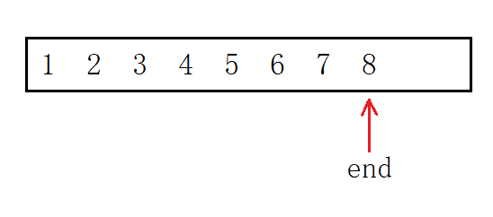

头插首先将整体也就是下标从`0`到`size-1`的元素后移一个位置。为防止内容覆盖，则必须从后向前移，方法是定义“尾指针”，每次减一从后向前遍历，最后增加一个元素即可。

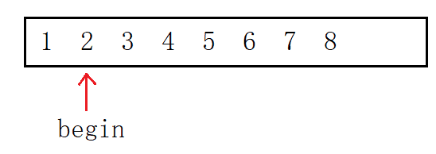

头删则是将下标为`1`到`size-1`的元素前移一个位置，定义“头指针”指向第二个元素从前向后遍历，正好将第一个元素覆盖。

#### 任意位置插入删除

~~~c
void SeqListInsert(SL* ps, int pos, SLDataType x) {
	assert(pos >= 0 && pos <= ps->size);
	CheckCapacity(ps);
	int end = ps->size - 1;
	while (end >= pos) {
		ps->data[end + 1] = ps->data[end];
		end--;
	}
	ps->data[pos] = x;
	ps->size++;
}
void SeqListErase(SL* ps, int pos) {
	assert(pos >= 0 && pos < ps->size && ps->size > 0);
	int begin = pos + 1;
	while (begin < ps->size) {
		ps->data[begin - 1] = ps->data[begin];
		begin++;
	}
	ps->size--;
}
~~~

指定位置的插入和删除其实就是分别把头插头删的最终位置和起始位置换成指定下标`pos`。当然头插头删也可以用指定位置插入删除的方法实现。

#### 其他接口

~~~c
void SeqListInit(SL* ps) {
	ps->data = NULL;
	ps->size = 0;
	ps->capacity = 0;
}
void SeqListDestroy(SL* ps) {
	free(ps->data);
	ps->data = NULL;
	ps->size = 0;
	ps->capacity = 0;
}
~~~

结构体成员数组使用的是动态开辟的空间所以记得初始化和销毁内存。因为代码执行过程中越界编译器可能不会即使检测出来，销毁内存同时还有帮助检测数组越界的功能。

~~~c
void CheckCapacity(SL* ps) {
	if (ps->size == ps->capacity) {
		int newcapacity = ps->capacity == 0 ? 4 : ps->capacity * 2;
		SLDataType* ptr = (SLDataType*)realloc(ps->data, newcapacity * sizeof(SLDataType));
		if (ptr == NULL) {
			perror("mallocfail");
			exit(-1);
		}
		ps->data = ptr;
		ps->capacity = newcapacity;
	}
}
~~~

不管是尾插，头插还是任意位置插入都要考虑需扩容的情况。同样，不管是尾删，头删还是任意位置删除都要考虑有效元素个数为0的情况。故可将检测顺序表容量的代码封装成函数，以便调用。

动态开辟内存是有内存消耗的，异地扩复制内容也会增加时间消耗，所以尽量每次开辟大一点以减少开辟次数。

> `realloc`开辟内存分为“原地扩”和“异地扩”，如果原空间后面有足够大的空间就原地扩，反之则重新开辟一段空间将原空间的内容复制过去并释放原空间返回新空间地址，称为异地扩。

~~~c
int SeqListFind(SL* ps, SLDataType x) {
	for (int i = 0; i < ps->size; i++) {
		if (ps->data[i] == x) {
			return i;
		}
	}
	return -1;
}
void SeqListPrint(SL* ps) {
	for (int i = 0; i < ps->size; i++) {
		printf("%d ", ps->data[i]);
	}
	printf("\n");
}
~~~

### 1.3 数组面试题

#### Example 1 [移除元素](https://leetcode-cn.com/problems/remove-element/)

移除数组 `nums`中所有数值等于 `val` 的元素，并返回移除后数组的新长度。

##### 思路 1

> 时间复杂度为 $O(N^2)$，空间复杂度为 $O(1)$

~~~c
int removeElement(int* nums, int numsSize, int val) {
    int number = numsSize;
    int* pnums = nums;
    while (pnums < nums + number) {
        if (*pnums == val) {
            int begin = pnums - nums;
            //begin是该元素的下标，numsSize-begin是该元素之后的元素个数
            while (begin < numsSize - 1) {
                nums[begin] = nums[begin + 1];
                begin++;
            }
            number--; 
        }
        else {
            pnums++;
        }
    }
    return number;
}
~~~

##### 思路 2

> 时间复杂度为 $O(N)$，空间复杂度为 $O(N)$

~~~c
int removeElement(int* nums, int numsSize, int val) {
    int tmp[200] = { 0 };
    int j = 0;
    //转移不是val的元素
    for (int i = 0; i < numsSize; i++) {
        if(nums[i] != val) {
            tmp[j] = nums[i];
            j++;
        }
    }
    //赋值给nums
    for(int i = 0; i < j; i++) {
        nums[i] = tmp[i];
    }
    return j;
}
~~~

##### 思路 3

快慢指针，通过指针分别指向。可以用指针也可以用下标的方式。

> 时间复杂度为 $O(N)$，空间复杂度为 $O(1)$

~~~c
int removeElement(int* nums, int numsSize, int val) {
    int* src = nums;
    int* dst = nums;
    //1. 指针版
    while (src - nums < numsSize) {
        if (*src != val) {
            *dst = *src;
            dst++;
        }
        src++;
        //是与不是，src都要++；只有赋值后dst才++
    }
    return dst - nums;
    //2. 下标版
    int src = 0, dst = 0;
    while(src < numsSize) {
        if(nums[src] != val) {
            nums[dst] = nums[src];
            dst++;
        }
        src++;
    }
    return dst;
}
~~~

#### Example 2 [数组去重](https://leetcode-cn.com/problems/remove-duplicates-from-sorted-array/)

删除有序数组 `nums` 中重复出现的元素，使每个元素只出现一次，返回删除后数组的新长度。

找到一段相同数字的区间，只留一个。

~~~c
int removeDuplicates(int* nums, int numsSize) {
    int begin = 0, end = 1;
    int dst = 1;
    if(numsSize == 0) {
        return 0;
    }
    while (end < numsSize) {
        if(nums[begin] == nums[end]) {
            end++;
        }
        else {
            begin = end;
            nums[dst] = nums[begin];
            end++;
            dst++;
        }
    }
    return dst;  
}
~~~

#### Example 3 [合并数组](https://leetcode-cn.com/problems/merge-sorted-array/)

两个按非递减顺序排列的整数数组`nums1`和`nums2`，合并`nums2`到`nums1`中，使合并后的数组同样按非递减顺序排列。

##### 思路 1

开辟新数组，将两数组的元素相比取其小值放入新数组中。

> 时间复杂度为 $O(M+N)$，空间复杂度为 $O(M+N)$

~~~c
void merge(int* nums1, int nums1Size, int m, int* nums2, int nums2Size, int n) {
    int i = 0, j = 0, dst = 0;
    int nums3[200] = { 0 };   
    while (i < m && j < n) {
        if (nums1[i] <= nums2[j]) {
            nums3[dst] = nums1[i];
            dst++, i++;
        }
        else {
            nums3[dst] = nums2[j];
            dst++, j++;
        }
    }
    //剩余元素
    while (i < m) {
        nums3[dst] = nums1[i];
        dst++, i++;
    }
    while (j < n) {
        nums3[dst] = nums2[j];
        dst++, j++;
    }
    for(int i = 0; i < m + n; i++) {
        nums1[i] = nums3[i];
    }         
}
~~~

##### 思路 2

无需开辟新数组，从大到小比较和移动元素。

> 时间复杂度为 $O(min\lbrace m,n \rbrace)$，空间复杂度为 $O(1)$

~~~c
void merge(int* nums1, int nums1Size, int m, int* nums2, int nums2Size, int n) {
    int i = m - 1, j = n - 1;
    int dst = m + n - 1;
    while (i >= 0 && j >= 0) {
        if (nums2[j] >= nums1[i]) {
            nums1[dst] = nums2[j];
            dst--, j--;
        }
        else {
            nums1[dst] = nums1[i];
            dst--, i--;
        }
    }
    while (j >= 0) {
        nums1[dst] = nums2[j];
        dst--, j--;
    }
}
~~~

比较`i`和`j`下标的元素，将其大者放入`dst`下标的位置。若`i`先走到0，则将`j`剩余的元素拷贝到`dst`。`j`走到0，标志程序运行结束。

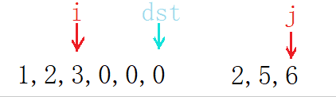

### 1.4 顺序表的缺陷

顺序表即动态增长的数组，动态数组的优缺点是很明显的。

- 缺点：
  - 动态扩容时，有时间消耗且产生内存碎片，存在一定程度上的空间浪费。
  - 头部和任意位置的插入删除，需要挪动数据。

- 优点：支持随机访问。

> 增删操作必须要挪动数据，时间消耗不可忽略，这是线性表最大的缺陷。
>
> 为避免频繁扩容，倍数扩容也会带来不可避免的空间浪费。
>
> 支持随机访问是线性表的重要的特点，很多算法中要求结构支持随机访问，如二分查找和快排。

&nbsp;

## 2. 单链表

> 顺序表采用线性的结构，连续的空间支持随机访问。增删要挪动数据是顺序表自身特点带来的不可避免的缺陷。
>
> 为解决这些问题，就出现了一种新的存储形式：链表。

### 2.1 单链表的定义

单链表是一种物理上的非连续、非顺序的存储结构。数据元素的逻辑顺序通过链表中的指针链接次序实现。

- 逻辑结构：为表现数据元素之间的相互关系而想象出的逻辑图，直观清晰便于理解。

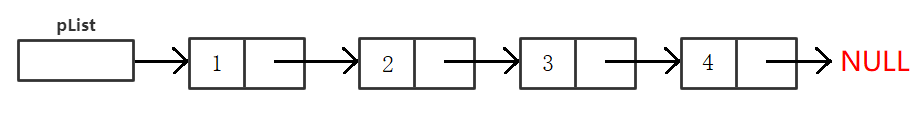

- 存储结构：体现了数据在内存中的存储形式，描述的是内存中实在的物理实体，又称物理结构。

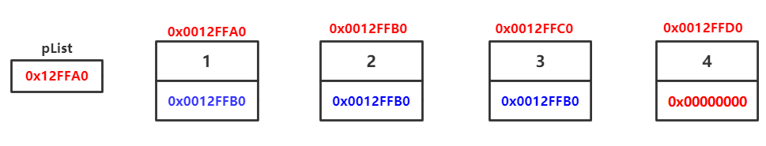

> 当然这也是最简单的链表结构：单链表。链表包括双头链表、带头不带头链表、循环链表等等。

#### 单链表结构体

~~~c
typedef int SLTDataType;
typedef struct SListNode {
	//数据域
	SLTDataType data;
	//指针域
	struct SListNode* next;
}SLTNode;
~~~

每一个结点包含数据域和指针域，数据域用于存储数据，指针域用于指向下一个结点。通过该`next`指针就可以将所有的结点从头串到尾。

```c
SLTNode* BuySLTNode(SLTDataType x)
{
    SLTNode* new_node = (SLTNode*)malloc(sizeof(SLTNode));
    if (new_node == nullptr)
        exit(1);
    new_node->data = x;
    new_node->next = nullptr;

    return new_node;
}

SLTNode* n1 = BuySLTNode(1);
SLTNode* n2 = BuySLTNode(2);
SLTNode* n3 = BuySLTNode(3);
SLTNode* n4 = BuySLTNode(4);
```

> `n1`、`n2`、`n3`、`n4`和动态开辟出来的资源有何关系？

动态开辟出来的资源都放在内存上，`malloc`会返回对应的内存地址也就是指针，我们用一个指针变量接收该返回值。

也就是说，`n1`等变量内部存储的值是资源的存储地址。

### 2.2 单链表的接口

~~~c
//动态申请一个结点
SListNode* BuySListNode(SLTDateType x);
//单链表打印
void SListPrint(SListNode* plist);
//单链表尾插
void SListPushBack(SListNode** pplist, SLTDateType x);
//单链表的头插
void SListPushFront(SListNode** pplist, SLTDateType x);
//单链表的尾删
void SListPopBack(SListNode** pplist);
//单链表头删
void SListPopFront(SListNode** pplist);
//单链表查找
SListNode* SListFind(SListNode* plist, SLTDateType x);
//单链表任意位置前插
void SListInsertForw(SListNode* pos, SLTDateType x);
//单链表任意位置后插
void SListInsertAfter(SListNode* pos, SLTDateType x);
//单链表任意位置删除
void SListErase(SListNode* pos);
//单链表任意位置后删
void SListEraseAfter(SListNode* pos);
~~~

#### 尾插头插

由上面单链表插入操作可以看出，操作单链表只能从头结点开始遍历。插入结点后须将前后链接起来。

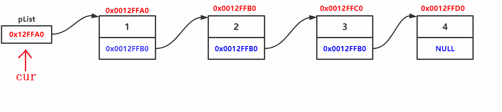

由于插入函数考虑到结点个数为0的情况，会修改实参头节点`plist`，故需要传二级指针`&plist`。

> 传二级指针仅是为能够修改头节点。也可以选择使用带头结点的方式。

1. 由于单链表的特点，尾插要申请新结点，再将新结点的地址存入尾结点的指针域。

~~~c
void SListPushBack(SLTNode** pphead, SLTDataType x) {
	assert(pphead);
    SLTNode* newNode = SListNewNode(x);
	//无结点
	if (*pphead == NULL) {
		*pphead = newNode;
	}
	//有结点
	else {
		//找尾结点
		SLTNode* tail = *pphead;
		while (tail->next != NULL) {
			tail = tail->next;
		}
		//尾结点链接
		tail->next = newNode;
	}
}
~~~

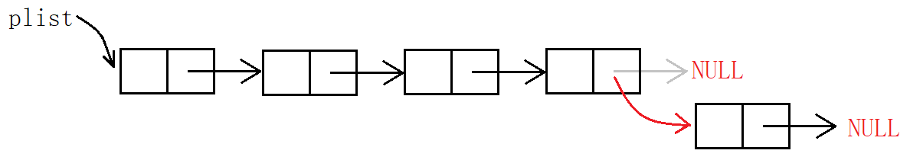

2. 头插则是申请新节点，先将新结点的地址存入头指针，再将第二个结点`phead->next`存入新结点的指针域。

~~~c
void SListPushFront(SLTNode** pphead, SLTDataType x) 
{
	SLTNode* newNode = SListNewNode(x);
	newNode->next = *pphead;
	*pphead = newNode;
}
~~~

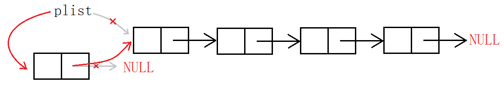

> 头插必然要修改指针`plist`的值，故必然要传头指针的地址。

**插入操作需要考虑链表为空的情况**。尾插需要遍历链表找尾结点，可能会操作对空指针的解引用，所以要单独考虑。头插不会对空指针进行访问，故头插不需要单独考虑。

#### 尾删头删

尾删，先释放尾结点再置空尾指针，然后置空上一个结点的指针域。

~~~c
//单链表尾删
void SListPopBack(SLTNode** pphead) {
	//结点个数=0
	assert(*pphead);
	//结点个数=1
	if ((*pphead)->next == NULL) {
		free(*pphead);
		*pphead = NULL;
	}
    //结点个数>1
	else {
		//找尾结点
		SLTNode* tail = *pphead;
        //前驱指针 
        SLTNode* prev = NULL;
        while (tail->next != NULL) {
            prev = tail;
            tail = tail->next;
        }
        //释放尾结点
        free(tail);
        tail = NULL;
        //置空前驱结点指针域
        prev->next = NULL;
	}
}
~~~

1. 将最后一个结点释放掉，
2. 置空上一个结点的指针域，

否则会构成野指针访问非法内存。

- 由于单链表的缺陷，不可能通过某结点访问其上一个结点，所以要定义一个前驱指针，在尾指针后移之前将其赋值给前驱指针。如此前驱指针会保持指向尾指针的前一个结点。
- 只要定义前驱指针就必须要考虑操作首结点的情况，此时不会进入循环`prev`始终是空指针，最后会操作空指针。

> ~~~c
> while (tail->next->next) {
>  tail = tail->next;
> }
> free(tail->next);
> tail->next = NULL;
> ~~~
>
> 若嫌定义前驱指针麻烦，可以只定义一个指针。但本质上都是一样的，仍需考虑结点个数为1的情况。

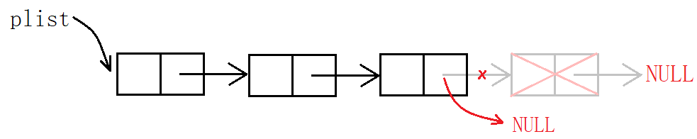

头删，先将第二个结点赋值给`tmp`，再将头结点释放，再将`tmp`赋值给头指针。

~~~c
void SListPopFront(SLTNode** pphead) {
	//结点个数为0
	assert(*pphead);
	//结点个数>=1
	SLTNode* tmpNode = (*pphead)->next;
	free(*pphead);
	*pphead = tmpNode;
}
~~~

由于链表必须从头访问，若先销毁头结点则无法向后遍历，故需要临时变量暂存第二个结点的地址。

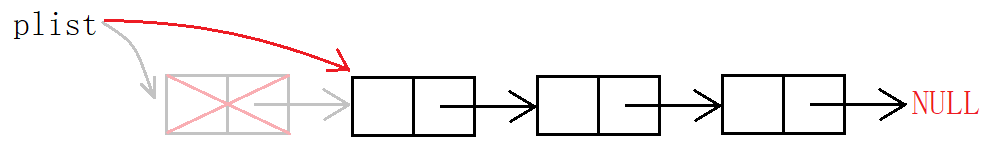

> 尾删要考虑到修改头结点的情况，头删必然会改变头指针，故头删尾删都要传头指针的地址。

#### 随机插入

~~~c
//单链表随机前插
void SListInsertForward(SLTNode** pphead, SLTNode* pos, SLTDataType x) {
	assert(pphead && pos);
    SLTNode* newNode = SListNewNode(x);
	//头插时
	if (pos == *pphead) {
		newNode->next = *pphead;
		*pphead = newNode;
	}
	else {
		//找前驱结点
		SLTNode* prev = *pphead;
		while (prev->next != pos) {
			prev = prev->next;
		}
		prev->next = newNode;
		newNode->next = pos;
	}
}
~~~

随机前插需要遍历寻找pos位置的前驱结点。因其本身特性，单链表并不适合随机前插，更适合随机后插。前插效率不高也显得更复杂，C++库中也没有前插函数。

~~~c
//单链表随机后插
void SListInsertAfter(SLTNode* pos, SLTDataType x) {
	assert(pos);
    SLTNode* newNode = SListNewNode(x);
	//结点个数为0
	if (pos == NULL) {
		pos = newNode;
	}
	else {
		newNode->next = pos->next;
		pos->next = newNode;
	}
}
//查找插入
int main() {
    SLTNode* pos = SListFind(plist, 1);
	if (pos != NULL) {
		SListInsertAfter(pos, 2);
	}
	SListPrint(plist);
}
~~~

可以看出后插复杂度为$O(1)$，前插复杂度为$O(N)$ 。单链表的结构问题致使其被当作复杂结构的子结构更方便。

#### 随机删除

~~~c
//删除当前pos位置
void SListErase(SLTNode** pphead, SLTNode* pos) {
	assert(pos);
	//首结点时
	if (*pphead == pos) {
		*pphead = pos->next;
		free(pos);
	}
	else {
		SLTNode* prev = *pphead;
		while (prev->next != pos) {
			prev = prev->next;
		}
		prev->next = pos->next;
		free(pos);
	}
}
//删除当前pos位置后结点
void SListEraseAfter(SLTNode* pos) {
	//pos后无结点
	assert(pos->next);
	SLTNode* next = pos->next;
	pos->next = next->next;
	free(next);
}
~~~

使用前驱指针必须判断结点个数为1的情况。仅判断结点个数为1的情况，不如判断操作首结点的情况全面。而特判首结点和空链表都是为了防止`prev->next=..`出问题。

#### 其他基本接口

~~~c
void SListPrint(SLTNode* phead) {
	SLTNode* cur = phead;
	while (cur != NULL) {
		printf("%d->", cur->data);
		cur = cur->next;
	}
	printf("NULL\n");
}
SLTNode* SListNewNode(SLTDataType x) {
	SLTNode* newNode = (SLTNode*)malloc(sizeof(SLTNode));
	if (newNode == NULL) {
		perror("newNode::malloc");
		exit(-1);
	}
	newNode->data = x;
	newNode->next = NULL;
	return newNode;
}
void SListDestroy(SLTNode** pphead) {
	assert(*pphead);
	SLTNode* cur = *pphead;
	while (cur) {
		SLTNode* next = cur->next;
		free(cur);
		cur = next;
	}
	*pphead = NULL;
}
~~~

链表打印函数不会改变链表，所以不用传二级指针。每新建一个结点都申请一次内存，故销毁各个结点时也要遍历链表。

~~~c
SLTNode* SListFind(SLTNode* phead, SLTDataType x) {
	assert(phead);
	while (phead != NULL) {
		if (phead->data == x) {
			return phead;
		}
		phead = phead->next;
	}
	return NULL;
}
int main() {
	//循环查找
    SLTNode* pos = plist;
	while (pos != NULL) {
    	pos = SListFind(pos, x);
    	if (pos != NULL) {
        	printf("%p-%d-->", pos, pos->data);
        	pos = pos->next;
    	}
	}
    //修改元素
    pos = SListFind(pos, 2);
    if (pos != NULL) {
        pos->data = 3;
    }
}
~~~

查找函数可以配合循环，达到循环查找并显示的目的。可以查找那么就可以修改。

### 2.3 链表面试题

#### Example 1 [移除结点](https://leetcode-cn.com/problems/remove-linked-list-elements/)

删除链表中等于给定值`val`的所有结点。 

~~~c
struct ListNode* removeElements(struct ListNode* head, int val) {
    struct ListNode* prev = head;
    struct ListNode* cur = head;
    while (cur != NULL) {
        if (cur->val == val) {
            if (cur == head) {
                head = cur->next;
                free(cur);
                cur = head;
            }
            else {
                prev->next = cur->next;
                free(cur);
                cur = prev->next;
            }
        }
        else {
            prev = cur;
            cur = cur->next;
        }
    }
    return head;
}
~~~

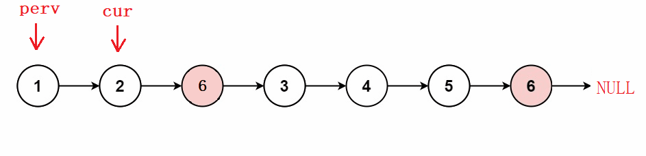

#### Example 2 [反转链表](https://leetcode-cn.com/problems/reverse-linked-list/)

反转一个单链表。 

##### 思路 1

~~~c
struct ListNode* reverseList(struct ListNode* head) {
    if (head == NULL) {
        return NULL;
    }
    struct ListNode* prev = NULL;
    struct ListNode* cur = head;
    struct ListNode* next = head->next;
    while (cur) {
        //翻转
        cur->next = prev;
        //迭代
        prev = cur;
        cur = next;
        if (next) {
            next = next->next;
        }
    }
    return prev;
}
~~~

反转链表就要逆置结点的指针域，从头到尾遍历逆置即可，需要三个指针分别指向前中后三个结点。使中间结点指向前驱结点，再每个指针向后移动一个结点。

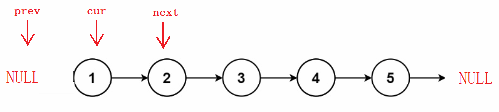

##### 思路 2

头插

~~~c
struct ListNode* reverseList(struct ListNode* head) {
    struct ListNode* newhead = NULL;
    struct ListNode* cur = head;
    while (cur) {
        struct ListNode* next = cur->next;        
        cur->next = newhead;
        newhead = cur;
        cur = next;
    }
    return newhead;
}
~~~

建立一个新链表，将原链表每个结点头插到新链表中，再返回新链表。


#### Example 3 [中间结点](https://leetcode-cn.com/problems/middle-of-the-linked-list/)

给定一个带有头结点`head`的非空单链表，返回链表的中间结点。如果有两个中间结点，则返回第二个中间结点。

快慢指针。

~~~c
struct ListNode* middleNode(struct ListNode* head) {
    struct ListNode* slow = head;
    struct ListNode* fast = head;
    while (fast && fast->next) {
        slow = slow->next;
        fast = fast->next->next;        
    }
    return slow;
}
~~~

奇数个结点，快指针走到尾节点，偶数个结点，快指针走到空结点。故“快指针不为空和快指针不为尾”是循环的条件。

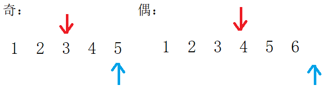

#### Example 4 [输出结点](https://www.nowcoder.com/practice/529d3ae5a407492994ad2a246518148a)

输入一个链表，输出该链表中倒数第`k`个结点。 

快慢指针。指针之间的距离相同。

~~~c
struct ListNode* FindKthToTail(struct ListNode* pListHead, int k) {
    struct ListNode* slow = pListHead;
    struct ListNode* fast = pListHead;
    while (k--) {
        if (!fast) {
            return NULL;
        }
        fast = fast->next;
    }
    while (fast) {
        fast = fast->next;
        slow = slow->next;
    }
    
    return slow;
}
~~~

快指针先走 $k$ 步，慢指针再和快指针同时每次走一步，当快指针走到空时，慢指针即走到倒数第 $k$ 个结点。

设总步数为 $N$ ，可以看成两部分。第一种前 $k$ 步和后 $N-k$ 步或者是第二种前 $N-k$ 步和后 $k$ 步。 虽然不知道总步数具体数值，但可以让两个指针分别按两种方式走。也就是快指针先走 $k$ 步，然后同步，满指针最后就停在了倒数第 $k$ 步。

> 当然，快指针先走$k-1$步，则快指针走到尾时，慢指针同样也是倒数第k步。`while(--k)`则是走$k-1$步。

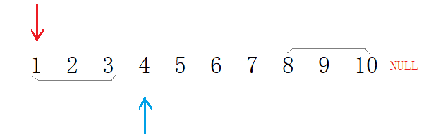

#### Example 5 [合并链表](https://leetcode-cn.com/problems/merge-two-sorted-lists/)

将两个有序链表合并为一个新的有序链表并返回。新链表是通过拼接给定的两个链表的所有结点组成的。

##### 思路 1

~~~c
struct ListNode* mergeTwoLists(struct ListNode* l1, struct ListNode* l2) {
    if (l1 == NULL) {
        return l2;
    }
    if (l2 == NULL) {
        return l1;
    }
    struct ListNode* head = (struct ListNode*)malloc(sizeof(struct ListNode));
    struct ListNode* tail = head;
    while (l1 && l2) {
        if (l1->val <= l2->val) {
            if (head == NULL) {
                head = tail = l1;
            }
            else {
                tail->next = l1;
                tail = l1;
            }
            l1 = l1->next;
        }
        else {
            if (head == NULL) {
                head = tail = l2;
            }
            else {
                tail->next = l2;
                tail = l2;
            }
            l2 = l2->next;
        }
    }
    if (l1) {
        tail->next = l1;
    }
    if (l2) {
        tail->next = l2;
    }
    return head;
}
~~~

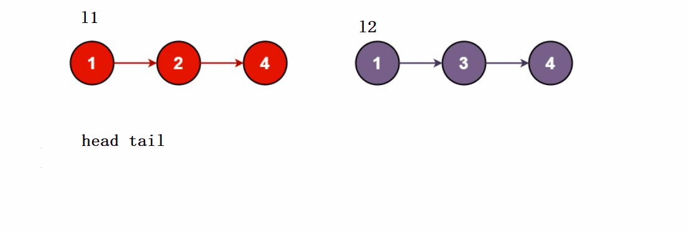

##### 思路 2 

带哨兵位的头结点。

~~~c
struct ListNode* mergeTwoLists(struct ListNode* l1, 
                               struct ListNode* l2) {
    if (l1 == NULL) {
        return l2;
    }
    if (l2 == NULL) {
        return l1;
    }
    struct ListNode* head = NULL;
    struct ListNode* tail = NULL;
    head = tail= (struct ListNode*)malloc(sizeof(struct ListNode));
    while (l1 && l2) {
        if (l1->val <= l2->val) {
            tail->next = l1;
            tail = l1;
            l1 = l1->next;
        }
        else {
            tail->next = l2;
            tail = l2;
            l2 = l2->next;
        }
    }
    if (l1) {
        tail->next = l1;
    }
    if (l2) {
        tail->next = l2;
    }
    struct ListNode* tmp = head->next;
    free(head);
    return tmp;
}
~~~


#### Example 6 [链表分割](https://www.nowcoder.com/practice/0e27e0b064de4eacac178676ef9c9d70)

以给定值`x`为基准将链表分割成两部分，所有小于`x`的结点排在大于或等于`x`的结点之前。

~~~c
ListNode* partition(ListNode* pHead, int x) {
    //哨兵位
    struct ListNode* lessHead = (struct ListNode*)malloc(sizeof(struct ListNode));
    struct ListNode* greaterHead = (struct ListNode*)malloc(sizeof(struct ListNode));
    struct ListNode* cur = pHead;
    struct ListNode* lessTail = lessHead;
    struct ListNode* greaterTail = greaterHead;
    //尾插
    while (cur) {
        if (cur->val < x) {
            lessTail->next = cur;
            lessTail = cur;
        }
        else {
            greaterTail->next = cur;
            greaterTail = cur;
        }
        cur = cur->next;
    }
    //边界置空
    greaterTail->next = NULL;
    lessTail->next = greaterHead->next;
    struct ListNode* newHead = lessHead->next;
    free(lessHead);
    free(greaterHead);
    return newHead;
}
}
~~~

链表题一般不再原链表上直接操作。新建两个链表，将原链表中的小于和大于`x`的结点分别尾插到新链表中。再将两个新链表链接起来。

> 边界结点指针域一定要置空，因为原链表中尾结点前一个结点的指针域还存着尾结点的地址，若二者分在两个链表中，则会形成环形链表造成死循环。

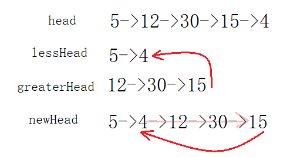

#### Example 7 [回文结构](https://www.nowcoder.com/practice/d281619e4b3e4a60a2cc66ea32855bfa)

链表的回文结构。

##### 思路 1

~~~c
bool chkPalindrome(ListNode* A) {
    // write code here
    //1. 找中间结点
    struct ListNode* mid = A;
    struct ListNode* tail = A;
    while (tail && tail->next) {
        tail = tail->next->next;
        mid = mid->next;
    }
    //2. 逆置后半部分链表
    struct ListNode* prev = NULL;
    struct ListNode* cur = mid;
    struct ListNode* next = mid->next;
    while (cur) {
        next = cur->next;
        cur->next = prev;
        prev = cur;
        cur = next;
    }
    //3. 遍历比较
    while (A && prev) {
        if (A->val != prev->val) {
            return false;
        }
        A = A->next;
        prev = prev->next;
    }
    return true;
}
~~~

将链表的后半部分逆置，再与前半部分比较。

本来理应将前半部分链表尾置空，但是如果不置空的话加之合理的判断条件也是可以的。如图，分为结点数为奇偶两种情况。

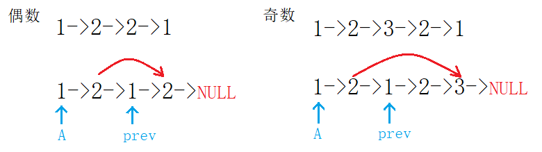

> 可以在代码中插入输出检查语句，运行后可以在输出内容中查看，检查代码是否正确。
>
> ~~~c
> //1. 
> while (prev) {
> printf("%d->", prev->val);
> prev = prev->next;
> }
> //2. 
> printf("val:%d,prev:%d\n", A->val, prev->val);
> ~~~


#### Example 8 [相交链表](https://leetcode-cn.com/problems/intersection-of-two-linked-lists/)

输入两个链表，找出它们的第一个公共结点。

链表是线性结构，每个结点都仅有一个后继。相交仅可能是两个链表最终指向同一个链表的情况，而不可能仅有一个相同结点。如图：

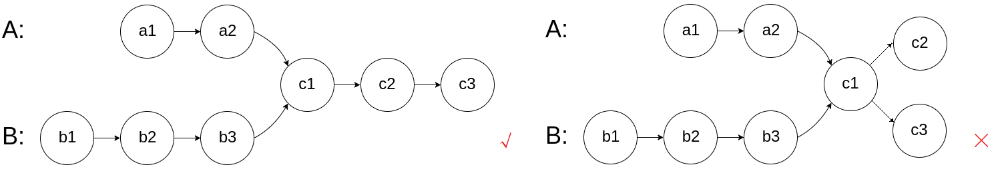

~~~c
struct ListNode *getIntersectionNode(struct ListNode *headA, struct ListNode *headB) {
    // 判断相交
    struct ListNode* tailA = headA;
    struct ListNode* tailB = headB;
    int lenA = 0, lenB = 0, len = 0;
    while (tailA) {
        ++lenA;
        tailA = tailA->next;
    }
    while (tailB) 
    {
        ++lenB;
        tailB = tailB->next;
    }
    if (tailA != tailB) {
        return NULL;
    }
    // 找x
    else {
        int gap = abs(lenA - lenB);
        struct ListNode* longlist = headA;
        struct ListNode* shortlist = headB;
        if (lenA < lenB) {
            longlist = headB;
            shortlist = headA;    
        }
        while (gap--) {
            longlist = longlist->next;
        }
        while (longlist != shortlist) {
            longlist = longlist->next;
            shortlist = shortlist->next; 
        }            
        return longlist;
    }
    return NULL;
}
~~~

为防止链表有长有短，不好比较，先让长链表走二者的差距步，再让长链表和短链表一起遍历。


#### Example 9 [环形链表 I](https://leetcode-cn.com/problems/linked-list-cycle/)

给定一个链表，判断链表中是否有环。

环形链表就是经典的快慢指针的问题，`slow`每次走1步，`fast`每次走两步。

若链表不带环，`fast`一定会遍历为空，若带环，`fast`会在环中和`slow`相遇。

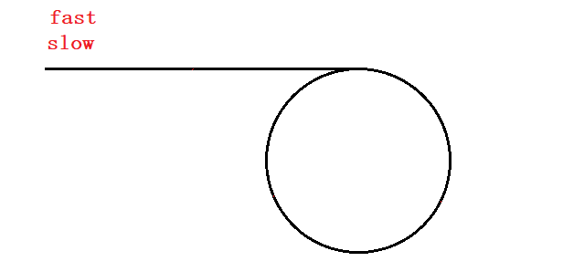

> 具体走多少步才能进环和相遇，取决于表头到环口的长度和环长。

~~~c
bool hasCycle(struct ListNode *head) 
{
    struct ListNode* slow = head;
    struct ListNode* fast = head;
    
    while (fast && fast->next) 
    {
        slow = slow->next;
        fast = fast->next->next;
        
        if (slow == fast)
            return true;
    }
    
    return false;
} 
~~~

##### 问题延伸

1. 为什么在上述情况下快慢指针在环内一定相遇？会不会错过或者永不会追上？

当`slow`进环时，`fast`已然早已进环。由于`fast`每次2步，`slow`1步，每次`fast`比`slow`多一步。二者之间的差距正在逐步的缩小，且每次都缩小1步。

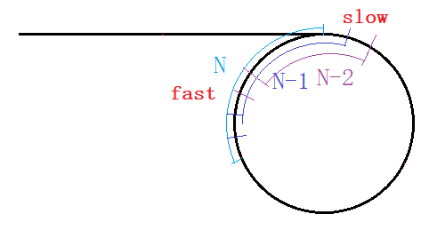

如图所示，假设第一次`fast`和`slow`之间距离为$N$，再走一次变成 $N-1,N-2,…,3,2,1,0$ 。这样必然存在距离为 $0$ 步也就是相遇的情况。

2. 为什么快指针只比慢指针快一步？快指针是否可以走 $n$ 步？$(n>2,n∈Z)$ 

> 由上题可以看出，$N$每次减1必然会有减到0的情况。假设快指针每次走3步慢指针每次走1步，则$N$每次减2，$N$的变化情况为$N,N-2,N-4\;...$ 。
>
> 若$N$为偶数时可以减到 $0$，若$N$为奇数时会减到 $1$ 然后是$-1$，即`fast`又超过了`slow`，这证明本趟是追不上的。
>
> 现在二者之间的距离变成了 $C-1$ ，$C$ 为环长。环长是固定的，如果 $C-1$ 为奇数，即最后不能减到 $0$ ，如果 $C-1$ 为偶数，则本次可以相遇。

只有**二者之间的距离 $N$ 是二者每次进步数差值的整数倍**时，二者才会一次性在环内相遇。若二者之间的距离 $N$ 和环长 $C$ 都不是二者每次进步数差值的整数倍，那么二者永不相遇。

> 显然，1是任意整数的倍数，所以快慢指针差距步数为1时二者最后必然相遇。其他任意数值都存在追不上的情况。故快指针每次走2步，慢指针每次走1步的方法时最好的方法。


#### Example 10 [环形链表 II](https://leetcode-cn.com/problems/linked-list-cycle-ii/)

给定一个链表，返回链表开始入环的第一个节点。 如果链表无环，则返回 `null`。

##### 思路 1

两个指针，一个从相遇点`meetNode`向后遍历，一个从头结点`head`向后遍历，最后二者会在环的入口点相遇。

~~~c
struct ListNode *detectCycle(struct ListNode *head) {
    struct ListNode* slow = head;
    struct ListNode* fast = head;
    //找相遇点
    while (fast && fast->next) {
        slow = slow->next;
        fast = fast->next->next;
        if (slow == fast) {
            //有环
            struct ListNode* meet = slow;
            while (meet != head) {
                meet = meet->next;
                head = head->next;
            }
            return meet;
        }
    }
    //无环
    return NULL;
}
~~~

**证明过程**

在追击相遇的过程中：慢指针走过的距离为 $L+X$，快指针走过的距离为 $L+nC+X$。

> 由于表头到环口的距离 $L$ 和环长 $C$ 的不确定，快指针在环内的走过的距离也是不固定的，故假设快指针的绕环数 $n$ 。即快指针必然在环内走过一圈，但具体走几圈不确定。

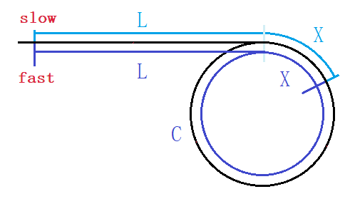

因快指针走的距离为慢指针走的二倍，得公式：
$$
2(L+X)=L+nC+X
$$
化简得：$L+X=nC$，即 $L=nC-X$，进一步化简得
$$
L=(n-1)C+(C-X)
$$
$L$ 代表表头到环口的距离，而 $C-X$ 代表相遇点到环口的距离。**二者相等意味着从表头走到环口和从相遇点走到环口的距离相等**。

故两个指针分别从相应的位置走，最后必然在环口相遇。

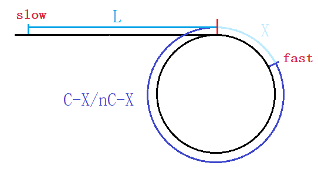

##### 思路 2

从相遇点处将链表断开置空，从其下一个结点开始看作新链表，该链表和从表头开始的原链表是相交链表，而环口就变成了相交结点。

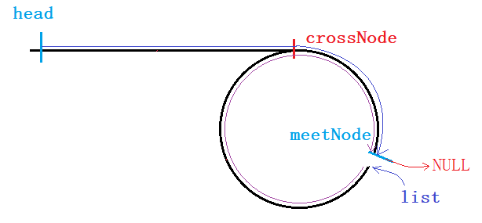

~~~c
struct ListNode* getIntersectionNode(struct ListNode* headA, struct ListNode* headB) {
    struct ListNode* curA = headA;
    struct ListNode* curB = headB;
    int lenA = 0;
    int lenB = 0;
    while (curA) {
        ++lenA;
        curA = curA->next;
    }
    while (curB) {
        ++lenB;
        curB = curB->next;
    }
    struct ListNode* longList = headA;
    struct ListNode* shortList = headB;
    int gap = abs(lenA - lenB);
    if (lenA < lenB) {
        longList = headB;
        shortList = headA;
    }
    while (gap--) {
        longList = longList->next;
    }
    while (longList && shortList) {
        if (longList == shortList) {
            return longList;
        }
        longList = longList->next;
        shortList = shortList->next;
    }
    return NULL;
}
struct ListNode *detectCycle(struct ListNode *head) {
    struct ListNode* slow = head;
    struct ListNode* fast = head;
    struct ListNode* list = NULL;
    while (fast && fast->next) {
        fast = fast->next->next;
        slow = slow->next;
        //有环
        if (slow == fast) {
            //将相遇点变为新表头
            list = fast->next;
            //置空
            fast->next = NULL;
        }
    }
    //无环
    if (slow != fast) {
        return NULL;
    }
    // 找交点
    return getIntersectionNode(head, list);
}
~~~


#### Example 11 [复制随机指针链表](https://leetcode-cn.com/problems/copy-list-with-random-pointer/)

给你一个长度为 `n` 的链表，每个节点包含一个额外增加的随机指针 `random` ，该指针可以指向链表中的任何节点或空节点。

> 构造这个链表的**深拷贝**。 深拷贝应由`n`个**全新**节点组成。复制链表中的指针都不应指向原链表中的节点 。
>
> 1. 每个新节点的值都设为其对应的原节点的值。
> 2. 新节点的`next`指针和`random`指针也都应指向复制链表中的新节点，并使原链表和复制链表中的这些指针能够表示相同的链表状态。

 ~~~c
struct Node* copyRandomList(struct Node* head) {
    //尾插新结点
    struct Node* cur = head;
    while (cur) {
        struct Node* newNode = (struct Node*)malloc(sizeof(struct Node));
        newNode->val = cur->val;
        newNode->next = cur->next;
        cur->next = newNode;
        cur = newNode->next;
    }
    //修改random
     cur = head;
    while (cur) {
        if (cur->random == NULL) {
            cur->next->random = NULL;
        }
        else {
            cur->next->random = cur->random->next;
        }
        cur = cur->next->next;
    }
    //提取结点，链接成新链表 
    cur = head;
    struct Node* copyHead = (struct Node*)malloc(sizeof(struct Node));
    struct Node* curCopy = copyHead;
    copyHead->next = NULL;
    while (cur) {
        curCopy->next = cur->next;
        curCopy = curCopy->next;
        cur = cur->next->next; 
    }
    return copyHead->next;
}
 ~~~

1. 每个结点的后面插入一个`val`值相同的结点。

> 这样便于复制原结点到新结点，也方便后续的各种操作。

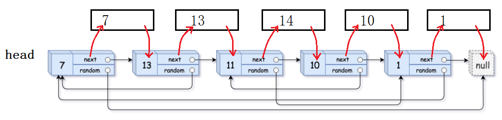

2. 修改插入结点的`random`指针域。

> 从原节点开始遍历，共分两种情况：若为当前结点`cur`的`random`为空则为空，`cur`的`random`的`next`是需被拷贝的新结点，当前结点的`next`的`random`是需修改的新结点。

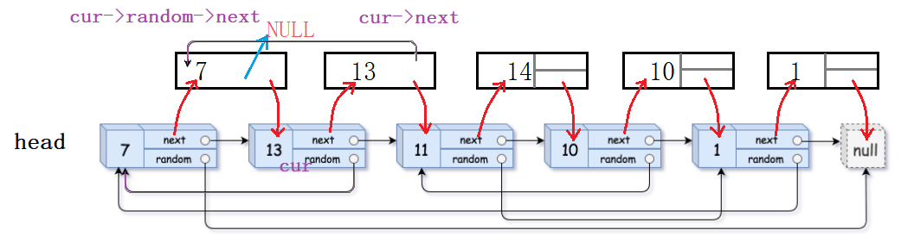

3. 提取所有插入的新结点链接成一个链表。

### 2.4 链表的分类

#### 单向和双向链表

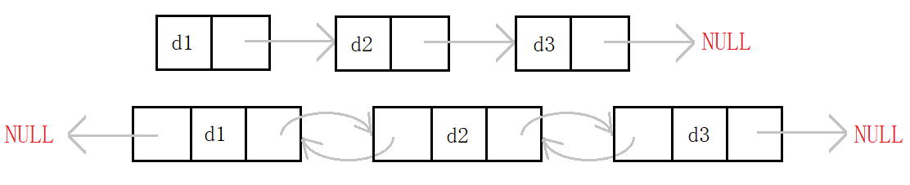

单链表仍然存在不少的缺陷，单纯使用单链表的增删查改意义不大。因其存在缺陷，很多OJ题都将单链表作为考察对象。

#### 带头和不带头链表

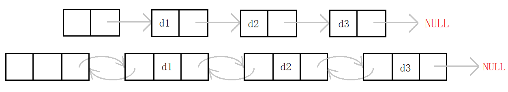

哨兵位的头结点不存储有效数据，不需要以二级指针的形式传参，因为不会修改头结点。但使用结束后需要释放。在oj练习种非常方便。

#### 循环和非循环链表

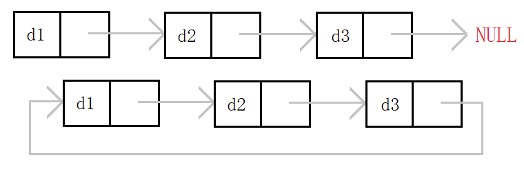

非循环链表即尾结点指向空。循环链表是一种特殊的带环链表，其尾结点指向头结点。

#### 两种重要形式链表

> 链表中最重要的形式有两种：无头单向非循环链表和带头双向循环链表。

- 普通链表结构最为简单。实际中单链表更多是作为复杂数据结构的子结构，如哈希桶、邻接表等。

- 带头双向循环链表，结构最为复杂。实际中的链表一般都是带头双向循环链表，结构虽复杂，但使用却较为简单。

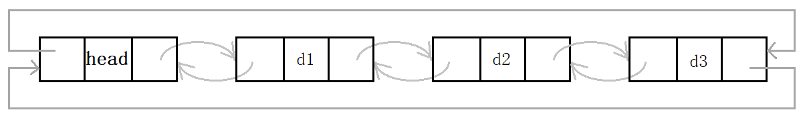

&nbsp;

## 3. 双向链表

### 3.1 双向链表的定义

双向链表即**带头双向循环**链表，

1. 带头：带哨兵位的头结点，方便尾插和传参。
2. 双向：每个结点有两个指针域，存储前驱和后继两个结点的地址。
3. 循环：链表的尾结点不指向空，而是尾结点指向头结点，头结点指向为尾结点。

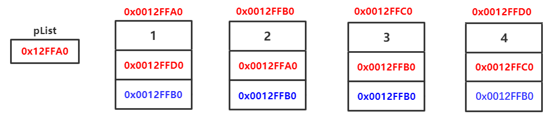

#### 双向链表结构体的定义

~~~c
typedef int LTLTDataType;

typedef struct ListNode 
{
    LTLTDataType _data;
	struct ListNode* next;
	struct ListNode* prev;
}ListNode;
~~~

双向链表的结构看似复杂，但由于结构优势，各种操作的实现却更为简单。

双向链表的“无死角”结构使得任意操作都具有普适性，不需要考虑特殊情况，任意结点都有前驱后继。

### 3.2 双向链表的接口实现

~~~c
//双向链表初始化
ListNode* ListCreate();
//双向链表销毁
void ListDestory(ListNode* plist);
//双向链表打印
void ListPrint(ListNode* plist);
//双向链表尾插
void ListPushBack(ListNode* plist, LTDataType x);
//双向链表尾删
void ListPopBack(ListNode* plist);
//双向链表头插
void ListPushFront(ListNode* plist, LTDataType x);
//双向链表头删
void ListPopFront(ListNode* plist);
//双向链表查找
ListNode* ListFind(ListNode* plist, LTDataType x);
//任意位置前插
void ListInsert(ListNode* pos, LTDataType x);
//任意位置删除
void ListErase(ListNode* pos);
~~~

#### 双向链表尾插尾删

~~~c
void ListPushBack(LTNode* phead, LTDataType x) {
	assert(phead);
	LTNode* newNode = CreateNewNode(x);
	LTNode* tail = phead->prev;
	//1. tail & newNode
	tail->next = newNode;
	newNode->prev = tail;
	//2. newNode & phead
	newNode->next = phead;
	phead->prev = newNode;
}
~~~

> 1. 带头链表不需要传二级指针，因为不会修改头指针，这就是带头的好处。
>
> 2. 尾插找尾也不需要循环遍历，头结点的前驱即是尾结点。
> 3. 因为带头，代码对于链表为空即仅有头指针的情况同样适用。

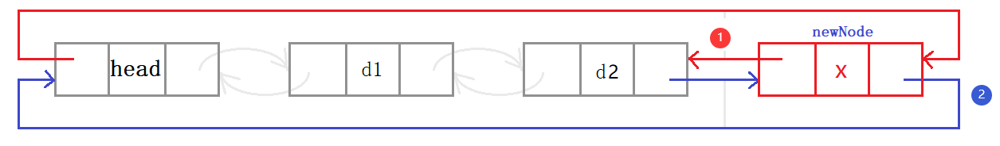

由于每个结点都有前后的链接指针，只要修改头和尾结点与新结点的链接关系即可。

> 链接结点1与结点2的关系，两条语句即完成。`node1->next=node2`,`node2->prev=node1`。

所以实现双向链表的增删查改时，只需要两步：

1. **找到操作结点，**
2. **修改操作结点。**

这便是双向链表的结构优势。

~~~c
void ListPopBack(LTNode* phead) {
	assert(phead);
	assert(phead->next != phead);
    //1. 找到操作结点
	LTNode* tail = phead->prev;
	LTNode* tailPrev = tail->prev;
	//2. 修改操作结点
	tailPrev->next = phead;
	phead->prev = tailPrev;
	free(tail);
}
~~~

先找到待操作的尾结点`tail`和其前驱结点`tailPrev`。再修改链接关系尾结点的next指向头，头的prev指向尾结点。

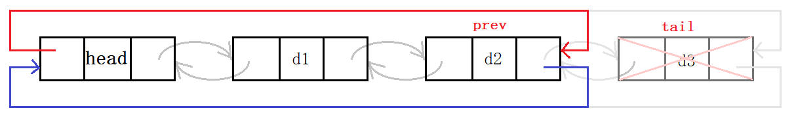

#### 双向链表头插头删

~~~c
void ListPushFront(LTNode* phead, LTDataType x) {
	assert(phead);
	LTNode* newNode = CreateNewNode(x);
	LTNode* next = phead->next;
	//1. newNode & next
	newNode->next = next;
	next->prev = newNode;
	//2. head & newNode
	phead->next = newNode;
	newNode->prev = phead;
}
~~~

操作结点为`head`，`next`，`newNode`。分别修改前驱和后继即可。

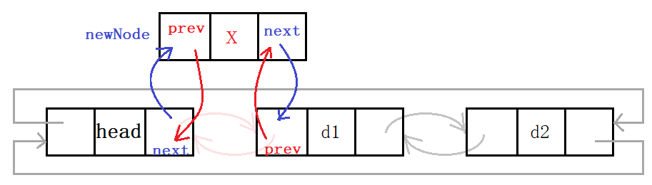

~~~c
void ListPopFront(LTNode* phead) {
	assert(phead);
	assert(phead->next != phead);
	LTNode* next = phead->next;
	LTNode* nextNext = next->next;
	// head & nextNext
	phead->next = nextNext;
	nextNext->prev = phead;
	free(next);
}
~~~

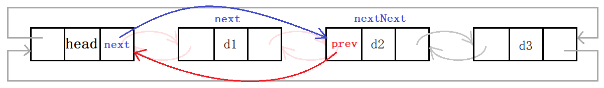

实现代码时需要注意操作多个结点时，尽量多定义变量以避免混淆中各逻辑关系，同时使得代码逻辑清晰，简洁明了。避免写出`node->next->next...`这样的代码。

#### 任意位置插入删除

~~~c
void ListInsert(LTNode* pos, LTDataType x) {
	assert(pos);
	//posPrev newNode pos
	LTNode* posPrev = pos->prev;
	LTNode* newNode = CreateNewNode(x);
	//1. posPrev & newNode
	posPrev->next = newNode;
	newNode->prev = posPrev;
	//2. newNode & pos
	newNode->next = pos;
	pos->prev = newNode;
}
void ListErase(LTNode* pos) {
	assert(pos);
	assert(pos->next != pos);
	LTNode* prev = pos->prev;
	LTNode* next = pos->next;
	//prev & next
	prev->next = next;
	next->prev = prev;
    free(pos);
}
~~~

因双向链表循环特性，在头结点之前插入即尾插。任意位置的插入删除和头尾插删差不多，这里不再赘述。

> ~~~c
> LTNode* pos = ListFind(plist, 2);
> if (pos) {
>  	ListErase(pos);
> }
> ListPrint(plist);
> ~~~

#### 其他基本接口

##### 链表初始化和销毁

~~~c
LTNode* ListInit() {
	LTNode* head = (LTNode*)malloc(sizeof(LTNode));
	if (head == NULL) {
		perror("Init::malloc");
		exit(-1);
	}
	head->next = head;
	head->prev = head;
	
	return head;
}
void ListDestroy(LTNode* phead) {
	assert(phead);
	LTNode* cur = phead->next;
	while (cur->next != phead) {
		LTNode* next = cur->next;
		free(cur);
		cur = next;
	}
	free(phead);
}
plist = NULL;
~~~

初始化时同样注意双向循环的结构。此时也可以不传递二级指针，可以利用返回值的方式传递给外部的实参`plist`。

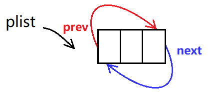

为保持接口一致性，对头指针`plist`的置空放在函数调用处。

##### 创建结点

~~~c
LTNode* CreateNewNode(LTDataType x) {
	LTNode* newNode = (LTNode*)malloc(sizeof(LTNode));
	if (newNode == NULL) {
		perror("newNode::malloc");
		exit(-1);
	}
	newNode->data = x;
	newNode->next = NULL;
	newNode->prev = NULL;
	return newNode;
}
~~~

##### 链表打印和查找

~~~c
void ListPrint(LTNode* phead) {
	assert(phead);
	LTNode* cur = phead->next;
	while (cur != phead) {
		printf("%d<->", cur->data);
		cur = cur->next;
	}
	printf("\n");
}
LTNode* ListFind(LTNode* phead, LTDataType x) {
	assert(phead);
	LTNode* cur = phead->next;
	while (cur != phead) {
		if (cur->data == x) {
			return cur;
		}
		cur = cur->next;
	}
	return NULL;
}
~~~

遍历双向链表需要注意循环的条件，从第一个有效结点`phead->next`开始，当其等于头结点时`cur==phead`结束。查找和打印都是同样的遍历的方法。

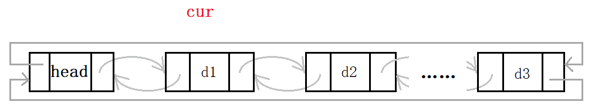

&nbsp;

## 4. 二者的区别和联系

> 链表和顺序表孰优？链表和顺序表的对比。

顺序表即动态增长的数组，动态数组的优缺点是很明显的。

- 缺点：
  1. 动态扩容时，有时间消耗且产生内存碎片，存在一定程度上的空间浪费。
  2. 头部中部的插入删除，需要挪动数据，效率低。
- 优点：
  1. 支持随机访问。
  2. CPU高速缓冲命中率更高

> 增删操作必须要挪动数据，时间消耗不可忽略，这是线性表最大的缺陷。
>
> 为避免频繁扩容的倍数扩容也会带来不可避免的空间浪费。支持随机访问是线性表的重要的特点，很多算法中要求结构支持随机访问，如二分查找和快排。

而链表利用指针将数据链接起来，结点之间不像数组元素一样强关联。

- 缺点：
  1. 结点之间需要通过指针链接。不支持随机访问。
  2. 链表存储数据同时还需存储前后指针，一定的消耗。
  3. CPU高速缓存命中率更低
- 优点：
  1. 按需合理申请空间，不存在空间浪费。
  2. 增删结点时无需挪动数据，效率高。

> 单链表不可以通过下标访问任意结点（即随机访问），必须从头结点开始遍历。某些算法不支持。

