# 基础IO

## 0. C文件IO

### 0.1 C文件接口回顾

#### 开关

```cpp
FILE* fp = fopen("log.txt", "w"); // 1.
assert(fp);
fclose(fp);                       // 2.
```

#### 输出

~~~cpp
fputc('w', fp);                 // 1.
fputs(msg, fp);                 // 2.
fprintf(fp, "hello log.txt\n"); // 3.
fwrite(msg, 15, 1, fp);         // 4.
~~~

#### 输入

```c
//1.
fread(buffer, sizeof(buffer), 1, fp);  //文件指针不移动，下次读取仍在首行
//2.
fscanf(fp, "%s\n", buffer); //文件指针移动但无法读取空格
//3. 
while (fgets(buffer, sizeof(buffer), fp))
    printf("%s\n", buffer);
if (feof(fp)) // 判断是否到文件尾
    printf("reach endoffile\n");
```

### 0.2 三个标准流

一般程序运行的时候，语言会默认打开三个输入输出流，分别为`stdin`,`stdout`,`stderr`。

从系统角度看，`stdin`对应的设备是键盘，`stdout`对应的设备是显示器，`stderr`对应的设备是显示器。

```cpp
#include <stdio.h>
extern FILE* stdin;
extern FILE* stdout;
extern FILE* stderr;
```

&nbsp;

## 1. 内存文件

### 1.1 理解内存文件

**文件是内容和属性的集合**，文件不仅有内容，还有各种属性。任何文件操作都可以分为对文件内容的操作和对文件属性的操作。

文件没被打开时是放在磁盘上的，想要打开文件就必须访问磁盘，就必须经过操作系统。


打开文件的本质就是将文件相关的属性信息加载到内存中。内存中不仅存在大量的进程，也可能存在大量的文件，**操作系统必然要像管理进程一样将内存中的文件管理起来**。

文件也有文件结构体叫做`struct file`，用来描述文件相关的属性和内容。系统会将所有打开的文件用文件结构体描述，再用数据结构把所有文件结构体组织起来。

> 通过上述“先描述再组织”的方式，可以将内存中所有打开的文件管理起来。可如何将进程和进程打开的文件关联起来呢？

#### 文件描述符

内核中，每个进程都有一个内核数据结构叫做`struct files_struct`，用来描述进程的相关文件信息。

我们只关心该结构体最后一个字段，文件结构体指针数组`struct file* fd_array[]`，用于存放进程所打开的文件结构体的地址。

将数组`fd_array`下标作为文件描述符，来为进程的每个文件编号，**文件描述符的本质就是内核文件数组的下标**。

> 用户层只通过文件描述符访问文件，不必涉及底层细节。

```cpp
int fd = open ("./log.txt", O_WRONLY | O_CREAT, 0664);
```


> 用数组作为结构体最后一个字段，也就是变长数组。

##### 文件描述符的性质

文件描述符可以唯一的映射到对应的文件，那么调用系统接口也可以直接对`0`, `1`,`2`号文件进行读写。

```c
write(1, "hello world\n", 12);    // 向1号文件写入
write(2, "hello world\n", 12);    // 向2号文件写入

char buff[64] = {0};                                                                 
read(0, buff, sizeof(buff) - 1);  // 向0号文件读取
```

文件描述符的分配规则：**分配文件描述符数组中最小且没有使用的位置，作为新文件的fd**。

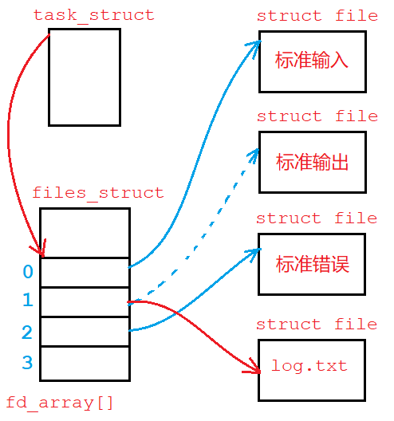

##### 文件描述符和文件指针

文件描述符是系统对上提供的，用来唯一标识一个文件的。`FILE*`文件指针是C语言语言层提供给C语言程序，用来唯一标识一个文件的。

`FILE`文件结构体，内部是C语言关于文件属性的集合，必定要封装系统提供的文件描述符。


```cpp
printf("%d\n",  stdin->_fileno);
printf("%d\n", stdout->_fileno);
printf("%d\n", stderr->_fileno);
```

#### 重定向

```cpp
#include <unistd.h>
int dup2(int oldfd, int newfd); 
```

> 虽然可以先关闭文件，再打开新文件以达成重定向的目的。但有时文件已经创建，只能用`dup2`解决。

**把 newfd 新文件的地址拷贝至 oldfd 的位置，那么 oldfd 也就指向了新文件**，自此就可以通过 oldfd 操作新文件了。

在系统内部，修改进程对应文件描述符表的特定下标位置的内容，致使该 fd 指向其他文件。这个过程上层是无法感知的。


```c
// 输入重定向
int fd = open("log.txt", O_RDONLY);
dup2(fd, 0);
```

- 进程替换后dup2的作用并不会消失。进程替换发生在物理内存处，而dup2修改的是文件数据结构，二者并不存在影响。
- 子进程创建之后同样会将内核相关的文件系统结构体`files_struct`继承下来，它也是内核数据结构的一部分。但文件结构体`struct file`是属于打开文件的结构体，并不是内核数据结构所以只有一份。

> 类似环境变量，标准输入输出错误流也是这样继承下来的。

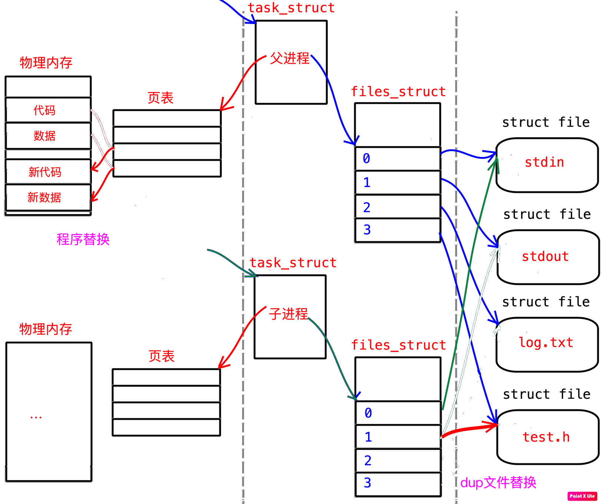

#### 硬件设备管理方法

> 进程默认打开标准输入输出错误文件，分别对应着键盘和显示器设备。如何做到“一切皆文件”的呢？

不同的硬件设备，如键盘显示器等，它们的驱动程序提供给操作系统的读写接口肯定是不一样的。操作系统为避免差异统一管理，在驱动层上添加了一层虚拟文件系统`vfs`，也就是一堆文件结构体的集合。

**文件结构体中只声明读写函数的形式，由底层设备驱动提供具体的读写函数实现。**

当有数据来时，系统先通过系统的读写接口将数据拷贝到对应文件的缓冲区中，再通过设备驱动提供的读写接口将数据真正送到硬件上。

系统不需要关心底层设备细节，只需调用对应文件结构体读写方法即可。这样就能以文件视角统一的看待所有设备。这就是系统层面的多态。

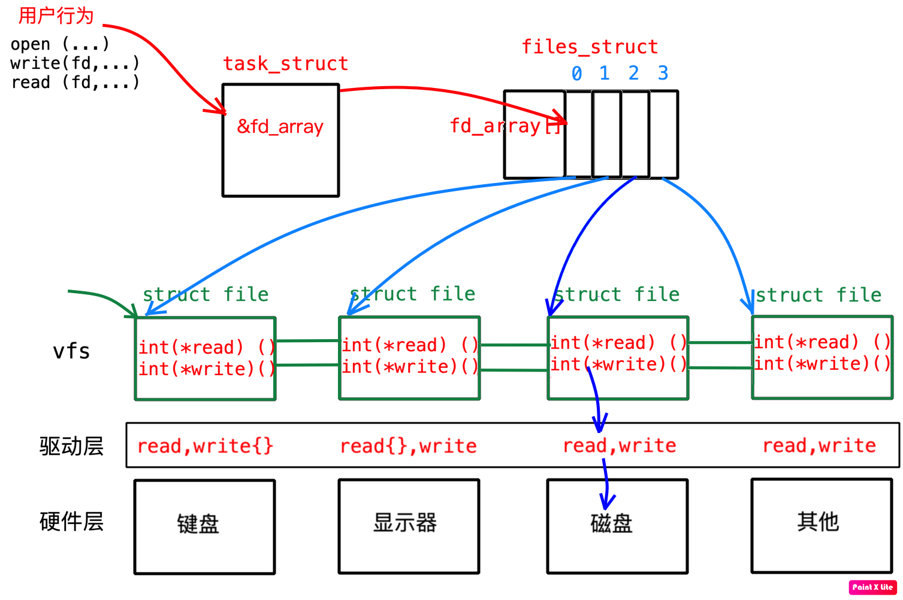

> 文件结构体像是只声明读写函数的父类对象，设备驱动像是拥有读写函数具体实现的子类对象。

这就是Linux系统一切皆文件的实现方法。

### 1.2 文件操作接口

#### open/close

```cpp
#include <sys/types.h>
#include <sys/stat.h>
#include <fcntl.h>
int open (const char* pathname, int flags);
int open (const char* pathname, int flags, mode_t mode);
int creat(const char* pathname,            mode_t mode);

#include <unistd.h>
int close(int fd);
```

| pathname   | flags    | mode     | 返回值                         |
| ---------- | -------- | -------- | ------------------------------ |
| 文件的路径 | 打开模式 | 文件权限 | 成功返回文件描述符，失败返回–1 |

- `flags`是打开模式标志位，**本质是32位整型位图，可以将多个宏参数按位或传入**。         

如：`O_WRONLY`代表只写，`O_CREAT`代表创建，`O_RDONLY`代表只读，`O_TRUNC`表示清空原有内容。

这些宏都是互不相同且只有一个比特位为1的整数。可以将多个宏或起来传入，简单且高效。

- `mode`是八进制整数，用来设置该文件的权限信息。**需要提前设置程序文件权限掩码`umask`**。

如：`0664`，从前向后每一位分别代表用户组员其他人的读写执行权限。

- 和C文件接口`fopen`不同，**`open`以写方式打开，默认不会清空文件内容**。写入会覆盖原有内容。

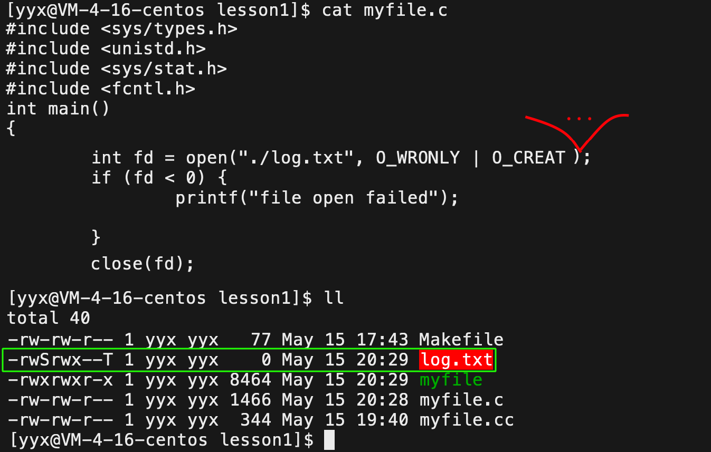

> 创建文件时必须要指定文件权限。已知文件存在可以不管权限。

```cpp
umask(00);
int fd = open("log.txt", O_CREAT | O_WRONLY, 0666);
int fd = open("log.txt", O_CREAT | O_WRONLY | O_TRUNC, 0666);
int fd = open("log.txt", O_CREAT | O_WRONLY | O_APPEND, 0666);

printf("fd: %d, errno: %d, errdisc: %s\n", fd, errno, strerror(errno));
close(fd);
```

#### write/read

```cpp
#include <unistd.h>
ssize_t write(int fd, const void* buf, size_t count);  
ssize_t read (int fd,       void* buf, size_t count);
```

|           | fd         | buf        | count          | 返回值             |
| --------- | ---------- | ---------- | -------------- | ------------------ |
| **write** | 文件描述符 | 写入字符串 | 写入的字符个数 | 真正写入的字符个数 |
| **read**  | 文件描述符 | 读取数组   | 读取的字符个数 | 真正读取的字符个数 |

```cpp
//write
ssize_t s = write(fd, "hello log.txt\n", strlen(msg));
assert(s);

//read
char buff[1024] = {0};
ssize_t s = read(fd, buff, sizeof(buff) - 1);
assert(s);
```

### 1.3 缓冲区

```cpp
close(1);

int fd = open("./log. txt", O_WRONLY, O_CREAT, 0664);
printf("hello printf\n");

//close(fd); // 不关闭文件
```

如果最后没有关闭文件，文件中会存在内容。如果关闭文件，文件中就不会出现内容。这个问题本质是数据是否真正到达显示器的问题。

#### 用户缓冲区和内核缓冲区

**语言会提供语言层面的缓冲区，叫做用户缓冲区**。系统层也存在一个缓冲区，叫做内核缓冲区。数据会先后经过语言和内核缓冲区，最后到达硬件设备。


>  目前只讨论用户缓冲区，内核缓冲区暂不做考虑。

调用语言提供的文件读写库函数如`fprintf`，本质是：

1. 将数据写入到C语言的用户缓冲区；
2. 再由系统调用，刷新用户缓冲区的内容到文件的内核缓冲区；
3. 再到磁盘或其他外设中。

也就是说，通过语言库函数读写文件，都必先将数据输出到用户缓冲区，再交给系统输出到底层，并没有直接到外设上。

> 系统何时才会将用户缓冲区的内容拿走呢？操作系统自有一套刷新策略，也可以调用 fflush 手动刷新。

操作系统刷新用户缓冲区的策略有三种：

1. 不缓冲，立即刷新；
2. 行缓冲，遇到`\n`就刷新缓冲区；一般显示器刷新是行刷新。
3. 全缓冲，缓冲区满了才刷新。一般向磁盘文件写入是全缓冲，但在进程退出时还会统一刷新一次。

最开始的示例代码，实际上在写入普通文件而不是显示器，普通文件的刷新策略是全缓冲，此时，数据仍然在用户缓冲区中。

- **直接关闭系统文件流**，会导致用户缓冲区的内容丢失。
- 避免这种情况可以手动刷新用户缓冲区，或者关闭C语言文件流。

> 注意，我们关闭的系统层的文件流。并不是语言层的文件流。

~~~cpp
write(3, "hello write\n", 12);
fprintf(file_ptr, "hello printf\n");
close(1); // 关闭文件
~~~

1. `write`直接输出到内核缓冲区，不会被 close 关闭文件而“拦截”；
2. `printf`是语言库函数，要经用户缓冲区再到内核缓冲区，会被 close 关闭文件“拦截”住。

#### 缓冲区和子进程

~~~cpp
//系统调用
const char* msg1 = "hello write\n";
write(1, msg1, strlen(msg1));
//C库函数
printf("hello printf\n");
fputs("hello fputs\n", stdout);
fprintf(stdout, "hello fprintf\n");

fork(); //创建子进程
~~~

> 执行结果如图所示：

~~~shell
$ ./redir # 输出到显示器
hello 标准输出
hello printf
hello fputs
hello fprintf
$ ./redir  > log.txt # 重定向到文件
$ cat log.txt
hello 标准输出  #    -- 系统调用内容只有一份
hello printf   #--
hello fputs    # ｜ -- 库函数输出内容第一份
hello fprintf  #-｜
hello printf   #-｜
hello fputs    # ｜ -- 库函数输出内容第二份
hello fprintf  #--
~~~

表面看`fork`创建子进程时程序核心代码已执行完毕即将返回了，所以创建的子进程毫无用处，但输出的结果却有所不同。

- 输出到显示器是行刷新，`printf`一类库函数都是缓冲区一行直接刷新，所以最后缓冲区内没有内容。
- 输出到文件是全刷新，只有等缓冲区满或者进程结束才刷新。首先系统调用`write`直接到内核缓冲区不受影响，

1. `printf`一类**库函数的内容只有等进程退出才会刷新，所以`fork`执行后数据仍然在缓冲区**。
2. 并且C缓冲区属于进程的相关数据，所以不管父子任意一方谁先退出并**刷新缓冲区都算是修改程序数据会发生写时拷贝**，所以父子都会刷新一遍用户缓冲区，所以打印了两份库函数的输出内容。 

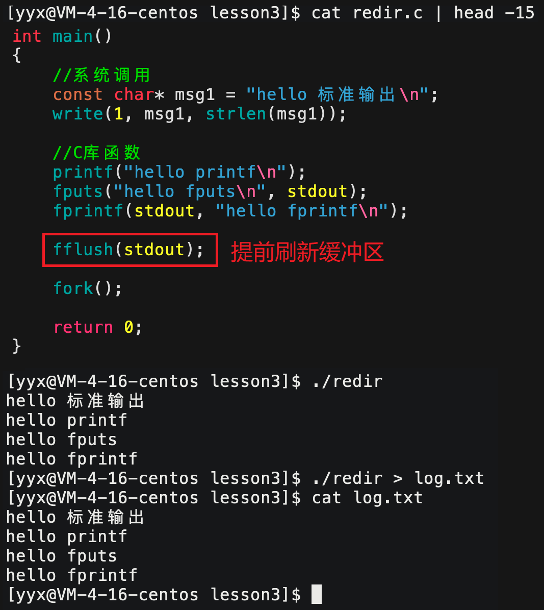

当然，可以在`fork`之前提前将缓冲区内数据全部刷新，等到子进程创建之时就不会存在修改代码数据写实拷贝的问题了。

&nbsp;

## 2. 磁盘文件

> 以上讨论的都是在内存中打开的文件，而接下来是文件在磁盘上的存储方式，或者是磁盘文件的管理方式。

文件就是文件内容和文件属性的集合。文件如果没有被打开，则是存储在磁盘上的。磁盘是计算机中的一个机械设备（固态硬盘除外）。

企业中存储数据一般都用机械硬盘，虽然机械硬盘几乎退出桌面级市场，但是它具有容量大，价格便宜，使用寿命长的优点。

磁盘打开后如下图所示，整体由盘片，主轴，磁头，机械臂以及其他部分组成。其中主轴带动多个盘片高速转动，由机械臂带动磁头在盘片上寻找指定位置进行读写。

- 盘片表面多个同心圆被划分出“磁道”，又被直径所在的直线划分成不同“扇区”。
- 磁头首先要在盘片上移动到指定的磁道，再等待盘片旋转所指定的扇区到来，即可进行读写。


由于磁头的大小很小，可以看成一个点，所以磁盘虽然是圆形，但可以将一条条的磁道看成一条直线，是线性的。对磁盘管理的时候可以将其看成一个线性的结构，如下图所示：

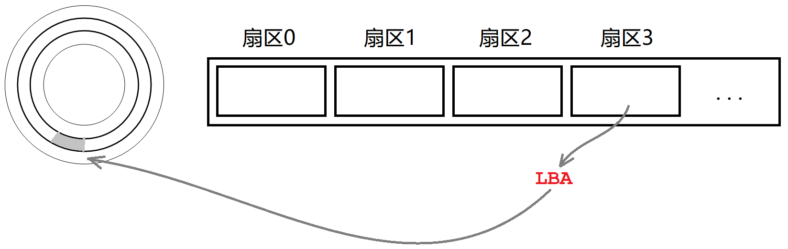

#### 2.1 磁盘区域的管理

类似国家行政区域划分，磁盘同样需要划分不同的区域来管理。从省到市到县，对应道磁盘管理就相当于：

1. 分区：将一整块硬盘，划分多个磁盘分区，相当于划分省份。
2. 格式化：给每个分区写入文件系统，相当于建立省政府，便于管理。

对于每个分区，仍要进行细化管理，具体结构如图所示：


1. `Boot Block`：存储磁盘启动加载操作系统相关的信息。
2. `Block Group`：整个分区划分成不同的组块。

##### 磁盘文件的存储

对于每一个`Block Group`内部，又被划分出了不同区域，这里才是存储文件的开始：

- `Data Block`：是实际存储文件内容的区域，这块区域又划分成很多小空间`block`，用来存储单个文件的内容，大小一般为4KB。
- `Inode Table`：是实际存储文件属性的区域，同理也被划分成很多小空间`inode`，用来存储单个文件的属性，大小一般为512Byte。

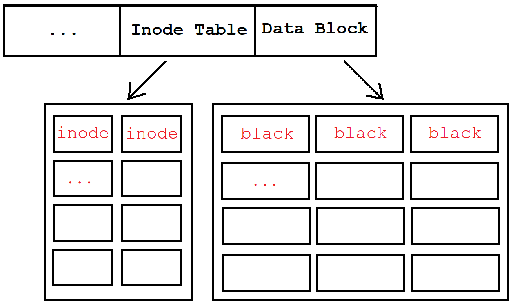

计算机内一般都不以名称作为唯一标识。也就是说，**系统不以文件名这个字符串来区分文件，而是使用文件的`inode`编号来唯一标识文件**，即一个文件一个 inode。

创建一个文件，首先要在 Inode Table 中找到一块没有使用的 inode，将文件属性填入进去。再到该 inode 对应的 block 中填入文件内容。如果不够会在后方再开辟一个 block。

所以，`inode`是一种结构体，存储文件的相关属性信息：

~~~c
struct inode {
  	//文件的所有属性
  	//数据 int inode_number;
    // int blocks[32]; //存储该文件所占有的所有block的下标
};
~~~

所以，通过 inode 就可以确定文件的所有属性以及存储的内容。但顺序遍历 Inode Table 来找到我们需要的那个 inode，效率太低下，故使用如下两个位图结构来帮助我们查找：`Block BitMap`，`Inode BitMap`。

> 位图是用整数的每个二进制位组成的一张图，每个二进制位要么为0要么为1，故位图的每个单元也只能表示只有两种值的数。


以`Inode BitMap`为例， 

- 位图下标编号：每个`inode`所在的位置，也就是数组下标，从0开始编号。
- 位图单元的值：每个`inode`单元的值，要么0要么1，1表示该`inode`已被占用，0表示`inode`还未使用。

同样，`Block Bitmap`下标对应着`Block`的位置，内容也对应着该`Block`是否被使用。查找没有使用的 inode 或者 block 位置可以直接遍历位图即可。

> - `Super Block`：包含本组`block Group `的空间使用情况和整个分区所有的组的一些信息。
>
> - `Group Descriptor Table`：包含本组的一些使用信息，如组的在分区的编号和组内的 inode block 和 data block 的使用情况。这两个仅了解。

```shell
$ ll -ai     # 查看文件的inode
total 16
1317057 drwxrwxr-x 3 yyx yyx 4096 May 22 14:31 .
 665397 drwxrwxr-x 6 yyx yyx 4096 May 21 03:41 ..
1320703 -rw-rw-r-- 1 yyx yyx   12 May 22 15:00 hello.c
1320704 drwxrwxr-x 2 yyx yyx 4096 May 22 14:31 tmp
```

~~~shell
$ touch hello.c                 # 首先创建文件inode，再将文件名hello.c和inode关联起来

$ echo "hello world" > hello.c  # 将字符串hello world填入文件inode对应的block中

$ cat hello.c          			# 1. 读取所在目录的block，获取block中文件名hello.c映射的inode
							    # 2. 遍历inode table找到并打印inode对应的block[]中的内容
							    
$ rm hello.c                    # 在inode bitmap中找到文件inode的位置将其内容置为0
								# 之后再创建文件覆盖即可
~~~

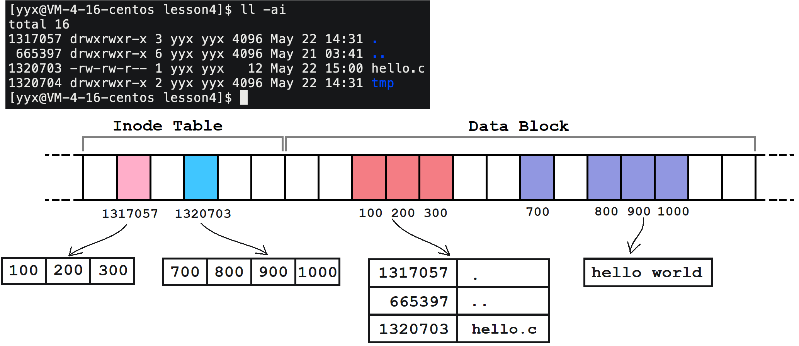

`inode`中并不存储文件名，但在目录的`block`中存储其下文件的 inode 和文件名的映射。

#### 2.2 软连接和硬连接

软硬链接可以帮助我们在其他目录下建立一个文件的链接，软链接像是 windows 里的快捷方式，硬链接像是直接复制了一份。

##### 软硬链接的创建

```shell
$ ln -s mytest mytest_link        # 创建软链接
$ ln    mytest mytest_hard        # 创建硬链接
```

~~~shell
## 软链接
$ ln -s tmp/bin/test/test mytest_link        # 创建软链接
$ ll
total 4
lrwxrwxrwx 1 yyx yyx   17 May 22 16:44 mytest_link -> tmp/bin/test/test  # 软链接
drwxrwxr-x 3 yyx yyx 4096 May 22 16:39 tmp
$ ./tmp/bin/test/test  # 运行指定目录下可执行文件
hello world
$ ./mytest_link        # 直接运行软链接
hello world
## 硬链接
$ link tmp/bin/test/test mytest_hard         # 创建硬链接
$ ll
total 16
-rwxrwxr-x 2 yyx yyx 8360 May 22 16:40 mytest_hard                       #硬链接 
drwxrwxr-x 3 yyx yyx 4096 May 22 16:39 tmp
$ ./tmp/bin/test/test  # 运行指定目录下可执行文件
hello world
$ ./mytest_hard        # 直接运行硬链接
hello world
~~~

##### 软硬链接的取消

```shell
$ unlink mytest_link # 取消软硬链接
```

```shell
$ ll
total 16
-rwxrwxr-x 2 yyx yyx 8360 May 22 16:40 mytest_hard
lrwxrwxrwx 1 yyx yyx   17 May 22 16:44 mytest_link -> tmp/bin/test/test
drwxrwxr-x 3 yyx yyx 4096 May 22 16:39 tmp
$ unlink mytest_hard # 取消硬链接
$ ll
total 16
lrwxrwxrwx 1 yyx yyx   17 May 22 16:44 mytest_link -> tmp/bin/test/test
drwxrwxr-x 3 yyx yyx 4096 May 22 16:39 tmp
$ unlink mytest_link # 取消软链接
$ ll
total 16
drwxrwxr-x 3 yyx yyx 4096 May 22 16:39 tmp
```

##### 软硬链接的区别

```shell
$ ln tmp/test mytest_soft -s       # 创建软链接
$ ln tmp/test mytest_hard          # 创建硬链接
$ ls -ail                # 查看当前目录文件的inode信息
total 24
1317057 drwxrwxr-x 3 yyx yyx 4096 May 22 17:08 .
 665397 drwxrwxr-x 6 yyx yyx 4096 May 21 03:41 ..
1320753 -rwxrwxr-x 2 yyx yyx 8360 May 22 17:07 mytest_hard
1320754 lrwxrwxrwx 1 yyx yyx    8 May 22 17:08 mytest_soft -> tmp/test
1320704 drwxrwxr-x 2 yyx yyx 4096 May 22 17:07 tmp
$ ls -ail tmp/test       # 查看 tmp/test 的inode信息
1320753 -rwxrwxr-x 2 yyx yyx 8360 May 22 17:07 tmp/test
```

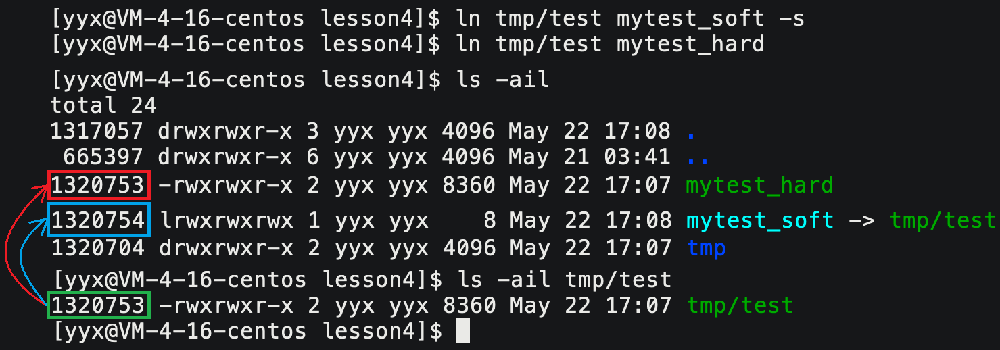

硬链接的 inode 和被链接文件的 inode 是一样的，但软链接有自己独立的 inode。

- 也就是说，**软连接本身是个独立的文件，有自己的 inode 属性集和数据块**。
- 硬链接不是独立文件，它**本质是把链接原文件的 inode 和文件名的映射关系在新的文件夹下复制了一份**。

##### 文件属性硬链接数

~~~shell
$ ls -a -i -l 
1320704 drwxrwxr-x 2 yyx yyx 4096 May 22 17:31 .
1317057 drwxrwxr-x 3 yyx yyx 4096 May 22 17:28 ..
1320703 -rw-rw-r-- 1 yyx yyx    0 May 22 17:31 file.txt
~~~

输入上述命令时，显示的第三组数据，就是当前文件的硬链接数。也就是说，该文件在磁盘上存在多少个 inode 和文件名的映射关系。

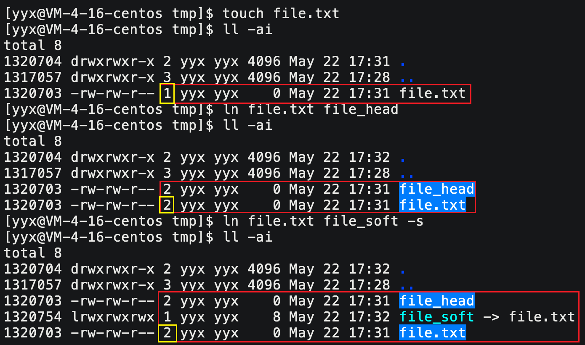

> 建立一个硬链接，就多了一个该文件的映射关系，所以硬链接数变成2，和软链接无关。

硬链接数是记录当前系统中有多少个该文件，等到硬链接数为0时，再将该文件从系统中删除。这就是引用计数。

#### 2.3 三个文件系统时间

通过如下命令，可以获取文件的状态信息。

```shell
$ stat test.c # 获取文件的状态信息
```

```shell
$ stat test.c 
  File: ‘test.c’
  Size: 0               Blocks: 0          IO Block: 4096   regular empty file
Device: fd01h/64769d    Inode: 1320701     Links: 1
Access: (0664/-rw-rw-r--)  Uid: ( 1003/     yyx)   Gid: ( 1003/     yyx)
Access: 2022-05-24 02:38:07.988811151 +0800  # Access Time
Modify: 2022-05-24 02:38:07.988811151 +0800  # Modify Time
Change: 2022-05-24 02:38:07.988811151 +0800  # Change Time
 Birth: -
$
```

| 时间            | 解释                         |
| --------------- | ---------------------------- |
| **Access Time** | 文件被访问的最近时间         |
| **Modify Time** | 文件**内容**被修改的最近时间 |
| **Change Time** | 文件**属性**被修改的最近时间 |


> 其中，`Access Time`理论上是最常被修改的时间概念，所以系统为防止频繁刷盘造成效率下降，该时间被系统控制，由系统定时刷新。

此外，Makefile选择是否编译源文件的依据，也正是源文件的 Modify Time 是否新于可执行文件的 Modify Time。 

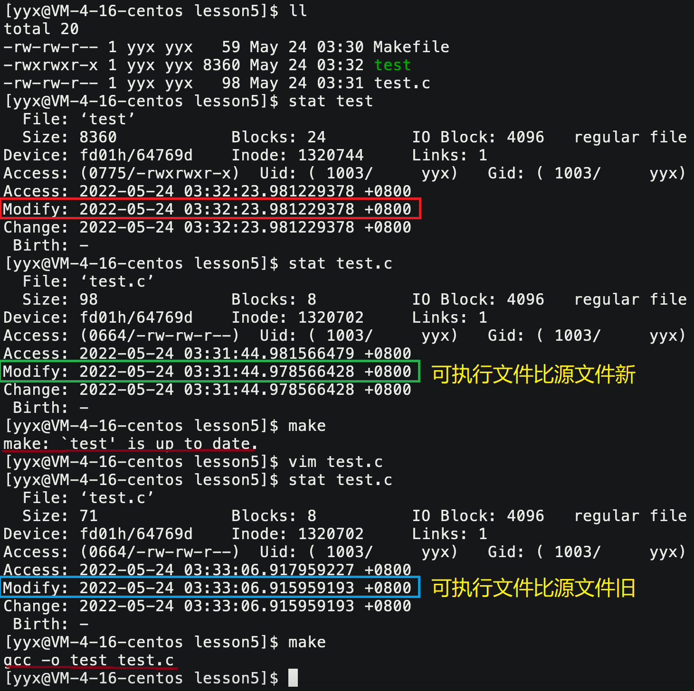

&nbsp;

## 3. 动静态库

> 从第一次接触语言的时候，就已经接触了库，如C标准库。语言本身会提供库，库可以看成一套头文件和一套库文件的总称。

#### 3.1 动静态库的定义

一般库文件分两种：静态库和动态库。Linux下静态库文件的后缀为`.a`，动态库文件的后缀为`.so`。

```shell
$ ldd a.out # 查看可执行程序所依赖的动态库
```

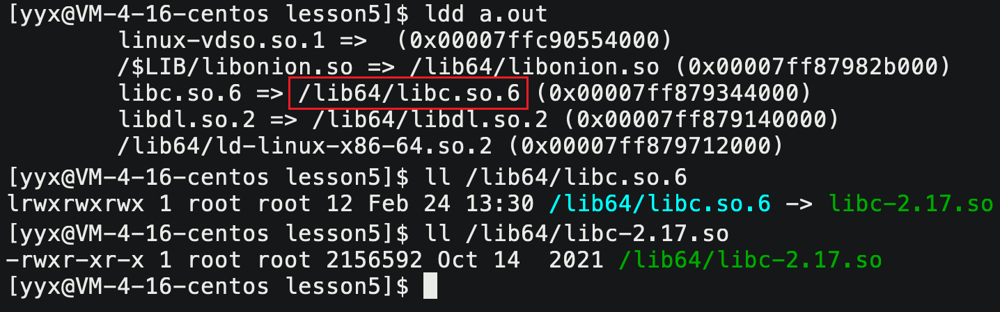

- 库的文件命名：`libXXXX.so.xx`或`libXXXX.a.xx`。
- 库的真实命名：去掉前缀`lib`，去掉后缀`.so.xx`或`.a.xx`，剩下的就是真实命名。

##### 静态链接和动态链接

静动态链接两者最大的区别就在于链接的时机不一样，静态链接是在形成可执行程序前，而动态链接的进行则是在程序执行时。

|              | 缺点                       | 优点                       |
| ------------ | -------------------------- | -------------------------- |
| **静态链接** | 空间浪费严重，更新较为麻烦 | 运行速度相对快一点         |
| **动态链接** | 运行速度相对慢一点         | 避免空间浪费，维护比较方便 |

>
> - 静态链接会将库文件拷贝至目标文件中，造成程序文件体积较大。
> 
>   但其具备执行所需的程序，不需要查找其他目录文件，所以运行速度快。
> 
> - 在执行的时候。若库文件被修改，就需要打包并编译重新生成库。
> 
> - 由系统的装载程序加载库，并链接形成程序。库内容不会像静态链接那样存在多份，而是多个程序共享。
> 
>   更新只需替换原有库，新库会自动加载并链接。库与可执行文件独立，提高了可维护性。
> 
> - 因为链接推迟到了程序运行时，所以每次执行程序都需要进行链接。
> 

```shell
[yyx@VM-4-16-centos lesson5]$ file a.out # 静态链接文件
a.out: ELF 64-bit LSB executable, x86-64, version 1 (GNU/Linux), statically linked, for GNU/Linux 2.6.32, BuildID[sha1]=60f7c9201cbb0d2683347758ad1514283fbcf74d, not stripped
[yyx@VM-4-16-centos lesson5]$ file a.out # 动态链接文件
a.out: ELF 64-bit LSB executable, x86-64, version 1 (SYSV), dynamically linked (uses shared libs), for GNU/Linux 2.6.32, BuildID[sha1]=ffe3de634d1ea953ad33a91e5c179a74d840c573, not stripped
```
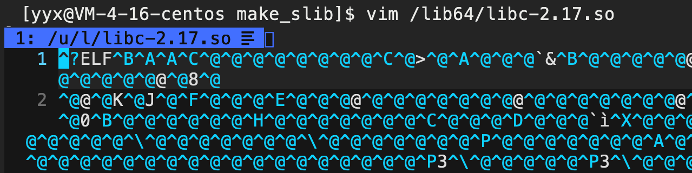

一般一个完整的库，都会提供如下的文件：

1. 库文件本身：如图所示，库本身就是由`.o`可重定向目标文件打包而成的二进制文件，
2. 配套头文件：只能通过配套的`.h`头文件查看库所提供的接口声明，
3. 说明文档：对库的一些说明，不重要。

> 标准的声明定义分离，方便生成库，同时也方便维护。库一方面方便使用，一方面更加安全。

#### 3.2 静态库的生成

```shell
$ cat add.c
#include "add.h"
int add(int x, int y) {
    return x + y;
}
$ cat add.h
#pragma once
#include <stdio.h>
extern int add(int x, int y);
$ cat sub.c
#include "sub.h"
int sub(int x, int y) {
    return x -y;
}
$ cat sub.h
#pragma once
#include <stdio.h>
extern int sub(int x, int y);
$ ll
total 16
-rw-rw-r-- 1 yyx yyx 59 May 24 06:09 add.c
-rw-rw-r-- 1 yyx yyx 64 May 24 06:06 add.h
-rw-rw-r-- 1 yyx yyx 57 May 24 06:09 sub.c
-rw-rw-r-- 1 yyx yyx 64 May 24 06:06 sub.h
```

将该四个文件编译成静态库的方法如下：

1. 先将所有`.c`源文件编译成`.o`目标文件，
2. 将**所有的`.o`文件打包形成一个库文件。**这就是静态库的本质。

```shell
$ ar -rc libXXX.a XXX.o # ar 打包静态库命令 -rc replace & create
```

```makefile
# Makefile
libmath.a : add.o sub.o
    ar -rc $@ $^ # -rc replace & create
%.o : ./lib/%.c
    gcc -c $<

.PHONY:output
output:
    mkdir output
    cp -rf libmath.a output/
    cp -rf  src/*.h output/

.PHONY:clean
clean:
    rm -rf libmath.a *.o output
.PHONY:install
install:
	cp -rf *.h /usr/include
	cp -f libmath.a /lib64
```

```shell
$ ar -tv libXXX.a # 查看静态库打包的.o目标文件
rw-rw-r-- 1003/1003   1240 May 24 18:02 2022 add.o
rw-rw-r-- 1003/1003   1240 May 24 18:02 2022 sub.o
```

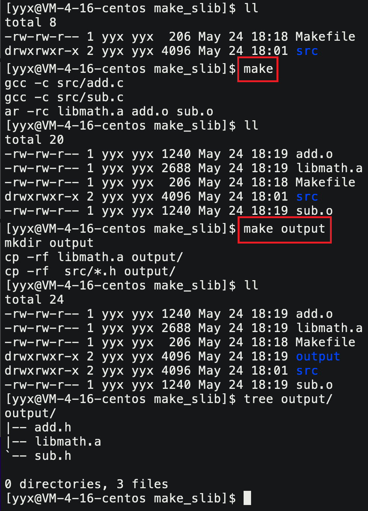

交付时直接将`output`目录下的头文件和库文件拷贝给他人即可。

#### 3.3 静态库的使用

链接指定的库文件编译源文件，可以采用如下方式：

```shell
$ gcc test.c -I./lib  -L./lib  -lmath
```

1. `-I`：指明头文件所在路径
2. `-L`：指明库文件所在路径
3. `-l`：指明库文件的真实名称，注意是去掉前后缀的真实名称

> 系统库文件在系统的默认路径下，头文件是在`usr/include`，库文件在`/lib64`中。编译器能够自动识别。

```makefile
mytest : mytest.c
    gcc -o $@ $^ -I./lib -L./lib -lmath # 使用静态库
.PHONY:clean
clean:
    rm -rf mytest
```

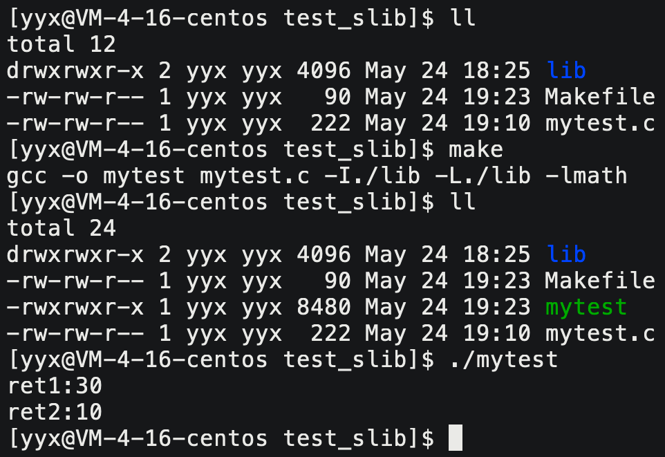

#### 3.4 动态库的生成

```makefile
libmath.so : add.o sub.o
    gcc -shared -o $@ $^ # -shared 共享库也就是动态库
%.o : ./src/%.c
    gcc -fPIC -c $< # 目标文件与位置无关

.PHONY:output
output:
    mkdir output
    cp -rf libmath.a output/
    cp -rf  src/*.h output/

.PHONY:clean
clean:
    rm -rf libmath.a *.o output
```

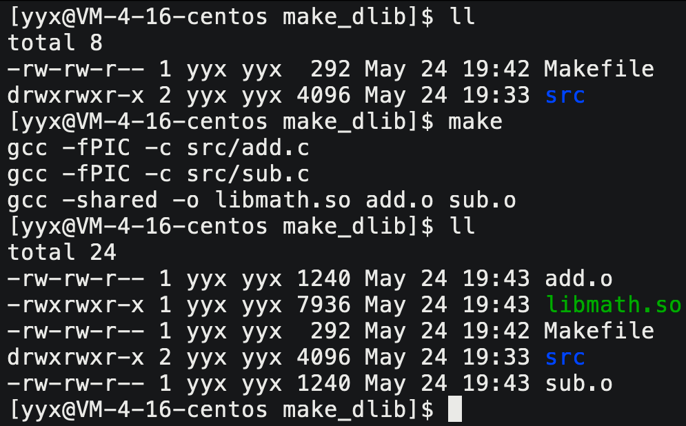

#### 3.5 动态库的使用

```shell
gcc -o $@ $^ -I./lib -L./lib -lmath # 编译时指定动态库
```

```makefile
mytest : mytest.c
        gcc -o $@ $^ -L./lib -lmath
.PHONY:clean
clean:
        rm -rf mytest
```

由于动态库是运行时链接，所以系统加载程序的时候，仍要给加载器指定所依赖的动态库。

只能将库所在路径放入内存级环境变量`LD_LIBRARY_PATH`，或导入系统文件`.bash_profile`中。

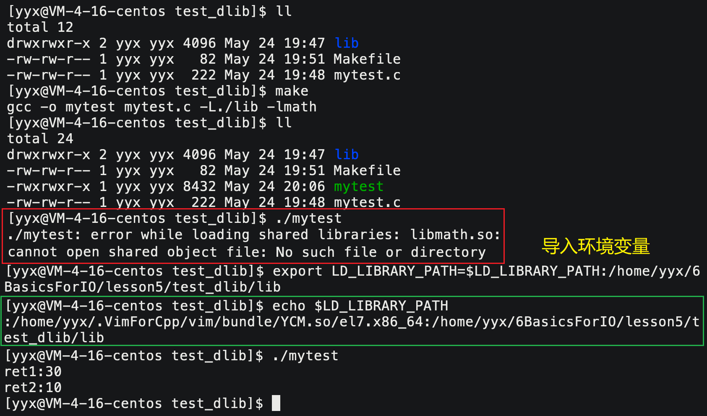

#### 总结

制作库的本质就是把源文件编译得的`.o`可重定向目标文件，打包成一个库。交付时，只需要将头文件和库文件交付即可。

动静态库的区别就是打包方式的不同，一个是`ar -rc`一个是`gcc -shared`和`gcc -fPIC`。

以及动静态库使用的时候都要指明头文件库文件的路径和名称，使用动态库编译的程序运行时还需要导入环境变量。
