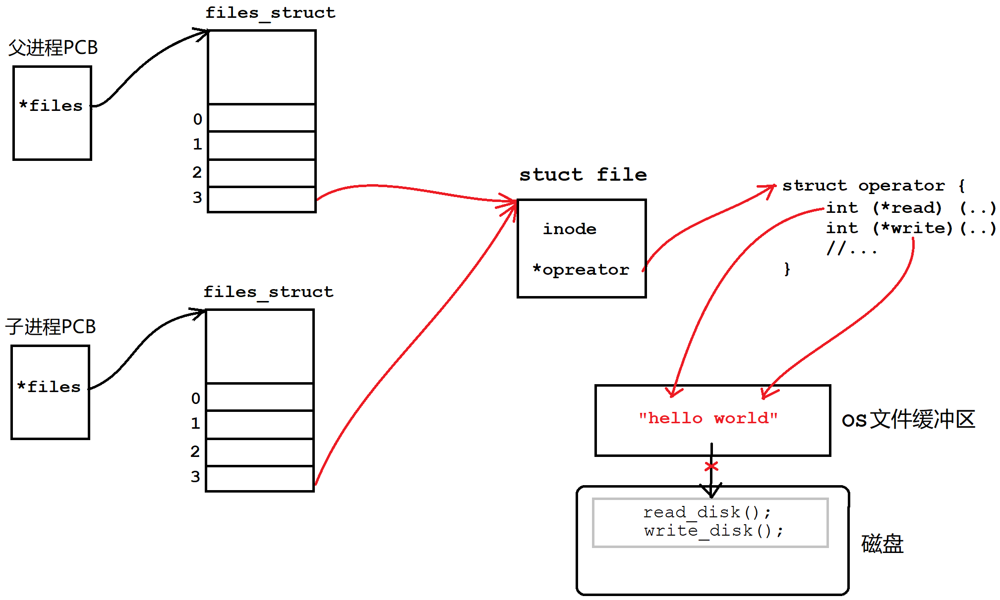
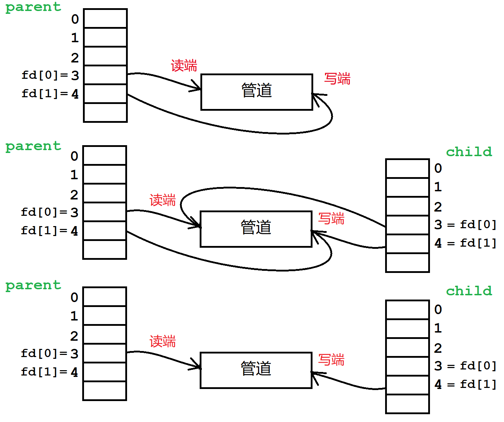
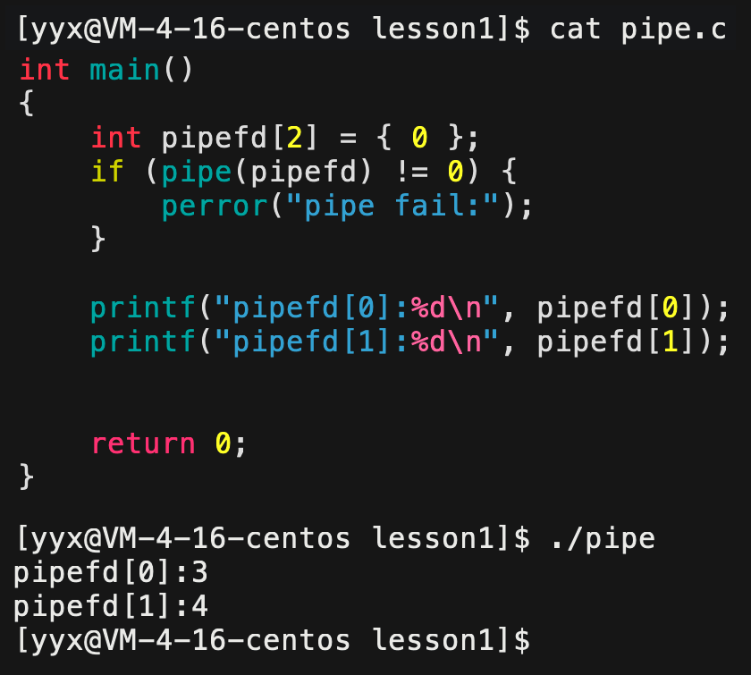
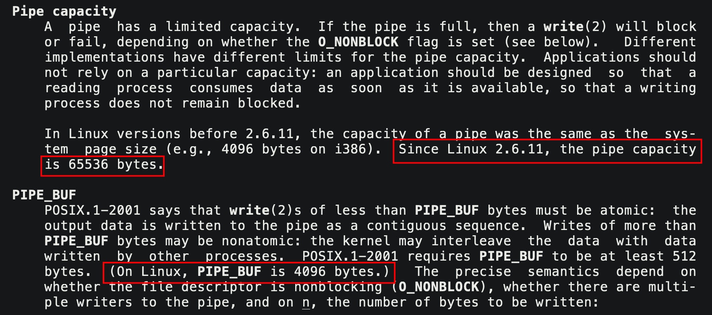
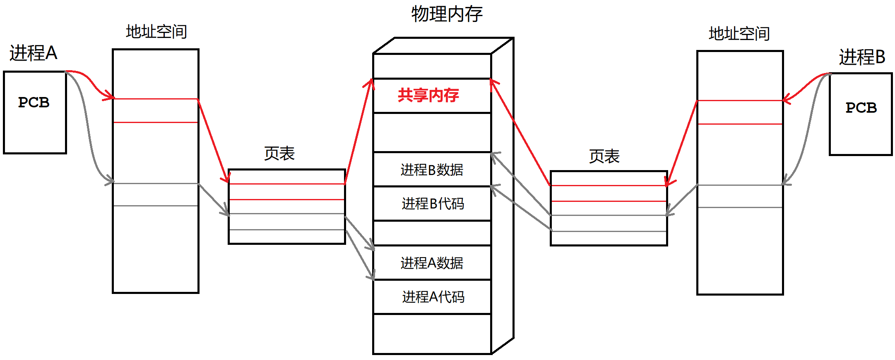
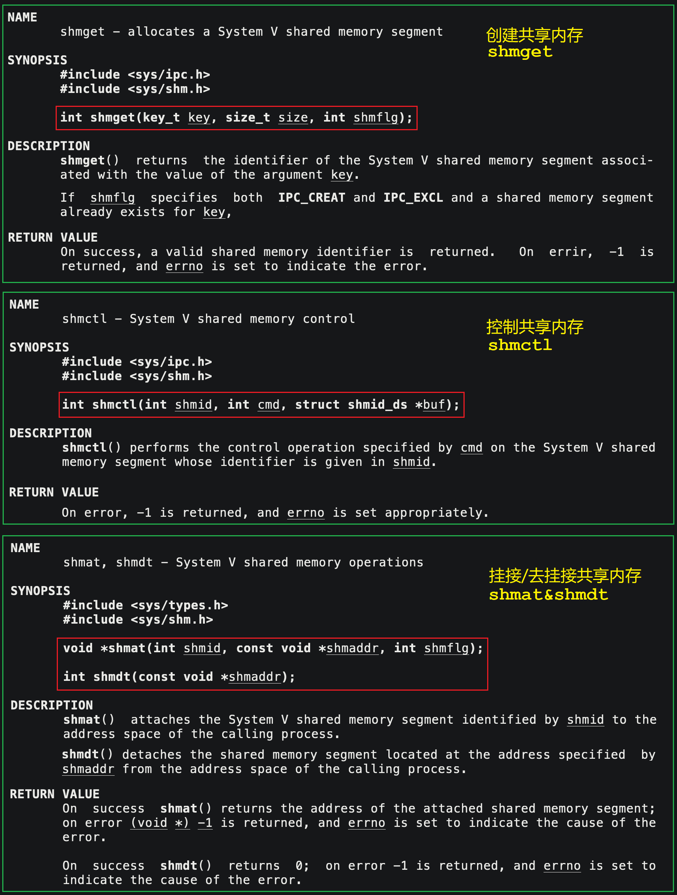
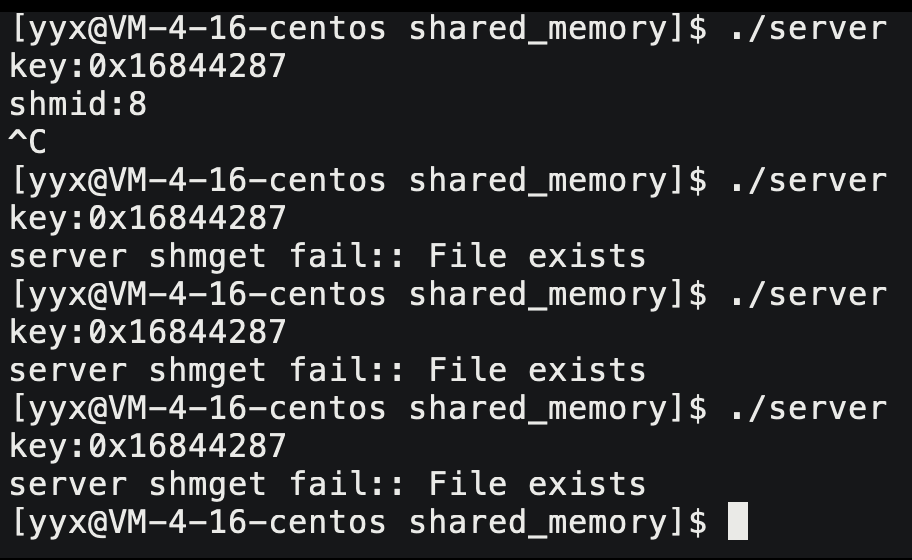
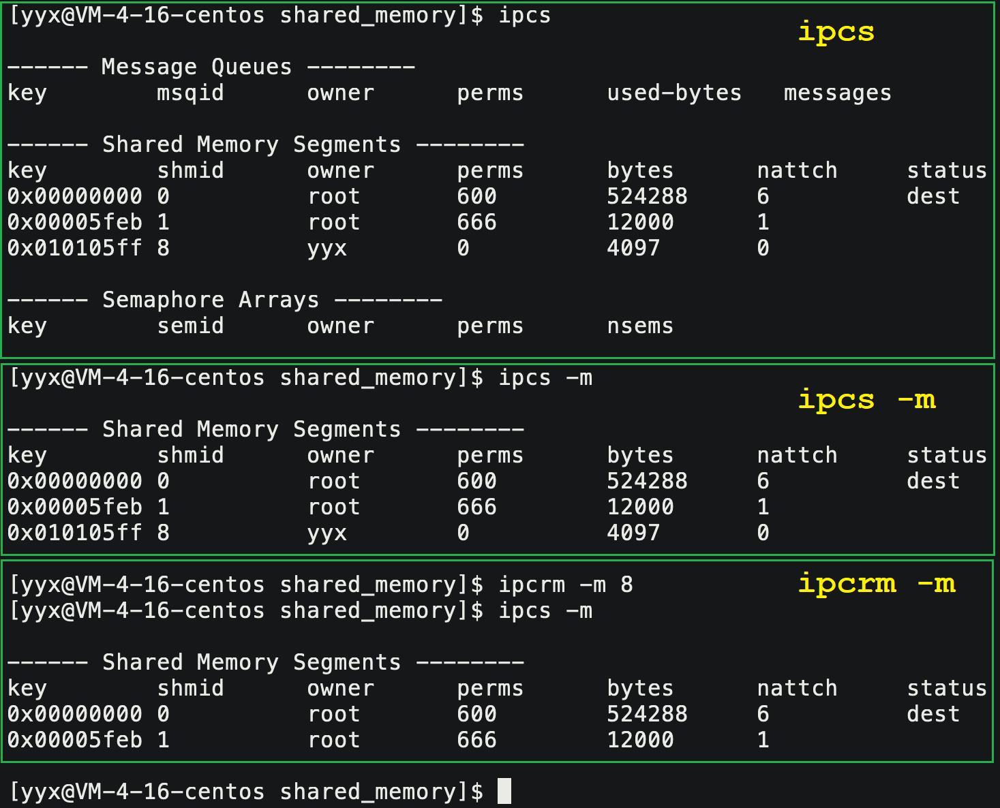
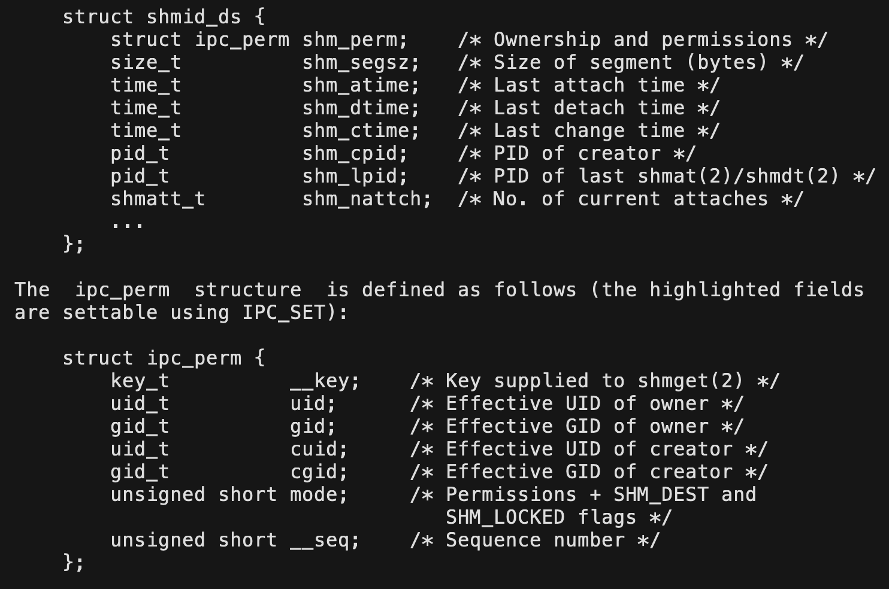

# 进程间通信

## 1. 进程间通信的定义

> 进程具有独立性，通常进程之间不会出现联系。但有时又需要进程之间相互协同工作，每个进程分工明确、高内聚低耦合，能使得代码更高效且维护性高。

进程是具有独立性的，进程之间不能互相访问资源，所以通信的成本很高。**进程间通信需要操作系统作中间人，设计通信方式，提供通信的媒介**。

**进程间通信的前提是两个进程先能够访问到一份公共的资源**。该资源具有暂存资源的能力，能够让双方读写。

- 资源的具体组织形式不重要，看作一段内存即可。
- 该公共资源一定属于操作系统，不能属于通信的进程。

#### 进程间通信的目的

进程间通信可能有如下目的：

1. 数据传输：一个进程需要将它的处理结果交付给另一个进程
2. 资源共享：多个进程共享一份资源
3. 通知事件：一个进程需要向另一个或一组进程发送消息，以通知某种事件的发生。
4. 进程控制：一个进程控制另一个进程的执行或终止。

#### 进程间通信的分类

公共资源的呈现形式由设计者决定，可能以文件的方式，可能以队列、二叉树的形式。**资源组织形式不同，也就造成了存在很多种通信方式**。

早期标准设计者指定了多种通信标准，有管道，System V 进程间通信，POSIX 进程间通信。

> 目前只讲管道和 System V IPC，POSIX IPC 会在多线程部分讲到。

&nbsp;

## 2. 管道

### 2.1 匿名管道

匿名管道是依靠父子进程会打开相同的文件而设计的。创建子进程会拷贝父进程的`files_struct`结构体，也就是**继承父进程的文件数组，这样子进程也会默认打开父进程打开的文件**。



父子进程指向同一份文件，文件读写会经过内核缓冲区，同时避免触发缓冲区的刷新机制，使得数据只停留在缓冲区内，父子进程就可以读写缓冲区的内容了，**该缓冲区就是操作系统提供给进程通信用的公共资源**。

**这种基于文件读写实现的进程间通信的方式，就叫做管道**。

#### 匿名管道的原理

> 父进程通过`fork`创建子进程实现管道通信，具体又是怎么做到的呢？

1. 一个进程分别以读方式和写方式打开同一个文件，这里的文件的内核缓冲区就可以看作是管道。
2. `fork`创建出子进程，子进程会继承父进程的文件信息，同样会以读写的方式打开文件。
3. **关闭父进程的读端或写端和子进程的写端或读端，以保证管道单向通信的性质**。

**管道是个只能单向通信的通信信道**，父子进程只能保留一个读端或者写端，且要么父读子写要么父写子读。



#### 匿名管道的接口

操作系统为匿名管道专门设计了一个接口叫做`pipe`。

```cpp
NAME
       pipe, pipe2 - create pipe
SYNOPSIS
       #include <unistd.h>
       int pipe(int pipefd[2]);
DESCRIPTION
       pipe()  creates a pipe, a unidirectional data channel that can be used for 				interprocess communication.  
       The array pipefd is used to return  two  file descriptors  referring  to  the ends of 	 the pipe.  
       pipefd[0] refers to the read end of the pipe.  pipefd[1] refers to the  write 
    end  of  the  pipe.
       Data  written to the write end of the pipe is buffered by the kernel until it is read         	 from the read end  of  the  pipe.   For  further  details,  see pipe(7).
RETURN VALUE
	   On success, zero is returned.  On error, -1 is returned, and errno is set
    appropriately.
```

##### 参数

`pipefd[2]`是一个输出型参数，可以通过 pipefd 获取到管道读写端的文件描述符。

**默认`pipefd[0]`是读端，`pipefd[1]`是写端。**

> 一般结果都是 $3$ 和 $4$，因为 $0,1,2$ 都被占用了。



##### 返回值

管道创建成功返回 $0$，不成功则返回 $-1$。

```cpp
int main()
{
    int pipefd[2] = { 0 };
    if (pipe(pipefd) != 0) {
        perror("pipe fail:");
    }
    //目的：子进程写，父进程读
    if (fork() == 0) {
        //child
        close(pipefd[0]); //关读
        const char* msg = "hello world";
        while (1) {
            write(pipefd[1], msg, strlen(msg));
            sleep(1);
        }
        exit(0);
    }
    //parent
    close(pipefd[1]); //关写
    while (1) {
        char buff[64] = { 0 };
        ssize_t ret = read(pipefd[0], buff, sizeof(buff) - 1);
        if (ret >= 0) {
             printf("child write:%s\n", buff);
        }
        else if (ret == 0) {
            printf("read finished\n");
            break;
        }
        else {
            printf("read failed\n");
            break;
        }
        sleep(1);
    }
    return 0;
}
```

### 2.2 管道的性质

> 管道是一种由操作系统管理的进程间通信的方式，其本身具有一定的特性来保障数据的安全等。

#### 管道的读写规则

1. 管道写端写的慢，读端要等待，读端读的慢，写端要等待。
2. 写入的数据量小于`PIPE_BUF(4KB)` ，管道保证原子性。若数据量超出 ，不保证原子性。读取量小于 4KB 时，不会触发写端写入。
3. 写端关闭，读端会读到文件结尾并自动关闭。读端关闭，操作系统会自动给写端发送`SIGPIPE`信号将其关闭。 

```c
int main() {
    int pipefd[2] = { 0 };
    if (fork() == 0) { //child 子进程写
        close(pipefd[0]); //关读
        const char* msg = "hello world";
        while (1) {
            write(pipefd[1], msg, strlen(msg));
        }
        exit(0);
    }
    //parent 父进程读
    close(pipefd[1]); //关写
    while (1) {
        sleep(1);
        char buff[64] = { 0 };
        ssize_t ret = read(pipefd[0], buff, sizeof(buff) - 1);                                     	   	   
        if (ret >= 0) {
            printf("child write:%s\n", buff);
        }
        else if (ret == 0) {
            printf("read finished\n");
            break;
        }
    }
    return 0;
}
```

 

#### 管道的特点

1. **管道是一个只能单向通信的通信信道**。
2. **管道是面向字节流的**。管道的大小是 $65536$ 字节即 $64$ KB。
3. **管道适用于具有“血缘关系”的进程进行通信，常用于父子通信**。
4. **管道自带同步机制，原子性写入**。
5. **管道的生命周期是随进程的**。管道也是文件，相关进程退出后，管道文件结构体也会被操作系统自动回收。



### 2.3 命名管道

匿名管道只能进行父子进程之间的通信，为解决这个问题，设计出了命名管道支持任意进程之间的通信。

#### 命名管道的原理

进程是具有独立性的，操作系统必须要让进程看到同一份资源才能通信。

- 匿名管道是通过子进程继承父进程的所打开的文件，从而获取到该文件的内核缓冲区作为通信资源。
- **命名管道是两个进程通过指定文件路径来打开同一个文件，就能获取到该文件的内核缓冲区作为通信资源**。

> 命名管道的实现方式比匿名更加简单，通过文件路径进程就能打开同一个文件，同时也是以文件作载体，所以它也是管道。

#### 命名管道的接口

命令行上可以使用命令`mkfifo`直接创建命名管道文件。

```shell
$ mkfifo myfifo                  # 创建管道文件 
$ echo "hello world" > myfifo    # 写入管道文件
$ cat myfifo                     # 读取管道文件
```

> 命名管道相较于匿名管道，使用上更加简单。

命名管道的系统接口也叫做`mkdfifo`。


```c
NAME
       mkfifo - make a FIFO special file (a named pipe)
SYNOPSIS
       #include <sys/types.h>
       #include <sys/stat.h>
       int mkfifo(const char *pathname, mode_t mode);
DESCRIPTION
       mkfifo()  makes a FIFO special file with name pathname.  mode specifies the FIFO's permissions.  It is modified by the process's umask.
       A FIFO special file is similar to a pipe, except that it is created in a different way.
RETURN VALUE
       On success mkfifo() returns 0.  
       In the case of an error, -1 is returned (in which case, errno is set appropriately).
```

  ```c
int mkfifo(const char *pathname /*文件路径*/, mode_t mode /*文件权限*/);
  ```

- 使用该函数如果管道文件存在，再创建就会报错。这样可以保证管道文件为最新的。
- 文件权限`mode`会收到系统`umask`的影响，默认把 other 的写权限去掉了。可以调用`umask(0)`将其清零。

**命名管道同样是以文件为载体的，管道创建成功后，只需要将其当作普通文件进行读写即可**。

```c
//client.c
int main()
{
    int fd = open(MY_FIFO, O_WRONLY);
    if (fd < 0) {
        perror("client open fail:");
        exit(1);
    }
    //业务逻辑
    while (1) {
        char buff[64] = { 0 };
        ssize_t s = read(0, buff, sizeof(buff) - 1);
        buff[s - 1] = 0;
        printf("%s\n", buff);
        write(fd, buff, strlen(buff));
    }
    close(fd);
    return 0;
}
//server.c
int main()
{
    umask(0);
    if (mkfifo(MY_FIFO, 0666) < 0) {
        perror("server mkfifo fail:");
        exit(1);
    }
    //文件操作
    //server 读取端
    int fd = open(MY_FIFO, O_RDONLY);
    if (fd < 0) {
        perror("server open fail:");
        exit(1);
    }
    //业务逻辑
    char buff[64] = { 0 };
    while (1) {
        ssize_t s = read(fd, buff, sizeof(buff) - 1);
        if (s > 0) {
            buff[s] = 0;
            printf("client requst: %s\n", buff);
            if (strcmp(buff, "pwd") == 0) {
                if (fork() == 0) {
                    execlp("pwd", "pwd", NULL);
                    exit(1);
                }
                waitpid(-1, NULL, 0);
            }
            else if (strcmp(buff, "clear") == 0) {
                if (fork() == 0) {
                    execlp("clear", "clear", NULL);
                    exit(1);
                }
                waitpid(-1, NULL, 0);
            }
        }
        else if (s == 0) {
            printf("client quit..\n");
            sleep(1);
        }
        else {
            printf("client closed\n");
            break;
        }
    }
    close(fd);
    return 0;
}
```

> 命名管道也是基于字节流的，所以进程通信的时候需要双方定制通信协议，但目前不考虑这个问题，留到网络部分学习。

[进程间通讯-管道，以及open函数打开管道阻塞的原则](https://www.cnblogs.com/lsxkugou/p/14171705.html)

[mkfifo创建管道，调用open打开失败](https://blog.csdn.net/markton1990/article/details/127328950)

&nbsp;

## 3. System V共享内存

不管是匿名还是命名管道，都是基于文件的通信方式。System V 标准的进程通信方式是计算机科学家和顶级程序员在操作系统层面上专为进程间通信设计的一个方案，以接口的形式提供。

### 3.1 共享内存的原理

System V 标准提供了三个方案：共享内存，消息队列，信号量。本次只讲共享内存的方案。



进程间通信的前提是先让不同的进程看到同一份资源，而**共享内存方案的本质是让参与通信的进程关联上同一块内存空间，读写该空间从而实现通信**。

系统在运行时一定存在多份共享内存，操作系统也一定要对这些共享内存进行描述并管理。类似于进程和文件的管理，**共享内存的数据结构中存储着共享内存的相关属性信息，操作系统对共享内存的管理就变成了对该数据结构的增删查改**。

1. 在内存中开辟一块内存空间。
2. 让参与通信的进程“挂接”上新开辟的内存空间，并进行内存读写。
3. 让进程“去挂接”上共享内存。
4. 释放共享内存。


### 3.2 共享内存的接口



```c
//创建共享内存
int shmget (key_t key, size_t size, int shmflg); 
//控制共享内存
int shmctl (int shmid, int cmd, struct shmid_ds* buf); /*control*/
//挂接共享内存
void* shmat (int shmid, const void* shmaddr, int shmflg) ; /*attach*/
//去挂接共享内存
int shmdt (const void* shmaddr); /*detach*/
```

#### 创建 shmget

```c
int shmget (key_t key, size_t size, int shmflg); 
```

| 参数       | 解释                                                         |
| ---------- | ------------------------------------------------------------ |
| **key**    | 放入共享内存的数据结构中，用以唯一确定共享内存。可用`ftok`生成。<br>内核用`key`唯一确定共享内存，用户使用`id`进行管理共享内存。 |
| **size**   | 建议是4KB的整数倍，共享内存申请的最小单位为4KB。             |
| **shmflg** | `IPC_CREAT`：共享内存不存在就创建，若存在则获取该内存并返回。 <br>`IPC_EXCL`：搭配`IPC_CREAT`使用，表示不存在就创建，存在就报错返回。（得到最新内存） |
| **返回值** | 返回该共享内存在用户层面上的唯一标识`shmid`。                |

```c
int main()
{
        key_t key = ftok(PATH_NAME, PROJECT_ID);
        if (key < 0) {
                perror("server ftok fail");
        }
        printf("key:0x%p\n", key);
        int shmid = shmget(key, 4096, IPC_CREAT | IPC_EXCL);
        if (shmid < 0) {
                perror("server shmget fail:");
                exit(1);
        }
        return 0;
}
```



如上图所示，进程运行结束，共享内存仍然存在，说明共享内存独立于进程，是单独由操作系统管理的。不仅如此，System V 标准的所有方案都是如此。

#### SystemV 通信的相关指令

```shell
$ ipcs     # 显示System V标准所有通信方案的情况
$ ipcs -m  # 显示共享内存的情况
$ ipcrm -m shmid   # 释放指定的共享内存 
```



#### 控制 shmctl

```c
int shmctl (int shmid, int cmd, struct shmid_ds* buf); /*control*/
```

- `buf`参数的类型是`struct shmid_ds`也就是共享内存的数据结构。
- 对共享内存的操作都以选项的形式集成并传入参数`cmd`中，设置的就是`buf`对应的共享内存。



> 控制共享内存仅作了解，学会使用其释放共享内存即可。

```c
shmctl(shmid, IPC_RMID, NULL);
printf("key:%u, shmid:%d\n, shm has been deleted\n", key, shmid);
```

删除共享内存，参数`cmd`传入宏`IPC_RMID`即可，不需要设置共享内存的结构体的属性所以`buff`传空。

#### 关联/去关联 shmat shmdt

```c
void* shmat (int shmid, const void* shmaddr, int shmflg) ; /*attach*/
int   shmdt (const void* shmaddr); /*detach*/
```

- `shmaddr`代表设置共享内存的地址
- `shmflg`挂接共享内存的选项

> 以上两个参数都无需关心，分别设置为空和0即可。

##### 返回值

- `shmat`**挂接成功返回共享内存的所在地址**，挂接失败返回$-1$。
- `shmdt`去挂接成功返回 $0$，挂接失败返回$-1$。

管道是以文件为载体的，故管道返回的是文件操作符，业务逻辑就转化为对文件的操作。

而共享内存就是以一段内存空间为载体的，`shmat`函数返回共享内存的地址，类似`malloc`动态开辟内存，之后的业务逻辑都是一系列指针操作。 

取消进程和指定的共享内存`addr`的关联，并不是释放共享内存。	

```c
char* addr = (char*)shmat(shmid, NULL, 0);
// ...
shmdt(addr);
```

### 3.3 共享内存的特点

- **生命周期随内核，与进程无关。**
- **共享内存方案是所有进程间通信方式中最快的**，因为其以一块裸露内存作载体，省去了数据拷贝的步骤。
- **共享内存不提供任何同步或互斥机制**，需要程序员自定保证数据安全。
