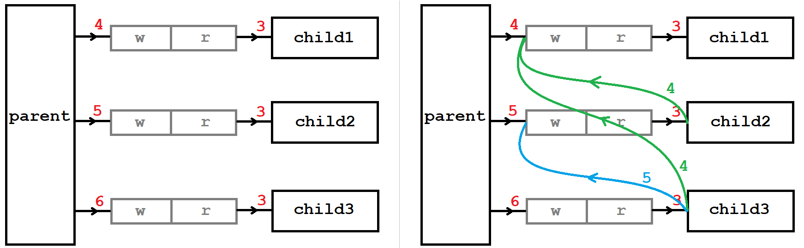

# 进程间通信

进程是独立的，但有时又需要进程之间相互协同工作，此时就需要进程间通信。进程间通信可以用来：

- 数据传输：一个进程需要将它的处理结果交付给另一个进程。
- 资源共享：多个进程共享一份资源。
- 通知事件：一个进程需要向另一个或一组进程发送消息，以通知某种事件的发生。
- 进程控制：一个进程控制另一个进程的执行或终止。

进程具有独立性，不能互相访问资源，所以通信的成本很高。**进程间通信需要操作系统作中间人，提供通信的媒介**。

**进程间通信的前提是两个进程能访问到一份公共的资源**。该资源具有暂存资源的能力，能够让双方读写。

- 资源的具体组织形式不重要，可以简单的看作一段内存。
- 该公共资源一定属于操作系统，不能属于单个进程。

公共资源的呈现形式由设计者决定，可能以文件的方式如管道。**资源组织形式不同导致存在很多种通信方式**。早期标准设计者定制了多种通信标准，有管道，SystemV共享内存，POSIX信号量。

&nbsp;

## 1. 管道

### 1.1 匿名管道

匿名管道是通过父子进程打开相同文件而设计的。子进程会**继承父进程的文件数组，这样子进程也会打开父进程打开的文件**。


父子进程指向同一份文件，该文件是内存级文件，不允许刷新缓冲区，使得数据只停留在缓冲区内。系统使用其内核缓冲区作为进程间通信的公共资源，进程就可以读写缓冲区的内容了。

**这种基于文件读写实现的进程间通信的方式，就叫做管道**。

#### 匿名管道的原理

1. 进程以读和写方式打开同一个文件；
2. 创建子进程，子进程同样会以读和写方式打开该文件；
3. **关闭父进程的读端或写端，再关闭子进程的写端或读端，以保证管道单向通信的性质。**

> 管道是个只能单向通信的通信信道，父子进程只能保留一个读端或者写端，且要么父读子写要么父写子读。


#### 匿名管道的接口

```cpp
#include <unistd.h>
int pipe(int pipefd[2]);
```

`pipefd[2]`是一个输出型参数，通过 pipefd 数组获取管道文件的读写端描述符。**默认`pipefd[0]`是读端，`pipefd[1]`是写端。**

```cpp
int main()
{
    int pipefd[2];
    if ( pipe(pipefd) != 0 ) 
        perror("pipe");
    
    printf("pipefd[0]:%d\n", pipefd[0]);
    printf("pipefd[1]:%d\n", pipefd[1]);
}
$ ./pipe
pipefd[0]:3
pipefd[1]:4
```

管道创建成功返回 $0$，不成功则返回 $-1$。

```cpp
int main()
{
    int pipefd[2];
    if (pipe(pipefd) != 0) 
        perror("pipe fail:");

    //目的：子进程写，父进程读
    if (fork() == 0) // child
    {
        close(pipefd[0]); //关读
        const char* msg = "hello world";
        while (1) 
        {
            write(pipefd[1], msg, strlen(msg));
            sleep(1);
        }
        exit(0);
    }
    
    // parent
    close(pipefd[1]); //关写
    while (1) 
    {
        char buff[64] = {0};
        ssize_t ret = read(pipefd[0], buff, sizeof(buff) - 1);
        if (ret >= 0) 
        {
             printf("child write:%s\n", buff);
        }
        else if (ret == 0) 
        {
            printf("read finished\n");
            break;
        }
        else 
        {
            printf("read failed\n");
            break;
        }
        sleep(1);
    }
    return 0;
}
```

#### 父子一对多管道通信分析

循环创建多个管道和子进程，最后实际上并不是左图而是右图。

```cpp
for (int i = 0; i < CHILD_PROC_NUM; i++)
{
    int pipefd[2];
    pipe(pipefd);
    
    pid_t id = fork();
    if (id == 0) {
        close(pipefd[1]);
    } else {
        close(pipefd[0]);
    }
}
```

每次创建子进程都会继承上一次创建的管道，这样后续的子进程都会打开之前的子进程管道的写端。



除第一个子进程不需要以外，**之后的每一个子进程都要关闭，创建它之前就存在的写端文件描述符**。

> 例如，子进程2需要关4，子进程3需要关4和5，以此类推。

```cpp
std::vector<int> wfds; // 用来保存历次创建的管道写端fd
for (int i = 0; i < CHILD_PROC_NUM; i++)
{
    int pipefd[2];
    pipe(pipefd);
    
    pid_t id = fork();
     
    if (id == 0)
    {
        for (auto fd : wfds) // 关闭其中存在的写端fd
            close(fd);
        
        close(pipefd[1]);
        //...
    }
	else
    {
        close(pipefd[0]);        
        //...
        wfds.push_back(pipefd[1]); // 每次创建新增管道写端fd文件，以待后续关闭
    }
}
```

如果不做这样的工作，后续我们无法通过关闭父进程的写端来让子进程结束读取任务，因为子进程还存在其他写端。

### 1.2 管道的性质

#### 管道的特点     

1. 管道是一个只能单向通信的通信信道。
2. 管道的生命周期是随进程的。进程退出后管道也会被系统释放。
3. 匿名管道适用于具有“血缘关系”的进程进行通信，常用于父子通信。
4. 管道自带同步机制，原子性写入。

#### 管道的读写规则

1. 管道是面向字节流的。管道的大小是65536字节即64KB。
2. 管道读写次数不是严格匹配的，读写次数没有强相关。
3. 管道自带同步机制。管道没数据的话，读端要等待；管道满的话，写端要等待。
4. 写端关闭，读端会读到文件结尾。读端关闭，系统会向写端发送`SIGPIPE`信号终止进程。
5. 写入的数据量小于`PIPE_BUF(4KB)` ，管道保证写入原子性。若超出不保证原子性。读取量小于 4KB 时，不会触发写端写入。

### 1.3 命名管道

> 匿名管道只能提供父子进程的通信，命名管道支持任意进程的通信。

#### 命名管道的原理

- 匿名管道是通过子进程继承父进程的所打开的文件，将该文件的内核缓冲区作为通信资源。
- **命名管道是让两个进程通过路径打开同一个文件，将该文件的内核缓冲区作为通信资源**。

> 命名管道的实现方式比匿名更加简单，通过文件路径进程就能打开同一个文件，同时也是以文件作载体，所以它也是管道。

#### 命名管道的接口

```shell
$ mkfifo myfifo                  # 创建管道文件
$ echo "hello world" > myfifo    # 写入管道文件
$ cat myfifo                     # 读取管道文件
```


```c
#include <sys/types.h>
#include <sys/stat.h>
int mkfifo(const char *pathname, mode_t mode);
```

- 如果管道文件存在就会报错，这样保证管道文件最新。
- 权限 mode 会受到 umask 的影响。

**命名管道同样是以文件为载体的，管道创建成功后，将其当作文件读写即可**。当然数据只存在于文件的内核缓冲区中，不会刷新到磁盘。

```c
//client.c
int main()
{
    int fd = open(MY_FIFO, O_WRONLY);
    assert(fd > 0);

    while (1) {
        char buff[64] = {0};
        ssize_t s = read(0, buff, sizeof(buff) - 1);
        buff[s] = 0;
        printf("%s\n", buff);
        write(fd, buff, strlen(buff));
    }
    close(fd);
    return 0;
}

//server.c
int main()
{
    umask(0);
    assert (mkfifo(MY_FIFO, 0666) >= 0);
    int fd = open(MY_FIFO, O_RDONLY);
    assert(fd > 0);

    char buff[64] = {0};
    while (1) {
        ssize_t s = read(fd, buff, sizeof(buff) - 1);
        if (s > 0) 
        {
            buff[s] = 0;
            printf("client: %s\n", buff);
            if (strcmp(buff, "pwd") == 0 || strcmp(buff, "clear") == 0) {
            	if (fork() == 0) execlp(buff, buff, NULL);
            	waitpid(-1, NULL, 0);
            }
        }
        else if (s == 0) {
            printf("client quit..\n");
        }
        else {
            printf("client closed\n");
            break;
        }
    }
    close(fd);
    return 0;
}
```

> 命名管道也是基于字节流的，所以进程通信的时候需要双方定制通信协议，但目前不考虑这个问题，留到网络部分学习。

[进程间通讯-管道，以及open函数打开管道阻塞的原则](https://www.cnblogs.com/lsxkugou/p/14171705.html)

[mkfifo创建管道，调用open打开失败](https://blog.csdn.net/markton1990/article/details/127328950)

&nbsp;

## 2. SystemV共享内存

不管是匿名还是命名管道，都是基于文件的通信方式。System V 标准的进程通信方式是计算机科学家和顶级程序员在操作系统层面上专为进程间通信设计的一个方案，以接口的形式提供。

### 2.1 共享内存的原理

System V 标准提供了三个方案：共享内存，消息队列，信号量。本次只讲共享内存的方案。


进程间通信的前提是先让不同的进程看到同一份资源，而**共享内存方案的本质是让参与通信的进程关联上同一块内存空间，读写该空间从而实现通信**。

系统在运行时一定存在多份共享内存，操作系统也一定要对这些共享内存进行描述并管理。类似于进程和文件的管理，**共享内存的数据结构中存储着共享内存的相关属性信息，操作系统对共享内存的管理就变成了对该数据结构的增删查改**。

1. 在内存中开辟一块内存空间。
2. 让参与通信的进程“挂接”上新开辟的内存空间，并进行内存读写。
3. 让进程“去挂接”上共享内存。
4. 释放共享内存。


### 2.2 共享内存的接口

#### 创建shmget

```c
int shmget (key_t key, size_t size, int shmflg); 
```

| 参数       | 解释                                                         |
| ---------- | ------------------------------------------------------------ |
| **key**    | 放入共享内存的数据结构中，用以唯一确定共享内存。可用`ftok`生成。<br>内核用`key`唯一确定共享内存，用户使用`id`进行管理共享内存。 |
| **size**   | 建议是4KB的整数倍，共享内存申请的最小单位为4KB。             |
| **shmflg** | `IPC_CREAT`：共享内存不存在就创建，若存在则获取该内存并返回。 <br>`IPC_EXCL`：搭配`IPC_CREAT`使用，表示不存在就创建，存在就报错返回。（得到最新内存） |
| **返回值** | 返回该共享内存在用户层面上的唯一标识`shmid`。                |

```shell
key_t key = ftok(PATH_NAME, PROJECT_ID);
if (key < 0) {
    perror("server ftok fail");
}
printf("key:0x%p\n", key);
int shmid = shmget(key, 4096, IPC_CREAT | IPC_EXCL);
if (shmid < 0) {
    perror("server shmget fail:");
    exit(1);
}

$ ./server 
key:0x16844287
shmid:8
$ ./server 
key:0x16844287
server shmget fail:: File exists
$ ./server 
key:0×16844287
server shmget fail:: File exists
$ ./server 
key:0×16844287
server shmget fail:: File exists
```

进程运行结束，共享内存仍然存在，说明共享内存独立于进程，是单独由操作系统管理的。不仅如此，System V 标准的所有方案都是如此。

#### 控制shmctl

```c
int shmctl (int shmid, int cmd, struct shmid_ds* buf); /*control*/
```

- `buf`参数的类型是`struct shmid_ds`也就是共享内存的数据结构。
- 对共享内存的操作都以选项的形式集成并传入参数`cmd`中，设置的就是`buf`对应的共享内存。

```cpp
struct shmid_ds {
    struct ipc_perm shm_perm;    /* Ownership and permissions */
    size_t          shm_segsz;   /* Size of segment (bytes) */
    time_t          shm_atime;   /* Last attach time */
    time_t          shm_dtime;   /* Last detach time */
    time_t          shm_ctime;   /* Last change time */
    pid_t           shm_cpid;    /* PID of creator */
    pid_t           shm_lpid;    /* PID of last shmat(2)/shmdt(2) */
    shmatt_t        shm_nattch;  /* No. of current attaches */
    ...
};

struct ipc_perm {
    key_t          __key;    /* Key supplied to shmget(2) */
    uid_t          uid;      /* Effective UID of owner */
    gid_t          gid;      /* Effective GID of owner */
    uid_t          cuid;     /* Effective UID of creator */
    gid_t          cgid;     /* Effective GID of creator */
    unsigned short mode;     /* Permissions + SHM_DEST and SHM_LOCKED flags */
    unsigned short __seq;    /* Sequence number */
};
```

> 控制共享内存仅作了解，学会使用其释放共享内存即可。

```c
shmctl(shmid, IPC_RMID, NULL);
printf("key:%u, shmid:%d\n, shm has been deleted\n", key, shmid);
```

删除共享内存，参数`cmd`传入宏`IPC_RMID`即可，不需要设置共享内存的结构体的属性所以`buff`传空。

#### 关联/去关联shmat shmdt

```c
void* shmat (int shmid, const void* shmaddr, int shmflg) ; /*attach*/
int   shmdt (const void* shmaddr); /*detach*/
```

- `shmaddr`代表设置共享内存的地址
- `shmflg`挂接共享内存的选项

> 以上两个参数都无需关心，分别设置为空和0即可。

##### 返回值

- `shmat`**挂接成功返回共享内存的所在地址**，挂接失败返回$-1$。
- `shmdt`去挂接成功返回 $0$，挂接失败返回$-1$。

管道是以文件为载体的，故管道返回的是文件操作符，业务逻辑就转化为对文件的操作。

而共享内存就是以一段内存空间为载体的，`shmat`函数返回共享内存的地址，类似`malloc`动态开辟内存，之后的业务逻辑都是一系列指针操作。 

取消进程和指定的共享内存`addr`的关联，并不是释放共享内存。	

```c
char* addr = (char*)shmat(shmid, NULL, 0);
// ...
shmdt(addr);
```

### 2.3 共享内存的指令

```shell
$ ipcs     # 显示System V标准所有通信方案的情况
$ ipcs -m  # 显示共享内存的情况
$ ipcrm -m shmid   # 释放指定的共享内存 
```


### 2.4 共享内存的特点

- **生命周期随内核，与进程无关。**
- **共享内存方案是所有进程间通信方式中最快的**，因为其以一块裸露内存作载体，省去了数据拷贝的步骤。
- **共享内存不提供任何同步或互斥机制**，需要程序员自定保证数据安全。
