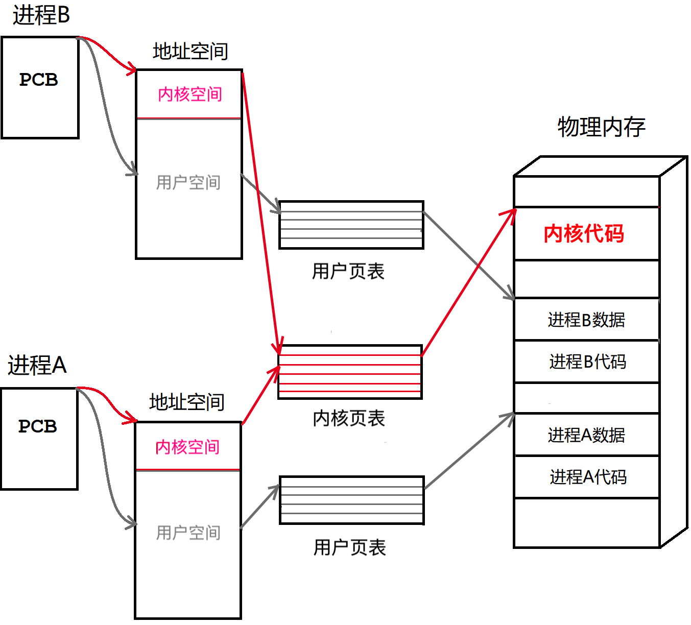

# 进程信号

本章将系统地介绍 Linux 系统中信号的概念，以信号的生命周期为路线，先后学习信号的产生，信号的保存，信号的处理。

## 1. 信号的概念

> 生活中也存在信号，如红绿灯信号，公鸡打鸣信号等等，伴随这些信号的还有当信号触发时人们该做什么，比如：鸡鸣时该起床，红灯停绿灯行等。

在系统中也存在信号，信号是发送给进程的，进程需要在合适的时候，执行信号对应的动作。进程必须明确各种的信号的对应的动作，和该信号是否产生无关。

#### 信号的产生

当然，<u>进程在运行之前就必须能够分辨出哪个信号，以及指定对该信号的处理方式</u>，以便信号到来之时，能够及时处理。也就是说，**进程在信号产生之前就应该具有识别信号并处理信号的能力**。

> 在实际生活中，人们收到某种信号，但可能并不会立即处理因为此时还在处理其他事情。比如早晨闹钟响起，但我们很困，就会关掉闹钟继续睡觉了。但我们知道闹钟已经响起，起床是迟早的事情。

#### 信号的保存

也有可能，进程已经收到信号但并不能立即处理，因为<u>当前进程正在处理优先级更高的事情，只能将信号暂存起来，并等到合适的时候再进行处理</u>。也就是说，**进程具有暂时保存信号的能力**。

信号本身也是数据，可以被暂存在进程的 PCB 中。所以说，发送信号的本质就是向进程控制块`task_struct`中写入信号数据。PCB 只有操作系统能够读写，**操作系统会向上提供多种信号的发送方式，但本质都是操作系统向进程发送信号**。


&nbsp;

## 2. 信号的产生

Linux 系统中所有信号如图所示：共有62种信号，前31个是普通信号，后31个是实时信号，我们只学习普通信号。


### 2.1 注册信号处理动作

前面已经说过，进程在运行之前就必须能够分辨出哪个信号，以及指定对该信号的处理方式，以便信号到来之时，能够及时处理。

- 分辨信号，进程能够分辨上述列表中的31种信号，这是系统设计好的。
- 处理方式：可以执行默认动作，也可以通过`signal`接口来设置当前进程对某个信号的处理方式。

修改进程对信号`signum`的默认处理动作，为自定义的函数`handler`，该函数必须满足规定的函数声明形式。

```c
NAME
       signal - ANSI C signal handling
SYNOPSIS
       #include <signal.h>
       typedef void (*sighandler_t)(int); //自定义函数指针
       sighandler_t signal(int signum, sighandler_t handler);
DESCRIPTION
       signal()  sets  the  disposition of the signal signum to handler, which is either SIG_IGN, SIG_DFL, or the address of a  programmer-defined  function (a "signal handler").
       The signals SIGKILL and SIGSTOP cannot be caught or ignored.
```

```c
void handler(int signum) {
    printf("handle proc:%d, signum:%d\n", getpid(), signum);
}
int main()
{
    signal(2, handler); //通过signal注册对2号信号的处理动作，并没有实际信号产生
    while (1) {
        printf("hello proc:%d\n", getpid());
        sleep(1);
    }
    return 0;
}
```


如图所示，键盘输入`^C`能够对进程发送2号信号`SIGINT`，输入`^C`就会触发进程提前注册好的对2号信号的处理动作。

**通过`signal`接口注册对某个信号的处理动作，相当于是一种预定机制，并没有产生任何实际信号。**

#### 处理信号的三种方案

进程收到的信号，就要对信号的处理，一般有三种处理情况：

1. 默认动作：执行信号的默认注册行为，如`SIGKILL`的杀死自身进程。
2. 忽略动作：忽略掉该信号，不做出任何反应，也是一种信号处理的方式。
3. 自定义捕捉：执行用户注册的行为，即调用修改后的`handler`方法。

### 2.2 产生信号的方式

产生信号共有4种方式：

| 方式     | 具体解释                                                     |
| -------- | ------------------------------------------------------------ |
| 系统指令 | 输入指令`kill`或者键盘发送快捷键`^C`,`^Z`等。                |
| 进程异常 | 进程运行中出现错误导致软硬件出现异常，被操作系统甄别并处理。 |
| 系统调用 | 系统提供多种发送信号的接口，方便我们在代码中设置信号。       |
| 软件条件 | 某些软件条件不具备，触发信号发送的条件，操作系统向进程发送信号。 |

**虽产生信号的方式繁多，但其底层都是操作系统在向进程发送信号数据。**

#### 系统指令

| 输入                | 含义                                                         |
| ------------------- | ------------------------------------------------------------ |
| `Ctrl`+`C`即`^C`    | 向进程发送2号信号`SIGINT`，默认是终止进程。                  |
| `Ctrl`+`\`即`^Quit` | 向进程发送3号信号`SIGQUIT`，默认是终止进程并进行核心转储 Core Dump。 |
| `^Z`                | 向进程发送20号信号`SIGSTP`，默认是停止进程。                 |

键盘产生的信号，只能作用于前台进程，后台进程由于不影响输入指令无法使用键盘发送信号。

```shell
$ ./a.out &   # 将进程放到后台执行
$ fg          # 将后台进程调至前台
```

```shell
$ kill -signum proc_pid
```

使用`kill`命令，向指定进程发送指定信号，如：

```shell
$ kill -9 12138 # 向pid为12138的进程发送9号信号
```

就算进程注册了对9号信号的处理，也无法生效，因为9号信号是无法被捕捉的。因为9号信号能够直接杀死进程，捕捉9号信号是很不安全的行为。

[Linux信号说明](https://blog.csdn.net/u011607971/article/details/116067734)

#### 进程异常


如图所示，运行带有野指针等内存错误的程序，会出现进程异常崩溃的现象。报错也是`Segmentation fault`段错误。 


实际上是进程收到了11号信号`SIGSEVG`而终止程序。

那为什么出现段错误的进程会收到11号信号呢？是因为硬件出现异常。CPU 在执行进程的时候发现了程序中存在段错误并记录下来，然后操作系统发现了 CPU 出现异常，故向该进程发出了11号信号。

**软件上面的错误，通常会体现在硬件或其他软件上**。**程序中存在异常问题，导致硬软件出现异常，致使操作系统向目标进程发送对应信号**。

##### Core Dump

Linux下，进程正常退出时，会设置其退出码和退出信号，进程异常退出时，会设置其退出信号，表明进程退出的原因。必要的话，**操作系统会将进程在内存的中的数据以文件的形式转储在磁盘上，以便后期调试，并设置 core dump 标志位**。

core dump 可以帮助我们事后调试更加方便，可以直接显示错误出现的行数。


> 云服务器上默认关闭Core Dump 功能，设置方式如图所示：


`waitpid`可以获取子进程的退出信息，退出码，退出信号，还有就是Core Dump 标志位。如果进程异常退出，且core dump 标志位被设置的话，可能会形成core dump 文件。


```c
if (fork() == 0) {
    while (1) {
        printf("hello proc:%d\n", getpid());
        sleep(1);
    }
    exit(1);
}
int status = 0;
waitpid(-1, &status, 0);
printf("exit code: %d\n" , (status >> 8) & 0xff);
printf("exit signal:%d\n",  status       & 0x7f);
printf("core dump: %d\n" , (status >> 7) & 1   );  
```

> 不是所有进程异常退出都会设置 core dump 标志位。

#### 系统调用

##### kill

`kill`函数向指定进程发送指定信号。

```c
NAME
       kill - send signal to a process
SYNOPSIS
       #include <sys/types.h>
       #include <signal.h>
       int kill(pid_t pid, int sig);
DESCRIPTION
       The  kill()  system  call  can  be  used  to  send any signal to any process group or
       process.
RETURN VALUE
       On  success,  zero is returned.  On error, -1 is  returned, and errno is set appropriately.
```

```c
int main(int argc, char* argv[])
{
    if (argc != 3) {
        printf("Usage\n\t./test signum pid\n");
        exit(1);
    }
    int signum = atoi(argv[1]);
    int pid = atoi(argv[2]);
    kill(pid, signum);
    printf("kill -%d %d\n", signum, pid);
    return 0;
}
```

##### raise 

`raise`函数给自身进程发送指定信号。

```c
NAME
       raise - send a signal to the caller
SYNOPSIS
       #include <signal.h>
       int raise(int signum);
DESCRIPTION
       The  raise()  function sends a signal to the calling process or thread.  In a single-
threaded program it is equivalent to
RETURN VALUE 
       raise() returns 0 on success, and nonzero for failure.
```

```c
int main()
{
    if (fork() == 0) {
        printf("hello raise\n");
        raise(9);
    }
    int status = 0;
    waitpid(-1, &status, 0);
    printf("exit signal:%d\n", status & 0x7f); //获取 signal
    return 0;
}
```

##### abort

`abort`函数给自身进程发送6号信号`SIGABRT`。

```c
NAME
       abort - cause abnormal process termination
SYNOPSIS
       #include <stdlib.h>
       void abort(void);
DESCRIPTION
       The  abort()  first  unblocks the SIGABRT signal, and then raises that signal for the
       calling process.  
RETURN VALUE
       The abort() function never returns.
```

```c
int main()
{
    if (fork() == 0) {
        printf("hello raise\n");
        abort(9);
    }
    int status = 0;
    waitpid(-1, &status, 0);
    printf("exit signal:%d\n", status & 0x7f); //获取 signal
    return 0;
}
```

#### 软件条件

通过某种软件条件的触发，来促使信号的产生。如：系统层面上设置定时器，由某种操作导致条件不满足这些场景。最经典的例子是管道通信，读端已经关闭，写端会立马收到13号信号`SIGPIPE`而停止写入，这就是由于软件条件的不就绪，而触发产生信号。

##### 系统调用alarm

我们可以通过系统调用`alarm`设置一个计时器，计时结束后向自身进程发送14号`SIGALRM`信号。

```c
NAME
       alarm - set an alarm clock for delivery of a signal
SYNOPSIS
       #include <unistd.h>
       unsigned int alarm(unsigned int seconds);
DESCRIPTION
       alarm()  arranges for a SIGALRM signal to be delivered to the calling process in seconds seconds.
       If seconds is zero, any pending alarm is canceled.
RETURN VALUE
       alarm() returns the number of seconds remaining until any previously scheduled  alarm
       was due to be delivered, or zero if there was no previously scheduled alarm.
```


```c
    size_t ret = alarm(10);
    printf("alarm(10)->ret:%ld\n", ret);
    ret = alarm(5); //重新设置闹钟，并返回上一个闹钟的剩余时间
    //如果没有之前没有设置过闹钟，则返回0
    printf("alarm(5) ->ret:%ld\n", ret);
```

再次调用`alarm`就会覆盖之前的闹钟并重新设定。返回值是上一个`alarm`闹钟的剩余时间，如果在此之前没有设定过则返回0。

### 2.3 发送信号的实质

我们已经知道，产生信号实际是操作系统在向进程发送信号。**信号本身也是数据，发送信号的本质就是向 pcb 中写入信号数据**。


如图所示，信号的编号是有规律的，从1到31依次排列。既然信号是写入到进程 pcb 中的，那么 pcb 一定要有对应的数据变量，来存储记录是否收到（二元性）了对应的信号。

这个数据变量就是整型变量位图，比特位的位置代表对应信号的编号，比特位内容代表是否收到该信号。


如图所示，**进程中采用位图来标识进程是否收到某种信号**。操作系统向进程发送信号也就是向进程 task_struct 的信号位图的对应位置写入1。


## 3. 信号的保存

前面已经说过，进程有可能已收到信号但不能立即处理，因为进程正在处理优先级更高的事情，所以我们要求，进程具有暂时保存信号的能力。

> 我们已经知道，信号是如何保存在进程 pcb 中的，为进一步深入信号的保存，先明确几个概念。

### 3.1 信号状态的概念

| 概念     | 解释                                                         |
| -------- | ------------------------------------------------------------ |
| 信号递达 | 实际执行信号的处理动作就叫做信号递达。一般有三种处理情况：默认，忽略，自定义捕捉。 |
| 信号未决 | 信号产生后到递达前的状态称为信号未决。本质是信号被暂存在pcb的信号位图中。 |
| 信号阻塞 | 系统允许进程暂时屏蔽某些信号即叫做阻塞。信号此时仍然是未决的，但因为被阻塞所以一直无法递达，直至解除阻塞方可被递达。 |

信号递达中的忽略动作代表信号已被处理，只是处理动作就是什么都不做。而阻塞表示信号暂时被屏蔽，信号被阻塞就代表信号不可能被递达，一直是未决的，直至解除阻塞方可递达。

> 这些概念对应的信号在 pcb 中的情况是怎样的呢？这就要深入探究 pcb 中用来保存信号的数据结构。

### 3.2 信号保存的方式

进程 pcb 中有三张表，分别是`block`表，`pending`表，`handler`表，如图所示：


| 表名    | 内容                                                   | 本质                                                         |
| ------- | ------------------------------------------------------ | ------------------------------------------------------------ |
| pending | 值为1表示收到信号，为0反之                             | 操作系统向进程发送信号，就是在写入 pcb 中的`pending`表，**本质是一个无符号整数位图**。 |
| block   | 为0表示信号被阻塞，为1反之                             | `block`表存储信号是否阻塞的信息，和`pending`**一样是位图**。因为其具有屏蔽信号的效果，block 表又被称为信号屏蔽字。 |
| handler | 默认`SIGDFL`为1，忽略`SIGIGN`为0，自定义捕捉函数的地址 | `handler`表用来存储进程对指定信号的处理动作，由于有三种值所以不能再用位图存储，`handler`表本质是一个**函数指针数组**`void *handler[31](int)`。 |

这三张表应该横着看，一行对应一个信号，首先看是否被屏，然后才是是否已发送，以及其处理方法。

> 如果信号未阻塞，且已收到，就能执行对应的处理方法。如果信号已阻塞，不管是否收到都不能执行处理方法。
>
 ```c
 //伪代码
 if (block & signo) { //被阻塞
     //...
 }
 else { //未阻塞
     if (pending & signo) { //未阻塞且已收到
     	handler_array[signo - 1](signo);
         return 0;
     }
 }
 ```

系统中关于信号的各种宏值的定义如下图所示：


1. 一个信号如果被 handler，那么其一定被 pending，且一定不能被 block。
2. 一个信号如果被 block，即使其被 pending，但就是不能被 handler。
3. 一个信号没有被 block，如果其被 pending，进程将会在合适的时候进行 handler。

进程有了这三张表，就能知道信号是是否被屏蔽，是否已发送，处理方法是什么，也就是说，此时进程具有识别信号的能力。

### 3.3 信号集的操作

上述保存信号的三张表都是内核中的信号数据结构，系统为用户提供了修改信号的系统调用和数据类型。

#### 信号位图类型 sigset_t

为防止用户误操作导致系统错误，信号的各种操作必须使用系统提供的数据类型：

```c
sigset_t set; //信号位图结构类型
```

> block 表和 pending 表都是只记录信号的有效无效两种值，非零即一，无需记录信号的次数，所以这两种表可以采用位图的结构表示。

故未决和阻塞可以采用相同的数据类型`sigset_t`表示，虽然`sigset_t`类型的变量本质是位图，但不可以自行采用二进制运算，只能用系统提供的接口。`sigset_t`就是系统提供的信号位图的数据类型，配合它才能使用信号的各种系统调用接口：

#### 信号调用接口

一般操作信号的步骤是：

1. 先设置好用户栈中的信号位图变量，也就是使用`sigset_t`类型定义的用户栈变量。
2. 再将该变量写入内核数据结构中。

以下是用来操作用户栈中的信号变量的一系列接口：

```c
NAME
       sigemptyset, sigfillset, sigaddset, sigdelset, sigismember - POSIX signal set oper‐
       ations.
SYNOPSIS
       #include <signal.h>
	   int sigemptyset ( sigset_t *set );  // 全部置0
	   int sigfillset  ( sigset_t *set );  // 全部置1
	   int sigaddset   ( sigset_t *set, int signo );  // 加入信号置1
	   int sigdelset   ( sigset_t *set, int signo );  // 删除信号置0
	   int sigismember ( const sigset_t *set, int signo );  // 判断是否存在
DESCRIPTION
       sigemptyset() initializes the signal set given by set to empty. 
       sigfillset() initializes set to full, including all signals.
       sigaddset() and sigdelset() add and delete respectively signal signum from set.
       sigismember() tests whether signum is a member of set.
RETURN VALUE
       sigemptyset(), sigfillset(), sigaddset(), and sigdelset() return 0 on  success  and
       -1 on error.
       sigismember()  returns 1 if signum is a member of set, 0 if signum is not a member,
       and -1 on error. 
```

以下是用来将定义的`sigset_t`信号变量设置进进程的数据结构的接口：

##### 修改信号屏蔽集 sigprocmask

`sigprocmask`函数用来**读取和修改进程中的信号屏蔽集位图**的。

```c
NAME
       sigprocmask - examine and change blocked signals
SYNOPSIS
       #include <signal.h>
       int sigprocmask(int how, const sigset_t *set, sigset_t *oldset);
DESCRIPTION
       sigprocmask() is used to fetch and/or change the signal mask of the calling thread.
       If oldset is non-NULL, the previous value of the signal mask is stored in oldset.
RETURN VALUE
       sigprocmask() returns 0 on success and -1 on error.  In  the  event  of  an  error,
       errno is set to indicate the cause.
```

- set —— 输入型参数，传入需要设置进内核的栈位图变量，不需要可以设为`NULL`。
- oldset —— 输出型参数，输出内核中的原来信号屏蔽位图，不需要可以设为`NULL`。
- how —— 表示设置信号的方式，选项有三种：`SIG_BLOCK`，`SIG_UNBLOCK`，`SIG_SETMASK`：

| 选项          | 解释                                                         |
| ------------- | ------------------------------------------------------------ |
| `SIG_BLOCK`   | 将 set 中值为1的信号添加进内核中，相当于`mask|=set`。        |
| `SIG_UNBLOCK` | 将 set 中值为1的信号在内核中解除阻塞，相当于`mask&=(~set)`。 |
| `SIG_SETMASK` | 直接将内核中的阻塞位图替换为 set，相当于`mask=set`。         |

```c
int main()
{
    sigset_t set;
    sigset_t oset;

    sigemptyset(&set);
    sigemptyset(&oset);

    sigaddset(&set, 2);
    sigaddset(&set, 3);
    sigaddset(&set, 9); //Err

    sigprocmask(SIG_BLOCK, &set, &oset); //屏蔽 2 3 9 号信号，9号无法被屏蔽

    while (1) {
        printf("hello block\n");
        sleep(1);
    }
    return 0;
}
```

##### 读取信号未决集 sigpending

pending 表由操作系统自行管理无需设置，故`sigpending`不对系统 pending 位图做修改，只获取进程的 pending 位图。

```c
NAME
       sigpending - examine pending signals
SYNOPSIS
       #include <signal.h>
       int sigpending(sigset_t *set);
DESCRIPTION
       sigpending()  returns the set of signals that are pending for delivery to the call‐
       ing thread  The  mask  of pending signals is returned in set.
RETURN VALUE
       sigpending() returns 0 on success and -1 on error.  In the event of an error, errno
       is set to indicate the cause.
```

```c
#include <stdio.h>
#include <signal.h>
#include <unistd.h>
void handler(int signum) {
    printf("hello signum:%d\n", signum);
}
void show(sigset_t* set) {
    printf("pending->");
    int i = 0;
    for (i = 1; i < 32; i++) {
        printf("%d", sigismember(set, i));
    }
    printf("\n");

}
int main()
{
    signal(SIGINT, handler);
    sigset_t set;
    sigset_t oset;

    sigemptyset(&set);
    sigemptyset(&oset);

    sigaddset(&set, 2);
    sigaddset(&set, 3);
    sigaddset(&set, 4);

    sigprocmask(SIG_SETMASK, &set, &oset);
    printf("2) 3) 4) is blocked\n");
    int cnt = 15;
    while (1) {
        sigpending(&set);
        show(&set);
        if (cnt-- == 0) {
            printf("2) SIGINT is unblocked\n");
            sigprocmask(SIG_SETMASK, &oset, NULL); //解除2号信号的阻塞
        }
        sigemptyset(&set);
        sleep(1);
    }
    return 0;
}
```

##### 修改信号处理集 sigaction

除了一开始学到的`signal`方法，还有一个就是`sigaction`，本质没有区别都是注册对单个信号的处理方法。

```c
NAME
       sigaction - examine and change a signal action
SYNOPSIS
       #include <signal.h>
       int sigaction(int signum, const struct sigaction *act, struct sigaction *oldact);
DESCRIPTION
       The  sigaction()  system  call  is  used to change the action taken by a process on
       receipt of a specific signal.  (See signal(7) for an overview of signals.)
       signum specifies the signal and can be any valid signal except SIGKILL and SIGSTOP.
       If act is non-NULL, the new action for signal signum is  installed  from  act.   If
       oldact is non-NULL, the previous action is saved in oldact.
       The sigaction structure is defined as something like:
           struct sigaction {
               void     (*sa_handler)(int); //处理方法
               sigset_t   sa_mask;
               int        sa_flags; //选项不关系，设置为0即可
           };
```

```c
void handler(int signum) {
    printf("hello signum:%d\n", signum);
}
int main()
{
    struct sigaction  act;
    struct sigaction oact;
    memset( &act, 0,  sizeof(act));
    memset(&oact, 0, sizeof(oact));
    
    act.sa_handler = handler;
    sigaction(2, &act, &oact);
    while (1) {
        printf("hello world\n");
        sleep(1);
    }
    return 0;
}
```

 当某个信号的处理方法正在被调用时，系统会暂时将该信号屏蔽，等处理完该信号时，再对该信号解除阻塞。

&nbsp;

## 4. 信号的处理

### 4.1 信号处理的时机

> 原先我们一直在讲进程会在合适的时候，处理未决的信号。现在，是时候谈谈“什么是合适的时候”和“为什么是合适的时候”了。

为什么是合适的时候？

信号的产生是异步的，信号产生时当前进程可能正在进行更重要的工作，信号必须要被延时处理，具体要取决于操作系统和进程的状态。

什么是合适的时候？

因为信号是被保存在进程的 pcb 的 pending 位图中的，操作系统检测信号位图的时候就是处理信号的时候。**当进程从内核态返回到用户态的时候，会进行信号的检测和处理工作**。

#### 内核态和用户态的概念

进程在执行代码时会不断的切换用户态和内核态，执行用户代码时处于用户态，执行操作系统的内核代码时处于内核态。

- 执行用户态的代码时，进程必须为用户态，必须受到操作系统的监管。
- 执行内核级的代码时，进程必须为内核态，提升身份权限以执行内核代码。再次执行用户代码时必须转为用户态，否则可能影响操作系统的安全。


当处理进程代码中的调用系统接口的时候，进程会从用户态转变为内核态，以进入内核执行内核代码。系统调用结束后会返回到用户代码中继续执行用户代码，进程也会从内核态转变为用户态。

> 调用系统调用接口，只是进程执行状态转变的一种体现，并不是只有这一种情况才会发生状态转变。

在系统中，用户和内核的代码和数据都是要被加载到内存中的，进程地址空间分为用户空间和内核空间，分别通过用户级页表和系统级页表映射到对应的物理内存上。



用户页表每个进程都有有一份，而内核页表只有一份，被所有进程空间共享。这样既保证了进程独立性，也保证了每个进程都能访问到内核代码。 

### 4.2 信号处理的步骤

当进程从内核态返回到用户态的时候，操作系统会进行信号的检测和处理工作。具体如下，以调用系统接口为例：

1. 用户代码中调用系统接口，进程由用户态进入内核态；
2. 系统接口代码调用完毕后，检测进程信号是否需要处理，
   1. 如果信号的处理动作是默认或忽略，直接处理并返回即可。
   2. 如果信号的处理动作是自定义捕捉，则需要返回用户态，调用用户自定义的`handler`方法。
   3. **自定义捕捉方法执行完毕后，不可直接返回用户代码，需返回内核态，调用`sys_sigreturn`接口返回到用户代码中**。


进程进行信号检测处理的具体流程如上图所示，可高度抽象简化成莫比乌斯环或无穷大的符号：


每次经过分界线都是一次状态的切换，而交叉点可以看作信号检测并处理的点。

> 用户的代码只能由用户态执行，内核态时进程具有的权限较高，能够但不允许执行用户代码，因为用户代码不安全。
