# 网络基础

## 1. 网络的发展历程

人们在利用计算机工作时，通常都需要多人协作，很可能你的结果是我的工作起点，所以免不了要进行数据交互。没有网络的话这个数据交互的步骤就需要人来使用硬盘等设备进行拷贝，这样的话会大大降低效率，所以慢慢的网络就出来了。

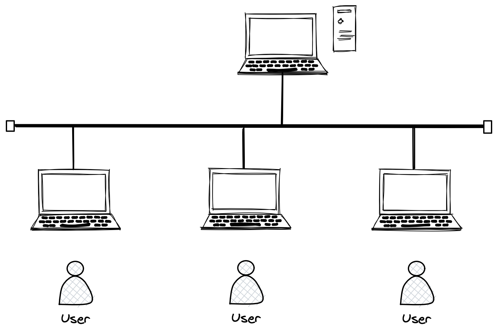

> 上图就是计算机网络的雏形，一台机器用来共享数据，其他人通过网线连接到该机器。

### 1.1 局域网

局域网又叫 LAN。几台计算机可以有交换机连接在一起，形成局域网，多个局域网之间可以由路由器连接在一起从而实现跨局域网通信，形成一个更大的局域网。

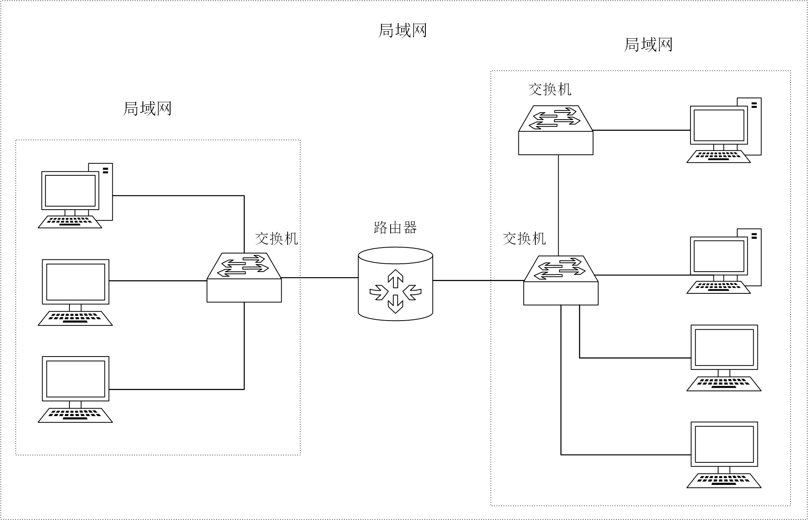

### 1.2 广域网

广域网WLAN：将相隔千里的计算机都连接在一起，就可以称为广域网。广域网和局域网是相对的概念，一个比较大的局域网就可以称为广域网。

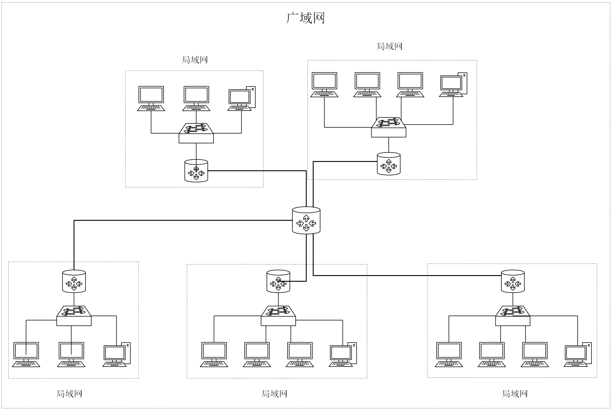

只要在同一个网段内就在一个局域网，广域网就没有这么明确的定义了，甚至会折中出“城域网”的概念。

&nbsp;

## 2. 网络协议的概念

所谓的计算机协议，本质就是由程序员自己根据标准文档或者自身喜好的一种约定，网络通信的双方必须遵守的规则，并根据协议规定发出各种字段，对方做出对应的响应动作。

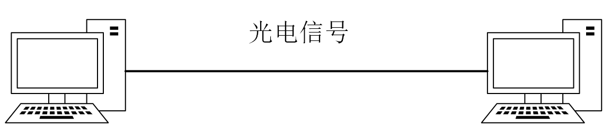

> 计算机之间的传输媒介是光电信号，通过信号的频率和强弱，表示对应的“1”和“0”信号，从而传递不同的信息。

计算机的生产商有很多，操作系统也很多，网络硬件设备也很多，如何让不同的网络设备之间能相互通信呢？那么设备就必须遵循同一个标准，这个标准就是网络协议。

### 2.1 初识网络协议

> 网络在哪里呢？

网络也是软件，软件都是层状结构，网络协议栈也是分层的。它是贯穿于计算机体系结构的一个软件，尤其是TCP/IP协议栈，是属于操作系统的一部分。

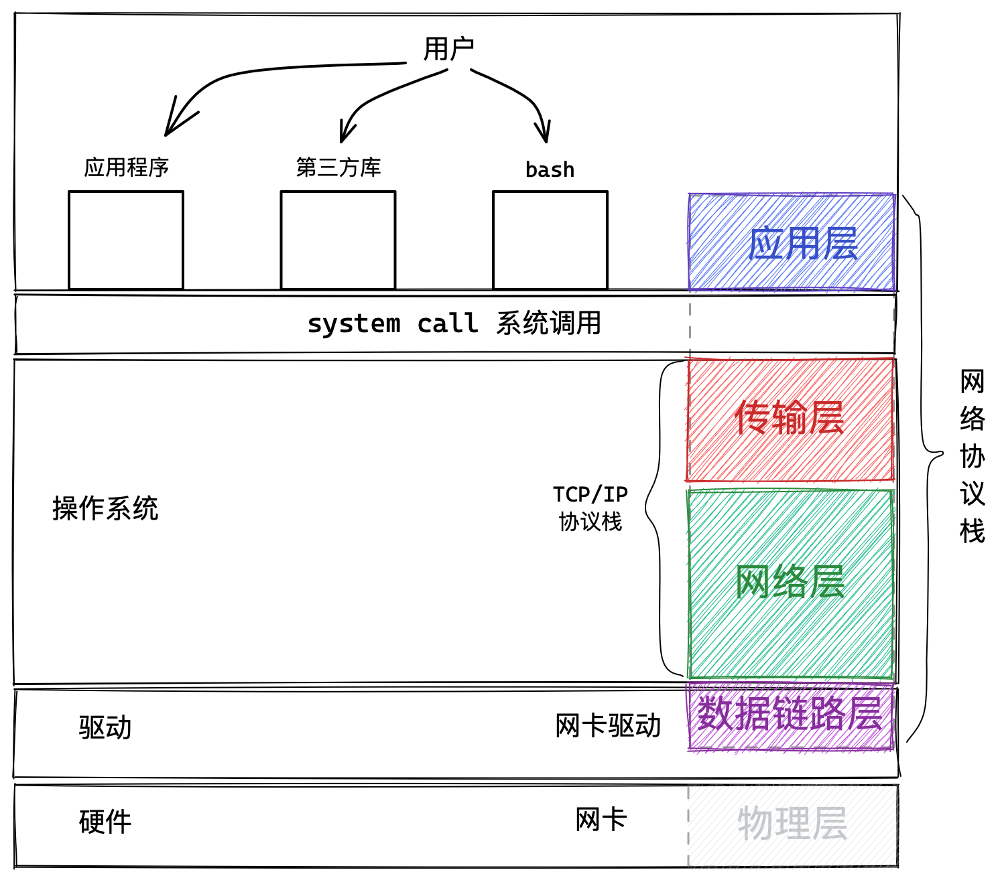

### 2.2 理解协议分层

先看一个打电话的例子， 使用同一种语言的互相通信，不管底层的通信设备如何变化，都能转化成同一种语言。如下图：

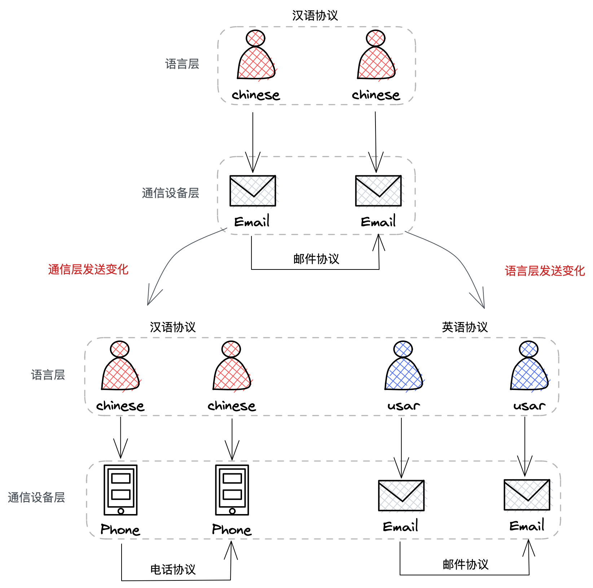

层状结构是一种很优秀的设计，它一定程度上实现了”解耦“，实现了解耦后，任何一层都可以进行替换，即便在某层中出现BUG，也可以将问题聚焦到指定的一层中，不会影响到其他层。

> 那具体协议与协议之间是怎么分层的呢？不同的软件实现的协议分层是有差别的。

协议分层也是软件分层，从软件分层的角度看，软件就是代码和数据的集合，也就是各种函数和各种对象，在代码上从逻辑角度进行分层，层与层直接存在交互，数据在层之间进行流动，这就是软件分层的策略。

### 2.3 OSI七层模型

OSI组织设计了一个七层网络模型，是一个逻辑上定义的规范。实际上并不真实存在，只是从逻辑角度抽象设计出来的。

> 类似于进程地址空间的概念，系统中并不真实存在着地址空间，进程地址空间是虚拟的，是用一堆整数模拟出来的逻辑上的规范。

人们在实际将规范实现落地的时候，并没有完全遵照该模型，而是按照实际情况，定义出来了真实的TCP/IP五层（或四层）协议。

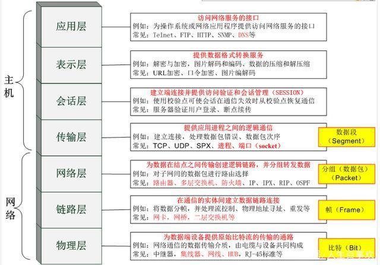

### 2.4 TCP/IP四层模型

TCP/IP模型是在工程实践中真实存在的模型， 准确的来说它有4层，有人说是5层是加了一层物理层，实际上TCP/IP协议是纯软件的协议。

为了全面介绍，我们暂时把物理层带上，自底向上分别是**物理层、数据链路层、网络层、传输层、应用层**。

| 模型层     | 解释                                                         |
| ---------- | ------------------------------------------------------------ |
| 物理层     | 负责光电信号的传递，决定了物理层面的概念，如传输速率，传输距离，抗干扰性等。 |
| 数据链路层 | 相当于物理层硬件的驱动程序，让操作系统可以进行控制物理设备。负责设备之间的数据帧的传送和识别。 |
| 网络层     | 负责地址管理和路由选择，例如同IP地址标识一台联网主机，通过路由规划出两台主机之间的数据传输路线。 |
| 传输层     | 负责两台主机之间的数据传输. 如传输控制协议 (TCP)，确保数据的传输。 |
| 应用层     | 负责应用程序间沟通，如 SMTP、FTP、Telnet                     |

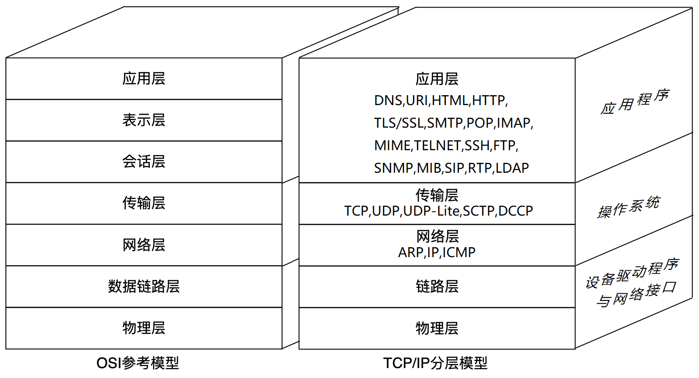

> 物理层我们不作考虑，因此称TCP/IP四层协议。一般而言越靠近用户的设备，实现的网络协议栈越高：
>
> - 对于一台主机，它的操作系统内核实现了从传输层到物理层的内容；
> - 对于一台路由器, 它实现了从网络层到物理层；
> - 对于一台交换机, 它实现了从数据链路层到物理层；
> - 对于集线器, 它只实现了物理层。

- 网络层负责路径规划，也就是选择数据传输的路径，
- 网络层只是预先的规划，链路层负责具体的数据传输过程。
- 传输层负责传输可靠性，保证传输过程中数据的完整，数据丢了要补发。
- 数据传输只是第一步，更重要的是数据的使用。应用层决定了传输过来的数据用法。

> 下三层负责数据的传输，应用层负责数据的使用，目前只是粗粒度的认识网络协议栈，未来还会逐个详谈。

[TCP/IP四层模型和OSI七层模型的概念](http://blog.csdn.net/superjunjin/article/details/7841099)

&nbsp;

## 3. 网络传输的流程

我们以TCP/IP协议的通信过程为例认识一下网络传输的基本过程。

### 3.1 TCP/IP局域网通信

先看局域网中两台主机通信的示意图，左右两边各是一台主机：

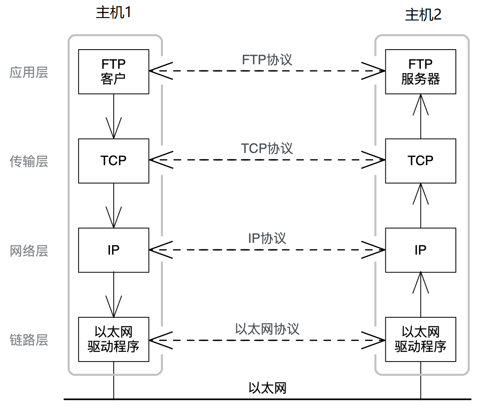

- 链路层不属于操作系统，是底层硬件的驱动程序。
- 传输层和网络层是操作系统内核的两层网络协议栈。
- 应用层是操作系统之上的应用程序，属于用户进程，由用户使用

> 链路层、传输层、网络层都是处理通信细节，像是快递包裹的运输细节，用户并不关心。用户关心的是应用层处理应用程序细节。

数据从一台主机到另一台主机，不是直接从应用层“飞到”另一台主机的应用层。而是经过如下的步骤：

1. 数据从应用层产生，自顶向下经过传输层、网络层、链路层，最后到达以太网（物理层）；
2. 在网线中传输到另一台联网主机上，自底向上经过链路层、网络层、传输层，最后到达应用层。

- **数据自顶向下到达一个协议栈时，需要添加当前栈的报头，这个过程叫封装**。
- **数据自底向上到达一个协议栈时，需要拿去当前栈的报头，这个过程叫解包**。

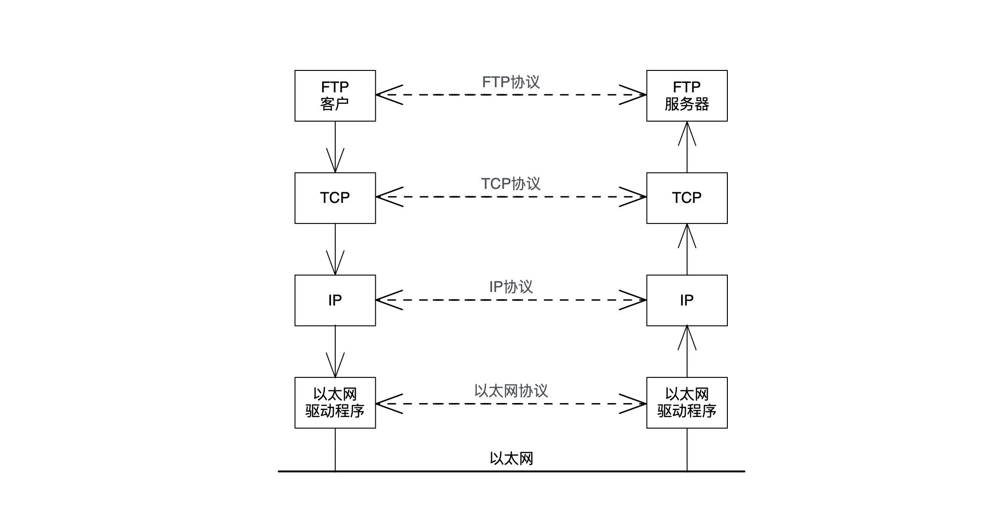

如图所示，**同等的协议栈层会拿到同样的协议报文，同样的报文就意味着如果忽略底层的细节，就相当于这边协议层发送什么对应协议层就收到什么，仿佛是对等的双方协议栈直接进行通信**。实际上并不是，这就是封装的好处，不需要考虑底层的实现。

#### 报头的理解

> 那什么是报头，为什么要有报头呢？我们现在还是概念的灌输阶段，不涉及具体的某个协议的报头内容，我们从C语言实现的角度理解一下。

报头类似于快递单上的快递信息，扫描二维码即可，查看到快递的运输信息。报头最重要的是报头的格式 + 数据。

**报头中的数据用来指导当前层进行某种协议决策**，传输层的报头指导如何传输，网络层的报头指导路径选择，链路层的报头指导如何转发。

在计算机系统中，**报文由两部分组成报头和有效载荷**，只有当前层的报头被认为是报头，之后的都是有效载荷。

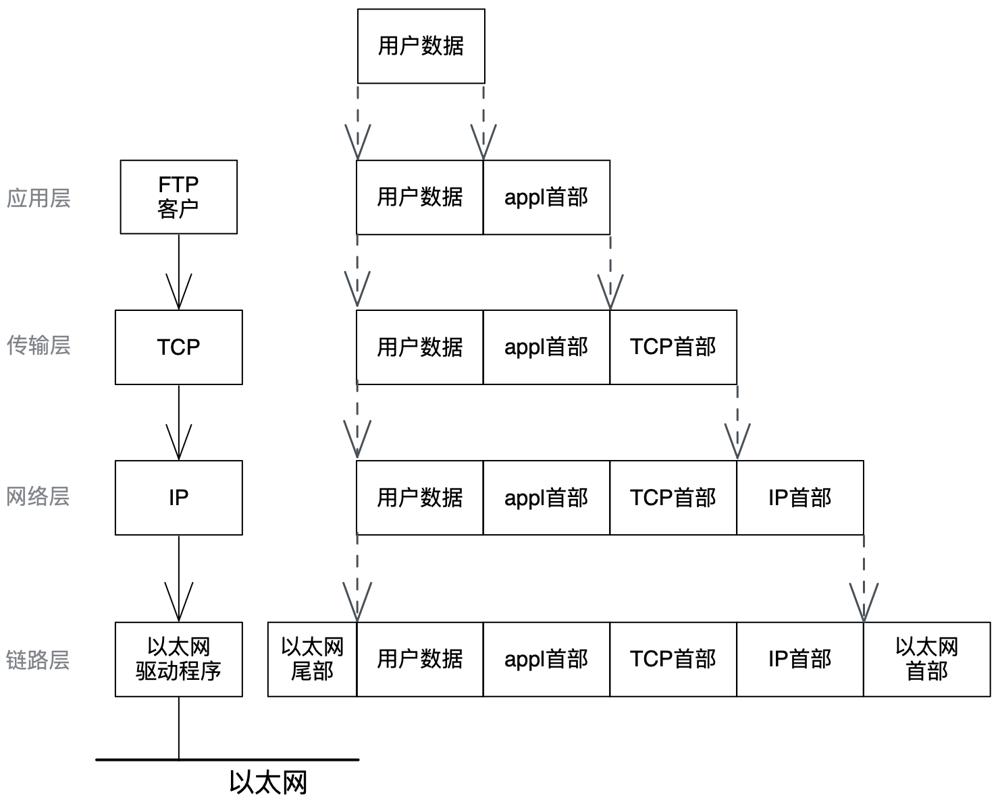

报头也是数据，是一种结构化的数据，在语言角度就是位段：

```c
//示意报头结构
struct my_hdr {
	unsigned int src:16;
    unsigned int dst:16;
    unsigned int type:8;
    unsigned int len:24;
}
struct my_hdr my = { 0x1, 0x2, 0x3, 0x9 };
```

封装就是将报头位段变量使用`memcpy`放到有效载荷的前面，解包就使用字段类型的指针`struct my_hdr* ptr`向后加一即可。

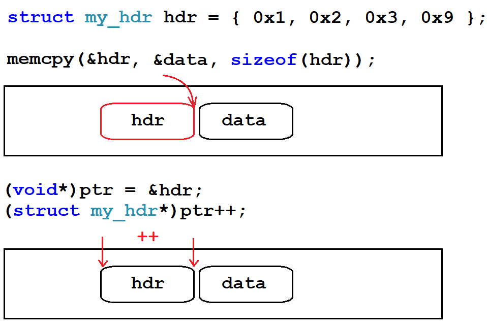

几乎每一层协议的报头字段中，都要包含两种字段：

1. 明确报头和有效载荷的边界，将报头交给对应协议栈的过程叫做解包。
2. 报文的有效载荷得交给上层的哪一种协议，选择交给上层哪一种协议的过程叫做分用。

&nbsp;

### 3.2 TCP/IP广域网通信

两台主机跨网络，进行广域网通信的过程示意图如下：

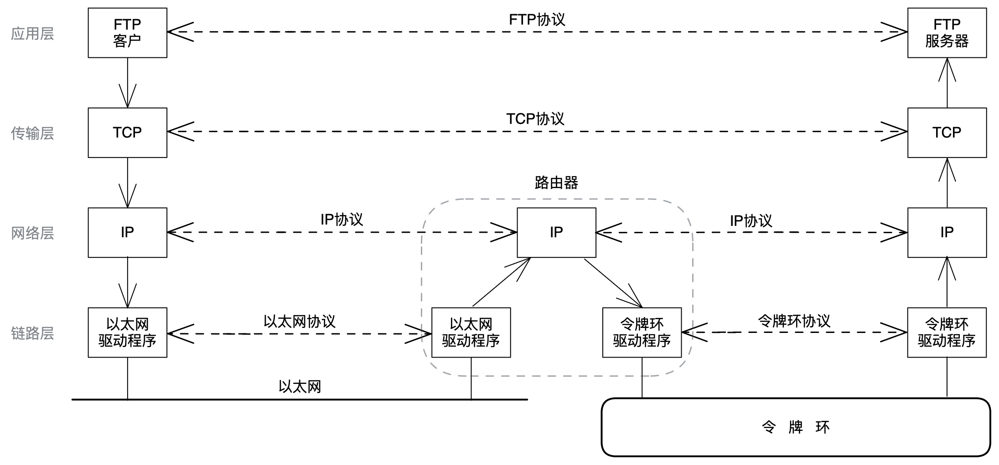

两台主机跨网络，进行广域网通信是需要路由器的，左边是以太网，右边是令牌环，甚至是无限LAN。

主机1和主机2当然不在同一个网段，因为它们之间用路由器连接。但主机1和路由器，主机2和路由器都分别是在同一个网段的。

> 那主机是如何把数据发给路由器呢？主机和路由器算在一个局域网内，本质是局域网通信。简单说一下局域网通信原理。

#### 局域网通信原理认识

局域网通信类似于线下上课，老师在课堂上单独叫某位同学的名字并询问其学习情况，虽然只是叫该同学一个人，但教室内的所有同学都听到了对话，只是默认不予回答而已。

也就是**局域网内的网络资源被所有设备共享**，一台主机发出信息，所有的设备都会收到。只不过每个主机发出的报文都会携带报头字段其中包含目的设备的 Mac 地址，其他的设备就会识别到并不是发给自己的就会将报文直接丢弃。


所以**任何时刻都只能有一台主机在局域网中发送消息**，同时发送报文可能会导致数据碰撞的问题。每台主机都要有碰撞检测和碰撞避免的算法，也就是如果发生数据碰撞，后者需要延迟发送。

所有的主机任何时刻都可能向局域网内发送数据，**这就是互斥关系，局域网网络就是临界资源**，所以只要不停向局域网内发送数据，占用资源，就是攻击该局域网。

#### IP的理解

```shell
$ ifconfig
eth0: flags=4163<UP,BROADCAST,RUNNING,MULTICAST>  mtu 1500
        inet 10.0.4.16  netmask 255.255.252.0  broadcast 10.0.7.255
        inet6 fe80::5054:ff:fe1f:9635  prefixlen 64  scopeid 0x20<link>
        ether 52:54:00:1f:96:35  txqueuelen 1000  (Ethernet)
        RX packets 1471739  bytes 173738937 (165.6 MiB)
        RX errors 0  dropped 0  overruns 0  frame 0
        TX packets 1452863  bytes 140449143 (133.9 MiB)
        TX errors 0  dropped 0 overruns 0  carrier 0  collisions 0

lo: flags=73<UP,LOOPBACK,RUNNING>  mtu 65536
        inet 127.0.0.1  netmask 255.0.0.0
        inet6 ::1  prefixlen 128  scopeid 0x10<host>
        loop  txqueuelen 1000  (Local Loopback)
        RX packets 159  bytes 20432 (19.9 KiB)
        RX errors 0  dropped 0  overruns 0  frame 0
        TX packets 159  bytes 20432 (19.9 KiB)
        TX errors 0  dropped 0 overruns 0  carrier 0  collisions 0
```

在网络中存在两种地址，一个是 IP 地址，一个是 Mac 地址。网络数据的传输类似于运输快递，对于快递点快递员而言，需要知道快递的两套地址信息：

1. 最初从哪来，最终到哪去（起点终点）
2. 上一站从哪来，下一站到哪去（持续变化）

起点终点几乎不变的地址就是 IP 地址，持续变化的上下站地址就是 Mac 地址，不变的IP地址对Mac地址的变化具有指导意义。	

- IP 地址用来标识广域网中的不同主机。
- IP地址是一个4字节，32位的整数，我们通常也使用”点分十进制“的字符串表示 IP 地址，例如 192.168.0.1。

- MAC 地址用来识别局域网内的某个主机。
- 长度为48位，即6个字节。一般用16进制数字加上冒号的形式来表示（例如：08:00:27:03:fb:19），在网卡出厂时就确定了，不能修改，具有唯一性。

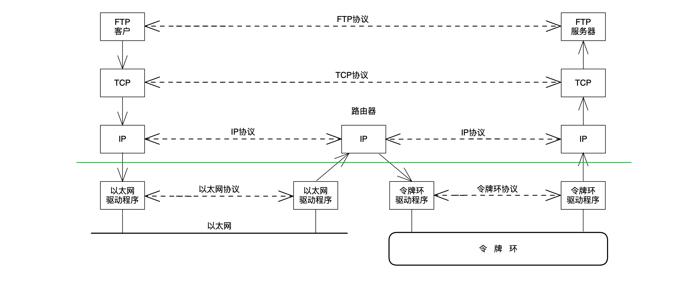

如图所示，在数据链路层，经过路由器，一直在不断进行解包和封装。源主机发的和路由器及目的主机收到的报文都是一样的，故IP层及向上部分，可以忽略底层结构的任何差异。
