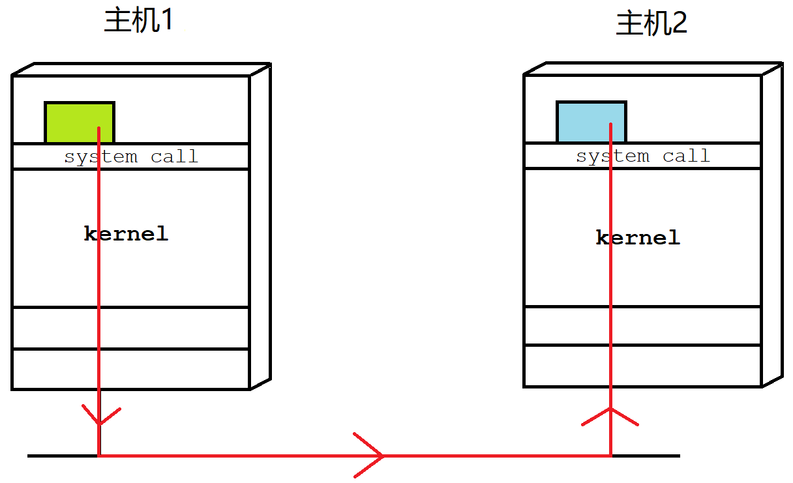
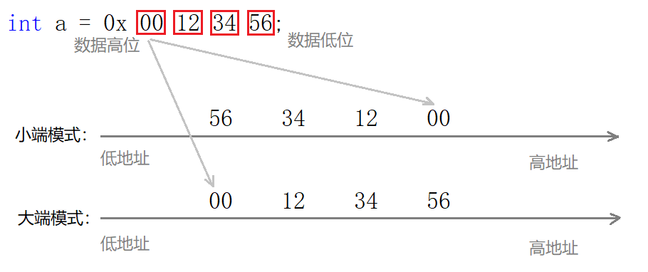
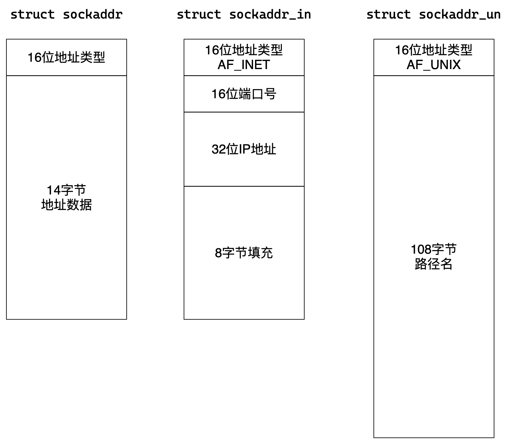

# 网络套接字

> 上一文已经讲解了网络的大致概念。本文先进行网络套接字编程，先理解应用层，之后在自顶向下深入学习网络协议栈。

## 1. 网络编程概念

### 1.1 源目的IP端口号

#### 源目的IP

IP地址（公网IP）唯一的标识了互联网中的一台主机。**源 IP 确定了一个报文从哪来，目的 IP 确定了一个报文到哪去**的问题。能够指导报文该如何进行路径选择。

> IP地址确定了目的主机，但这只是第一步，还要进一步确定目标主机上的提供数据处理的服务进程。

#### 源目的port

数据实际上都是由源目的主机上的某个进程产生和接收的，**端口号PORT唯一标识一台主机上的一个网络进程**。也就是源端口号确定源主机上的网络客户端进程，目的端口号确定目的主机上的网络服务进程。

`IP + PORT` IP地址和端口号就能标识互联网上的唯一的一台机器上的唯一的一个进程。

也就是说，**网络通信的本质就是跨网络的两台主机之间的进程间通信**。



> 可以把整个网络看作是一个大操作系统，所有的网络上网行为就都可以看作是这个大操作系统内进行的进程间通信。

进程具有独立性，进程间通信的前提是先让不同的进程看到同一份资源，而网络通信的临界资源就是网络。

&nbsp;

### 1.2 认识TCP/UDP协议

| 协议名称           | 所处栈层 | 特点                           |
| ------------------ | -------- | ------------------------------ |
| TCP 传输控制协议   | 传输层   | 有连接、可靠传输、面向字节流   |
| UDP 用户数据报协议 | 传输层   | 无连接、不可靠传输、面向数据报 |

关于可靠性的含义，并不是一个具有褒贬意义的词语，只是TCP会具有一些措施保证传输数据的完整性等，而UDP不保证数据的完整，只保证完成传输的任务，不考虑丢包等情况。

> 目前也只是刚开始着手网络编程，中个细节会在之后的章节详细讨论。

&nbsp;

### 1.3 理解网络字节序

学C语言的时候我们就知道，大于一个字节数据的存储需要考虑字节序的问题。所以计算机有大端机和小端机之分，大端就是低地址高字节，反之小端是高地址低字节。



> 发送主机通常将发送缓冲区中的数据按内存地址从低到高的顺序发出，接收主机把从网络上接到的字节也是按内存地址从低到高的顺序保存在接收缓冲区中。
>
> 因此，网络数据流的地址应这样规定：先发出的数据是低地址，后发出的数据是高地址。

网络中同样需要确定字节序问题，所以TCP/IP协议“简单粗暴地”规定不管机器是大端还是小端，**网络数据一律都采用大端的形式**。

所以系统提供了几个库函数，可直接将数据进行主机和网络字节序的转化，如下：

```c
SYNOPSIS
       #include <arpa/inet.h>
       uint32_t htonl(uint32_t hostlong);   // 主机 转 网络 长整型
       uint16_t htons(uint16_t hostshort);  // 主机 转 网络 短整型
       uint32_t ntohl(uint32_t netlong);    // 网络 转 主机 长整型
       uint16_t ntohs(uint16_t netshort);   // 网络 转 主机 短整型

/* h(host)主机  n(net)网络  l(long)长整型  s(short)短整型 */
```

&nbsp;

### 1.4 sockaddr结构

让进程接入网络实现网络通信，免不了需要一些参数如IP地址，端口等。所以需要认识通信协议家族的结构体。

网络通信等标准方式有很多种，比如TCP/IP协议是基于ip的网络通信，对应的协议家族是`AF_INET`的通信方式，其他通信方式还有原始套接字，域间套接字等。



如图所示，虽然各种协议的套接字有所不同，但socket接口设计者为了统一化，设计出了一个结构名称叫`struct sockaddr`，这是一种通用结构。

我们采取什么通信协议就用什么结构，在传参的时候类型强转成`struct sockaddr`，接口内部判断我们使用的是那种协议。

> 类似于C++的多态，`sockaddr`像是C++的父类指针，INET套接字或者域间套接字是子类指针。

```c
#include <netinet/in.h>
#include <apra/inet.h>

typedef uint16_t in_port_t;   // 端口类型
typedef uint_32_t in_addr_t;  // IP 类型
struct in_addr
  {
    in_addr_t s_addr;    
  };

/* Structure describing an Internet socket address.  */
struct sockaddr_in
  {
    __SOCKADDR_COMMON (sin_);
    in_port_t sin_port;			/* Port number.  */
    struct in_addr sin_addr;		/* Internet address.  */

    /* Pad to size of `struct sockaddr'.  */
    unsigned char sin_zero[sizeof (struct sockaddr) -
			   __SOCKADDR_COMMON_SIZE -
			   sizeof (in_port_t) -
			   sizeof (struct in_addr)];
  };
```

&nbsp;

## 2. socket网络编程

### socket

```c
SYNOPSIS
       #include <sys/types.h>       
       #include <sys/socket.h>
	   //1. 创建套接字
       int socket(int domain, int type, int protocol);
```

#### 参数

| 参数     | 解释                                                         |
| -------- | ------------------------------------------------------------ |
| domain   | 用来指定通信所用到的协议家族，一般TCP/UDP使用`AF_INET`即可   |
| type     | 指定具体的通信协议，使用UDP则传`SOCK_DGRAM`，使用TCP则传`SOCK_STREAM` |
| protocol | TCP/UDP通信统一传0即可                                       |

#### 返回值

`socket`函数返回值尤其重要，**调用成功返回网络套接字文件的文件描述符**，调用失败返回负值。

##### 示例

```c
int sock = socket(AF_INET, SOCK_DGRAM, 0);
if (sock < 0) {
    std::cerr << "socket error: " << errno << std::endl;
    exit(1);
}
```

### bind

```c
//2. 绑定IP端口
int bind(int socket, const struct sockaddr *address, socklen_t address_len);
```

1. 作为服务器，一定要客户端知道自身的IP和端口，否则无法建立连接。但云服务器不允许绑定固有IP，必须使用宏`INADDR_ANY`让系统自动为我们绑定。
2. 作为客户端，不是不需要绑定端口，只是不需要显式绑定，端口由操作系统自行分配。

- 第一个参数就是`socket`的返回值文件描述符，
- 之后两个参数是`sockaddr`结构体地址和结构体长度，sockaddr用来指定机器相关的socket信息。
- 返回值成功返回0，失败返回-1。

#### 示例

```c
struct sockaddr_in local;
local.sin_family = AF_INET;          // 协议家族
local.sin_port = htons(port);        // 端口
local.sin_addr.s_addr = INADDR_ANY;  // IP地址
if (bind(sock, (struct sockaddr*)&local, sizeof(local)) < 0) {
    std::cerr << "bind error: " << errno << std::endl;
    exit(2);
}
```


### 2.2 UDP网络程序

#### recvfrom

```c
SYNOPSIS
       #include <sys/socket.h>

       ssize_t recvfrom(int socket, void *restrict buffer, size_t length,
              int flags, struct sockaddr *restrict address,
              socklen_t *restrict address_len);
```

- 参数1`socket`是网络套接字的文件描述符；
- 参数2`buffer`是接收数据的接受缓冲区，`length`是缓冲区的长度，`flags`是接收数据的方式默认为0；
- 参数3`address`和`addrlen`分别是发送方的套接字信息结构体的地址和长度。
- 返回值就是接收到的字符个数。

##### 示例

```c
struct sockaddr_in peer;
socklen_t len = sizeof(peer);
ssize_t s = recvfrom(sock, buf, sizeof(buf), 0, (struct sockaddr*)&peer, &len);
if (s > 0) {
    buf[s] = 0;
    std::cout << "server # " << std::endl << buf << std::endl;
}
else {
    std::cerr << "recvfrom error" << std::endl;
}
```

#### sendto

```c
SYNOPSIS
       #include <sys/socket.h>
       ssize_t sendto((int socket, const void *message, size_t length,
              int flags, const struct sockaddr *dest_addr,
              socklen_t dest_len);
```

- 参数1`socket`是网络套接字的文件描述符；
- 参数2`message`是发送字符数组的地址，`length`是数组等长度，`flags`是发送数据的方式默认为0；
- 参数3`address`和`addrlen`分别是发送方的套接字信息结构体的地址和长度。
- 返回值就是接收到的字符个数。

##### 示例

```c
sendto(sock, reply.c_str(), reply.size(), 0, (struct sockaddr*)&peer, len);
```

- `recvfrom`的参数`sockaddr`及`addr_len`是输出型参数，用来接收发送方的sockaddr结构体，获取发送方的信息。
- `sendto`的参数`sockaddr`及`addr_len`是输入行参数，用来传输自身的sockaddr结构体，让接收方获取自身的信息。

分有客户端和服务器两个文件：udp_client.cc udp_server.cc。

#### UDP客户端

```cpp
//udp_client.cc
#include <iostream>
#include <string>
#include <cstring>
#include <cerrno>
#include <sys/types.h>
#include <sys/socket.h>
#include <netinet/in.h>
#include <arpa/inet.h>

const int BUFFER_SIZE = 1024; //读写缓冲区大小

void Usage(std::string proc) {
    std::cout << "Usage: \n\t" << proc << " server_ip, server_port" << std::endl;
}
int main(int argc, char* argv[])
{
    // 获取命令行参数
    if (argc != 3) {
        Usage(argv[0]);
        exit(0);
    }
    std::cout << "Hello UdpClient" << std::endl;

    //1. 创建套接字，打开网络文件
    int sock = socket(AF_INET, SOCK_DGRAM, 0);
    if (sock < 0) {
        std::cerr << "socket error: " << errno << std::endl;
        exit(1);
    }

    //客户端进行网络通信必须要有IP地址和端口，但不需要显式绑定指定的端口
    //由系统随机分配，防止端口被占用

    //2. 使用服务
    // 服务端地址结构体
    struct sockaddr_in server;
    server.sin_family = AF_INET;                   // 协议家族
    server.sin_addr.s_addr = inet_addr(argv[1]);   // IP地址
    server.sin_port = htons(atoi(argv[2]));        // 端口

    bool quit = false;
    while (!quit) 
    {
        char msg[1024];
        std::cout << "MyShell: ";
        fgets(msg, sizeof(msg), stdin);
        //发送数据
        sendto(sock, msg, strlen(msg), 0, (struct sockaddr*)&server, sizeof(server));
        struct sockaddr_in tmp; //tmp仅用于传参，无实际意义
        socklen_t len = sizeof(tmp);
        char buf[BUFFER_SIZE] = { 0 };
        //接受数据
        ssize_t cnt = recvfrom(sock, buf, sizeof(buf), 0, (struct sockaddr*)&tmp, &len);
        if (cnt > 0) {
            buf[cnt] = 0;
            std::cout << "server # " << std::endl << buf << std::endl;
        }
        else {
            std::cerr << "recvfrom error" << std::endl;
        }
    }
    return 0;
}
```

#### UDP服务器

```cpp
//udp_server.cc
#include <iostream>
#include <vector>
#include <string>
#include <cstring>
#include <cerrno>
#include <unistd.h>
#include <sys/types.h>
#include <sys/socket.h>
#include <netinet/in.h>
#include <arpa/inet.h>

// const uint16_t PORT = 8080; //网络服务进程端口不可轻易修改
const int BUFFER_SIZE = 1024; //读写缓冲区大小

void Usage(std::string proc) {
    std::cout << "Usage: \n\t" << proc << " port" << std::endl;
    exit(1);
}

int main(int argc, char* argv[])
{
    if (argc != 2) {
        Usage(argv[0]);
        exit(1);
    }
    uint16_t port = atoi(argv[1]);
    std::cout << "Hello UdpServer" << std::endl;

    //1. 创建套接字，打开网络文件
    int sock = socket(AF_INET, SOCK_DGRAM, 0);
    if (sock < 0) { // 3
        std::cerr << "socket error: " << errno << std::endl;
        exit(1);
    }

    //2. 绑定IP和端口
    struct sockaddr_in local;
    local.sin_family = AF_INET;          // 协议家族
    local.sin_port = htons(port);        // 端口 - htons 主机转网络短整型（小端转大端）
    local.sin_addr.s_addr = INADDR_ANY;  // IP地址
    // 云服务器不允许显式绑定IP，防止单主机多IP的情况
    // local.sin_addr = inet_addr("81.68.165.71"); 
    // IP地址 - inet_addr 将点分十进制IP转化成4字节整数IP
    if (bind(sock, (struct sockaddr*)&local, sizeof(local)) < 0) {
        std::cerr << "bind error: " << errno << std::endl;
        exit(2);
    }

    //3. 提供服务
    bool quit = false;
    while (!quit)
    {
        struct sockaddr_in peer;           // 远端地址
        socklen_t len = sizeof(peer);      // 远端地址结构体大小
        char buf[BUFFER_SIZE] = { 0 };  // 缓冲区
        // 接受数据
        ssize_t cnt = recvfrom(sock, buf, sizeof(buf), 0, (struct sockaddr*)&peer, &len);
        if (cnt > 0) {
            // 打印接受数据
            buf[cnt] = 0;
            std::cout << "client# " << buf << std::endl;
            FILE* fp = popen(buf, "r"); //看作命令
            std::string res;
            while (fgets(buf, sizeof(buf), fp) != NULL) {
                res += buf;
            }
            // 发送数据
            std::string reply = std::string(buf);
            sendto(sock, reply.c_str(), reply.size(), 0, (struct sockaddr*)&peer, len);
        }
        else {
            std::cerr << "recvfrom error" << std::endl;
        }
    }
    return 0;
}
```

&nbsp;

### 2.3 TCP网络程序

#### listen

```c
//3. 开始监听 TCP server
int listen(int socket, int backlog);
```

TCP是面向连接的通信方式，所以在通信前需先建立连接，才能进行通信。**listen接口的作用是设置套接字为listen监听状态，本质是允许用户进行连接。**

#### accept

```c
//4. 接收请求 TCP server
int accept(int sockfd, struct sockaddr *addr, socklen_t *addrlen);
```

打开监听状态，之后就能获取到客户端的连接请求，**accept接口的作用是接收客户端的请求，接收成功就正式建立了连接。**

##### 返回值

- accept接口的返回值是一个新的网络套接字文件描述符，用来和客户端通信。
- socket接口的返回值也是网络套接字文件描述符，用来监听来自客户端的连接请求，该文件描述符作为accept接口的参数，用来确定要连接的客户端，它的使命也就是到此为止了。

#### connect

```c
//5. 建立连接 TCP client
int connect(int sockfd, const struct sockaddr *addr, socklen_t addrlen);
```

客户端主动请求连接的接口，当然服务端必须先打开监听状态。

#### recv/send

```c
ssize_t recv(int sockfd, void *buf, size_t len, int flags);
ssize_t send(int sockfd, const void *buf, size_t len, int flags);

ssize_t read(int fildes, void *buf, size_t nbyte);
ssize_t write(int fildes, const void *buf, size_t nbyte);
```

TCP协议是流式套接字，可以发现TCP的读写接口和文件的读写非常像，仅仅多了一个方式`flags`。

#### TCP客户端

```cpp
// tcp_client.cc
#include <iostream>
#include <string>
#include <cstring>
#include <cerrno>
#include <unistd.h>
#include <sys/types.h>
#include <sys/socket.h>
#include <netinet/in.h>
#include <arpa/inet.h>

void Usage(std::string proc) {
    std::cout << "Usage: \t\n" << proc << " server_ip server_port" << std::endl;
}

// ./UdpClient server_ip server_port
int main(int argc, char* argv[])
{
    if (argc != 3) {
        Usage(argv[0]);
        exit(1);
    }
    std::cout << "hello tcp_client" << std::endl;

    std::string svr_ip = argv[1];
    uint16_t svr_port = atoi(argv[2]);

    //1. 建立连接
    int sock = socket(AF_INET, SOCK_STREAM, 0);
    if (sock < 0) {
        std::cout << "socket error: " << errno << std::endl;
        exit(2);
    }

    // bind listen accept ??
    //2. 开始连接
    struct sockaddr_in server;
    server.sin_family = AF_INET;
    server.sin_addr.s_addr = inet_addr(svr_ip.c_str());
    //inet_addr 将点分十进制形式IP转化为4字节整数IP，并将主机序列转化为网络序列
    server.sin_port = htons(svr_port);
    if (connect(sock, (struct sockaddr*)&server, sizeof(server)) < 0) {
        std::cout << "connect error" << std::endl;
        exit(3);
    }
    std::cout << "connect successs" << std::endl;

    //3. 业务代码
    while (true)
    {
        std::cout << "input-> ";
        char buffer[1024];
        fgets(buffer, sizeof(buffer), stdin);

        end(sock, buffer, strlen(buffer) - 1, 0); // strlen()-1去回车
        ssize_t s = recv(sock, buffer, sizeof(buffer), 0);
        if (s > 0) {
            buffer[s] = 0;
            std::cout << buffer << std::endl;
        }
        else {
            std::cout << "recv error" << std::endl;
            exit(4);
        }
    }
    return 0;
}
```

&nbsp;

#### TCP服务器

##### 单进程版

```cpp
//tcp_server.cc
#include <iostream>
#include <string>
#include <cstring>
#include <cerrno>
#include <unistd.h>
#include <sys/types.h>
#include <sys/socket.h>
#include <netinet/in.h>
#include <arpa/inet.h>

void Usage(std::string proc) {
    std::cout << "Usage: \n\t" << proc << " port" << std::endl;
}

void ServerIO(int new_sock)
{
    while (true)
    {
        char buffer[1024];
        memset(buffer, 0, sizeof(buffer));
        ssize_t s = recv(new_sock, buffer, sizeof(buffer), 0);
        // ssize_t s = read(new_sock, buffer, sizeof(buffer));
        if (s > 0) {
            buffer[s] = 0;
            std::cout << "client# " << buffer << std::endl;
            std::string reply = ">>>server<<< " + std::string(buffer);
            send(new_sock, reply.c_str(), reply.size(), 0);
            // write(new_sock, reply.c_str(), reply.size());
        }
        else if (s == 0) {
            std::cout << "client quit..." << std::endl;
            break;
        }
        else {
            std::cerr << "recv error" << std::endl;
            break;
        }
    }
}

// ./TcpServer 8081
int main(int argc, char* argv[])
{
    if (argc != 2) {
        Usage(argv[0]);
        exit(1);
    }
    std::cout << "hello tcp_server" << std::endl;

    //1. 创建套接字
    int listen_sock = socket(AF_INET, SOCK_STREAM, 0);
    if (listen_sock < 0) {
        std::cerr << "socket error" << errno << std::endl;
        exit(2);
    }

    //2. 绑定IP地址和端口
    struct sockaddr_in local;
    memset(&local, 0, sizeof(local));
    local.sin_family = AF_INET;
    local.sin_port = htons(atoi(argv[1]));
    local.sin_addr.s_addr = INADDR_ANY;

    if (bind(listen_sock, (struct sockaddr*)&local, sizeof(local)) < 0) {
        std::cerr << "bind error" << errno << std::endl;
        exit(3);
    }

    //3. tcp 面向连接通信，在通信前先建立连接
    // 客户端主动建立连接，服务端被动接受连接
    // 故要不断提供给用户一个建立连接的功能，设置套接字为listen状态，本质是允许用户连接
    const int back_log = 5;
    if (listen(listen_sock, back_log) < 0) {
        std::cerr << "listen error" << errno << std::endl;
        exit(4);
    }
    while (true) {
        //4. 获取连接
        struct sockaddr_in peer;
        socklen_t len = sizeof(peer);
        int new_sock = accept(listen_sock, (struct sockaddr*)&peer, &len);
        if (new_sock < 0) {
            continue;
        }
        
        uint16_t cli_port = ntohs(peer.sin_port);        // 客户端端口
        std::string cli_ip = inet_ntoa(peer.sin_addr);   // 服务端IP
        std::cout << "get a new link :" << "[" << cli_ip << ":" << cli_port << "]#" << new_sock << " ..." \
            << std::endl;

        //5. 提供服务
        //Version1:单进程版，无人使用！
        ServerIO(new_sock);
    }
    return 0;
}
```

##### 多进程版

```cpp
//tcp_server.cc
#include <iostream>
#include <string>
#include <unordered_map>
#include <cstring>
#include <cerrno>
#include <unistd.h>
#include <sys/types.h>
#include <sys/wait.h>
#include <sys/socket.h>
#include <netinet/in.h>
#include <arpa/inet.h>
#include <signal.h>

void Usage(std::string proc) {
    std::cout << "Usage: \n\t" << proc << " port" << std::endl;
}
void ServerIO(int new_sock)
{
    while (true)
    {
        char buffer[1024];
        memset(buffer, 0, sizeof(buffer));
        ssize_t s = recv(new_sock, buffer, sizeof(buffer), 0);
        // ssize_t s = read(new_sock, buffer, sizeof(buffer));
        if (s > 0) {
            buffer[s] = 0;
            std::cout << "client# " << buffer << std::endl;
            std::string reply = ">>>server<<< " + std::string(buffer);
            send(new_sock, reply.c_str(), reply.size(), 0);
            // write(new_sock, reply.c_str(), reply.size());
        }
        else if (s == 0) {
            std::cout << "client quit..." << std::endl;
            break;
        }
        else {
            std::cerr << "recv error" << std::endl;
            break;
        }
    }
}

// ./TcpServer 8081
int main(int argc, char* argv[])
{
    if (argc != 2) {
        Usage(argv[0]);
        exit(1);
    }
    std::cout << "hello tcp_server" << std::endl;

    //1. 创建套接字
    int listen_sock = socket(AF_INET, SOCK_STREAM, 0);
    if (listen_sock < 0) {
        std::cerr << "socket error" << errno << std::endl;
        exit(2);
    }

    //2. 绑定IP地址和端口
    struct sockaddr_in local;
    memset(&local, 0, sizeof(local));
    local.sin_family = AF_INET;
    local.sin_port = htons(atoi(argv[1]));
    local.sin_addr.s_addr = INADDR_ANY;

    if (bind(listen_sock, (struct sockaddr*)&local, sizeof(local)) < 0) {
        std::cerr << "bind error" << errno << std::endl;
        exit(3);
    }

    //3. tcp 面向连接通信，在通信前先建立连接
    // 客户端主动建立连接，服务端被动接受连接
    // 故要不断提供给用户一个建立连接的功能，设置套接字为listen状态，本质是允许用户连接
    const int back_log = 5;
    if (listen(listen_sock, back_log) < 0) {
        std::cerr << "listen error" << errno << std::endl;
        exit(4);
    }
    // signal(SIGCHLD, SIG_IGN); //忽略子进程退出信号，子进程自动释放


    while (true) {
        //4. 获取连接
        struct sockaddr_in peer;
        socklen_t len = sizeof(peer);

        int new_sock = accept(listen_sock, (struct sockaddr*)&peer, &len);
        if (new_sock < 0) {
            continue;
        }

        uint16_t cli_port = ntohs(peer.sin_port);        // 客户端端口
        std::string cli_ip = inet_ntoa(peer.sin_addr);   // 服务端IP
        std::cout << "get a new link :" << "[" << cli_ip << ":" << cli_port << "]#" << new_sock << " ..." \
            << std::endl;

        //5. 提供服务

        //Version2:多进程版
        pid_t id = fork();
        if (id < 0) {
            continue;  // 创建失败继续
        }
        else if (id == 0) {           // child
            // 子进程会继承父进程的文件描述符，相当于复制一份，
            // 父子进程的文件描述符互不影响，故关闭子进程的文件描述符
            close(listen_sock);
       
            if (fork() > 0) exit(0);  // 子进程退出，任务交给孙子进程执行
            // 子进程退出，孙子进程变成孤儿进程，交给OS领养
       
            ServerIO(new_sock);
            close(new_sock);          // 防止文件描述符泄漏
            exit(0);
        }
        else {                        // parent
            close(new_sock);          // 关闭父进程的newsock，以待重新获取连接
            waitpid(id, nullptr, 0);  // 等待子进程退出
        }

        //Version1:单进程版，无人使用！
        // ServerIO(new_sock);
    }
    return 0;
}
```

##### 多线程版

```cpp
//tcp_server.cc
#include <iostream>
#include <string>
#include <unordered_map>
#include <cstring>
#include <cerrno>
#include <unistd.h>
#include <sys/types.h>
#include <sys/wait.h>
#include <sys/socket.h>
#include <netinet/in.h>
#include <arpa/inet.h>
#include <signal.h>
#include <pthread.h>

void Usage(std::string proc) {
    std::cout << "Usage: \n\t" << proc << " port" << std::endl;
}
void ServerIO(int new_sock)
{
    while (true)
    {
        char buffer[1024];
        memset(buffer, 0, sizeof(buffer));
        ssize_t s = recv(new_sock, buffer, sizeof(buffer), 0);
        // ssize_t s = read(new_sock, buffer, sizeof(buffer));
        if (s > 0) {
            buffer[s] = 0;
            std::cout << "client# " << buffer << std::endl;
            std::string reply = ">>>server<<< " + std::string(buffer);
            send(new_sock, reply.c_str(), reply.size(), 0);
            // write(new_sock, reply.c_str(), reply.size());
        }
        else if (s == 0) {
            std::cout << "client quit..." << std::endl;
            break;
        }
        else {
            std::cerr << "recv error" << std::endl;
            break;
        }
    }
}

// ./TcpServer 8081
int main(int argc, char* argv[])
{
    if (argc != 2) {
        Usage(argv[0]);
        exit(1);
    }
    std::cout << "hello tcp_server" << std::endl;

    //1. 创建套接字
    int listen_sock = socket(AF_INET, SOCK_STREAM, 0);
    if (listen_sock < 0) {
        std::cerr << "socket error" << errno << std::endl;
        exit(2);
    }

    //2. 绑定IP地址和端口
    struct sockaddr_in local;
    memset(&local, 0, sizeof(local));
    local.sin_family = AF_INET;
    local.sin_port = htons(atoi(argv[1]));
    local.sin_addr.s_addr = INADDR_ANY;

    if (bind(listen_sock, (struct sockaddr*)&local, sizeof(local)) < 0) {
        std::cerr << "bind error" << errno << std::endl;
        exit(3);
    }

    //3. tcp 面向连接通信，在通信前先建立连接
    // 客户端主动建立连接，服务端被动接受连接
    // 故要不断提供给用户一个建立连接的功能，设置套接字为listen状态，本质是允许用户连接
    const int back_log = 5;
    if (listen(listen_sock, back_log) < 0) {
        std::cerr << "listen error" << errno << std::endl;
        exit(4);
    }


    while (true) {
        //4. 获取连接
        struct sockaddr_in peer;
        socklen_t len = sizeof(peer);

        int new_sock = accept(listen_sock, (struct sockaddr*)&peer, &len);
        if (new_sock < 0) {
            continue;
        }

        uint16_t cli_port = ntohs(peer.sin_port);        // 客户端端口
        std::string cli_ip = inet_ntoa(peer.sin_addr);   // 服务端IP
        std::cout << "get a new link :" << "[" << cli_ip << ":" << cli_port << "]#" << new_sock << " ..." \
            << std::endl;

        //5. 提供服务

        //Version3:多线程版
        //缺陷：创建进程线程数无上限，临时创建线程时效性不好
        close(listen_sock); // ERR 线程共享文件描述符，不像多进程可关闭
        pthread_t tid;
        pthread_create(&tid, nullptr, Routine, (void*)&new_sock);
    }
    return 0;
}
```

##### 线程池版

```c
//tcp_server.cc
#include <iostream>
#include <string>
#include <unordered_map>
#include <cstring>
#include <cerrno>
#include <unistd.h>
#include <sys/types.h>
#include <sys/wait.h>
#include <sys/socket.h>
#include <netinet/in.h>
#include <arpa/inet.h>
#include <signal.h>
#include <pthread.h>
#include "Task.hpp"
#include "ThreadPool.hpp"

using namespace NSTask;
using namespace NSThreadPool;

void Usage(std::string proc) {
    std::cout << "Usage: \n\t" << proc << " port" << std::endl;
}

// ./TcpServer 8081
int main(int argc, char* argv[])
{
    if (argc != 2) {
        Usage(argv[0]);
        exit(1);
    }
    std::cout << "hello tcp_server" << std::endl;

    //1. 创建套接字
    int listen_sock = socket(AF_INET, SOCK_STREAM, 0);
    if (listen_sock < 0) {
        std::cerr << "socket error" << errno << std::endl;
        exit(2);
    }
    //2. 绑定IP地址和端口
    struct sockaddr_in local;
    memset(&local, 0, sizeof(local));
    local.sin_family = AF_INET;
    local.sin_port = htons(atoi(argv[1]));
    local.sin_addr.s_addr = INADDR_ANY;
    if (bind(listen_sock, (struct sockaddr*)&local, sizeof(local)) < 0) {
        std::cerr << "bind error" << errno << std::endl;
        exit(3);
    }
    //3. tcp 面向连接通信，在通信前先建立连接
    // 客户端主动建立连接，服务端被动接受连接
    // 故要不断提供给用户一个建立连接的功能，设置套接字为listen状态，本质是允许用户连接
    const int back_log = 5;
    if (listen(listen_sock, back_log) < 0) {
        std::cerr << "listen error" << errno << std::endl;
        exit(4);
    }

    while (true) {
        //4. 获取连接
        struct sockaddr_in peer;
        socklen_t len = sizeof(peer);

        int new_sock = accept(listen_sock, (struct sockaddr*)&peer, &len);
        if (new_sock < 0) {
            continue;
        }

        uint16_t cli_port = ntohs(peer.sin_port);        // 客户端端口
        std::string cli_ip = inet_ntoa(peer.sin_addr);   // 服务端IP
        std::cout << "get a new link :" << "[" << cli_ip << ":" << cli_port << "]#" << new_sock << " ..." \
            << std::endl;

        //5. 提供服务
        //Version4:线程池版
        Task t(new_sock); // 创建任务
        ThreadPool<Task>::GetInstance()->PushTask(t); // 调用单例
    }
    return 0;
}
```

###### 英译汉，模拟命令

```c
// ThreadPool.hpp
#pragma once
#include <iostream>
#include <queue>
#include <string>
#include <pthread.h>
#include <unistd.h>

namespace NSThreadPool
{
    const int g_num = 5;
    template <class T>
    class ThreadPool
    {
    private:
        int _num;                    // 线程个数
        std::queue<T> _taskQueue;    // 任务队列

        pthread_mutex_t _mtx;        // 维护任务队列的互斥访问
        pthread_cond_t _cond;        // 唤醒因队列为空而挂起的线程

        static ThreadPool<T>* _ins;  // 类内静态指针
    private:
        //构造函数一定要有，因为new对象仍然会调用构造，只是外部不允许构造
        ThreadPool(int num = g_num) : _num(num)
        {
            pthread_mutex_init(&_mtx, nullptr);
            pthread_cond_init(&_cond, nullptr);
        }
        ThreadPool(const ThreadPool<T>& tp) = delete;
        ThreadPool<T>& operator=(ThreadPool<T>& tp) = delete;

        void InitThreadPool()
        {
            pthread_t tid;
            for (int i = 0; i < _num; i++)
            {
                pthread_create(&tid, nullptr, Routine, (void*)this);
            }
        }
    public:
        ~ThreadPool()
        {
            pthread_mutex_destroy(&_mtx);
            pthread_cond_destroy(&_cond);
        }
        void Lock() {
            pthread_mutex_lock(&_mtx);
        }
        void Unlock() {
            pthread_mutex_unlock(&_mtx);
        }
        void Wait() {
            pthread_cond_wait(&_cond, &_mtx);
        }
        void Wakeup() {
            pthread_cond_signal(&_cond);
        }
        bool IsEmpty() {
            return _taskQueue.empty();
        }

    public:
        static ThreadPool<T>* GetInstance()
        {
            static pthread_mutex_t lock = PTHREAD_MUTEX_INITIALIZER;
            if (_ins == nullptr) // 双判断，避免多线程同时竞争锁到锁内判断降低效率
            {
                pthread_mutex_lock(&lock);
                if (_ins == nullptr)
                {
                    _ins = new ThreadPool<T>();
                    _ins->InitThreadPool(); // 在非静态成员函数中可以利用静态指针调用非静态函数
                    std::cout << "首次加载对象" << std::endl;
                }
                pthread_mutex_unlock(&lock);
            }
            return _ins;
        }

        // 线程执行函数如果是类内成员，需要设置为静态成员，因为非静态成员函数参数有隐含this指针
        static void* Routine(void* args)
        {
            ThreadPool<T>* tp = (ThreadPool<T>*)args; // 通过参数显式传递this指针
            pthread_detach(pthread_self());

            while (true)
            {
                tp->Lock(); // 访问临界资源先加锁

                while (tp->IsEmpty())  // 任务队列为空，线程应该挂起
                {
                    tp->Wait(); // 等待条件变量
                }

                T t;
                tp->PopTask(&t); // 获取任务

                tp->Unlock();

                t(); // 解锁之后进行处理任务，避免占用锁，提高效率
            }
        }
        void PushTask(const T& in)
        {
            Lock();
            _taskQueue.push(in);
            Unlock();

            Wakeup(); // 唤醒线程处理任务
        }

        void PopTask(T* out)
        {
            *out = _taskQueue.front();
            _taskQueue.pop();
        }

    };
    template <class T>
    ThreadPool<T>* ThreadPool<T>::_ins = nullptr;
}
```

```c
//Task.hpp
#pragma once
#include <iostream>

namespace NSTask
{
    static std::unordered_map<std::string, std::string> g_dist;
    class Task
    {
    private:
        int _sock;
        int Run() {
            while (true) {
                char buf[1024];
                memset(buf, 0, sizeof(buf));
                ssize_t s = recv(_sock, buf, sizeof(buf), 0);
                if (s > 0) {
                    buf[s] = 0;

                    // FILE* fp = popen(buf, "r"); // buffer内容看作命令
                    //
                    // std::string res;
                    // 将命令结果提取到buffer
                    // while (fgets(buf, sizeof(buf), fp) != NULL) { 
                    //     res += buf;
                    // }
                    //
                    // pclose(fp);

                    std::string res;
                    Translate(std::string(buffer), &res); //英译汉程序

                    std::string reply = ">>>server<<< \n" + res;
                    send(_sock, reply.c_str(), reply.size(), 0);
                }
                else if (s == 0) {
                    std::cout << "client quit..." << std::endl;
                    break;
                }
                else {
                    std::cerr << "recv error" << std::endl;
                    break;
                }
            }
            close(_sock); // 释放套接字
        }
    public:
        Task() : _sock(-1) {
            InitDist(); // 初始化字典
        }
        Task(int sock) : _sock(sock)
        {}
        ~Task()
        {}
        void InitDist() {
            if (g_dist.empty()) {
                g_dist.insert(std::make_pair("hello", "你好"));
                g_dist.insert(std::make_pair("world", "世界"));
                g_dist.insert(std::make_pair("socket", "套接字"));
                g_dist.insert(std::make_pair("tree", "树"));
                g_dist.insert(std::make_pair("image", "图片"));
            }
        }
        void Translate(const std::string& req, std::string* resp) {
            auto it = g_dist.find(req);

            if (it == g_dist.end()) {
                *resp = "?";
                return;
            }
            *resp = it->second;
        }
        int operator()() {
            return Run();
        }
    };
}
```

## 3.套接字接口理解

> 刚刚写的套接字编程接口在底层上都是有对应的基本功能的。现在来深入的理解一下。

| 接口        | 解释                                                         |
| ----------- | ------------------------------------------------------------ |
| socket()    | 创建socket的过程，本质就是打开底层的文件，与网络无关。       |
| bind()      | 绑定套接字需要填充`sockaddr`结构，本质是将填写的IP和端口和套接字文件关联。 |
| listen()    | 本质是设置套接字文件的状态为监听状态，允许别人来连接。       |
| accept()    | 本质是获取以`fd`为代表的新链接到应用层。所谓链接，就是被OS描述并组织起来的结构。 |
| connect()   | 本质是发起链接，系统层面就是发送请求报文，网络层面是发起TCP连接的三次握手。 |
| send/recv() | 进行网络收发的通信，本质是进行系统文件的读写。               |
| close()     | 关闭文件，系统层面就是释放申请的文件资源，网络层面就是进行TCP连接的四次挥手。 |


> 写了这么多网络套接字的代码，我们究竟在做什么？

我们已经知道，网络协议栈分四层：应用层、传输层、网络层、数据链路层。传输层和网络层属于操作系统，数据链路层属于驱动， 我们实际上是利用系统调用从零开始编写应用层代码。

编写应用层，不是使用应用层，事实上编写项目的时候一般是直接使用他人编写好的应用层代码。目前我们没有定制任何的协议、没有搭建应用逻辑，只是传输了一下数据。 

> 所以下一章我们需要学习定制和使用定制好的协议，然后自顶向下逐步学习应用层、传输层、网络层、链路层。
