# 高级IO

## 1. IO的相关概念

内存和外设进行沟通的动作叫做IO。在网络层面，数据往网络里写的本质是将数据从内存拷贝到网卡上，从网络里读的本质是将数据从网卡拷贝到内存中。

> 当程序运行到IO函数时一般都在阻塞式等待，这也算作IO过程中的一个环节，但真正意义上的IO就是讲数据拷贝到缓冲区中。

任何IO过程都要包含两个步骤：等待和拷贝。在实际的应用场景中，等待消耗的时间往往都远远高于拷贝的时间，**所以提高IO效率的本质是：尽可能地减少单位时间内“等待”的比重**。

> 提高IO效率的方式有两种：改变等待的方式和减少等待的比重。

### 1.1 五种IO模型

| IO模型   | 简单对比解释                                 |
| -------- | -------------------------------------------- |
| 阻塞IO   | 一心一意地等待数据到来                       |
| 非阻塞IO | 三心二意地轮询式等待                         |
| 信号驱动 | 信号递达时再来读取或写入数据                 |
| 多路转接 | 让大批线程等待，自身读取数据                 |
| 异步通信 | 让其他进程或线程进行等待和读取，自身获取结果 |

除了最后一种是异步IO，其他都是同步IO。分辨二者的方式就是看自身是否参与IO。

#### 阻塞IO

阻塞IO是最简单最常见的一种IO方式，任何IO函数的核心工作都有两部分组成：等和拷贝，且默认使用的都是阻塞方式。

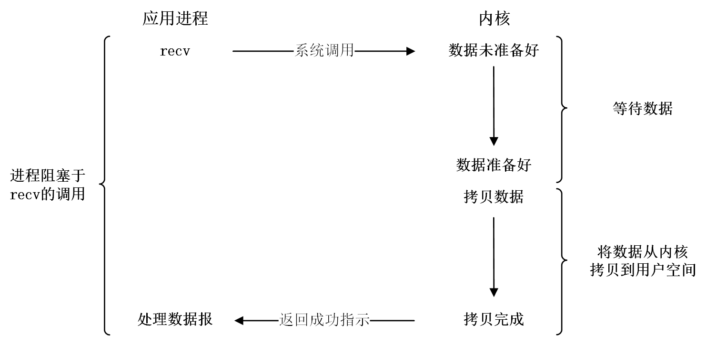

#### 非阻塞IO

> 等待子进程时，我们也使用过一次轮询检测退出的方案。思路和非阻塞IO是一致的。

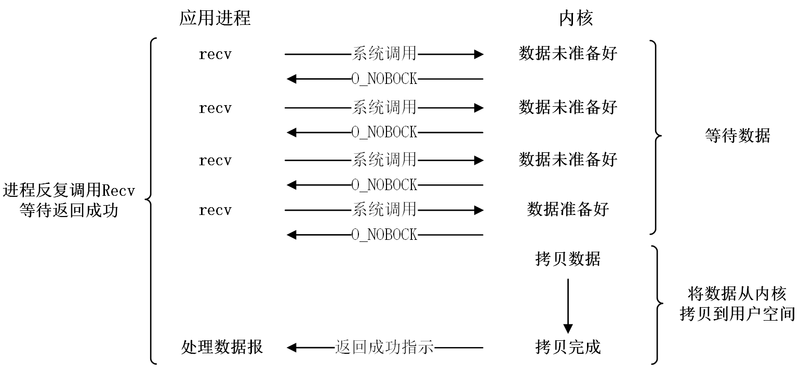

#### 信号驱动

当内核准备好数据时，使用SIGIO信号通知进程进行IO操作。可以说，信号驱动只使用了`recv`的拷贝功能。等待数据的过程是异步的，但拷贝数据是同步的，所以我们认为信号驱动也是同步IO。

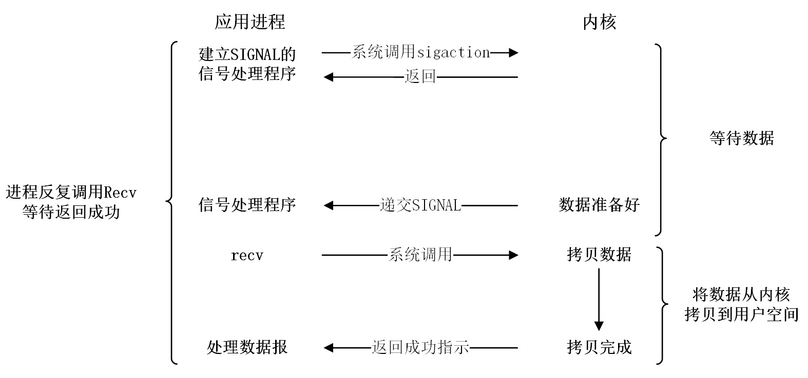

> 信号驱动的使用成本有点高，一般也不常用。

#### 多路转接

操作系统提供接口`select`,`poll`,`epoll`给程序提供等待功能，最高同时可等待几百个文件。将IO任务拆分，拷贝数据的任务仍由进程完成，等待数据的任务交给系统接口。

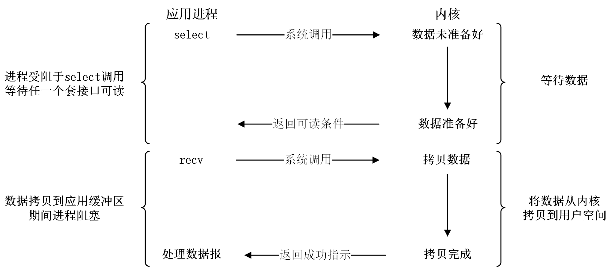

#### 异步通信

将缓冲区变量提供给异步接口，接口会等待并将数据放到缓冲区中，并通知进程。进程可以直接处理数据，并不会参与任何IO过程，所以是异步的。

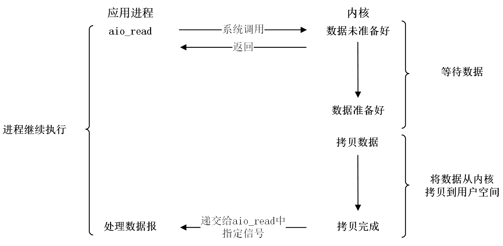

> 异步IO系统提供有一些对应的系统接口，但大多使用复杂，也不建议使用。异步IO也有更好的替代方案。

### 1.2 高级IO的概念

#### 同步IO和异步IO

同步和异步关注的是消息通信机制。

- 同步：没有得到结果就不返回，调用返回就是得到返回值。换句话说，就是由调用者主动等待调用的结果。
- 异步：调用发出之后就直接返回，所以没有返回结果。换句话说，当异步调用发出后，不会立刻得到结果，而是被调用者通过状态通知来调用者，或通过回调函数处理这个调用。

> 此外，多线程提到同步和互斥和这里的是完全不想干的概念。

#### 阻塞和非阻塞

阻塞和非阻塞关注的是程序在等待调用结果（消息、返回值）时的状态。

- 阻塞调用是指调用结果返回之前，当前线程会被挂起，调用线程只有在得到结果之后才会返回。

- 非阻塞调用指在不能立刻得到结果，该调用不会阻塞当前线程。

如果非阻塞调用没有获取到数据时，是以出错的形式返回的，但并不算真正的错误。**通过错误码errno区分出错和条件未就绪**。

##### fcntl接口

`fcntl`系统调用可以帮我们将读写设置为非阻塞状态。

```c
void SetNonBlock(int fd)
{
    int fl = fcntl(fd, F_GETFL);
    if (fl < 0) {
        perror("fcntl error\n");
        return;
    }
    fcntl(fd, F_SETFL, fl | O_NONBLOCK);
}
int main()
{
    SetNonBlock(0);
    char buffer[1024];
    while (1) {
        errno = 0;
        ssize_t s = read(0, buffer, sizeof(buffer) - 1);
        if (s > 0) {
            buffer[s] = 0;
            write(1, buffer, strlen(buffer));
            printf("read success, s: %ld, errno: %d\n", s, errno);
        }
        else {
            if (errno == EAGAIN || errno == EWOULDBLOCK) {
                printf("read failed, s: %ld, errno: %d\n", s, errno);
                // Try Again
            }
            else {
                printf("read error, s: %ld, errno: %d\n", s, errno);
            }
        }
        sleep(1);
    }
    return 0;
}
```

#### IO事件就绪

> 一旦等的事件就绪，我们就可以进行拷贝了。如何理解IO事件就绪呢？

IO事件就绪可以理解为两方面：一是读事件就绪，一是写事件就绪。可以认为接收缓冲区有数据就是读事件就绪，发送缓冲区里无数据就是写事件就绪。

但事实上，频繁读写系统内核中的发送接收缓冲区会进行状态切换，期间会进行一系列的处理工作，会带来效率的下降。

所以一般接收缓冲区中设有高水位，发送缓冲区中设有低水位的概念。

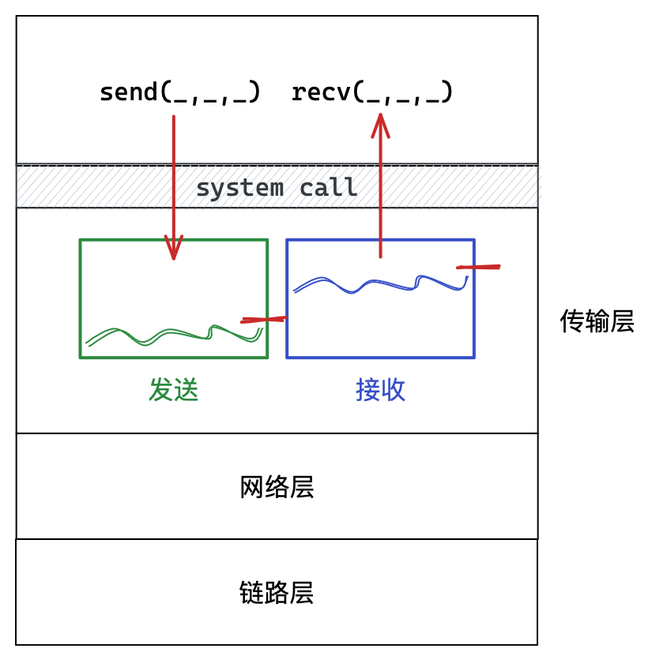

&nbsp;

## 2. 多路转接IO模型

> Linux下多路转接的方案常见的有三种：`select`、`poll`、`epoll`，select出现是最早的，使用也是最繁琐的。

### 2.1 select

#### select的接口介绍

`select`函数没有读写的功能，只负责IO当中等的环节，一旦条件就绪会通知上层进行读取和写入。

`read/write`,`send/recv`等IO接口本身也具有等待的功能，不过只能等1个文件条件就绪，`select`可以同时等多个fd。

```c
NAME
       select, FD_CLR, FD_ISSET, FD_SET, FD_ZERO
SYNOPSIS
       #include <sys/select.h>
       int select(int nfds, fd_set *readfds, fd_set *writefds, fd_set *exceptfds,
                  struct timeval *timeout);

	   // fd_set操作函数
       void FD_CLR  (int fd, fd_set *set); // 清除
       int  FD_ISSET(int fd, fd_set *set); // 检测
       void FD_SET  (int fd, fd_set *set); // 设置
       void FD_ZERO (        fd_set *set); // 置零
```

`fd_set`是一种位图结构，本质是从0开始的小整数。

| 参数      | 解释                                                         |
| --------- | ------------------------------------------------------------ |
| nfds      | 所有被等待的fd的最大值+1                                     |
| readfds   | 等待读事件就绪，表示等待结束可以读取                         |
| writefds  | 等待写事件就绪，表示等待结束可以写入                         |
| exceptfds | 等待异常事件就绪，如对端关闭，读写异常等                     |
| timeout   | `timeval`结构类型，设置等待时间，时间一到立马返回            |
| 返回值    | 大于0表示事件就绪的fd总数，为0表示超时并且没有任何事件就绪，-1表示出错 |

使用三个fd位图结构参数`readfds`、`writefds`、`execptfds`分别表示只关心读、写、异常的事件的就绪。

```c
#include <sys/time.h> 
struct timeval {
    long    tv_sec;         /* seconds */
    long    tv_usec;        /* microseconds */
};
```

#### select的核心功能

1. **用户告知内核，你要帮我关心指定的fd上的读写事件是否就绪**；
2. **内核告知用户，你所关心的指定的fd中那些fd上的读写事件已经就绪**。

##### fd_set

> 用户如何告知内核，指定的多个文件描述符呢？

`fd_set`是表示文件描述符的位图结构，本质是从0开始的小整数，就是用来指定多个文件的fd的。

- 位图相当于数据，下标表示文件描述符的编号；
- 位图每个比特位值为1或0，分别表示需要等待和不需等待。

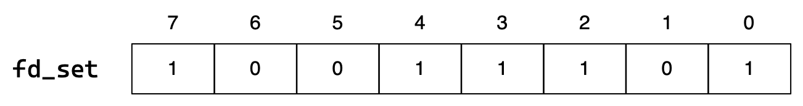

- `readfds`、`writefds`、`execptfds`这些参数是输入输出型参数：

1. 输入时，用户告诉内核，你要帮我关心的fd的集合；
2. 输出时，内核告诉用户，哪些fd的事件已经就绪，事件就绪的fd会被置1，其他被置0。

##### struct timeval

- `timeout`也是输入输出型参数，表示此次返回所剩余的等待时间。
- 为空表示阻塞等待，如果设置时间就表示指定时间内阻塞等待。

#### fd_set的操作接口

安全统一起见，系统会为我们提供文件描述符集的操作接口。

```c
// fd_set操作函数
void FD_CLR  (int fd, fd_set *set); // 清除
int  FD_ISSET(int fd, fd_set *set); // 检测
void FD_SET  (int fd, fd_set *set); // 设置
void FD_ZERO (        fd_set *set); // 置零
```

`fd_set`是个位图结构，只要是变量就一定有大小，说明`select`能等待的fd个数也是有限的。

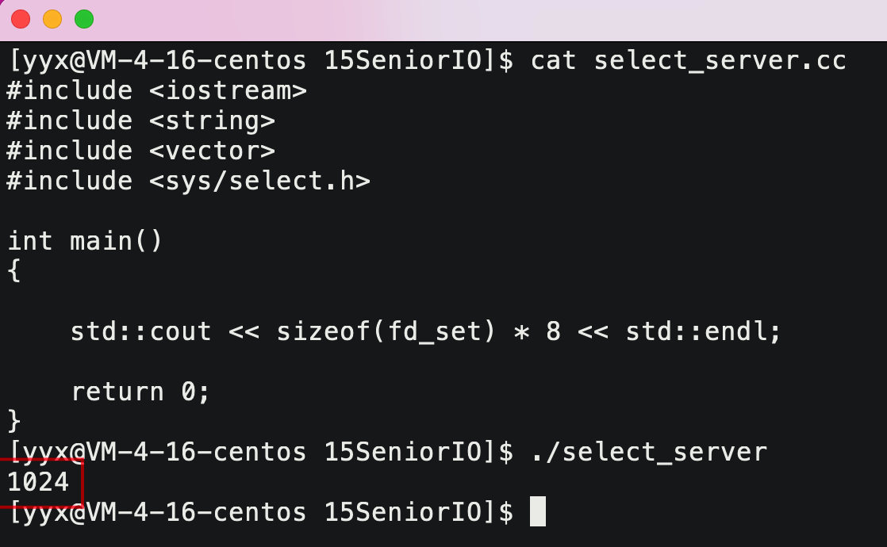

#### select的执行流程

1. 执行 fd_set set; FD_ZERO(&set); 则set用位表示是0000,0000；
2. 若 fd=5, 执行 FD_SET(fd, &set); 后set变为0001,0000；
3. 若再加入fd=2, fd=1，则set变为0001,0011；
4. 执行 select(6,&set,0,0,0); 进行阻塞等待；
5. 若 fd=1,fd=2 上都发生可读事件，则select返回，此时set变为 0000,0011，fd=5被清空。

> 位图被修改，下次该如何设置？

因为 select 用输入输出型参数表示不同的含义，意味着之后每一次调用都要对 fd_set 重新设置内容。用户必须将需要等待的fd用数组或其他容器保存起来。

```cpp
//select_server.cc
#include <iostream>
#include <string>
#include <vector>
#include <algorithm>
#include <unistd.h>
#include <sys/select.h>
#include <sys/types.h>
#include "Socket.hpp"

static void Usage(std::string proc) {
    std::cout << "Usage: \n\t" << proc << " port" << std::endl;
    exit(1);
}
std::vector<int> fd_v;
inline int GetMaxFd() {
    int max = 0;
    for (auto e : fd_v) {
        if (max < e) {
            max = e;
        }
    }
    return max;
}
int GetIndex(int key) {
    auto pos = std::find(fd_v.begin(), fd_v.end(), key);
    if (pos != fd_v.end()) {
        return pos - fd_v.begin();
    }
    else {
        return -1;
    }
}
// ./select_server 8080
int main(int argc, char* argv[])
{
    if (argc != 2) {
        Usage(argv[0]);
    }
    uint16_t port = atoi(argv[1]);

    int listen_sock = TcpSocket::Socket();
    TcpSocket::Bind(listen_sock, port);
    TcpSocket::Listen(listen_sock);
    //先交给select等待，事件就绪后才能accept

    fd_v.push_back(listen_sock);
    //事件循环
    for (;;)
    {
        fd_set read_fds;
        FD_ZERO(&read_fds); // 清空fd集
        for (auto e : fd_v) {
            if (e != -1) {
                FD_SET(e, &read_fds); // 数组内容设置进fd集
            }
        }
        struct timeval timeout = { 5, 0 };

        switch (select(GetMaxFd() + 1, &read_fds, nullptr, nullptr, nullptr))
        {
        case 0:
            std::cout << "select timeout" << std::endl;
            break;
        case -1:
            std::cerr << "select failed" << std::endl;
            break;
        default:
            std::cout << "select get fds readly" << std::endl;
            for (auto& fd : fd_v)
            {
                if (fd != -1) // 首先排除非法fd
                {
                    if (FD_ISSET(fd, &read_fds)) // 读事件就绪
                    {
                        std::cout << "sock: " << fd << " 读事件就绪" << std::endl;
                        if (fd == listen_sock) // 监听读事件就绪
                        {
                            int sock = TcpSocket::Accept(fd);
                            std::cout << "事件为建立新链接: " << sock << std::endl;
                            if (sock >= 0)
                            {
                                //push到数组中，以待交给select等待
                                int pos = 1;
                                for (; pos < fd_v.size(); pos++) { // 查找可用位置
                                    if (fd_v[pos] == -1) {
                                        break;
                                    }
                                }
                                if (pos < fd_v.size()) {
                                    fd_v[pos] = sock; // 提取连接到来不代表读事件就绪
                                }
                                else {
                                    fd_v.push_back(sock);
                                }
                                std::cout << "新连接被添加在数组位置[" << pos << "]" 
                                    << std::endl;
                            }
                            else {
                                close(fd);
                            }
                        }
                        else // 普通读事件就绪
                        {
                            std::cout << "事件为普通读取事件" << std::endl;
                            // 本次读取不会阻塞，但不能保证读取的可靠性，并且没有场景就没办法定制协议
                            std::string recv_buffer;
                            if (TcpSocket::Recv(fd, recv_buffer)) {
                                std::cout << "client [" << fd << "]# " 
                                    << recv_buffer << std::endl;
                            }
                            else {
                                std::cout << "sock: " << fd << "关闭连接，客户端退出，数组位置["
                                    << GetIndex(fd) << "]已被清理" << std::endl;
                                fd = -1; //数组位置为-1
                                close(fd);
                            }
                        }
                    }
                }
            }
            break;
        }
    }
    return 0;
}
```

#### select的优缺点

##### 优点

一次等待多个fd，使IO等待时间重叠，一定程度上提高IO效率。

##### 缺点

1. **每次调用前要重新设置fd集，调用后要遍历数组检测就绪fd**；
2. **fd_set结构导致select能够检测fd的个数有上限**；
3. **select内部实现是通过遍历修改fd_set结构的**；
4. **select可能需要高频地进行用户内核空间之间的相互拷贝**。

&nbsp;

### 2.2 poll

> poll 相比 select 是进步的表现，在使用和实现上都有一定的进步。不过我们重点仍是epoll，对于 poll 我们只会介绍一下接口，再把 select的代码改成 poll 的。

#### poll的接口介绍

```c
NAME
     poll – synchronous I/O multiplexing

SYNOPSIS
     #include <poll.h>
     int poll(struct pollfd* fds, nfds_t nfds, int timeout);
	 
	 // pollfd结构体
     struct pollfd {
         int    fd;       /* file descriptor */
         short  events;   /* events to look for */
         short  revents;  /* events returned */
     };
```

- `timeout`仍然是阻塞等待时间，作用和select一样，不过直接采用整数，单位是毫秒。
- `struct pollfd* `和`nfds_t`可以看成是数组起始地址和长度，数组中元素是fd和事件的组合结构体。

`struct pollfd`结构体中字段：

- fd表示事件所在的文件描述符
- events表示用户所要关心的事件，revents表示内核返回的就绪事件。

> 输入输出分离，就不用每次输入了。

events和revents的取值，有如下宏定义：

| 事件       | 描述                                                        |
| ---------- | ----------------------------------------------------------- |
| POLLIN     | 数据（包括普通数据和优先数据）可读                          |
| POLLRDNORM | 普通数据可读                                                |
| POLLRDBAND | 优先级带数据可读（Linux 不支持）                            |
| POLLPRI    | 高优先级数据可读，比如 TCP 带外数据                         |
| POLLOUT    | 数据（包括普通数据和优先数据）可写                          |
| POLLWRNORM | 普通数据可写                                                |
| POLLWRBAND | 优先级带数据可写                                            |
| POLLRDHUP  | TCP 连接被对方关闭，或者对方关闭了写操作，它由GNU引入       |
| POLLERR    | 错误                                                        |
| POLLHUP    | 挂起。比如管道的写端被关闭后，读端描述符将收到 POLLHUP 事件 |
| POLLNVAL   | 文件描述符没有打开                                          |

添加宏到变量可以使用或运算，检测特定的事件可以用与运算。

```c
events |= POLLIN;
events |= POLLIOUT;

if(revents & POLLIOUT) {
	//...
}
```

#### poll的使用介绍

```cpp
//poll_server.cc
#include <iostream>
#include <string>
#include <vector>
#include <algorithm>
#include <unistd.h>
#include <poll.h>
#include <sys/types.h>
#include "Socket.hpp"
#define NUM 128

static void Usage(std::string proc) {
    std::cout << "Usage: \n\t" << proc << " port" << std::endl;
    exit(1);
}
struct pollfd nfds[NUM];
int main(int argc, char* argv[])
{
    if (argc != 2) {
        Usage(argv[0]);
    }
    uint16_t port = atoi(argv[1]);
    int listen_sock = TcpSocket::Socket();
    TcpSocket::Bind(listen_sock, port);
    TcpSocket::Listen(listen_sock);

    nfds[0].fd = listen_sock;
    nfds[0].events = POLLIN;
    nfds[0].revents = 0;
    //事件循环
    for (;;) {
        switch (poll(nfds, NUM, -1)) {
        case 0:
            std::cout << "poll timeout" << std::endl;
            break;
        case -1:
            std::cerr << "poll failed" << std::endl;
            break;
        default:
            std::cout << "有事件就绪" << std::endl;
            for (int i = 0; i < NUM; i++) {
                if (nfds[i].fd != -1 && nfds[i].revents != 0)  {
                    if (nfds[i].fd == listen_sock) {
                        int sock = TcpSocket::Accept(nfds[i].fd);
                        std::cout << "事件为建立新链接: " << sock << std::endl;
                        if (sock >= 0) {
                            //push到数组中，以待交给select等待
                            int pos = 1;
                            for (; pos < NUM; pos++) { // 查找可用位置
                                if (nfds[pos].fd == -1) {
                                    break;
                                }
                            }
                            if (pos < NUM) {
                                nfds[pos].fd = sock; // 提取连接到来不代表读事件就绪
                                nfds[pos].events = POLLIN;
                                std::cout << "新连接被添加在数组位置[" 
                                    << pos << "]，并设置等待事件" << std::endl;
                            }
                            else {
                                close(nfds[i].fd);
                            }
                        }
                        else {
                            close(nfds[i].fd);
                        }
                    }
                    else { // 普通事件就绪
                        if (nfds[i].revents & POLLIN) {
                            std::cout << "事件为普通读取事件" << std::endl;
                            std::string recv_buffer;
                            if (TcpSocket::Recv(nfds[i].fd, recv_buffer)) {
                                std::cout << "client [" << nfds[i].fd << "]# " 
                                    << recv_buffer << std::endl;
                            }
                            else {
                                std::cout << "sock: " << nfds[i].fd
                                    << "关闭连接，客户端退出，数组位置["                                   
                                    << i << "]已被清理" << std::endl;
                                nfds[i].fd = -1; //数组位置为-1
                                nfds[i].events = 0;
                                close(nfds[i].fd);
                            }
                        }
                        else {
                            std::cout << "事件为普通写入事件" << std::endl;
                        }
                    }
                }
            }
            break;
        }
    }
    return 0;
}
```

监控标准输入的小程序

```cpp
#include <iostream>
#include <cstring>
#include <unistd.h>
#include <poll.h>
int main() {
    struct pollfd rfds;
    rfds.fd = 0;
    rfds.events = POLLIN;
    rfds.revents = 0;
    while (1) {
        int n = poll(&rfds, 1, 1000);
        if (n < 0) {
            std::cerr << "poll error" << std::endl;
        }
        else if (n == 0) {
            std::cout << "remote close" << std::endl;
        }
        else {
            if (rfds.revents & POLLIN) {
                char buffer[128];
                size_t s = read(0, buffer, sizeof(buffer));
                if (s > 0) {
                    buffer[s] = 0;
                    std::cout << "client# " << buffer << std::endl;
                }
                write(1, buffer, strlen(buffer));
            }
        }
    }
    return 0;
}
```

#### poll的优缺点

##### 优点

1. 改fd集为pollfd数组，理论上解决了监视fd的个数有上限的问题。
2. 将fd和事件集合到结构体中，使用更方便
3. 将事件输入输出分离，避免原始数据被修改，每次都要重新导入。

##### 缺点

1. 和select一样，poll返回后，仍要轮询pollfd数组检测就绪的事件
2. 每次调用都要将pollfd结构从内核空间拷贝到用户空间。

&nbsp;

### 2.3 epoll

> epoll才是使用和面试的重点。在效率和易用性方面都有提升。
>
> epoll和其他多路转接方案一样，都是只负责等。方式都是用户告知内核fd和事件，内核告诉用户，fd的事件就绪情况。

#### epoll的接口介绍

##### epoll_create

```c
#include <sys/epoll.h>
int epoll_create(int size);
```

- 自Linux内核版本2.6.8之后，size参数是默认忽略的，但为了向前兼容，大多写成128或256。
- 返回值是epoll句柄，对应创建一个epoll模型。

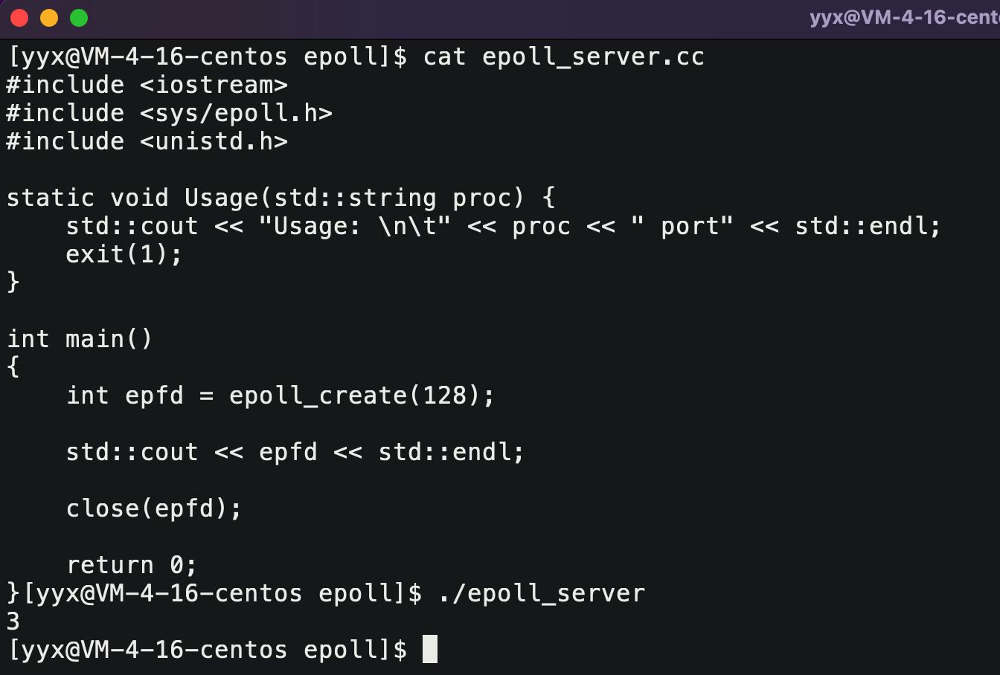

如图所示，epoll_create 返回值本质是个文件描述符，值为3。

> 这个返回值的具体内容会在epoll的工作原理处讲解。

##### epoll_ctl

```c
int epoll_ctl(int epfd, int op, int fd, struct epoll_event *event);
```

不管是哪种多路转接方案，都要进行的工作步骤是：用户告诉内核和内核告诉用户。而`epoll_ctl`负责的就是用户告诉内核的任务。

| 参数        | 解释                                                         |
| ----------- | ------------------------------------------------------------ |
| epfd        | epoll_create 接口的返回值                                    |
| op          | 用来指定对fd上的事件的操作，一共有三种：添加修改删除，如下所示 |
|             | `EPOLL_CTL_ADD`：注册新的fd到epfd中                          |
|             | `EPOLL_CTL_MOD`：修改已经注册的fd的监听事件                  |
|             | `EPOLL_CTL_DEL`：从epfd中删除一个fd                          |
| fd          | 用来指定关心的文件描述符                                     |
| epoll_event | 结构体，用来指定参数fd上对应的事件                           |

```c
       //event结构体
       typedef union epoll_data {
           void    *ptr;
           int      fd;
           uint32_t u32;
           uint64_t u64;
       } epoll_data_t;
   
       struct epoll_event {
           uint32_t     events;    /* Epoll events */
           epoll_data_t data;      /* User data variable */
       };
```

- epoll_event 中的`events`和poll一样都是用的是宏常量，具体内容如下所示：

| 宏           | 解释                                                 |
| ------------ | ---------------------------------------------------- |
| EPOLLIN      | 表示对应的文件描述符可以读（包括对端SOCKET正常关闭） |
| EPOLLOUT     | 表示对应的文件描述符可以写                           |
| EPOLLPRI     | 表示对应的文件描述符有紧急的数据可读（带外数据）     |
| EPOLLERR     | 表示对应的文件描述符发生错误                         |
| EPOLLHUP     | 表示对应的文件描述符被挂断                           |
| EPOLLET      | 将EPOLL设为边缘触发（Edge Triggered）模式            |
| EPOLLONESHOT | 只监听一次事件，本次之后自动将该fd删去               |

> epoll_data_t字段挺重要，但短期内不用，留到后面解释。

和 select 和 poll 不同，epoll_ctl 向内核提供用户所关心的fd和事件时只用提供一次，如果要删除或修改就再调用时修改下op。

##### epoll_wait

```c
int epoll_wait(int epfd, struct epoll_event *events, int maxevents, int timeout);
```

显然`epoll_wait`负责的就是内核告诉用户特定fd事件就绪的任务。

| 参数        | 解释                                               |
| ----------- | -------------------------------------------------- |
| epfd        | epoll_create的返回值，epoll模型                    |
| epoll_event | 输出缓冲区，存放内核通知的已就绪的哪些fd的哪些事件 |
| maxevents   | 缓冲区的长度                                       |
| timeout     | 等待的阻塞时间                                     |
| **返回值**  | 有事件就绪的fd的个数                               |

和 select 和 poll 不同，epoll_wait 不需要遍历第三方数组或容器来检测哪些fd的事件已经就绪，epoll_wait 会将其封装成 epoll_event 结构按顺序输出到缓冲区，具体个数就是返回值。

##### 使用示例

```cpp
#include <iostream>
#include <string>
#include <sys/epoll.h>
#include <unistd.h>
#include "Socket.hpp"
#define NUM 128

static void Usage(std::string proc) {
    std::cerr << "Usage: \n\t" << proc << " port" << std::endl;
    exit(1);
}

int main(int argc, char* argv[])
{
    if (argc != 2) {
        Usage(argv[0]);
    }
    uint16_t port = atoi(argv[1]);

    //1. 建立tcp socket
    int listen_sock = TcpSocket::Socket();
    TcpSocket::Bind(listen_sock, port);
    TcpSocket::Listen(listen_sock);

    //2. 创建epoll模型
    int epfd = epoll_create(128);

    //3. 添加listen_sock和事件到内核
    struct epoll_event ev;
    ev.events = EPOLLIN;
    ev.data.fd = listen_sock;
    epoll_ctl(epfd, EPOLL_CTL_ADD, listen_sock, &ev);

    //4. 事件循环
    struct epoll_event repevs[NUM];
    volatile bool quit = false;
    while (!quit) {
        int timeout = -1;
        //repevs就绪事件
        int n = epoll_wait(epfd, repevs, NUM, timeout);
        switch (n) {
        case -1:
            std::cerr << "poll failed" << std::endl;
            break;
        case 0:
            std::cout << "poll timeout" << std::endl;
            break;
        default:
            std::cout << "有事件就绪" << std::endl;
            //5. 处理就绪
            for (int i = 0; i < n; i++) {
                int fd = repevs[i].data.fd; // 暂时方案
                std::cout << "fd: " << fd << " 上有事件就绪啦" << std::endl;
                if (repevs[i].events & EPOLLIN) {
                    std::cout << "fd: " << fd << " 读事件就绪" << std::endl;
                    if (fd == listen_sock) { // 处理链接事件 
                        std::cout << "fd: " << fd << " 是链接读事件" << std::endl;
                        int sock = TcpSocket::Accept(listen_sock);
                        if (sock >= 0) {
                            std::cout << "fd: " << fd 
                                << " 链接获取成功 sock: " << sock << std::endl;
                            struct epoll_event _ev;
                            _ev.data.fd = sock;
                            _ev.events = EPOLLIN; // | EPOLLOUT | EPOLLERR
                            epoll_ctl(epfd, EPOLL_CTL_ADD, sock, &_ev);
                            std::cout << "sock: " << sock 
                                << " 交给epoll托管成功" << std::endl;
                        }
                        else {}
                    }
                    else { // 处理普通读取事件
                        std::cout << "fd: " << fd << " 普通读事件就绪" << std::endl;
                        std::string recv_buffer;
                        if (TcpSocket::Recv(fd, recv_buffer)) {
                            std::cout << "client[" << fd << 
                                "]# " << recv_buffer << std::endl;
                        }
                        else {
                            epoll_ctl(epfd, EPOLL_CTL_DEL, fd, nullptr);
                            close(fd);
                            std::cout << "fd: " << fd 
                                << " 出错已从epoll模型中移除" << std::endl;
                        }
                    }
                }
                else if (repevs[i].events & EPOLLOUT) // 处理写入事件
                {}
                else {}
            }
            break;
        }
    }
    close(epfd);
    close(listen_sock);
    return 0;
}
```

&nbsp;

#### epoll的工作原理

调用`epoll_create`一定是一个进程，而进程会有一个关联的文件描述符数组。

当我们创建一个 epoll 模型时，在模型中内核为我们维护一棵红黑树，**节点中存储是用户让内核关注的fd和相关事件**并携带其他的一些信息，例如：

```c
struct rb_tree_node {
	int fd;
    uint32_t events;
    struct rb_tree* left;
    struct rb_tree* right;
    enum color;
    //...
}
```

> 数据从硬件拷贝到内核，操作系统在将其拷贝到进行相关的各种缓冲区中，此时数据的事件才算就绪。操作系统会顺便遍历检测下其他fd下的的数据是否就绪是否需要拷贝，然后CPU将进程从等待队列中唤醒，操作系统在通知上层哪些fd的那些事件已经就绪了，select和poll是这样的策略。

epoll会更进一步，在用户向内核中注册fd和相关事件的时候，epoll 会触发底层相应的回调机制：维护一个就绪队列，队列节点中保存fd和就绪的事件。

在操作系统将数据拷贝到缓冲区中后，执行回调机制：**拿缓冲区内容和对应fd在就绪队列中新增一个节点**，然后再唤醒进程，epoll_wait 就会检测这个就绪队列，再向上层通知就绪情况。

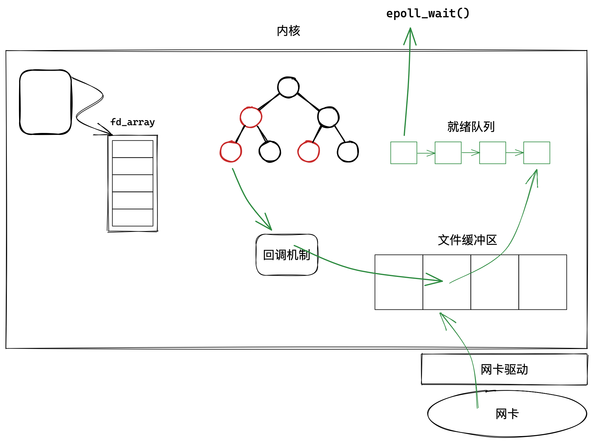

##### epoll_create的作用

创建epoll模型：也就是存储组注册fd及其事件的红黑树、底层缓冲区内有数据后内核触发的回调机制以及保存就绪fd及其事件的就绪队列。

> 红黑树、回调机制、就绪队列都是以文件的形式链接在进程相关文件结构中的，上层可直接用fd找到创建的 epoll 模型。

##### epoll_ctl的作用

1. 在红黑树中新增一个节点，增删改fd及其事件其实是对红黑树中的节点进行相应的增删改操作。
2. 建立该 fd 的回调策略，这个回调方法会将发生的事件添加到就绪队列中。

##### epoll_wait的作用

以O(1)的事件复杂度，检测是否有事件就绪。

检查是否有事件发生时，只需要检查队列是否有元素即可。如果队列不为空，则把就绪事件复制到用户态，同时将事件数量返回给用户。

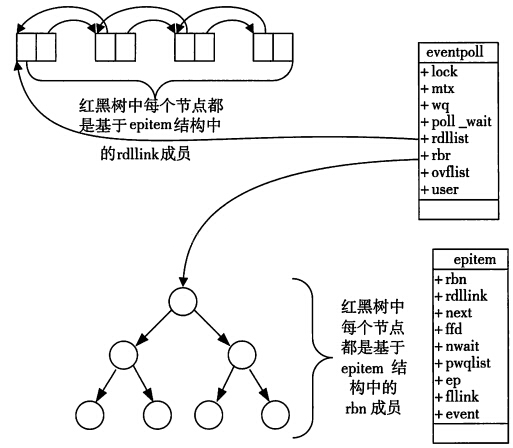

&nbsp;

#### epoll的优缺点

- 接口使用方便：接口分离解耦，更方便高效。不需要重新设置fd及事件集合，做到输入输出参数分离。
- 轻量数据拷贝：只在合适的时候调用 epoll_ctl 将文件描述符结构拷贝到内核中，这个操作并不频繁。
- 事件回调机制：避免使用遍历，将就绪的fd事件集合加入到就绪队列中，通过就绪队列获取就绪情况。
- 没有数量限制：文件描述符数目无上限。

&nbsp;

#### epoll的工作方式

epoll的工作方式有两种，分别是LT方式（水平触发）和ET方式（边缘触发）。这是epoll特有的模式概念，select和poll是没有的。

| 触发策略   | 对比解释                                                     |
| ---------- | ------------------------------------------------------------ |
| LT水平触发 | 底层只要有事件就绪，只要不被取走就一直通知上层               |
| ET边缘触发 | 底层只有当事件就绪的个数发生变化时，也就是从无到有或者个数增多，才会通知一次上层 |

> 水平触发像是一个尽职的快递员，只要你不去取就会一直在提醒你。边缘触发干活很随便，只为了完成任务通知一次，之后爱来不来爱取不取。

##### LT水平触发

> epoll 默认状态下就是 LT 工作模式。

当epoll_wait返回后，可以不立刻进行处理或者只处理就绪事件的一部分。**之后再调用epoll_wait仍会通知事件就绪，直到缓冲区的所有数据都被处理**。

##### ET边缘触发

在添加fd及事件时如果使用EPOLLET标志，表示epoll进入ET模式，**事件就绪时，必须立即将缓冲区内所有数据处理完毕，否则再调用epoll_wait的时候是不会通知该事件就绪的**。

可以说，**ET模式下事件就绪只有一次处理机会，所以必须采用非阻塞方式循环读写**。ET模式能减少epoll的触发次数，代价是倒逼程序一次响应就把所有数据处理完。

> 一般情况下，ET的性能比LT性能更高，因为其返回的次数少。如果LT模式下也能做到每次事件就绪都立刻处理，使其不被重复提示的话，性能也是一样的。

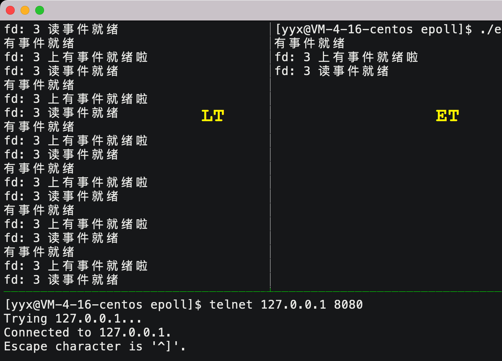
