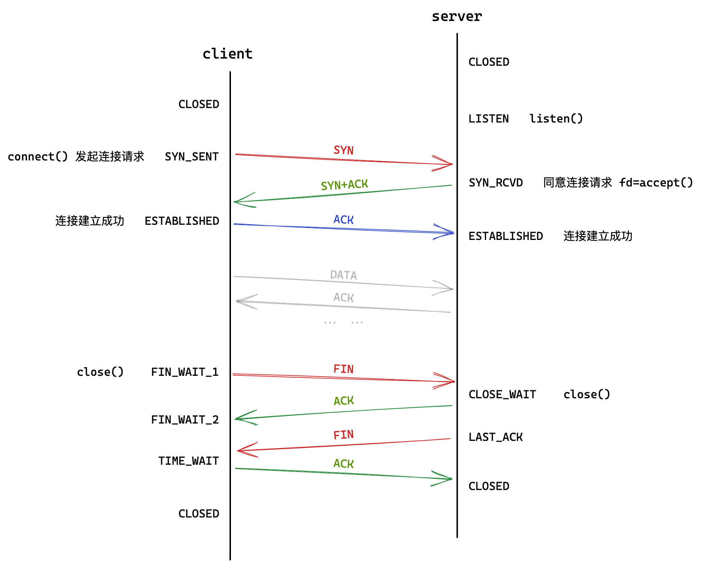
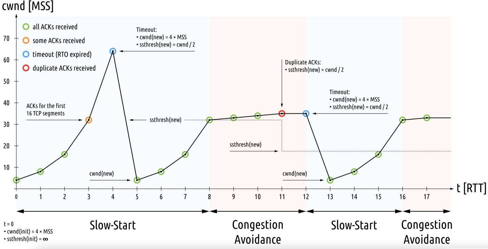

# 传输层TCP/UDP

## 0. 预备知识

### 端口号的理解

在TCP/IP协议中，用如下所示的五元组来标识一个通信程序：

| 组成             | 解释                                             |
| ---------------- | ------------------------------------------------ |
| 源IP，源端口     | 标识数据来源，来自互联网中的那台主机的那个进程   |
| 目的IP，目的端口 | 标识数据目的地，去往互联网中的那台主机的那个进程 |
| 协议号           | 通信使用的是哪一个协议，向上交付给哪一个协议     |

端口号标识一个主机上的进行网络通信的不同进程。一些知名的服务绑定的端口一般是固定不可变的，如下图所示：


虽然这些端口号和这些服务进程本没有硬性的绑定关系，但这些端口号和服务之间的关系就像是报警电话和“110”的关系，是早已被人们习惯和接受的，擅自更改可能导致服务无法被访问。

一般0-1023给广为人知的应用层协议使用，而我们部署自身服务时，绑定1024-65536的端口即可。

```shell
cat /etc/services   # 查看知名端口
```

> - 一个进程是否可以绑定多个端口号？
>
> 进程可以绑定多个端口号，FTP协议就支持绑定多个端口号。
>
> - 一个端口号是否可以绑定多个进程？
>
> 当然不行，端口号就是用来唯一地标识一个进程。进程和端口号的关系就类似于多叉树。


### netstat

```shell 
netstat -nltp #  查看网络进程的状态
```

| 选项          | 解释                                     |
| ------------- | ---------------------------------------- |
| `n[number]`   | 将主机名:程序名显示成IP地址:端口号的形式 |
| `l[isten]`    | 只显示正在监听状态的套接字               |
| `t[cp]/u[dp]` | 只显示TCP或UDP协议通信的进程             |
| `p[rocess]`   | 最后多显示一列客户端程序的PID和进程名    |


```shell
pidof 程序名称 #   方便快速获得进程的pid，能够快速控制服务起停

$ pidof mysqld
936
```

&nbsp;

> 接下来要讲的就是传输层的UDP和TCP协议。

如下图所示，传输层协议在系统内核中之上是系统调用，再之上是具体的应用层协议。说明UDP/TCP协议是对上提供接口的协议。


不管是哪一层协议都需要思考两个问题：

1. 如何封装解包？
2. 如何分用，向上交付？

## 1. UDP协议

### 1.1 UDP协议段格式


```c
//示例
struct udp_hdr {
    uint32_t src_port : 16;
    uint32_t dst_port : 16;
    uint32_t total : 16;
    uint32_t check : 16;
}
```

- 16位源端口号和目的端口号，指明报文是从哪一个程序来又到哪一个程序去。
- 16位UDP长度，指明整个报文即报头加有效载荷的长度。

封装和解包只需要从头添加或截取一个定长的8字节报头即可，剩下的就是有效载荷。分用也是根据目的端口进行区分交付给哪个进程。

### 1.2 UDP的特点

- 无连接：只根据对端IP和端口就直接进行传输，不需要建立连接。
- 不可靠：没用确认、重传机制，UDP协议不会返给上层任何数据丢失或接收成功的信息。
- 面向数据报：不能灵活地控制写入获取报文中数据的次数和数量，即接收数据时只能按报文的大小一次性将报文全部收取上来。

> 发送端假如一次调用sendto发送了100个字节，接收端也必须一次性recvfrom将100个字节全部提取出来。这就是面向数据报。 

- 除此之外，UDP报头中用16位UDP长度来表示整个报头的长度，故UDP最大只有65536个字节即64KB。如果非要使用UDP发送超过64KB长度的数据段，只能拆包发送，并且对端按序号再将数据段整合到一起。

### 1.3 UDP缓冲区

网络套接字收发接口`read/write/recv/send`，虽名为收发函数，但实质为拷贝函数。这些接口**并不是将数据直接发送到网络中，而是将数据从应用层拷贝到传输层的收发缓冲区中**。


拷贝完成之后，这些网络接口的工作就完成了。具体该数据<u>什么时候发，一次发多少，发送失败怎么办</u>，完全由OS内核中的传输层控制。这就是传输层的任务，提供传输数据的策略。

传输层中UDP协议几乎没有策略，有数据就进行发送，没有策略就是该协议的策略。

- UDP协议没有发送缓冲区，调用`sendto`数据就会直接交给内核，有内核将数据传给下层协议并进行之后的传输工作。
- UDP协议有接收缓冲区，接收到的数据存放在接收缓冲区中，以待上层调用接收函数。但该接收缓冲区不能保证数据段的接收顺序和发送顺序一致。如果缓冲区满了，再到达的数据就会直接抛弃。
- UDP协议是能够全双工的，**全双工就是双方的收发互不影响，可以同时进行收发，同时调用收发函数**。半双工就是双方不能同时进行收发，一方在发对方就不能发只能收，反之同理。

### 基于UDP的应用层协议

- NFS：网络文件系统
- TFTP：简单文件传输协议
- DHCP：动态主机配置协议
- BOOTP：启动协议(用于无盘设备启动)
- DNS：域名解析协议

&nbsp;

## 2. TCP协议

完成一件事可以分为两个步骤：决策和执行。类比到网络协议栈中就是**传输层做具体决策，网络层和数据链路层做具体执行**。

也就是说，传输层是”做决策“的，比如什么超时重传，确认应答，流量控制，拥塞控制都是TCP协议的传输策略。

### 2.1 TCP协议段格式


#### 4位首部长度

- 4位首部长度表示的是报头的长度，占据4个比特位则最大值为15，但它的单位是4字节。也就是说 TCP 报头最大长度为60字节。
- TCP报头标准长度是20个字节，也就是不带选项和数据的最小报头长度。

> TCP协议是如何做到封装解包和向上交付的呢？
>
> 解析报头的4位首部长度即可获取报头的具体长度，就能截取下来了。16位目的端口，也是用来确认向上交付的目标进程的。

#### 序号和确认序号

##### 如何保证可靠性

TCP协议如何保证数据传输的可靠性呢？理解TCP的可靠性，其**最核心的机制应为其基于序号的确认应答机制**。

通信一方是无法确定发出去的消息是否被对方接收的，**只有一方接收到对方返回的确认消息时**，才能确定刚刚发送的消息对方接收到了。


这条响应的消息就称为确认应答，**确认应答的意义在于让确定刚刚发送的消息对端100%收到了**。就这样一来一回，就能保证上一条消息一定被对端收到，就保证了通信的可靠性。


但令人尴尬的是，应答只能保证上一条消息被对方100%收到，**总会存在最后一条消息不会被应答，所以TCP并不是100%可靠的**。

##### 确认应答的工作方式

> 如何进理解确认应答呢？

- 客户端向服务器发送数据，服务器会返还一个应答，这样就保证了客户端到服务器单向通信的可靠性。
- 反过来客户端给服务器应答，也可以保证服务器到客户端可靠性。


如果收到应答就说明上一条消息对方收到了，如果没收到应答就认为上一条消息对方没收到。**这样就能保证通信双方向的可靠性**。

##### 报文的顺序性

如果客户端向服务器发送一批报文，服务端收到的报文的顺序不一定和客户端发送的顺序相同。**乱序的数据是存在问题的，可靠性的含义除了保证被对方收到，也要保证按序到达**。

> 如何保证报文的顺序呢？这就需要发送端给报文编上号，也就是32位序号的作用。

- **报文中的32位序号字段就是报文的序号**，接收端在收到一批报文时可以将报文按序排好再交付上层使用。

但同时接受端需要给发送端的报文以确认，所以确认报文也必须带有序号。**报文中的32位确认序号字段就表明了该报文是对指定序号的报文作确认**。


- **确认报文的确认序号填充的是被确认的报文的序号值+1**，客户端收到确认报文后，可以通过确认序号来辨别是哪个报文的确认。

- **确认序号可以表明确认序号值之前的所有报文都已收到**，可以防止之前的确认报文丢失对方没收到。所以确认序号可以理解为对历史所有报文的应答。
- **确认序号可以认为是接收端期待将要收到的数据的编号**，这个理解对之后重传机制的理解很有帮助。

> 为什么一个报文中既有序号又有确认序号？为什么是独立的？

报文中既有序号又有确认序号，是因为TCP是一个全双工的协议，**一个报文既可以向对端发送数据又可以作为应答响应对方的报文**。

> 无论是发送的消息还是确认的消息，都必须是一个完整的TCP报文。而不可能是一个数字或者其他什么，图中每一个箭头都是一个完整的报文，只是为了突出重点，才简化其他内容。

##### 底层实现细节

> 序号的机制看似有些奇怪但其实不然：

可以把TCP发送缓冲区看成一个巨大的`char`类型的数组，而上层拷贝数据进来是按字节存放的。

- 我们以要发送的一批数据的最后一个字符的下标作为本次发送报文的序号；
- 对端应答报文中的确认序号正好就是下一次发送数据的起始位置，故下一次直接从该确认序号位置起发送即可。


#### 16位窗口大小


TCP协议是存在发送和接收缓冲区，可以理解为TCP自身动态开辟的一段内存。对应的收发函数`send/recv`本质上也是拷贝函数，是将数据在进程和缓冲区之间拷贝。

- 缓冲区能够**提高效率**，如果不存在缓冲区，直接把数据发送到对端主机上，就像调用`printf`直接将数据打印到显示器上，直接把数据写到磁盘文件中，。
- 缓冲区将**应用层和底层作一定的解耦**，应用层收发函数和缓冲区交互后就可以返回了，对端的网络状态、发送和接收的方式时机、错误处理等相关的细节问题交给底层管理。

如何发、何时发、发多少、出错处理等细节问题都属于传输控制相关的策略，都由传输层协议管理，所以TCP叫做传输控制协议。

> 窗口大小可以理解为本机用来接收对方数据的“窗口”的大小。

如果对方大量发送数据，导致我们的接收缓冲区已所剩无几甚至满了。没有能力接受数据，那再发的数据就会被丢掉，如果不对发送方提示自身的数据接受能力，任由对方发送的话，就会造成资源浪费。

**这种因大量发送，导致对方无法接收，进而导致数据丢弃资源浪费的现象，叫做没有做流量控制而导致对方丢包的问题**。

TCP报文中的**16位窗口大小字段就是用来表示自身接受缓冲区的剩余空间**。接收端在应答报文中填充自己的接收容量，相当于通告对方自身的接受能力，对端就可以动态调整自己的发送策略，这就是流量控制。

#### 6个标志位

> 一个大型服务端程序，可能在任意时刻都有可能存在成百上千个客户端发来的报文，服务端就必须首先要区分各个报文的类别。

**TCP报头中的标志位就是用于表明报头的类别的**，比如`SYN`就是请求连接的报文，`FIN`就是断开链接的报文。表明自身报文的类别只需将标志位的比特位置1即可。

| 标志位 | 含义              | 解释                                                         |
| ------ | ----------------- | ------------------------------------------------------------ |
| `ACK`  | `acknowledge`确认 | 表明自身是个确认报文，并填充确认序号就可以。为了捎带应答，大部分报文的ACK都会设置 |
| `SYN`  | `synchronize`同步 | 表明自身是个请求连接的报文，此时就会进行三次握手             |
| `RST`  | `reset`重置       | 表明自身是个重置连接的报文，此时通信双方会重新建立连接       |
| `PSH`  | `push`提交        | 若接收端读取过慢导致窗口大小吃紧，发送方就可在报文中携带PSH，催促对端尽快将缓冲区内容提交至应用层 |
| `URG`  | `urgent`紧急      | 表示报文内紧急指针有效，紧急指针指向数据中某一处，提示对端优先读取该处数据，该功能不常见 |
| `FIN`  | `finish`结束      | 表明自身是个结束连接的报文，提示对端开始关闭连接             |

##### 三次握手

TCP协议是面向连接的，通信双方连接的时候一方需要`connect`一方需要`accept`，建立连接的背后会进行三次握手。三次握手实际上就是三次交换报文。


1. 客户端向服务端发送携带SYN标志位的报文，表示请求建立连接。
2. 服务端收到请求后，返回携带SYN和ACK标志位的报文，表示请求建立连接并作客户端消息的应答。
3. 客户端收到服务端返回建立连接的报文后，发送携带ACK标志位的报文作应答。

这就是三次握手的过程，其中最后一次握手是没有应答的，所以**三次握手是可能失败的，三次握手只是用较大概率建立连接成功的一种方式**。

> 系统内核如何管理链接呢？

既然服务器存在大量的连接，服务器一定要管理这些连接，管理方式仍然是先描述再组织。也就是将结构体描述连接，并使用数据结构维护这些连接结构体，这也是有时间空间层面的成本。

如果正巧第三次握手报文丢包了，服务端并没有建立连接，但如果客户端已经将数据发来了，服务器就会向其响应回携带RST的报文，以重置连接。

> 如果建立连接失败？

客户端发送第三次握手报文后，就认为连接已经建立好了。服务端收到第三次握手报文后，才认为连接已经建立好。

##### 四次挥手

一般而言，建立连接的是客户端，但断开链接通信的双方随时都有可能。


1. 一方向对端发送携带FIN标志位的报文，用来向对端表明自身准备断开链接；
2. 对端回应一方以携带ACK标志位的报文，表示确认应答。

上面只是两次挥手，另一方再重复上述动作就是四次挥手。

&nbsp;

### 2.2 TCP的特点

#### 超时重传机制

超时重传机制很好理解，数据已经发出去了，在一定时间间隔内如果没有收到对端的响应报文，就认为对端没有收到数据，只能再次发送。


以上两种情况：一是数据丢了二是应答丢了，发送端都认为对端没有收到数据，都会触发超时重传机制。

> 重发后接受端收到重复数据怎么办？

超时重传的数据报文的序号和被补发的数据报文的序号保持一致，接收端即使收到了重复数据也可以通过序号来去重。

> 所谓的特定的时间间隔是多长呢？

网络状况、传输效率是变化的，发送数据到接收到ACK的时间当然也是浮动的。所以**超时重传时间一定是浮动的，设置为任何固定的数字可能都是不合适的**。

如果超时时间设置的太长影响整体的重传效率，太短会导致频繁发送重复数据浪费资源。

最理想的情况是找到一个最小时间，保证“确认应答一定能在这个时间内放回”。一般，超时以500ms为一个单位进行控制，每次判定超时重传的时间都是500ms的整数倍。

- 第一次的超时时间为 500ms；
- 如果还得不到应答，第二次超时时间为 2 * 500ms；
- 如果还得不到应答，第三次超时时间为 4 * 500ms ……

以此类推，以指数形式递增，公式为 $T(x)= 500·2^{x-1}$ 。超过一定次数，TCP协议认定对端主机出现异常强制关闭连接。

#### 连接管理机制

一般TCP通信需要三次握手建立连接，不用时四次挥手关闭连接。

第一次谈时我们谈的是套接字编程，第二次谈我们谈的是TCP协议报文内容，现在是第三次，谈的是特定时刻是通信双方的状态。

> 这些状态也就是填充在连接结构体的状态字段的数据。



##### 三次握手的意义

- 三次握手可以互相确认对方的状态、网络的状态是否良好。
- **三次握手是验证全双工即验证通信双方是否具有收发能力的最小次数**。

> 客户端收到第二次握手时就验证自身具有收发能力，服务端接收到第三次握手时就验证自身的收发能力。

少于三次无法验证全双工，大于三次浪费资源。

- **少于三次握手就建立连接，双端连接资源消耗不对等，容易造成SYN洪水攻击**。

> 如果三次握手成功才建立连接的话，服务器第三次握手前只占用少量资源，三次握手后对端和服务器承受等量资源，对端还会暴露自身IP。

相较之下，三次握手更加安全省事。

##### 三次握手的状态变化

| 顺序 | 解释                                                   | 状态变化                |
| ---- | ------------------------------------------------------ | ----------------------- |
| 1    | 服务端调用`listen`，进入监听状态等待客户端连接         | CLOSED -> LISTEN        |
| 2    | 客户端调用`connect`，发送同步请求报文                  | CLOSED -> SYN_SENT      |
| 3    | 监听到同步请求后，就创建连接，并向对端发送同步响应报文 | LISTEN -> SYN_REVD      |
| 4    | 客户端收到服务器同步响应后，就立即认为连接成功         | SYN_SENT -> ESTABLISHED |
| 5    | 服务端收到客户端第三次握手应答报文后，才认为连接成功   | SYN_REVD -> ESTABLISHED |

如下图所示，listen后就已经能够建立连接了，accept只是将内核中的连接提取到应用层。


##### 四次挥手的意义

断开连接的本质：双方达成断开连接的共识。**四次挥手是达成连接关闭的一致认识的最小次数，也就是说，四次挥手就是个通知对方的机制，更强调功能性**，而不像握手强调安全性。

> 当然，如果如果对端也想顺手关闭连接，四次挥手就可以变成三次挥手，也就是第二次和第三次结合起来，可以灵活一些，没有那么死板。

##### 四次挥手的状态变化

| 顺序 | 解释                                        | 状态变化                   |
| ---- | ------------------------------------------- | -------------------------- |
| 1    | 客户端主动调用`close`，向服务器发送结束报文 | ESTABLISHED ->  FIN_WAIT_1 |
| 2    | 服务器收到结束报文，向客户端返回应答报文    | ESTABLISHED -> CLOSE_WAIT  |
| 3    | 客户端收到应答报文                          | FIN_WAIT_1 -> FIN_WAIT_2   |
| 4    | 服务端调用`close`，向客户端发送结束报文     | CLOSE_WAIT -> LAST_ACK     |
| 5    | 客户端收到结束报文                          | FIN_WAIT_2 -> TIME_WAIT    |
| 6    | 客户端向服务端返回应答报文                  | TIME_WAIT -> CLOSED        |
| 7    | 服务端收到应答报文                          | LAST_ACK -> CLOSED         |

##### 理解TIME_WAIT状态

- 主动断开链接的一方，四次挥手完成后会进入`TIME_WAIT`的状态，此时连接并没有被完全释放。

**应用层连接已经结束，传输层还保留该连接**，因为无法保证对端是否收到第四次挥手。 所以进程退出后，无法重新绑定该端口。

一个报文从一端传输到另一端最大需要花费的时间，也就是报文在网络中最大的存活时间被称为最大生存时间 MSL(max segment life)，该时间实际上是变化的。

- TIME_WAIT状态的持续时间一般是$2MSL$，防止网络中仍有未接收的历史数据，或者ACK丢包对端没收到，等待对端之后超时重传FIN。


在创建套接字代码处使用接口`setsockopt`，可以解决上述情况。

```c
int opt = 1;
setsockopt(sock, SOL_SOCKET, SO_REUSEADDR, &opt, sizeof(opt));
```

> 如果无法立即重启服务，可能会造成经济损失。

##### 理解CLOSE_WAIT状态

对端主动调用`close`退出连接，但自己不退出，则后两次挥手就不会发生，自身就一直保持CLOSE_WAIT状态。

> 此时客户端也因收不到挥手而处于FIN_WAIT_2状态，但过一段时间也就强制关闭了。


所以，**文件描述符使用结束一定要记得释放，不然会造成fd泄漏**，一直占用服务器资源危害很大。

&nbsp;

#### 滑动窗口

> 实际上报文发送并不是一一串行的效率太低，而是一次发送一批数据，应答也是一次应答一批，让传输等待时间重叠。那一批是多少呢？

滑动窗口可以类比报头中的窗口大小，但16位窗口大小描述的是接收缓冲区的剩余空间，滑动窗口可以形象地理解成套在发送缓冲区上的一个窗口。

- 该窗口的大小就是发送一批报文的数量，准确的说是无需等待确认应答而可以继续发送数据的最大值。
- 这个窗口从头开始不断的向后运动，只有窗口上的数据才会被发送；
- 窗口前面的数据都是被发送过的，窗口后的数据是未被发送的，也可能暂时就没有数据。
- 窗口的大小也是不固定的，可以根据对方的接收能力动态调整。


##### 实现细节

既然缓冲区可以看成一个char类型的数组，而滑动窗口本质就是两个下标表示窗口的边界。

当我们收到确认报文时，让窗口左下标向右移动至确认序号的位置，下次就可以直接发送该位置的数据，让右下标向后移动报文中的16位窗口大小的长度，保证发送量在对端的可接受范围内。


> 当然不必担心越界的问题，缓冲区可以是环形队列，我们把缓冲区画成线性的只是为了好理解。滑动窗口算法不止可以运用在此处。

##### 丢包情况讨论

1. 数据已到达，但发送端没有收到应答报文


> 由此可以看出，TCP应答报文是一一对应的，有多少报文就有多少应答。

**确认序号的含义是对端已经收到了序号为该确认序号之前的所有报文**。所以只要最后一个确认报文被收到，那么之前面的确认报文没有收到也无所谓。如果后面的确认报文没有被收到，那就超时重传即可。

只有收到ACK确认报文后，滑动窗口的左边框才会右移，所以如果没有收到ACK，数据还会保存在滑动窗口中。

2. 接收端没有收到数据段


如果数据段没有收到，那么自然没有该序号的确认报文。**那么之后收到的数据，其确认报文的确认序号都是最后一个收到的报文的确认序号**。

**如果发送端收到三次以上的具有重复确认序号的报文，就认为该序号的报文已丢失需要重传，会立即补发对应序号的报文，这就是快重传机制**。

发送端重传之后再根据对返回的确认序号来发送下一次将要发送的报文。

> 快重传和超时重传有什么区别？

快重传和超时重传的触发条件不同，超时重传的条件是超出特定时间后未收到应答，快重传是收到三次以上重复确认序号的应答。

超时重传相当于是保底的维护可靠性措施，快重传是提高效率的，二者并不矛盾且是同时存在的。

&nbsp;

#### 流量控制

接收端处理数据的速度有限，如果发的太快导致接收端缓冲区打满，此时如果发送端继续发送就会造成丢包，继而引起丢包重传等等一系列连锁反应。

因此TCP支持根据接收端的处理能力，来决定发送端的发送速度，这个机制就叫做流量控制（Flow Control）。

- 接收端将自己可以接收的缓冲区大小放入TCP首部中的“窗口大小”字段，通过ACK端通知发送端；
- 窗口大小字段越大，说明网络的吞吐量越高；

> 如果窗口大小为0怎么办？

如果接收端缓冲区满了，就会将窗口置为0。

1. 如果接受方窗口恢复，会向发送端发送窗口更新通知。
2. 发送方此时不再发送数据，但是如果超时重传时间过了还没有收到窗口更新通知，就定期发送一个窗口探测包，使接收端把窗口大小告诉发送端。


> 何时协商窗口大小？

三次握手的时候不携带任何数据，可以顺手携带一下窗口大小，通过此来设置各自滑动窗口初始值。只要报文没有有效载荷，就不会占用接收缓冲区，因为报头被TCP协议吸收，不提交至上层。

&nbsp;

#### 拥塞控制

> 前面的超时重传、连接管理和流量控制等机制都只是考虑通信双方两台主机的事情。而拥塞控制考虑的是整个网络和网络中的所有主机的事情。

如果通信时偶有丢包那是正常的，超时重传和快重传机制可以解决问题。但如果丢包太多，可能就不是通信双方的问题而是网络的问题，可能是当前网络状态比较拥堵，在不清楚当前网络状态的情况下，大量主机贸然发送大量的数据很有可能引起网络瘫痪。


发现网络拥堵，尝试恢复网络状态的机制就是拥塞控制。TCP协议中引入**慢启动**机制，先发送少量的数据用来探路，摸清当前网络的状态， 让网络缓一缓修复自身的问题。

> 所有大量丢包的主机都采用慢启动机制，就能够让其所在区域的网络状态好转。如下图所示，先少量发探探路，再逐渐大量起来：


> 如何描述衡量当前网络的拥塞状态呢？此处引入一个概念为拥塞窗口。

拥塞窗口可以形象化理解为是一盏天窗，拥塞窗口的值也是用来限制发送数据量大小的，最初天窗放在地上，只要不丢包就一直扶摇直上，一旦丢包就坠落在地。

**发送数据段时，将拥塞窗口和接收端的窗口大小做比较，取二者小值作为滑动窗口的大小。**

> 接收端窗口考虑的对端主机，拥塞窗口考虑的是网络状态。

**慢启动指的是初始时慢后期快，既可以在前期探测网络又可以在后期加大传输力度**。但如果单纯的加倍，很快拥塞窗口就会失去意义，因此引入慢启动的阈值。

- 最初拥塞窗口大小为1，随着传输次数加大，窗口值呈指数级增长。（$2^n$）
- 拥塞窗口增长到慢启动阈值时，由指数级转变为线性增长。（$+1$）



- 一旦发生超时重传，立即重新开始慢启动，窗口值就会降至初始值1。同时探测到当前拥塞窗口最大值。
- 重新调整慢启动阈值变成上一次的最大拥塞窗口大小的一半。 

&nbsp;

#### 延迟应答

如果接收端接收数据后立即确认应答，上层可能还未及时将读取缓冲区，所以此时应答报文中的窗口大小可能比较小。如果稍等一下，可能应用层直接清空了缓冲区，此时的窗口大小就会更大。

**延迟应答就是让接收端等待特定的时间比如200ms后在发送应答报文，单纯地为了提升效率**。延迟应答也不是一定使用，一定是建立在用户层积极读取缓冲区的前提下。

延迟应答的策略有，数量限制：每个N个包应答一次，时间限制：超过最大延迟时间就应答一次。

#### 捎带应答

实际上一般不会有单独的ACK应答报文，都是**在向对方发送数据的同时，对对方的上一条报文作应答**。比如三次握手的第二次握手就是将SYN和ACK结合起来发。

&nbsp;

#### 面向字节流

操作系统会针对TCP套接字文件单独在内核中创建发送和接收缓冲区。不管是`send`还是`recv`都是在和缓冲区交互数据。

缓冲区中的数据都是当作字节流像流水一样看待，TCP协议发送数据时也是任意截取可能分成多个报文发送，读取也一样。

#### 粘包问题

所谓粘包，就是数据段与包之间没有分隔，读取数据的时候可能会少读或者多读，存在数据和前后的包粘在一起。

对比UDP数据报格式，必须以一个完整的报文为单位进行读写，UDP报头中就含有整个报文长度的字段，所以不存在粘包问题。

而TCP是没有数据长度的相关属性的，必须在应用层设定协议并在解析报文的时候进行获取，才能避免粘包问题。

> 比如我们在学习HTTP协议时，直接粗暴读取固定大小的内容是不正确的，必须先解析属性`Content-Length`内容，才能准确读取HTTP正文。

#### TCP异常情况

进程终止：进程终止会自动释放文件描述符，虽然应用层进程没了但不影响传输层自行四次挥手，和正常关闭没有区别。

机器重启：重启之前会先关闭进程，所以和进程终止的情况相同。

网线断开：接收端认为连接还在，一旦接收端会发现连接已经不在就会进行reset。即使没有写入操作，TCP自己也内置了一个保活定时器，会定期询问对方是否还在，如果对方不在，也会把连接释放。

另外，应用层的某些协议，也有一些这样的检测机制，例如HTTP长连接中，也会定期检测对方的状态。

&nbsp;

#### listen第二个参数

```c
int listen(int sockfd, int backlog);
```

Listen的第二个参数`backlog`，用来指定TCP建立正常连接的个数为backlog+1。不是服务器能维护的连接个数，而是**连接建立好但没有被上层`accept`提取的连接的最大个数**。

- 连接没有完全建立好，也就是三次握手没有完成的连接，叫做半连接，保存在内核中的半连接队列；
- 连接建立好但没有被上层提取的连接叫做全连接，保存在内核中的全连接队列。

也就是说，**listen第二个参数影响的是全连接的个数，也就是全连接队列的长度**。

> 如果设定backlog值为1，那么只能有两个链接是正常的`ESTABLISHED`，除此之外都是`SYN_RECV`状态。


> 半连接队列的长度有操作系统自行有一套控制算法，不同系统实现不同。可有效预防SYN攻击导致正常客户无法建立连接。

##### 全连接队列

> 为什么要维护全连接队列？

就像是商场中的餐饮饭馆，馆内没有空桌的话，再来的客人就要坐在门口的等待区，待馆内出现空桌后排队进入其中消费，这样能最大化利用桌子这个资源，不会浪费出现空闲的情况。

等待区就是全连接队列，**有了等待队列就能最大化利用系统的连接资源**，不会出现空闲浪费的情况。

> 为什么这个队列不能太长？

队列总归是有长度的，如果队列太长，一是维护成本变高，二是连接的等待时间变长。与其加长队列，不如加大系统资源。
