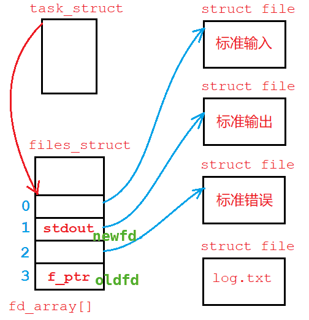
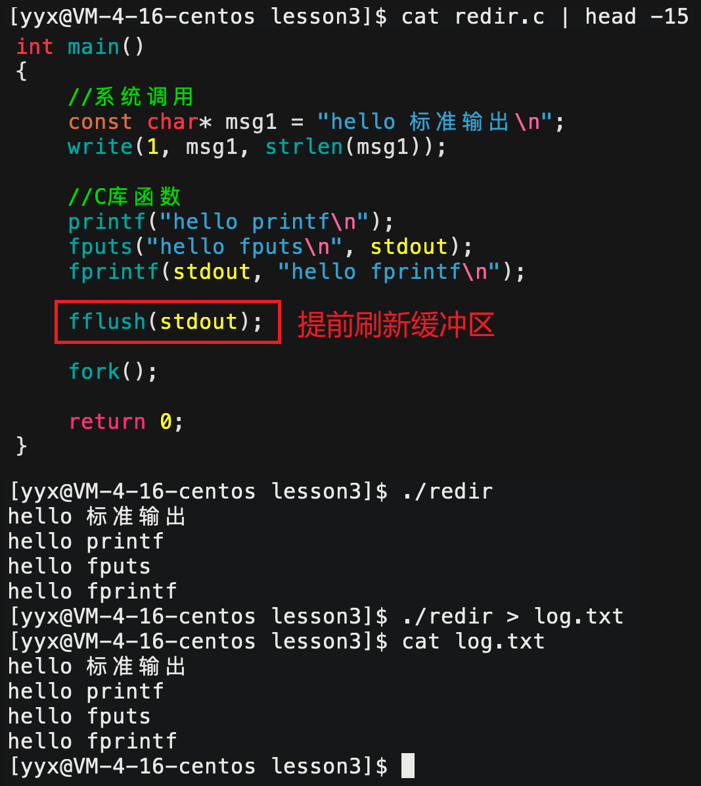
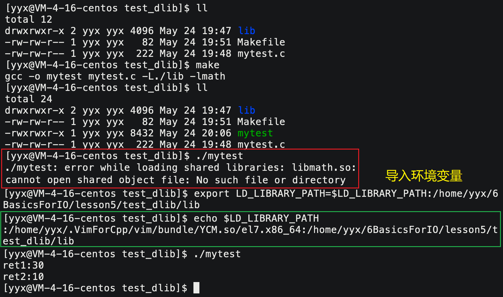

# 基础IO

### C语言文件IO

#### C文件操作接口回顾

##### 输出

~~~cpp
int main() {
    /* output */
    FILE* fp = fopen("./log.txt", "w");
    if (fp == NULL) {
        printf("fp error\n");
    }
    const char* msg = "hello log.txt\n";
    //1.
    fputs(msg, fp);
    //2.
    fprintf(fp, "hello log.txt\n");
	//3.
    fwrite(msg, 15, 1, fp);
    fclose(fp);
    return 0;
}
~~~

##### 输入

```c
int main() {
	/* input */
    FILE* fp = fopen("./log.txt", "r");
    if (fp == NULL) {
        printf("fp error\n");
        exit(1);
    }
    char buffer[64] = { 0 };
    //1.
    fread(buffer, sizeof(buffer), 1, fp);  //文件指针不移动，下次读取仍在首行
    //2.
    fscanf(fp, "%s\n", buffer); //文件指针移动但无法读取空格
    //3. 
    while (fgets(buffer, sizeof(buffer), fp))
    {
        printf("%s\n", buffer);
    }
    if (!feof(fp)) { //判断是否到文件尾
        printf("fgets quit not normal\n");
    }
    else {
        printf("reach endoffile\n");
    }
    fclose(fp);
    return 0;
}
```

##### 追加

```c
int main() {
	/* append */
    FILE* fp = fopen("./log.txt", "a");
    if (fp == NULL) {
        printf("fp error\n");
        exit(1);
    }
    int cnt = 5;
    while (cnt--) {
        fputs("hello log.txt\n", fp);
    }
    fclose(fp);     
    return 0;
}
```

> 语言层面上的IO学习，只会学习到使用层面，和系统硬件打交道的接口只有到操作系统阶段才能理解原理。

#### 三个标准流

一般程序运行的时候，语言会默认打开三个输入输出流，分别为`stdin`,`stdout`,`stderr`。

从系统角度看，`stdin`对应的设备是键盘，`stdout`对应的设备是显示器，`stderr`对应的设备是显示器。

```cpp
NAME
       stdin, stdout, stderr - standard I/O streams
SYNOPSIS
       #include <stdio.h>

       extern FILE *stdin;
       extern FILE *stdout;
       extern FILE *stderr;
```

> 命令行中的操作符`>`叫做输出重定向，本质是把`stdout`的内容重定向到文件中。

加之对三个标准流的把控，通过`fputs/fgets`可以向一般文件和硬件设备写入或读取数据。

&nbsp;

## 系统文件IO

### 1 系统文件调用接口

#### 1.1 open / close

```cpp
NAME
       open, creat - open and possibly create a file or device
SYNOPSIS
       #include <sys/types.h>
       #include <sys/stat.h>
       #include <fcntl.h>
       int open (const char *pathname, int flags);
       int open (const char *pathname, int flags, mode_t mode);
	   int creat(const char *pathname, mode_t mode);
DESCRIPTION
       Given a pathname for a file, open() returns a file descriptor, a small, nonnega-
       tive integer for use in subsequent system calls  (read(2),  write(2),  lseek(2),
       fcntl(2),  etc.).  The file descriptor returned by a successful call will be the
       lowest-numbered file descriptor not currently open for the process.
       
       The  argument  flags  must  include one of the following access modes: O_RDONLY,
       O_WRONLY, or O_RDWR.  These request opening the file read-only,  write-only,  or
       read/write, respectively.
RETURN VALUE
       open()  and  creat()  return the new file descriptor, or -1 if an error occurred
       (in which case, errno is set appropriately).
           
NAME
       close - close a file descriptor
SYNOPSIS
       #include <unistd.h>
       int close(int fd);
DESCRIPTION
       close()  closes  a  file descriptor, so that it no longer refers to any file and
       may be reused.  
RETURN VALUE
       close()  returns  zero  on  success.  On error, -1 is returned, and errno is set
       appropriately.
```

##### 函数介绍

```cpp
int open (const char *pathname, int flags, mode_t mode);
int close(int fd);  
```

| 函数\参数 | pathname                        | flags          | mode                       | 返回值                                    |
| --------- | ------------------------------- | -------------- | -------------------------- | ----------------------------------------- |
| **open**  | 所需打开的文件的全路径          | 打开模式标识位 | 八进制整数，描述文件的权限 | 打开成功返回文件描述符，打开失败返回 -1。 |
| **close** | **fd** 需关闭的文件的文件描述符 |                |                            | 关闭成功返回文件描述符，关闭失败返回 -1。 |

- `flags`是打开模式标识位，该整数的二进制位具有不同的含义，可以将多个宏参数按位或起来传入。

​	如：`O_WRONLY`代表只写，`O_CREAT`代表创建，`O_RDONLY`代表只读。

​	这些宏都是只有一个比特位为1的整数，且宏之间互不相同。这样可以将多个宏或起来传入，简单且高效。

- `mode`通常传入八进制整数，用来设置所打开文件的权限信息。

​	如：`0664`，三位八进制数字，从前向后每一位分别代表用户组员其他人的读写执行的权限。


```c
int fd = open ("./log.txt", O_WRONLY | O_CREAT, 0664);
int fp = fopen("./log.txt", "w"); 
```

> 系统调用和C文件操作对比如上，系统调用通常比语言封装接口复杂，需要指定打开模式和文件权限。

#### 1.2 write / read

```cpp
NAME
       write - write to a file descriptor
SYNOPSIS
       #include <unistd.h>
       ssize_t write(int fd, const void *buf, size_t count);
DESCRIPTION
       write() writes up to count bytes from the buffer pointed buf to the file referred to by the file descriptor fd.
       The  number of bytes written may be less than count.
RETURN VALUE
       On  success, the number of bytes written is returned (zero indicates nothing was written).  On error, -1 is returned, and errno is set appropriately.

NAME
       read - read from a file descriptor
SYNOPSIS
       #include <unistd.h>
       ssize_t read(int fd, void *buf, size_t count);
DESCRIPTION
       read() attempts to read up to count bytes from file descriptor fd into the buffer starting at buf.
RETURN VALUE
       On  success,  the number of bytes read is returned (zero indicates end of file), and the file position is advanced by this number.  It is not an error if this number is smaller than the number of bytes requested.    
```

##### 函数介绍

```c
ssize_t write(int fd, const void *buf, size_t count);
ssize_t read (int fd,       void *buf, size_t count);
```

| 函数\参数 | fd                   | buf                                   | count          | 返回值                 |
| --------- | -------------------- | ------------------------------------- | -------------- | ---------------------- |
| **write** | 操作文件的文件描述符 | 写入字符串，将字符串`buf`内容写入文件 | 写入的字符个数 | 返回真正写入的字符个数 |
| **read**  | 操作文件的文件描述符 | 读取数组，读取文件内容放到数组`buf`   | 读取的字符个数 | 返回真正读取的字符个数 |

```cpp
//write
int main()
{
    int fd = open("./log.txt", O_WRONLY | O_CREAT, 0664);
    if (fd < 0) {
        perror("open fail\n");
        exit(1);
    }
    const char* msg = "hello log.txt\n";
    int ret = write(fd, msg, strlen(msg));
    printf("ret:%d\n", ret);

    close(fd);
    return 0;
}
//read
int main()
{
    int fd = open("./log.txt", O_RDONLY);
    if (fd < 0) {
        perror("open fail\n");
    }
    char buff[1024]; // { 0 };
    int ret = read(fd, buff, sizeof(buff) - 1);
    if (ret > 0) {
        buff[ret - 1] = 0;
        printf("ret:%d\n", ret);
    }
    printf("%s\n", buff);
    close(fd);
    return 0;
}
```

&nbsp;

### 2. 文件描述符

访问文件（磁盘），显示器以及键盘，都是对硬件设备进行读写。Linux 系统的设计思想就是**一切皆文件**，硬件资源也是以文件的形式展现出来的。

操作系统是硬件资源的管理者，所有语言**程序的“文件”操作，都要贯穿操作系统**。也就是说，用户的行为必须通过语言程序到系统调用再到操作系统，让操作系统来帮助我们管理硬件。


> 既然如此，我们学习系统文件 IO 就一定要学习文件操作的系统调用接口。当然系统接口肯定是复杂且和当前系统强相关的，实际使用的时候仍然使用语言层面的接口。

如果一个文件没有被打开，就存储在磁盘上。创建一个没有内容的空文件，它的大小并不为 0，因为文件也有属性信息，如拥有者所属组、权限信息等属性也要存储。

故**文件就是文件内容和文件属性的集合**，也就是说，各种文件操作就分为对文件内容的操作和文件属性的操作。

首先，要操作文件必须先打开文件，也就是将所打开的文件相关的属性信息加载到内存中。故内存中不仅存在大量的进程，也可能存在大量的文件，**操作系统必然要像管理进程一样将打开的文件管理起来**。

> 那么，如何描述和管理被打开的文件呢？首先来看第一个概念：文件描述符。


从上述打印结果可见，用户打开的文件描述符从 $3$ 开始。$0,1,2$在进场创建之初就分别被标准输入、标准输出、标准错误占用。文件描述符从 $0$ 开始记数，依次向后增加，类似于数组下标，甚至类似于进程编号 pid。

#### 2.1 文件描述符的定义


操作系统为打开的文件创建的数据结构就叫做`struct file {...};`，用来**描述文件相关的属性信息。属于某个文件并和文件一一对应**。

- 为了将文件和进程关联起来，系统为每个进程都创建了一个结构体叫做`struct files_struct`，**这是属于进程的结构体，记录该进程所打开的文件**。
- 该结构体中有一个文件描述符数组`struct file* fd_array[]`，存放被该进程所打开的文件的`file`结构体的内存地址。而**数组`fd_array[]`的下标，就是文件描述符**，进程在操作文件的时候，以且只以数组的下标即文件描述符`fd`来区分各个文件。

```cpp
int fd = open ("./log.txt", O_WRONLY | O_CREAT, 0664);
```

所以，**`fd`本质是内核中进程和其打开的文件所关联的数组的下标**。

> 另外，因为程序运行起来默认会打开标准输入输出错误流，所以 $0,1,2$ 被占用了。

#### 2.2 系统硬件管理方法

不同的硬件设备，如键盘显示器等，它们的驱动程序提供给操作系统的`read`,`write`读写接口肯定是不一样的。系统为了避免差异，统一化管理，在驱动层上添加了一层虚拟文件系统`vfs`，也就是一堆打开文件的结构体`struct file`等集合。

其中每个文件结构体`struct file`根据对应的驱动提供的IO接口把硬件设备描述成文件。**结构体中的读写函数，对应着硬件提供的读写接口，以统一的视角看待不同的硬件设备**。这就是系统层面的多态。

> `struct file`结构体像是内部只有`read`,`write`函数声明的父类对象，不同的设备文件像是子类，拥有`read`,`write`函数的实现。

只调用文件结构体内的读写声明，就可以调用到不同文件或设备的具体的读写方法。因此，系统不需要关心硬件读写的细节，只通过结构体`file`调用方法即可。**找出不同设备之间的共同点读写声明一致，就能以统一的视角看待不同的设备，屏蔽了底层实现的细节**。这就是Linux系统的特点**一切皆文件**的实现方法。


#### 2.3 文件描述符的性质

既然`fd`直接唯一映射到对应的文件，那么调用系统接口也可以直接对`0`, `1`,`2`号文件进行读写。

```c
int main()
{
    const char* msg = "hello world\n";
	write(1, msg, strlen(msg));       //向1号文件写入
	write(2, msg, strlen(msg));       //向2号文件写入
	char buff[64] = { 0 };                                                                  	
    read(0, buff, sizeof(buff) - 1);  //向0号文件读取
	printf("%s", buff);                                                                 
	return 0;                                                               
}
```

1. 文件描述符的分配规则：分配`fd_array[]`**数组中最小且没有使用的位置，作为新文件的`fd`**。

```shell
$ cat myfile.c 
int main()
{
    close(0); # 关闭0号文件
    int fd = open("./log.txt", O_CREAT| O_WRONLY, 0664);
    printf("%d\n", fd); #打印当前文件的fd
    return 0;
}
$ ./myfile #
0

$ cat myfile.c 
int main()
{
    close(2); # 关闭2号文件
    int fd = open("./log.txt", O_CREAT| O_WRONLY, 0664);
    printf("%d\n", fd); #打印当前文件的fd
    return 0;
}
$ ./myfile #
2
```


2. `fd`具有唯一标识一个文件的能力且屏蔽了底层细节，故**库函数只能根据文件`fd`来确定操作的文件**，不管它是否被修改。

```shell
$ cat myfile.c 
int main()
{
    close(1); # 关闭1号文件
    int fd = open("./log.txt", O_CREAT| O_WRONLY, 0664);
    printf("%d\n", fd); #打印当前文件的fd
    fprintf(stdout, "hello world\n");
	
	return 0;
}
$ ./myfile && cat log.txt #原本打印到屏幕上的内容输出到了文件中
1
hello world
```

`printf`默认向标准输出输出内容，其实是向`1`号文件打印。如果关闭`1`号文件再打开新文件，1号文件描述符已经被分配给了新文件。再调用`printf`就变成了向新打开的文件输出。


如图所示，`FILE`是C语言提供的对操作系统提供的文件结构体`file`的封装，所以`FILE`里一定包含着文件的`fd`。

| 系统 | C语言    | C++    |
| ---- | -------- | ------ |
| `0`  | `stdin`  | `cin`  |
| `1`  | `stdout` | `cout` |
| `2`  | `stderr` | `cerr` |

如表所示，文件描述符 $0,1,2$ 和语言提供的标准输入、输出、错误接口是一一对应的关系。可以利用`fd`的性质，完成重定向的功能。

##### 重定向

```shell
$ echo "hello world" > log.txt
```

> 上述代码中，`echo`将字符串内容输出到标准输出文件中，但又被`>`重定向至文件 log.txt。

```cpp
//输出重定向
int main()
{
    close(1);
    int fd = open("./log.txt", O_CREAT | O_WRONLY |  O_APPEND, 0664);
    printf("fd:%d\n", fd);

    fprintf(stdout, "hello world\n");
    fprintf(stdout, "hello world\n");
    fprintf(stdout, "hello world\n");
    fprintf(stdout, "hello world\n");
	return 0;
} 
//输入重定向
int main()
{
    close(0);
    int fd = open("./log.txt", O_RDONLY);
    printf("fd:%d\n", fd); //fd=0

    char buff[1024] = { 0  };
    while (fgets(buff, sizeof(buff) - 1, stdin)) {
        printf("%s", buff);
    }
    return 0;
}
```


`fd`就是`_fileno`变量，不同版本下可能不一样。我们可以打印出来看看。


如下图所示，标准错误和标准输出都能打印出来，但只有标准输出能重定向到文件中，标准错误不能。


因为**重定向指的是输出重定向，只能将标准输出的内容重定向至其他文件**，虽然标准错误也是打印到屏幕上，但它不是标准输出。

~~~shell
$ ./redir > log.txt 2>&1
$ cat log.txt
hello 标准输出
hello 标准错误
~~~

可以用上述代码的方式，将`2`号文件重定向至`1`号文件，再打印到屏幕上。

##### 系统调用 dup2

```cpp
NAME
       dup, dup2, dup3 - duplicate a file descriptor
SYNOPSIS
       #include <unistd.h>
       int dup(int oldfd);
       int dup2(int oldfd, int newfd); //通常使用dup2
DESCRIPTION
       dup2() makes newfd be the copy of oldfd.
       *  If oldfd is not a valid file descriptor, then the call fails, and newfd is  not closed.
       *  If oldfd is a valid file descriptor, and newfd has the same value as oldfd, then dup2() does nothing, and returns newfd.
```

> 虽然可以先将标准输入输出文件关闭，再打开新文件以达成重定向的目的。但可能有时文件已经创建，只能用`dup2`系统调用函数解决。

 原理也很简单，把`newfd`新文件的地址拷贝至`oldfd`的位置，那么原有的文件就改成了新文件，此时再读写原文件实际就成了读写新文件。



```c
int main()
{
2
    printf("hello world\n");
    fprintf(stdout, "hello world\n");
    fputs("hello world\n", stdout);
    return 0;
}
int main()
{
    int fd = open("./log.txt", O_RDONLY);
    if (fd < 0) {
        return 1;
    }
    dup2(fd, 0); ////将fd号文件拷贝至0号文件位置，如此访问0号文件就成了访问fd文件
    
    char buff[64] = { 0  };
    scanf("%s", buff);
    printf("%s\n", buff);
    fscanf(stdin, "%s", buff);
    printf("%s\n", buff);
    fgets(buff, sizeof(buff) - 1, stdin);
    printf("%s\n", buff);

    return 0;
}
```

- 进程替换后dup2的作用并不会消失。进程替换发生在物理内存处，而dup2修改的是文件数据结构，二者并不存在影响。
- 子进程创建之后同样会将内核相关的文件系统结构体`files_struct`继承下来，它也是内核数据结构的一部分。但文件结构体`struct file`是属于打开文件的结构体，并不是内核数据结构所以只有一份。

> 类似环境变量，标准输入输出错误流也是这样继承下来的。


### 3. 缓冲区

#### 3.1 缓冲区的概念


> 在上述代码中，`printf`向文件中输出内容如果最后没有关闭文件，则文件中正常出现内容。**如果最后`close`关闭文件，最后文件中就没有内容了**。

程序运行起来时，**C语言程序也提供了语言层面的缓冲区，叫做用户缓冲区**。系统中也存在一个缓冲区，叫做内核缓冲区。

>  目前只讨论用户缓冲区，内核缓冲区暂不做考虑。


##### 缓冲区和库函数

当我们调用C语言提供的文件写入的库函数如`fprintf`时，本质是：

1. 将字符串`"hello world"`写入到C语言的缓冲区；
2. 再由操作系统，通过文件描述符，**刷新C缓冲区的内容到文件的内核缓冲区**；
3. 再到磁盘或其他外设中。

也就是说，**C语言文件结构体类型`FILE`中，不仅封装了系统文件`fd`，还维护了C缓冲区**。通过语言调用输出函数，本质都是将字符串输出到语言层面的用户缓冲区，并没有到磁盘显示器等外设上。

> 那么何时才会将C缓冲区的内容刷新到内核缓冲区呢？操作系统自有一套刷新策略，也可以调用库函数`fflush`手动刷新。

C缓冲区刷新到内核缓冲区的刷新策略有三种：

1. 不缓冲，立即刷新；
2. 行缓冲，遇到`\n`就刷新缓冲区；一般显示器刷新是行刷新。
3. 全缓冲，缓冲区满了才刷新。一般向磁盘文件写入是全缓冲，但在进程退出时还会统一刷新一次。

当我们将**输出到显示器的内容重定向到文件时，背后刷新策略也会发生改变，从行缓冲到全缓冲**。如下图所示：


1. 当字符串内容已经在C缓冲区时，因为是全缓冲，会等待缓冲区满或进程退出时刷新。
2. 但进程退出之前，已经将文件关闭`close`，最后缓冲区的内容刷新到内核缓冲区后，也到不了文件中，所以文件内没有内容。


当然也可以调用库函数`fflush`手动刷新。

##### 缓冲区和系统调用

~~~cpp
int main()
{
    const char* msg1 = "hello 标准输出\n";
    write(1, msg1, strlen(msg1));
    const char* msg2 = "hello 标准错误\n";
    write(2, msg2, strlen(msg2));
    
    printf("hello printf\n");
    fprintf(stdout, "hello fprintf\n");
    
    close(1); //关闭文件
    return 0;
}
~~~

> 上述代码中有系统调用`write`写文件，也有库函数`fprintf`写文件，结果会怎样呢？

~~~shell
$ ./redir           # 向显示器输出内容
hello 标准输出
hello 标准错误
hello printf
hello fprintf
$ ./redir > log.txt # 重定向到文件中
hello 标准错误
$ cat log.txt       # 打印文件内容
hello 标准输出
~~~

> 实际输出到文件的内容只有用库函数`write`写的 hello 标准输出。

1. 首先，标准错误内容不能直接重定向至文件中，首先排除；
2. `write`**系统调用直接输出到内核缓冲区中，不需经过C语言缓冲区**，所以不会被`close`关闭文件而“拦截”；
3. `printf`,`fprintf`都是C库函数，要经C缓冲区再到内核缓冲区，会被`close`关闭文件“拦截”住。

##### 缓冲区和子进程

~~~cpp
int main()
{
    //系统调用
    const char* msg1 = "hello 标准输出\n";
    write(1, msg1, strlen(msg1));
    //C库函数
    printf("hello printf\n");
    fputs("hello fputs\n", stdout);
    fprintf(stdout, "hello fprintf\n");

    fork(); //创建子进程
    return 0;
}
~~~

> 执行结果如图所示：

~~~shell
$ ./redir # 输出到显示器
hello 标准输出
hello printf
hello fputs
hello fprintf
$ ./redir  > log.txt # 重定向到文件
$ cat log.txt
hello 标准输出  #    -- 系统调用内容只有一份
hello printf   #--
hello fputs    # ｜ -- 库函数输出内容第一份
hello fprintf  #-｜
hello printf   #-｜
hello fputs    # ｜ -- 库函数输出内容第二份
hello fprintf  #--
~~~

表面看`fork`创建子进程时程序核心代码已执行完毕即将返回了，所以创建的子进程毫无用处，但输出的结果却有所不同。

- 输出到显示器是行刷新，`printf`一类库函数都是缓冲区一行直接刷新，所以最后缓冲区内没有内容。
- 输出到文件是全刷新，只有等缓冲区满或者进程结束才刷新。首先系统调用`write`直接到内核缓冲区不受影响，

1. `printf`一类**库函数的内容只有等进程退出才会刷新，所以`fork`执行后数据仍然在缓冲区**。
2. 并且C缓冲区属于进程的相关数据，所以不管父子任意一方谁先退出并**刷新缓冲区都算是修改程序数据会发生写时拷贝**，所以父子都会刷新一遍用户缓冲区，所以打印了两份库函数的输出内容。 



当然，可以在`fork`之前提前将缓冲区内数据全部刷新，等到子进程创建之时就不会存在修改代码数据写实拷贝的问题了。

&nbsp;

### 4. 文件系统的理解

> 以上讨论的都是在内存中打开的文件，而接下来是文件在磁盘上的存储方式，或者是磁盘文件的管理方式。

文件就是文件内容和文件属性的集合。文件如果没有被打开，则是存储在磁盘上的。磁盘是计算机中的一个机械设备（固态硬盘除外）。

企业中存储数据一般都用机械硬盘，虽然机械硬盘几乎退出桌面级市场，但是它具有容量大，价格便宜，使用寿命长的优点。

磁盘打开后如下图所示，整体由盘片，主轴，磁头，机械臂以及其他部分组成。其中主轴带动多个盘片高速转动，由机械臂带动磁头在盘片上寻找指定位置进行读写。

- 盘片表面多个同心圆被划分出“磁道”，又被直径所在的直线划分成不同“扇区”。
- 磁头首先要在盘片上移动到指定的磁道，再等待盘片旋转所指定的扇区到来，即可进行读写。


由于磁头的大小很小，可以看成一个点，所以磁盘虽然是圆形，但可以将一条条的磁道看成一条直线，是线性的。对磁盘管理的时候可以将其看成一个线性的结构，如下图所示：


#### 4.1 磁盘区域的管理

类似国家行政区域划分，磁盘同样需要划分不同的区域来管理。从省到市到县，对应道磁盘管理就相当于：

1. 分区：将一整块硬盘，划分多个磁盘分区，相当于划分省份。
2. 格式化：给每个分区写入文件系统，相当于建立省政府，便于管理。

对于每个分区，仍要进行细化管理，具体结构如图所示：


1. `Boot Block`：存储磁盘启动加载操作系统相关的信息。
2. `Block Group`：整个分区划分成不同的组块。

##### 磁盘文件的存储

对于每一个`Block Group`内部，又被划分出了不同区域，这里才是存储文件的开始：

- `Data Block`：是实际存储文件内容的区域，这块区域又划分成很多小空间`block`，用来存储单个文件的内容，大小一般为4KB。
- `Inode Table`：是实际存储文件属性的区域，同理也被划分成很多小空间`inode`，用来存储单个文件的属性，大小一般为512Byte。


计算机内一般都不以名称作为唯一标识。也就是说，**系统不以文件名这个字符串来区分文件，而是使用文件的`inode`编号来唯一标识文件**，即一个文件一个 inode。

创建一个文件，首先要在 Inode Table 中找到一块没有使用的 inode，将文件属性填入进去。再到该 inode 对应的 block 中填入文件内容。如果不够会在后方再开辟一个 block。

所以，`inode`是一种结构体，存储文件的相关属性信息：

~~~c
struct inode {
  	//文件的所有属性
  	//数据 int inode_number;
    // int blocks[32]; //存储该文件所占有的所有block的下标
};
~~~

所以，通过 inode 就可以确定文件的所有属性以及存储的内容。但顺序遍历 Inode Table 来找到我们需要的那个 inode，效率太低下，故使用如下两个位图结构来帮助我们查找：`Block BitMap`，`Inode BitMap`。

> 位图是用整数的每个二进制位组成的一张图，每个二进制位要么为0要么为1，故位图的每个单元也只能表示只有两种值的数。


以`Inode BitMap`为例， 

- 位图下标编号：每个`inode`所在的位置，也就是数组下标，从0开始编号。
- 位图单元的值：每个`inode`单元的值，要么0要么1，1表示该`inode`已被占用，0表示`inode`还未使用。

同样，`Block Bitmap`下标对应着`Block`的位置，内容也对应着该`Block`是否被使用。查找没有使用的 inode 或者 block 位置可以直接遍历位图即可。

> - `Super Block`：包含本组`block Group `的空间使用情况和整个分区所有的组的一些信息。
>
> - `Group Descriptor Table`：包含本组的一些使用信息，如组的在分区的编号和组内的 inode block 和 data block 的使用情况。这两个仅了解。

```shell
$ ll -ai     # 查看文件的inode
total 16
1317057 drwxrwxr-x 3 yyx yyx 4096 May 22 14:31 .
 665397 drwxrwxr-x 6 yyx yyx 4096 May 21 03:41 ..
1320703 -rw-rw-r-- 1 yyx yyx   12 May 22 15:00 hello.c
1320704 drwxrwxr-x 2 yyx yyx 4096 May 22 14:31 tmp
```

~~~shell
$ touch hello.c                 # 首先创建文件inode，再将文件名hello.c和inode关联起来

$ echo "hello world" > hello.c  # 将字符串hello world填入文件inode对应的block中

$ cat hello.c          			# 1. 读取所在目录的block，获取block中文件名hello.c映射的inode
							    # 2. 遍历inode table找到并打印inode对应的block[]中的内容
							    
$ rm hello.c                    # 在inode bitmap中找到文件inode的位置将其内容置为0
								# 之后再创建文件覆盖即可
~~~


`inode`中并不存储文件名，但在目录的`block`中存储其下文件的 inode 和文件名的映射。

#### 4.2 软连接和硬连接

软硬链接可以帮助我们在其他目录下建立一个文件的链接，软链接像是 windows 里的快捷方式，硬链接像是直接复制了一份。

##### 软硬链接的创建

```shell
$ ln -s mytest mytest_link        # 创建软链接
$ ln    mytest mytest_hard        # 创建硬链接
```

~~~shell
## 软链接
$ ln -s tmp/bin/test/test mytest_link        # 创建软链接
$ ll
total 4
lrwxrwxrwx 1 yyx yyx   17 May 22 16:44 mytest_link -> tmp/bin/test/test  # 软链接
drwxrwxr-x 3 yyx yyx 4096 May 22 16:39 tmp
$ ./tmp/bin/test/test  # 运行指定目录下可执行文件
hello world
$ ./mytest_link        # 直接运行软链接
hello world
## 硬链接
$ link tmp/bin/test/test mytest_hard         # 创建硬链接
$ ll
total 16
-rwxrwxr-x 2 yyx yyx 8360 May 22 16:40 mytest_hard                       #硬链接 
drwxrwxr-x 3 yyx yyx 4096 May 22 16:39 tmp
$ ./tmp/bin/test/test  # 运行指定目录下可执行文件
hello world
$ ./mytest_hard        # 直接运行硬链接
hello world
~~~

##### 软硬链接的取消

```shell
$ unlink mytest_link # 取消软硬链接
```

```shell
$ ll
total 16
-rwxrwxr-x 2 yyx yyx 8360 May 22 16:40 mytest_hard
lrwxrwxrwx 1 yyx yyx   17 May 22 16:44 mytest_link -> tmp/bin/test/test
drwxrwxr-x 3 yyx yyx 4096 May 22 16:39 tmp
$ unlink mytest_hard # 取消硬链接
$ ll
total 16
lrwxrwxrwx 1 yyx yyx   17 May 22 16:44 mytest_link -> tmp/bin/test/test
drwxrwxr-x 3 yyx yyx 4096 May 22 16:39 tmp
$ unlink mytest_link # 取消软链接
$ ll
total 16
drwxrwxr-x 3 yyx yyx 4096 May 22 16:39 tmp
```

##### 软硬链接的区别

```shell
$ ln tmp/test mytest_soft -s       # 创建软链接
$ ln tmp/test mytest_hard          # 创建硬链接
$ ls -ail                # 查看当前目录文件的inode信息
total 24
1317057 drwxrwxr-x 3 yyx yyx 4096 May 22 17:08 .
 665397 drwxrwxr-x 6 yyx yyx 4096 May 21 03:41 ..
1320753 -rwxrwxr-x 2 yyx yyx 8360 May 22 17:07 mytest_hard
1320754 lrwxrwxrwx 1 yyx yyx    8 May 22 17:08 mytest_soft -> tmp/test
1320704 drwxrwxr-x 2 yyx yyx 4096 May 22 17:07 tmp
$ ls -ail tmp/test       # 查看 tmp/test 的inode信息
1320753 -rwxrwxr-x 2 yyx yyx 8360 May 22 17:07 tmp/test
```


硬链接的 inode 和被链接文件的 inode 是一样的，但软链接有自己独立的 inode。

- 也就是说，**软连接本身是个独立的文件，有自己的 inode 属性集和数据块**。
- 硬链接不是独立文件，它**本质是把链接原文件的 inode 和文件名的映射关系在新的文件夹下复制了一份**。

##### 文件属性硬链接数

~~~shell
$ ls -a -i -l 
1320704 drwxrwxr-x 2 yyx yyx 4096 May 22 17:31 .
1317057 drwxrwxr-x 3 yyx yyx 4096 May 22 17:28 ..
1320703 -rw-rw-r-- 1 yyx yyx    0 May 22 17:31 file.txt
~~~

输入上述命令时，显示的第三组数据，就是当前文件的硬链接数。也就是说，该文件在磁盘上存在多少个 inode 和文件名的映射关系。


> 建立一个硬链接，就多了一个该文件的映射关系，所以硬链接数变成2，和软链接无关。

硬链接数是记录当前系统中有多少个该文件，等到硬链接数为0时，再将该文件从系统中删除。这就是引用计数。

#### 4.3 三个文件系统时间

通过如下命令，可以获取文件的状态信息。

```shell
$ stat test.c # 获取文件的状态信息
```

```shell
$ stat test.c 
  File: ‘test.c’
  Size: 0               Blocks: 0          IO Block: 4096   regular empty file
Device: fd01h/64769d    Inode: 1320701     Links: 1
Access: (0664/-rw-rw-r--)  Uid: ( 1003/     yyx)   Gid: ( 1003/     yyx)
Access: 2022-05-24 02:38:07.988811151 +0800  # Access Time
Modify: 2022-05-24 02:38:07.988811151 +0800  # Modify Time
Change: 2022-05-24 02:38:07.988811151 +0800  # Change Time
 Birth: -
$
```

| 时间            | 解释                         |
| --------------- | ---------------------------- |
| **Access Time** | 文件被访问的最近时间         |
| **Modify Time** | 文件**内容**被修改的最近时间 |
| **Change Time** | 文件**属性**被修改的最近时间 |


> 其中，`Access Time`理论上是最常被修改的时间概念，所以系统为防止频繁刷盘造成效率下降，该时间被系统控制，由系统定时刷新。

此外，Makefile选择是否编译源文件的依据，也正是源文件的 Modify Time 是否新于可执行文件的 Modify Time。 


&nbsp;

### 5. 动态库和静态库

> 从第一次接触语言的时候，就已经接触了库，如C标准库。语言本身会提供库，库可以看成一套头文件和一套库文件的总称。

#### 5.0 静动态库的定义

一般库文件分两种：静态库和动态库。Linux下静态库文件的后缀为`.a`，动态库文件的后缀为`.so`。

```shell
$ ldd a.out # 查看可执行程序所依赖的动态库
```


- 库的文件命名：`libXXXX.so.xx`或`libXXXX.a.xx`。
- 库的真实命名：去掉前缀`lib`，去掉后缀`.so.xx`或`.a.xx`，剩下的就是真实命名。

##### 静态链接和动态链接

静动态链接两者最大的区别就在于链接的时机不一样，静态链接是在形成可执行程序前，而动态链接的进行则是在程序执行时。

|              | 缺点                       | 优点                       |
| ------------ | -------------------------- | -------------------------- |
| **静态链接** | 空间浪费严重，更新较为麻烦 | 运行速度相对快一点         |
| **动态链接** | 运行速度相对慢一点         | 避免空间浪费，维护比较方便 |

>
> - 静态链接会将库文件拷贝至目标文件中，造成程序文件体积较大。
> 
>   但其具备执行所需的程序，不需要查找其他目录文件，所以运行速度快。
> 
> - 在执行的时候。若库文件被修改，就需要打包并编译重新生成库。
> 
> - 由系统的装载程序加载库，并链接形成程序。库内容不会像静态链接那样存在多份，而是多个程序共享。
> 
>   更新只需替换原有库，新库会自动加载并链接。库与可执行文件独立，提高了可维护性。
> 
> - 因为链接推迟到了程序运行时，所以每次执行程序都需要进行链接。
> 

```shell
[yyx@VM-4-16-centos lesson5]$ file a.out # 静态链接文件
a.out: ELF 64-bit LSB executable, x86-64, version 1 (GNU/Linux), statically linked, for GNU/Linux 2.6.32, BuildID[sha1]=60f7c9201cbb0d2683347758ad1514283fbcf74d, not stripped
[yyx@VM-4-16-centos lesson5]$ file a.out # 动态链接文件
a.out: ELF 64-bit LSB executable, x86-64, version 1 (SYSV), dynamically linked (uses shared libs), for GNU/Linux 2.6.32, BuildID[sha1]=ffe3de634d1ea953ad33a91e5c179a74d840c573, not stripped
```


一般一个完整的库，都会提供如下的文件：

1. 库文件本身：如图所示，库本身就是由`.o`可重定向目标文件打包而成的二进制文件，
2. 配套头文件：只能通过配套的`.h`头文件查看库所提供的接口声明，
3. 说明文档：对库的一些说明，不重要。

> 标准的声明定义分离，方便生成库，同时也方便维护。库一方面方便使用，一方面更加安全。

#### 5.1 静态库的生成

```shell
$ cat add.c
#include "add.h"
int add(int x, int y) {
    return x + y;
}
$ cat add.h
#pragma once
#include <stdio.h>
extern int add(int x, int y);
$ cat sub.c
#include "sub.h"
int sub(int x, int y) {
    return x -y;
}
$ cat sub.h
#pragma once
#include <stdio.h>
extern int sub(int x, int y);
$ ll
total 16
-rw-rw-r-- 1 yyx yyx 59 May 24 06:09 add.c
-rw-rw-r-- 1 yyx yyx 64 May 24 06:06 add.h
-rw-rw-r-- 1 yyx yyx 57 May 24 06:09 sub.c
-rw-rw-r-- 1 yyx yyx 64 May 24 06:06 sub.h
```

将该四个文件编译成静态库的方法如下：

1. 先将所有`.c`源文件编译成`.o`目标文件，
2. 将**所有的`.o`文件打包形成一个库文件。**这就是静态库的本质。

```shell
$ ar -rc libXXX.a XXX.o # ar 打包静态库命令 -rc replace & create
```

```makefile
# Makefile
libmath.a : add.o sub.o
    ar -rc $@ $^ # -rc replace & create
%.o : ./lib/%.c
    gcc -c $<

.PHONY:output
output:
    mkdir output
    cp -rf libmath.a output/
    cp -rf  src/*.h output/

.PHONY:clean
clean:
    rm -rf libmath.a *.o output
.PHONY:install
install:
	cp -rf *.h /usr/include
	cp -f libmath.a /lib64
```

```shell
$ ar -tv libXXX.a # 查看静态库打包的.o目标文件
rw-rw-r-- 1003/1003   1240 May 24 18:02 2022 add.o
rw-rw-r-- 1003/1003   1240 May 24 18:02 2022 sub.o
```


交付时直接将`output`目录下的头文件和库文件拷贝给他人即可。

#### 5.2 静态库的使用

链接指定的库文件编译源文件，可以采用如下方式：

```shell
$ gcc test.c -I./lib  -L./lib  -lmath
```

1. `-I`：指明头文件所在路径
2. `-L`：指明库文件所在路径
3. `-l`：指明库文件的真实名称，注意是去掉前后缀的真实名称

> 系统库文件在系统的默认路径下，头文件是在`usr/include`，库文件在`/lib64`中。编译器能够自动识别。

```makefile
mytest : mytest.c
    gcc -o $@ $^ -I./lib -L./lib -lmath # 使用静态库
.PHONY:clean
clean:
    rm -rf mytest
```


#### 5.3 动态库的生成

```makefile
libmath.so : add.o sub.o
    gcc -shared -o $@ $^ # -shared 共享库也就是动态库
%.o : ./src/%.c
    gcc -fPIC -c $< # 目标文件与位置无关

.PHONY:output
output:
    mkdir output
    cp -rf libmath.a output/
    cp -rf  src/*.h output/

.PHONY:clean
clean:
    rm -rf libmath.a *.o output
```


#### 5.4 动态库的使用

```shell
gcc -o $@ $^ -I./lib -L./lib -lmath # 编译时指定动态库
```

```makefile
mytest : mytest.c
        gcc -o $@ $^ -L./lib -lmath
.PHONY:clean
clean:
        rm -rf mytest
```

由于动态库是运行时链接，所以系统加载程序的时候，仍要给加载器指定所依赖的动态库。

只能将库所在路径放入内存级环境变量`LD_LIBRARY_PATH`，或导入系统文件`.bash_profile`中。



#### 总结

制作库的本质就是把源文件编译得的`.o`可重定向目标文件，打包成一个库。交付时，只需要将头文件和库文件交付即可。

动静态库的区别就是打包方式的不同，一个是`ar -rc`一个是`gcc -shared`和`gcc -fPIC`。

以及动静态库使用的时候都要指明头文件库文件的路径和名称，使用动态库编译的程序运行时还需要导入环境变量。
