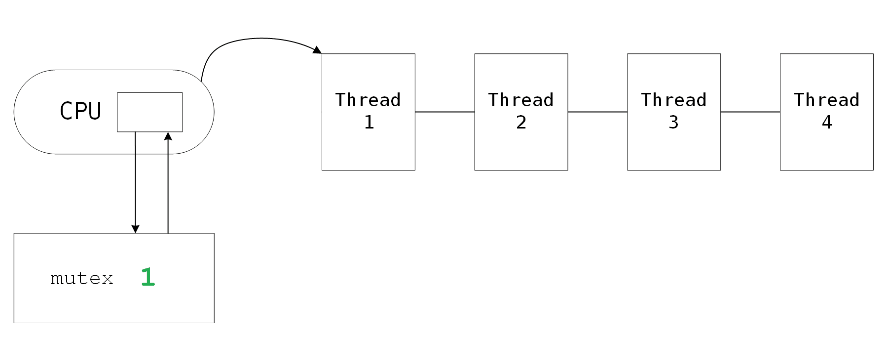

# 多线程

## 1. 线程的概念

### 1.0 可重入函数

以带头链表的头插节点为场景，了解一下可重入与不可重入函数的相关概念。可重入函数的概念是为了下面的多线程做铺垫。

```c
void sig_handler(int signum) 
{
    insert(&node2); //3. 信号处理方法也是头插节点
}
void insert(node_t* p) 
{
    p->next = head;//2. 语句结束后，突然收到信号，并执行信号处理方法
    head = p;
}
int main()
{
   //...
   insert(&node1); //1. 头插节点
   //...
}
```

在头插的过程中，突然收到信号并执行信号处理方法，而方法又是进行头插，就会造成下图所示的情况。


> 这并不代表之前的代码是存在问题的，只是我们要意识到这样的代码在多执行流的情况下可能会出现问题。

像上述的 insert 函数一样，**在执行时再次进入可能会造成问题，就表示该函数不能被重入，是不可重入函数**。反之如果不会出现问题，则该函数就是可重入函数。

> 一般的库函数，STL 等等函数都是不可重入函数，可重入函数才是少数。一般使用了 malloc/free 或调用IO哭函数的函数都是不可重入函数。

&nbsp;

### 1.1 线程的定义

一般书上是这样描述线程的：线程是在进程内部运行的执行分支（执行流），属于进程的一部分，其粒度比进程更细更轻量化。

> 笼统抽象的一句话，许多疑问伴之而生，如何理解进程内部？如何理解是进程的一部分？什么是执行流？如何理解粒度更细更轻量化？

既然线程是进程内部的分支，那么一个进程内可能存在多个执行流，操作系统必然要对线程进行管理和组织。

> 类似于操作系统为管理组织进程而设计的诸如进程 pcb、地址空间、页表等等数据结构。系统为管理和组织线程也可以设计出线程相关的数据结构。其他操作系统如 Windows 是这样做的，而 Linux 并不是。

线程是进程的执行分支，也就是说是线程在被 CPU 执行，故内核中应存在线程控制块，其中包含各种执行数据，它的组成应该和进程控制块 pcb 一致。故 **Linux 没有单独为线程设计线程相关数据结构，而是复用进程相关的内核数据结构**。


又因为线程是进程的分支，进程可以拥有多个执行流。故可以将进程的代码以函数为模块划分为多份，分别交给对应的线程。也就是创建多个进程 pcb，并让多个 pcb 共享同一个地址空间，将当前进程的资源划分成若干份，交给对应的 pcb 使用。

CPU 在执行进程时，不需要关心其正在处理的 pcb 对应着整个进程还是进程的一部分，或者是其他进程的一部分，只要通过地址空间访问对应的内存位置即可。

- 此时 CPU 上的进程 PCB 的概念应该 $<=$ 之前学习进程 PCB 时的概念，概念上显的更轻量化。
- **CPU 只需要认为一个 PCB 就是需要被调度的执行流**，并不理会该 PCB 对应着一个完整的进程还是进程的一部分，这样的一个执行流就是一个线程。

| 概念                 | 解释                                                         |
| -------------------- | ------------------------------------------------------------ |
| 线程在进程的内部     | 线程是在进程的地址空间内运行的                               |
| 线程是进程的执行分支 | CPU如今调度的PCB指向进程的部分代码和数据，一个进程可以分为多个执行流 |
| 线程是进程的一部分   | 进程指的是线程所有资源的总和，多个线程组成了进程             |
| 线程粒度更细更轻量化 | 线程相当于轻量版的进程，拥有单个PCB和部分的地址空间          |


### 1.2 线程进程的区别

之前学习的进程可以理解为：内部只有一个执行流的进程，今日学习的进程可以理解为：内部有多个执行流的进程。进程是程序代码数据和进程相关内核数据结构的总和，线程只有部分进程的内容。

1. 创建进程需要创建进程 PCB、地址空间、页表及映射关系，文件管理数组等等数据结构。
2. **创建线程只需要创建一个 PCB，并在共享的进程地址空间上划分区域即可**。

> 创建进程的时间空间成本非常高， 需要从0到1创建出 pcb，地址空间，页表等并构建对应关系。

从内核视角看，**进程是承担分配系统资源的基本实体。线程是CPU调度的基本单位，承担进程部分资源的基本实体**。系统内可以存在多个进程，进程内可以存在多个线程。系统划分资源给进程，进程划分资源给线程。

CPU调度的 PCB 应该比之前的 PCB 概念上更轻量化，因为CPU调度的最小单位已不是进程而是线程。Linux 下采用进程模拟线程，复用很多进程的代码，所以 Linux 中线程被称为轻量级进程。

进程讲究独立性，其所有资源都是独立的，但也可以建立资源进行通信。而轻量级进程（线程）在进程地址空间内部运行的，其大部分资源都是共享的，但也存在部分私有资源如 pcb，栈结构，以及上下文数据。

- 线程共享资源：程序代码和数据，文件描述符表，信号处理表，以及其他大部分资源。
- 线程私有资源：线程独立的PCB（线程ID，保存上下文数据的寄存器，优先级等），栈结构，错误码等。


### 1.3 线程的优缺点

#### 线程的优点

1. **创建线程的成本更低太多；**

系统不需要单独设计线程控制块及其相关的算法，不需要维护线程和进程的复杂关系；直接使用进程的相关数据结构和算法，只需要额外设计线程间的资源分配即可。

2. **线程之间的切换更快；**

CPU调度线程的时候，只需要切换上下文数据。不需要像切换进程一样，把地址空间、页表、文件描述符表等等相关数据结构全部加载一遍。

3. 线程占用的资源更少；
4. 对于IO密集型应用，让线程等待IO的时间重叠，可节省时间提升效率。

对于计算密集型应用，线程并不一定越多越好，数量太多会导致切换过度，时间成本过高。对于IO密集型应用，线程数可以略多于CPU核数，因为IO多数时间都在等待，故让线程等待IO的时间重叠可以适当提升效率。

#### 线程的缺点

1. **健壮性降低；**

编写多线程代码需要更全面深入的思考，线程之间缺乏保护机制，很有可能一个线程出错导致整个进程崩溃。

2. **缺乏访问控制；**

进程是访问控制的基本粒度，线程中调用某些函数可能对整个进程造成影响。

3. **编写调试难度高；**

线程之间可能相互影响，多线程程序更加难以定位错误。

> Linux 线程的设计方案，并没有违背线程的概念，只是在具体实现上采用了更优雅的做法。

### 1.4 多线程的场景

进程和线程一般有如下关系：

| 概念           | 理解                                 |
| -------------- | ------------------------------------ |
| 单线程的单进程 | 一个进程内只有一个线程，最简单的进程 |
| 多线程的单进程 | 一个进程内存在多个线程               |
| 单线程的多进程 | 多个只有单线程的进程                 |
| 多线程的多进程 | 多个存在多线程的进程                 |

合理使用多线程，能提高CPU执行计算密集型程序的执行效率，能提高IO密集型程序的用户体验（边下边播等）。

&nbsp;

## 2. 线程的控制

Linux的设计思路是采用进程模拟线程，复用进程的代码，故 Linux 没有提供直接操作线程的接口。而提供的是在相同地址空间内创建PCB并分配资源的接口，所以我们学习的是系统级工程师们在系统接口之上封装设计出的原生线程库。

Linux 系统提供的线程接口对用户不友好，使用用户层的第三方线程库`pthread`库，编译时必须要指定动态库名`-lpthread`。

### 2.1 线程创建 pthread_create

```c
NAME
       pthread_create - create a new thread
SYNOPSIS
       #include <pthread.h>
       int pthread_create(pthread_t *thread, const pthread_attr_t *attr,
                          void *(*start_routine) (void *), void *arg);
       Compile and link with -pthread.
DESCRIPTION
       The  pthread_create()  function  starts  a  new thread in the calling process.  The new thread starts execution by invoking start_routine(); arg is passed as the sole argument of start_routine().
RETURN VALUE
       On success, pthread_create() returns 0; on error, it returns an error number, and the contents of *thread are undefined.
```

| 参数              | 解释                                                         |
| ----------------- | ------------------------------------------------------------ |
| **thread**        | 输出型参数，无符号整数，用来获取线程ID                       |
| **attr**          | 线程属性，传入决定线程属性的结构体，一般传入NULL表示默认，交予操作系统管理 |
| **start_routine** | 回调函数，创建出的线程要执行函数的地址                       |
| **arg**           | 线程参数，传递给回调函数的参数                               |
| **返回值**        | 创建成功返回 $0$，创建失败返回错误码                         |

```c
#include <stdio.h>
#include <pthread.h>
#include <unistd.h>
void* thread_run(void* args)
{
    const char* id = (char*)args;
    while (1) {
        printf("hello new  thread, %s, pid:%d\n", id, getpid());
        sleep(1);
    }
}
int main()
{
    pthread_t tid;
    const char* args = "hello thread_run";
    pthread_create(&tid, NULL, thread_run, (void*)args);
    while (1) {
        printf("hello main thread, pid:%d\n", getpid());
        sleep(1);
    }
    return 0;
}
```


由上图运行结果可以看出，

1. 两个线程都属于同一个进程，因为打印出的`pid`是相同的；
2. 信号是发送给整个进程的，向进程发送`9`号信号会杀死进程中的所有线程。

```shell
$ ps -aL # 查看系统中轻量级进程
  PID   LWP TTY          TIME CMD
15298 15298 pts/0    00:00:00 mythread
15298 15299 pts/0    00:00:00 mythread
```

`LWP`指的就是轻量级进程，两个都叫 mythread 的线程在内核中的 ID 是不一样的，证明它们是不同的执行流。操作系统调度的时候，看的是 LWP，而不是PID。

> 在之前的学习中，理解 CPU 调度进程是以 PID 进行区分，这也没错，因为当时进程只有单个执行流，PID 就等于 LWP。 

```c
NAME
       pthread_self - obtain ID of the calling thread
SYNOPSIS
       #include <pthread.h>
       pthread_t pthread_self(void);
DESCRIPTION
       The  pthread_self()  function  returns the ID of the calling thread.  
```


> 为什么通过`pthread_self`打印结果和`LWP`编号不一样呢？这个问题留在线程控制的结尾讲解。

### 2.2 线程等待 pthread_join

线程是进程的一个执行分支，也是需要等待的，如果不等待也可能会出现类似于“僵尸进程”的问题。

```c
NAME
       pthread_join - join with a terminated thread
SYNOPSIS
       #include <pthread.h>
       int pthread_join(pthread_t thread, void **retval);
DESCRIPTION
       The pthread_join() function waits for the thread specified by thread to terminate.  
       If that thread has already terminated, then  pthread_join() returns immediately.
RETURN VALUE
       On  success,  pthread_join()  returns  0; on error, it returns an error number.
```

#### 参数 retval

线程所执行的函数的返回值类型为`void*`，返回的是线程执行的结果，执行流执行结果存在两种情况：	

1. 正常退出，结果正确
2. 正常退出，结果错误

而线程等待就是要获取线程运行的结果，参数`retval`是输出型参数，就是用来获取线程退出时的返回值，类型为`void**`。

```c
void* thread_run(void* arg)
{
        int num = *(int*)arg;
        printf("thread[%d]_id->%lu\n", num, pthread_self());
        sleep(10);
        return (void*)111;
}
int main()
{
        pthread_t tid[NUM];
        for (int i = 0; i < NUM; i++) {
                pthread_create(tid + i, NULL, thread_run, (void*)&i);
                sleep(1);
        }
        void* retval = NULL; //指针地址作参数，指针被用来接收对应的返回值
        for (int i = 0; i < NUM; i++) {
                pthread_join(tid[i], (void**)&retval);
                printf("hello retval->%d\n", (int)retval);
                sleep(1);
        }
        return 0;
}
```

- 线程等待无法处理异常退出的情况，线程崩溃进程也就崩溃了，处理异常是父进程的任务。也就是说线程等待无法获取信号。
- 返回类型是`void*`目的是能够返回任意类型变量，线程等待就可以任意获取，只需要稍加强转即可。（不能够返回临时数据）


### 2.3 线程终止 pthread_exit/cancel

线程终止的方式三种：

1. 线程函数`return`时，就代表该线程退出，main 函数 return 代表主线程和进程退出。
2. 线程调用`pthread_exit`，该线程就终止，注意区分`exit`是进程退出。
3. `pthread_cancal`请求取消目标线程。

```c
    /************************* pthread_exit *************************/
NAME
       pthread_exit - terminate calling thread
SYNOPSIS
       #include <pthread.h>
       void pthread_exit(void *retval);  //退出自身线程
DESCRIPTION
       The pthread_exit() function terminates the calling thread and returns a value via retval.
RETURN VALUE
       This function does not return to the caller.
    
    /************************* pthread_cancel *************************/
NAME
     pthread_cancel – cancel execution of a thread
SYNOPSIS
     #include <pthread.h>
     int pthread_cancel(pthread_t thread);  //退出指定线程
DESCRIPTION
     The pthread_cancel() function requests that thread be canceled.  The target thread's cancelability state and type determines when the cancellation takes effect.
RETURN VALUES
     If successful, the pthread_cancel() functions will return zero. Otherwise an error number will be returned to indicate the error.
```

```c
void* thread_run(void* arg)
{
    printf("thread[%d]->id:%lu\n", *(int*)arg, pthread_self());
    sleep(10);
    //return (void*)"wait success";
    pthread_exit((void*)123);
}
int main()
{
    pthread_t tid[NUM];
    for (int i = 0; i < NUM; i++) {
        pthread_create(&tid[i], NULL, thread_run, (void*)&i);
        sleep(1);
    }
    for (int i = 0; i < NUM; i++) {
        void* retval = NULL;
        pthread_join(tid[i], &retval);
        printf("thread[%d]->ret:%d\n", i, (int)retval);
        sleep(1);
    }
    return 0;
}
```

```c
int main()
{
    pthread_t tid[NUM];
    for (int i = 0; i < NUM; i++) {
        pthread_create(&tid[i], NULL, thread_run, (void*)&i);
        sleep(1);
    }
    for (int i = 0; i < NUM; i++) {
        void* retval = NULL;
        pthread_cancel(tid[i]);
        printf("thread[%d]->ret:%d\n", i, (int)retval);
        sleep(1);
    }
    return 0;
}
```

调用`pthread_cancel`接口，目标线程的返回值默认为`-1`。


如果在新线程中将主线程取消掉，那么进程将变成僵尸进程。

### 2.4 线程分离 pthread_detach

创建出来的进程是需要等待的，否则可能造成线程提前退出等等错误。但如果我们不需要等待线程获取其退出信息，只是想创建出一个线程完成相应的任务后“放手不管”自动退出就行，就需要将该线程进行分离。

线程分离，使得分离出的线程不再需要等待`join`，运行完毕之后自动释放即可，本质就是设置线程的状态，使得其不需要被等待，线程终止后自动回收。

```c
NAME
       pthread_detach - detach a thread
SYNOPSIS
       #include <pthread.h>
       int pthread_detach(pthread_t thread);
DESCRIPTION
       The  pthread_detach()  function  marks  the  thread  identified  by thread as detached.  
       When a detached thread terminates, its resources are automatically released  back to the system without the need for another thread to join with the terminated thread.
RETURN VALUE
       On success, pthread_detach() returns 0; on error, it returns an error number.
```

```c
void* thread_run(void* arg)
{
    printf("hello thread[%d] detaching\n", *(int*)arg);
    pthread_detach(pthread_self());
    return (void*)123;
}
```

设置线程分离后，就不要再进行线程等待了，不然等待会发生错误。

### 2.5 用户层内核层线程的关系

回到最初的问题：为什么通过`pthread_self`打印结果和`LWP`编号不一样呢？**LWP 是内核对轻量级进程作的编号，pthread_self 的输出结果是线程库对线程的编号，它实际上是一块内存地址。**

线程会存在运行的临时数据，故每个线程都要有自己的私有栈结构。另外，我们使用的线程库是用户级的第三方库，并不是内核提供的，所以系统中必须存在用户级线程控制块。


`mmap`区域就是用来存储线程的相关数据的，里面有线程的数据结构，临时数据，私有栈结构等。**每个线程结构体的起始地址就作为线程库对线程的编号**，即线程 ID 可被`pthread_self`获取。

用户层面上，创建一个线程就要在内存上开辟一块与线程相关的数据块。内核层面上，要创建一个对应的 PCB，形成一个 LWP。二者是一比一的关系。

&nbsp;

 ## 3. 线程的安全

### 3.1 线程互斥

多线程是共享地址空间的，所以很多资源都是共享的，这样做的优点是通信方便，不需要像进程间通信那样，大费周章地使进程间看到同一份资源。

**但也带来了缺点：缺乏访问控制，线程可能会修改其他线程的数据，造成了进程崩溃异常，逻辑错误等现象，就叫做线程安全。**

> 若想创建一个函数没有线程安全的问题的话，应避免定义全局变量，STL 库函数，new/delete 等动态开辟函数，转而定义局部变量，因为线程有自己的私有栈结构。

#### 线程互斥的相关概念

若想解决线程安全的问题，就必须有访问控制：互斥和同步。互斥和同步可以有多种实现方式，我们接下来介绍一种具体的方式。在此之前我们先明确几个概念：

| 概念     | 解释                                                         |
| -------- | ------------------------------------------------------------ |
| 临界资源 | 多线程共享访问的资源就是临界资源                             |
| 临界区   | 访问临界资源的代码区域就是临界区，保护临界区就是保护临界资源，其方式就是互斥或同步。 |
| 互斥     | 在任意时刻，只允许一个执行流访问临界区（访问资源），称之为互斥。 |
| 原子性   | 某件事具有原子性，意味着执行该事件的过程不会被打断，要么没执行要么执行完毕。 |
| 同步     | 让具有线程安全的多执行流访问资源时保持一定的顺序性。         |

#### 互斥锁的使用

我们以多线程同时抢票为例，展示有无互斥机制下代码可能会出现的问题：

```c
int tickets = 1000;// 票
void* ThreadRun(void* arg) 
{
    int id = *(int*)arg;
    delete (int*)arg;
    std::cout << "I am Thread:" << id << " is Running" << std::endl;
    while (true) {
        if (tickets > 0) {
            usleep(1000*10);
            tickets--; //抢票
            std::cout << "Thread:" << id << "get ticket! rest: " << tickets << std::endl;
        }
        else {AQ
            std::cout << "There are none tickets!" << std::endl;
            break; //抢完了
        }
    }
    return nullptr;
}
int main()
{
    pthread_t tid[5];
    for (int i = 0; i < 5; i++) {
        int * id = new int(i);
        pthread_create(tid + i, nullptr, ThreadRun, id);
    }
    for (int i = 0; i < 5; i++) {
        pthread_join(tid[i], nullptr);
    }
    return 0;
}
```


> 在代码中的全局变量`tickets`就是所谓的临界资源，多个线程同时操作`tickets`，如果不加访问控制，就会出现上图中的错误现象。

`tickets--;`虽然只有一行，但其并不是原子的，因为它转化为汇编时并不是一行，而我们认为只有一行汇编是原子的。 

 `tickets--;`对变量进行自减操作，转化成汇编有三条指令：

1. 要先将内存变量加载到CPU的寄存器中；
2. 对寄存器中的值进行减减操作；
3. 再将该值写回到内存中。

```assembly
movl    $1, -4(%rbp)  ;1
subl    $1, -4(%rbp)  ;2
movl    $0, %eax      ;3
```


`usleep`位置在前很关键，等到多个线程都进到判断`tickets>0`内，处于等待的时候极容易由于时间片的结束被 CPU 切走。  等时间片再次到来就不需要判断直接进行`tickets--`，“大家一起减”，就出现了减到负数的情况。

##### 系统接口

**若要解决这个问题，就要给临界区加上互斥的机制，也就是给临界资源加锁**。

```cpp
NAME
       pthread_mutex_destroy, pthread_mutex_init - destroy and initialize a mutex
SYNOPSIS
       #include <pthread.h>
       int pthread_mutex_destroy(pthread_mutex_t *mutex); //销毁锁

       int pthread_mutex_init(pthread_mutex_t *restrict mutex, //创建锁
              const pthread_mutexattr_t *restrict attr);

       int pthread_mutex_lock(pthread_mutex_t *mutex); // 加锁

	   int pthread_mutex_unlock(pthread_mutex_t *mutex); // 解锁
```

```cpp
class Ticket {
private:
    int tickets;         // 临界资源
    pthread_mutex_t mtx; // 给临界资源加锁
public:
    Ticket() : tickets(1000) {
        pthread_mutex_init(&mtx, nullptr);
    }
    // 抢票
    bool GetTickets() 
    {
        bool ret = false;
        pthread_mutex_lock(&mtx); // 加锁
        // 临界区：加锁后的临界区，一次只有一个执行流进入
        if (tickets > 0) {
            usleep(1000); // 1s == 1000ms, 1ms == 1000us
            std::cout << " thread get a ticket, left tickets: " << tickets << std::endl;
            tickets--;
        }
        else { // 没票
            std::cout << "there is no tickets" << std::endl;
            ret = true;
        }
        pthread_mutex_unlock(&mtx); // 解锁
        return ret;
    }
    ~Ticket() {
        pthread_mutex_destroy(&mtx);
    }
};
// 抢票逻辑
void* ThreadRun(void* args)
{
    Ticket *t = (Ticket*)args; 
    while (true) {
        if (!t->GetTickets()) {
            break;
        }
    }
    return (void*)args;
}
```

##### 宏初始化

```c
pthread_mutex_t mutex = PTHREAD_MUTEX_INITIALIZER;   //初始化方式
```

1. 使用`PTHREAD_ MUTEX_ INITIALIZER`初始化的互斥锁不需要手动销毁。
2. 已经销毁的互斥量，要确保后面不会有线程再尝试加锁。

#### 互斥锁的原理

锁对每个线程都生效，也就是每个线程都能访问锁，**故锁本身也是临界资源**。那如何保证锁本身是安全的，也就是如何保证加锁、解锁的过程是原子性的呢？

```c
int lock; // lock == 1
if ( lock > 0 ) { lock--; }   // 加锁
                  lock++;     // 解锁
```

如上述伪代码，加锁就是`lock--`，解锁`lock++`，锁的设计就是这样简单。

但我们认为，只有一行汇编代码是原子的，而自增自减运算最少能转化为三行汇编，它并不是不是原子的。故我们不能直接定义一个全局变量将其作为锁，实际上，锁用 CPU 中的寄存器实现，再通过`swap`,`exchange`汇编指令将寄存器数据交换到内存中。

##### 加锁（申请锁）

加锁（申请锁）的汇编伪代码是这样的：

```c
lock:
	movb  $0, %al      // 把0值放入寄存器al值中
	xchgb %al, mutex   // 将寄存器al中的值和内存变量mutex的值进行交换
	
    if (al寄存器中的值 > 0) {
        return 0;          // 申请锁成功
    } else {
        挂起等待;           // 申请锁失败
    }
    goto lock;
```

1. 首先寄存器`al`中的值被放为0，
2. 创建的锁变量`mutex`的值与寄存器`al`的值进行交换，
   1. 如果此前没有线程进入锁，那么此时锁的值为1，交换后`al=1,mutex=0`，该线程看到`al=1`后就是竞争锁成功，可以访问临界区了。
   2. 如果再有线程申请锁，此时锁的值已经为0，交换后`al=0,mutex=0`，该线程看到`al=0`后就是竞争锁失败，就只能挂起等待了。



在上述申请锁的过程中，每条语句都是汇编代码是原子的。就算线程进入临界区中途时间片到来，（锁数据）寄存器`al`作为线程上下文数据也会保存在线程 PCB 中，不会受到影响。

锁作为线程私有数据，线程是否正在被执行不会影响到该线程是否占有锁。**只有等线程走完临界区释放锁后，其它线程才有可能竞争得到锁，从而进入临界区。也就是说，加锁保证了临界区的原子性**。

##### 解锁（释放锁）

```c
unlock:
	movb $1, mutex     // 把1值放进内存变量mutex中
	唤醒等待锁的线程;     
	return 0;          // 解锁成功
```

上述是（解锁）释放锁的伪代码，只要把锁变量`mutex`的值修改为1，再唤醒等待竞争锁的线程即可。此时线程再来竞争锁时，寄存器`al` 的值就会被交换成1，这样就能竞争成功了。

> 是否需要申请锁和锁的数量都是由程序员决定的。因此，必须让所有线程公平的、没有特殊化的、“一视同仁”的竞争的同一把锁。


#### 线程安全和可重入的区别

- 线程安全：多个线程并发同一段代码，不会出现不同的结果，称该代码是线程安全的。
- 可重入：函数在被重入的情况下，运行结果不会出现任何问题，称该函数可重入，否则，就是不可重入。

线程安全是用来形容代码的，可重入是形容函数的。多线程下极易发生重入函数的情况，所以线程安全的代码中函数不一定可重入，但可重入函数一定是线程安全的。

#### 死锁

死锁是指一组进程在执行过程中，由于竞争被其他进程永久占用而无法得到资源，而处于永久等待的状态。此时称系统处于死锁状态，这些永远在互相等待的进程称为死锁进程。

> 比如某个线程再次申请一把已经被自己申请成功的锁，从而被挂起程序无法得以推进。

##### 产生死锁的必要条件

| 条件           | 解释                                                         |
| -------------- | ------------------------------------------------------------ |
| 互斥条件       | 在一段时间内某资源只由一个进程占用，其他进程若想申请只能等待。 |
| 请求与保持条件 | 一个执行流因请求资源而阻塞时，对已获得的资源保持不放。       |
| 不剥夺条件     | 一个执行流已获得的资源，在未使用完之前，不可强行剥夺。       |
| 环路等待条件   | 若干执行流之间形成一种头尾相接的环路等待资源的关系。         |

> 以上四种是死锁产生的必要条件，就是必须全部满足事件才可能发生的、必须要成立的条件。

##### 避免死锁的方法

- 破坏死锁的四个必要条件
- 加锁顺序一致
- 避免锁未释放的场景
- 资源一次性分配

&nbsp;

### 3.2 线程同步

#### 线程同步的相关概念

##### 线程同步

在线程安全的前提下，使多线程以某种特定的顺序访问临界资源，从而有效地避免饥饿问题，就称为线程同步。

##### 竞态条件

因为时序问题导致程序异常，我们称之为竞态条件。在多线程场景下，若不加以保护会经常出现这样的问题。

##### 条件变量

条件变量使的线程可以阻塞式等待某种条件的就绪。

1. 条件变量能够通知对应的线程，临界资源是否处于某种状态，并唤醒该线程。
2. 条件变量能够避免某个线程过分强大而导致其他线程出现饥饿问的不合理情况，即使多线程访问资源的时候呈现一定的顺序性。

#### 条件变量的使用

##### 系统接口

~~~c
NAME
       pthread_cond_destroy, pthread_cond_init - destroy and initialize condition variables
SYNOPSIS
       #include <pthread.h>
       int pthread_cond_init    (pthread_cond_t *restrict cond,  // 创建锁
              const pthread_condattr_t *restrict attr);
	   int pthread_cond_destroy (pthread_cond_t *cond);          // 销毁锁

       int pthread_cond_wait(pthread_cond_t *restrict cond,      // 等待条件就绪
              pthread_mutex_t *restrict mutex);
 	   
       int pthread_cond_broadcast (pthread_cond_t *cond);       // 条件就绪广播式唤醒
       int pthread_cond_signal    (pthread_cond_t *cond);       // 条件就绪唤醒
~~~

`pthread_cond_wait`等待的条件变量，可以将整个过程看成`if`语句来理解。将条件变量看成 if 的条件，线程等待出来就是进入到 if 语句中，可以依此来设计条件变量。

`pthread_cond_wait`调用的时候，会自动释放锁；返回的时候，会自动竞争锁，获取到锁后才会返回。

##### 宏初始化

~~~c
pthread_cond_t cond = PTHREAD_COND_INITIALIZER;      // 宏初始化
~~~

> 条件变量的使用和互斥锁的使用很类似，基本都相同。

~~~c
#define NUM 5
pthread_mutex_t mtx;
pthread_cond_t cond;
void* work(void* args)
{
    int number = *(int*)args;
    while (true) {
        pthread_cond_wait(&cond, &mtx);  // 等待条件变量
        std::cout << "worker: " << number << " is working..." << std::endl;
    }
}
void* control(void* args)
{
    std::string name = (char*)args;
    while (true) {
        std::cout << name << " tell worker to work" << std::endl;
        pthread_cond_signal(&cond); // 唤醒在条件变量下等待的第一个线程
        sleep(2);
    }
}
int main()
{
    pthread_mutex_init(&mtx, nullptr); // 创建锁
    pthread_cond_init(&cond, nullptr); // 创建条件变量
    pthread_t worker[NUM];             // 员工线程
    pthread_t boss;                    // 老板线程
    // 创建线程
    for (int i = 0; i < NUM; i++) {
        int* number = new int(i);
        pthread_create(worker + i, nullptr, work, (void*)number);
    }
    pthread_create(&boss, nullptr, control, (void*)"boss");
    // 等待线程
    for (int i = 0; i < NUM; i++) {
        pthread_join(worker[i], nullptr);
    }
    pthread_join(boss, nullptr);
    pthread_mutex_destroy(&mtx); // 释放锁
    pthread_cond_destroy(&cond); // 释放条件变量
    return 0;
}
~~~


由此可以看出，条件变量内部一定存在一个等待队列，让所有线程按顺序“排队”，队列首个线程能够访问临界资源，且访问完资源后若还想访问必须要到队列尾部排队。

~~~c
struct cond {
    int status;               // 衡量临界资源条件是否就绪
    task_struct* wait_queue;  // 存放线程PCB地址的队列 
};
~~~

> 比如上述的伪代码，条件变量和互斥锁内部并没有很复杂的设计。

#### 阻塞队列实现生产消费模型

~~~c
funcB() {
    //code ...
}
funcA() { 
    int a, b;
    obj ret = funcB(a, b);
}
~~~

> 函数 A 调用另一个函数 B 获取其结果并加以利用，可以理解为函数 A 作为“消费者”使用“生产者”函数 B 的结果，这就是一个简单的生产者消费者例子。

函数与函数之间交互的本质就是数据通信，单进程下是串行的。**如果把函数交给线程去跑，那么就可以并行同时运行了。我们将这样的场景，就叫做生产者消费者模型**。

在生活中，超市就是一个典型的生产消费模型。在这个模型中有消费者、超市、供货商三个角色：

1. 其中消费者就是消费者，供货商就是生产者；
2. 超市是交易场所，作为二者之间的缓冲区，起到很重要的作用：收集需求，减少交易成本。**将生产环节和消费环节进行”解耦“**，提高效率。

> 所谓“解耦”，就是将生产环节和消费环节分离开来、互不影响，可以同时进行生产和消费，且其中一个出现问题不会影响另一方。

消费者和生产者在代码层面就是一个个的线程，所有的线程都会访问“超市“这个缓冲区域，而**这个缓冲区域“超市”就是临界资源**。

而所谓的供货商和供货商，消费者和消费者，供货商和消费者都是什么关系呢？

| 含义           | 关系       | 解释                                                         |
| -------------- | ---------- | ------------------------------------------------------------ |
| 生产者和生产者 | 竞争，互斥 | 收货量相同，这边收的多，那边就收的少                         |
| 消费者和消费者 | 竞争，互斥 | 货量较少的时候，所有消费者都要争抢                           |
| 生产者和消费者 | 竞争，同步 | 消费者购买供货商就不摆，供货商摆货消费者就不能买；<br>最好是生产者生产完毕消费者购买，消费者购买完毕生产者再生产 |

任何生产者消费者模型都无外乎如下的规律：

1. 三种关系：如上表格的生产者、消费者互相之间的关系；
2. 两种角色：n 个生产者和 n 个消费者；
3. 一个场所：如“超市”这样的交易场所，作为缓冲区，可能是一段内存空间或者是STL容器等等。

> 理解生产消费者模型就记住两点：解耦和"321"原则即可。


> 将模型简化成如图所示，单生产者和单消费者，就不用维护各自之间的关系了。

```c
#pragma once
#include <iostream>
#include <unistd.h>
#include <pthread.h>
#include <queue>
#include <ctime>

namespace CPBlockQueue
{
    int deflaut_cap = 5;
    template <class T>
    class BlockQueue
    {
    private:
        std::queue<T> _bq; // 阻塞队列
        int _cap;         // 队列元素上限
        pthread_mutex_t _mtx;
        // 生产满了就不要生产了，应该让消费者来消费；消费空了就不要消费了，应该让生产者来生产
        pthread_cond_t _isFull;  // 队列已满，消费者在该条件变量下等待
        pthread_cond_t _isEmpty; // 队列已空，生产者在该条件变量下等待
        bool IsFull() {
            return _bq.size() == _cap;
        }
        bool IsEmpty() {
            return _bq.size() == 0;
        }
        void LockQueue() {
            pthread_mutex_lock(&_mtx);
        }
        void UnlockQueue() {
            pthread_mutex_unlock(&_mtx);
        }
        void ProducerWait() {
            // 调用的时候，会自动释放锁
            // 返回的时候，会自动竞争锁，获取到锁后才会返回
            pthread_cond_wait(&_isEmpty, &_mtx); // 生产者在是否为空的条件变量下等待
        }
        void ConsumerWait() {
            pthread_cond_wait(&_isFull, &_mtx);  // 消费者在是否为满的条件变量下等待
        }
        void WakeupConsumer() {
            pthread_cond_signal(&_isFull);  // 消费者在是否为满下等待，唤醒消费者通知是否为满的条件
        }
        void WakeupProducer() {
            pthread_cond_signal(&_isEmpty); // 生产者在是否为空下等待，唤醒生产者通知是否为空的条件
        }
    public:
        BlockQueue() : _cap(deflaut_cap) {
            pthread_mutex_init(&_mtx, nullptr);
            pthread_cond_init(&_isFull, nullptr);
            pthread_cond_init(&_isEmpty, nullptr);
        }
        ~BlockQueue() {
            pthread_mutex_destroy(&_mtx);
            pthread_cond_destroy(&_isFull);
            pthread_cond_destroy(&_isEmpty);
        }
        void Push(const T& in)  
        {
            LockQueue(); //加锁
            whiles (IsFull()) {
                ProducerWait(); //出函数必然获取到锁
            }
            _bq.push(in); // 向队列中放数据
            WakeupConsumer(); // 通知消费者来消费
            UnlockQueue();
        }
        void Pop(T* out)       
        {
            LockQueue(); //加锁
            while (IsEmpty()) {
                ConsumerWait(); 
            }
            *out = _bq.front();
            _bq.pop(); // 向队列中取数据
            WakeupProducer(); // 通知生产者来生产
            UnlockQueue();
        }
    };
}
```

~~~cpp
#include "BlockQueue.hpp"
using namespace CPBlockQueue;
void* consumer(void* args)
{
    BlockQueue<int>* bq = (BlockQueue<int>*)args;
    while (true) {
        int data = 0;
        bq->Pop(&data);  // 不断出数据
        std::cout << "消费者消费数据：" << data << std::endl;
        sleep(2);
    }

}
void* producer(void* args)
{
    BlockQueue<int>* bq = (BlockQueue<int>*)args;
    while (true) {
        int data = rand() % 20 + 1; // [1, 20]
        std::cout << "生产者生产数据：" << data << std::endl;
        bq->Push(data); // 不断入数据
        // sleep(2);
    }

}
int main()
{
    srand((long long)time(nullptr)); // 生成随机数
    
    BlockQueue<int>* bq = new BlockQueue<int>(); // 定义阻塞队列

    pthread_t c, p; // 定义生产者和消费者线程

    pthread_create(&c, nullptr, consumer, (void*)bq); // 创建线程
    pthread_create(&p, nullptr, producer, (void*)bq);

    pthread_join(c, nullptr); // 等待线程
    pthread_join(p, nullptr);

    return 0;
}
~~~

生产消费者模型中最关键的一步就是完成数据的传输，但也只是第一步。主要是考虑到数据的来源和数据的处理，也是要耗费时间的，生产消费者模型的主要矛盾是能够将生产和消费环节解耦，在一定程度上提高了并发量。

> 为了进一步建立模型，我们可以添加一个场景，将数据替换成一批任务。

 ```cpp
 #pragma once
 #include <iostream>
 namespace CPTask {
     class Task {
     private:
         int _x;
         int _y;
         char _op; // + - * / &   
         int _res;
     public:
         Task(int x, int y, char op) : _x(x), _y(y), _op(op), _res(0)
         {}
         int Run() {
             switch (_op) {
             case '+':
                 _res = _x + _y;
                 break;
             case '-':
                 _res = _x - _y;
                 break;
             case '*':
                 _res = _x * _y;
                 break;
             case '/':
                 _res = _x / _y;
                 break;
             case '&':
                 _res = _x & _y;
                 break;
             default:
                 std::cout << "unknow fatal!" << std::endl;
                 break;
             }
             return _res;
         }
         void PrintTask() {
             printf("%2d %c %2d = %2d\n", _x, _op, _y, _res);
         }
     };
 }
 void* consumer(void* args)
 {
     BlockQueue<Task>* bq = (BlockQueue<Task>*)args;
     while (true) {
         Task t;
         bq->Pop(&t); // 获取任务
         t.Run(); // 执行任务
         std::cout << "consumer: " << pthread_self() << " get a task: ";
         t.PrintTask();
     }
 }
 void* producer(void* args)
 {
     BlockQueue<Task>* bq = (BlockQueue<Task>*)args;
     std::string ops = "+-*/&"; // 操作集
     while (true) {
         int x = rand() % 20 + 1;
         int y = rand() % 20 + 1;
         char op = ops[rand() % 5]; // [0, 4] 利用操作集的下标
         Task t(x, y, op); // 生成任务
         bq->Push(t); // 派发任务到队列中
         sleep(1); // 不加 sleep 导致队列满后卡住
         std::cout << "Producer: " << pthread_self() << " distribute a task: ";
         t.PrintTask();
     }   
 }
 ```

&nbsp;

### 3.3 POSIX信号量

#### 信号量的概念

信号量的本质就是一个计数器，用于描述临界资源中资源数目的大小。

**它的作用是在访问临界资源前先预定资源**，既能达到无冲突访问资源的目的，也能让多个线程并行访问临界资源中划分好的小资源块， 提高了线程的并发量。

> 类比上文中实现生产消费者模型的阻塞队列，每次只能访问队头数据，就是不可被拆分的临界资源，如果设计成数组即可拆分。 

信号量可以看成多线程预定资源的机制。每个线程访问临界资源，都得先申请信号量，信号量申请成功就代表预定了一块临界资源，申请失败就说明没有临界资源了。

#### 信号量的使用

信号量就是一把计数器，可以申请信号量和释放信号量，也就是`P`操作和`V`操作。本质就像如下的伪代码，但单纯的`++--`操作不是线程安全的，所以我们要使用系统提供的接口。

```c
// 创建信号量
int count = 5; 

// 申请信号量 P();
start:
lock();
if (count <= 0) {
    挂起等待;
    goto start;
} else {
    count--;        
}
unlock();

// 释放信号量 V();
lock();
count++; 
unlock();
```

##### 创建信号量

```c
SYNOPSIS
       #include <semaphore.h>
       int sem_init(sem_t *sem, int pshared, unsigned int value);  
DESCRIPTION
       sem_init() initializes the unnamed semaphore at the address pointed to by sem.  The value argument specifies the initial value for the semaphore.
```

- 第二个参数`pshared`代表该信号量是否需要进程间共享，不需要设为`0`即可。
- 第三个参数`value`代表该信号量的初始值。

##### 销毁信号量

```c
SYNOPSIS
       #include <semaphore.h>
       int sem_destroy(sem_t *sem);
DESCRIPTION
       sem_destroy() destroys the unnamed semaphore at the address pointed to by sem.
```

##### 申请（等待）信号量

```c
SYNOPSIS
       #include <semaphore.h>
       int sem_wait(sem_t *sem);
DESCRIPTION
       sem_wait() decrements (locks) the semaphore pointed to by sem.  
```

##### 释放（发布）信号量

```c
SYNOPSIS
       #include <semaphore.h>
       int sem_post(sem_t *sem);
DESCRIPTION
       sem_post()  increments  (unlocks)  the  semaphore pointed to by sem. 
```


#### 环形队列实现生产消费模型


> 使用数组通过下标模运算模拟环形结构。


采用如上所示的环形队列实现生产消费者模型，有如下的逻辑框架：

- 当生产者和消费者处于同一个位置时，队列可能为空，也可能为满。**此时体现出互斥的特点，若队列为空，应让生产者生产，若为满，则应让消费者消费。**
- 当二者不处于同一个位置时，队列一定不为空也不为满，此时生产消费可以并发执行了。
- 生产者最关心队列中的空位，消费者最关心队列中放入的数据。空位和数据就是需要控制的资源。

生产者和消费者需要遵守如下对规则：

1. 生产者不可“转一圈“超过消费者，消费者不可超过生产者。
2. 当二者处于同一个位置时，要根据空满的状态判定让谁先执行。除此之外，生产者和消费者可并发执行。


```cpp
namespace CPLoopQueue
{
    int g_defualt_cap = 5;
    template <class T>
    class LoopQueue
    {
    private:
        std::vector<T> _q; // 循环队列
        int _cap;

        // 利用信号量描述资源的个数，实现同步和互斥机制，提高并发性
        sem_t _blankSem;  // 生产者关心的空位置资源
        sem_t _dataSem;   // 消费者关心的数据资源

        int _cStep; // 消费者当前位置
        int _pStep; // 生产者当前位置

        // 维护多生产者和多消费者各自之间的互斥关系
        pthread_mutex_t _cLock; // 消费者之间的锁
        pthread_mutex_t _pLock; // 生产者之间的锁
    public:
        LoopQueue(int cap = g_defualt_cap)
            : _cap(cap)
            , _q(cap) {
            sem_init(&_blankSem, 0, _cap);
            sem_init(&_dataSem, 0, 0);
        }
        ~LoopQueue() {
            sem_destroy(&_blankSem);
            sem_destroy(&_dataSem);
        }

        // 生产接口
        void Push(const T& in) {
            sem_wait(&_blankSem); // 申请空位 P(blank)
            pthread_mutex_lock(&_pLock); // 先申请信号量后加锁，提前预定资源，提高效率
            // 多生产和多消费的优势在于并发地获取和处理任务

            _q[_pStep++] = in; // 插入下标位置
            _pStep %= _cap;

            pthread_mutex_unlock(&_pLock);
            sem_post(&_dataSem);  // 释放数据 V(data)
        }
        // 消费接口
        void Pop(T* out) {
            sem_wait(&_dataSem);  // 申请数据 P(data)
            pthread_mutex_lock(&_cLock);

            *out = _q[_cStep++]; // 插入下标位置
            _cStep %= _cap;

            pthread_mutex_unlock(&_cLock);
            sem_post(&_blankSem); // 释放空位 V(blank)
        }
    };
}
using namespace CPLoopQueue;
using namespace CPTask;

void* consumer(void* args) {
    LoopQueue<Task>* rq = (LoopQueue<Task>*)args;
    while (true) {
        Task t;
        rq->Pop(&t);
        std::cout << "Consumer: " << pthread_self() << ", Task: ";
        t.ConsumerPrintTask();

        // sleep(1);
    }

}
void* producer(void* args) {
    LoopQueue<Task>* rq = (LoopQueue<Task>*)args;
    while (true) {
        Task t(rand() % 20 + 1, rand() % 10 + 1, "+-*/%"[rand() % 5]);
        t();
        rq->Push(t);
        std::cout << "Producer: " << pthread_self() << ", Task: ";
        t.ProducerPrintTask();

        sleep(1);
    }

}
int main() 
{
    const int NUM = 5;
    srand((long long)time(nullptr));
    LoopQueue<Task>* rq = new LoopQueue<Task>();
    pthread_t c[NUM], p[NUM];
    for (int i = 0; i < NUM; i++) {
        pthread_create(c + i, nullptr, consumer, (void*)rq);
        pthread_create(p + i, nullptr, producer, (void*)rq);
    }

    for (int i = 0; i < NUM; i++) {
        pthread_join(c[i], nullptr);
        pthread_join(p[i], nullptr);
    }

    return 0;
}
```

## 4. 线程池

向系统申请内存空间或者创建线程等等行为，在内核态时系统都要进行一些处理任务。这些行为是耗时的，为避免每次都等待系统处理，可以一次申请一大块内存或者创建一大批线程，以后再用就向我们用户层的“内存池”、“线程池”申请即可。这样的“池化技术”都是为了提高效率。


### 4.1 普通模式

```cpp
namespace NSThreadPool
{
    const int g_num = 5;
    template <class T>
    class ThreadPool {
    private:
        int _num;                  // 线程个数
        std::queue<T> _taskQueue;  // 任务队列
        pthread_mutex_t _mtx;      // 维护任务队列的互斥访问
        pthread_cond_t _cond;      //  

    public:
        void Lock() {
            pthread_mutex_lock(&_mtx);
        }
        void Unlock() {
            pthread_mutex_unlock(&_mtx);
        }
        void Wait() {
            pthread_cond_wait(&_cond, &_mtx); 
        }
        void Wakeup() {
            pthread_cond_signal(&_cond);
        }
        bool IsEmpty() {
            return _taskQueue.empty();
        }
        ThreadPool(int num = g_num) : _num(num) {
            pthread_mutex_init(&_mtx, nullptr);
            pthread_cond_init(&_cond, nullptr);
        }
        ~ThreadPool() {
            pthread_mutex_destroy(&_mtx);
            pthread_cond_destroy(&_cond);
        }
    public:
        // 线程执行函数如果是类内成员，需要设置为静态成员，因为非静态成员函数参数有隐含this指针
        static void* Routine(void* args) {
            ThreadPool<T>* tp = (ThreadPool<T>*)args; // 通过参数显式传递this指针
            pthread_detach(pthread_self());
            while (true) {
                tp->Lock(); // 访问临界资源先加锁
                while (tp->IsEmpty()) { // 任务队列为空，线程应该挂起
                    tp->Wait(); // 等待条件变量
                }
                T t;
                tp->PopTask(&t); // 获取任务
                tp->Unlock();
                t(); // 解锁之后进行处理任务，避免占用锁，提高效率
                t.ConsumerPrintTask();
            }
        }
        void InitThreadPool() {
            pthread_t tid;
            for (int i = 0; i < _num; i++) {
                pthread_create(&tid, nullptr, Routine, (void*)this);
            }
        }
        void PushTask(const T& in) {
            Lock();
            _taskQueue.push(in);
            Unlock();
            Wakeup(); // 唤醒线程处理任务
        }
        void PopTask(T* out) {
            *out = _taskQueue.front();
            _taskQueue.pop();
        }
    };
}

using namespace NSThreadPool;
using namespace NSTask;

int main() {
    srand((long long)time(nullptr));
    ThreadPool<Task>* tp = new ThreadPool<Task>();
    tp->InitThreadPool();

    while (true) {
        Task t(rand() % 20 + 1, rand() % 10 + 1, "+-*/%"[rand() % 5]);
        std::cout << "main thread make a task success: ";
        t.ProducerPrintTask();
        tp->PushTask(t);
        sleep(1);
    }
    return 0;
}
```

### 4.3 单例模式

```cpp
namespace NSThreadPool {
    const int g_num = 5;
    template <class T> class ThreadPool {
    private:
        int _num;                    // 线程个数
        std::queue<T> _taskQueue;    // 任务队列
        pthread_mutex_t _mtx;        // 维护任务队列的互斥访问
        pthread_cond_t _cond;        // 唤醒因队列为空而挂起的线程
        static ThreadPool<T>* _ins;  // 类内静态指针
    private:
        //构造函数一定要有，因为new对象仍然会调用构造，只是外部不允许构造
        ThreadPool(int num = g_num) : _num(num) {
            pthread_mutex_init(&_mtx, nullptr);
            pthread_cond_init(&_cond, nullptr);
        }
        ThreadPool(const ThreadPool<T>& tp) = delete;
        ThreadPool<T>& operator=(ThreadPool<T>& tp) = delete;
        void InitThreadPool() {
            pthread_t tid;
            for (int i = 0; i < _num; i++) {
                pthread_create(&tid, nullptr, Routine, (void*)this);
            }
        }
    public:
        ~ThreadPool() {
            pthread_mutex_destroy(&_mtx);
            pthread_cond_destroy(&_cond);
		}
        void Lock() {
            pthread_mutex_lock(&_mtx);
        }
        void Unlock() {
            pthread_mutex_unlock(&_mtx);
        }
        void Wait() {
            pthread_cond_wait(&_cond, &_mtx);
        }
        void Wakeup() {
            pthread_cond_signal(&_cond);
        }
        bool IsEmpty() {
            return _taskQueue.empty();
        }
    public:
        static ThreadPool<T>* GetInstance() {
            // 此时如果多个线程同时进行判断并进入，就会创建多份，因此线程不安全
            // if (_ins == nullptr) {
            //     _ins = new ThreadPool<T>();
            //     _ins->InitThreadPool(); // 在非静态成员函数中可以利用静态指针调用非静态函数
            //     std::cout << "首次加载对象" << std::endl;
            // }
            static pthread_mutex_t lock = PTHREAD_MUTEX_INITIALIZER;
            if (_ins == nullptr) { // 双判断，避免多线程同时竞争锁到锁内判断降低效率
                pthread_mutex_lock(&lock);
                if (_ins == nullptr) {
                    _ins = new ThreadPool<T>();
                    _ins->InitThreadPool(); // 在非静态成员函数中可以利用静态指针调用非静态函数
                    std::cout << "首次加载对象" << std::endl;
                }
                pthread_mutex_unlock(&lock);
            }
            return _ins;
        }
        // 线程执行函数如果是类内成员，需要设置为静态成员，因为非静态成员函数参数有隐含this指针
        static void* Routine(void* args) {
            ThreadPool<T>* tp = (ThreadPool<T>*)args; // 通过参数显式传递this指针
            pthread_detach(pthread_self());
            while (true) {
                tp->Lock(); // 访问临界资源先加锁
                while (tp->IsEmpty()) { // 任务队列为空，线程应该挂起
                    tp->Wait(); // 等待条件变量
                }
                T t;
                tp->PopTask(&t); // 获取任务
                tp->Unlock();
                t(); // 解锁之后进行处理任务，避免占用锁，提高效率
                t.ConsumerPrintTask();
           }
       }
       void PushTask(const T& in) {
           Lock();
           _taskQueue.push(in);
           Unlock();
           Wakeup(); // 唤醒线程处理任务
       }
       void PopTask(T* out) {
           *out = _taskQueue.front();
           _taskQueue.pop();
       }
    };
    template <class T>
    ThreadPool<T>* ThreadPool<T>::_ins = nullptr;
}

using namespace NSThreadPool;
using namespace NSTask;
int main() 
{
    srand((long long)time(nullptr));
    while (true) {
        sleep(1);
        Task t(rand() % 20 + 1, rand() % 10 + 1, "+-*/%"[rand() % 5]);
        ThreadPool<Task>::GetInstance()->PushTask(t); 
        // 利用静态成员函数返回的静态对象指针调用PushTask函数
        std::cout << "main thread make a task success: ";
        t.ProducerPrintTask();
    }
    return 0;
}
```


## 5. 补充

### 5.1 其他锁

#### 乐观锁

一般常见的锁有：悲观锁、乐观锁、自旋锁等。

- 悲观锁就是时刻担心资源会被其它线程访问，所以在每次访问资源时都会给资源加锁。都我们前面所学的锁如互斥量，信号量都是悲观锁。
- 乐观锁就是每次访问资源时都乐观的认为没有线程会修改数据，故每次访问时都不会对其加锁，但其在更新数据时回判断资源是否被其他线程修改。之后会在数据库部分学到。

> 我们重点要了解的是自旋锁。

#### 自旋锁

使用悲观锁时，会发现当线程获取不到锁时，就会将自身线程挂起等待。

唤醒正在挂起等待的线程时有成本的，**如果等待资源的时间不长，那么就不必挂起，直接不断轮询检测资源的使用情况，以待解锁后直接竞争锁。这样的锁就叫做自旋锁**。

如果线程访问临界资源的时间非常长，就比较适合挂起等待锁（悲观锁）；反之如果线程访问资源时间非常短，就比较适合自旋锁。

不过线程并不知道自身在临界区待多长时间，所以锁的选择有程序员决定。

```c
       #include <pthread.h>
       // 初始化和销毁
       int pthread_spin_destroy(pthread_spinlock_t *lock);
       int pthread_spin_init(pthread_spinlock_t *lock, int pshared);

	   // 加锁
       int pthread_spin_lock(pthread_spinlock_t *lock);
       int pthread_spin_trylock(pthread_spinlock_t *lock);

	   // 解锁
       int pthread_spin_unlock(pthread_spinlock_t *lock);
```


### 5.2 读者写者模型

#### 基本理论

读者写者模型思考方式和生产消费者模型一样，相当于是生产消费的变种。 读写者模型的应用场景是：

1. **对数据资源而言，大部分的操作的读取，少量的操作是写入。**像出黑板报和新闻发布等等场景，一个人在写黑板报，而有很多人在看黑板报。
2. **数据读取的一方，不能将数据取走**，否则就不适用读者写者模型。

- 三种关系：分别是读者和读者、写者和写者、读者和写者

| 含义       | 关系       | 解释                                                         |
| ---------- | ---------- | ------------------------------------------------------------ |
| 写者和写者 | 互斥，竞争 | 写者和写者不可同时写，因为覆盖数据等等原因                   |
| 读者和写者 | 互斥，同步 | 写者正写时，读者不可读，反之亦然；读完应写，写完应读，否则不合理 |
| 读者和读者 | 无关系     | 读者和读者之间互不影响                                       |

- 两种角色：读者和写者，通常由线程担任二者角色。

- 一个场所：一段缓冲区，可以是一段内存，也可以是STL容器。

#### 基本操作

实现读写者模型，本质就是用锁维护两个角色的三种关系。读写者模型有现成的接口，读写锁。

```c
       #include <pthread.h>

	   //销毁和初始化读写锁
       int pthread_rwlock_init(pthread_rwlock_t *restrict rwlock,
              const pthread_rwlockattr_t *restrict attr);
       int pthread_rwlock_destroy(pthread_rwlock_t *rwlock);

	   // 以读者身份加锁
       int pthread_rwlock_rdlock(pthread_rwlock_t *rwlock);
       int pthread_rwlock_tryrdlock(pthread_rwlock_t *rwlock);
	   
	   // 以写者身份加锁
       int pthread_rwlock_wrlock(pthread_rwlock_t *rwlock);
       int pthread_rwlock_trywrlock(pthread_rwlock_t *rwlock);

	   // 任意身份释放锁
       int pthread_rwlock_unlock(pthread_rwlock_t *rwlock);
```

#### 理解读写锁

```c
// 写者加锁伪代码
int pthread_writer_lock()
{
    mtx1.lock(); // 与其他写者互斥
    while (readers > 0) // 有读者在读
    {
        wait(cond, mtx1); // 写者挂起等待，并释放锁
    }
    // 没有读者读，出循环自动获得锁
    
    //进入临界区，访问临界资源
    mtx1.unlock();
}

// 读者加锁伪代码
int pthread_reader_lock()
{
    mtx2.lock();
    readers++;
    mtx2.unlock();

    // 访问临界资源
    
    mtx2.lock();
    readers--;
    mtx2.unlock();
    singal(cond); // 唤醒写者
 }
```

#### 优先问题

- 读者优先：读者和写者同时到来的时候，让读者优先访问。
- 写者优先：读者和写者同时到来的时候，让比该写者晚来的所有读者都挂起等待，等待比该写者先来的所有读者全部读完时，再让写者进行写入。写者写完之后，再让读者进入。

> 一般读写者模型，默认都是读者优先，再加上读者多写者少，就一定存在写饥饿问题。
