# 应用层

> 从现在开始我们就要涉及到具体的协议了，开始自顶向下讲网络协议栈，首当其冲就是应用层。

## 0. 协议的理解

> 起初我们在认识协议的时候，就是以类比的形式初步理解了一下协议的概念：协议就是一种约定，是通信双方必须遵守的规范。现在我们需要从代码层面深入理解一下协议。

### 0.1 序列化和反序列化

套接字编程读写数据的时候，都是以“字符串”的形式发送接收的，如果我们需要传输结构化的数据呢？

```c
// 结构化数据示例
struct message {
	昵称:yyo;
    头像:yyo.png;
    消息:一起吃饭？;
    时间:2022-7-28 18:16:33;
}
```

由于数据的长度是未知的，无法每次都准确的接收数据，因此不能直接传结构化的数据。

1. 所以必须要将结构体内容转化成一个长的“字符串”，再通过网络发送出去，这个过程称为序列化；
2. 接收的时候也需要将这个长“字符串”转化为结构化的数据，这个过程称为反序列化。

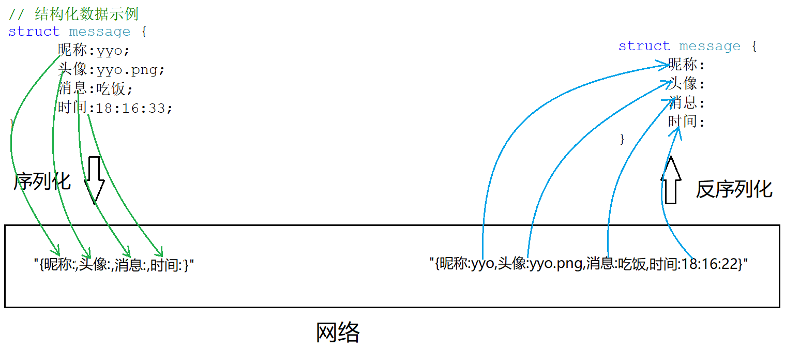

> 为什么要进行序列化和反序列化呢？

- 序列化为了应用层网络通信的方便；
- 反序列化为了方便上层使用数据。
- 序列化和反序列化本质就是将应用和网络进行了解耦。

之前进行UDP TCP通信的时候并没有使用序列化和反序列化，因为我们没有结构化的数据，**结构化的数据本质就是协议在代码层面的表现**。

> 怎么进行序列化和反序列化呢？

也就是说如何把结构化的数据和字符串相互进行转化，这个造轮子的工作是相对麻烦的，可以使用别人提供的组件，比如jsoncpp。

```sh
$ yum install jsoncpp-devel        # centos7安装jsoncpp

$ ls /usr/include/jsoncpp/json/    # json头文件
assertions.h  autolink.h  config.h  features.h  forwards.h  json.h  reader.h  value.h  version.h  writer.h

$ ls /usr/lib64/libjsoncpp.so -l   # json库文件
lrwxrwxrwx 1 root root 15 Jul 29 00:12 /usr/lib64/libjsoncpp.so -> libjsoncpp.so.0
```

#### Jsoncpp使用示例

```cpp
int a = 1;
std::string s = "abc";

Json::Value root; //承装对象
root["dataInt"] = a;
root["dataString"] = s;

// 两种序列化方式
Json::FastWriter fwriter;
std::string fast_string = fwriter.write(root);

Json::StyledWriter swriter;
std::string style_string = swriter.write(root);

std::cout << fast_string << std::endl;
std::cout << style_string << std::endl;

// 反序列化方式
std::string json_string = R"({"dataInt":1,"dataString":"abc"})"; //原始字符串

// Json::Value root;
Json::Reader reader;
reader.parse(json_string, root);

int data1 = root["dataInt"].asInt();
std::string data2 = root["dataString"].asCString();

std::cout << data1 << " " << data2 << std::endl;
```

### 0.2 实现网络计算器

> 既然没有场景使用序列化，我们就实现一个服务器版的计算器。客户端发送数据和操作符，服务器进行计算，最后结果返回给客户端。

#### 约定协议

1. 定义结构体来表示我们需要交互的信息；
2. 发送数据时将这个结构体按照规则转换成字符串，接收到数据后再按照相同的规则把字符串转化回结构体；

```c
//Protocol.hpp
#pragma once
#include <iostream>
//请求协议
struct request_t
{
    int x;       // 操作数1
    int y;       // 操作数2
    char op;     // 操作符 - "+-*/&"
};
//响应协议
struct response_t
{
    int status;  // 状态码 status为0表示计算正常，其他值表示异常退出
    int result;  // 计算结果
};

//序列化请求
std::string SerializeRequest(const request_t& req)
{
    Json::Value root;
    root["datax"] = req.x;
    root["datay"] = req.y;
    root["operator"] =req.op;
    Json::FastWriter writer;
    return writer.write(root);
}
// 反序列化请求
void DeserializeRequest(const std::string json_string, request_t& req)
{
    Json::Value root;
    Json::Reader reader;
    reader.parse(json_string, root);
    req.x = root["datax"].asInt();
    req.y = root["datay"].asInt();
    req.op = (char)root["operator"].asInt();
}

//序列化响应
std::string SerializeResponse(const response_t& resp)
{
    Json::Value root;
    root["status"] = resp.status;
    root["result"] = resp.result;
    Json::FastWriter writer;
    return writer.write(root);
}
//反序列化响应
void DeserializeResponse(const std::string json_string, response_t& resp)
{
    Json::Value root;
    Json::Reader reader;
    reader.parse(json_string, root);
    resp.status = root["status"].asInt();
    resp.result = root["result"].asInt();
}
```

> 通信双方都采用这个协议内容，都遵循变量的含义，这就是协议。

#### 计算器客户端程序

```cpp
//CalClient.cc
#include <iostream>
#include <string>
#include <cstdlib>
#include <jsoncpp/json/json.h>
#include "Socket.hpp"
#include "Protocol.hpp"

using namespace NSTcpSocket;

void Usage(std::string proc) {
    std::cout << "Usage \n\t" << proc << "server_ip server_port" << std::endl;
    exit(1);
}

int main(int argc, char* argv[])
{
    if (argc != 3) {
        Usage(argv[0]);
    }
    std::cout << "hello HttpClient" << std::endl;

    int sock = TcpSocket::Socket();
    TcpSocket::Connect(sock, argv[1], atoi(argv[2]));

    request_t req;
    std::cout << "Input the first data->";
    std::cin >> req.x;
    std::cout << "Input the second data->";
    std::cin >> req.y;
    std::cout << "Input the operator->";
    std::cin >> req.op;

    //序列化
    std::string enjson_string = SerializeRequest(req);
    TcpSocket::Send(sock, enjson_string);

    //反序列化
    response_t resp;
    std::string buffer;
    if (TcpSocket::Recv(sock, buffer)) {
        DeserializeResponse(buffer, resp);
        std::cout << "status[0:success]:" << resp.status ;
        std::cout << " result:" << resp.result << std::endl;
    }

    return 0;
}
```

#### 计算器服务端程序

```cpp
//CalServer.cc
#include <iostream>
#include <string>
#include <cstdlib>
#include <pthread.h>
#include <unistd.h>
#include <jsoncpp/json/json.h>
#include "Socket.hpp"
#include "Protocol.hpp"

using namespace NSTcpSocket;

static void Usage(std::string proc) {
    std::cout << "Usage \n\t" << proc << " port" << std::endl;
    exit(1);
}
void* RequestHandler(void* args)
{
    pthread_detach(pthread_self());
    int sock = *(int*)args;
    // 反序列化
    std::string buffer;
    if (TcpSocket::Recv(sock, buffer))
    {
        request_t req;
        DeserializeRequest(buffer, req);
        std::cout << req.x << req.op << req.y << std::endl;

        response_t resp = { 0,0 };
        switch (req.op) {
        case '+':
            resp.result = req.x + req.y;
            break;
        case '-':
            resp.result = req.x - req.y;
            break;
        case '*':
            resp.result = req.x * req.y;
            break;
        case '/':
            if (req.y == 0) resp.status = 1;
            else            resp.result = req.x / req.y;
            break;
        case '&':
            if (req.y == 0) resp.status = 2;
            else            resp.result = req.x & req.y;
            break;
        default:
            resp.status = 3;
        }
        //序列化
        std::string enjson_string = SerializeResponse(resp);
        TcpSocket::Send(sock, enjson_string);
    }
    close(sock);
    std::cout << "server done" << std::endl;

    return nullptr;
}
int main(int argc, char* argv[])
{
    if (argc != 2) {
        Usage(argv[0]);
    }
    std::cout << "hello HttpServer" << std::endl;
    uint16_t port = atoi(argv[1]);

    int sock = TcpSocket::Socket(); // 创建套接字
    TcpSocket::Bind(sock, port); // 绑定
    TcpSocket::Listen(sock); // 监听

    while (true)
    {
        int new_sock = TcpSocket::Accept(sock); // 接收连接

        pthread_t tid;
        pthread_create(&tid, nullptr, RequestHandler, (void*)&new_sock);
    }

    return 0;
}
```

#### 接口封装

顺手再对socket接口做封装一下。

```cpp
//Socket.hpp
#pragma once
#include <iostream>
#include <string>
#include <cstring>
#include <cstdlib>
#include <sys/types.h>
#include <sys/socket.h>
#include <netinet/in.h>
#include <arpa/inet.h>
#define BACK_LOG 5
namespace NSTcpSocket {
    class TcpSocket {
    public:
        static int Socket() {
            int sock = socket(AF_INET, SOCK_STREAM, 0);
            if (sock <= 0) {
                std::cerr << "socket error" << std::endl;
                exit(2);
            }
            return sock;
        }
        static void Bind(int sock, uint16_t port) {
            struct sockaddr_in local;
            memset(&local, 0, sizeof(local));
            local.sin_family = AF_INET;
            local.sin_addr.s_addr = INADDR_ANY;
            local.sin_port = htons(port);
            if (bind(sock, (struct sockaddr*)&local, sizeof(local)) < 0) {
                std::cerr << "bind error" << std::endl;
                exit(3);
            }
        }
        static void Listen(int sock) {
            if (listen(sock, BACK_LOG) < 0) {
                std::cerr << "listen error" << std::endl;
                exit(4);
            }
        }
        static int Accept(int sock) {
            struct sockaddr_in peer;
            socklen_t len = sizeof(peer);
            int new_sock = accept(sock, (struct sockaddr*)&peer, &len);
            if (new_sock <= 0) {
                std::cerr << "accept error" << std::endl;
                exit(5);
            }
            else {
                std::cout << "accept success" << std::endl;
                return new_sock;
            }
        }
        static void Connect(int sock, const std::string& ip, int16_t port) {
            struct sockaddr_in peer;
            peer.sin_family = AF_INET;
            peer.sin_addr.s_addr = inet_addr(ip.c_str());
            peer.sin_port = htons(port);

            if (connect(sock, (struct sockaddr*)&peer, sizeof(peer)) < 0) {
                std::cerr << "connect error" << std::endl;
                exit(6);
            }
            else {
                std::cout << "connect success" << std::endl;
            }
        }
        static bool Send(int sock, std::string& buffer) {
            ssize_t s = send(sock, buffer.c_str(), buffer.size(), 0);
            if (s > 0) {
                // TODO

            }
            else if (s == 0) {
                std::cout << "send remote quit ..." << std::endl;
            }
            else {
                std::cerr << "send error" << std::endl;
                exit(7);
            }
            return s > 0;
        }
        static bool Recv(int sock, std::string& buffer) {
            buffer.clear();
            char tmp[1024];
            ssize_t s = recv(sock, tmp, sizeof(tmp), 0);
            if (s > 0) {
                buffer = tmp;
            }
            else if (s == 0) {
                std::cout << "Recv remote quit ..." << std::endl;
            }
            else {
                std::cerr << "Recv error" << std::endl;
                exit(8);
            }
            return s > 0;
        }
    };
}
```

我们刚刚写的CS模式的在线计算器，本质就是一个应用层的网络服务，我们实现了：

1. 基本通信代码
2. 序列和反序列化
3. 定制业务逻辑和请求响应协议

> 实现了这些，就可以称为一个应用层的网络服务。
>
> 回头看一下OSI模型的上三层：应用层对应着我们实现的业务逻辑和协议，表示层对应着我们实现的序列和反序列化内容，会话层对应基本通信代码。所以可以看出OSI模型停留在表面的原因，这些东西需要用户手动实现。

&nbsp;

## 1. HTTP协议

> 前面虽然说，应用层协议是程序员自己定制的，但实际上，已经有工程师定制好了一些非常好用的应用层协议，如超文本传输协议 HTTP。所以我们目前就是要学习HTTP协议。

既然HTTP协议也是应用层协议，本质上和我们刚刚编写的在线计算器没有区别，那么HTTP内部一定自行实现了网络通信、序列化和反序列化、协议细节。稍后我们就围绕这三点讲解HTTP协议。

### 1.0 认识URL

URL其实就是我们俗称的”网址“，我们把在网络上请求的图片、网页、视频、音频、文档等等内容都称为“资源”，网址其实就是定位网络资源的一种方式。

IP加端口可以定位互联网上唯一一台主机，但如果我们还需要该主机上的资源文件，还要有路径。即我们**通过IP+路径，就可以唯一地确认一个网络资源**。

IP通常是以域名的方式呈现的，路径就是Linux主机上的目录，如下图所示：

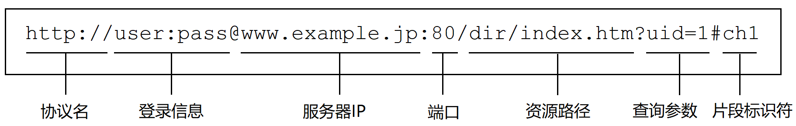

> 用户登录信息现在都是以表单的形式呈现，不再放到域名前了。端口一般也被省略了，因为协议都使用固定的端口。

#### url编码解码

既然`/`,`:`,`.`,`?`这些符号在URL中已经具有特殊意义，所以它们在URL中想以普通字符的形式出现，就必须做转义。转移规则如下：

将需要转义的字符转为16进制，然后从左到右取四位（不足四位当四位处理），每两位作一位前面加上`%`，编码成`%XY`的格式。

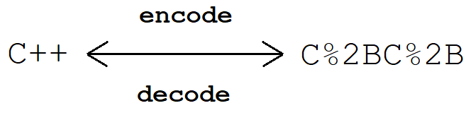

[URL转码工具](https://tool.chinaz.com/Tools/urlencode.aspx)

### 1.1 HTTP协议格式

HTTP是以行(\n)为单位构建请求和响应的协议内容的，所以无论请求还是响应协议几乎都由3或4个部分组成：

#### HTTP请求格式

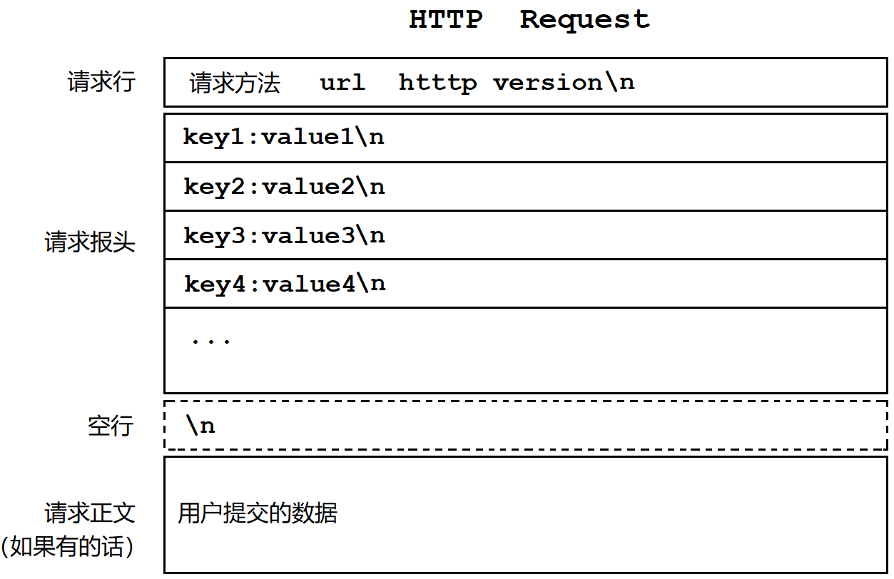

| 组成     | 内容                                                         |
| -------- | ------------------------------------------------------------ |
| 请求行   | 请求方法就是`GET`,`POST`之类的，`url`就是请求的资源路径，`http version`就是协议版本，以空格隔开 |
| 请求报头 | 有多组请求属性，每组属性都是键值对，每组属性结尾都是`\n`，最后遇到空行`\n`就表示报头结束 |
| 请求正文 | 空行之后的内容都是请求正文，正文允许为空。如果正文存在，报头中会存在属性`Content-Length`来表示内容长度 |

> 用浏览器输入服务器的IP和端口，连接我们的网络服务，就可以打印浏览器发送的HTTP请求协议内容。

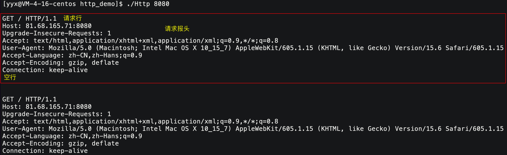

> 直接用recv去读取一个固定长度的缓冲区内容是不正确的，因为浏览器通常会连发几个请求，这样就不能保证准确地读取到所有请求。如何读取才是正确读取呢？

1. 首先我们每次读取只读取一个请求；
2. 读到空行的时候，说明前面都是报头内容，这样就获得了报头；
3. 解析报头内容，获取请求行中的请求方法，从而确定是否存在请求正文；
4. 如果有正文，解析`Content-Length`请求属性，从而确定请求正文的大小，就能准确读取所有内容。

#### HTTP响应格式

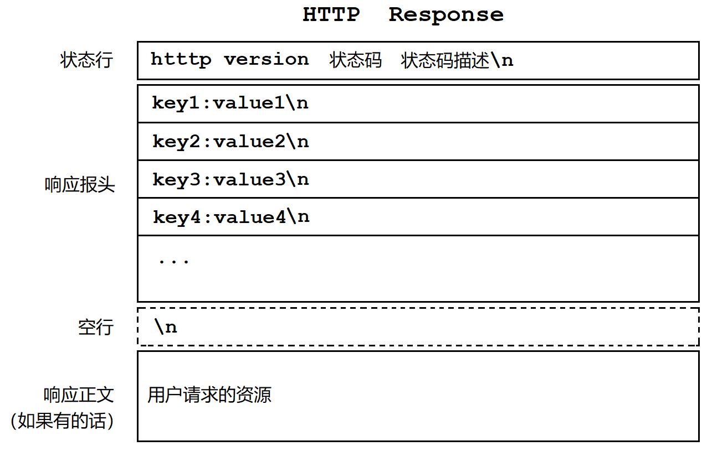

| 组成     | 内容                                                         |
| -------- | ------------------------------------------------------------ |
| 状态行   | 分别是`http version`，状态码，状态码描述，以空格分隔         |
| 响应报头 | 多组相应属性，都是键值对，以`\n`分隔，遇空行则结束           |
| 响应正文 | 空行之后都是响应正文，允许为空。如果正文存在，报头中会存在属性`Content-Length`来表示内容长度 |

#### 封装解包分用

> 不管是请求报头还是响应报头，都是由多部分组成，那HTTP协议如何解包、封装、分用的呢？

- HTTP请求内容和相应内容都可以看成一个大字符串，也就是按字符串格式发送的，读取也是同理。
- HTTP请求可以看成两部分，空行之前的总体被看成HTTP的报头，空行之后的请求正文被看成HTTP的有效载荷，响应内容也是这样。以空行分隔，来进行解包和封装。
- 分用不是HTTP协议需要解决的问题，由具体的应用层代码解决。但HTTP会提供相应接口。

### 1.2 HTTP的方法

| 方法    | 说明                   | 支持协议版本 |
| ------- | ---------------------- | ------------ |
| GET     | 获取资源               | 1.0 1.1      |
| POST    | 传输实体资源           | 1.0 1.1      |
| PUT     | 传输文件               | 1.0 1.1      |
| HEAD    | 获取报头首部           | 1.0 1.1      |
| DELETE  | 删除文件               | 1.0 1.1      |
| OPTIONS | 询问支持的方法         | 1.1          |
| TRACE   | 追踪路径               | 1.1          |
| CONNECT | 要求用隧道协议连接代理 | 1.1          |
| LINK    | 建立和资源之间的联系   | 1.0          |
| UNLINK  | 断开连接关系           | 1.0          |

> HTTP方法中我们只学习GET，POST方法。其他方法只了解即可，而且一般Web服务器安全起见都不开放这些方法。

简单的看，普通用户的上网行为无非就是两种形式：

- GET   ：从目标服务器拿到需要的资源；
- POST ：向目标服务器上传用户数据。

####  GET&POST对比

每次请求报头中请求行中的资源路径都是`/`，这个`/`的含义是 Web 根目录，具体路径在服务器程序中指定。

> 不过一般习惯是项目路径下的`wwwroot`目录文件，默认首页是 Web 根目录下的`index.html`。

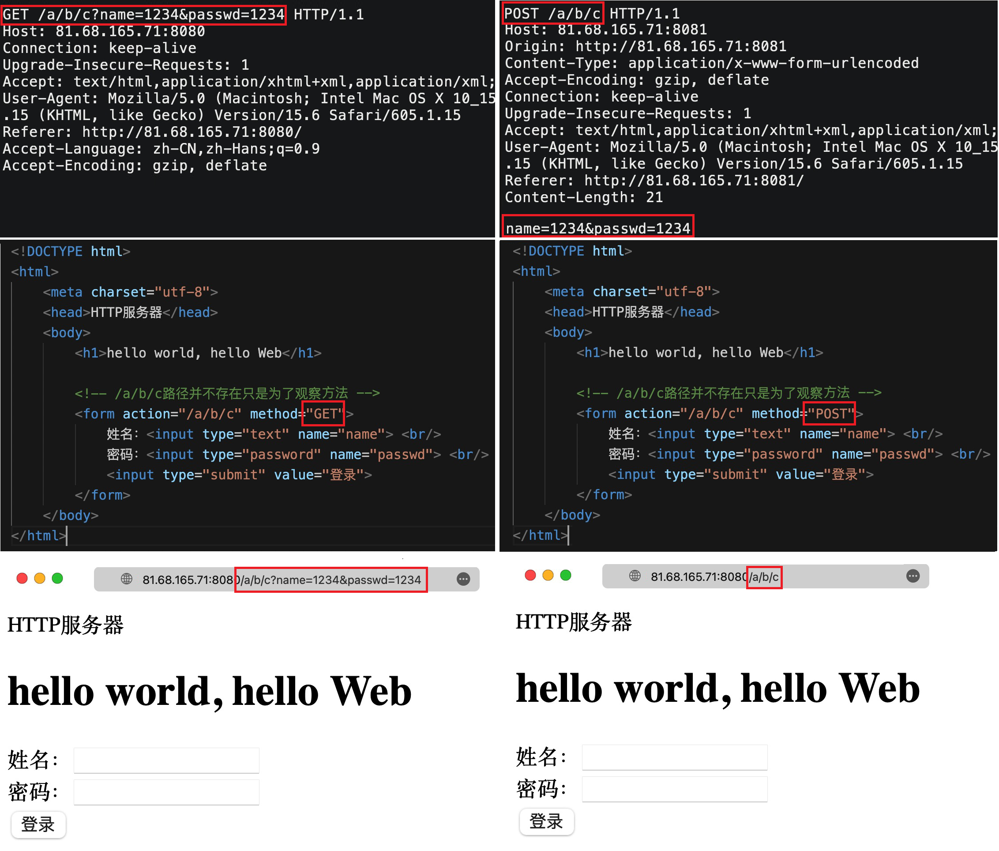

| 名称      | 场景                                     | 区别                                                         | 隐私性                                    |
| --------- | ---------------------------------------- | ------------------------------------------------------------ | ----------------------------------------- |
| GET 获取  | 常用的默认获取资源的方法，也可以提交参数 | 通过URL提交，url存在一定大小限制，具体和浏览器有关           | 直接回显在URL栏中                         |
| POST 推送 | 提交参数时较为常用的方法                 | 通过正文提交，正文一般无限制，但需要属性`Content-Length`表明长度 | 不会回显在URL栏中，较为私密但并不代表安全 |

不管是哪种方法，都是在将数据从前端发送到后端，故所谓HTTP协议处理，本质就是文本分析。

### 1.3 HTTP的状态码

> 由于应用层协议参与到的人员太多，编程水平素养参差不齐，很多人不明白不了解知道如何使用THHP协议的状态码索性瞎填胡填。导致浏览器厂商为防用户流失也无法坚持协议标准，慢慢就导致状态码标准不一，状态码渐渐地也就失去作用了。

| 状态码 | 类别          | 翻译             | 解释                       | 常见状态码                        |
| ------ | ------------- | ---------------- | -------------------------- | --------------------------------- |
| 1XX    | Informational | 信息性状态码     | 接收的请求正在处理         | 不常见                            |
| 2XX    | Success       | 成功状态码       | 请求正常处理完毕           | 200(OK)                           |
| 3XX    | Redirection   | 重定向状态码     | 需要进行附加操作以完成请求 | 302(Redirect)                     |
| 4XX    | Client Error  | 客户端错误状态码 | 服务器无法处理请求         | 403(Forbidden)<br/>404(Not Found) |
| 5XX    | Server Error  | 服务端错误状态码 | 服务器处理请求出错         | 504(Bad Gateway)                  |

- 浏览器并不会针对 404 状态码做出响应，需要客户端手动返回错误页面。404 属于客户端错误，是因为客户端访问不存在的资源。
- 服务端程序出现错误崩溃等问题，就是服务器错误，状态码应设置为504。
- 3XX的状态码代表重定向，重定向的意思是自动跳转到其他页面。
  - 301是永久重定向，一般是网站搬迁，域名更换，搭配属性`Location`使用。
  - 302/307是临时重定向，登录、付款等的自动返回。

### 1.4 HTTP的报头

| 报头属性       | 解释                                                         |
| -------------- | ------------------------------------------------------------ |
| Content-Type   | 正文内容的数据类型 [content-type对照表](https://blog.csdn.net/weixin_39527281/article/details/115322144) |
| Content-Length | 正文内容的长度                                               |
| Connection     | 请求的是否保持长连接，每次请求是复用已建立好的请求，还是重新建立新请求 |
| Host           | 客户端告知服务器，所请求的资源是在哪个主机的哪个端口上       |
| User-Agent     | 声明用户的操作系统和浏览器版本信息                           |
| referer        | 当前页面是从哪个页面跳转过来的                               |
| location       | 搭配 3XX 状态码使用,告诉客户端接下来要去哪里访问             |
| Cookie         | 用于在客户端存储少量信息.通常用于实现会话（session）的功能   |

## 2. 简单HTTP服务器

要求是按照HTTP协议的请求与相应内容，用浏览器访问我们的服务器，实现最简单的HTTP服务器。

```c
#include <iostream>
#include <string>
#include <fstream>
#include <sys/types.h>
#include <sys/stat.h>
#include <unistd.h>
#include <pthread.h>
#include "Socket.hpp"

using namespace NSTcpSocket;

#define WWWROOT "./wwwroot/"
#define HOME_PAGE "index.html"

void Usage(std::string proc) {
    std::cout << "Usage: \n\t" << proc << " port" << std::endl;
    exit(1);
}

void* HttpResquestHandler(void* args)
{
    pthread_detach(pthread_self());
    int sock = *(int*)args;

    std::string buffer;
    // 这种读法其实是不正确的
    if (TcpSocket::Recv(sock, buffer)) {
        std::cout << buffer; //打印HTTP的请求格式

        std::string home_page = std::string(WWWROOT) + std::string(HOME_PAGE); // 默认首页路径
        struct stat st;
        stat(home_page.c_str(), &st); // 以待获取文件信息

        std::string http_response;
        http_response += "http/1.0 200 OK\n"; // 状态行
        http_response += "Content-Type: text/html; charset=utf-8\n";  // 响应报头
        http_response += "Content-Length: ";
        http_response += std::to_string(st.st_size); // 补齐正文内容属性数据
        http_response += "\n\n";  // 补齐属性的换行和空行

        //响应正文是index.html的文件内容
        std::ifstream ifs(home_page);
        if (!ifs.is_open()) {
            std::cerr << "ifs open fail" << std::endl;
        }
        else {
            char buffer[st.st_size + 1];  // 以文件大小创建缓冲区
            memset(buffer, 0, sizeof(buffer));
            ifs.read(buffer, st.st_size); // 将文件内容读进缓冲区
            http_response += buffer;
        }

        TcpSocket::Send(sock, http_response);
    }
    close(sock);
    return nullptr;
}

int main(int argc, char* argv[]) {
    if (argc != 2) {
        Usage(argv[0]);
    }
    uint16_t port = atoi(argv[1]);

    int listen_sock = TcpSocket::Socket();
    TcpSocket::Bind(listen_sock, port);
    TcpSocket::Listen(listen_sock);

    while (true) {
        int sock = TcpSocket::Accept(listen_sock);
        if (sock > 0) {
            pthread_t tid;
            pthread_create(&tid, nullptr, HttpResquestHandler, (void*)&sock);
        }
    }
    return 0;
}
```

&nbsp;

## 3. 补充内容

### 3.1 cookie和session

**HTTP协议本身是一种无状态的协议**，即每次打开新网页都是一次新请求新连接。曾经的请求并没有记录，他只关心本次的请求是否成功。

但在我们访问某个网站时经常有这样的体验：第一次访问需要我们登录，之后的第二次第三次甚至一段时间内都不需要我们再次登录，可以说“网站是认识我们的”。

HTTP只是用来提供网络资源收发的基本功能，这样“会话保持”方便的上网体验是由 Cookie 提供的。

1. **cookie 的本质是一个文件，该文件中保存的是用户的私密信息**，如用户名密码等用来认证的信息。
2. 只要网站存在对应的 cookie，在**发起任何HTTP请求的时候都会自动在请求报头中携带该 cookie**。

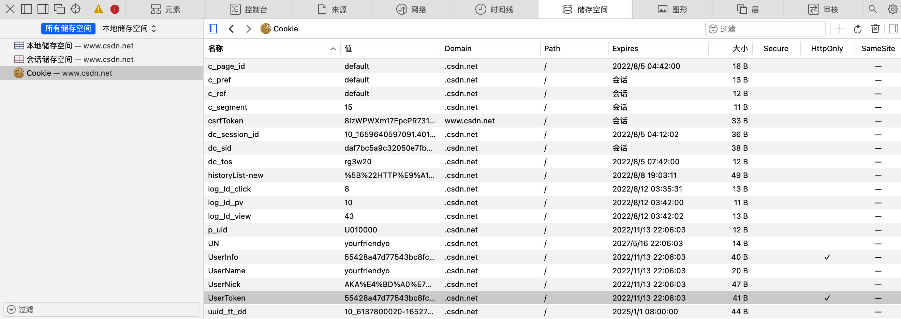

第一次发起HTTP登录请求的时候，如果用户名密码信息正确就会被浏览器保存在本地 cookie 中，可以保存在磁盘文件也可以是内存中，后续的请求都会携带上该 cookie，所以之后的访问就不用再手动登录了。

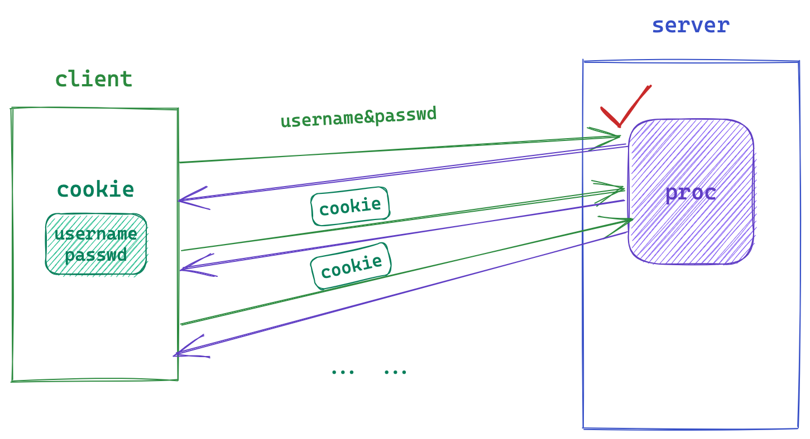

> 虽然现在很少有会把用户名密码放在cookie中了，有更安全的方式，但这确实是 cookie 的最初的用法，用来理解 cookie 的作用再好不过。

可以在响应报头中添加属性`Set-Cookie`，让客户端每次请求都带上`Set-Cookie`中要求的内容。

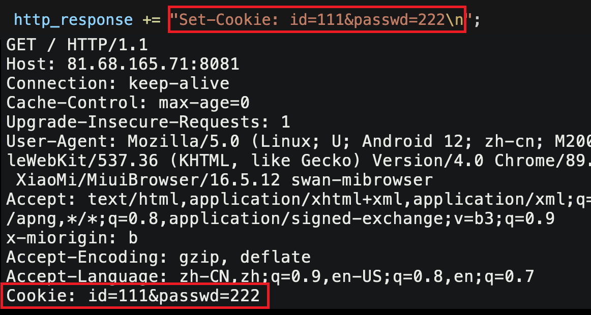

本地cookie文件会保存浏览器中类似于用户名密码、用户浏览记录这些非常私密的信息，如此一来一旦有人盗取Cookie文件，就可以以用户身份访问特定资源，或者盗取用户认证信息。

单纯使用Cookie是具有一定安全隐患的，因此就出现了 session。**session 的核心方案是将用户的私密信息保存在服务器端**。具体如下：

1. 客户端在首次登录提交用户名密码后，服务端认证通过会形成 session 文件，该文件存在于服务器磁盘中，文件用来保存用户的私密信息。
2. 形成 session 文件后，服务器在构建 HTTP 响应，响应报头中就有类似于`Set-Cookie: session_id=123 `的属性，被称为当前用户的会话ID。session_id具有唯一性，每个用户都有一个session_id。
3. 客户端本地就会形成对应的 cookie 文件，存有当前用户的session_id，依旧每次请求都携带该session_id，由服务端接收后进行对比认证。

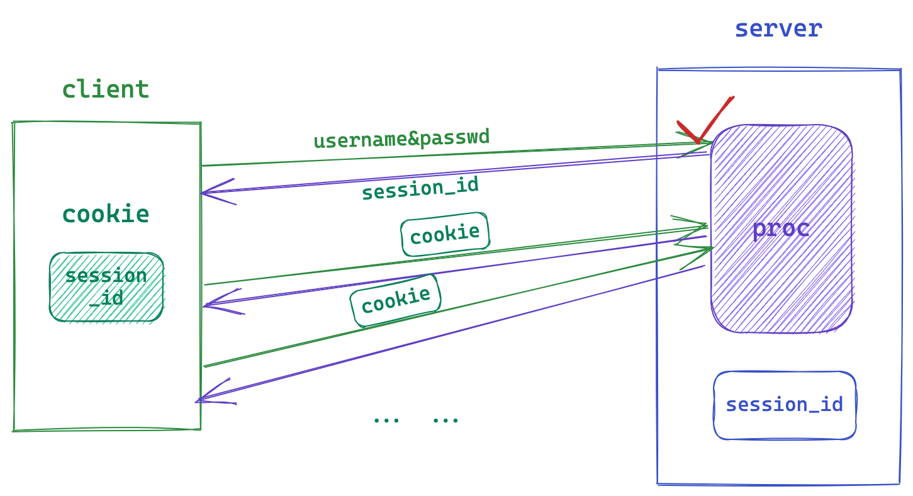

**如此 cookie 和 session 结合使用利用 session_id 就能避免用户私密信息在网络上传输的尴尬情况**。虽然没有彻底解决信息被盗的情况，但也由此衍生出各种方案，如检查常用IP归属地，邮箱短信二次认证等。

> 不管cookie还是session本质都是为了更好更安全的用户体验。

### 3.2 HTTPS

#### 宏观结构

HTTPS 相比 HTTP 就多了一个安全环节即 TLS/SSL 属于数据的加密解密层，对于开发而言并不是重点，是网安工程师的任务，我们只需要有宏观认识即可。

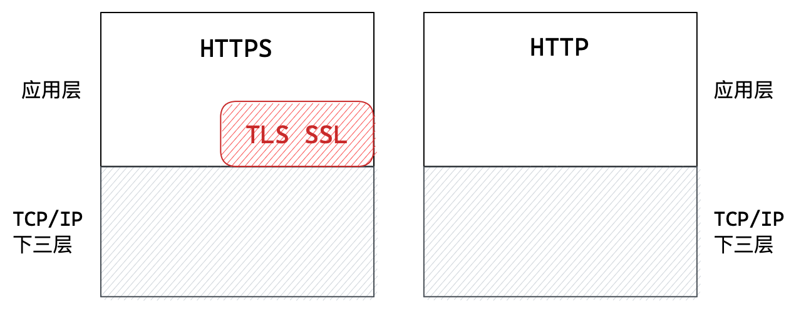

TLS和SSL属于应用层协议，以至于数据只有流到应用层时才会被加密，也就是数据在网络中总是被加密的，而在应用层以下的传输层、网络层、链路层时没有加密的。

事实上，HTTPS的所有内容如状态行、报头、正文等都是被加密的。整体看来只有应用层才有加密解密的行为，其他层看来都和HTTP一样。

> 接下来认识一下加密解密的方式，同样也是认识原理，不作深入了解。

#### 对称加密

所谓对称加密，就是加密解密的密钥相同，用该密钥加密也用该密钥解密。可以简单化类比异或运算的特点：你异或他等于我，我异或他等于你。

~~~cpp
server_data = client_data ^ key; // 客户端数据用key加密后发送给服务端
client_data = server_data ^ key; // 服务端数据用key解密后得客户端数据
~~~

如果我们想用对称加密，就需要先让通信双方获得密钥，这就存在一个先有鸡还是先有蛋的问题，显然是不可取的。

#### 非对称加密

非对称加密，就是存在两个密钥，一个是公钥一个是私钥。

- 公钥即公开的所有人都有的密钥，私钥是只有通信一方具有的密钥。
- 公钥私钥必须同时使用，即用公钥加密就必须用私钥解密，用私钥加密就公钥解密。

1. 服务端将公钥明文发送给客户端，
2. 客户端用公钥加密数据后将数据发送给服务端，
3. 只有服务端能用私钥解密，故服务端安全地获得该数据。

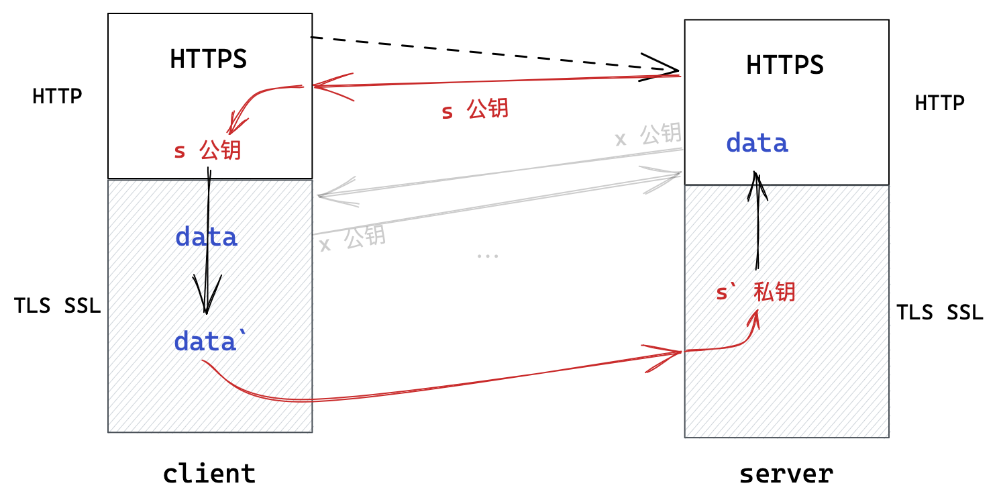

也就是说，数据可以安全地从客户端到服务端，反之则不行，即只能进行单向加密。

> 如果采用两对公私密钥的方式，虽然可以双向加密但非对称加密时间成本太高，同样不可取。

#### 混合加密

实际使用时，既不是纯对称加密，也不是纯非对称加密，而是混合起来的。

既然非对称加密可以将数据安全地从一方送往另一方，密钥本质上也是一种数据，那么将数据替换成密钥，该密钥就能安全地被通信双方获取到。既然如此，通信双方使用该密钥对称加密即可。即：

1. 通信一方先先接受到对方明文发来到密钥；
2. 用对方的公钥生成一份密钥，将该密钥使用非对称加密的方式发送给对方。以上称为**密钥协商**阶段。
3. 对方收到后私钥解密就得到了该密钥；
4. 之后通信双方使用该密钥进行对称加密通信即可。

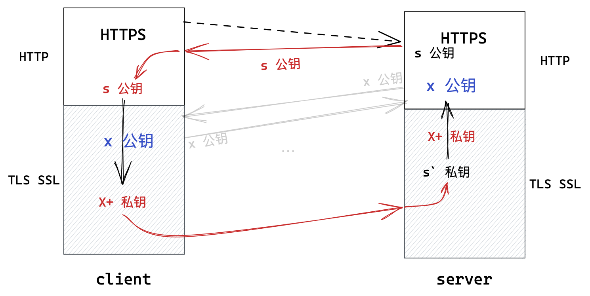

> 这样做真的就万无一失了吗？其实不然，在上述密钥协商阶段是存在中间人私自更换密钥的风险的。

在网络通信中，随时都可以存在中间人来偷窥、修改通信双方的数据，所以我们只能左右该数据是否被加密。

1. 在密钥协商阶段，**服务端向客户端发送明文公钥`S`时，被中间人截取，换成了中间人的公钥`M`并发给了客户端**。
2. 客户端生成接下来使用的密钥`X`并使用公钥`M`将其加密，然后将加密数据`M+(X)`发送给服务器。
3. **中间人截取到该数据后用其私钥`M'`解密，得到密钥`X`，再用服务端的公钥`S`加密后发往服务器**。
4. 服务器用`S'`对其解密得到密钥`X`。

自此通信双方的对称加密密钥`X`被中间人获取，数据加密形同虚设。

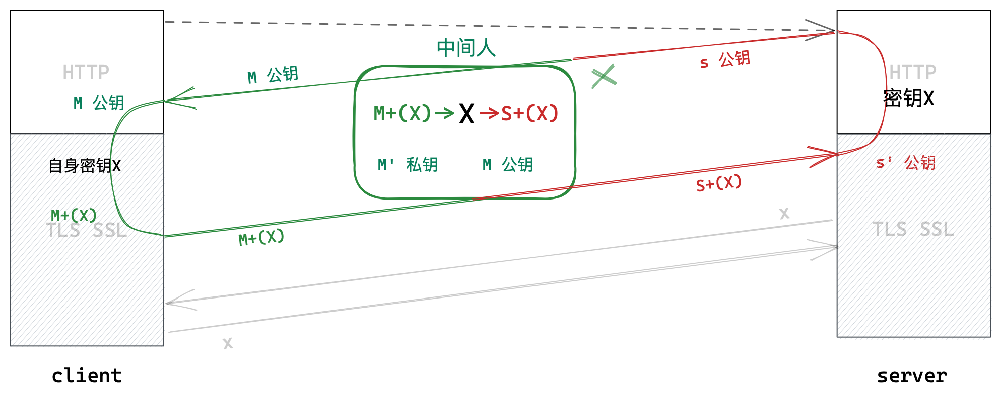

**产生上述问题的关键在于：客户端不能判断获取到的公钥是否是合法服务端发来的**。因此，我们必须赋予客户端辨别公钥是否被篡改的能力。

#### 数据防篡改

> 那么如何防止数据的内容被篡改呢？网络中的数据的公开的，所谓防止也就是能够识别到文本是否被篡改。 

##### 生成步骤

1. **针对文本内容作 Hash 散列，形成固定长度的唯一字符序列，即数字指纹/数字摘要**。哪怕文本内容只是一丁点不同，形成的数字指纹的差异都很大。
2. **针对形成的数字指纹，使用私钥加密形成文本的数字签名。**
3. 将数据文本内容和数字签名合在一起，发送给通信对端。

##### 校验步骤

1. 将接收到的数据指纹和文本内容分开；
2. 将文本内容再通过 Hash 散列，重新形成数字指纹；
3. 将数字签名通过公钥解密解密，得到数字指纹；
4. 将解密得到的数字指纹和Hash形成的数字指纹对比，如果一样说明没有被修改，如果不一样说明文本被篡改了。

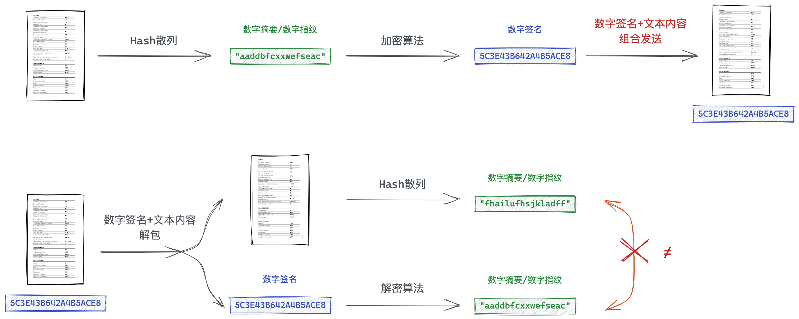


##### CA证书机构

由此出现一种权威机构 CA证书机构，具有绝对权威的地位。

- 只要服务商将自身基本信息如域名、公钥等提交给CA证书机构，证书机构就会采用上述生成步骤生成证书颁发给服务端。

- 只要服务商有证书，客户端就信任该服务商，采用上述校验步骤校验数据内容是否被篡改，就不会出现问题了。

1. 在上述的生成过程中，所谓数据文本内容就是服务商的基本信息，包含域名和公钥。
2. 再将 hash 散列结果即**数字指纹，用自己的私钥加密，形成数字签名**。基本信息和数字签名组合起来称为证书，并颁发给服务商。
3. 此时中间人仍能获取并解密证书，但**因为中间人没有CA证书机构私钥`A'`因此无法进行修改证书**。
4. 客户端收到证书后按校验步骤进行校验即可，校验成功后拿去基本信息中的公钥，将自身密钥加密发送给服务端，即可进行对称加密通信。

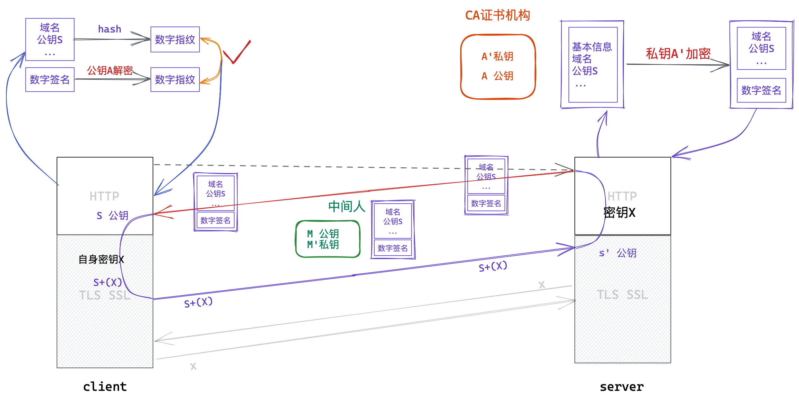

一旦中间人修改了证书中任意内容，客户端都能在校验中对比数据摘要时发现，因此中间人无法修改。中间人没有证书机构的私钥`A'`，就无法对修改后的证书重新进行加密生成数字签名，一旦修改，客户端就能发现。
