## 权限管理

#### shell 命令运行原理

~~~sh
[yyx@VM-4-16-centos ~]$
~~~

这样的一行文字就是命令行，后面的写的命令就叫做命令。使用 which 就可以查看我们所写的命令的所在目录，可以看出，Linux下的命令就是一项可执行文件。

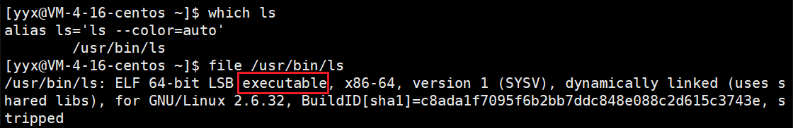

一般我们所说的操作系统，包括 Linux，指的是内核（kernel）和外壳程序。以 Windows 为例，Windows 的外壳就是Windows 的图形界面，而 Linux 的外壳即 shell，内核就是 Linux内核。

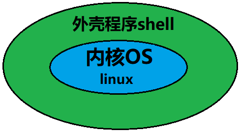

如果直接让用户与操作系统内核沟通，那么用户就必须熟悉操作系统，这样学习成本太高也不安全，所以 Linux 设立 shell 作为媒介中间人给操作系统传达用户的指令。shell 的定义就是命令行解释器，用于将使用者的命令翻译给操作系统核心处理，再将核心的处理结果翻译给用户。

> 对比 Windows，我们也不是直接和内核沟通，而是通过图形界面完成点击等一系列动作去操作系统。

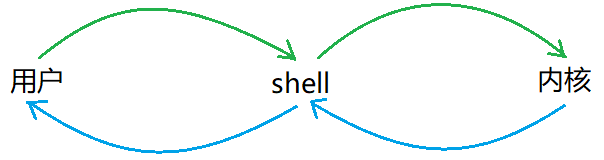

如果说 shell 是命令行解释器是所有外壳程序的统称，bash 就是 Linux 下的命令行解释器，bash 是最常用的一种 shell，是 Linux 下默认的 shell。如果将 shell 比喻成程序员是一种职业，bash 就是在座的你我一个具体的人。

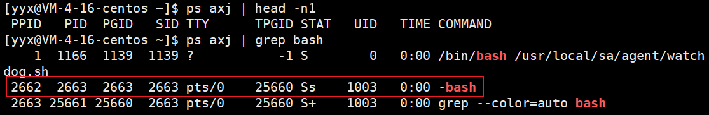

&nbsp;

### 1. 权限的定义

Linux 中默认存在两类用户，一类叫 root 即超级管理员，具有非常高的权限，其他都是普通用户，具有一般权限。可以使用`su`进行用户切换：

~~~sh
[yyx@VM-4-16-centos ~]$ su - # 切换成root
Password: 
Last failed login: Fri Jan 28 03:23:06 CST 2022 on pts/0
[root@VM-4-16-centos ~]#
~~~

> root用户的权限非常高，所以两类用户的权限界限必须明确。

~~~sh
#1.
[root@VM-4-16-centos ~]#  su yyx  # 切换成普通用户
#2.
[root@VM-4-16-centos ~]# exit  # 切换成普通用户
logout
[yyx@VM-4-16-centos root]$ 
~~~

两种方式都可以切换用户，但不建议使用第一种，因为使用`su`切换用户的话，原用户并没有退出登录，这样系统会保留原用户的 bash 再创建其他用户的 bash。若使用第二种，也就是退出原用户就自动切换回来，销毁了原用户的 bash，更加节省系统资源。

> 使用`sudo`命令可以临时提升用户权限，需要配置信任用户目录。

&nbsp;

### 2. 权限的设计

> 不是VIP就不能看会员电影，不是职员就不能进入办公室，权限是针对某个事物的一项特定的属性来划分不同的人具有不同的权限。

在系统管理中，权限是指特定的用户具有特定的系统资源使用权力。通常，系统管理员针对某个特定资源分配给用户不同的权限，系统则自动地强制执行这些权限。

所以，权限描述的就是人和事物属性的关系。接下来的文件访问者的就是人，文件类型及访问权限就是事物属性。

#### 2.1 文件访问者的分类

文件访问者分为三种：拥有者（owner），所属组（group），其他人（others）。

1. 拥有者：即创建文件的用户，这不难理解。
2. 所属组：拥有者所在的组，如果文件访问者之分拥有者和其他人的话，不便于多用户协作。
3. 其他人：除了拥有者和所属组之外的都是其他人。

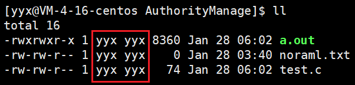

上图用红框框出的第一列是文件的拥有者，第二列是所属组。由于用户较少所以自成一组。

拥有者、所属组和其他，都是针对文件划分出的角色，而 root 和普通用户指的是具体的用户人。

> 后面一列是文件的大小，再后面一列是文件的最近修改时间。

#### 2.2 文件类型和访问权限

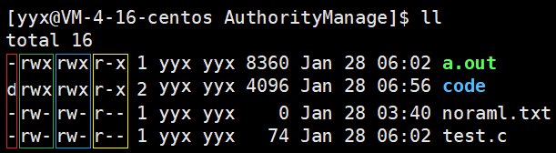

可以清晰地看出，前面的一整块共有10列，共分成4组，第一列自成一组，之后每三列成一组，分别是红、绿、蓝、黄。

文件属性的第一列，用以区分文件类型，一般有两种：`-`代表普通文件，`d`代表目录。Linux 中不以文件后缀作为区分文件的方式，只以属性的第一列区分。

> `c`代表字符设备文件，`b`块设备文件，`p`管道文件，`l`链接文件。这些目前仅作了解。

#### 2.3 权限的表示

文件属性的剩下九列，三三为一组，分别代表的是文件拥有者、所属组和其他人对文件的权限。文件的权限分为三种，读`r`，写`w`，执行`x`。

##### 字符表示法

> 字符表示法就是上图中对应的表示方式。

- 第一组，代表拥有者对该文件的权限。三列分别代表读`r`、写`w`、执行`x`，具有权限就用字符表示，不具有则用`-`表示。顺序不能乱。
- 以此类推，后面两组分别是所属组和其他人的权限，表示方法相同。

| Linux表示 | 说明           | Linux表示 | 说明       |
| --------- | -------------- | --------- | ---------- |
| `r--`     | 只读           | `-w-`     | 只写       |
| `--x`     | 执行           | `rw-`     | 可读可写   |
| `r-x`     | 可读可执行     | `-wx`     | 可写可执行 |
| `rwx`     | 可读可写可执行 | `---`     | 无任何权限 |

##### 8进制数字表示法

既然每一个权限位所表示的状态只有两种，要么具有要么不具有，这样就可以用二进制表示（具有用1表示，不具有用0表示）。转化成八进制就是从0到7共八个数字，所以用八进制也可以表示。

| 权限符号 | 二进制 | 八进制 |
| -------- | ------ | ------ |
| `r--`    | 100    | 4      |
| `-w-`    | 010    | 2      |
| `--x`    | 001    | 1      |
| `rw-`    | 110    | 6      |
| `r-x`    | 101    | 5      |
| `rwx`    | 111    | 7      |
| `-wx`    | 011    | 3      |
| `---`    | 000    | 0      |

> 上述两种表示方法，都会在之后的权限设置的命令中使用到。

&nbsp;

### 3. 权限的设置

修改文件的权限分为两种，一是修改文件的读写执行属性，二是修改文件的拥有者和所属组。先看第一种：

#### 3.1 chmod

~~~sh
$ chmod u+r fileName
~~~

`chmod`可以针对三种访问者修改文件的读写执行权限。具体如下：

~~~sh
# u表示拥有者user
$ chmod u+r file.txt # 给拥有者添加读权限
$ chmod u-w file.txt # 给拥有者取消写权限
$ chmod u-x file.txt # 给拥有者取消执行权限
# g表示所属组group
$ chmod g+r file.txt # 给所属组添加读权限
$ chmod g-w file.txt # 给所属组取消写权限
$ chmod g-x file.txt # 给所属组取消执行权限
# o表示其他人other
$ chmod o+r file.txt # 给其他人添加读权限
$ chmod o-w file.txt # 给其他人取消写权限
$ chmod o-x file.txt # 给其他人取消执行权限
~~~

- `u`,`g`,`o`分别表示三种访问者，`+`,`-`分别表示添加和取消，`r`,`w`,`x`分别表示读写执行。之后再带上文件名即可。

~~~sh
$ ll
---------- 1 yyx yyx 74 Jan 29 05:50 file.txt
$ chmod u+r file.txt # 修改单个访问者的单个权限
$ ll
-r-------- 1 yyx yyx 74 Jan 29 05:50 file.txt
$ chmod u-r+wx file.txt # 修改多个访问者的多个权限
$ ll
--wx------ 1 yyx yyx 74 Jan 29 05:50 file.txt
$ chmod u+r,g+r file.txt # 修改多个访问者的单个权限
$ ll
-rwxr----- 1 yyx yyx 74 Jan 29 05:50 file.txt
$ chmod u+rwx,g+rwx,o+rwx file.txt # 修改多个访问者的多个权限
$ chmod a+rwx file.txt 
$ ll
-rwxrwxrwx 1 yyx yyx 74 Jan 29 05:50 file.txt

$ chmod u-r file.txt test.c # 连续操作多个文件
~~~

- chmod 支持连续修改多个访问者的权限，也支持连续修改单个访问者的多个权限，也支持连续修改多个访问者的多个权限，也支持连续操作多个文件。

~~~sh
$ chmod 777 file.txt # 权限值为7也就是rwx
$ chmod u+rwx,g+rwx,o+rwx file.txt # 这两种是等价的
$ ll
-rwxrwxrwx 1 yyx  yyx     0 Jan 29 07:48 file.txt
$ chmod 555 file.txt 
$ ll
-r-xr-xr-x 1 yyx  yyx     0 Jan 29 07:48 file.txt
~~~

- 在前面已经介绍过，八进制数字的方案也能够表示访问者的权限，所以就可以用上述代码中的修改方式。两种方式都是等价的。

~~~sh
# ll
-rw-rw---- 1 yyx  yyx    19 Jan 29 07:11 file.txt
-rw-r--r-- 1 root root    0 Jan 29 06:11 root.txt
# cat file.txt
hello linux
# echo "hello Linux" >> file.txt 
# ./file.txt
~~~

可以看到虽然 file.txt 中其他人不具有任何权限，但实际上 root 用户是不受任何限制的。

#### 3.2 chown & chgrp

chown 可用于修改文件的拥有者，chgrp 则是用于修改文件的所属组。

~~~sh
$ chown usrname fileName
$ chgrp usrname fileName
~~~

~~~sh
$ chown root file.txt
chown: changing ownership of ‘file.txt’: Operation not permitted
~~~

- 可以看出，文件是不能随便更改所有者给别的用户的，即使是文件所有者也不行。

~~~sh
$ chmod u+rwx,g+rwx,o-rwx file.txt
$ chgrp root file.txt
$ ll
total 12
-rwxrwx--- 1 yyx  root   20 Jan 29 07:15 file.txt
~~~

可以通过上述的这样的设置方法，达到只将文件交给组内成员查看管理的目的。

~~~sh
$ chgrp root file.txt # 普通用户将文件所属组更改为其他用户不被允许
chgrp: changing group of ‘file.txt’: Operation not permitted
# sudo chgrp root file.txt
$ ll
-rw-rw-r-x 1 yyx  root   20 Jan 29 07:15 file.txt
$ chgrp yyx file.txt # 文件拥有者可以将文件所属组改回自己
$ ll
-rwxrwx--- 1 yyx  yyx    20 Jan 29 07:15 file.txt
~~~

还有一个小注意点是，普通用户将文件所属组更改为其他用户不被允许，但是文件拥有者可以将文件所属组改回自己。

~~~sh
$ sudo chown root:root file.txt
~~~

- 按照这样的方式，可以将文件的拥有者和所属组一起修改。

> 规定了拥有者和所属组，其他人的范围就明确了，所以不需要单独设定。

#### 3.3 目录的权限

> 普通文件的读写执行分别代表着什么含义，这对于我们来说是很明确的。但目录的读写执行分别又代表什么意义呢？与普通文件有什么不同呢？

~~~sh
$ ll
total 4
d-wxrwxr-x 2 yyx yyx 4096 Jan 29 08:06 code
$ ls code # 不具备读权限，无法查看目录下内容
ls: cannot open directory code: Permission denied
#
$ ll
total 4
dr-xrwxr-x 2 yyx yyx 4096 Jan 29 08:06 code
$ touch code/file.txt # 不具备写权限，无法创建或删除文件
touch: cannot touch ‘code/file.txt’: Permission denied
#
$ ll
total 4
drw-rwxr-x 2 yyx yyx 4096 Jan 29 08:06 code
$ cd code # 不具备执行权限，无法进入目录
-bash: cd: code: Permission denied
~~~

由上述代码可得：

| 权限        | 解释                       |
| ----------- | -------------------------- |
| `r`读权限   | 能够查看目录下的内容       |
| `w`写权限   | 能够下目录下创建或删除文件 |
| `x`执行权限 | 能够进入目录               |

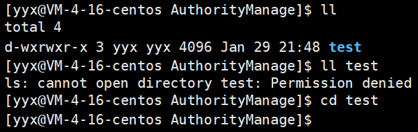

当用户只具有可执行但不具有读权限时，只能进入但无法查看目录下的内容。

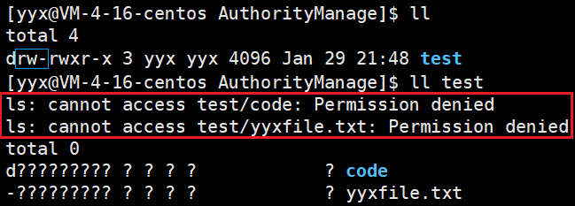

当用户对目录具有读但不具有可执行的权限时，只能查看目录下文件的名称，无法查看其他属性信息。

> 这些都是 Linux 设计出的，这么设计肯定是有他的道理，用户只需遵守即可。

##### 粘滞位

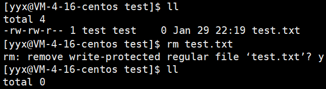

根据目录的权限规定，只要用户对目录具有写入权限，那么目录内的他人所创建的文件，用户不经他人同意也可以删除。但有时又需要给other 设定写入权限即创建文件，但又不想让 other 具有删除其他用户文件的权限，针对这种需求，Linux 下可以使用粘滞位解决。

~~~sh
[yyx@VM-4-16-centos AuthorityManage]$ chmod o+t dirName
~~~

注意，粘滞位是对目录进行修改的，对目录下的所有文件生效。

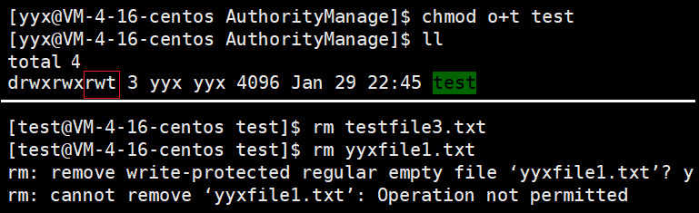

**`t`相当于权限缩小版的`w`，致使 other 无法删除其他用户的文件。**

所以当一个目录被设置为粘滞位时，则该目录下的文件只能由 root 超级管理员，目录所有者，文件的所有者，三者可以删除。

#### 3.4 默认权限的设置

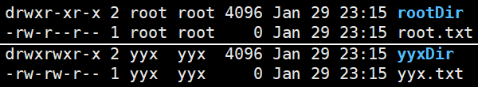

上图分别是 root 和 普通用户 创建的目录和普通文件的默认权限，稍加分析可得：

- 普通用户所创的普通文件和目录都只限制了 other 的写入权限，普通文件本不具有执行权限。
- root 用户在此基础上还限制了所属组的写入权限。

> 普通用户的普通文件权限可表示为0664，目录可表示为0775。下面将介绍为什么默认权限会是这个样子。

##### 文件掩码 umask

实际上所创建的文件和目录的权限，在其新建的时候的默认权限（起始权限）用八进制数位表示分别为0666和0777。起始权限还要受到权限掩码 umask 的影响，才会变成默认权限值。

换句话说，文件的默认权限是可以更改的，更改文件掩码 umask 的值即可。umask 可以这样设置和查看：

~~~sh
$ umask # 查看
0002
$ umask 0002 # 设置
~~~

**将起始权限值“减去”文件掩码值后，所得结果就是文件生成的默认权限值**。“减去”掩码的操作是这样的：将文件权限值都用二进制表示，起始权限值和文件掩码值每位一一对应，倘若文件掩码的某个数位为1，那么该位的结果必须为0。

~~~sh
  110 110 110   # 起始权限
- 000 000 010   # 文件掩码
----------------
  110 110 100   # 默认权限
  
  111 111 111   # 起始权限
- 000 000 010   # 文件掩码
----------------
  111 111 101   # 默认权限
~~~

这样的“减法”运算，就可以将文件掩码取反后再和起始权限相与即可，即`mask&(~mask)`。从中也可以看出，文件掩码的意义，即想要哪一位的权限为0，对应位的值就为1，也就是 umask 中出现的位，都要在结果中去掉。

> 其实在实际开发中，文件掩码的最佳的默认值就是0002。这是 Linux 几十年发展的自然选择。
