> 网络层和数据链路层考虑不再是通信双方的问题，而是数据在路上传输的问题。
>
> 令人难受的是现在的网络已经建设的很成熟了，大到没有人能理清楚地球上所有的网络节点，所以这个阶段的学习需要一定的想象力。
>
> 下两层不是软件开发面试的高频考点，但为了构建网络的全貌性的认识，还是有必要学习的。

# 网络层

## 1. IP协议

### 1.0 预备知识

> TCP和IP协议的区别，各自负责的是什么任务？

完成一件很大的事一般需要有两种角色：一种人来决策，一种人来执行。对于网络传输任务来说，TCP协议负责决策，IP协议负责执行。 

- **IP协议的能力是以较大概率将数据跨网络传输到对端主机上**，也就是IP向上层提供了这样的功能；
- **TCP在此基础上维护网络传输的可靠性和效率**。

> 如何理解IP地址？

- **IP地址包含两个部分，网络号和主机号**。

数据包在网络中传输，需要网络号来查找通信主机所在的网段，到达所在网段后，再通过主机号查找该局域网中的通信主机。

> 就像去北京天安门旅游，出发先是去北京，到了北京在找天安门。

### 1.1 IP协议段格式

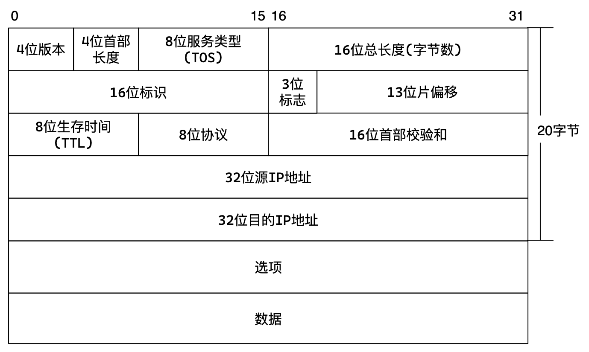

> 校验和不讲，就是用来校验报文是否在传输过程中发送变化的。选项也不讲，所以IP协议标准长度20字节。

| 字段        | 解释                                                         |
| ----------- | ------------------------------------------------------------ |
| 4位首部长度 | 基本单位也是4字节，用来表示报头长度，和TCP一样               |
| 16位总长度  | IP不是面向字节流的，它也是一次读取整个报文，所以需要表示整个报文长度 |
| 8位协议     | 表示有效载荷具体要提交给的上层协议，上层协议会将自己填写到8位协议中 |
| 4位版本     | 指定IP协议的版本，IPv4就是4，和IPv6是不兼容的                |
| 8位服务类型 | 3位优先权字段（已弃用），4位TOS字段，1位保留字段（置0）<br/>4位TOS分别时最小延迟、最大吞吐量、最高可靠性、最小成本，用来选择IP报文的类型 |
| 8位生存时间 | 每经过一个节点生存时间就减1，如果生存时间减到0报文就被废弃，用来清理无效报文 |

#### 报文分片

由于底层数据链路层一次发送报文的有效载荷的大小是有限制的，称为MTU，一般为1500字节。

> 这个大小限制是可以更改的，但如果报文大小大于路上的节点，还要进行分片。

如果**IP报文过大，就必须分成多个数据包交给链路层，这就是分片**。分片是网络层IP协议的事情，所以组装也是对端网络层的事情。

分片不是必须的，分片会提高报文丢失的风险，所以一般非必要不分片。

1. 可以在传输层控制每个报文的大小，这样就不会在IP层分片了。
2. 一旦存在IP报文丢失，所有IP报文都被丢弃，反映到传输层就认为报文丢失就触发重传机制。

链路层有效载荷最大是1500个字节，再去掉网络层IP协议的报头20字节，也就是说**如果不想在网络层发生分片的话，IP协议的有效载荷最大为1480个字节**。

```c
// 伪代码
while (msg > 1480) {
    new_msg = 1480; // 拆分出新报文
    msg -= 1480;    
    box.push_back(new_msg + 20); // 压入新报文
}
box.push_back(msg);
```

> 假设网络层存在一个3420大小的IP报文。那么就可以分片成3个报文，有效载荷分别是1480、1480、440，再给它们加上报头即可。

$$
3420=20+3400=20+(1480+1480+440)\\
分成三个报文=>(20+1480)+(20+1480)+(20+440)
$$

> 对端如何组合呢？就需要有字段表示分片次序等内容。

| 字段       | 解释                                                         |
| ---------- | ------------------------------------------------------------ |
| 16位标识   | 独立报文的标识各不相同，只有被分片的报文的标识是一致的，可以根据标识查找分片的报文 |
| 13位片偏移 | 片偏移表示各分片报文的有效载荷距原始有效载荷起始位置的偏移量 |
| 3位标志    | 1位保留，1位表示禁止分片，1位表示更多分片：为1表示中间报文，为0表示为结尾报文 |

如图所示，第一个报文的片偏移为0，长度为1480，第二个报文的片偏移就是1480，以此类推。组装的时候就可以按片偏移进行升序排序即可。

> 如果报文丢失了，如何检验呢？

1. 如果没有查找到片偏移为0的报文，就说明首位报文丢失。
2. 如果当前报文片偏移加上报文长度不等于下一个报文的片偏移，则说明中间报文丢失。
3. 如果3位标志中最后一位为0，表示当前报文就是结尾报文。

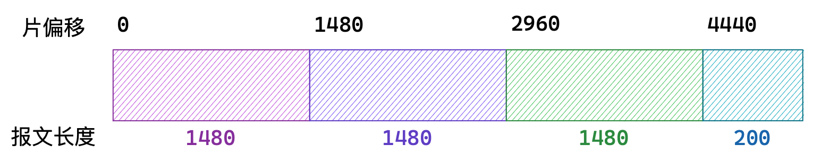

> 接收端如何判断收到的报文是普通报文还是分片报文？

1. 如果片偏移不为零，一定是分片报文，
2. 如果片偏移为0，但3位标志最后一位为1，则一定是分片报文；
3. 除此以外，都是普通报文。

```c
//伪代码
if (片偏移 != 0 || 更多分片 == 1) {
    分片报文;
}
else {
    普通报文;
}
```

### 1.2 网段划分

IP地址分为两个部分，网络号和主机号：

- 网络号：保证相互连接的两个网段具有不同的标识；
- 主机号：同一网段内，主机之间具有相同的网络号，但是必须有不同的主机号。

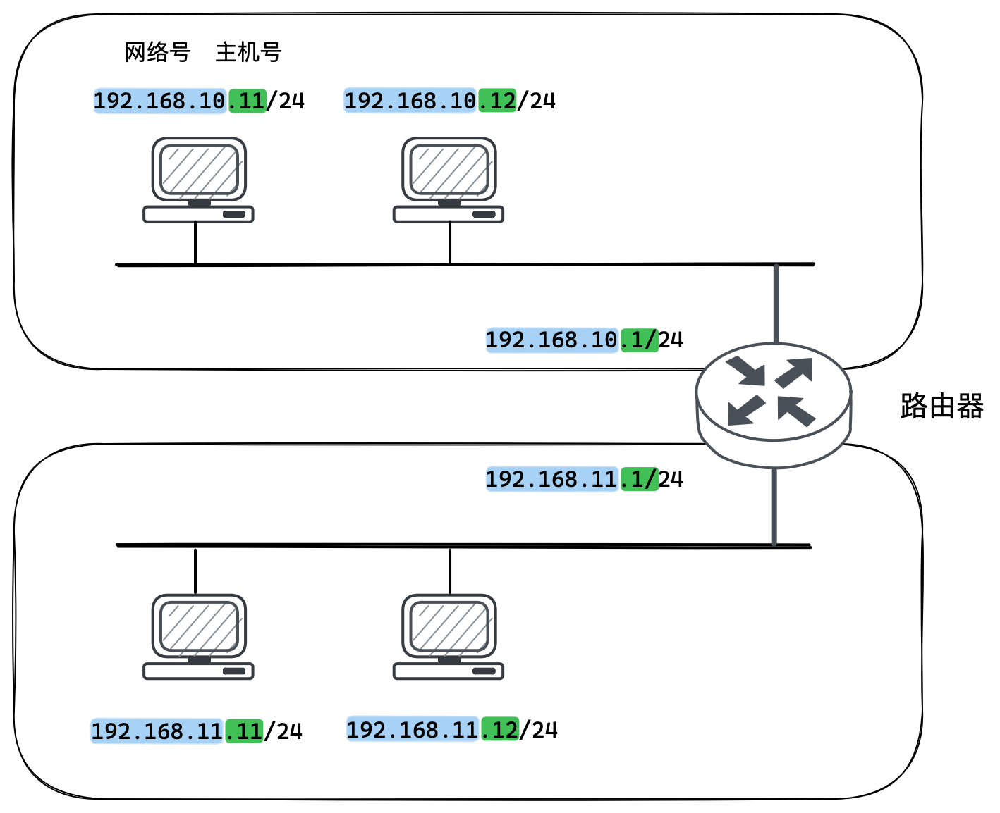

- 根据目的IP中的网络号来查找目标网络，比如目的IP中网络号为192.168.11，这样就找到了对应的网络。
- 进入目标网络后，再查找并对比IP中的主机号，就确定了目标主机。

**同一个局域网内的节点IP网络号一定相同，而主机号一定不同。**IP地址中的网络号和主机号，本质就是对IP地址32个比特位进行划分。

通过合理的设置主机号和网络号，就可以保证在相互连接的网络中，每台主机的IP地址都不相同。一般路由器中都有DHCP功能，可以自动为子网内新增的节点分配IP地址。

#### 分类划分法

最开始时提出一种划分网络号和主机号的方案，把所有IP地址分为五类，如下图所示：

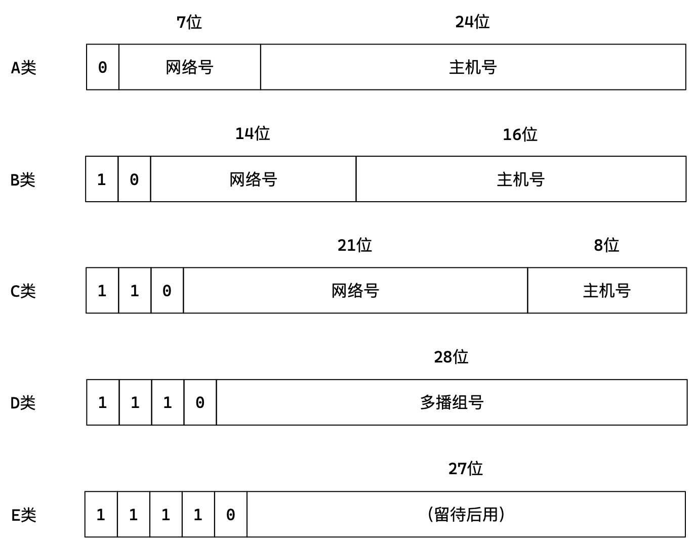

这种划分的方法叫分类划分法，粗粒度的将第一位为0的IP划分成A类，在剩下的部分中将第二位为0的划分成B类，再在剩下的部分中将第三位为0的划分成C类，以此类推，分成五类。

随着网络的飞速发展，这种划分方案的局限性很快显现出来，B类地址网络号导致少B类很快分配完了，而A类主机号多，一个子网内没有那么多主机导致浪费了大量地址。

#### 子网掩码划分法

针对这种情况提出了新的划分方案 CIDR，是分类划分法的基础上引入一个额外的子网掩码 (subnet mask) 来区分网络号和主机号。

子网掩码也是一个32位的正整数，将**IP地址和子网掩码进行按位与`&`得到的结果就是网络号**。网络号用这种方式确定。

```c
10 11 1001 1010 1111 0001 1011 XXXX XXXX      // IP地址
11 11 1111 1111 1111 1111 1111 0000 0000   &  // 子网掩码
---------------------------------------------
10 11 1001 1010 1111 0001 1011 0000 0000      // 网络号
```

将子网掩码中主机号对应位置的首位设为1，将此位看作网络号的内容，就能弥补网络位太少的不足。

```c
10 11 1001 1010 1111 0001 1011 XXXX XXXX      // IP地址
11 11 1111 1111 1111 1111 1111 1000 0000   &  // 子网掩码
---------------------------------------------
10 11 1001 1010 1111 0001 1011 1000 0000      // 网络号1
10 11 1001 1010 1111 0001 1011 0000 0000      // 网络号2
```

> 多出一位用来区分网络，这样通过子网掩码来灵活控制网络号和主机号的长度，更加节省IP。

| 例一         | 十进制                        | 十六进制     |
| ------------ | ----------------------------- | ------------ |
| IP地址       | 140.252.20.68                 | 8C FC 14 44  |
| 子网掩码     | 255.255.255.0                 | FF FF FF FF  |
| 网络号       | 140.252.20.00                 | 8C FC  14 00 |
| 子网地址范围 | 140.252.20.0 ~ 140.252.20.255 |              |
| **例二**     |                               |              |
| P地址        | 140.252.20.68                 | 8C FC 14 44  |
| 子网掩码     | 255.255.255.240               | FF FF FF F0  |
| 网络号       | 140.252.20.64                 | 8C FC  14 40 |
| 子网地址范围 | 140.252.20.64 ~ 140.252.20.79 |              |

```c
140      252      20       68
140      252      20       01000100
11111111 11111111 11111111 11110000 &
-------------------------------------------
140      252      20       01000000    // 网络号
0000 ~ 1111 -> 0 ~ 15 -> 1 ~ 14
```

子网掩码后面是一组0，和任意地址按位与的结果都是0，不会影响到前面的网络号，后面的0就是主机号。再去掉全0和全1两种情况，就是主机号能够使用的范围。	

- IP地址中主机部分全部置0，就成了网络号，代表整个局域网。
- IP地址中主机部分全部置1，就成了广播地址，用来给局域网内所有主机发送数据包。

### 1.3 私有IP和公网IP

> IP地址是一个4字节的32位正整数，大概是43亿左右，实际上，全球70亿人口43亿IP地址肯定是不够的，这时候有三种方式来解决：
>
> - 动态分配IP地址：给接入网络的设备自动分配IP地址，自动分配，自动回收。
> - IPv6：和IPv4并不兼容，它使用16个字节表示一个IP地址。
> - NAT技术，会在后面讲解。

局域网分配的IP地址只用于局域网内的通信，而不能直接连到公网上。理论上使用任意的IP地址都可以，但是RFC 1918规定了用于组建局域网的私有IP地址：

| IP                    | 网络号         | 地址数             |
| --------------------- | -------------- | ------------------ |
| 10.\*                 | 前8位是网络号  | 共16,777,216个地址 |
| 172.16.\* ~ 172.31.\* | 前12位是网络号 | 共1,048,576个地址  |
| 192.168.\*            | 前16位是网络号 | 共65,536个地址     |

> 包含在这个范围中的，都算作私有IP，其余的都算作公网IP。

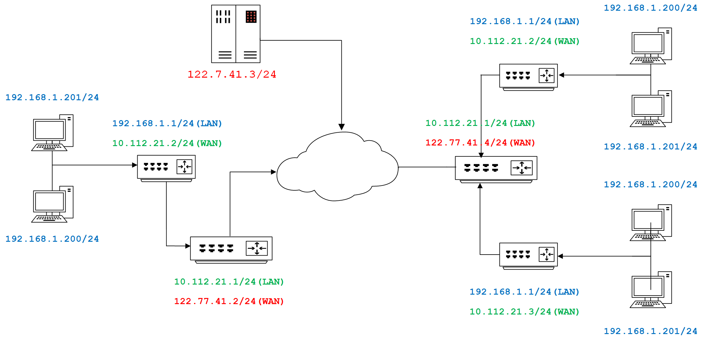

公网IP在整个网络世界是不可以出现重复的，但私网IP在不同的网段内是可以重复的。所有接入公网的人都需要用路由器建立私网。每个家用路由器，都作为运营商路由器子网中的一个节点。

### 1.4 路由

路由器最重要的作用是组建子网，将自己的私网连到运营商的子网。路由器能横跨两个网络，所以要配置两个IP：一个是WAN口IP，一个是LAN口IP：

- 路由器LAN口连接内网，对应自身构建的网段的IP；
- WAN口连接外网，对应自身所在的网段的IP。

子网内主机和外网进行通信时，路由器将报文中的目的IP地址与路由表进行对比，如果访问的不是子网内的主机，就将源IP替换成路由器的WAN口IP，也就是将报文转发到外网。

这样逐级替换，最终数据包中的源IP地址变成一个公网IP，这种技术称为NAT。

> 数据如何返回，等到后面NAT部分讲解。

路由的过程，就是在复杂的网络中“一跳一跳”的路由选择跳到终点。所谓“一跳”就是数据从一个节点到另一个节点到过程。

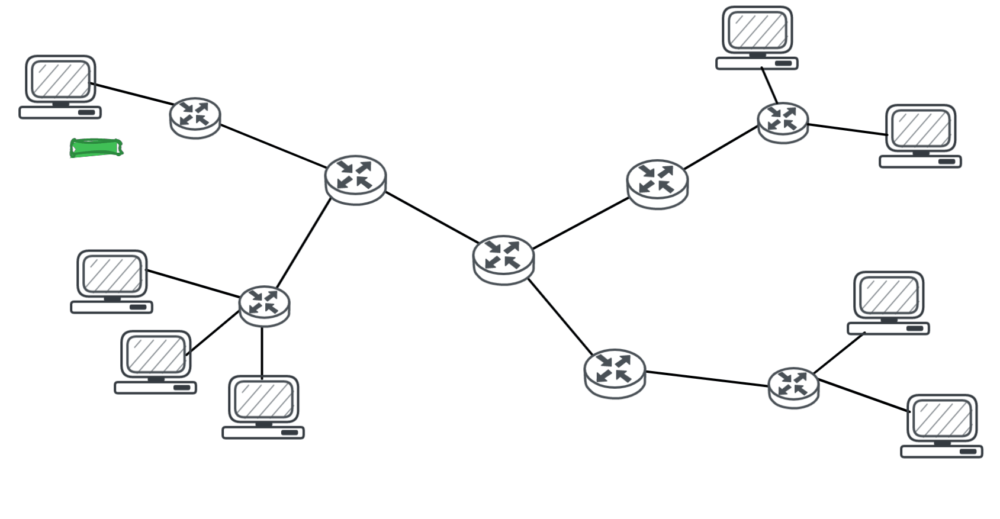

IP数据包的传输过程和问路类似：

1. 当IP数据包到达路由器时，路由会先查看报文中的目的IP；
2. 对比目的IP和路由表，如果对应得上就说明目标主机就在自身子网内，就直接发送到目标主机；
3. 如果对应不上就将报文转发到下一个路由器，就是所在子网的路由器。

依此反复，直到到达目标主机。

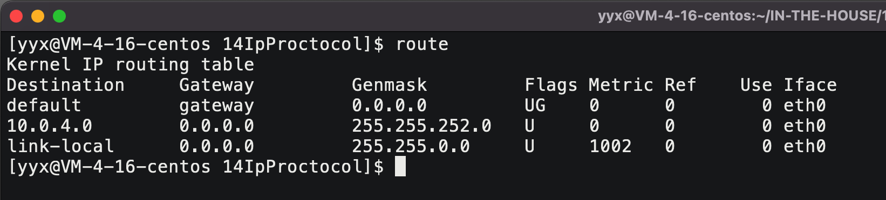

可以使用`route`命令查看路由表，`Genmask`字段表示子网掩码，对比方式就是将目的IP和子网掩码按位与。得到结果是否等于`Destination`目标网络号，如果是就进入，不是就直接`default`进入默认下一跳。

> - 路由表的Destination是目的网络地址；
> - Genmask是子网掩码；Gateway是下一跳地址；
> - Iface是发送接口；
> - Flags中的U标志表示此条目有效，G标志表示此条目的下一跳地址是某个路由器的地址。没有G标志的条目表示目的网络地址是与本机接口直接相连的网络,不必经路由器转发。

&nbsp;

# 数据链路层

> IP最大的意义，在于路径选择。路径选择就是为什么数据包是从这个节点到另一个节点而不是其他节点，这个是由目的IP决定的。

事实上，IP的跨网络传输路径选择的能力是建立在数据链路层节点之间跳转的功能的基础上。简而言之，IP负责路径选择（为什么要跳转），链路层负责实现跳转（为什么能跳转）。

凡是能够进行跳转的节点，一定在同一个网段内是直接相连的节点。

所谓网络也就是用路由器连接起无数个局域网组建起来的，路由转发的本质就是将数据从一个局域网转到另一个局域网。

> 如何跳转到下一跳的问题，也就是如何进行局域网通信的问题。

## 2. 以太网

> “以太网”不是一种具体的网络，而是一种技术标准。既包含了数据链路层的内容，也包含了一些物理层的内容，例如：规定了网络拓扑结构，访问控制方式，传输速率等。
>
> 以太网是当前应用最广泛的局域网技术，和以太网并列的还有令牌环网、无线LAN等。

 局域网通信的方式就是一个节点将数据放到网络里，其他节点都能拿到，此时对比自己的MAC地址，看看是否是发给自己的，是给自己的就接收，不是就抛弃。

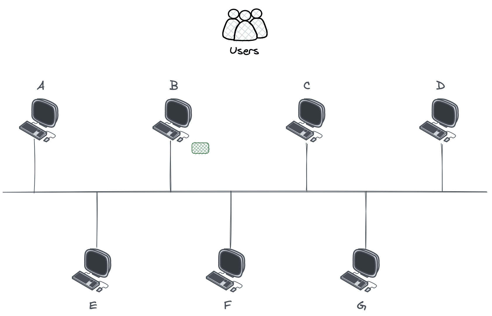

数据链路层的报文我们称之为数据帧，网络层报文称为数据报，传输层报文称为数据段。

### 2.1 以太网帧格式

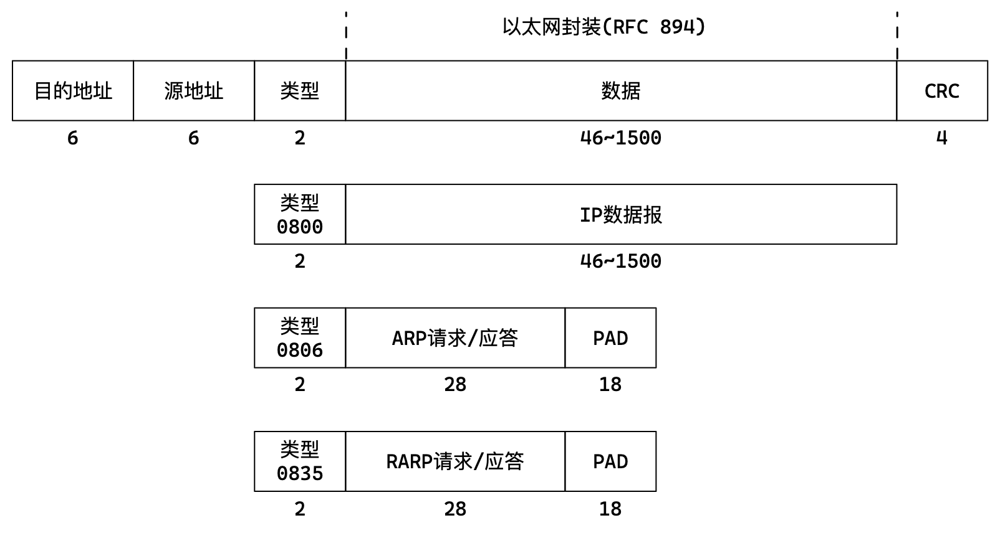

| 字段     | 解释                                                         |
| -------- | ------------------------------------------------------------ |
| 目的地址 | 目的MAC地址，局域网内接受端主机的MAC地址                     |
| 源地址   | 源MAC地址，局域网内发送端主机的MAC地址                       |
| 类型     | 有效载荷的类型，0800表示IP数据报，0806表示ARP请求应答，0835表示RARP请求应答 |
| CRC      | 校验和，用来校验数据是否发生修改                             |
| PAD      | 以太网帧数据不能少于46不能大于1500字节，少于的话就要添加PAD就是随机值 |

> 如何进行封装和解包呢？

1. 类型字段决定了报文中的有效载荷要交付给上层的那一个协议；
2. 先看类型，按具体类型报文的报头都是定长的，按其规则封装和解包即可。

### 2.2 MAC地址

MAC地址用来标识数据链路层中相连的节点，长度为48位，6个字节。一般用16进制数字加上冒号的形式来表示（例如：08:00:27:03:fb:19)。MAC地址随网卡绑定，一般不支持修改。

- 源目的IP表示源目的主机，是数据传输途中的起点和终点，一般是不被修改的。
- 但源目的MAC地址表示传输途中经过的前后节点，只在当前局域网内使用。

### 2.3 MTU

MTU是MAC帧的大小上限，以太网帧中的数据长度规定最小46字节，最大1500字节。ARP数据包的长度不够46字节,要在后面补填充PAD。

不同的数据链路层标准的MTU是不同的，如果一个数据包从以太网路由到拨号链路上，数据包长度大于拨号链路的MTU了，则需要对数据包进行分片。

#### MTU对上层协议的影响

分片是交给网络层完成的，由于数据链路层MTU的限制，对于较大的IP数据包要进行分包。可以在传输层控制每个报文的大小，这样就不会在IP层分片了。

- UDP有效载荷超过1472，那么就会在网络层分成多个IP数据报。多个IP数据报有任意丢失，都是接收端网络层重组失败。
- TCP双方在握手的时候会在报头写入自己能支持的MSS值，MSS的值是在IP不会被分片处理的最大长度。然后双方得到对方的MSS值之后，选择较小的作为最终MSS。

分片不是必须的，分片会提高报文丢失的风险，所以一般非必要不分片。

#### 查看MTU

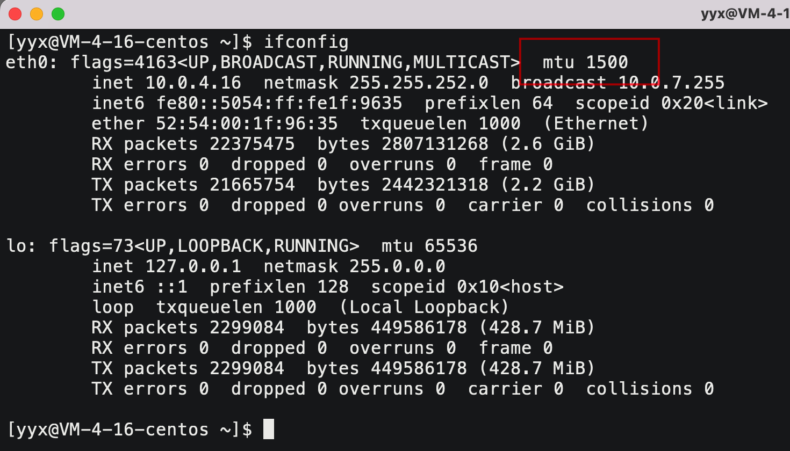

&nbsp;

> 自此为止，整个网络协议栈我们都已经讲完了，但还有一些小问题需要解答。

## 3. ARP协议

### 3.1 ARP协议的作用

当数据包经过路由器层层转发到最小的一个子网的入口路由器上，此时需要路由器将数据转发到指定目的主机上，路由器需要先对数据报封装MAC帧，才能进行局域网通信。

报文中只有目的IP地址没有目的MAC地址，而且路由表也没有IP到MAC地址到映射，**如何在子网中获得指定主机的MAC地址？**这项工作就交给ARP协议负责。

### 3.2 ARP数据报格式

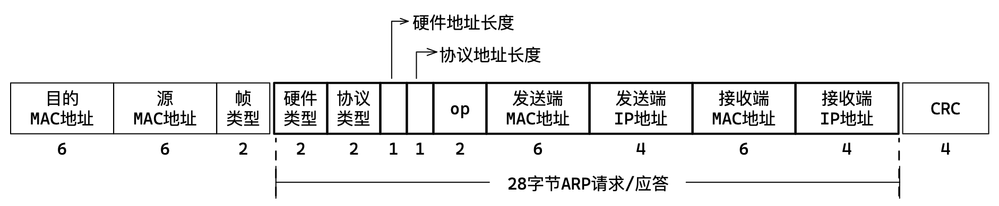

加粗部分是ARP协议报文格式，将ARP协议报文部分替换成有效载荷就是MAC帧协议报文格式。

| 字段                        | 解释                                                         |
| --------------------------- | ------------------------------------------------------------ |
| 硬件类型                    | 1为以太网，相当于这里就不变是1                               |
| 协议类型                    | 0x0800为IP地址，也是不变的                                   |
| 硬件地址长度                | 6为以太网MAC地址，不变                                       |
| 协议地址长度                | 4为IP协议地址，不变                                          |
| op                          | 1表示ARP请求，2表示ARP应答                                   |
| 发送端MAC地址，发送端IP地址 | 请求方或者响应方填写自身的MAC地址和IP地址，接收方提取以待后用 |
| 接收端MAC地址，接收端IP地址 | 请求方填写接收方的IP地址，接收方MAC地址全F表示未知           |

### 3.3 ARP的工作流程

1. 源主机向子网内所有主机广播式发出ARP请求，其中包含自身的MAC地址；
2. 目的主机接收到广播的ARP请求，发现其中的IP地址和本机相符，就返回一个ARP应答给源主机，其中包含自身的MAC地址。

上述是局域网内两台主机通信的获取MAC的方式，其中源主机获取目的主机的MAC地址到方式有很多，还可以将数据单发送给路由器，路由器查询路由表将数据转给目的主机，不止广播一种方式。

如果是外网数据到了子网入口路由器，那路由器直接发送到对应IP的目的主机即可。

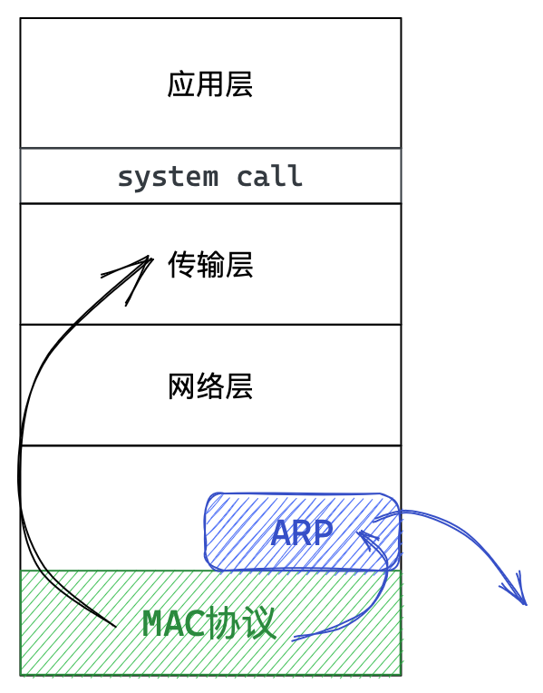

MAC帧协议获得数据后，可以将数据提交到网络层，也可以提交至上层的ARP协议。具体提交给那个协议，取决于对MAC帧中有效载荷的判断。

也就是说，如果数据是普通数据就向上提交至网络层，如果是ARP请求和响应就提交给ARP协议处理。

ARP协议工作在链路层，是局域网协议，专门处理ARP请求和响应，处理完成后自动在交给MAC帧协议发送给目的主机。

相当于是底层自动完成的工作，只牵扯到链路层。可以认为，向上交付的是用户数据，ARP处理的是管理数据。

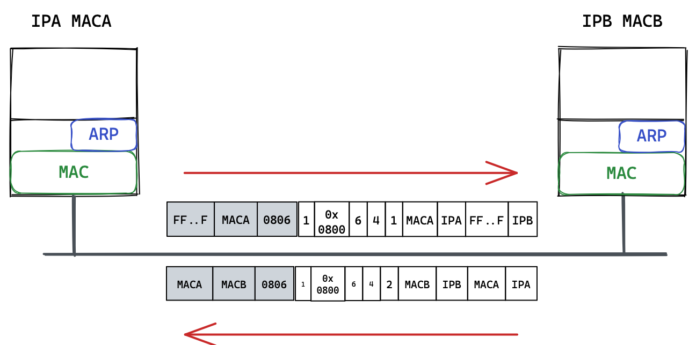

任何局域网中的主机，时刻都可能向别人发起ARP，也可能被别人发起ARP。 所以收到ARP请求的时候，应先看`op`字段确认是请求还是响应，其次是检查目的IP是否是本机。

构建响应的时候，就不存在存疑字段了，将接收请求中的对端IP和MAC地址填充到响应目的IP和MAC地址，交付给MAC帧协议后填充好MAC帧报头后就发送给目的主机即可。

实际上，主机会对子网内其他主机IP和MAC地址映射作缓存，以待下次使用。当然由于IP是动态分配的，这个缓存的生命周期只有20分钟这样。可以使用`arp -a`查看：

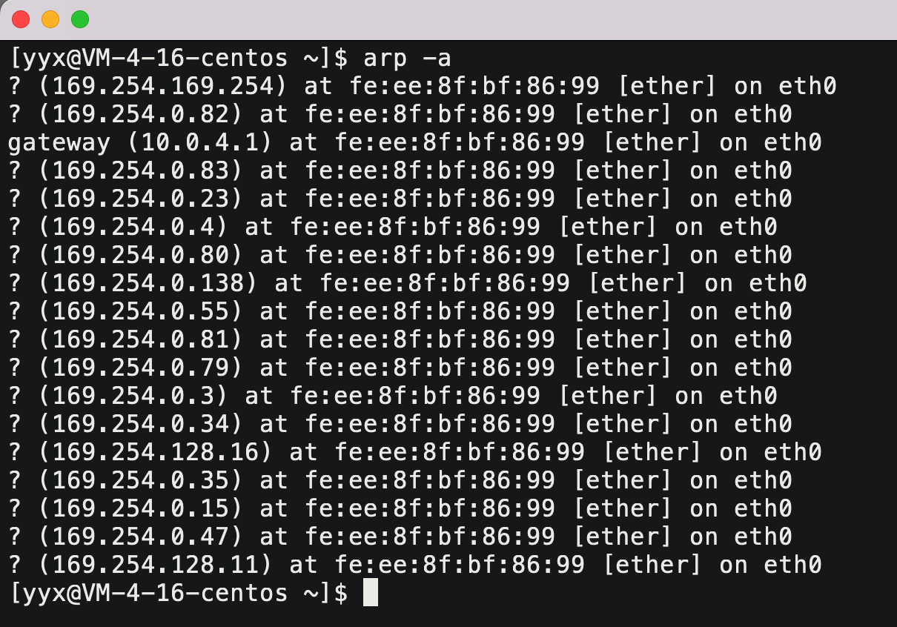

&nbsp;

# 其他协议

## 4. DNS协议

### 4.1 DNS背景

DNS是一整套从域名映射到IP的系统。TCP/IP中使用IP地址和端口号来确定网络上的一台主机的一个程序。但是IP地址不方便记忆，于是人们发明了一种叫主机名的东西，是一个字符串，并且使用hosts文件来描述主机名和IP地址的关系。

### 4.2 域名简介

主域名是用来识别主机名称和主机所属的组织机构的一种分层结构的名称

```c
www.baidu.com
```

| 性质     | 内容  | 解释                                                         |
| -------- | ----- | ------------------------------------------------------------ |
| 一级域名 | com   | 表示这是一个企业域名，同级的还有"net"网络提供商）,"org"(非盈利组织）等 |
| 二级域名 | baidu | 域名                                                         |
| 前缀     | www   | 只是一种习惯用法，来表示主机支持的协议                       |

如果想研究域名解析过程，可以参考《图解TCP/P》相关章节。

### 4.3 输入URL后的事情

这是一个经典的面试题，能牵扯到所有网络知识点，如果深究细节可以讲三天三夜，在回答时没有固定答案越详细越好，可以参考：https://blog.csdn.net/wuhenliushui/article/details/20038819/

1. 有知识框架，有条理
2. 组织语言，清晰表达
3. 掌握细节程度

> 针对这个问题我想分成如下三步去谈：
> 第一层：在应用层，将一个URL请求一直到浏览器返回，把这个过程给你详细的表述一下。
> 第二层：应用层谈完之后，再谈谈细节问题，因为细节太多了，所以我只能以关键字的方式给你呈现。
> 第三层：当把前面的两个大步骤讲完，然后还会再补充一些细节，那么这个问题呢一个大思路。
>
> 第一、我们谈第一个就是应用层，首先输入URL之后点击回车，先域名解析拿到IP地址，紧接着浏览器会发起HTTP请求，服务器会收到HTTP请求，然后读取请求，进而进行分析HTTP请求。分析完之后，根据分析字段得到要求的资源，上传的参数等等。然后构建HTTP响应，如响应行、属性、正文等等，再发送给浏览器，浏览器拿到HTTP响应要对HTTP响应做分析，更重要的是提取相应的正文比如网页，然后浏览器会解释网页的这些标签语言，同步的也要对浏览器界面进行相关的渲染，把我们所需要的网页内容给展示出来。如此就完成一整个HTTP请求和响应，这是我回答问的第一阶段。那么上面实际上是一个整体的过程，也是用户最能感知到的，也是一般程序员最清楚的。
>
> 第二、那么下面要谈的就是细节，当我们实际发起一个HTTP的时候，底层其实使用的是TCP套接字编程。底层实际上将我们的数据以字节流的方式拷贝并发送过去。然后TCP协议经过自己的流量控制、拥塞控制，确认应当、链接管理、超时重传、延迟应答等各种机制来保证自己的数据报被对方可靠高效地获取。
>
> 第三、TCP将数据交给IP层，存在各种路径选择、子网划分、查找路由表等过程，IP数据报分片组装等特殊情况，到链路层会有局域网转发、ARP协议等相关细节。当然过程中也会存在各种异常情况。
> 

&nbsp;

## 5. ICMP协议

### 5.1 ICMP功能

—个新搭建好的网络，往往需要先进行—个简单的测试，来验证网络是否畅通。就是使用域间套接字跳过传输层直接访问网络层ICMP协议，但IP协议并不保证传输的可靠性。

ICMP主要功能包括：

1. 确认IP包是否成功到达目标地址；
2. 通知在发送过程中IP包被丢弃的原因；
3. ICMP也是基于IP协议工作的，但是它并不是传输层的功能，因此仍然把它归为网络层协议；
4. ICMP只能搭配IPv4使用.如果是IPv6的情况下，需要是用ICMPv6; 

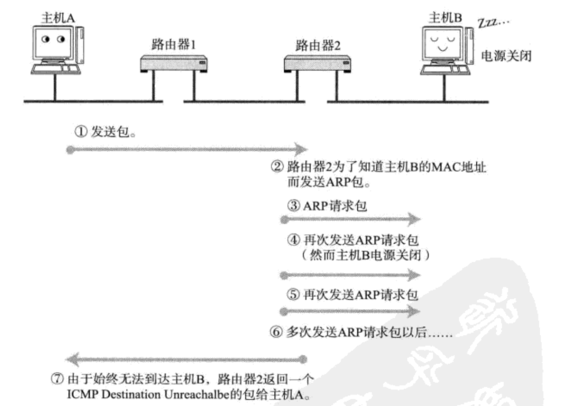

总之，ICMP报文能够通知诊断查询并出错原因。

### 5.2 基于ICMP的命令

#### ping命令

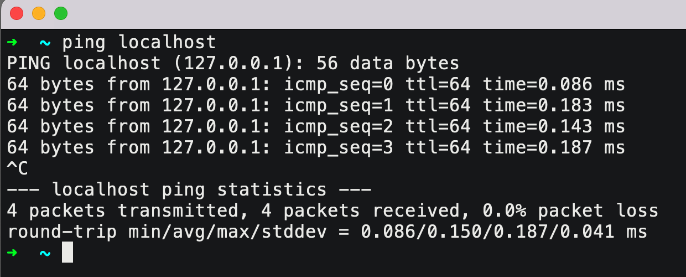

注意， ping 的是域名，而不是url。ping命令不光能验证网络的连通性，同时也会统计响应时间和TTL。

ping 命令会先发送一个ICMP Echo Request给对端，对端接收到之后会返回一个 ICMP Echo Reply。

> 有些面试官可能会问: telnet是23端口, ssh是22端口, 那么ping是什么端口？

**ping 命令基于ICMP，是在网络层，而端口号是传输层和应用层交互的机制，网络层中根本就没有端口号。**

#### traceroute命令

也是基于ICMP协议实现的，能够打印出程序从当前主机一直到目标主机，之间经历多少路由器。原理是提高报文生存时间，到了一个路由器返回一次应答。

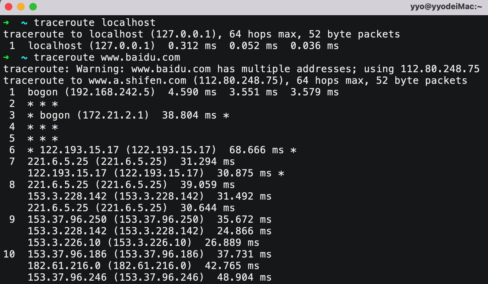

&nbsp;

## 6. NAT协议

### 6.1 NAT技术背景

之前我们讨论过IPv4协议中IP地址数量不充足的问题，NAT技术当前解决IP地址不够用的主要手段，是路由器的一个重要功能。

- NAT能够将私有IP对外通信时转为全局IP，也就是一种将私有IP和全局IP相互转化的技术方法；
- 全局IP要求唯—，但不同网段中出现相同的私有IP是完全不影响的。

### 6.2 NAT IP转换过程

我们作为普通用户将数据发送到公网中的服务器时，每次经历路由器都会将IP报文自身的源IP替换成路由器的WAN口IP。

> 我们之前在怎么回来的问题上按下不表，现在是时候解决这个问题了。

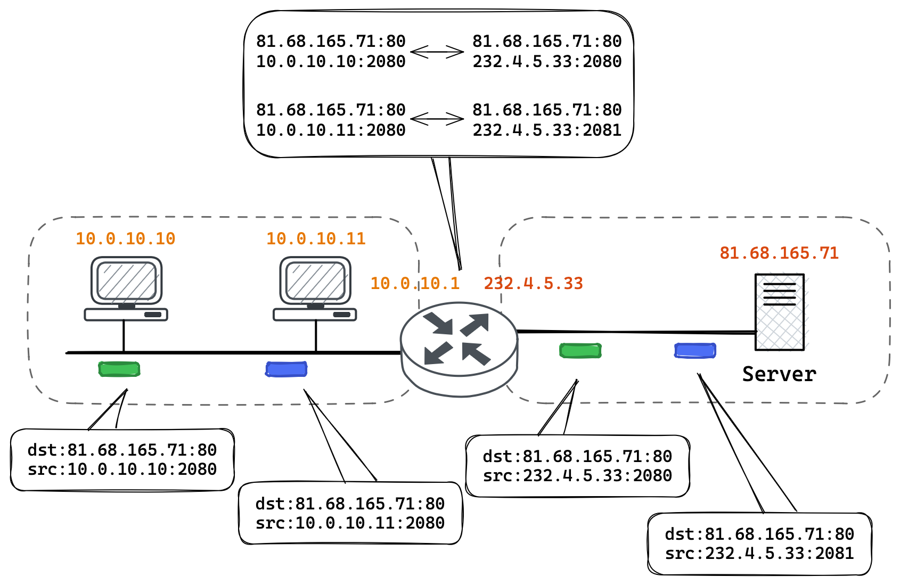

1. 路由器将源IP从 10.0.10.10 替换成全局IP 232.4.5.33；
2. 路由器收到外部的数据时，又会把目标IP从 232.4.5.33 替换回 10.0.10.10；
3. 在NAT路由器内部，有一张自动生成的用于地址转换的表，可以做到两边互为键值；数据出去时“向外”转换，数据进来时“向内”转换。

这种映射关系是由路由器自动维护的，如在TCP建立连接时，就会生成这个表项，断开连接就会删除这个表项。

### 6.3 NAT技术的缺陷

由于NAT依赖这个转换表，所以有诸多限制：

- 路由器外部主机无法向内部主机建立连接；
- 转换表的生成和销毁都需要额外开销；
- 通信过程中一旦路由器异常，即使存在热备所有的TCP连接也都会断开。

### 6.4 NAT和代理服务器

#### 正向代理和反向代理

现在的路由器往往都具备NAT功能，通过NAT设备进行中转，完成子网设备和其他子网设备的通信过程。

代理服务器看起来和NAT设备有点像：

1. 客户端向代理服务器发送请求，代理服务器将请求转发给服务器；
2. 服务器返回结果给代理服务器，然后又把结果回传给客户端。

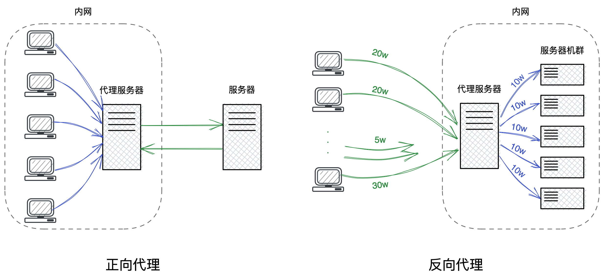

如图所示，靠近用户的代理服务器，叫做正向代理。优点有：

1. 身份认证；
2. 加速内网服务；
3. 可以对访问内网的请求进行筛查。

如图所示，靠近服务器的代理服务器，叫做反向代理。优点有：

1. 较为均衡地将请求打散在各台服务器上，进行业务转发，实现负载均衡；
2. 防止恶意攻击服务器。

#### NAT和代理的区别

> NAT和正向代理实现原理都是类似的，那么NAT和代理服务器的区别有哪些呢？

| 角度     | NAT                                  | 代理服务器                               |
| -------- | :----------------------------------- | ---------------------------------------- |
| 应用角度 | 网络基础设备，解决的是IP不足的问题   | 贴近具体应用，比如通过代理进行加速或翻墙 |
| 底层实现 | 工作在网络层，直接替换IP地址         | 工作在应用层                             |
| 使用范围 | 一般部署在局域网的出口               | 可以在局域网，也可以在广域网，也可以跨网 |
| 部署位置 | 一般集成在防火墙，路由器等硬件设备上 | 是一个软件程序，需要部署在服务器上       |

