# 进程控制

## 1. 进程创建

fork 函数是代码创建进程的一种返方式，它从已存在的进程中创建一个新进程，原进程为父进程，新进程叫做子进程。

```cpp
NAME
       fork - create a child process
SYNOPSIS
       #include <unistd.h>
       pid_t fork(void);
DESCRIPTION
       fork() creates a new process by duplicating the calling process. The new process, referred to as the child, is an exact duplicate of the calling process, referred to as the parent. 
       The child has its own unique process ID, and this PID does not match the ID of any existing  process  group.
RETURN VALUE
	   On  success, the PID of the child process is returned in the parent, and 0 is returned in the child.  
       On failure, -1 is returned in the parent, no child process is created, and errno is set appropriately.
NOTES
       Under Linux, fork() is implemented using copy-on-write pages, so the only penalty that it incurs is the time and memory required to duplicate the parent's page tables, and to create a unique task structure for the child.
```

进程调用 fork 后，内核会做出这些步骤：

1. 分配新内存块和内核数据结构给子进程，
2. 将父进程部分数据结构拷贝给子进程，
3. 添加子进程到系统进程列表中，
4. fork 返回，调度器开始调度。

> 简而言之，当一个进程调用 fork 之后，就有两个进程代码相同的进程。且它们都运行到相同的地方。从此便开始分道扬镳，各自独立。

1. 进程创建成功，给父进程返回子进程的 PID，给子进程返回 0。
2. 进程创建失败，给父进程返回 -1，并设置正确的错误码。没有子进程产生，父进程依旧运行。

###  写时拷贝

一般数据和代码是共享的，只有一份。代码一般不改，修改的都是数据。**当数据被修改时，系统便为修改者单独创建一份空间，以供其使用，其他进程仍旧使用原变量**。

每个进程都有自己的进程相关数据结构，即进程控制块、地址空间和页表。子进程创建后，这些进程相关数据结构是存在不同的，但相同的是页表里的映射关系。

当写入数据时，操作系统底层会自动将待写入的目标数据，拷贝一份到目标空间，拷贝完成后，会重新建立映射，将虚拟地址映射到目标空间处。

&nbsp;

## 2. 进程终止

### 2.1 进程退出的概念

> 进程创建完毕，就到了进程的终止。

进程运行终止无非有三种情况：

1. 程序运行完毕，结果正确；
2. 程序运行完毕，结果不正确；
3. 程序异常终止。

main 函数是程序的入口，main 运行结束程序也就运行结束。而 **main 函数的返回值就是进程的退出码**。

```shell
$ echo $? # 输出最近一次进程的退出码
```

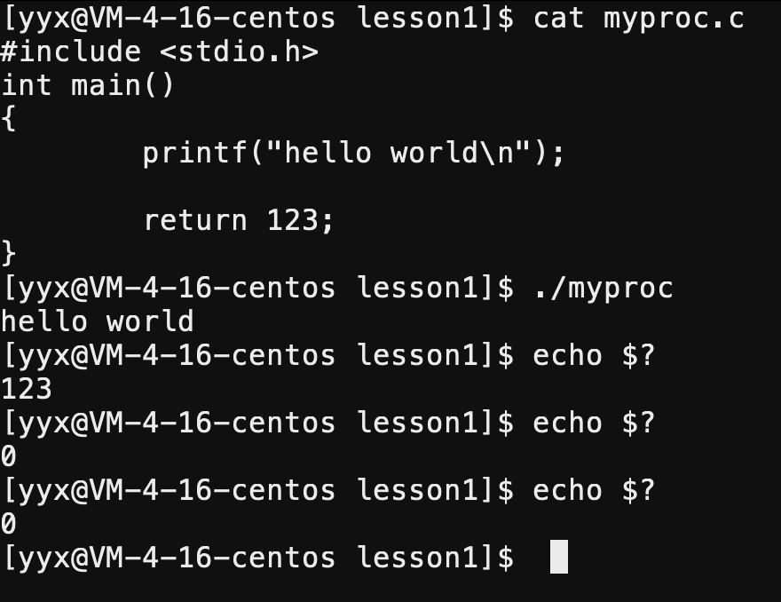

> 运行进程`myproc`的退出码是123，而进程`echo`正确运行，所以其退出码是0。

```shell
$ ls -a -b -c -d -e -f
ls: invalid option -- 'e'
Try 'ls --help' for more information.
$ echo $? #进程运行错误，返回非零值
2
$ ls
Makefile  myproc  myproc.c
$ echo $? #进程运行正确，返回0
0
```

从上述代码可以看出，进程运行正确返回值为 $0$ 代表 $success$ ，进程运行错误，返回非零值。而非零值有任意种可能，所以用非零值作为错误码，一个错误码对应着一个错误信息。

```cpp
NAME
       strerror, strerror_r - return string describing error number
SYNOPSIS
       #include <string.h>
       char *strerror(int errnum);
       int strerror_r(int errnum, char *buf, size_t buflen);
                   /* XSI-compliant */
       char *strerror_r(int errnum, char *buf, size_t buflen);
                   /* GNU-specific */
   Feature Test Macro Requirements for glibc (see feature_test_macros(7)):
       The XSI-compliant version of strerror_r() is provided if:
       (_POSIX_C_SOURCE >= 200112L || _XOPEN_SOURCE >= 600) && ! _GNU_SOURCE
       Otherwise, the GNU-specific version is provided.
```

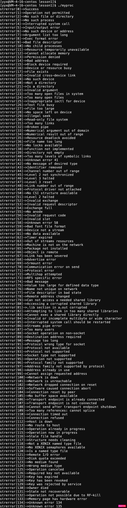

- 也就是说，**退出码只能确定程序运行完毕，其结果是否正确。**

- 当程序异常退出时，说明程序没有运行到返回处就终止了，此时返回值就没有意义了。因此我们需要其他东西来表示异常退出的原因。

### 2.2 进程退出的方式

#### 进程正常退出

1. main 函数`return`语句返回，则进程退出；其他非 main 函数返回，只是函数运行结束。
2.  函数`exit`终止本次进程，exit 放在任意位置都可以结束进程，程序只会执行到 exit 就结束。

```cpp
NAME
       exit - cause normal process termination
SYNOPSIS
       #include <stdlib.h>
       void exit(int status);
DESCRIPTION
       The exit() function causes normal process termination and the value of status & 0377 is returned to the parent.
       The C standard specifies two constants, EXIT_SUCCESS and EXIT_FAILURE, that may be passed to exit()  to  indicate successful or unsuccessful termination, respectively.
RETURN VALUE
       The exit() function does not return.
```

- exit 放在任意位置都可以结束进程，程序只会执行到 exit 就结束。
- 参数是退出码，可以是任意整数，也可以用标识符`EXIT_SUCCESS`和`EXIT_FIALURE`。
- exit 在结束进程的同时，还会清理刷新缓冲区。

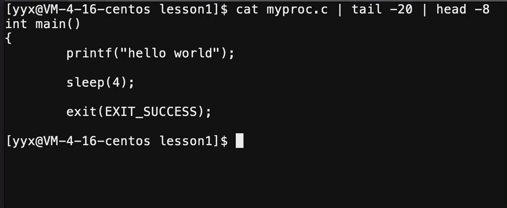

3. 函数`_exit` 

~~~cpp
NAME
       _exit, _Exit - terminate the calling process
SYNOPSIS
       #include <unistd.h>
       void _exit(int status);
       #include <stdlib.h>
       void _Exit(int status);
   Feature Test Macro Requirements for glibc (see feature_test_macros(7)):
       _Exit():
           _XOPEN_SOURCE >= 600 || _ISOC99_SOURCE || _POSIX_C_SOURCE >= 200112L;
           or cc -std=c99
DESCRIPTION
       The function _exit() terminates the calling process "immediately".  Any open file descriptors belonging to the
       process are closed; any children of the process are inherited by process 1, init, and the process's parent  is
       sent a SIGCHLD signal.
       The  value  status  is returned to the parent process as the process's exit status, and can be collected using
       one of the wait(2) family of calls.
       The function _Exit() is equivalent to _exit().
RETURN VALUE
       These functions do not return.
~~~

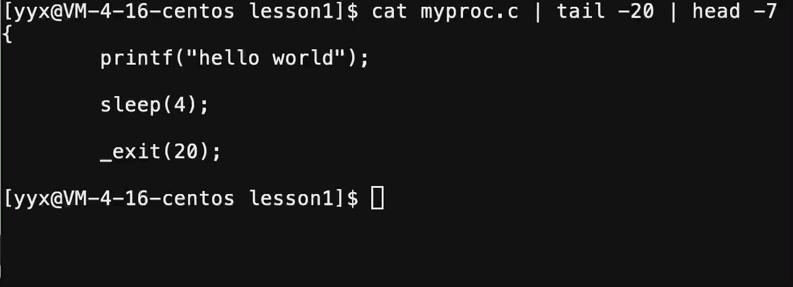

> `_exit`只强制终止进程，不进行进程的后续收尾工作。

- `_exit`算是`exit`的子函数，  只负责退出程序。所以 exit 比 \_exit 多出了执行用户的清理函数和冲刷缓冲区关闭IO流的任务。

创建进程本质上是系统中多出一个进程，就要多出进程相关的数据结构。故进程退出也就意味着释放为其开辟的各项数据结构，如进程控制块、地址空间、页表及相关映射关系和为程序开辟的空间等等。

####  进程异常退出

> 主函数`return`和`exit`,`_exit`两种进程退出的方式都是正常退出，除此之外还有进程异常退出的情况。这个我们放到进程信号处讨论。

&nbsp;

## 3. 进程等待

> 执行 fork 语句之后，系统内存在着两个进程：一个是父进程，一个是子进程。子进程创建出来是为了帮助父进程完成某种任务，而父进程必须要获得子进程运行的结果，才能做出进一步的操作。

### 3.1 进程等待的定义

父进程使用`wait`,`waitpid`函数来等待子进程完成任务并退出，这个过程就叫做进程等待。

- 要使父进程获取子进程的退出信息，必须保证一个时序问题：父进程要在子进程之后退出。
- 进程退出时会先进入僵尸状态，父进程通过等待子进程的方式，获取其返回信息，并释放相关资源。

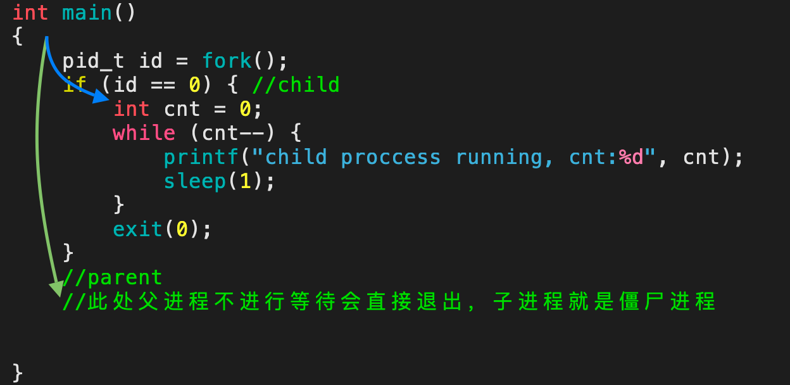

如代码所示，子进程进入循环，父进程没有等待就直接退出，此时子进程再退出就是僵尸进程。所以此时父进程必须等待。

### 3.2 进程等待的方式

当一个进程进入僵尸状态时，就变得“刀枪不入”，发送`kill -9`信号也无济于事，因为进程已经死去。所以最好由父进程等待的方式解决问题。

```cpp
NAME
       wait, waitpid - wait for a child process to stop or terminate
SYNOPSIS
       #include <sys/wait.h>
       pid_t wait(int *status);
       pid_t waitpid(pid_t pid, int *status, int options);
DESCRIPTION
       The  wait()  and  waitpid()  functions shall obtain status information pertaining to one of the caller's child processes. 
    Various options permit status information to be obtained for child processes that have  terminated or stopped. 
       The waitpid() function shall be equivalent to wait() if the pid argument is (pid_t)-1 and the options argument is 0. Otherwise, its behavior shall be modified by the values of the pid and options arguments.
RETURN VALUE
       If wait() or waitpid() returns because the status of a child  process  is  available,  these  functions  shall return  a  value equal to the process ID of the child process for which status is reported. If wait() or waitpid() returns due to the delivery of a signal to the calling process, -1 shall be returned and  errno  set  to [EINTR].  
```

- 等待成功返回所终止的子进程 PID，等待失败则返回 $-1$。

#### wait 方法

```cpp
int main()
{
    pid_t id = fork();
    if (id == 0) { //child
        int cnt = 5;
        while (cnt--) {
            printf("child proccess[%d] running, cnt:%d\n",getpid(), cnt);
            sleep(1);
        }
        exit(0);
    }
    //parent
    //此处父进程不进行等待会直接退出，子进程就是僵尸进程
    sleep(10);
    printf("parent waiting\n");
    pid_t ret = wait(NULL);
    if (ret > 0) {
        printf("parent proccess wait[%d] seccess\n", ret);
    }
    else {
        printf("parent proccess wait failed\n");
    }
    sleep(10);
}
```

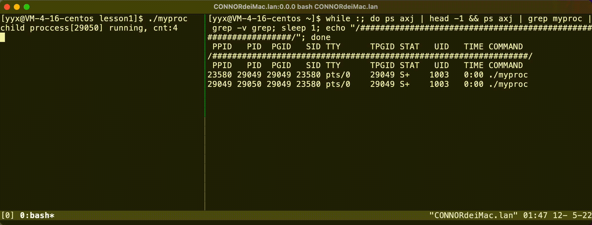

#### waitpid 方法

```cpp
pid_t waitpid(pid_t pid, int *status, int options);       
```

> `waitpid`的返回值特点和`wait`一致，正常返回时，返回收集信息的子进程 PID，错误返回时，返回 $-1$。

1. 参数`pid`为指定的进程ID，则等待的是指定的某个进程，若设置为 $-1$，则等待的是任意一个进程。

##### 参数status

2. 参数`status`是输出型参数，父进程传入该参数，可借此向父进程输出进程退出的结果。

~~~cpp
int main() {
    pid_t id = fork();
    if (id == 0) { //child
        int cnt = 3;
        while (cnt--) {
            printf("child proccess[%d] running, cnt:%d\n",getpid(), cnt);
            sleep(1);
        }
        exit(10);
    }
    //parent - 此处父进程不进行等待会直接退出，子进程就是僵尸进程
    // id - 等待指定进程
    pid_t ret = waitpid(id, NULL, 0);
    // -1 - 等待任意某个进程
    pid_t ret = waitpid(-1, NULL, 0); 
    if (ret > 0) {
        printf("parent proccess wait[%d] seccess\n", ret);
    }
    else {
        printf("parent proccess wait failed\n");
    }
    sleep(10);
}
~~~


> 进程正常结束依靠返回值传递信息，而进程异常终止是没有执行`return`或`exit`语句的，才需要利用`status`向父进程返回。

进程异常终止的原因是进程因出现异常导致其收到了某种信号。故可以通过进程是否收到或收到何种信号，判定进程是否异常终止或异常原因。

此时需要进程返回两种信息，一是退出码，二是信号。

1. 如果没收到信号，则退出码就是我们所需要的退出信息。
2. 如果收到了信号，此时不需要关心退出码，只看退出信号。

`status`一个整数就是退出码和信号的结合，能够表示多种情况。其不同的比特位代表不同的信息。其中 $32$ 个比特位目前只使用**最低的$16$比特位**，高位暂时不管。

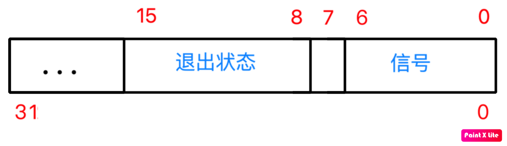

在低 $16$ 位中，**下标为 $[0,7)$ 的 7 个比特位代表终止信号**，**下标 $[8,16)$ 这 8 个比特位代表退出状态即退出码**，中间下标为 $7$ 的比特位即`code dump`标志暂时不管。

> 当下标 $[8,15]$ 的次低8位为0时，说明没有收到信号，当次低8位不为0时，再去考虑 $[0,6]$ 的低7位。

~~~cpp
int main() {
    pid_t id = fork();
    if (id == 0) { //child
        int cnt = 3;
        while (cnt--) {
            printf("child proccess[%d] running, cnt:%d\n", getpid(), cnt);
            sleep(1);
        }
        exit(0);
    }
    //parent - 此处父进程不进行等待会直接退出，子进程就是僵尸进程
    int status = 0;
    pid_t ret = waitpid(id, &status, 0);
    if (ret > 0) {
        printf("waited for[%d], status exit code:%d, status exit signal:%d\n",
                ret, (status >> 8) & 0xff, status & 0x7f);
    }
    else {
        printf("parent proccess wait failed\n");
    }
    //                              FEDC BA98   7654 3210
    //                                        |
    // status - 1111 1111 1111 1111 1111 1111 | 1111 1111
    // 0xff                         1111 1111 |
    // ox3f                                     0111 1111
}
~~~

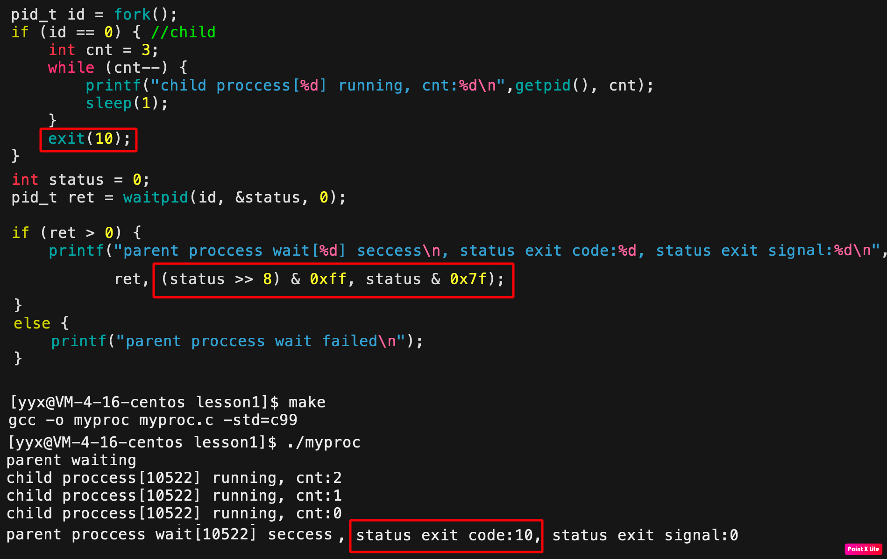

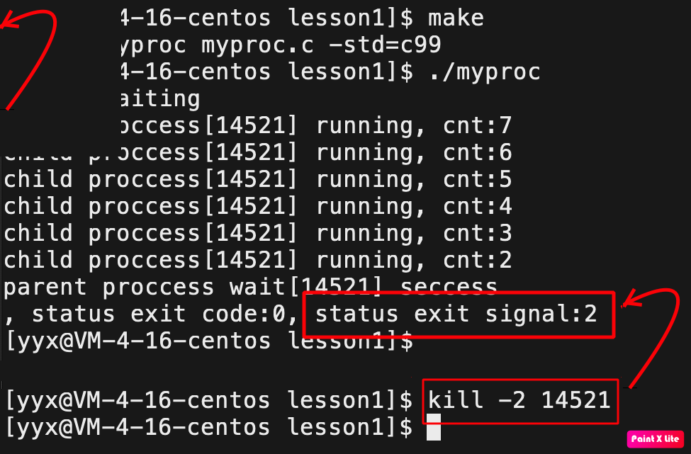

如图所示，`status`次低八位代表进程退出码， 低七位代表进程退出信号。

```cpp
    if (ret > 0) {
        //判断进程是否正常终止
        if (WIFEXITED(status)) {
            printf("exit code:%d\n", WEXITSTATUS(status)); //返回进程退出码
        }
        else {
            printf("get a signal\n");
        }
    }
```

实际开发中不需要写易错繁杂的位操作，直接使用系统提供的宏即可。

- `WIFEXITED`判断进程是否正常退出，正常退出返回1，否则返回0。
- `EXITSTATUS`返回进程退出码。

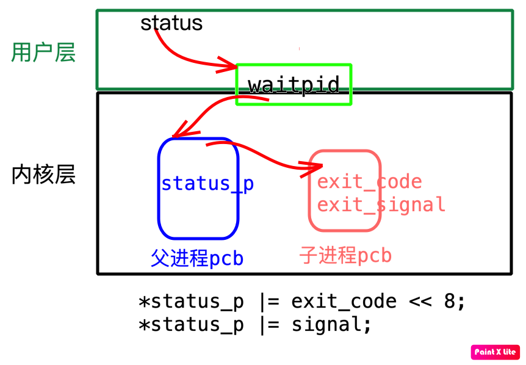

用户层上，用户传入参数`status`给`waitpid`为获取进程退出结果。在操作系统内部，父进程也会通过相同的方式获取子进程的退出结果，子进程在僵尸状态时将 PCB 中的退出码和信号和父进程传入的`status_p`进行运算：

```cpp
*status_p |= exit_code << 8;
*status_p |= signal;
```

父进程的`status_p`就获得了子进程退出结果，父进程再退出，用户层就以同样的方式获得进程的退出状态了。

##### 参数option

3. 参数`option`意为等待方式选项。设为0代表默认行为，即阻塞等待，也可设置为`WNOHANG`，代表非阻塞等待。

等待方式顾名思义，就是父进程等待子进程的方式。而阻塞和非阻塞两种，也正对应着进程状态的概念。

- 阻塞等待：在子进程执行任务期间，父进程一直保持阻塞的`S`状态。直至子进程运行结束，再放入运行队列中变成`R`状态。
- 非阻塞等待：基于不断地非阻塞的轮询方案，也就是不断的检测子进程的运行状态，保持自身进程为非阻塞的等待状态。

> 使用计算机的时候，当应用卡死无法响应，此时该应用就是阻塞的等待状态，或者说该应用`HANG`住了。

当参数`option`使用`WNOHANG`时，此时`waitpid`函数是轮询检测模式，并不会等待子进程结束再返回，此时返回值有三种情况：

1. 返回值等于`0`，代表当前询问结果子进程没有退出，则需要再次等待
2. 返回值大于`0`，即返回了子进程 PID，表示父进程等待成功。
3. 返回值小于`0`，等待失败。

```cpp
int main() {
    pid_t id = fork();
    if (id == 0) { //child
        int cnt = 3;
        while (cnt--) {
            printf("child proccess[%d] running, cnt:%d\n", getpid(), cnt);
            sleep(1);
        }
        exit(0);
    }
    printf("parent waiting\n");
    int status = 0;
    /* 轮询检测方案 */
    while (1) {
        pid_t ret = waitpid(id, &status, WNOHANG);
        // 1.子进程并未结束
        if (ret == 0) {
            printf("parent do their things\n");
        }
        // 2.子进程退出成功
        else if (ret > 0) {
            printf("parent proccess wait[%d] seccess, status exit code:%d, status exit signal:%d\n", ret, (status >> 8) & 0xff, status & 0x7f);
            break;
        }
        // 3. 等待失败
        else { 
            printf("parent wait failed\n");
            break;
        }
        sleep(1);
    }
}
```

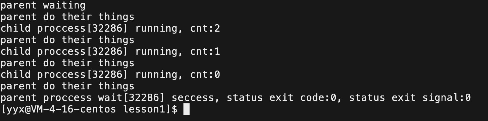

&nbsp;

## 4. 进程程序替换

> 一般来说，目前我们创建子进程的目的是，通过条件语句完成父进程的部分工作。如果想让子进程执行一个“全新的程序”，可能只需要将磁盘上的新程序文件加载到内存中，并和子进程的页表构建新的映射即可。

### 4.1 替换原理

也就是说，只将内存中子进程的代码和数据替换成新程序的代码和数据，并修改部分页表映射，就可以让子进程执行新的程序。

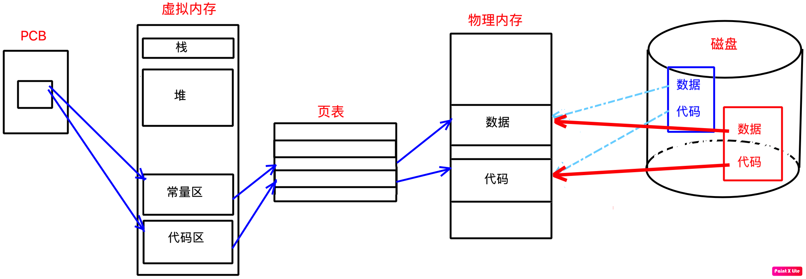

这种进程不变，仅仅替换当前进程的代码和数据的技术就叫做进程的程序替换。

> 进程替换的原理比较简单，但进程替换这个概念是非常重要的。

程序的本质就是一个文件，程序文件包含程序代码和程序数据。将程序的代码和数据加载到内存中当前进程的对应位置上。可能会因代码长度发生变化而稍微调整页表数据，但这不是重点。

**重点是用旧进程的壳子套入新程序的代码数据，“旧瓶装新酒”，并没有创建任何的进程**。

### 4.2 替换函数

系统提供的调用接口就是以`exec`开头的函数，称为`exec*`系列函数。

```cpp
NAME
       execl, execlp, execle, execv, execvp, execvpe - execute a file

SYNOPSIS
       #include <unistd.h>
       extern char **environ;
       int execl  (const char *path, const char *arg, ...);
       int execv  (const char *path, char *const argv[]);

	   int execlp (const char *file, const char *arg, ...);
       int execvp (const char *file, char *const argv[]);

	   int execle (const char *path, const char *arg, ..., char * const envp[]);
       int execve (const char *path, char *const argv[], char *const envp[]);
	   
	   int execvpe(const char *file, char *const argv[], char *const envp[]);
DESCRIPTION
       The  exec()  family  of  functions  replaces  the  current process image with a new process image.  
RETURN VALUE
       The exec() functions return only if an error has occurred.  The return value is -1,
       and errno is set to indicate the error.
```

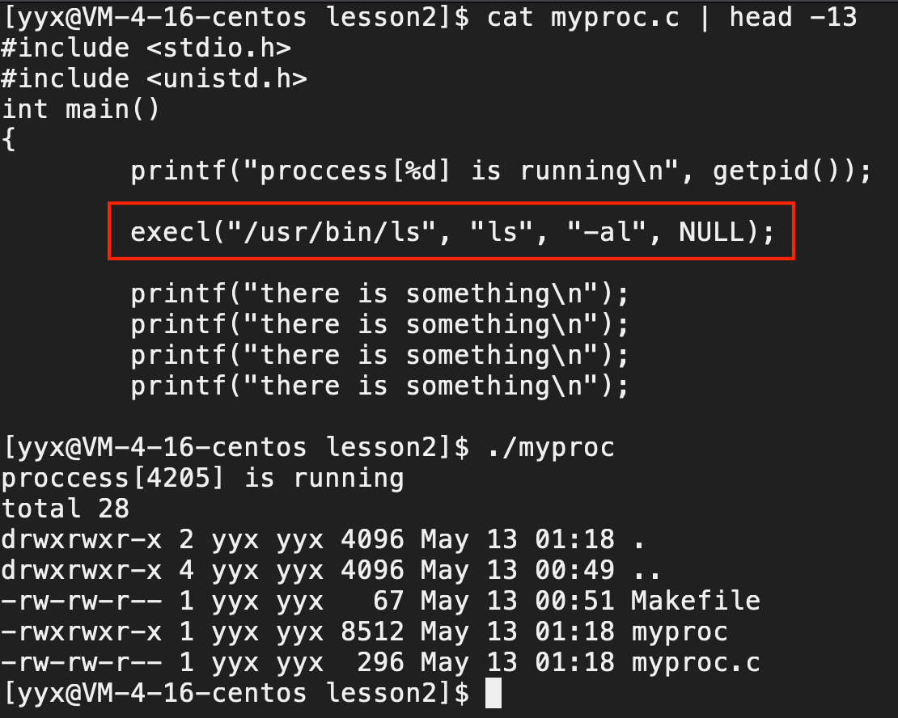

- 如图所示，执行到`execl`函数时，进程会发生程序替换，替换为指定的程序`ls -al`，此时程序代码数据已被替换，故原程序之后的代码不会被执行。

> 可见，程序替换的本质就是把指定的程序代码和数据加载到当前进程的上下文中。而普通C/C++程序运行要加载到内存中，也是使用`execl`程序替换函数的。

同时也可以看出，进程替换会将程序的所有代码都替换掉，若想进程之后的代码不被替换，可以创建子进程，用子进程进行程序替换。

```cpp
int main()
{
    printf("proccess[%d] is running\n", getpid());
    sleep(1);
    pid_t id = fork(); //创建子进程
    if (id == 0) {
        execl("/usr/bin/ls", "ls", "-al", NULL); //子进程程序替换为 ls -al
        exit(0);
    }
    waitpid(id, NULL, 0); 
    printf("there is something\n");
    printf("there is something\n");
}
```

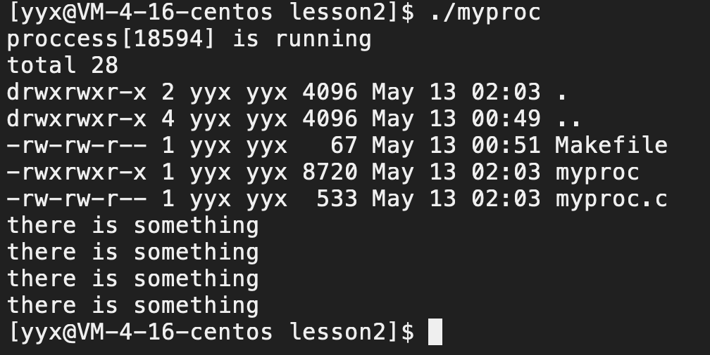

父子进程的代码是共享的，子进程程序替换，理应父进程的程序也会被替换，然而并没有。是因为，当进程发生程序替换时，代码区的代码也会发生写时拷贝。

> 父进程不变，让子进程执行新的程序，这就是进程程序替换的目的。

#### 返回值

- 因为进程程序替换一旦成功，原程序的后续代码就不会被执行。也就是说，`exec*`函数**执行成功就不需要返回值，只有调用失败了才会有返回值**。

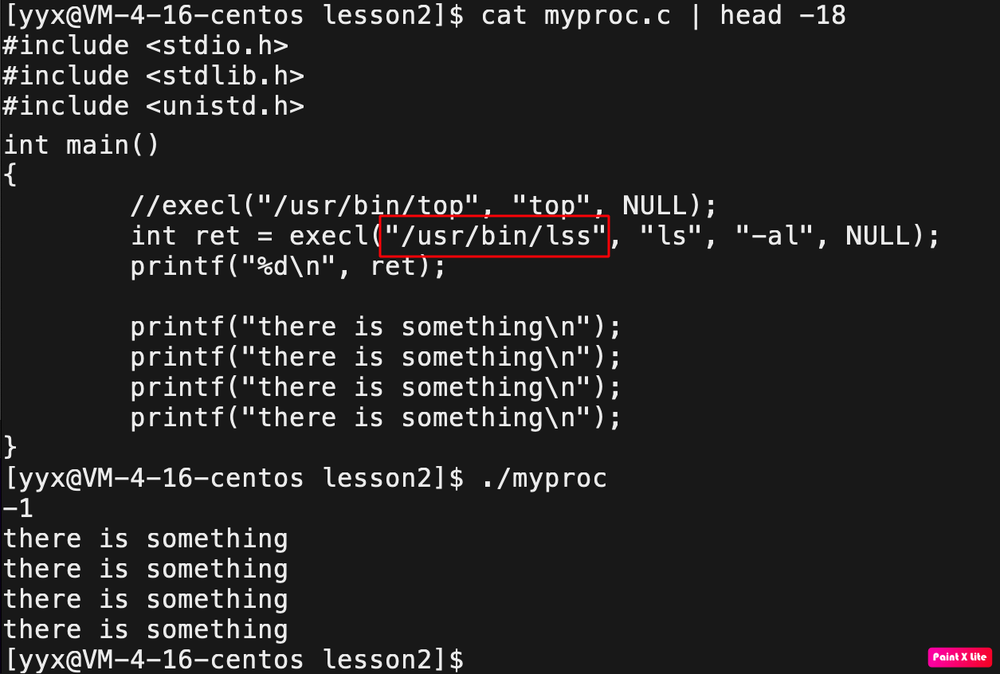

#### 使用方法

```cpp
int main()
{
    if (fork() == 0) { //child -- 进行程序替换
        //exec*
        exit(1);
    }
    //parent -- 等待子进程
    waitpid(-1, NULL, 0);
    printf("parent proc waited success\n");
}
```

> 上述代码就是进程程序替换的测试框架。

进程程序替换虽然有多种接口，根据参数的不同，名称也跟着变化。但本质都是一类的。

`l`代表列表`list`，`v`代表数组`vector`，`p`代表在环境变量中自动搜索的`path`，`e`代表用户自行维护的环境变量`env`。

##### arg & argv

```cpp
int execl  (const char* path, const char* arg, ...);
int execv  (const char *path, char *const argv[]); 
```

- `arg,...`是可变参数列表，就是目标程序的执行所需的**命令行参数，即指令名称和指令选项，以字符串的形式传递**。参数写明最后还要带上一个空指针`NULL`，以标识字符串数组的结尾。
- `argv`是命令行参数数组，也就是把命令行参数和`NULL`放到一个数组中，以数组的形式作参数。本质和`arg,...`一样的。

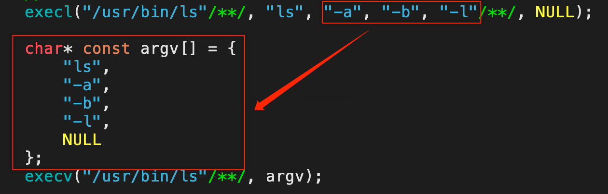

##### path & file

```cpp
int execl  (const char *path, const char *arg, ...);
int execlp (const char *file, const char *arg, ...);
```

- 参数一为路径`path`时，指的是目标程序文件所在的全路径，即所在路径+文件名；
- 函数名带`p`，参数就变成了文件名`file`，因为带`p`表示会在用户环境变量`path`中寻找命令，故地址参数只要传文件名即可。

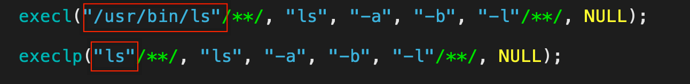

```cpp
int execlp (const char *file, const char *arg, ...);
int execvp (const char *file, char *const argv[]);
```

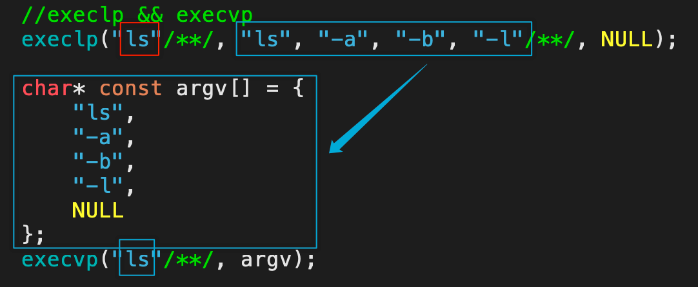

##### envp

```cpp
int execle(const char *path, const char* arg, ..., char *const envp[]);
int execve(const char *path, char *const argv[], char *const envp[]);
```

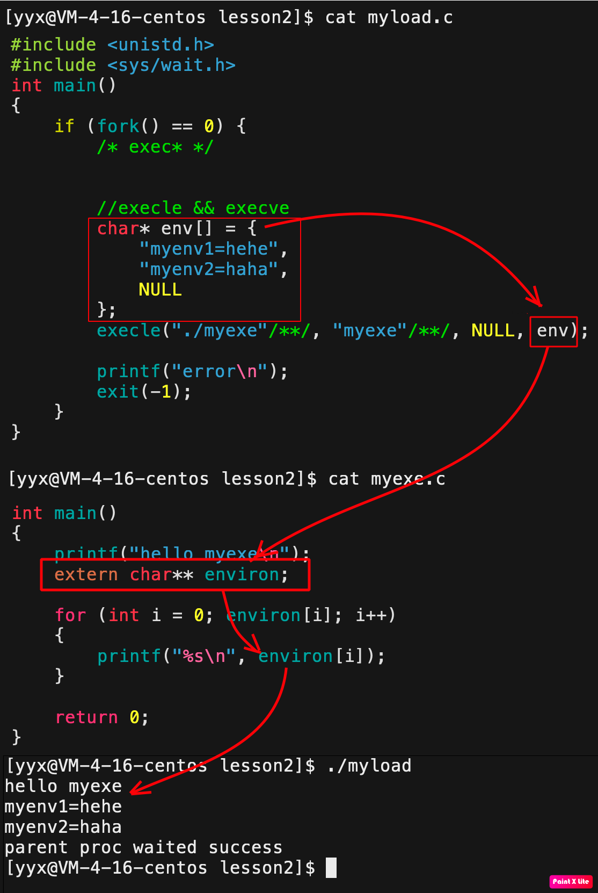

如图所示，`execle`可以将用户自定义的环境变量传入新替换的程序。新程序使用系统定义变量`extern char** environ`可以获得该环境变量。

> `execve`的使用方式和`execle`差不多，这里就不做演示了。

所有的接口的本质并没有什么不同，只是为了使用的方便，做出了多种参数列表的版本。而**以上所有进程程序替换函数都是**

**库函数，都是系统调用函数`execve`的代码复用**。

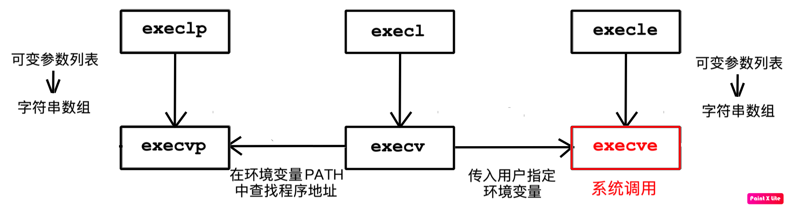

## 5. 命令行解释器模拟

~~~cpp
#include <stdio.h>
#include <unistd.h>
#include <stdlib.h>
#include <string.h>
#include <sys/wait.h>
#include <sys/types.h>

#define CMD_NUM 128
#define ARGV_NUM 64
int main()
{
	char cmd[CMD_NUM]; 
	while (1) {
		cmd[0] =  0;
		//1. 打印提示符
    	printf("[who@HostName mydir]# ");
		fflush(stdout);

    	//2. 获取命令行参数 "ls -a -b -l -n\n\0"
		fgets(cmd, CMD_NUM, stdin);		
		cmd[strlen(cmd) - 1] = '\0'; // 处理fgets读取回车的问题
		//pri1ntf("echo: %s\n", cmd);
		
    	//3. 截取字符串
    	char* argv[ARGV_NUM] = { NULL };

		argv[0] = strtok(cmd, " ");
		//"\0"
		if (argv[0] == 0) { //处理空串的问题
			continue;
		}
		int i = 1;
		while (argv[i] = strtok(NULL, " ")) {
			i++;
		}

		//for (int i = 0; argv[i] != NULL; i++) {
		//	printf("argv[%d]->%s\n", i, argv[i]);
		//}
	
    	//4. 检测内建命令
		if (strcmp(argv[0], "cd") == 0) {
			if (argv[1] != NULL) {
				chdir(argv[1]);
			}
			continue;
		}

    	//5. 执行第三方命令
		if (fork() == 0) {
			execvp(argv[0], argv);
			exit(1);
		}	

    	//6. 获取退出码
		int status = 0;
		pid_t ret = waitpid(-1, &status, 0);
		if (ret > 0) {
			printf("exit code:%d, exit signal:%d\n", \
					(status >> 8) & 0xff, status & 0x7f);
		}
		else {
			printf("wait failed\n")
		}
	}
	return 0;
}
~~~
