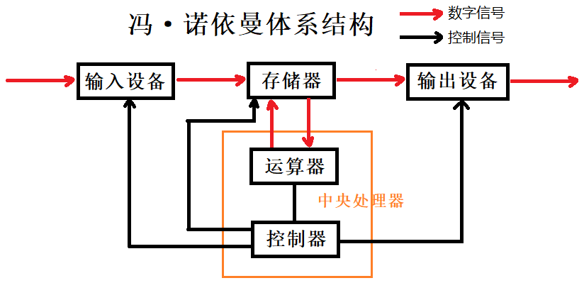
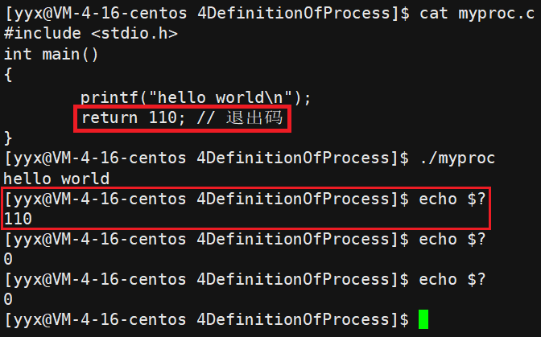

# 进程理解

## 0. 计算机体系

### 0.1 冯诺依曼体系结构

一般主流的计算机，都遵循冯诺依曼体系结构。



计算机硬件的体系结构如下：

| 设备归类       | 具体                   | 解释                                                 |
| -------------- | ---------------------- | ---------------------------------------------------- |
| 输入单元       | 键盘、鼠标、网卡等     | 以内存为视角，输入信号的被称为输入设备               |
| 输出单元       | 显示器，打印机、网卡等 | 以内存为视角，输出信号的被称为输出设备               |
| 存储器         | 内存                   | 存储器指的是内存，并不是磁盘等外部设备               |
| 运算器和控制器 | 中央处理器（CPU）      | 运算器执行数学运算和逻辑运算，控制器执行指令控制逻辑 |

- 输入输出设备都被称为外设。
- 输入设备和输出设备并不是非此即彼的，根据使用情况可归为不同的类。
- 内存是体系结构的核心。
- **外设只能读写内存，不可直接和 CPU 交互。同样 CPU 也只能对读写内存，不能直接访问外部设备**。  

内存分为不同级别的存储单元，如下图所示：


有了存储器，CPU 只和内存进行交互，提升了读写速度。

### 0.2 操作系统的定义

> 系统启动之前是作为文件存储在磁盘中的。只有启动的操作系统才有意义。

#### 操作系统的目的

- **对下：与硬件交互，管理所有的软硬件资源**；
- **对上：为用户程序提供一个稳定、高效、安全的执行环境**。

操作系统的定义：<u>操作系统就是一款针对软硬件资源进行管理工作的软件</u>。

操作系统的核心思想就是管理，也就是对各种资源进行决策和执行。决策需要各种硬软件资源的信息，执行就需要下属的硬软件执行对应的指令。

#### 计算机整体结构

计算机体系结构在宏观上指的是冯诺依曼体系结构。还可以划分的更具体一些：

- 操作系统之下是一些硬件，如网卡、磁盘等，和硬件对应的驱动程序。
- 操作系统内置最基本的系统软件：进程管理、内存管理、文件系统、驱动管理。通过这些系统级软件，管理软硬件资源。
- 操作系统之上就是各种软件和用户级程序。


#### 管理的本质

对于系统中繁多的硬软件资源，管理起来十分复杂。<u>从操作系统的角度看，管理就是先描述、再组织</u>。

| 步骤   | 解释                                                         |
| ------ | ------------------------------------------------------------ |
| 先描述 | **先描述管理对象，再用特定的数据结构将管理对象组织起来**。   |
| 再组织 | **对个体资源的管理工作，就变成了某个数据结构的增删查改**。所有资源都是以这样的管理方式管理起来的。 |

> 以进程管理为例，首先定义出一个描述进程的结构体，即进程控制块 PCB，再将该结构体对象组织起来。

### 0.3 系统调用和库函数

操作系统对下管理软硬件资源，对上提供良好的运行环境。操作系统提供各种系统级的接口给用户级软件，以实现基本功能。

#### 系统调用

操作系统对外表现为一个整体，但是会提供一些接口，供上层开发使用。这部分由操作系统提供的接口，叫做系统调用。

#### 语言库函数

系统调用使用较为复杂，功能较为基础，对用户的要求也比较高。

所以语言创造者对部分系统调用进行一定程度的封装，集成成了库。有了库函数，就更利于上层开发者进行二次开发。

#### 二者的关系

语言库函数在系统调用之上，是上下层的关系。

当然，不是所有库函数都调用系统接口，一般只有和系统硬件交互的函数才会调用系统接口。

> 比如C语言库函数 `printf`，由C语言的开发人员封装了系统提供的硬件接口。

&nbsp;

## 1. 进程的概念

### 1.1 进程的定义

> 肤浅的来说，加载到内存中的程序就叫做进程。这个定义并没有体现出进程和程序的区别，具体的定义在了解进程之后便可以给出。
>

运行中的系统存在大量的进程，操作系统该如何管理这些进程呢？仍然是先描述再组织。

具体点就是，**进程在形成之初，操作系统就会为其创建进程控制块 PCB**。进程控制块PCB用于描述进程，其中存储着进程的所有属性。

从语言层面看，进程信息都被放在一个叫做进程控制块的数据结构中。Linux 系统中，PCB 就是一个名为`task_struct`的结构体。

> Linux 查看进程的命令：

~~~shell
$ ps axj | head -1 && ps axj | grep 'myproc'
 PPID   PID  PGID   SID TTY      TPGID STAT   UID   TIME COMMAND
25486 29733 29733 25486 pts/0    29733 S+    1003   0:00 ./myproc # 这个便是正在运行的proc进程
28110 30073 30072 28110 pts/1    30072 R+    1003   0:00 grep --color=auto myproc

$ ps axj | head -1 && ps axj |grep 'myproc'
 PPID   PID  PGID   SID TTY      TPGID STAT   UID   TIME COMMAND
28110 30726 30725 28110 pts/1    30725 S+    1003   0:00 grep --color=auto myproc
~~~

**启动程序的本质，就是在内存上创建进程。**

#### 进程和程序的区别

- 代码编译生成的二进制可执行文件就是程序，程序本质就是文件。
- 程序被加载到内存中，系统自动为其创建PCB，以管理该进程。故**进程是程序的代码和数据与进程相关的数据结构的总和**。


操作系统在处理进程时， 不直接操作代码程序而是读写 PCB，因为 PCB 中含有程序的所有属性。

也就是说，**进程管理与进程对应的程序毫无关系，只与进程对应的 PCB 强相关**。

#### PCB的内部构成

[Linux中PCB task_struct结构](https://www.cnblogs.com/tongyan2/p/5544887.html)

- 进程编号 —— 每个进程都有编号或称标识符，也就是 PID，具有唯一性用来区别于其他进程。

~~~cpp
#include <sys/types.h>
#include <unistd.h>
pid_t getpid(void);
pid_t getppid(void);
~~~


一般在命令行运行的进程，其父进程都是`-bash`。


- 进程状态 —— 包括进程退出时的退出码、退出信号、任务状态等。

进程结束时的返回值就是返回给系统的退出码，最后被父进程获取。比如 main 函数结束时的`return 0;`。任务状态描述进程的运行状态，比如有等待状态，死亡状态，阻塞状态，挂起状态等。

~~~shell
$ echo $? # 获取最近一次执行命令的退出码
~~~



- 优先级 —— 进程很多而 CPU 只有几个，不可能同时运行多个进程，优先级决定了进程的运行先后顺序。
- 程序计数器 —— 或称 pc 指针，保存程序中即将被执行的指令的地址。
- 内存指针 —— 指向程序代码和进程相关数据的指针，还有和其他进程共享内存块的指针。
- I/O状态 —— 包含显式的IO请求，分配给进程的IO设备，被进程使用的文件列表。
- 审计信息 —— CPU 中有调度模块，负责均衡地调度在运行的进程，使之能较为公平的获得CPU资源得以被执行。而调度模块需要的参考信息就是存在 PCB 中的审计信息。
- 上下文数据 —— 包含进程对应程序的执行状况等信息的数据。

##### 上下文数据


> 如图所示，CPU需要在不同的进程之间来回调度，以保证每个进程相对公平地获取资源。

- 保存上下文：进程之间的来回切换，必须确保在进程被切换后，其的临时数据被更新并存储在它对应的 PCB 中，以便之后再接着上次继续执行。 
- 恢复上下文：这些临时数据就叫做上下文数据，都被存储在寄存器中，当进程被执行时，其 PCB 中的上下文数据就交给了 CPU，以便 CPU 接着上次的地方继续执行。


### 1.2 进程的查看

进程信息可通过查看系统目录`/proc`的方式查看：


Linux 系统提供以查看文件的方式查看进程。每个进程创建之初都会在`/proc`目录下创建一个目录，并以进程编号命名。进程结束时自动消失。

> 该目录是虚拟目录并不是真实存储在磁盘上的。不仅如此，用户通过命令行查看到的所有文件都是被加载到内存中的，而不是在磁盘上的，


### 1.3 进程的创建

当我们在系统上运行程序时，也就是创建了一个进程。本次介绍**在程序中创建进程的系统调用函数 fork**。

~~~cpp
#include <sys/types.h>
#include <unistd.h>
pid_t fork(void);
~~~

fork 之后会出现两个执行流，一个是原有进程的，一个是 fork 创建出来的进程。所以之后打印语句两个进程都会执行一遍。

#### fork的返回值

fork 的返回值分两种情况：

1. 进程创建失败时：给父子进程都返回一个负值；
2. 进程创建成功时：给父进程返回子进程的`pid`，给子进程返回`0`。

> 如何理解两个返回值？
>

fork函数返回之际，创建进程的核心任务已经完成，此时子进程已被创建完成，开始被 CPU 调度。

**所以 `return` 语句理应被父子进程都执行一遍**。因此父子进程都会得到一个返回值。返回值不同，也是发生了写时拷贝。

> 为什么要有两个返回值？
>

父进程只有一个，而子进程有多个。

父进程只能通过返回值的形式获取子进程的 pid 去管理子进程，而子进程可通过 getppid 函数可获得父进程的id。

~~~cpp
pid_t id = fork();      
if (id == 0)     // child       
{}    
else if (id > 0) // parent     
{}  
else             // fail    
{}
~~~

fork 之后，父子运行的先后问题不受用户控制，和 CPU 调度状态有关。

#### fork的原理

fork 成功后，系统中多出一个进程。**父子进程共用一份程序的代码数据，多出来的是子进程相关的内核数据结构**。

- 子进程的内核数据结构 PCB 也会以父进程的为模板，来初始化自己的内核数据结构；
- 子进程和父进程访问同一份代码和数据，也就是**执行和访问父进程fork之后的代码和数据**。

> 代码和数据在运行过程中被修改怎么办？

由于程序代码在运行时是不可被修改的，父子进程共享一份代码即可。

一般情况下，数据同样也是共享的。但如果**任意某个执行流修改了数据，此时该数据就会发生“写时拷贝”。**

操作系统将该数据在内存中拷贝一份，修改方会修改并访问新数据，原数据留给其他执行流访问，以保证数据的独立性。

&nbsp;

## 2. 进程的状态


> - 当进程获得处理器，由就绪状态转为运行状态。
> - 当进程被剥夺处理器，系统分配的时间片结束，进程由运行状态转为就绪状态。
> - 当运行进程因某事件受阻，如资源被占用，IO传输未完成，进程由运行状态转为阻塞状态。
> - 当事件等待结束，如得到申请资源，I/O传输完成，进程由阻塞变为就绪状态。
>
> 以上都是笼统抽象的进程运行状态，不易理解用处不大，只是适用范围广。弄清楚系统的运行状态，必须深入一款操作系统。

### 2.1 查看进程状态

进程的状态信息都保存在进程进程控制块 task_struct 中。进程状态用于**描述该进程当前所处的运行状态**，意义是便于操作系统快速判断进程的状态，按状态分类进程，以更高效地管理进程。

LInux 中具体的状态分为如下几种：

| 进程状态 | 状态          | 解释                                                         |
| -------- | ------------- | ------------------------------------------------------------ |
| **R**    | running       | 运行状态，相当于就绪和运行态两种之和。进程可能正在被 CPU 调用，也可能在运行队列中等待时间片到来。 |
| **S**    | sleeping      | 进程想完成某种任务，但任务条件不具备。如资源被占、IO进行中，此时进程被放入等待队列。 |
| **D**    | disk sleeping | S 是可中断睡眠，D是不可中断睡眠（深度睡眠）当进程使磁盘长时间读写，该进程长时间等待结果，为防止操作系统将其误杀，此时进程状态改为D状态，该状态仅作了解。 |
| **T**    | stopped       | 暂停状态，S 是浅度睡眠，进程数据可被更新，进程可以被唤醒。但 T 状态是彻底的暂停状态，仅作了解。 |
| **t**    | tracked       | 追踪暂停状态，进程正在被追踪故暂停，比如程序遇到断点而暂停。 |
| **X**    | dead          | 进程终止，内核数据结构和代码数据都被释放回收完成。           |
| **Z**    | zombie        | 进程僵尸状态，进程运行结束但操作系统正在或还未检测，其所占空间未被回收。一般进程结束时都要经历从 Z 到 X 状态。 |

进程不仅可以等待 CPU 调度，也可以等待硬件资源读写操作。

- 等待 CPU 调度的进程处于`R`状态，被放入运行队列中随时被调用。运行状态的进程被从运行队列放入等待队列，被称为挂起等待，从上层角度叫做阻塞。
- 等待资源或读写的进程处于`S/D`状态，被放入等待队列中，以待条件具备并完成任务。进程被从等待队列放入运行队列，就叫做唤醒进程，等待成功了。

> R S T 三种状态展示，+ 表示在前台运行。


### 2.2 两种特殊状态

命令行监控进程状态脚本：

~~~shell
while :; 
	do ps axj | head -1 && ps axj | grep myproc | grep -v grep; 
	sleep 1; 
	echo "/################################################################/"; 
done
~~~

#### 僵尸进程

一般进程运行结束时需要回收资源，**检测进程是否终止和回收资源的工作由该进程的父进程承担**。如果进程没有被及时检测并回收，该进程结束就进入 Z 状态。

> 因此，在父进程休眠的过程中，及时将子进程杀死，防止父进程将其回收，就可以看到子进程的僵尸状态。


倘若此时父进程一直休眠，子进程一直不被回收，就造成了内存泄漏，所以要避免这种僵尸状态的发生。

> 如何避免的问题放到进程控制中在详谈。

#### 孤儿进程

当子进程正在运行，但父进程提前退出时，**其父进程就变为1号进程也就是操作系统**。称为子进程被操作系统“领养”，该子进程就被叫做“孤儿进程”。


#### 区别

- 僵尸进程是父进程休眠中子进程终止，子进程无法被收尸。
- 孤儿进程是子进程运行中父进程终止，子进程被系统领养。

&nbsp;

## 3. 进程优先级

### 3.1 优先级的概念

> 一般计算机中 CPU 只有一两个而进程可能有小一千个。这种局面促使我们必须要提出解决方法。

CPU 资源太少而进程太多“僧多粥少”，所以进程必须要进行排队等待调度分配 CPU 资源。

故赋予进程“优先级”（priority）的属性，提高或降低进程原本的优先权，促使其优先或延迟被 CPU 处理，可以提升系统运行的效率。

#### 进程的性质

- 竞争性：系统进程数目众多，而 CPU 资源只有少量，甚至1个，所以进程之间是具有竞争属性的。为了高效完成任务，更合理竞争相关资源，便具有了优先级。
- 独立性：多进程运行，需要独享各种资源，多进程运行期间互不干扰。
- 并行：多个进程在多个 CPU 下分别同时进行运行，这称之为并行，真正意义上的多进程同时运行。
- 并发：多个进程在一个 CPU 下采用进程切换的方式，在一段时间片之内，让多个进程都得以推进，称之为并发。

### 3.2 查看进程优先级

~~~shell
$ ps -l -a # 查看进程相关信息
F S   UID   PID  PPID  C PRI  NI ADDR SZ WCHAN  TTY          TIME CMD
0 S  1003 24805 24154  0  80   0 -  1833 hrtime pts/1    00:00:00 myproc
0 R  1003 24970 24704  0  80   0 - 38595 -      pts/2    00:00:00 ps
~~~

| 标识符 | 解释     | 含义                                                         |
| ------ | -------- | ------------------------------------------------------------ |
| UID    | UserID   | 创建进程的用户的编号。                                       |
| PRI    | priority | 表示进程的基础优先级，值越低优先级越高。                     |
| NI     | nice     | 优先级的修正值，取值范围$[-20,19]$共40个级别，调整 NI 值就是调整优先级。<br/>$80+NI=PIR_{new}$，初始值加修正值才是进程的真正优先级。 |

一般进程的 PIR 都是80，PIR 不同说明进程大类不同。在此基础上的修正值用于动态调整，二者区分开，便于查看调整幅度。

### 3.3 调整进程优先级

进程优先级一般由操作系统自主管理，人为修改可能导致降低效率适得其反。

~~~shell
$ man sched_get_priority_max
$ nice
$ renice
~~~

> 上述是系统提供修改进程优先级的调用接口或指令。但不建议轻易修改。

更推荐使用简单的`top`指令，输入`r`，输入对应进程编号，以及 NI 值。


- $PIR$ 显示的都是调整之后的新优先级值。准确的来说，是 $80+NI$，这个$NI$是本次输入的修正值。

不管之前进程的优先级是多少，本次修改都是从80开始算起。修改之后的 $PIR$ 显示的都是初始值 $80$ 加上输入的修正值 $NI$。

- 不管输入的 $NI$ 值是多少，修正的范围只有$[-20,19]$。换言之，输入的值超出这个范围无效，相当于输入区间的最值。

> 优先级不是绝对的、是一种相对的概念，这也是$NI$的调整范围较小的原因。如果调整的跨度很大，很可能导致其他进程被搁置，产生“饥饿问题”。
>
> 调度器就是要让所有进程都较为均衡地享受到 CPU 资源。

&nbsp;

## 4. 环境变量

### 4.1 环境变量的概念

环境变量指操作系统中用来**确定系统运行环境的一些参数，环境变量是系统级的变量，属于全局变量**。比如 C/C++ 代码中链接的动静态库的地址在安装环境的时候就被放在了环境变量里。`11`


执行用户编写的代码时需要在文件名前加`./`，以辅助操作系统确定执行文件的位置。系统级的指令同样也是文件，但使用指令时却直接输入文件名。

这是因为系统级指令的所在目录都被放入环境变量`PATH`中，每个目录以`:`分隔。

~~~shell
[yyx@VM-4-16-centos lesson3]$ echo $PATH
/usr/local/bin:/usr/bin:/usr/local/sbin:/usr/sbin:/home/yyx/.local/bin:/home/yyx/bin
~~~

系统在查找指令的时候，就是按顺序从头到尾到每个目录中挨个查找，找到则停止查找并允许当前路径下的可执行程序，找不到则报错。

~~~shell
#1.
[yyx@VM-4-16-centos ~]$ export PATH=/home/yyx/4DefinitionOfProcess/lesson3 # 覆盖PATH
[yyx@VM-4-16-centos ~]$ echo $PATH
/home/yyx/.local/bin:/home/yyx/bin
#2.
[yyx@VM-4-16-centos ~]$ export PATH=$PATH:/home/yyx/4DefinitionOfProcess/lesson3 # 添加PATH
[yyx@VM-4-16-centos ~]$ echo $PATH
/usr/local/bin:/usr/bin:/usr/local/sbin:/usr/sbin:/home/yyx/.local/bin:/home/yyx/bin
~~~

 `export`修改`PATH`的方式，都是内存级的修改。也就是说，仅本次登录有效。

> 环境变量是系统级别的变量，不建议用户过多修改。需要修改只改本次就行，系统环境变量被放在`~/.bash_profile`的文件内。

### 4.2 环境变量的查看

1. `PATH`：系统级指令的搜索路径；
2. `HOME`：当前用户的工作目录（家目录）；
3. `SHELL`：系统命令行解释器的具体名称，通常是 bin/bash 等；


4. 使用`env`命令可直接查看系统内所有环境变量。


环境变量也是变量，本质就是操作系统在内存磁盘中开辟的空间，用来保存系统相关的数据。简单来说，环**境变量就是系统维护的一个全局变量表，用于辅助系统维护一些程序的运行**。

### 4.3 环境变量的组织形式

#### 命令行参数

在曾经C语言的学习过程中，了解到`main`函数的参数声明可以是如下方式：

~~~cpp
int main (int argc, char* argv[]);
~~~

`argc`,`argv`分别是 **参数个数** _argument counter_ 和**参数值** _argument value_ 的简称。参数指的是命令行参数，也就是输入指令时所带的选项。

命令行参数是指令名称和其所带的选项的统称。指令和选项都被看作字符串，所以`argv`是个字符串指针数组。

~~~shell
$ ls -a -b -c -d # argc = 6, argv = {"ls", "-a", "-b", "-c", "-d"}
~~~

- `argc`是命令行参数的个数
- `argv`是命令行各个参数的字符串组成的字符串数组。首元素是指令名称，故之后的元素下标正好是参数的位数。


> 数组传参，最好将元素个数也一并传入。为防止越界访问，可以在数组结尾的下一个位置存入`NULL`以标识边界。

既然命令行参数会以参数的形式传入主函数，则可以根据参数的不同完成同一个代码的不同子逻辑。


~~~cpp
int main(int argc, char* argv[], char* env[]); 
~~~

从上述主函数的声明可以看出环境变量`env`也是字符串数组，也可以做主函数的参数。和命令行参数一致，环境变量也是依靠字符串数组组织起来的。


~~~cpp
int main(int argc, char** argv, char** env)
{
    for (int i = 0; env[i]; i++) {
        printf("env[%d]->%s\n", i, env[i]);
    }
}
~~~

### 4.4 环境变量的获取

#### 系统变量environ

~~~cpp
int main(int argc, char** argv)
{
    extern char** environ; //声明环境变量指针
    for (int i = 0; environ[i]; i++)
    {
        printf("environ[%d]->%s\n", i, environ[i]);
    }
}
~~~

 环境变量指针`environ`是系统的一个全局变量，也是字符串数组。和`main`函数的参数`char* env[]`一个道理。

#### 系统调用put/setenv getenv

主函数

大部分情况都不会使用参数`env`和系统变量`environ`两种获取环境变量的方式，一般都是用系统调用接口 _putenv_ 和 _getenv_。

~~~shell
$ man putenv && man getenv
# putenv
NAME
       putenv - change or add an environment variable
SYNOPSIS
       #include <stdlib.h>
       int putenv(char *string);
DESCRIPTION
       The  putenv()  function  adds  or changes the value of environment variables.  The argumentstring is of the form name=value.  
       If name does not already exist in the environment,  then string  is  added  to  the  environment.  
       If name does exist, then the value of name in the environment is changed to value.  The string pointed to by string becomes part of the environment, so altering the string changes the environment.
RETURN VALUE
       The putenv() function returns zero on success, or nonzero if an error occurs.  In the eventof an error, errno is set to indicate the cause.
# getenv       
NAME
       getenv, secure_getenv - get an environment variable
SYNOPSIS
       #include <stdlib.h>
       char *getenv(const char *name);
DESCRIPTION
       The  getenv() function searches the environment list to find the environment variable name, and returns a pointer to the corresponding value string.
~~~

~~~cpp
printf("PATH->%s\n", getenv("PATH"));
printf("HOME->%s\n", getenv("HOME"));
printf("SHELL->%s\n", getenv("SHELL"));
~~~

即便如此，环境变量在开发中也很少使用到，学习环境变量主要是为了更好的理解进程。环境变量主要是用来给父子进程传递数据。

> 导入环境变量用的是`putenv`和`setenv`，获取环境变量用的是`getenv`。接口使用上要注意如下细节：

- putenv

putenv 是直接将参数字符串放到到环境表中，如果字符串变量出了作用域，环境变量就没了。

> 如果是在函数中定义的字符串，那么之后字符串很有可能被释放，就找不到该环境变量了。

- setenv

setenv 不同，它将name和value指向的内容复制一份并为其分配内存，形成环境变量字符串将其地址写入到环境表中。就不会出现上面putenv的问题。。

### 4.5 环境变量的全局属性


每一个主动创建的进程都是被操作系统加载到内存中的，它们的父进程都是`bash`。`bash`创建之初就会从磁盘上导入环境变量，所以我们的进程的环境变量就是从父进程`bash`中导入的。


将本地变量导入环境变量后，再运行进程就会从`bash`导入环境变量，即可调用`getenv`成功打印。

也就是说，环境变量是可以被继承的。命令行运行的进程从命令行解释器处继承环境变量，而子进程也会从父进程处继承环境变量。这样，环境变量就影响了整个用户系统。

&nbsp;

## 5. 进程地址空间

### 5.1 虚拟地址空间的定义

在C/C++动态内存管理章节处，有个程序地址空间的概念。但从语言的角度，无法深入理解这个概念，因为它是操作系统中的概念。


多打印几个变量可以看到堆栈相向而生的现象，栈区由高到低，堆区由低到高。


 如下代码，子进程修改了父进程的数据，应当发生写时拷贝，也就是会拷贝一份`g_val`单独给子进程使用，此时父子进程同时打印`g_val`的地址。

```cpp
int g_val = 0;
int main() {
    if (fork() == 0) { //child
        int cnt = 5;
        while (cnt--) {
            printf(" I am child proc, g_val=%d, &g_val=%p, times:%d\n", g_val, &g_val, cnt);
            sleep(1);
            if (cnt == 3) {
                printf("################ child change g_val ###################\n");
                g_val = 200;
                printf("################ g_val changed done ###################\n");
            }
        }
        exit(0);
    }
    //parent
    while (1) {
        printf("I am parent proc, g_val=%d, &g_val=%p\n",g_val, &g_val);
        sleep(1);
    }
    return 0;
}
```


结果是修改前后父子进程的`g_val`的地址是一样的。也就是说，**C/C++打印出的地址并不真实的物理地址，而是虚拟的逻辑地址**。

> 一般C/C++打印的地址都是虚拟地址，再由操作系统链接到真实地址。但不排除一些简单系统不使用虚拟地址。

程序地址空间，在操作系统的角度，准确的来说叫做**进程虚拟地址空间**。每个进程都拥有一个进程地址空间，每一个进程都认为自己独占即拥有物理内存。

设计出进程地址空间，是为了更好地管理进程的内存操作。仍然是先描述再组织的方式，系统为每一个进程分配一个结构体`mm_struct`，它就是具体的进程地址空间变量，用来描述进程地址空间。

故地址空间本质是内核中的一种数据类型`mm_struct`，每个进程都有独有一份地址空间。操作系统会将地址空间映射到物理地址上。

~~~cpp
struct mm_struct {
    size_t stack_begin;
    size_t stack_end;
    size_t heap_begin;
    size_t heap_end;
    //...
};
~~~

可能内核中的`mm_struct`里面就是这样的一堆变量，虚拟出的堆区栈区等等内存区域的下标。所以说，堆区栈区这样区域本质就是两个下标进行划分。

~~~cpp
struct mm_struct {
    size_t stack_begin;
    size_t stack_end;
    size_t heap_begin;
    size_t heap_end;
    size_t malloc_begin = 0x778010, malloc_end = 0x778014; // 在内存上开辟了4字节的空间，就是创建了这样的下标变量
    //...
};
~~~

语言上的开辟内存空间就是在结构体`mm_struct`中创建两个整型变量（相当于下标，指明一段区间长度），并不一定是真实地将内存上一段空间划分给了进程。


虚拟地址就像一把刻度尺，起划分区域的作用，单纯看这些虚拟地址就可以确定变量的位置。物理内存中是没有什么栈区堆区这样的区域概念的，就是单纯的存放数据。

进程并不需要关心真实地址，它就认为自己的`mm_struct`代表整个内存，都属于当前进程的，自己有权限使用所有的内存空间。由操作系统充当中间人，将真实地址和虚拟地址关联映射起来。

操作系统通过页表和 MMU，将虚拟地址和物理地址关联映射起来。

1. MMU 也叫做内存管理单元，集成在 CPU 中，它的作用是查页表。
2. 页表是用操作系统提供的一张映射散列表，如图所示，其左侧一列存放虚拟地址，右侧一列存放虚拟地址所映射的真实地址。


### 5.2 进程地址空间的意义

1. 通过中间层，有效地实现对进程的内存操作进行风险管理 （权限管理），本质就是更好的保护物理内存和进程安全。

   - 通过页表对访问的地址进行管控，**防止进程越界访问非法空间**，导致程序出错或威胁进程安全。

   - 页表也会针对虚拟地址所在区域，**给进程在访问对应的物理地址的时候设置权限**。比如进程访问字符常量区数据时，不允许其写入对应的真实地址。

2. 通过内存管理算法，将应用和内存管理进行解耦，进程开辟内存的操作和操作系统的内存管理实现软件层面上的分离。

   - 内存申请和使用的概念在时间上区分开来。申请的空间不会立即在内存上分配出去，能够做到实际使用空间再将其划分给进程，或者用了多少给多少。**更加人性化高效率地使用内存，避免了空间浪费**。

	
	> 申请的时候只是在虚拟地址空间上划出了一段区域，可以说是假的空间，等到使用空间时再将虚拟地址映射到物理内存上。这就是基于缺页中断进行物理内存申请。

3. 从操作系统和应用层的角度，**进程能够避免差异化，以统一的方式看待内存**，且虚拟地址的划分是相对确定的，CPU 访问地址空间的方式也相对统一。

   > 每个进程都有独立的地址空间，其程序的入口主函数的地址是一致的，这样 CPU 在调度进程时就可以更加快捷。差异化会造成更多特殊情况，更加容易出错。

4. 通过页表的映射，进程的相关代码和数据可以**随意的存储在物理内存中，大大节省了空间**，且不会影响 CPU 读取效率

	> CPU执行进程直接访问的是进程相关数据结构，也就是虚拟地址，再通过页表映射到真实地址。

**进程PCB`task_struct`，进程地址空间`mm_struct`以及页表**都是进程相关的数据结构，都是在进程创建之初形成的。


> 子进程的创建是以父进程为模版的，继承了父进程的代码数据还有进程数据结构。所以全局变量`g_val`的虚拟地址也是一样的， 但当子进程修改时，操作系统重新开辟一段空间给子进程，这就是写时拷贝。

写时拷贝是**在物理内存上重开空间，将进程页表中虚拟地址重新映射到新位置**。这个过程完全是在系统底层实现的，并没有涉及到虚拟地址，虚拟地址没有被修改，打印结果自然一样。

父子进程之间共享程序代码和数据也是通过虚拟地址映射到同一段物理地址上的，这就是共享带代码数据的原理。


