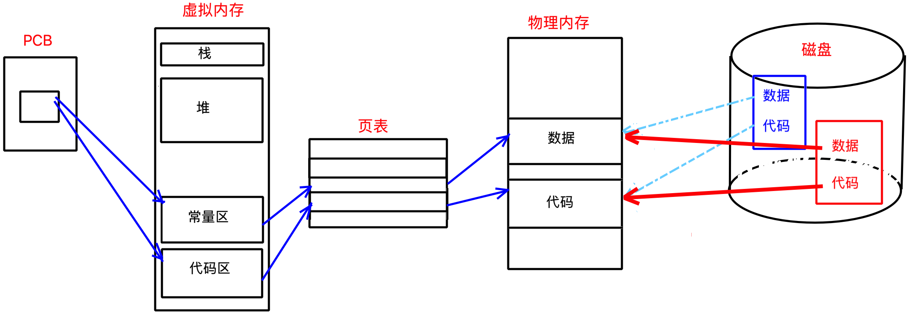

<font color=green>1. 动静态链接的不同？以及优缺点是什么？</font>

静态链接是在链接时，将库文件链接进程序文件中，会导致程序文件占存大。

动态链接是在程序运行时，由系统的装载程序将内存中的库，加载进程序。

| 动静态链接   | 优点                       | 缺点                   |
| ------------ | -------------------------- | ---------------------- |
| **静态链接** | 运行速度快                 | 浪费空间、更新较为麻烦 |
| **动态链接** | 避免空间浪费、维护比较方便 | 运行速度相对慢一点     |

<font color=green>2. 进程和程序的区别是什么？</font>

程序的本质是二进制文件。进程是程序的代码数据和进程相关内核数据结构的总和。

> 进程相关的内核数据结构一般有：进程控制块、进程打开的文件、进程地址空间等。

<font color=green>3. 僵尸进程和孤儿进程，分别是什么？</font>

- 僵尸进程是指进程死亡后资源不被回收，停留在僵尸状态没有死亡。通常是父进程因某种原因无法释放该进程，造成资源泄漏。
- 只要父进程没有wait或waitpid，子进程就一直保持僵尸状态。

- 孤儿进程是指进程的父进程变成1号进程，被系统领养。通常是因为父进程提前结束导致的。

> 父进程退出，当前前台进程就变成shell解释器，所以孤儿进程就变成了后台进程。

精灵进程和守护进程是一种进程，脱离终端，独立存在。

<font color=green>4. 进程地址空间是什么？</font>

每一个进程都有自己独立的mm_struct 结构体，描述进程的虚拟地址空间。

用始末两个指针来维护一段空间，其中有多个指针，标识不同区域。

系统通过页表和 MMU，将虚拟地址和物理地址关联起来。

<font color=green>5. 进程地址空间存在的意义是什么？</font>

- 防止进程非法访问空间，保护内存和进程安全。
- 将进程管理和内存管理解耦，高效使用内存。
- CPU能以统一方式看待进程的代码和数据。数据也可以随意存储在物理内存中。

<font color=green>6. 如何理解fork返回值问题？</font>

fork 函数 return 时会有两个执行流，父进程得到子进程 pid，子进程得到 0。父子进程同一个变量值却不同，也是发生了写时拷贝。

<font color=green>7. 写时拷贝是如何实现的？</font>

写时拷贝是在物理内存上重新开辟空间，修改方的页表将变量的虚拟地址和新空间的真实地址作映射。

写时拷贝完全是系统底层做的工作，并不会改变虚拟地址，所以用户层无法感知。

<font color=green>8. 进程程序替换的原理？</font>

将调用程序替换的进程的代码和数据的页表地址映射到其他程序代码和数据。

这样就把进程的程序替换了。这个过程没有产生任何的新进程。



<font color=green>9. 操作系统如何管理内存中的文件？如何管理进程打开的文件？</font>

文件是文件内容和属性的集合，内核使用文件结构体`struct file`描述单个打开的文件，并使用某种数据结构将所有打开的文件组织起来。

进程有个内核数据结构叫`strcut files_struct`，其中有文件描述符数组`struct file* fd_array[]`，该数组保存进程打开的文件结构体的地址，数组下标称为文件描述符，进程通过文件描述符访问文件。


<font color=green>10. 重定向的原理？</font>

内核态下，修改进程对应文件描述符表的特定下标位置的内容，致使该文件描述符指向其他文件。这个过程上层是无法感知的。

```cpp
dup2(oldfd, newfd);
```

将 oldfd 位置内容拷贝至 newfd 位置上，newfd 指向 oldfd 的文件。

<font color=green>11. 用户缓冲区和内核缓冲区是什么？</font>

`fwrite`将数据写入到用户缓冲区，`fflush`将用户缓冲区数据刷新到内核缓冲区。

`write`将数据写入到内核缓冲区，`fsync`将内核缓冲区数据刷新到硬件设备上。

缓冲区的作用是，囤积一定量的数据在内存中，最后统一刷新到硬件设备上，提高IO效率。

<font color=green>12. 子进程是否会继承缓冲区？</font>

不管是用户缓冲区还是内核缓冲区都属于进程的代码和数据，父子进程共享，任意一方刷新缓冲区就会触发写时拷贝。

<font color=green>13. 文件的增删查改是如何在磁盘上实现的？</font>

```shell
$ touch test.txt # 创建文件
```

1. 先到 inode bitmap 中找到空余的 inode 位置，并创建该文件的 inode；
2. 然后将文件名 test.txt 和该 inode 的映射关系，放到文件所在目录的 block 中。

```shell
$ echo "test" > test.txt # 修改文件
```

1. 先从文件所在目录的 block 中获取该文件的 inode；
2. 然后根据 inode 找到文件的 block，然后将字符串填入 block 中。

```shell
$ cat test.txt # 查看文件
```

1. 先从文件所在目录的 block 中获取该文件的 inode；
2. 然后根据 inode 找到文件的 block，将其中的内容全部打印到屏幕上。

```shell
$ rm test.txt # 删除文件
```

1. 先从文件所在目录的 block 中获取该文件的 inode；
2. 将 inode bitmap 中 inode 位置置空。
3. 然后到所在目录的 block 中将该文件名和 inode 的映射全部删除。

<font color=green>14. 软硬链接的本质？</font>

创建软链接：

复制原文件的 inode，创建一份新的文件，不过该文件的 block 中保存的是原文件的路径。原文件删除，软链接就无法使用了。

删除软链接：和删除文件一样，置空该文件在 inode bitmap 和 block bitmap 中的位置。

创建硬链接：

将原文件的inode和新文件名在某个目录下建立一对映射关系。硬链接数就是表示该 inode 存在多少对映射关系，本质是引用计数。

删除硬链接：只是删除当前目录下的这一对映射关系。当硬链接数为0时，才将文件彻底删除。

<font color=green>15. 如何生成和使用动静态库？</font>

```makefile
# 生成静态库
libmath.a : add.o sub.o
    ar -rc $@ $^ 
%.o : src/%.c
    gcc -c $<
# 生成动态库
libmath.so : add.o sub.o
    gcc -shared -o $@ $^
%.o : src/%.c
    gcc -fPIC -c $<
# 使用库
test : test.c
	gcc -o $@ $^ -I inc_path -L lib_path -l libname
```

<font color=green>16. 动态链接和静态链接的区别？</font>

- 静态链接是在链接时就将库文件和源文件链接，放到一块形成可执行程序。
- 采用动态链接的程序，链接时不链接库文件只链接源文件。在程序执行时，由加载器将库的代码和数据映射进进程的地址空间中，执行库代码的动作和本地代码的动作一致。


|              | 缺点                       | 优点                       |
| ------------ | -------------------------- | -------------------------- |
| **静态链接** | 空间浪费严重，更新较为麻烦 | 运行速度相对快一点         |
| **动态链接** | 运行速度相对慢一点         | 避免空间浪费，维护比较方便 |

<font color=green>17. 什么是与位置无关码？</font>

动态库不像静态库直接链接到可执行程序文件内部，动态库是所有可执行文件共享的，载入程序地址空间的位置和大小都是不确定的。所以动态库中的地址全部采取偏移量的形式，载入进程地址空间后再加上库位置的起始地址，就变成正确地址了。

<font color=green>11. </font>

<font color=green>11. </font>

<font color=green>11. </font>

<font color=green>11. </font>

<font color=green>11. </font>

<font color=green>11. </font>

<font color=green>11. </font>

<font color=green>11. </font>

