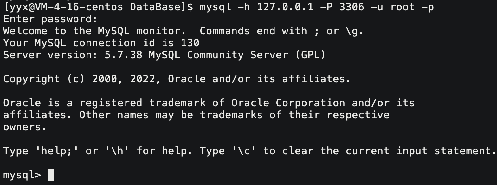
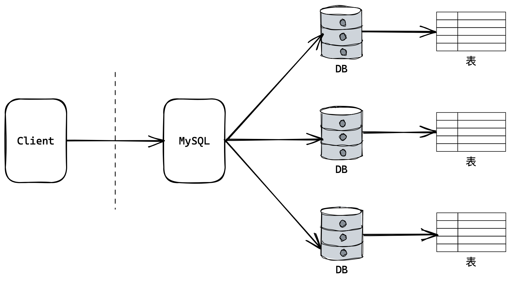

# MySQL数据库

## 1. 基础概念

### 1.1 什么是数据库

> 存储数据用文件就可以了，为什么还要弄个数据库？

文件保存数据有以下几个缺点：

- 文件的安全性问题
- 文件不利于数据查询和管理
- 文件不利于存储海量数据
- 文件在程序中控制不方便

数据库存储介质：磁盘、内存。

> 为了解决上述问题，专家们设计出更加利于管理数据的东西——数据库，它能更有效的管理数据。数据库的水平是衡量一个程序员水平的重要指标。 

1. 软件角度：可以认为数据库是程序和磁盘之间的软件层，帮助用户更方便的进行文件管理。数据库实际上也是用文件保存数据的。
2. 文件角度：数据库实际上是一个网络服务器，我们通过数据库客户端访问数据库服务器后台的数据库库表结构。


### 1.2 连接数据库

```mysql
mysql -h 127.0.0.1 -P 3306 -u root -p
```



所谓安装数据库，就是在机器上安装了一个数据库管理系统程序，这个管理程序可以管理多个数据库， 一般开发人员会针对每一个应用创建一个数据库。

为保存应用中实体的数据，一般会在数据库中创建多个表，以保存程序中实体的数据。

数据库服务器、数据库和表的关系如下:



查看MySQL数据库配置文件中的内容：


`datadir`指明的路径就是MySQL各种数据保存的位置。可以简单理解：

- **创建库就是在该目录下创建一个目录**；
- **创建表就是在库目录下创建对应的文件**。


### 1.3 基本操作

#### 库操作

- 创建数据库

```mysql
create database db_name;
```

- 使用数据库

```mysql
use db_name;
```

- 展示数据库

```mysql
show databases;
```

#### 表操作

- 创建数据表

```mysql
create table `tb_name` (
	# ...
);
```

- 展示数据库

```mysql
show tables;
```

- 查看表结构

```mysql
desc tb_name;
```

- 查看表内容

```mysql
select * from `tb_name`;
```

- 插入一列

```mysql
insert into `tb_name` (parm1, parm2) values (value1, value2);
```

### 1.4 数据逻辑存储

		

MySQL是关系型数据库，数据存储是有逻辑的，按行列存储就是它的逻辑。通常我们把一行称之为一条记录。一列被称为属性内容。

### 1.5 MySQL架构

MySQL 是一个可移植的数据库，几乎能在当前所有的操作系统上运行，如 Unix/Linux、 Windows、 Mac 和
Solaris。各种系统在底层实现方面各有不同，但是 MySQL 基本上能保证在各个平台上的物理体系结构的一致性。


最底层是硬件如磁盘等，再往上就是存储引擎，可以认为存储引擎就是封装底层文件的接口，并向上提供自己的接口，也就是帮助我们进行文件操作。

SQL中有多种多样的存储引擎，最常见的就是ISAM和InooDB。这些存储引擎是支持“插拔”的，也就是想用那个引擎就用那个。

再其上的分析器就是对发过来的SQL语句做词法语法分析，将SQL语句翻译成底层的文件操作。 这些都是被上层的MySQL服务程序管理的。再往上就是命令行终端或者提供给各种语言的接口。

### 1.6 SQL分类

| 简称 | 名称         | 用途                   | 代表                   |
| ---- | ------------ | ---------------------- | ---------------------- |
| DDL  | 数据定义语言 | 用来维护存储数据的结构 | create, drop, alter    |
| DML  | 数据操纵语言 | 用来对数据进行操作     | insert, delete, update |
| DQL  | 数据查询语言 | DML的分支              | select                 |
| DCL  | 数据控制语言 | 主要负责权限管理和事务 | grant, revoke, commit  |

SQL也有种类之分，因为不同的人使用SQL的需求不同。

### 1.7 存储引擎

存储引擎是：数据库管理系统如何存储数据、如何为存储的数据建立索引和如何更新查询数据等技术的实现方法。 **MySQL的核心就是插件式存储引擎，支持多种存储引擎**。

#### 查看存储引擎

```mysql
show engines \G;
```


&nbsp;

> 从现在开始，就是学习SQL语句了。

## 2. 库的操作

### 2.1 创建数据库

```mysql
#1.
create database db_name;
#2. 
create database [if not exists] db_name [create_specification [, create_specification] ...]
create_specification:
	[default] character set charset_name
    [default] collate set collation_name
```

> 一般不推荐带这些选项，默认都是配置好的。

- 关键字可以大写，但大写不方便辨认，所以统一使用小写。
- `[]`表示可选项
- CHARACTER SET：指定数据库采用的字符集
- COLLATE：指定数据库字符集的校验规则

> 如果创建数据库没有指定字符集和校验规则时，首先是按配置文件中的来，如果没有，使用默认字符集：utf8，校验规则是：utf8_ general_ ci。

### 2.2 字符集和校验规则

```mysql
mysql> create database test1 charset=utf8 collate utf8_general_ci;
Query OK, 1 row affected (0.00 sec)
```

数据存储时采用的规则是字符编码规则`utf8`，提取数据时采用的校验规则是`utf8_general_ci`。

校验规则就是如何看待数据库中的数据，显然二者应该一一对应，否则可能出现乱码。校验规则还会影响条件查询结果和排序结果。


#### 查看字符集和校验规则

```mysql
#1. 
show variables like 'charset_set_database';
#2.
show variables like 'collationl_database';
```

### 2.3 操作数据库

#### 显示数据库

```mysql
show datbases;
```

#### 显示创建语句

```mysql
show create database `db_name`;
```


#### 修改数据库

```mysql
alter database test1 charset=gbk;  # 更改数据库字符编码
```

> 数据库一旦建好，一般就不会再更改，可能会影响所有上层业务。

#### 删除数据库

```mysql
drop database test1;
```


> 数据库删除会将库文件直接删除，所以不要随意删除数据库。

#### 查看连接情况

```mysql
show processlist;
```


## 3. 表的操作

### 3.1 创建表

```mysql
create table `tb_name` {
	field1 datatype,
    field1 datatype,
	field1 datatype
} [character set 字符集 collate 校验规则 engine 存储引擎];
```

- `field`：表示列名
- `datatype`：表示列的类型


### 3.2 查看表

```mysql
 desc `tb_name`;
```


- `Field`：字段名称
- `Type`：字段类型
- `Null`：是否允许为空
- `Key`：索引类型
- `Default`：默认值
- `Extra`：扩充

### 3.3 修改表


```mysql
# 添加列
alter table `tb_name` add  ( field1 datatype [, field2 datatype ...] )
```

> 在库表已经建立好的情况下，不建议修改表的结构，会很麻烦。

- 添加列


- 在指定列之后添加列


```mysql
# 删除列
alter table `tb_name` drop ( field1 datatype [, field2 datatype ...] )
```

> 删除列会删除该列的所有数据。

- 删除列


```mysql
# 修改列
alter table `tb_name` modify ( field1 datatype [, field2 datatype ...] )
```

- 修改列类型


```mysql
# 更改表名称
alter table `tb_name_old` rename to `tb_name_new`; 
```


```mysql
# 更改列名称
alter table `tb_name` change `field_name_old` `field_name_new` datatype;
```

> 列名不离类型


### 3.4 删除表


```mysql
drop table `tb_name`;
```
