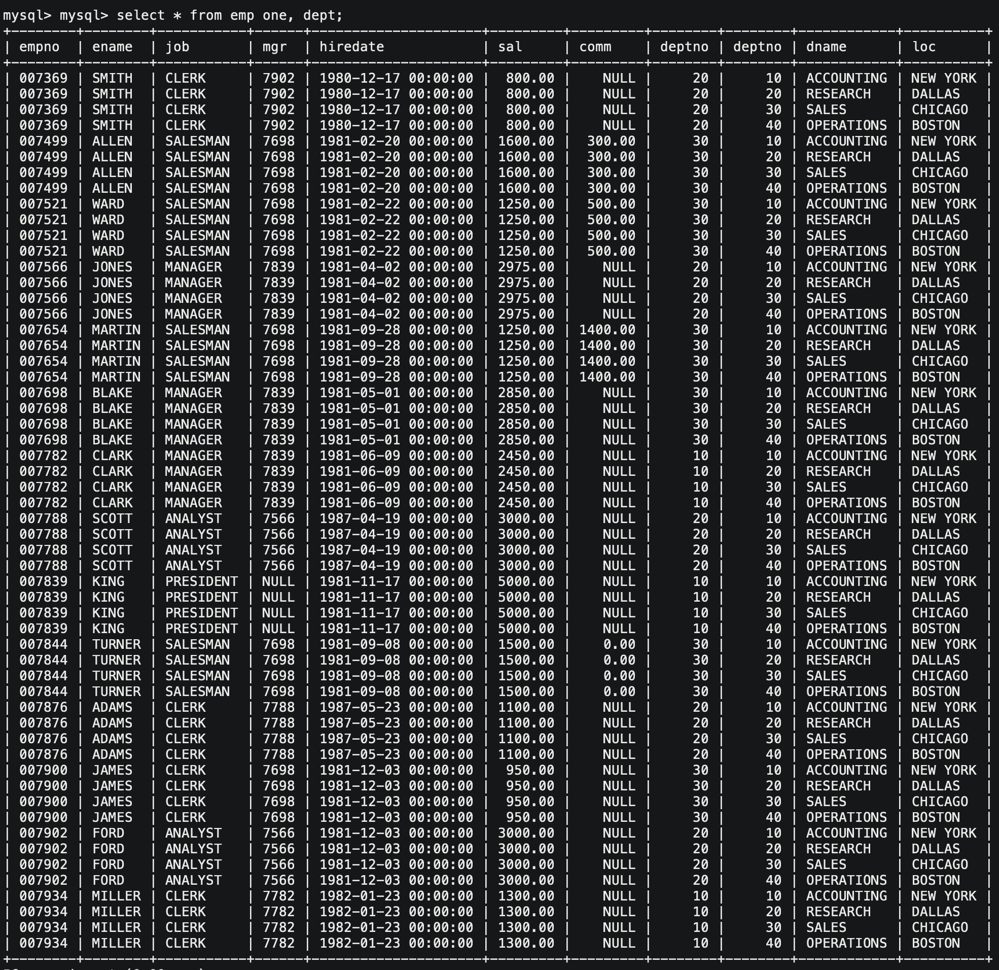
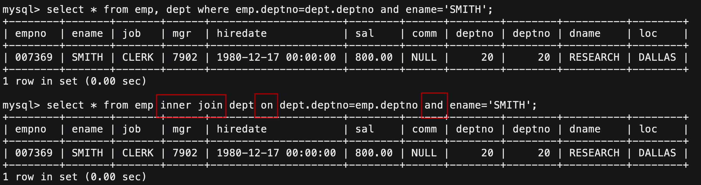
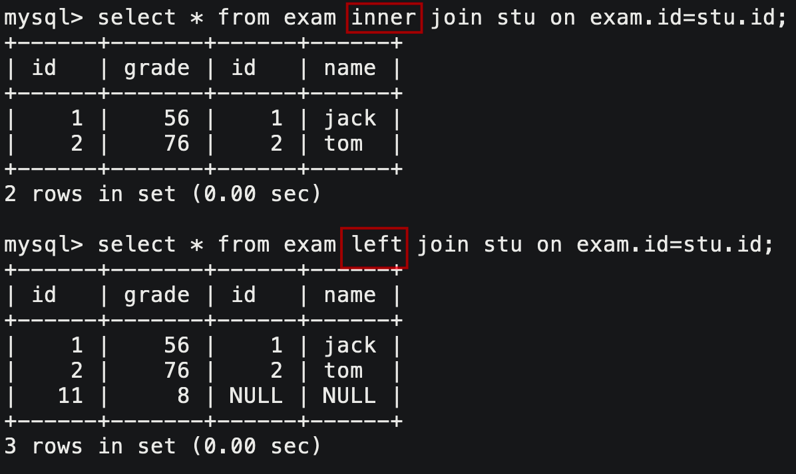
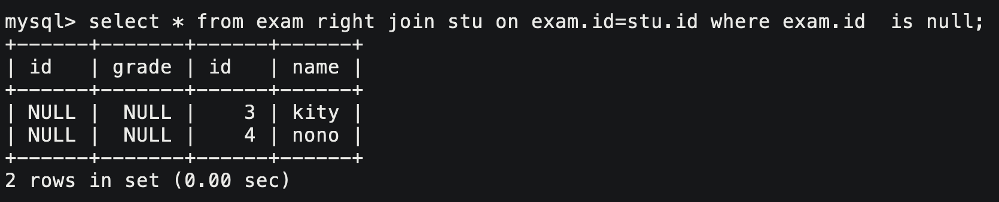

# 1. 复合查询

> 我们前面在表的基本操作中讨论的表的查询都是基础的查询操作，在实际开发中这远远不够。

## 1.1 多表查询

```mysql
select * from `tb_1`, `tb_2`;
```

以两表为例，上述查询的结果是：

1. 从第一张表中选取第一条记录，和第二张表中的所有记录分别组合。
2. 从第一张表中选取第一条记录，和第二张表中的所有记录分别组合。以此类推 ……

不加过滤条件，得到的结果被称为笛卡尔集。

> 多表查询实际上也就是将多个表组合成一张表，所以我们也就要把多个表看成一个表。



我们认为，所有 select 查询出来的“记录”，都可以把它看作表。

```mysql
where dept.deptno = emp.deptno
```

多表查询中一定会包含这样的where子句条件，**将主表的主键和从表的外键对应起来，可以将排列组合产生的无意义的记录抛弃**。

### 多表查询步骤

1. 先把多表查询转化为单表查询；
2. 筛去排列组合产生的无意义数据；
3. 然后再根据要求进一步筛选；
4. 选定好需要展示的字段。

## 1.2 自连接

同一张表自己和自己拼接的叫做自连接。

```mysql
select * from emp wkr, emp ldr;
```

给两张相同的表起别名，就可以放到一起。

```mysql
where wkr.mgr = ldr.empno;
```

自连接的话，排列组合产生的无意义数据就不是主键外键不一致产生的了，而是要**根据实际需求筛去不满足条件的数据**。

把员工和领导联系在一起，就要依靠员工的领导编号和员工编号两个字段必须相等，就可以把员工和其领导放在一条记录中。

## 1.3 子查询

子查询也称嵌套查询，是指**将select语句嵌套在另一个select语句中，也就是将select的结果作为另一个select的条件**。

### 单行子查询

返回一行记录的查询称为单行子查询。

```mysql
select * from emp where deptno=(select deptno from emp where ename='SMITH');
```

### 多行子查询

返回多行记录的查询称为多行子查询。关键字有：**in**，**all**，**any**。

- in 表示是否存在于返回的多个结果的集合中，存在即满足条件。

```mysql
# 显示和10号部门具有的工作岗位相同的员工
select * from emp where job in (select distinct job from emp where deptno=10);
```

- all 表示返回的多个结果的集合的全体

```mysql
# 显示工资比10号部门所有人工资都高的员工
select * from emp where sal > all (select distinct sal from emp where deptno=10);
```

- any 表示返回的多个结果的集合的任意一个结果

```mysql
# 显示工资比30号部门任意员工工资高的员工 
select * from emp where sal > any (select distinct sal from emp where deptno=10);
```

> 不管是单行还是多行子查询，都叫做单列子查询，返回的都是单列的一个字段的数据。

### 多列子查询

```mysql
# 查询和SMITH的部门和岗位完全相同的所有雇员
select * from emp where (deptno, job) =  (select deptno, job from emp where ename='SMITH');
```

可以认为，`()`就是表示MySQL内部实现的集合。

### 在from子句中使用子查询

from跟是的表名，既然我们查询出来的记录都可以看作表结构。这里就是一个数据查询的技巧，把子查询当作临时表使用。

```mysql
# 显示每个高于自己部门平均工资的员工的姓名、部门、工资、平均工资
select ename, emp.deptno, sal, myavg
	# 作笛卡尔集 
	from emp, (select deptno, avg(sal) myavg from emp group by deptno) avg_tb 
	# 过滤无效数据
	where emp.deptno=avg_tb.deptno;
	
# 显示每个部门的部门名，编号，地点和人员数量
select dname, dept.deptno, loc, cnt
	# 作笛卡尔集 
	from emp, dept, (select deptno, count(*) cnt from emp group by deptno) cnt_tb
    # 过滤无效数据
	where cnt_tb.deptno=emp.deptno and cnt_tb.deptno=dept.deptno;
```

**将查询出来的记录看作临时表和原有表作笛卡尔集，再筛选出有效数据，这就是我们需要创造出的表**。在这个表中就能查询我们想要的数据。

### 合并查询

合并查询是就是合并多个 select 的查询结果，可使用集合操作符 **union**，**union all**。、

| 关键字    | 解释                                                 |
| --------- | ---------------------------------------------------- |
| union     | 取并集，将多个 select 结果合并到一起，自动去掉重复行 |
| union all | 取并集，将多个 select 结果合并到一起，但不去重       |

```mysql
# 取并集
select * from emp where sal > 2500 
union # + 
select * from emp where job='MANAGER';
```

## 1.4 OJ连接

- https://www.nowcoder.com/practice/23142e7a23e4480781a3b978b5e0f33a
- https://www.nowcoder.com/practice/355036f7f0c8429a85281f7ac05b457a
- https://www.nowcoder.com/practice/32c53d06443346f4a2f2ca733c19660c
- https://www.nowcoder.com/practice/e50d92b8673a440ebdf3a517b5b37d62

&nbsp;

# 2. 表的内连和外连

表的连接分两种，内连接和外连接。内连接实际上利用 where 子句对多表聚合形成的笛卡尔集进行筛选，我们前面使用的都是内连接。

## 2.1 内连接

```mysql
select `field` from `tb_1` inner join `tb_2` on 连接条件 and 其他条件;	
```



> 这样的写法更加专业。

## 2.2 外连接

外连接又分左外连接和右外连接两种。

在使用内连接过滤笛卡尔集中非法数据的时候，我们是直接抛弃的。如果是左外连接，就不能直接抛弃，需要将右半部分置空并保留下来，反之右外连接。

### 左外连接

左外连接和内连接几乎没有区别。唯一的区别就是，拿着左表的数据到右表进行拼接，如果匹配不上不会过滤右表数据而是置空显示。



### 右外连接

右外连接，就是以右表为主。其他不变。



**外连接就是为了显示出匹配不上的数据，从而确定哪些数据不满足条件。**

## 2.3 OJ练习

- https://leetcode.com/problems/rank-scores/
- https://leetcode.com/problems/exchange-seats/description/
