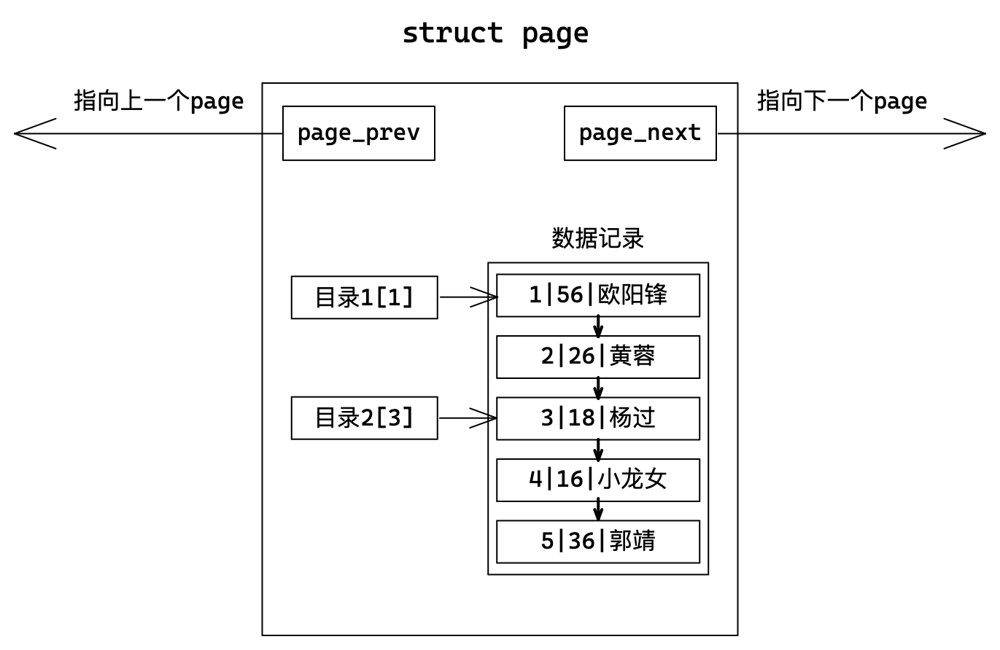
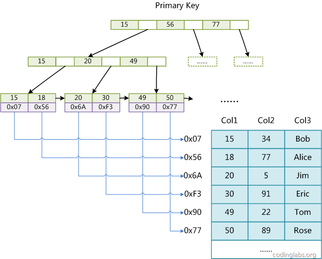

# 索引

## 0. 预备知识

索引是一个“物美价廉”的特性，用来提高数据库的性能。不需要改程序、调SQL、只需要正确的创建索引，查询速度就能提高成百上千倍，但查询速度的提升也带来了插入、更新、删除速度的下降。


### 0.1 认识磁盘

MySQL对数据进行增删查改操作时，不可能直接访问磁盘硬件的，实际上对数据库的所有操作，都是在内存中进行的，由操作系统定期将数据刷新到磁盘上。

MySQL 给用户提供存储服务，而存储的数据在磁盘这个外设当中。磁盘是计算机中的一个机械设备，相比于计算机其他电子元件磁盘效率是比较低的。在加上IO本身的特征，可以认为，如何提交效率是 MySQL 的一个重要话题。


数据库文件，本质其实就是保存在磁盘的盘片，也就是上面的一个个扇区当中。当然，数据库文件很大也很多，一定需要占据多个扇区的。

所以最基本的找到一个文件的全部，本质就是在磁盘找到所有保存文件的扇区。而我们能够定位任何一个扇区，那么便能找到所有扇区，因为查找方式是一样的。

> 那么如何定位扇区呢？

磁盘的每盘都是双面的，大小完全相等。那么同半径的磁道整体上便构成了一个柱面，每个盘面都有一个磁头，所以我们只需要知道磁头、磁道、扇区对应的编号，即可在磁盘上定位所要访问的扇区。

这种磁盘数据定位方式叫做 CHS。不过实际系统软件使用的并不是 CHS 而是 LBA，一种线性地址，可以想象成虚拟地址与物理地址。系统将 LBA 地址最后会转化成为 CHS，交给磁盘去进行数据读取。

> 操作系统和硬盘如何交互？

如果操作系统直接使用硬件提供的数据大小进行交互，那么系统的IO代码就和硬件强相关。换言之，如果硬件发生变化系统必须跟着变化，从目前来看单次lO512字节太小了，会带来效率的降低。系统读取磁盘是以块为单位的，基本单位是 4KB 。

> 磁盘随机访问与连续访问？

随机访问：本次和上次lO给出扇区地址不连续，这样磁头在两次IO操作之间需要比较大的寻道动作才能重新进行IO。
连续访问：本次和上次 lO 结束的扇区地址是连续的，那磁头就能很快的开始这次IO操作，这称为连续访问。

随机访问和连续访问的效率差别非常大，可以说是10倍到20倍的差距。

### 0.2 MySQL数据交互

而MySQL作为一款数据库软件，它有着更高的IO场景，需要提高基本的IO效率。MySQL使用16KB进行IO交互，即MySQL和磁盘进行数据交互的基本单位是16KB。这个**基本数据单元在 MySQL 里叫做 page**。

> 其实是MySQL和内核使用16KB交互，内核和磁盘使用4KB交互，但我们不关心系统，假定MySQL直接和磁盘交互。

**MySQL中的数据文件，是以page为单位保存在内存当中的**。MySQL的数据交互，都需要通过计算找到对应的位置。后续涉及到磁盘和内存的IO的基本单位就是Page。

> 为了更高的效率，一定要尽可能的减少系统和磁盘IO的次数。

&nbsp;

## 1. 索引原理


> 为何MySQL和磁盘进行IO交互的时候，要采用Page的方案进行交互呢？

按Page大小进行交互，整个Page会被加载到MySQL的内存池中，这里完成了一次IO。往后如果在查找，完全不需要进行磁盘IO，而是直接在内存中进行了。所以就在单Page里面，大大减少了IO的次数。

有很大概率用户一定下次找的数据就在这个Page，因为有局部性原理。往往IO效率低下的最主要矛盾不是IO单次数据量的大小，而是IO的次数。

从现在开始，我们探讨的数据全部以Page的形式保存在MySQL内部缓冲区中了，和磁盘没有任何关系。

### 1.1 理解Page

MySQL中任意时刻都可能存在大量的Page页存在于MySQL内部，MySQL本身一定要对Page进行管理。

```c
//伪代码
struct Page {
    struct Page* next;
    struct Page* prev;
    char buffer[16kb];
};
```


MySQL中的数据往往都是封装成Page结构体的形式，保存在内存中，单个大小16KB。

- 多个Page结构体之间使用前后指针构成双向链表。
- 单个Page结构体内部多条记录也是使用链表形式存储。

**因为有主键的原因，MySQL会自动将我们插入的数据，按主键的递增顺序进行排序。**那么为什么要进行排序呢？

插入数据时排序的目的，就是优化查询的效率。首先数据得有序才能方便查找。  

### 1.2 主键索引

#### 单页情况

> 如何提高在单个Page中的查找效率呢？

线性有序的数据可以类比一本书，书的页码从前到后一次排布。而书有目录，目录表明了所在章节的页码范围，在查找指定知识点的时候，可以先从目录找到所在章节，到指定章节再线性查找到指定位置。

针对单页Page我们也可以添加“目录”，如果我们想查找指定位置数据，先找目录到大体位置在线性查找即可。这是一种以空间换时间的做法。



从目录开始查找就能一次性排除更多数据，当然这一切也是建立在数据有序的基础上。

#### 多页情况

> Page之间也是以链表的形式组织的，只能线性查找的话效率太低。如何提高在多个Page中的查找效率呢？


因为我们需要保证数据有序，再次新插入的数据不一定会被放在最后一个Page的末尾，也有可能放在中间某个Page的中间位置。

这样的单纯用链表链起来的结构也有效率问题：

1. 如果我们需要靠后的Page，但为了线性遍历，必须要把之前的所有Page导入内存，这样会造成大量IO。
2. 就算需要的Page已经在内存中，线性遍历多个Page的方式也是问题。

解决思路就是给多个Page也搭配上“目录”：**把多个Page看作多个记录，把Page中的最小记录的键值作为Page的键值，为其标上目录**。

- 创建一个Page其中记录用来存储目录项，目录项由键值和指针构成，指向其下Page最小键值的记录。
- 页内目录管理的是记录，这种目录管理的是页。


**目录页本质也是页，普通页存储的是用户数据，目录页存储的是普通页的地址。**这样一次查找就能排除多页，效率更高。

不过我们还需要一个管理页（可能是多个）存储其下所有目录页的最小键值，用来来管理其下所有目录页。这样每次查找从顶层管理页开始，逐步向下查找，这也就是B+树模型。


所谓索引，就是在MySQL内部，将热点数据存储在Page页，再以B+树的形式将所有Page页进行组织，形成数据结构与其配套的查找算法。

- Page分为目录页和数据页。目录页只放各个下级Page的最小键值。
- 自顶向下找，只需要加载部分目录页到内存，即可完成算法的整个查找过程，大大减少了IO次数。

如此就解决了我们最初链表方案的两个缺陷：线性遍历和大量IO。缺点是略降增删的效率，因为插入或删除会破坏底层数据页的结构，会向上影响到目录页。

> 为什么选择B+树，而不是其他数据结构？

| 数据结构    | 劣势                                                         |
| ----------- | ------------------------------------------------------------ |
| 链表        | 只能线性遍历，效率太低                                       |
| 二叉搜索树  | 退化问题，可能退化成为线性结构                               |
| AVL和红黑树 | 二叉结构，导致树整体过高过瘦。过高需要加载Page就多IO效率低，过瘦排除的数据少 |
| Hash        | 散列随机的算法特征决定了范围查找时效率不行，只能一个一个找   |
| B树         | 底层无法线性遍历，范围查找效率不高。树体存储数据导致树过高   |

### 1.3 聚簇索引和非聚簇索引

| 概念       | 存储引擎 | 解释                                         |
| ---------- | -------- | -------------------------------------------- |
| 聚簇索引   | InnoDB   | 把索引和数放在一块                           |
| 非聚簇索引 | MyISAM   | 把索引和数据分离，叶节点不存储数据，只存指针 |



MySQL除了默认会建立主键索引外，用户也有可能以其他字段建立索引，一般这种索引叫做辅助索引或者普通索引。

- 对于MyISAM，建立普通索引和主键索引没有差别，无非就是主键不能重复，而非主键可重复。
- 对于InnoDB，建立普通索引，叶结点也不保存数据，而保存所在记录的主键，需要回表查询。


> InnoDB普通索引不存数据而存主键，原因很简单浪费空间。而MyISAM因为其不管主键索引还是普通索引只存地址。

&nbsp;

## 2. 索引操作

### 2.1 创建主键索引

创建表的时候设置主键或者后期追加设置主键，都会自动创建主键索引模型。

```mysql
# 方式一
create table `tb_name` (`field` datatype primary key [, ...]);
# 方式二
create table `tb_name` (`field` datatype, primary key (id));
# 方式三
alter table `tb_name` add primary key (id);
```

### 2.2 创建唯一索引

```mysql
# 方式一
create table `tb_name` (`field` datatype unique key [, ...]);
# 方式二
create table `tb_name` (`field` datatype, unique(`field`));
# 方式三
alter table `tb_name` add unique key (id);
```

> 如果建表时指定唯一键，则MySQL自动为其建立唯一键索引。

### 2.3 创建普通索引

```mysql
# 创建表时指定索引
create table `tb_name` (`field` datatype [, ...], index(`field`));
# 追加索引
alter table `tb_name` add index(`field`);
# 追加索引
create index `idx_name` on `tb_name`(`field`);
```

### 2.4 查询索引

```mysql
# 1
show index from `tb_name`;
# 2
show index from `tb_name` \G
```


### 2.5 删除索引

```mysql
# 删除主键索引
alter table `tb_name` drop primary key;
# 删除唯一索引
alter table user3 drop index `index_name`;
# 删除普通索引
alter table user3 drop index `index_name`;
```

### 2.6 创建全文索引

我们目前所有的索引建立都是基于一列一个字段的，而且这字段的内容都不大。假如要对大量文字作索引，会使用到全文索引。目前只有MyISAM支持全文索引，不支持中文。

> 待补充。

### 2.7 索引创建原则

- 比较频繁作为查询条件的字段应该创建索引；
- 唯一性太差的字段不适合单独创建索引，即使频繁作为查询条件；
- 更新非常频繁的字段不适合作创建索引；
- 不会出现在where子句中的字段不该创建索引。