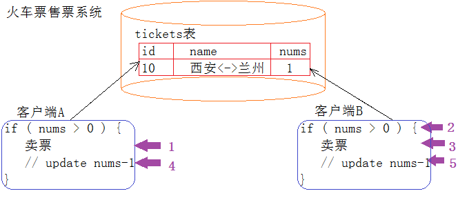
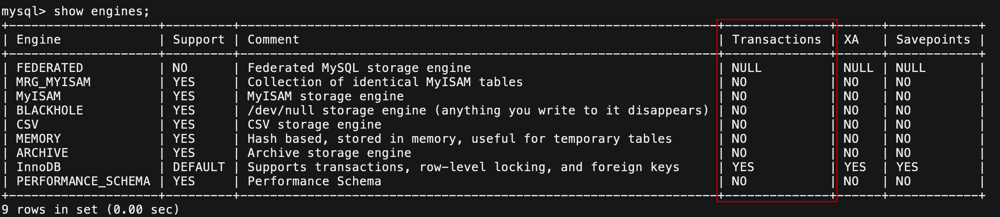
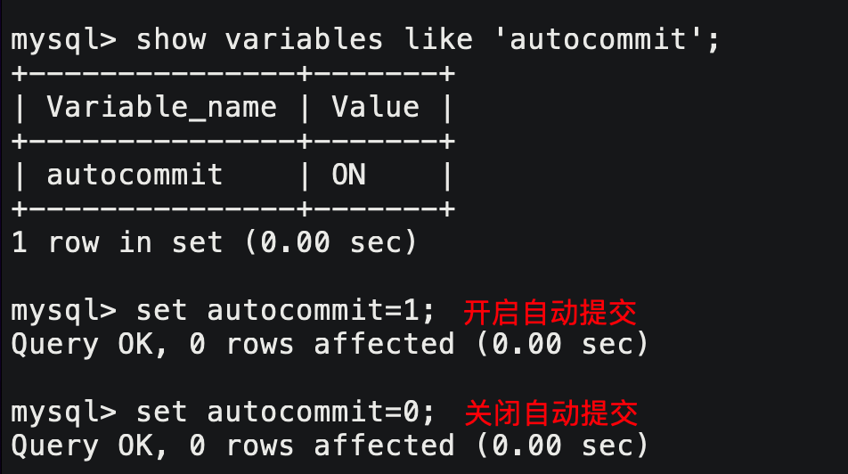
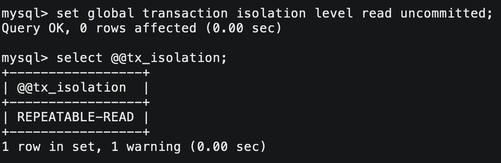
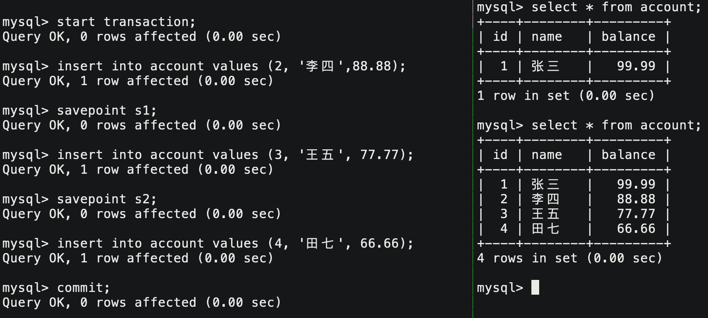
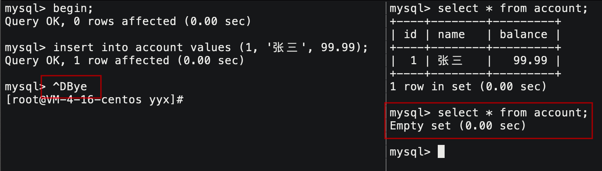
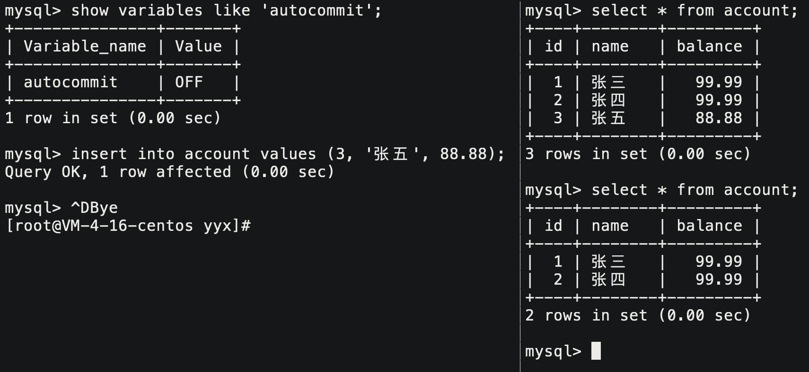
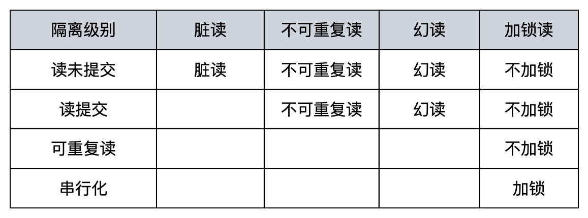
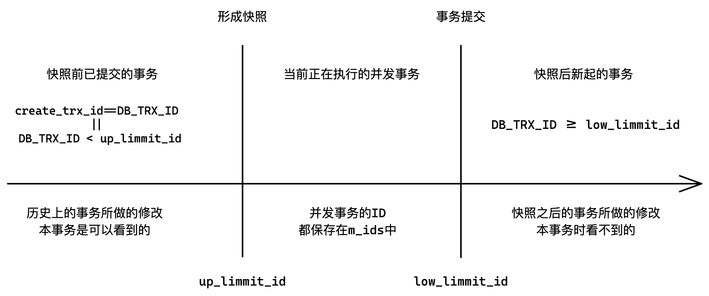

# 事务管理

> CURD不加控制，会有什么问题？

类似于我们刚学多线程写的抢票逻辑代码，数据库中的数据也是临界资源，也需要考虑并发性带来的问题。



> CURD满足什么属性，能解决上述问题？

- 买票过程必须满足原子性
- 买票不能相互影响
- 买完票应该永久有效
- 买前买后都要是确定的状态

## 1. 事务的定义

事务的本质就是一组DML数据库管理语言，这些语句在逻辑上存在相关性，这一组语句要么失败要么成功，属于一个整体。MySQL提供一种机制就是MySQL事务，保证我们达到这样的原子性的效果。

事务对于应用层用户来说就是一件事情，对于MySQL底层对应着多条SQL语句，这多条SQL语句是具有逻辑性的。

事务就是所要做的工作、事情，主要用于处理操作量大、复杂度高的数据，比如一些需要多条SQL语句组合起来才能完成的一项任务。我们把**这样的多条SQL语句的集合，这样的一项工作就被称为事务**。

> MySQL数据同一时间可能甚至有大量事务处理请求发起，如果大家都访问的是同一份数据，不加保护绝对出问题，可能出现执行到一半出错或无法执行到情况。

所以，一个完整的事务，绝对不是简单的SQL语句的集合，还需要满足如下四个特性：

| 特性   | 解释            |
| ------ | --------------- |
| 原子性 | **A**tomicity   |
| 一致性 | **C**onsistency |
| 隔离性 | **I**solation   |
| 持久性 | **D**urability  |

### 1.2 事务出现的原因

事务被MySQL设计者设计出来，本事就是为了上层程序访问数据库的时候，用事务简化我们的编程模型，各种各样的潜在错误和并发问题都交给MySQL处理。所以事务机制本质是为了应用层服务的，并不是伴随数据库系统而诞生的。

### 1.3 事务的版本支持

MySQL中只有InnoDB引擎支持事务机制。



### 1.4 事务的提交方式

事务的提交方式常见的有两种：自动提交、手动提交。查看和修改事务提交方式：



### 1.5 事务的隔离级别



隔离级别有三个变量，分别是：全局隔离级别、会话隔离级别、默认隔离级别。全局对所有人有效、会话对本次会话登陆有效、默认和会话等级一致。

```mysql
# 查看隔离级别
mysql> select @@global.tx_isolation;
+-----------------------+
| @@global.tx_isolation |
+-----------------------+
| READ-UNCOMMITTED      |
+-----------------------+
1 row in set, 1 warning (0.00 sec)

mysql> select @@session.tx_isolation;
+------------------------+
| @@session.tx_isolation |
+------------------------+
| READ-UNCOMMITTED       |
+------------------------+
1 row in set, 1 warning (0.00 sec)

mysql> select @@tx_isolation;
+------------------+
| @@tx_isolation   |
+------------------+
| READ-UNCOMMITTED |
+------------------+
1 row in set, 1 warning (0.00 sec)

# 设置隔离级别
set session transaction isolation level serializable;
Query OK, 0 rows affected (0.00 sec)

set global transaction isolation level Repeatable Read;
Query OK, 0 rows affected (0.00 sec)
```

&nbsp;

## 2. 事务的基本操作

```mysql
# 启动事务
start transaction; #1.
begin; #2.
# 设置回滚点 
savepoint `point_name`;
# 回滚到回滚点
rollback to `point_name`;
# 全部回滚
rollback
# 提交
commit;
```



&nbsp;

## 3. 理解原子性

当进行事务的一方突然断开，未能提交事务，那么MySQL回自动进行回滚，事务的操作会自动取消。



但一旦提交后，数据就持久化变为永久状态。

本质上单条SQL，也被MySQL包装成一个事务，所以如果突然退出，MySQL也会自动回滚。但前提是将MySQL的自动提交关闭。



**MySQL会自动回滚未完成的事务，以此来维护MySQL事务的原子性**。

&nbsp;

## 4. 理解隔离性

MySQL服务可能被多个客户端进程同时访问，以事务的形式访问MySQL。

一个事务可能由多条SQL构成，就意味着任何一个事务都有执行前中后三个阶段。所谓原子性就是MySQL会帮助我们自动回滚。

多个事务同时执行的时候，一定会出现相互影响的情况。所以要保证事务的执行过程尽量不受干扰，也就是保证隔离性。

数据库允许事务收到不同程度的干扰，就出现了描述隔离程度的重要概念：隔离级别。

| 名称                         | 解释                                                         |
| ---------------------------- | ------------------------------------------------------------ |
| 读未提交（Read Uncommitted） | 所有事务都可以读到其他事务未提交的结果，相当于没有隔离       |
| 读提交（Read Committed）     | 一个事务只能读到其他事务提交后的结果，可能会造成不可重复读   |
| 可重复读（Repeatable Read）  | 确保一个事务多次读取只会看到同样的数据，可能会造成幻读       |
| 串行化（Serializable）       | 通过强制事务排序，使之不可能发生冲突，但可能会导致超时和锁竞争 |

> 大多数数据库的隔离级别都是读提交，MySQL默认的隔离级别是可重复读。从上到下，隔离逐渐增强。实际生产不会使用读未提交和串行化，都太极端。

### 4.1 读未提交

读未提交，相当于没有锁，会产生很多问题。比如脏读，**读到另一个执行中事务的未提交数据就叫脏读**。实际生产环境是不会使用的。

### 4.2 读提交

读提交， 会导致其他客户进程一个事务内同样的两次读取，读到的数据不一样。

这个现象就是不可重复读**，不可重复读是有问题的。问题在于不应该让与当前事务并行的事务也读到，造成一个事务读取前后不一致**会影响自身上层业务逻辑。

### 4.3 可重复读

可重复读，MySQL的默认隔离级别。就算修改一方事务已经提交，其他同时存在的事务也无法看到修改的数据。也就是屏蔽与自身并发的事务所做出的修改。

一般数据库只能屏蔽修改和删除操作，无法屏蔽插入操作的。因为隔离性是通过给记录加锁实现的，但新增数据是不存在的，也就无法预先加锁。**多次读取读到新增数据，这种现象叫做幻读**。

> MySQL通过Next-Key间隙锁的机制解决的，具体不做讨论。

### 4.4 串行化

对所有操作加锁进行串行化，不会存在任何问题，但是效率很低，几乎完全不被使用。

当然读取操作是不会被阻塞的，因为它不会修改数据。

如果并发事务一方进行读取写入等操作，该事务就会被阻塞住，会被定时解锁。

### 总结

- 当然，**所有的隔离机制都是针对并发执行的多个事务**，而不是所在的客户进程。
- 隔离级别越严格，安全性越高，但数据库的并发性能也就越低。往往需要我们寻求一个平衡点。



所谓隔离性，就是一种MySQL内部的机制。让并发执行的多个事务，看到和修改不同的数据，就叫做隔离性。而哪些数据可以看到可以修改，其程度的不同，就由隔离级别决定。

事务具有隔离性是为了安全，种类繁多的隔离机制是为了兼顾效率。

&nbsp;

## 5. 理解一致性

事务执行前后，数据库都是从一个一致性状态变到另一个一致性状态。

当事务成功提交，数据库处于一致性状态。当事务未提交且已经对数据库做出修改，此时数据库就处于不正确不一致状态。

一致性表达的意思是，数据库中的数据保持一致状态，数据可有变化，但数据是有意义的。

一致性并不是MySQL中真实存在的一种具体状态，是由原子性、持久性、隔离性共同保证数据库处于一致性的状态。

一致性和用户业务逻辑相关，MySQL提供技术支持，但一致性由上层业务和底层MySQL共同决定。

&nbsp;

## 6. 进一步理解隔离性

数据库并发场景有三种：

1. 一方读一方也在读： 不对数据作修改，就不存在任何问题，也就不需要并发控制。
2. 一方写一方也在写：有线程安全问题，可能造成数据丢失问题，只能加锁控制串行化。
3. 一方读一方写：有线程安全问题，可能会造成事务隔离性问题，如脏读、幻读、不可重复读。

> 我们只研究读写并发，也是最难的一种场景。

### 读写并发

多版本并发控制（MVCC）是一种用来解决读写冲突的无锁并发控制。

MySQL会为事务分配单向增长的事务ID，为每个修改保存一个版本，版本与事务ID关联。读操作只读该事务开始前的数据库的快照。

所以MVCC可以解决以下问题：

1. 在并发读写时，可以做到在读操作时不用阻塞写操作，写操作也不用阻塞读操作，提高了数据库并发读写的性能
2. 同时还可以解决脏读，幻读，不可重复读等事务隔离问题，但不能解决更新丢失问题

理解 MVCC 需要知道三个前提知识：

- 3个记录隐藏字段
- undo 日志
- Read View

#### 3个隐藏字段

| 字段        | 解释                                                         |
| ----------- | ------------------------------------------------------------ |
| DB_TRX_ID   | 6字节，保存最近修改本条记录的事务的事务ID                    |
| DB_ROLL_PTR | 7字节回滚指针，指向本条记录的历史版本                        |
| DB_ROW_ID   | 6字节隐藏主键，如果是数据库没有主键，InnoDB会自动以DB_ROW_ID产生一个聚簇索引 |

> 还有一个隐藏字段flag，表示记录是否有效，为1表示记录有效为0无效。

#### undo log

MySQL是以服务进程的形式运行在内存中的。undo log 不是文件形式的日志，就是MySQL的一段内存缓冲区，用来保存日志数据的。针对每一条被修改的记录，都会改前先备份一遍放在 undo log 中，依靠字段回滚指针一条一条链接起来。

> 1. 当前事务想要修改记录时，会先给该记录加锁；
> 2. 并将改前记录拷贝一份放到 undo log 中保存起来；
> 3. 改完后解锁，并将记录中的回滚指针字段指向 undo log 中的上一条记录。
>
> 改完之后的记录就成了最新纪录，而 undo log 中的就是历史记录。


这样，我们就有了一个基于链表记录的历史版本链。所谓回滚，就是用历史数据覆盖当前数据。一个个版本，称之为一个个的快照。

> 上面描述的是更新操作，删除操作只是将隐藏字段flag置为删除，如此也可以形成历史版本。如果是插入操作，新增记录没有历史记录，可以在undo log中放一条空记录即可维护历史版本。

删改的永远都是最新纪录，而查询的可能是历史记录。

对于插入操作，自身提交后，就可以清空undo log中的插入历史纪录了，因为新增数据其他并发事务是看不见的，不需要维护隔离性。

但对于更新和删除操作，如果提交后清空undo log，其他并发事务还可能正在读取历史，只能等并发事务全部提交后才能清空。

### 隔离性的实现

在可重复读隔离级别下，一个事务看不到其他并发事务已经提交的更改，是因为并发事务删改的是最新纪录，而当前事务只能查询到历史版本，这就是隔离性的实现。那具体看到是哪一个历史版本，就是隔离级别不同的原因。

| 读取方式 | 解释                                                     |
| -------- | -------------------------------------------------------- |
| 当前读   | 增删改必须是访问最新记录，读取最新记录都可以称为当前读。 |
| 快照读   | 读取undo log中的历史版本，就称为快照读                   |

- 隔离级别中的串行化，也就是并发事务增删改查操作都要加锁，都是当前读，不需要历史版本。
- 而对于隔离级别中的可重复读，并发事务进行查询操作时都是读取历史版本的，就不需要加锁限制了，可以并行执行，提高了效率这就是MVCC的意义所在。

**事务是具有原子性的，事务能够看到的内容、哪些事务所做的修改、整个数据库数据的情况，可以认为在事务分配事务ID时就确定了。**

在此之后数据库发送的变化，该事务是看不见的，这就是隔离性的实现目标。各个事务能看到什么不能看到什么，这就是隔离性和隔离级别所要解决的问题。

> 那这样的隔离性策略如何实现的呢？

#### Read View

事务具体可以理解为MySQL的对象，Read View就是对象的成员。Read View 是事务进行快照读操作时产生的一种数据结构。

它是MySQL用来管理事务数据读取的可见性的机制，可以认为它就是“快照”，它描述了事务所能看到的数据库情况。具体是，Read View 将系统当前活跃的事务ID记录下来，加上其中的机制，就能够判断当前事务能够看到哪个版本的数据。

> 我们在源码层面简化探究一下Read View的实现机制。

```cpp
class ReadView {
    //...
private:
	trx_id_t m_low_limit_id;   // 高水位ID，大于等于该ID的事务均不可见
    
    trx_id_t m_up_limit_id;    // 低水位ID，小于该ID的事务均可见

    trx_id_t m_create_trx_id;  // 创建该Read View的事务ID

    ids_t m_ids;               // 创建该Read View时活跃事务ID的列表
    //...
};
```

- 低水位`m_up_limmit_id`保存的是`m_ids`中记录的最小的事务ID；
- 高水位`m_low_limmit_id`保存的是`m_ids`中记录的最大事务ID+1；
- `m_create_trx_id`意思是创建该Read View的事务ID，也就是本事务的事务ID。

> 如何判断undo log中的历史版本记录是否能够被本事务读取看到呢？

1. 如果历史版本的记录中的隐藏字段`DB_TRX_ID`大于等于高水位`m_low_limmit_id`，说明该记录对本事务不可见。
2. 如果`DB_TRX_ID`小于低水位`m_up_limmit_id`或等于当前事务ID`m_create_trx_id`，说明该记录对本事务可见。
3. 如果`DB_TRX_ID`在高低水位之间且在`m_ids`中，说明该事务在创建快照时未提交，如果不在`m_ids`中，说明该事务在创建快照时已经提交。如果已提交当前事务就能看到其所做的修改，反之则不能。



**准确的来说，事务能够看到的历史记录，在快照创建的一瞬间就确定好了**。快照创建的时间就是事务首次进行select查询操作的时间，快照一旦建立好就不在变化，此时该事务所能看到的数据也就不会发生变化了。

```cpp
bool changes_visible(trx_id_t id, const table_name_t& name) const 
{
    if (id < m_up_limmit_id || id == m_creator_trx_id) {
        return true;
    }
    
    if (id >= m_low_limmit_id) {
        return false;
    } else if (m_ids.empty()) {
        return true;
    }
    
    return !std::binary_search(m_ids.data(), m_ids.data() + m_ids.size(), id);
}
```

### RR和RC的本质区别

事务中快照读的结果是由该事务首次出现快照读的时机所决定，即某个事务中首次出现快照读，决定该事务后续快照读结果的能力。

> Read View 不变，快照读所能读到的东西也就不变。

- RR级别下，快照读生成Read View时，Read View会记录此时所有其他活动事务的快照，此**后Read view不在发生变化，故以后再进行快照读都读的内容是固定的**。
- RC级别下，**事务每次快照读都会新生成一个快照和Read View**。这就是在RC级别下的事务可以看到别的事务提交的更新的原因。

总之在RC隔离级别下每个快照读都会生成最新的Read View；在RR隔离级别下是同一个事务中的第一个快照读才会创建Read View，之后的快照读获取的都是同一个Read View。

> 正是RC每次快照读都会形成Read View，才会有不可重复读问题。

