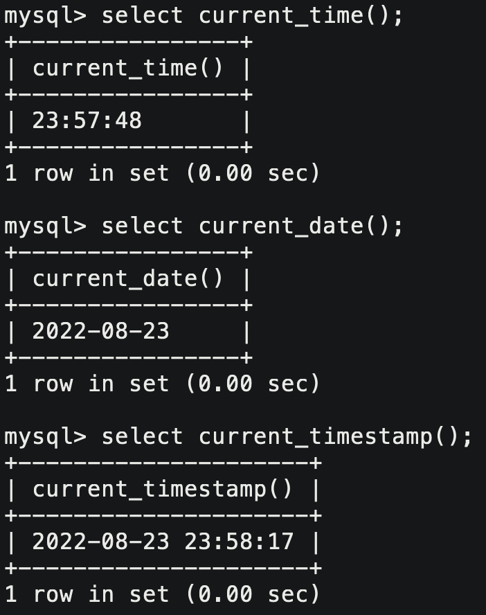

# 1. 表的增删查改

> CRUD : Create(创建), Retrieve(读取)，Update(更新)，Delete(删除)

## 1.1 Create

```mysql
insert [into] `tb_name`
	[(column [, column] ...)]
	values (value_list) [, (value_list)] ...
	
value_list: value [, value ] ...
```

### 单行全列插入

```mysql
insert into `tb_name` (`field1`, `field2`, `field3`) values (`data1`, `data2`, `data3`);
```


### 单行指定列插入

```mysql
insert into `tb_name` (`field1`, `field2`) values (`data1`, `data2`);
```


### 多行指定列插入

```mysql
insert into `tb_name` (`field1`, `field2`) 
values (`data1`, `data2`),
# ... , 
values (`data1`, `data2`);
```


### 插入否则更新

主键或者唯一键具有唯一性，可能会导致我们后续插入数据失败的问题。“插入否则更新”意思是如果插入成功就插入，如果失败就是更新。

```mysql
insert into `tb_name` (`field1`, `field2`, ...) values (`data1`, `data2`, ...)
on duplicate key update `field1`=`data1`, `field2`=`data2`, ...; 
```


### 替换

```mysql
replace into `tb_name` (`field1`, `field2`, ...) value (`data1`, `data2`, ...);
```

替换就是不冲突就插入，冲突就替换，可能替换多行。


## 1.2 Retrieve

> 查找就是我们使用数据库最常见的操作。多表查询是查询中最复杂的操作，会在之后学习。

```mysql
select 
	[distinct] { * | {colum [, colum ...] }
	[from `tb_name`]
	[where ...]
	[order by colum [asc | desc], ...]
	limit ...
```

### 全列查询

```mysql
select * from `tb_name`;
```


### 指定列查询

```mysql
select `field1`, `field2` [, ...] from `tb_name`;
```


### 添加表达式查询

```mysql
select `field1`, `field2`, `expression` [ as `field` ] from `tb_name`;
```


### 为结果字段起别名

```mysql
select `field` [as] `alias_name` [ ... ] from `tb_name`;
```


### 结果去重

```mysql
select distinct `field1`, `field2` [, ... ] from `tb_name`;
```


> 是否重复只能对显示出来的整条记录而言，对于右边的图，因为有id不重复，所以不算重复。

### 排序查询结果

```mysql
# 升序
select `field1`, `field2` [, ...] from `tb_name` order by `field` [asc];
# 降序
select `field1`, `field2` [, ...] from `tb_name` order by `field` desc;
```


### where子句

| 比较运算符        | 解释                                                 |
| ----------------- | ---------------------------------------------------- |
| > , >= , < , <=   | 大于，大于等于，小于，小于等于                       |
| =                 | 等于，NULL不安全，例如 NULL = NULL 的结果是 false(0) |
| <=>               | 等于，NULL安全，例如 NULL <=> NULL 的结果是 true(1)  |
| != , <>           | 不等于                                               |
| between a0 and a1 | 范围匹配，满足 [a0, a1] 区间，返回 TRUE(1)           |
| in ( option … )   | 如果是 option 中的任意一个，返回 TRUE(1)             |
| is null           | 是NULL                                               |
| is not null       | 不是NULL                                             |
| like              | 模糊匹配。% 表示任意(>=0)个字符， _ 表示任意一个字符 |
| **逻辑运算符**    | **解释**                                             |
| AND               | 与，多个条件必须都为 true(1)，结果才是 true(1)       |
| OR                | 或，任意一个条件为 true(1)，结果为 true(1)           |
| NOT               | 非，条件为 true(1)，结果为 false(0)                  |

- 如果要以是否为NULL作为判断条件的话，更推荐使用`is null`和`is not null`。


- 为了更贴合C/C++编程习惯，判断等于就用 =，不等于就用 !=。

```mysql
select `field` [, ...] from `tb_name` where `field` between `data1` and `data2`;
```


```mysql
select `field` [, ...] from `tb_name` where `field` in (`data1`,`data2` [, ...] );
```


```mysql
select `field` [, ...] from `tb_name` where `field` like 'data%'; # 模糊匹配%多个
select `field` [, ...] from `tb_name` where `field` like 'data_'; # 模糊匹配_单个
```


### 筛选分页查询

```mysql
# 筛选下标从0开始
# 从0开始筛选n条记录
select `field` [, ...] from `tb_name` limit `n`; 
# 从s开始筛选n条记录
select `field` [, ...] from `tb_name` limit `s`, `n`; 
# 从s开始筛选n条记录
select `field` [, ...] from `tb_name` limit `n` offset `s`; 
```


## 1.3 Update

 ```mysql
 update `tb_name` set column = expr [, column = expr ...]
 	[where ...]
 	[order by ...]
 	[limit ...]
 ```

udpate一般都带上where子句使用的，一般是不存在需要全列更新的情况的。


## 1.4 Delete

```mysql
delete from `tb_name` 
	[where ...]
	[order by ...]
	[limit ...]
```


> 一般不会将表整个删除，一般都是重命名做备份。

### 截断表

```mysql
truncate [table] `tb_name`;
```

目前来看，delete只会将表内容清除，truncate还会将我们表中的自增记录清零。其他区别我们不作讨论。


## 1.5 插入查询结果

```mysql
insert into `tb_bak`  select * from `tb_name`; # 插入查询结果
```

 通常可以用来对表去重。

```mysql
# 1. 建立备份表
create table duplicate_table_bak like duplicate_table; 
# 2. 将去重结果导入备份表 
insert into duplicate_table_bak  select distinct  * from duplicate_table;
# 3. 删除表
rename table duplicate_table to old_duplicate_table;
# 4. 备份表转正
rename table duplicate_table_bak to duplicate_table;
```

## 1.6 聚合函数

当我们进行某些数据统计工作时，经常会用到聚合函数，一般用来给同类别或者具有相同特征的数据聚合到一起。

| 函数                      | 说明                                       |
| ------------------------- | ------------------------------------------ |
| COUNT ( [DISTINCT] expr ) | 返回查询到的数据的数量                     |
| SUM ( [DISTINCT] expr )   | 返回查询到的数据的总和，不是数字没有意义   |
| AVG ( [DISTINCT] expr )   | 返回查询到的数据的平均值，不是数字没有意义 |
| MAX ( [DISTINCTl expr )   | 返回查询到的数据的最大值，不是数字没有意义 |
| MIN ( [DISTINCT] expr )   | 返回查询到的数据的最小值，不是数字没有意义 |


聚合函数的使用更多时关注数据纵向之间的关系。

## 1.7 group by子句

```mysql
select colum1, colum2 [, ...] from table group by column;
select colum1, colum2 [, ...] from table group by column, column [, ...];
```

select 中搭配 group by 子句可以对指定列进行分组查询，分组之后对其进行某种聚合操作。


group by 首先要对全部数据进行分组，分完组后再针对每组数据执行相同的操作。

## 1.8 having子句

where 子句在SQL语句中几乎是最早被执行的部分，不可能去筛选 group by 分组之后的数据。 所以 where 子句不能和 group by 搭配使用。**和 group by 搭配，对其结果进行筛选过滤的是 having 子句，作用和 where 一样**。


> 对比 where， having子句在SQL语句中几乎是最后被执行，所以能和group by搭配，不会和where冲突。

## 1.9 OJ练习

- https://www.nowcoder.com/practice/51c12cea6a97468da149c04b7ecf362e

- https://www.nowcoder.com/practice/ae51e6d057c94f6d891735a48d1c2397

- https://www.nowcoder.com/practice/218ae58dfdcd4af195fff264e062138f
- https://www.nowcoder.com/practice/ec1ca44c62c14ceb990c3c40def1ec6c
- https://www.nowcoder.com/practice/6d4a4cff1d58495182f536c548fee1ae
- https://www.nowcoder.com/practice/4c8b4a10ca5b44189e411107e1d8bec1
- https://www.nowcoder.com/practice/72ca694734294dc78f513e147da7821e
- https://leetcode.com/problems/duplicate-emails/description/
- https://leetcode-cn.com/problems/big-countries/description/
- https://leetcode.com/problems/nth-highest-salary/description/

&nbsp;

# 2. 内置函数

内置函数一般放在SQL语句里帮助我们执行一些逻辑。

## 2.1 日期函数

| 函数名称                              | 描述                                                         |
| ------------------------------------- | ------------------------------------------------------------ |
| current date()                        | 获取当前日期                                                 |
| current time()                        | 获取当前时间                                                 |
| current_timestamp()                   | 获取当前时间戳                                               |
| date(datetime)                        | 返回 datetime 参数的日期部分                                 |
| date_add (date, interval dvalue_type) | 在date中添加日期或时间，interval后的数值单位可以是：year minute second day |
| date_sub (date, interval dvalue_type) | 在date中减去日期或时间，linterval后的数值单位可以是：year minute second day |
| datediff (datel, date2)               | 两个日期的差，单位是天                                       |
| now()                                 | 当前日期时间                                                 |

- 获取当前时间，日期和时间戳：



- 日期与天数之间的运算


## 2.2 字符串函数

| 字符串函数                                          | 说明                                         |
| --------------------------------------------------- | -------------------------------------------- |
| charset ( str )                                     | 获取字符串字符集                             |
| concat ( string2 [, ⋯] )                            | 拼接字符串                                   |
| length ( string )                                   | 返回字符串的字节数                           |
| replace ( str, search_str, replace_str )            | 将字符串中的 replace_str 替换 search_str     |
| substring ( str, position [, length] )              | 从字符串的postion位置开始截取length个字符    |
| ucase ( string )                                    | 转换成大写                                   |
| lcase ( string )                                    | 转换成小写                                   |
| instr ( string, substring )                         | 返回substring在string中出现的位置，没有返回0 |
| left ( string, length )                             | 从string中的左边起截取length个字符           |
| strcmp ( string1.string2 )                          | 逐字符比较两字符串大小                       |
| ltrim ( string )  rtrim ( string )  trim ( string ) | 去除前空格或后空格                           |

> 一般不会在SQL语句中操作字符串，一般都是在应用层用语言解决问题。


## 2.3 数学函数

| 数学函数                             | 描述                              |
| ------------------------------------ | --------------------------------- |
| abs ( number )                       | 绝对值函数                        |
| bin ( decimal number )               | 转换二进制                        |
| hex ( decimalNumber )                | 十六进制                          |
| Iconv ( number, from_base, to_base ) | 指定进制转换                      |
| ceiling ( number )                   | 向上去整                          |
| floor ( number )                     | 向下去整                          |
| format ( number, decimal_places )    | 格式化，保留小数位数              |
| rand ()                              | 返回随机浮点数，范围 [ 0.0, 1.0 ) |
| mod ( number, denominator )          | 取模                              |

## 2.4 其他函数

| 其他函数                    | 描述                                              |
| --------------------------- | ------------------------------------------------- |
| user ()                     | 返回当前用户                                      |
| md5 ( string )              | 对字符串进行md5摘要                               |
| database ()                 | 返回当前数据库                                    |
| password ( string )         | 对用户加密                                        |
| ifnull ( string1, string2 ) | 如果string1不为null则返回string1，否则返回string2 |
