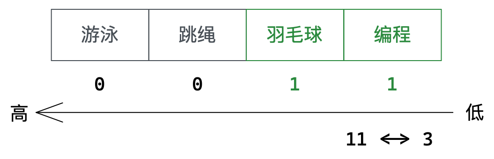

## 1. 数据类型

> 学习语言的时候首先就是学习数据类型，数据类型起着为变量合理分配空间的作用。数据库同样需要合理使用空间，其次还可以约束SQL语句的正确性，所以同样需要数据类型。

### 1.0. 数据类型分类

| 分类             | 数据类型                        | 解释                                 |
| ---------------- | ------------------------------- | ------------------------------------ |
| 数值类型         | **BIT (M)**                     | 位类型。M指定位数，默认为1，范围1-64 |
|                  | BOOL                            | 使用1或0表示真或假                   |
| 整型             | **TINYINT [UNSIGNED]**          | 相当于C语言中的char类型              |
|                  | SMALLINT [UNDIGNED]             | 相当于C语言中的short类型             |
|                  | **INT [UNSIGNED]**              | 相当于C语言中的int类型               |
|                  | BIGINT [UNSIGNED]               | 相当于C语言中的long long类型         |
| 小数类型         | **FLOAT [ (M, D) ] [UNSIGNED]** | 小数类型，M指定长度，D指定小数位数   |
|                  | DOUBLE [ (M, D) ] [UNSIGNED]    | 对应C的double类型，M长度，D小数位数  |
|                  | **DECIMAL (M, D) [UNSIGNED]**   | M长度，D小数位数                     |
| 文本、二进制类型 | **CHAR (SIZE)**                 | 定长字符串，最大长度255              |
|                  | **VARCHAR (SIZE)**              | 变长字符串，最大长度65536            |
|                  | BLOB                            | 二进制数据                           |
|                  | **TEXT**                        | 大文本，不支持全文索引，不支持默认值 |
| 时间日期         | **DATE / DATETIME / TIMESTAMP** | (yyyy-mm-dd) / (yyyy-mm-dd hh:mm:ss) |
| String 类型      | **ENUM**                        | 字符串对象                           |
|                  | **SET**                         | 字符串对象                           |

### 1.1. 数值类型


C语言给变量赋值超过其本身承受的大小，会自行截断。但SQL中当我们插入了类型大小范围之外的越界数据，SQL会直接拒绝。**数据类型的本质就是一种SQL对我们的约束**。

#### tinyint类型


- 在MySQL中，整型可以指定有无符号两种，默认是有符号的。可在类型之后指明`unsigned`以示无符号。

> 尽量不使用unsigned，对于有符号类型存不下不如提升至更大容量的类型。

#### bit类型

```mysql
bit[(M)] # 位字段类型。M表示每个值的位数，范围1-64。如果不带M默认为1。
```


MySQL5.7默认以ASCII字符显示，MySQL8.0默认以十六进制显示。

#### 小数类型

```mysql
float[(M, D)] [unsigned] # M指显示长度，D指小数位数，总大小4字节
```

- 比如 float(4,2) 表示的范围是：-99.99~99.99，MySQL在保存时会进行四舍五入。


- float(4,2) usigned 表示的范围是：0~99.99，并不会将正数范围扩大2倍。 

```mysql
decimal(m, d) [unsigned] # M指显示长度，D指小数位数
```


如果希望小数精度更高，推荐使用decimal。float表示最大精度为7位，decimal最大为30位。

> 如果D被省略默认为0，M默认为10。但最好不要省略，可能版本不一致会导致问题。

### 1.2. 字符串类型

#### char类型

```mysql
char(L) # 定长字符串 L是可以存储的字符长度，最大长度为255字符
```

字符和字节不一样，一个字符一定占一个字节，比如Unicode字符。

#### varchar类型

```mysql
varchar(L) # 变长字符串，L表示字符长度，最大为65536字节
```

- varchar最大长度是65536字节不是字符，char最大长度是255字符不是字节。

- varchar和char的`(L)`值的单位一样，都是字符长度。

- char 不管存储的数据如何，实际占用始终都是L个字符的大小，varchar 的实际占用和数据大小相关。定长和变长体现在实际存储大小。

> 可以理解成char类型就是C语言中的字符数据`char*`，varchar就是C++中的string容器。

- 如果数据长度一样就用定长char，如果变化就用变长varchar；
- 定长浪费空间但效率高，变长节省空间但效率低。

#### 日期和时间类型

常用的日期时间类型有三个：

| 类型      | 含义     | 格式                  | 解释                                   |
| --------- | -------- | --------------------- | -------------------------------------- |
| date      | 日期     | `yyyy-mm-dd`          | 占用三字节                             |
| datetime  | 日期时间 | `yyyy-mm-dd HH:ii:ss` | 表示范围从1000到9999，占用八字节       |
| timestamp | 时间戳   | `yyyy-mm-dd HH:ii:ss` | 只能表示从1970年开始的时间，占用四字节 |


- `date`和`datetime`的区别就是格式上的区别
- `timestamp`自动更新当前操作的时间，不需要手动设置。

> 设置日期时的输入格式比较宽松，最后都会转成标准格式。

### 1.3. enum和set类型

```mysql
# 枚举，单选类型
enum ('选项1', '选项2', '选项3', ...);
```

- 插入是必须插入规定的选项值，不允许其他值。


- 使用`enum`枚举类型，实际上在存储的时候使用 的是从1开始的数字字符。


> 规范使用，不推荐使用数字做插入筛选等操作。

```mysql
# 集合，多选类型
set  ('选项1', '选项2', '选项3', ...);
```

- enum枚举只能单选，但set集合类型可以多选。同样，set类型只能插入规定好的值。


如图所示，set类型由于能够表示多个选项，数字和选项不能单纯按顺序对应。


set类型存储时采用的是位图结构。从低到高每个比特位表示一个选项，比特位为1表示具有该选项，反之则没有。



- 单纯用`where xx='xx'`查询会严格筛选出只具有该选项的记录，若想要筛选出包含该选项的记录可以使用`find_in_set`。


&nbsp;

> 数据类型本质也就是一种约束，所谓约束可以理解为不满足条件就不允许操作。约束给予了表中的数据极大的确定性。

## 2. 表的约束

没有规矩不成方圆，MySQL为了让数据库表中的数据完整性一致性非常强，MySQL会给我们提供强约束。

### 2.1. 空属性

两个值：NULL和NOT NULL。MySQL中的NULL表示不存在、为空，和C语言中的NULL没有任何关系。

数据库字段默认一般都为空，但实际中需要尽量保证字段非空。设置了非空就不能不插入了。

设置`not null`方式如下：


### 2.2. 默认值

设置default可以避免该字段为空，不填自动设置为默认值。


> 如果一个字段即设置 not null 又设置 default，那么 not null 就失去作用了。

### 2.3. 列描述

列描述：comment 字段，没有实际意义，用来描述字段，相当于注释的作用。


### 2.4. zerofill

当我们创建一个`int`类型的字段时，MySQL会自动为我们添加一个`(11)`。如果我们没有设置zerofill属性，这个值是无意义的。

如果插入的数据低于指定的位数，就在前面补0，如果插入的数据超过了指定的位数，就正常显示，这就是zerofill的作用。只对显示结果调整，不影响存储结果。


### 2.5. 主键

数据库存储数据不是唯一的目的，还要考虑到提取数据。一般，**要求数据库表中的记录有一个特定的唯一标识，来表示唯一性**。

这个唯一的特定标识就是主键，类似于序号学号这样的唯一标识，可以根据主键来唯一地筛选出一条记录。

- 创建表并指定主键字段，主键字段不可重复。


- 为已存在字段删除主键约束

```mysql
alter table `tb_name` drop primary key; # 删除主键
```

> 只是为字段去掉主键约束，并不是删除整列。

- 为已存在字段追加主键

```mysql
alter table `tb_name` add primary key(`field`); # 追加主键
```

> 如果字段有重复值，会追加失败。

#### 复合主键

```mysql
create table `tb_name` (
	`field` datatype,
    primary key (`field`) # 设置复合主键
); 
```

如果想让多个字段合起来作为主键，就可以使用复合主键。也就是让多个字段联合在一起作为唯一标识，单个重复是无所谓的，只要不是多个字段一起冲突就行。


### 2.6. 自增长

被`auto_increment`设置的字段，可以不给值，会自动被系统从当前最大值加1设置到记录。一般自增长的字段都是作为主键。


- 自增长字段不用设置初始值，默认从1开始递增。
- 自增长字段也可以插入数据，只要不与已有数据重复即可。之后新增数据会从最大值开始递增。
- 被自增长的字段必须作为主键或者其他具有唯一性的键使用。

### 2.7. 唯一键

一张表中往往存在多个字段需要唯一，但主键只有一个，只能用唯一键解决这个问题。


- **唯一键和主键性质差不多，但唯一键允许为空，NULL表示没有不参与任何运算。如果将唯一键设置为不能为空则自动转换成主键。**
- **主键是用来保证整个表的记录的唯一性的，唯一键用来保证所设置的字段在业务上的唯一性。主键只能有一个，唯一键能设置多个。**

> 可以说，主键和唯一键并不冲突，他们不是用来对比的，只是负责数据在不同层面的唯一性。

### 2.8. 外键

外键用来将主表和从表之间建立关系，让从表和主表产生关联的字段就叫做外键。外键定义在从表上，一般外键就对应着主表的主键。

```mysql
create table `tb_name` (
    # ... ,
	foregin key (`field`) reference `tb_master`(`field`)
)
```


通过外键产生关系的表，除了在逻辑上有关联，MySQL也会维护该逻辑对用户操作产生约束。

> 比如班级表中得先有id为30的班级，才能在学生表中添加class_id为30的学生。
>
> 要删除班级表中id为20的班级，首先必须保证学生表中没有对应班级的学生。

对于数据库用户来说，外键是为了方便业务关联，对于MySQL来说，外键是为了产生对应的外键约束，保证数据的安全。


