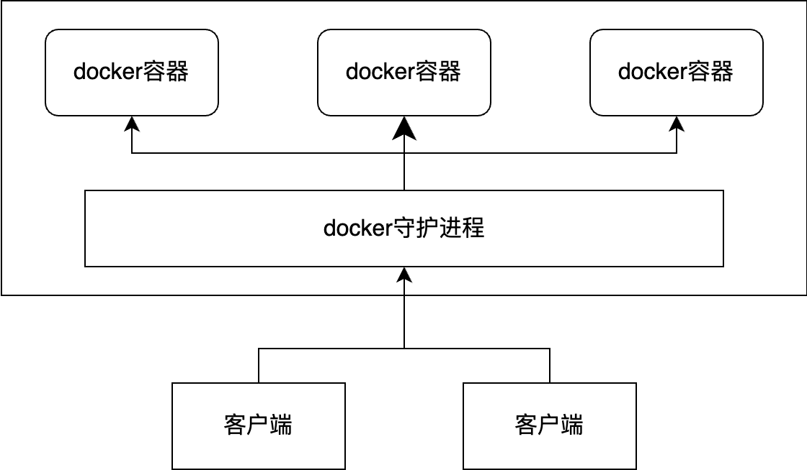

# Docker


| 组成               | 解释                                                         |
| ------------------ | ------------------------------------------------------------ |
| 镜像（image）      | docker镜像相当于模版，可通过镜像创建容器服务，一个镜像可以创建多个容器 |
| 容器（container）  | docker利用容器技术，独立运行多个应用                         |
| 仓库（repository） | 仓库用来存放镜像的地方，比如官方的dockerHub                  |

&nbsp;

## 1. docker安装卸载

```shell
### centos
# 卸载docker
$ yum remove docker \
        docker-client \
        docker-client-latest \
        docker-common \
        docker-latest \
        docker-latest-logrotate \
        docker-1ogrotate \
        docker-engine \
$ rm -rf /var/lib/docker

# 安装docker
$ yum install -y yum-utils
$ yum-config-manager \
	--add-repo
	http://mirros.aliyun.com/docker-ce/linux/centos/docker-ce.repo
$ yum makecache fast
$ yum install docker-ce docker-ce-li containerd.io

# 启动docker
$ systemctl start docker 

# ubuntu
# 卸载docker
$ apt remove docker docker-engine docker.io containerd runc

# 安装docker
$ apt update
$ apt install ca-certificates curl gnupg lsb-release
$ curl -fsSL http://mirrors.aliyun.com/docker-ce/linux/ubuntu/gpg | sudo apt-key add -
$ add-apt-repository "deb [arch=amd64] http://mirrors.aliyun.com/docker-ce/linux/ubuntu $(lsb_release -cs) stable"
$ apt install docker-ce docker-ce-cli containerd.io

# 启动docker
$ systemctl start docker
$ apt -y install apt-transport-https ca-certificates curl software-properties-common
$ service docker restart
```

```shell
$ docker version         # 查看docker版本
$ docker run hello-world # 启动hello-world服务
$ docker images          # 查看本地镜像
```

&nbsp;

## 2. Docker基本理解

### docker run 发生了什么？


### docker是怎么工作的？ 

Docker是一个 client-server 架构的系统，Docker-Server 守护进程运行在主机上，Docker-Client 通过网络访问服务端程序。




### docker为什么比虚拟机快？

1. Docker 有着比虚拟机更少的抽象层。

2. Docker利用的是宿主机的内核，而不需要Guest OS。


&nbsp;

## 3. docker常用命令

### 帮助命令

```shell
$ docker version
$ docker info
$ docker command -- help
```

### 镜像命令

#### 查看本地镜像

```shell
$ docker images
REPOSITORY    TAG       IMAGE ID       CREATED         SIZE
hello-world   latest    feb5d9fea6a5   16 months ago   13.3kB
# 仓库源       标签       镜像di         创建时间          镜像大小

Options:
  -a, --all             Show all images      # 显示所有镜像
  -q, --quiet           Only show image IDs  # 只显示id
```

#### 搜索镜像

```shell
$ docker search mysql
NAME          DESCRIPTION      STARS        OFFICIAL      AUTOMATED 
```

#### 拉取镜像

```shell
$ docker pull mysql[:tag]
Using default tag: latest
latest: Pulling from library/mysql
39fbafb6c7ef: Pull complete
76e9f8ca4fd7: Pull complete
1fcdd923e548: Pull complete
15716fe15a39: Pull complete
95c8bb47c8b9: Pull complete
b050c46cac02: Pull complete
7e19c22a3773: Pull complete
a2abd6d528f1: Pull complete
6aca593545a5: Pull complete
8a262a30fc7f: Pull complete
a1170ff1b1e9: Pull complete
Digest: sha256:19b05df6eb4b7ed6f274c0552f053ff0c00842a40dcf05941225c429a716683d
Status: Downloaded newer image for mysql:latest
docker.io/library/mysql:latest # 真实地址
```

#### 删除镜像

```shell
$ docker rmi name or id
$ docker rmi -f $(docker images -aq) # 删除所有镜像
```

### 容器命令

#### 运行容器

```shell
$ docker run [-options] iamges

# 参数
--name="name" # 容器名称
-d            # 后台方式运行，容器启动后没有任何服务运行，就会立即停止
-it           # 使用交互方式运行，进入容器查看内容
-p            # 指定容器端口 
	-p ip:主机端口:容器端口	
	-p 主机端口:容器端口
    -p 容器端口
-P            # 随机指定端口
```

#### 查看容器

```shell
$ docker ps # 现在正在运行的容器
CONTAINER ID   IMAGE     COMMAND   CREATED   STATUS    PORTS     NAMES
$ docker ps -a # 曾经运行的容器
CONTAINER ID   IMAGE     COMMAND   CREATED   STATUS    PORTS     NAMES
```

#### 退出容器

```shell
# 退出并关闭容器
$ exit
$ Ctrl + C
# 退出但不关闭容器
$ Ctrl + P + Q
```

#### 删除容器

```shell
$ docker rm container_id     # 删除容器
$ docker rm -f container_id  # 强制删除容器
$ docker rm $(docker ps -aq) # 删除所有容器
```

#### 启停容器

```shell
$ docker start   container_id  # 启动容器
$ docker restart container_id  # 重启容器
$ docker stop    container_id  # 停止容器
$ docker kill    container_id  # 停止关闭容器
```

### 其他命令

#### 查看日志

```shell
$ docker logs -tf --tail -number container_id # 查看日志
```

#### 查看容器中的进程

```shell
$ docker top container_id # 查看容器中的进程信息
UID         PID        PPID       C      TIME      TTY       TIME        CMD
root        76112      14761      0      16:46     ?         00:00:00    /bin/sh
```

#### 查看容器数据

```shell
$ docker inspect container_id # 查看镜像中的元数据
```

#### 进入容器

```shell
$ docker  exec -it container_id # 进入当前正在运行的容器，新起一个bash
```

#### 进入容器

```shell
$ docker attach container_id   # 进入当前正在运行的容器，使用正在运行的bash
```

#### 拷贝容器中的文件

```shell
$ docker cp container_id:src_path dst_path
```

#### 查看资源占用

```shell
$ docker stats
```

&nbsp;

## 4. docker镜像原理

### 镜像原理

UnionFS 联合文件系统是一种分层、轻量级并且高性能的文件系统，它把对文件系统的修改作为一次提交，来一层层的叠加。

> Docker镜像为什么要采用这种分层的结构呢？

最大的好处就是资源共享。

如果有多个镜像都从相同的Base镜像构建而来，那么宿主机只需在磁盘上保留一份base镜像，同时内存中也只需要加载一份base镜像，这样就可以为所有的容器服务了，而且镜像的每一层都可以被共享。

Docker 镜像都是只读的，当容器启动时，一个新的可写层被加载到镜像的顶部！这一层就是我们通常说的容器层，容器之下的都叫镜像层。

所有的 Docker 镜像都起始于一个基础镜像层，当进行修改或增加新的内容时，就会创建新的镜像层。

### 提交镜像

```shell
$ docker commit -m "commmit_info" -a="author" container_id dst_image_name[:tag]
```

commit 可以生成一份属于自己的镜像，可以保存修改的结果为镜像，相当于虚拟机的快照。

&nbsp;

## 5. 容器数据卷

数据都在容器中，如果删除容器数据就会丢失。我们需要容器内的文件挂载到宿主机文件系统中。

也就是容器的持久化和同步操作，此外容器间也是可以数据共享的。

### 挂载命令 -v

```shell
$ docker run -it -v host_path:container_path container image_name
```

```shell
$ docker inspect container_id # 查看挂载信息
...
"Mounts": [
    {
        "Type": "bind",
        "Source": "/root/home",
        "Destination": "/home",
        "Mode": "",
        "RW": true,
        "Propagation": "rprivate"
    }
],
...
```

指定路径后面，还可以指定权限。

```shell
$ docker run -it -v host_path:container_path:ro image_name # read_only  只读
$ docker run -it -v host_path:container_path:rw image_name # read_write 读写
```

### 匿名挂载

- 只指定容器目录，不指定本地挂载目录，称为匿名挂载。反之，指定卷名就是具名挂载。
- 指定宿主机路径（相对路径或者绝对路径）就是指定路径挂载。

### 查看挂载卷

```shell
$ docker volume ls
DRIVER    VOLUME NAME
local     734fb46b18190567e1de4591ae136003f5afd6ccdd7c6a69e973af478d00800b
local     named_volume_path
```

匿名挂载的卷，本地路径都放在：`var/lib/docker/volume/`目录下。

### 容器之间同步数据


```shell
$ docker run -it --v path                        --name container01 image_name
$ docker run -it --volumes-from container_name01 --name container02 image_name
```

数据可以一直存在，直到没有容器使用为止。同时也可以将其持久化到本地，就不用担心数据丢失的问题。

&nbsp;

## 6. DockerFile

Dockerfile 就是用来构建 docker 镜像的构建文件，本质就是脚本。

| 指令       | 解释                                   |
| ---------- | -------------------------------------- |
| FROM       | 指定基础镜像                           |
| MAINTAINER | 指定维护者信息                         |
| CMD        | 启动容器时运行的命令                   |
| ENTERPOINT |                                        |
| ADD        | 添加其他镜像                           |
| WORKDIR    | 指定工作目录                           |
| VOLUME     | 设置挂载目录                           |
| EXPOSE     | 指定对外的端口                         |
| RUN        | 构建镜像需要的命令                     |
| ONBUILD    | 构建一个被继承的镜像时，需要执行的执行 |
| COPY       | 将文件拷贝到景象中                     |
| ENV        | 设置构建时需要的环境变量               |


运行dockerfile。

```shell
$ docker build -f dockerfile -t image_name generate_path
```


&nbsp;

## 7. Docker网络原理
